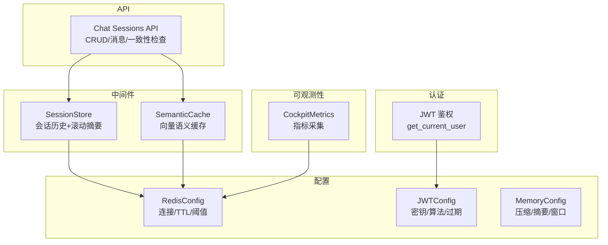
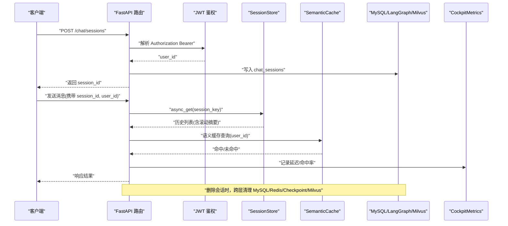
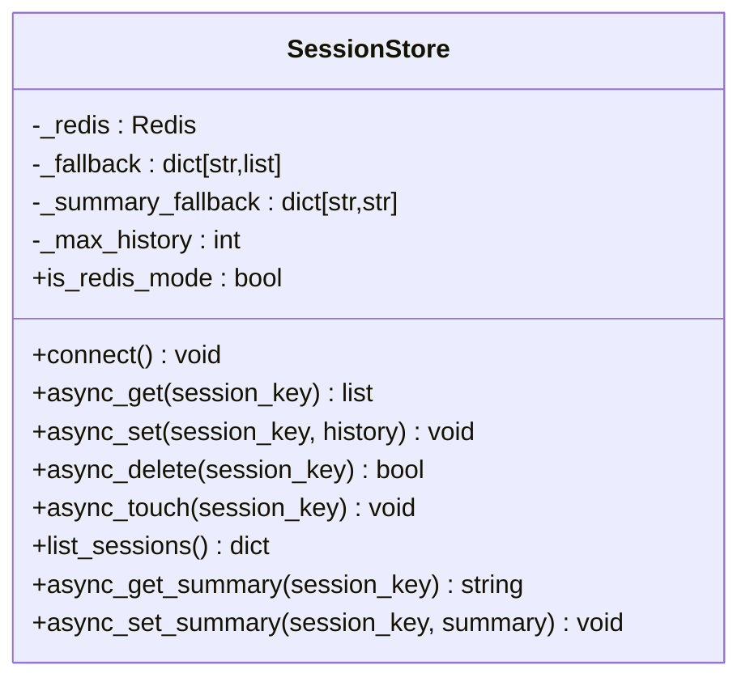
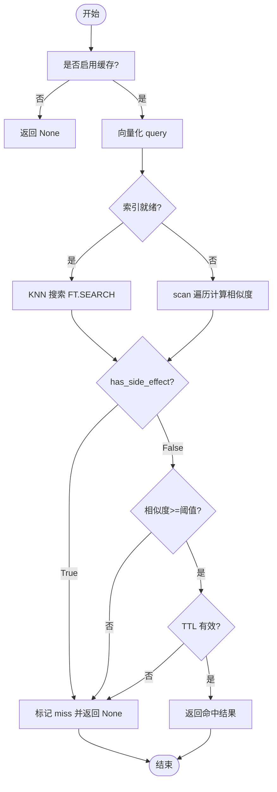
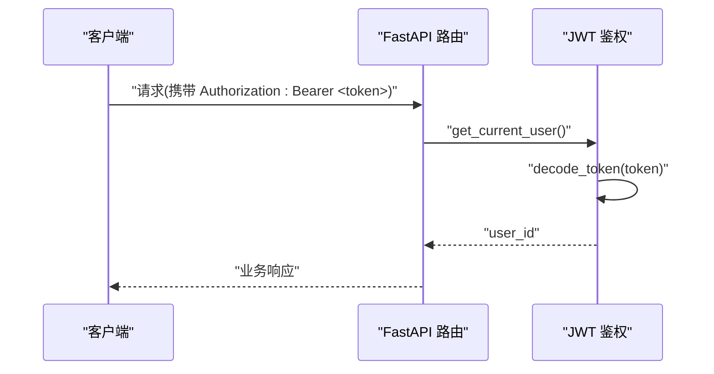
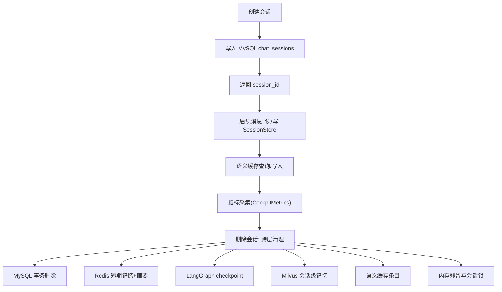
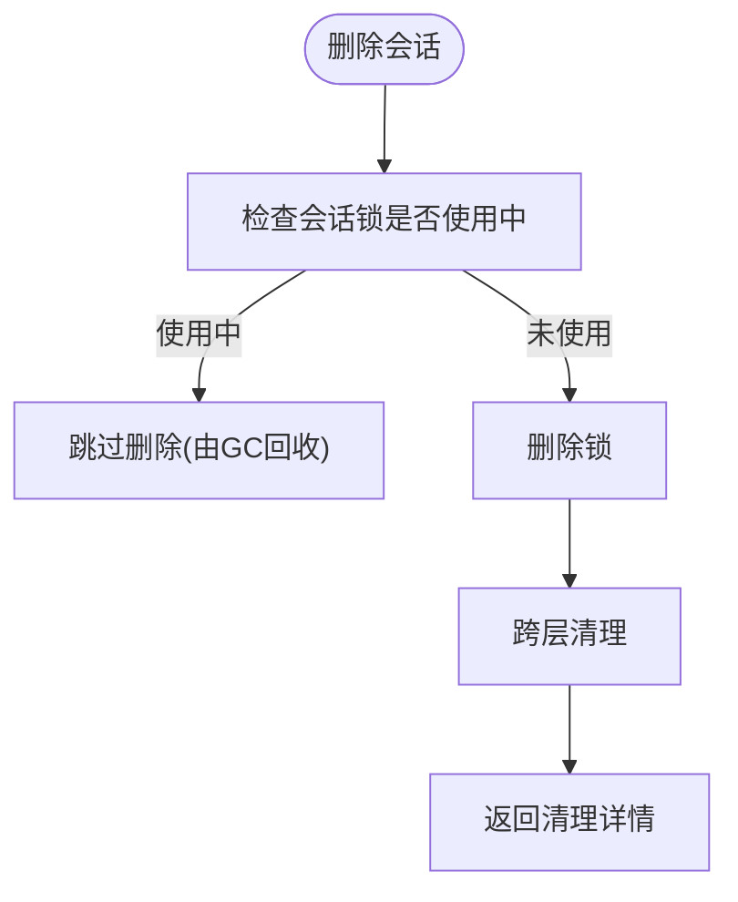
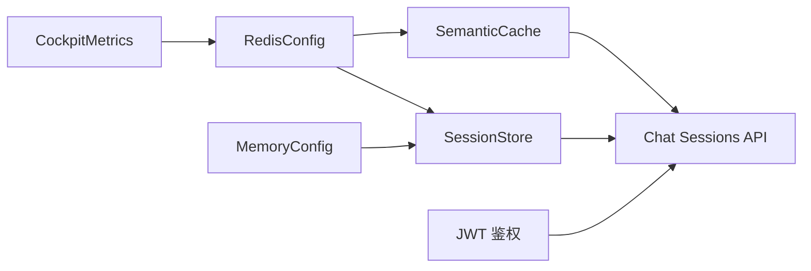

# 会话存储中间件

<cite>
**本文引用的文件**   
- [session_store.py](file://backend_design/nexus/middleware/session_store.py)
- [redis_cache.py](file://backend_design/nexus/middleware/redis_cache.py)
- [cache.py](file://backend_design/nexus/config/cache.py)
- [__init__.py](file://backend_design/nexus/config/__init__.py)
- [server.py](file://backend_design/nexus/config/server.py)
- [auth.py](file://backend_design/nexus/core/auth.py)
- [chat_sessions.py](file://backend_design/nexus/api/routes/chat_sessions.py)
- [cockpit_manager.py](file://backend_design/nexus/core/cockpit_manager.py)
- [data.py](file://backend_design/nexus/config/data.py)
- [cockpit_metrics.py](file://backend_design/nexus/observability/cockpit_metrics.py)
</cite>

## 目录
1. [简介](#简介)
2. [项目结构](#项目结构)
3. [核心组件](#核心组件)
4. [架构总览](#架构总览)
5. [详细组件分析](#详细组件分析)
6. [依赖关系分析](#依赖关系分析)
7. [性能考量](#性能考量)
8. [故障排查指南](#故障排查指南)
9. [结论](#结论)
10. [附录：API与使用示例](#附录api与使用示例)

## 简介
本文件为 NexusCockpit 的“会话存储中间件”提供系统化、可落地的技术文档。重点覆盖以下方面：
- Redis 持久化 + 内存降级的混合存储架构，确保高可用与数据一致性
- 会话数据的序列化/反序列化与滚动摘要（running_summary）同步机制
- 会话生命周期管理：创建、更新、过期清理、销毁流程
- 安全存储策略：敏感信息处理、访问控制与审计日志
- 与认证系统的集成：JWT 令牌验证与用户上下文绑定
- 并发控制：锁机制与数据一致性保证
- 监控指标：活跃会话数、内存占用、过期率等
- 性能优化建议与完整 API 使用示例（用户状态管理、偏好设置、多设备会话同步）

## 项目结构
围绕会话存储的关键代码分布在中间件、配置、认证、API 路由与可观测性模块中：
- 中间件层：会话存储（SessionStore）、语义缓存（SemanticCache）
- 配置层：Redis 连接与行为参数、服务器与 JWT 配置、记忆参数
- 认证层：JWT 签发与校验、当前用户获取
- API 层：会话 CRUD、消息查询、一致性自检
- 可观测性：座舱级指标采集（延迟、命中率、错误率）

图表来源
- [session_store.py:43-294](file://backend_design/nexus/middleware/session_store.py#L43-L294)
- [redis_cache.py:57-615](file://backend_design/nexus/middleware/redis_cache.py#L57-L615)
- [cache.py:15-41](file://backend_design/nexus/config/cache.py#L15-L41)
- [server.py:44-61](file://backend_design/nexus/config/server.py#L44-L61)
- [auth.py:35-140](file://backend_design/nexus/core/auth.py#L35-L140)
- [chat_sessions.py:58-534](file://backend_design/nexus/api/routes/chat_sessions.py#L58-L534)
- [cockpit_metrics.py:24-180](file://backend_design/nexus/observability/cockpit_metrics.py#L24-L180)

章节来源
- [session_store.py:1-294](file://backend_design/nexus/middleware/session_store.py#L1-L294)
- [redis_cache.py:1-615](file://backend_design/nexus/middleware/redis_cache.py#L1-L615)
- [cache.py:1-41](file://backend_design/nexus/config/cache.py#L1-L41)
- [__init__.py:84-167](file://backend_design/nexus/config/__init__.py#L84-L167)
- [server.py:1-61](file://backend_design/nexus/config/server.py#L1-L61)
- [auth.py:1-140](file://backend_design/nexus/core/auth.py#L1-L140)
- [chat_sessions.py:1-534](file://backend_design/nexus/api/routes/chat_sessions.py#L1-L534)
- [cockpit_manager.py:1-397](file://backend_design/nexus/core/cockpit_manager.py#L1-L397)
- [data.py:47-63](file://backend_design/nexus/config/data.py#L47-L63)
- [cockpit_metrics.py:1-180](file://backend_design/nexus/observability/cockpit_metrics.py#L1-L180)

## 核心组件
- SessionStore：基于 Redis 的会话历史与滚动摘要存储，具备内存降级能力；支持 TTL 自动续期、列表与删除、摘要读写。
- SemanticCache：基于 Redis 8 RediSearch KNN 的语义缓存，按 user_id 分片、TTL 分级、副作用隔离（车控指令不缓存）。
- 配置中心：集中管理 Redis 连接、语义缓存阈值/TTL、JWT 密钥/算法/过期、记忆压缩/摘要/窗口大小等。
- 认证模块：JWT 签发与校验，FastAPI 依赖注入当前用户 ID，用于会话与缓存的用户级隔离。
- Chat Sessions API：会话 CRUD、消息查询、一致性自检接口，串联 MySQL、Redis、LangGraph checkpoint、Milvus 等。
- CockpitMetrics：座舱级指标采集，记录对话、车控、错误、延迟与命中率，供实时监控与聚合。

章节来源
- [session_store.py:43-294](file://backend_design/nexus/middleware/session_store.py#L43-L294)
- [redis_cache.py:57-615](file://backend_design/nexus/middleware/redis_cache.py#L57-L615)
- [cache.py:15-41](file://backend_design/nexus/config/cache.py#L15-L41)
- [__init__.py:84-167](file://backend_design/nexus/config/__init__.py#L84-L167)
- [auth.py:35-140](file://backend_design/nexus/core/auth.py#L35-L140)
- [chat_sessions.py:58-534](file://backend_design/nexus/api/routes/chat_sessions.py#L58-L534)
- [cockpit_metrics.py:24-180](file://backend_design/nexus/observability/cockpit_metrics.py#L24-L180)

## 架构总览
下图展示从请求进入、认证、到会话存储与语义缓存的调用链，以及指标采集与一致性自检。

图表来源
- [chat_sessions.py:107-135](file://backend_design/nexus/api/routes/chat_sessions.py#L107-L135)
- [auth.py:85-122](file://backend_design/nexus/core/auth.py#L85-L122)
- [session_store.py:91-114](file://backend_design/nexus/middleware/session_store.py#L91-L114)
- [redis_cache.py:213-233](file://backend_design/nexus/middleware/redis_cache.py#L213-L233)
- [cockpit_metrics.py:38-64](file://backend_design/nexus/observability/cockpit_metrics.py#L38-L64)

## 详细组件分析

### SessionStore 组件分析
SessionStore 实现 Redis 优先、内存降级的会话历史与滚动摘要存储，关键特性：
- 会话历史键前缀：nexus:session:{session_key}
- 滚动摘要键前缀：nexus:summary:{session_key}
- TTL 默认 24 小时，可通过环境变量 SESSION_TTL_SECONDS 调整
- 每次读取自动续期 TTL，避免活跃会话被误删
- 截断策略：仅保留最近 max_history_len 条（来自 MemoryConfig.max_history_len）
- 异常路径：Redis 不可用时回退到内存 dict，保证服务可用

图表来源
- [session_store.py:43-294](file://backend_design/nexus/middleware/session_store.py#L43-L294)

章节来源
- [session_store.py:69-81](file://backend_design/nexus/middleware/session_store.py#L69-L81)
- [session_store.py:91-114](file://backend_design/nexus/middleware/session_store.py#L91-L114)
- [session_store.py:152-177](file://backend_design/nexus/middleware/session_store.py#L152-L177)
- [session_store.py:178-194](file://backend_design/nexus/middleware/session_store.py#L178-L194)
- [session_store.py:195-222](file://backend_design/nexus/middleware/session_store.py#L195-L222)
- [session_store.py:232-289](file://backend_design/nexus/middleware/session_store.py#L232-L289)
- [data.py:47-63](file://backend_design/nexus/config/data.py#L47-L63)

### SemanticCache 组件分析
SemanticCache 基于 Redis 8 RediSearch KNN 向量检索，O(log n) 复杂度，支持：
- 按 user_id 分片隔离
- TTL 分级（闲聊 1h、知识库 24h）
- 副作用隔离：has_side_effect=True 的响应永不写入缓存
- 兼容模式：FT.* 不可用时回退 O(n) scan 遍历

图表来源
- [redis_cache.py:213-233](file://backend_design/nexus/middleware/redis_cache.py#L213-L233)
- [redis_cache.py:235-301](file://backend_design/nexus/middleware/redis_cache.py#L235-L301)
- [redis_cache.py:303-365](file://backend_design/nexus/middleware/redis_cache.py#L303-L365)
- [redis_cache.py:367-436](file://backend_design/nexus/middleware/redis_cache.py#L367-L436)

章节来源
- [redis_cache.py:90-128](file://backend_design/nexus/middleware/redis_cache.py#L90-L128)
- [redis_cache.py:129-162](file://backend_design/nexus/middleware/redis_cache.py#L129-L162)
- [redis_cache.py:164-212](file://backend_design/nexus/middleware/redis_cache.py#L164-L212)
- [redis_cache.py:213-233](file://backend_design/nexus/middleware/redis_cache.py#L213-L233)
- [redis_cache.py:235-301](file://backend_design/nexus/middleware/redis_cache.py#L235-L301)
- [redis_cache.py:303-365](file://backend_design/nexus/middleware/redis_cache.py#L303-L365)
- [redis_cache.py:367-436](file://backend_design/nexus/middleware/redis_cache.py#L367-L436)
- [redis_cache.py:437-514](file://backend_design/nexus/middleware/redis_cache.py#L437-L514)
- [redis_cache.py:516-561](file://backend_design/nexus/middleware/redis_cache.py#L516-L561)
- [cache.py:15-41](file://backend_design/nexus/config/cache.py#L15-L41)

### 认证与用户上下文集成
- JWT 签发：包含 sub(user_id)、exp、iat，可选 extra_claims
- Token 解码：失败抛出 AuthError，统一转换为 HTTP 401
- FastAPI 依赖：get_current_user 从 Authorization 头提取并校验，返回 user_id
- 可选认证：get_optional_user 允许非强制认证场景

图表来源
- [auth.py:35-61](file://backend_design/nexus/core/auth.py#L35-L61)
- [auth.py:64-83](file://backend_design/nexus/core/auth.py#L64-L83)
- [auth.py:85-122](file://backend_design/nexus/core/auth.py#L85-L122)

章节来源
- [auth.py:35-140](file://backend_design/nexus/core/auth.py#L35-L140)
- [server.py:44-61](file://backend_design/nexus/config/server.py#L44-L61)

### 会话生命周期管理
- 创建：POST /chat/sessions，生成 session_id，写入 MySQL chat_sessions
- 更新：PATCH /chat/sessions/{id}/title，更新标题
- 读取：GET /chat/sessions/{id}/messages，拉取历史消息
- 删除：DELETE /chat/sessions/{id}，跨层清理 MySQL、Redis(SessionStore)、LangGraph checkpoint、Milvus 会话级记忆、语义缓存条目、内存残留与会话锁

图表来源
- [chat_sessions.py:107-135](file://backend_design/nexus/api/routes/chat_sessions.py#L107-L135)
- [chat_sessions.py:138-324](file://backend_design/nexus/api/routes/chat_sessions.py#L138-L324)
- [chat_sessions.py:327-373](file://backend_design/nexus/api/routes/chat_sessions.py#L327-L373)
- [chat_sessions.py:381-401](file://backend_design/nexus/api/routes/chat_sessions.py#L381-L401)
- [session_store.py:115-150](file://backend_design/nexus/middleware/session_store.py#L115-L150)

章节来源
- [chat_sessions.py:58-105](file://backend_design/nexus/api/routes/chat_sessions.py#L58-L105)
- [chat_sessions.py:107-135](file://backend_design/nexus/api/routes/chat_sessions.py#L107-L135)
- [chat_sessions.py:138-324](file://backend_design/nexus/api/routes/chat_sessions.py#L138-L324)
- [chat_sessions.py:327-373](file://backend_design/nexus/api/routes/chat_sessions.py#L327-L373)
- [chat_sessions.py:381-401](file://backend_design/nexus/api/routes/chat_sessions.py#L381-L401)

### 并发控制与数据一致性
- 会话级锁：在 chat.py 中通过 _session_locks 字典维护，删除会话时会尝试释放未使用的锁
- 原子性操作：Redis Lua 脚本用于限流与令牌桶，保证原子性与无污染
- 一致性自检：/chat/sessions/consistency-check 扫描孤立日志、僵尸缓存、僵尸快照、孤儿向量

图表来源
- [chat_sessions.py:264-280](file://backend_design/nexus/api/routes/chat_sessions.py#L264-L280)
- [rate_limiter.py:40-59](file://backend_design/nexus/middleware/rate_limiter.py#L40-L59)
- [rate_limiter.py:79-114](file://backend_design/nexus/middleware/rate_limiter.py#L79-L114)
- [chat_sessions.py:404-534](file://backend_design/nexus/api/routes/chat_sessions.py#L404-L534)

章节来源
- [chat_sessions.py:264-280](file://backend_design/nexus/api/routes/chat_sessions.py#L264-L280)
- [rate_limiter.py:117-203](file://backend_design/nexus/middleware/rate_limiter.py#L117-L203)
- [rate_limiter.py:212-277](file://backend_design/nexus/middleware/rate_limiter.py#L212-L277)
- [chat_sessions.py:404-534](file://backend_design/nexus/api/routes/chat_sessions.py#L404-L534)

### 安全存储策略
- 敏感信息加密：JWT secret_key 与算法由配置管理，Token 解码失败统一抛错
- 访问控制：所有需要认证的接口通过 get_current_user 注入 user_id，语义缓存按 user_id 分片
- 审计日志：座舱注册、初始化事件写入 MySQL audit_log；会话删除与一致性检查记录日志
- 副作用隔离：车控指令 has_side_effect=True 禁止写入语义缓存，防止误命中导致指令不执行

章节来源
- [auth.py:35-83](file://backend_design/nexus/core/auth.py#L35-L83)
- [redis_cache.py:367-436](file://backend_design/nexus/middleware/redis_cache.py#L367-L436)
- [cockpit_manager.py:283-294](file://backend_design/nexus/core/cockpit_manager.py#L283-L294)
- [chat_sessions.py:138-324](file://backend_design/nexus/api/routes/chat_sessions.py#L138-L324)

### 监控指标与性能优化
- 指标采集：对话次数、缓存命中/未命中、错误计数、平均延迟、车控成功率
- 活跃会话数：SessionStore.list_sessions 统计 Redis 中的会话键数量
- 内存占用：内存降级 dict 的大小与条目数（调试时可观察）
- 过期率：结合 TTL 与 Redis keyspace 统计（外部工具或自定义巡检）
- 优化建议：
  - 合理设置 MEMORY_MAX_HISTORY_LEN 与 SESSION_TTL_SECONDS
  - 开启 RediSearch KNN 索引以获得 O(log n) 检索
  - 对高频热点会话启用短 TTL 与自动续期
  - 定期运行一致性自检，清理僵尸数据

章节来源
- [cockpit_metrics.py:38-161](file://backend_design/nexus/observability/cockpit_metrics.py#L38-L161)
- [session_store.py:195-222](file://backend_design/nexus/middleware/session_store.py#L195-L222)
- [data.py:47-63](file://backend_design/nexus/config/data.py#L47-L63)
- [redis_cache.py:90-128](file://backend_design/nexus/middleware/redis_cache.py#L90-L128)

## 依赖关系分析
- SessionStore 依赖 RedisConfig.url 与 MemoryConfig.max_history_len
- SemanticCache 依赖 RedisConfig.cache_* 参数与 EmbeddingService
- Chat Sessions API 依赖数据库管理器、SessionStore、SemanticCache、LangGraph checkpoint、Milvus
- CockpitMetrics 依赖 Redis 管道批量写入 stats hash

图表来源
- [cache.py:15-41](file://backend_design/nexus/config/cache.py#L15-L41)
- [data.py:47-63](file://backend_design/nexus/config/data.py#L47-L63)
- [auth.py:85-122](file://backend_design/nexus/core/auth.py#L85-L122)
- [chat_sessions.py:107-135](file://backend_design/nexus/api/routes/chat_sessions.py#L107-L135)
- [cockpit_metrics.py:38-64](file://backend_design/nexus/observability/cockpit_metrics.py#L38-L64)

章节来源
- [__init__.py:84-167](file://backend_design/nexus/config/__init__.py#L84-L167)
- [cache.py:15-41](file://backend_design/nexus/config/cache.py#L15-L41)
- [data.py:47-63](file://backend_design/nexus/config/data.py#L47-L63)
- [auth.py:85-122](file://backend_design/nexus/core/auth.py#L85-L122)
- [chat_sessions.py:107-135](file://backend_design/nexus/api/routes/chat_sessions.py#L107-L135)
- [cockpit_metrics.py:38-64](file://backend_design/nexus/observability/cockpit_metrics.py#L38-L64)

## 性能考量
- Redis 连接与索引：确保 Redis 8+ 或 redis-stack-server，启用 FT.* 命令以获得 KNN 检索
- TTL 与续期：活跃会话自动续期，避免频繁重建；合理设置会话过期时间
- 向量维度：确保 embedding_dim 与模型输出一致，避免索引创建失败
- 限流与令牌桶：Lua 脚本原子性保障，避免超限污染计数器
- 指标采集：使用 pipeline 批量写入，降低网络往返开销

[本节为通用指导，不直接分析具体文件]

## 故障排查指南
- Redis 连接失败：SessionStore 与 SemanticCache 均会降级为内存模式或禁用缓存，检查 .env 与网络连通性
- 索引创建失败：SemanticCache 回退到 scan 模式，检查 Redis 版本与 FT.* 命令可用性
- 会话删除不一致：运行 /chat/sessions/consistency-check 扫描孤立数据，手动清理
- 车控指令缓存问题：确认 has_side_effect=True 的条目已被清理，必要时调用 purge_vehicle_command_cache
- 指标缺失：检查 CockpitMetrics 是否成功写入 Redis stats hash

章节来源
- [session_store.py:69-81](file://backend_design/nexus/middleware/session_store.py#L69-L81)
- [redis_cache.py:90-128](file://backend_design/nexus/middleware/redis_cache.py#L90-L128)
- [redis_cache.py:516-561](file://backend_design/nexus/middleware/redis_cache.py#L516-L561)
- [chat_sessions.py:404-534](file://backend_design/nexus/api/routes/chat_sessions.py#L404-L534)
- [cockpit_metrics.py:38-64](file://backend_design/nexus/observability/cockpit_metrics.py#L38-L64)

## 结论
NexusCockpit 的会话存储中间件以 Redis 为主、内存降级为辅，实现了高可用与强一致的会话管理。配合语义缓存、JWT 认证、并发锁与一致性自检，形成完整的会话生命周期闭环。通过合理的配置与监控，可在多实例部署下保持数据共享与性能稳定。

[本节为总结，不直接分析具体文件]

## 附录：API与使用示例
- 创建会话：POST /chat/sessions，返回 session_id
- 获取会话列表：GET /chat/sessions
- 获取会话消息：GET /chat/sessions/{id}/messages
- 更新会话标题：PATCH /chat/sessions/{id}/title
- 删除会话：DELETE /chat/sessions/{id}，跨层清理
- 一致性自检：GET /chat/sessions/consistency-check

使用示例（概念性描述）：
- 用户状态管理：通过 JWT 获取 user_id，将 user_id 作为语义缓存的分片键，确保用户间数据隔离
- 偏好设置存储：将用户偏好写入 Redis Hash（如 preferences:user_id），与会话独立存储
- 多设备会话同步：同一 session_id 在不同设备上共享 Redis 中的会话历史与滚动摘要，保证一致性

章节来源
- [chat_sessions.py:58-105](file://backend_design/nexus/api/routes/chat_sessions.py#L58-L105)
- [chat_sessions.py:107-135](file://backend_design/nexus/api/routes/chat_sessions.py#L107-L135)
- [chat_sessions.py:138-324](file://backend_design/nexus/api/routes/chat_sessions.py#L138-L324)
- [chat_sessions.py:327-373](file://backend_design/nexus/api/routes/chat_sessions.py#L327-L373)
- [chat_sessions.py:381-401](file://backend_design/nexus/api/routes/chat_sessions.py#L381-L401)
- [chat_sessions.py:404-534](file://backend_design/nexus/api/routes/chat_sessions.py#L404-L534)