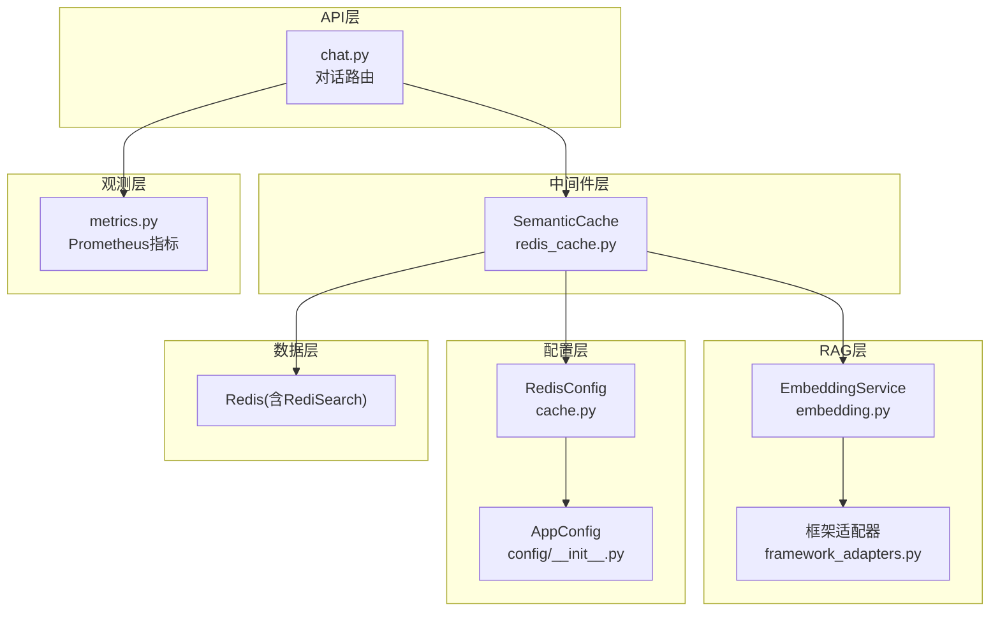
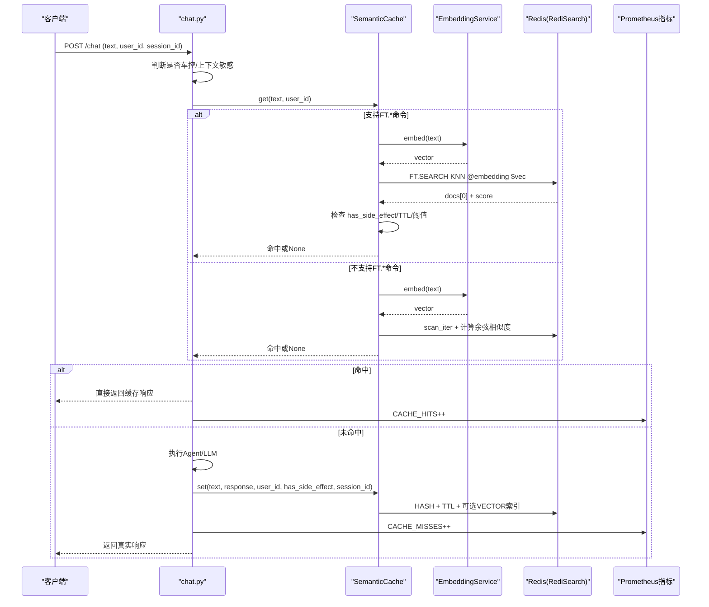
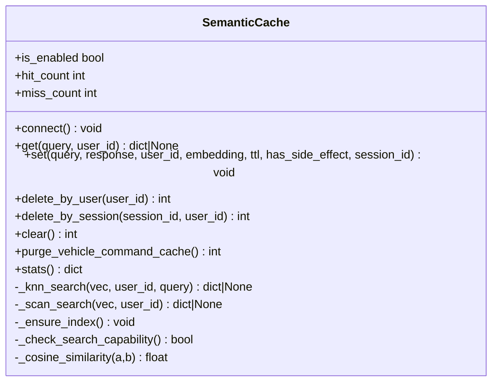
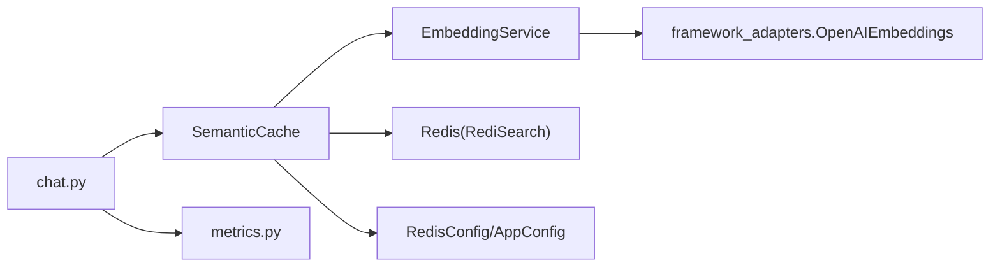

# 语义缓存中间件

<cite>
**本文引用的文件**   
- [backend_design/nexus/middleware/redis_cache.py](file://backend_design/nexus/middleware/redis_cache.py)
- [backend_design/nexus/config/cache.py](file://backend_design/nexus/config/cache.py)
- [backend_design/nexus/config/__init__.py](file://backend_design/nexus/config/__init__.py)
- [backend_design/nexus/rag/embedding.py](file://backend_design/nexus/rag/embedding.py)
- [backend_design/nexus/rag/framework_adapters.py](file://backend_design/nexus/rag/framework_adapters.py)
- [backend_design/nexus/intent/constants.py](file://backend_design/nexus/intent/constants.py)
- [backend_design/nexus/api/routes/chat.py](file://backend_design/nexus/api/routes/chat.py)
- [backend_design/nexus/observability/metrics.py](file://backend_design/nexus/observability/metrics.py)
</cite>

## 目录
1. [简介](#简介)
2. [项目结构](#项目结构)
3. [核心组件](#核心组件)
4. [架构总览](#架构总览)
5. [详细组件分析](#详细组件分析)
6. [依赖关系分析](#依赖关系分析)
7. [性能与调优](#性能与调优)
8. [故障排查指南](#故障排查指南)
9. [结论](#结论)
10. [附录：配置与扩展](#附录配置与扩展)

## 简介
本文件为 NexusCockpit 的“语义缓存中间件”提供系统化、可落地的技术文档。该中间件基于 Redis 8 的 RediSearch KNN 向量检索，结合文本嵌入生成与相似度阈值匹配，实现面向用户分片的智能缓存；同时通过车控指令安全隔离（副作用响应不缓存）、上下文敏感查询跳过、TTL 分级与内存清理策略，保障高命中率与低延迟。文档覆盖缓存键设计、数据结构、RAG 集成、预热与冷启动、监控指标与调优建议，并提供配置示例与扩展方法。

## 项目结构
语义缓存相关代码主要分布在以下模块：
- 中间件实现：Redis 语义缓存类与索引管理、KNN/Scan 双路径检索、会话/用户级清理
- 配置中心：Redis 连接参数与语义缓存开关、阈值、TTL 等
- 嵌入服务：统一向量化接口，适配 LangChain OpenAIEmbeddings
- 意图常量：车控关键词集合，用于旧缓存清理与安全拦截
- API 路由：对话接口中缓存命中/写入流程、指标上报
- 观测指标：Prometheus 计数器与直方图，暴露缓存命中/未命中等指标

图表来源
- [backend_design/nexus/api/routes/chat.py](file://backend_design/nexus/api/routes/chat.py)
- [backend_design/nexus/middleware/redis_cache.py](file://backend_design/nexus/middleware/redis_cache.py)
- [backend_design/nexus/rag/embedding.py](file://backend_design/nexus/rag/embedding.py)
- [backend_design/nexus/rag/framework_adapters.py](file://backend_design/nexus/rag/framework_adapters.py)
- [backend_design/nexus/config/cache.py](file://backend_design/nexus/config/cache.py)
- [backend_design/nexus/config/__init__.py](file://backend_design/nexus/config/__init__.py)
- [backend_design/nexus/observability/metrics.py](file://backend_design/nexus/observability/metrics.py)

章节来源
- [backend_design/nexus/middleware/redis_cache.py](file://backend_design/nexus/middleware/redis_cache.py)
- [backend_design/nexus/config/cache.py](file://backend_design/nexus/config/cache.py)
- [backend_design/nexus/config/__init__.py](file://backend_design/nexus/config/__init__.py)
- [backend_design/nexus/rag/embedding.py](file://backend_design/nexus/rag/embedding.py)
- [backend_design/nexus/rag/framework_adapters.py](file://backend_design/nexus/rag/framework_adapters.py)
- [backend_design/nexus/intent/constants.py](file://backend_design/nexus/intent/constants.py)
- [backend_design/nexus/api/routes/chat.py](file://backend_design/nexus/api/routes/chat.py)
- [backend_design/nexus/observability/metrics.py](file://backend_design/nexus/observability/metrics.py)

## 核心组件
- SemanticCache（语义缓存）
  - 功能：连接 Redis、创建/检测 RediSearch VECTOR 索引、KNN 向量检索、Fallback Scan 遍历、TTL 校验、用户/会话维度清理、统计信息
  - 关键特性：按 user_id 分片、车控指令安全隔离（has_side_effect）、相似度阈值过滤、索引就绪状态自适应
- EmbeddingService（嵌入服务）
  - 功能：单条/批量异步向量化，封装异常与降级，返回固定维度向量
- 配置（RedisConfig/AppConfig）
  - 功能：语义缓存开关、相似度阈值、TTL、Redis 连接 URL 构建
- API 路由（chat.py）
  - 功能：在请求链路中执行“先查缓存→命中则快速返回→否则走 Agent→写缓存”的流程，并上报指标

章节来源
- [backend_design/nexus/middleware/redis_cache.py](file://backend_design/nexus/middleware/redis_cache.py)
- [backend_design/nexus/rag/embedding.py](file://backend_design/nexus/rag/embedding.py)
- [backend_design/nexus/config/cache.py](file://backend_design/nexus/config/cache.py)
- [backend_design/nexus/config/__init__.py](file://backend_design/nexus/config/__init__.py)
- [backend_design/nexus/api/routes/chat.py](file://backend_design/nexus/api/routes/chat.py)

## 架构总览
语义缓存中间件在对话请求中的位置与交互如下：

图表来源
- [backend_design/nexus/api/routes/chat.py](file://backend_design/nexus/api/routes/chat.py)
- [backend_design/nexus/middleware/redis_cache.py](file://backend_design/nexus/middleware/redis_cache.py)
- [backend_design/nexus/rag/embedding.py](file://backend_design/nexus/rag/embedding.py)
- [backend_design/nexus/observability/metrics.py](file://backend_design/nexus/observability/metrics.py)

## 详细组件分析

### 语义缓存类 SemanticCache
- 连接与能力探测
  - 自动检测 Redis 是否支持 FT.* 命令（MODULE LIST 与 FT._LIST 双重探测），决定使用 KNN 或 Scan 模式
  - 若失败则禁用缓存或降级为 O(n) 扫描
- 索引管理
  - 使用 RediSearch 创建 HASH 类型索引，字段包含 query、user_id、session_id、timestamp、embedding（FLOAT32/COSINE）
  - 前缀命名空间：nexus:cache:entry:*
  - 向量维度从配置动态获取，确保与 EmbeddingService 输出一致
- 查询流程
  - KNN 模式：构造过滤表达式（user_id），返回最近邻，将 COSINE 距离转换为相似度 1 - distance，再与阈值比较
  - Scan 模式：遍历 nexus:cache:entry:*，逐条解析 embedding（JSON），计算余弦相似度，取最高分并阈值过滤
  - 安全检查：has_side_effect=True 的条目永远不返回（防车控指令被缓存后不执行）
  - TTL 校验：超过 cache_ttl 视为过期
- 写入流程
  - 有副作用的响应禁止写入缓存
  - 存储字段：query（截断）、response（JSON）、user_id、session_id、embedding（KNN存bytes，Scan存JSON）、timestamp、has_side_effect
  - 设置 TTL
- 清理与统计
  - delete_by_user、delete_by_session、clear、purge_vehicle_command_cache（清理历史错误车控缓存）
  - stats() 返回 hits、misses、hit_rate、size、index_ready

图表来源
- [backend_design/nexus/middleware/redis_cache.py](file://backend_design/nexus/middleware/redis_cache.py)

章节来源
- [backend_design/nexus/middleware/redis_cache.py](file://backend_design/nexus/middleware/redis_cache.py)

### 嵌入服务 EmbeddingService
- 统一接口：embed()/embed_batch()/embed_async()
- 内部委托给 LangChain OpenAIEmbeddings，具备连接池、重试、异步与批量能力
- 维度由配置 llm.embedding_dim 控制，异常时抛出 LLMError

章节来源
- [backend_design/nexus/rag/embedding.py](file://backend_design/nexus/rag/embedding.py)
- [backend_design/nexus/rag/framework_adapters.py](file://backend_design/nexus/rag/framework_adapters.py)
- [backend_design/nexus/config/__init__.py](file://backend_design/nexus/config/__init__.py)

### 配置系统 RedisConfig/AppConfig
- RedisConfig 提供 host/port/password/db、语义缓存开关、相似度阈值、TTL
- AppConfig 聚合所有子系统配置，提供 get_config() 全局单例与快捷访问函数

章节来源
- [backend_design/nexus/config/cache.py](file://backend_design/nexus/config/cache.py)
- [backend_design/nexus/config/__init__.py](file://backend_design/nexus/config/__init__.py)

### API 路由 chat.py 中的缓存集成
- 查询阶段：
  - 判断是否车控指令或上下文敏感（天气/附近/推荐等），若是则跳过缓存
  - 调用 cache.get(text, user_id)，命中则直接返回并上报 CACHE_HITS
- 写入阶段：
  - 非上下文敏感且无副作用的响应才写入缓存
  - 记录 session_id 以便会话级清理
- 指标上报：
  - CACHE_HITS/CACHE_MISSES 计数器
  - REQUEST_COUNT/REQUEST_LATENCY 直方图

章节来源
- [backend_design/nexus/api/routes/chat.py](file://backend_design/nexus/api/routes/chat.py)
- [backend_design/nexus/observability/metrics.py](file://backend_design/nexus/observability/metrics.py)

### 意图常量与车控安全
- VEHICLE_CACHE_KEYWORDS：用于清理旧的车控缓存条目
- VEHICLE_INTENT_KEYS：启发式识别车控指令，避免误命中缓存

章节来源
- [backend_design/nexus/intent/constants.py](file://backend_design/nexus/intent/constants.py)

## 依赖关系分析
- SemanticCache 依赖：
  - EmbeddingService：生成 query 向量
  - Redis（含 RediSearch）：存储与 KNN 检索
  - 配置中心：读取缓存开关、阈值、TTL、向量维度
- EmbeddingService 依赖：
  - framework_adapters：OpenAIEmbeddings 实例化
  - 配置中心：embedding_model、dimensions、base_url、api_key
- API 路由依赖：
  - SemanticCache：查询与写入
  - metrics：上报缓存命中/未命中与请求延迟

图表来源
- [backend_design/nexus/api/routes/chat.py](file://backend_design/nexus/api/routes/chat.py)
- [backend_design/nexus/middleware/redis_cache.py](file://backend_design/nexus/middleware/redis_cache.py)
- [backend_design/nexus/rag/embedding.py](file://backend_design/nexus/rag/embedding.py)
- [backend_design/nexus/rag/framework_adapters.py](file://backend_design/nexus/rag/framework_adapters.py)
- [backend_design/nexus/observability/metrics.py](file://backend_design/nexus/observability/metrics.py)
- [backend_design/nexus/config/cache.py](file://backend_design/nexus/config/cache.py)
- [backend_design/nexus/config/__init__.py](file://backend_design/nexus/config/__init__.py)

章节来源
- [backend_design/nexus/middleware/redis_cache.py](file://backend_design/nexus/middleware/redis_cache.py)
- [backend_design/nexus/rag/embedding.py](file://backend_design/nexus/rag/embedding.py)
- [backend_design/nexus/rag/framework_adapters.py](file://backend_design/nexus/rag/framework_adapters.py)
- [backend_design/nexus/api/routes/chat.py](file://backend_design/nexus/api/routes/chat.py)
- [backend_design/nexus/observability/metrics.py](file://backend_design/nexus/observability/metrics.py)
- [backend_design/nexus/config/cache.py](file://backend_design/nexus/config/cache.py)
- [backend_design/nexus/config/__init__.py](file://backend_design/nexus/config/__init__.py)

## 性能与调优
- 相似度阈值
  - 默认 0.92，可通过 SEMANTIC_CACHE_SIMILARITY_THRESHOLD 调整
  - 过高降低命中率，过低增加误命中风险
- TTL 管理
  - 默认 3600s，可通过 SEMANTIC_CACHE_TTL_SECONDS 调整
  - 针对知识库场景可适当延长，闲聊场景保持较短
- 索引模式选择
  - Redis 8+ 内置 Query Engine，优先使用 KNN 模式（O(log n)）
  - 若 FT.* 不可用，回退到 Scan 模式（O(n)），需关注数据量增长
- 内存与清理
  - 定期调用 purge_vehicle_command_cache 清理旧车控缓存
  - 使用 delete_by_user/delete_by_session 进行精准清理
  - clear 可用于全量清空
- 监控指标
  - CACHE_HITS/CACHE_MISSES：命中率与未命中趋势
  - REQUEST_LATENCY：整体请求延迟分布
  - 自定义 stats() 可观察 index_ready、size、hit_rate

章节来源
- [backend_design/nexus/config/cache.py](file://backend_design/nexus/config/cache.py)
- [backend_design/nexus/middleware/redis_cache.py](file://backend_design/nexus/middleware/redis_cache.py)
- [backend_design/nexus/observability/metrics.py](file://backend_design/nexus/observability/metrics.py)

## 故障排查指南
- Redis 连接失败
  - 现象：connect() 捕获异常，缓存被禁用
  - 处理：检查 REDIS_HOST/PORT/PASSWORD/DB，确认网络连通性
- FT.* 命令不可用
  - 现象：_check_search_capability() 返回 False，进入 Scan 模式
  - 处理：升级至 Redis 8+ 或使用 redis-stack-server 镜像
- 索引创建失败
  - 现象：_ensure_index() 抛异常，index_ready=False
  - 处理：检查权限、字段维度是否与 embedding_dim 一致
- 车控指令仍命中缓存
  - 现象：旧缓存 has_side_effect=False 或缺失
  - 处理：运行 purge_vehicle_command_cache 清理，并确保新写入 has_side_effect=True 时禁止缓存
- 嵌入服务异常
  - 现象：embed() 抛出 LLMError
  - 处理：检查 embedding_model、dimensions、base_url、api_key 配置

章节来源
- [backend_design/nexus/middleware/redis_cache.py](file://backend_design/nexus/middleware/redis_cache.py)
- [backend_design/nexus/rag/embedding.py](file://backend_design/nexus/rag/embedding.py)
- [backend_design/nexus/config/cache.py](file://backend_design/nexus/config/cache.py)

## 结论
语义缓存中间件通过“向量相似度 + 阈值过滤 + 安全隔离 + TTL/清理”的组合策略，在保证安全性的前提下显著提升热点问答的命中率与响应速度。配合 Prometheus 指标与日志，可实现端到端可观测与持续调优。建议在上线前完成索引能力探测、阈值校准与清理策略验证，并在生产环境启用 KNN 模式以获得最佳性能。

## 附录：配置与扩展

### 配置项说明
- 连接与开关
  - REDIS_HOST、REDIS_PORT、REDIS_PASSWORD、REDIS_DB：Redis 连接参数
  - SEMANTIC_CACHE_ENABLED：是否启用语义缓存
- 行为参数
  - SEMANTIC_CACHE_SIMILARITY_THRESHOLD：相似度阈值（默认 0.92）
  - SEMANTIC_CACHE_TTL_SECONDS：缓存过期时间（默认 3600s）
- 嵌入模型
  - embedding_model、embedding_dim、ark_base_url、ark_api_key：由 LLMConfig 提供，供 EmbeddingService 使用

章节来源
- [backend_design/nexus/config/cache.py](file://backend_design/nexus/config/cache.py)
- [backend_design/nexus/config/__init__.py](file://backend_design/nexus/config/__init__.py)

### 缓存键设计与数据结构
- 键前缀：nexus:cache:entry:{uuid}
- 字段映射（HASH）
  - query：原始查询（截断）
  - response：JSON 序列化后的响应体
  - user_id：用户 ID（TAG）
  - session_id：会话 ID（TAG）
  - timestamp：写入时间戳（NumericField）
  - embedding：向量（KNN模式存bytes，Scan模式存JSON数组）
  - has_side_effect：副作用标记（True 表示不缓存/不返回）

章节来源
- [backend_design/nexus/middleware/redis_cache.py](file://backend_design/nexus/middleware/redis_cache.py)

### RAG 集成与相似度算法
- 嵌入模型：LangChain OpenAIEmbeddings，支持本地 bge-m3 或云端 API
- 相似度算法：COSINE（RediSearch VectorField 配置），查询时将距离转换为相似度 1 - distance
- 维度对齐：通过配置 llm.embedding_dim 保证向量维度一致

章节来源
- [backend_design/nexus/rag/framework_adapters.py](file://backend_design/nexus/rag/framework_adapters.py)
- [backend_design/nexus/middleware/redis_cache.py](file://backend_design/nexus/middleware/redis_cache.py)

### 缓存预热、冷启动与故障恢复
- 预热
  - 可在服务启动后对高频问题批量调用 cache.set() 预填充
- 冷启动
  - 首次连接时自动探测 FT.* 能力并创建索引
  - 若失败则降级为 Scan 模式，保证可用性
- 故障恢复
  - Redis 不可用时自动禁用缓存
  - 索引创建失败时记录警告并降级
  - 车控指令安全修复后，通过 purge_vehicle_command_cache 清理历史错误条目

章节来源
- [backend_design/nexus/middleware/redis_cache.py](file://backend_design/nexus/middleware/redis_cache.py)

### 监控指标与可视化
- 指标定义
  - CACHE_HITS：缓存命中总数
  - CACHE_MISSES：缓存未命中总数
  - REQUEST_COUNT：请求总量（endpoint/method/status）
  - REQUEST_LATENCY：请求延迟分布
- 可视化
  - 通过 Prometheus 抓取，Grafana 展示看板

章节来源
- [backend_design/nexus/observability/metrics.py](file://backend_design/nexus/observability/metrics.py)

### 自定义扩展方法
- 替换嵌入服务
  - 注入自定义 EmbeddingService 实现，保持 embed()/embed_batch() 接口一致
- 自定义相似度算法
  - 在 _knn_search/_scan_search 中替换相似度计算逻辑（如内积、欧氏距离）
- 自定义清理策略
  - 扩展 delete_by_* 方法，按业务维度（设备、租户）清理
- 自定义阈值与 TTL
  - 根据业务场景动态调整 cache_similarity_threshold 与 cache_ttl

章节来源
- [backend_design/nexus/middleware/redis_cache.py](file://backend_design/nexus/middleware/redis_cache.py)
- [backend_design/nexus/rag/embedding.py](file://backend_design/nexus/rag/embedding.py)