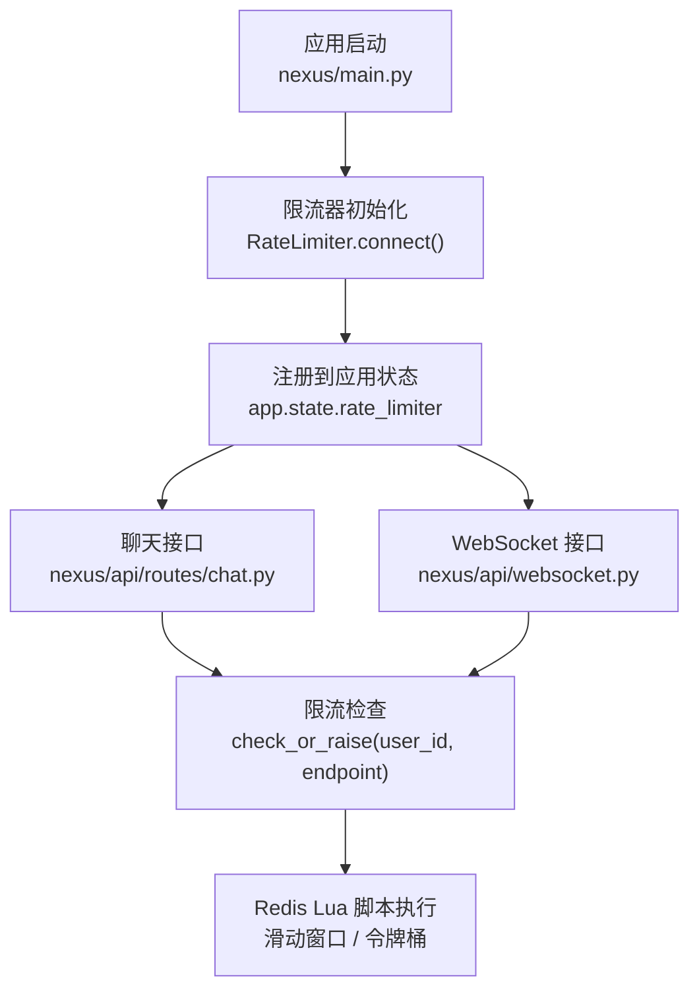
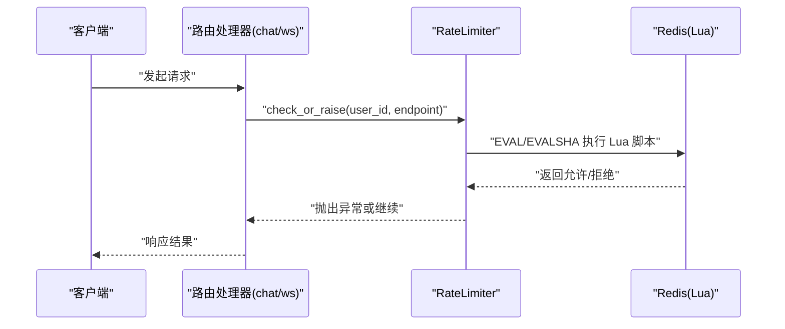
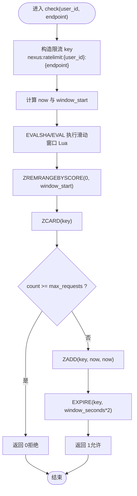
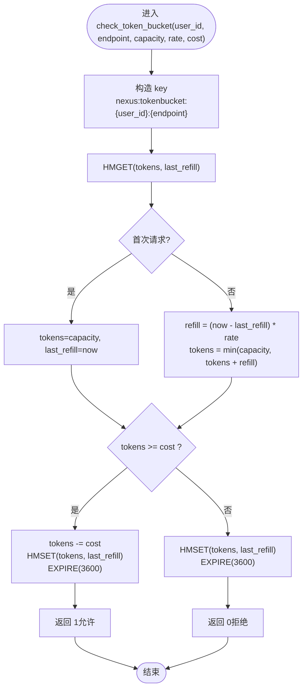
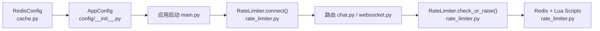

# 限流中间件

<cite>
**本文引用的文件**   
- [rate_limiter.py](file://backend_design/nexus/middleware/rate_limiter.py)
- [main.py](file://backend_design/nexus/main.py)
- [chat.py](file://backend_design/nexus/api/routes/chat.py)
- [websocket.py](file://backend_design/nexus/api/websocket.py)
- [cache.py](file://backend_design/nexus/config/cache.py)
- [__init__.py](file://backend_design/nexus/config/__init__.py)
- [metrics.py](file://backend_design/nexus/observability/metrics.py)
</cite>

## 目录
1. [简介](#简介)
2. [项目结构](#项目结构)
3. [核心组件](#核心组件)
4. [架构总览](#架构总览)
5. [详细组件分析](#详细组件分析)
6. [依赖关系分析](#依赖关系分析)
7. [性能与调优](#性能与调优)
8. [故障排查指南](#故障排查指南)
9. [结论](#结论)
10. [附录：使用示例与最佳实践](#附录使用示例与最佳实践)

## 简介
本文件为 NexusCockpit 的限流中间件提供系统化、可操作的文档。内容覆盖基于 Redis 的分布式限流实现，包括滑动窗口算法与令牌桶算法两种策略；Lua 脚本的原子性保证（ZREMRANGEBYSCORE、ZADD、ZCARD、HMGET/HMSET、EXPIRE 等）；限流配置参数（max_requests、window_seconds、capacity、rate）的作用与调优方法；限流 key 的设计模式与命名规范；降级策略（Redis 不可用时放行）与错误处理机制；监控指标与性能优化建议；以及 API 限流、用户级限流、端点级限流的完整使用场景与示例路径。

## 项目结构
限流中间件位于后端模块的 middleware 层，通过应用启动流程注入到全局状态，并在聊天与 WebSocket 路由中调用。

图表来源 
- [main.py:157-159](file://backend_design/nexus/main.py#L157-L159)
- [chat.py:348-350](file://backend_design/nexus/api/routes/chat.py#L348-L350)
- [websocket.py:141-144](file://backend_design/nexus/api/websocket.py#L141-L144)

章节来源
- [main.py:157-159](file://backend_design/nexus/main.py#L157-L159)
- [chat.py:348-350](file://backend_design/nexus/api/routes/chat.py#L348-L350)
- [websocket.py:141-144](file://backend_design/nexus/api/websocket.py#L141-L144)

## 核心组件
- RateLimiter：封装 Redis 连接、Lua 脚本加载与限流判定逻辑，支持滑动窗口与令牌桶两种策略。
- 配置中心：RedisConfig 提供连接 URL 与缓存相关开关；AppConfig 聚合所有子系统配置。
- 集成点：应用启动时创建并注入 RateLimiter；聊天与 WebSocket 路由在业务前进行限流检查。

章节来源
- [rate_limiter.py:117-155](file://backend_design/nexus/middleware/rate_limiter.py#L117-L155)
- [cache.py:15-41](file://backend_design/nexus/config/cache.py#L15-L41)
- [__init__.py:84-132](file://backend_design/nexus/config/__init__.py#L84-L132)

## 架构总览
限流中间件以“应用启动注入 + 路由前置校验”的方式工作，核心由 Redis Lua 脚本保障原子性与一致性。

图表来源 
- [chat.py:348-350](file://backend_design/nexus/api/routes/chat.py#L348-L350)
- [websocket.py:141-144](file://backend_design/nexus/api/websocket.py#L141-L144)
- [rate_limiter.py:156-211](file://backend_design/nexus/middleware/rate_limiter.py#L156-L211)

## 详细组件分析

### 滑动窗口限流（ZSET 时间戳集合）
- 设计要点
  - 使用有序集合 ZSET 存储每个请求的时间戳作为 score/member。
  - 每次请求先清理窗口外的旧条目（ZREMRANGEBYSCORE），再统计当前窗口内数量（ZCARD）。
  - 若未超限则添加当前时间戳（ZADD），并设置过期时间（EXPIRE）确保内存回收。
  - 超限时不写入计数，避免污染后续合法请求的判断。
- 关键命令
  - ZREMRANGEBYSCORE：清理窗口外旧记录
  - ZCARD：统计窗口内请求数
  - ZADD：添加当前请求时间戳
  - EXPIRE：设置 key 过期时间（窗口大小的 2 倍）
- 原子性保证
  - 上述操作全部在单个 Lua 脚本中执行，避免并发竞态条件。

图表来源 
- [rate_limiter.py:40-59](file://backend_design/nexus/middleware/rate_limiter.py#L40-L59)
- [rate_limiter.py:156-211](file://backend_design/nexus/middleware/rate_limiter.py#L156-L211)

章节来源
- [rate_limiter.py:40-59](file://backend_design/nexus/middleware/rate_limiter.py#L40-L59)
- [rate_limiter.py:156-211](file://backend_design/nexus/middleware/rate_limiter.py#L156-L211)

### 令牌桶限流（哈希表存储 tokens + last_refill）
- 设计要点
  - 使用 HASH 存储剩余令牌数与上次补充时间。
  - 每次请求根据 elapsed = now - last_refill 计算 refill = elapsed * rate，并对 tokens 做容量上限限制。
  - 若 tokens >= cost 则扣减并更新 last_refill，否则仅更新时间但不消耗令牌。
  - 适合 LLM API 调用限流：允许突发流量但长期速率受限。
- 关键命令
  - HMGET/HMSET：读取与更新桶状态
  - EXPIRE：设置桶 key 过期时间（默认 1 小时）
- 原子性保证
  - 整个补牌与扣减逻辑在单个 Lua 脚本中完成，避免并发问题。

图表来源 
- [rate_limiter.py:79-114](file://backend_design/nexus/middleware/rate_limiter.py#L79-L114)
- [rate_limiter.py:212-277](file://backend_design/nexus/middleware/rate_limiter.py#L212-L277)

章节来源
- [rate_limiter.py:79-114](file://backend_design/nexus/middleware/rate_limiter.py#L79-L114)
- [rate_limiter.py:212-277](file://backend_design/nexus/middleware/rate_limiter.py#L212-L277)

### 限流 key 设计与命名规范
- 滑动窗口 key：nexus:ratelimit:{user_id}:{endpoint}
- 令牌桶 key：nexus:tokenbucket:{user_id}:{endpoint}
- 设计原则
  - 用户维度隔离：user_id 确保不同用户独立计数。
  - 端点维度隔离：endpoint 区分不同接口的限流策略。
  - 统一前缀：nexus:ratelimit 与 nexus:tokenbucket 便于管理与观测。

章节来源
- [rate_limiter.py:166](file://backend_design/nexus/middleware/rate_limiter.py#L166)
- [rate_limiter.py:243](file://backend_design/nexus/middleware/rate_limiter.py#L243)

### 降级策略与错误处理
- Redis 不可用：connect/check/check_token_bucket 均返回 True（放行），保证服务可用性。
- 脚本执行异常：捕获异常后记录日志并放行，避免限流成为单点故障。
- EVAL vs EVALSHA：优先使用预加载脚本 EVALSHA，失败回退 EVAL，提升性能与稳定性。

章节来源
- [rate_limiter.py:142-155](file://backend_design/nexus/middleware/rate_limiter.py#L142-L155)
- [rate_limiter.py:163-202](file://backend_design/nexus/middleware/rate_limiter.py#L163-L202)
- [rate_limiter.py:240-277](file://backend_design/nexus/middleware/rate_limiter.py#L240-L277)

### 监控指标与可观测性
- Prometheus 指标：REQUEST_COUNT、REQUEST_LATENCY、AGENT_INVOCATIONS、LLM_CALLS 等用于整体可观测性。
- 限流日志：当触发限流时输出警告日志，包含 user_id、endpoint、limit 等信息，便于定位与告警。
- 建议扩展：可增加限流命中/拒绝计数指标，结合 Grafana 可视化。

章节来源
- [metrics.py:21-32](file://backend_design/nexus/observability/metrics.py#L21-L32)
- [rate_limiter.py:194-198](file://backend_design/nexus/middleware/rate_limiter.py#L194-L198)
- [rate_limiter.py:269-273](file://backend_design/nexus/middleware/rate_limiter.py#L269-L273)

## 依赖关系分析
限流中间件依赖 Redis 与 Lua 脚本，被应用启动流程注入并在路由中使用。

图表来源 
- [cache.py:15-41](file://backend_design/nexus/config/cache.py#L15-L41)
- [__init__.py:84-132](file://backend_design/nexus/config/__init__.py#L84-L132)
- [main.py:157-159](file://backend_design/nexus/main.py#L157-L159)
- [chat.py:348-350](file://backend_design/nexus/api/routes/chat.py#L348-L350)
- [websocket.py:141-144](file://backend_design/nexus/api/websocket.py#L141-L144)
- [rate_limiter.py:142-155](file://backend_design/nexus/middleware/rate_limiter.py#L142-L155)

章节来源
- [cache.py:15-41](file://backend_design/nexus/config/cache.py#L15-L41)
- [__init__.py:84-132](file://backend_design/nexus/config/__init__.py#L84-L132)
- [main.py:157-159](file://backend_design/nexus/main.py#L157-L159)
- [chat.py:348-350](file://backend_design/nexus/api/routes/chat.py#L348-L350)
- [websocket.py:141-144](file://backend_design/nexus/api/websocket.py#L141-L144)
- [rate_limiter.py:142-155](file://backend_design/nexus/middleware/rate_limiter.py#L142-L155)

## 性能与调优
- 滑动窗口参数调优
  - max_requests：窗口内最大请求数，建议按 QPS 目标与窗口大小估算。
  - window_seconds：时间窗口长度，常用 60s；过短导致抖动，过长导致平滑过度。
  - 建议：通过压测确定合理阈值，并结合业务峰值与平均负载。
- 令牌桶参数调优
  - capacity：桶容量，控制突发能力；过大可能导致短时过载。
  - rate：令牌生成速率，决定长期平均吞吐；过小会限制正常流量。
  - cost：每次请求消耗的令牌数，可按资源消耗调整（如大模型调用可设 >1）。
- Lua 脚本优化
  - 使用 EVALSHA 预加载脚本，减少网络开销与脚本解析成本。
  - EXPIRE 时间设置为窗口大小的 2 倍，确保旧数据及时清理。
- 监控与告警
  - 结合 Prometheus 指标与日志，建立限流命中率、拒绝率、延迟分布看板。
  - 对高频限流的用户/端点进行动态限速或熔断。

[本节为通用指导，无需引用具体文件]

## 故障排查指南
- Redis 连接失败
  - 现象：RateLimiter.connect() 记录警告日志，check/check_token_bucket 直接放行。
  - 排查：检查 REDIS_HOST/REDIS_PORT/REDIS_PASSWORD/REDIS_DB 配置与网络连通性。
- 限流误判
  - 现象：合法请求被拒绝。
  - 排查：确认 key 是否被其他进程修改；检查滑动窗口清理逻辑与 EXPIRE 设置。
- 脚本执行异常
  - 现象：EVAL/EVALSHA 抛异常，记录错误日志并放行。
  - 排查：检查 Redis 版本与 Lua 环境；确认脚本语法与参数类型。
- 性能瓶颈
  - 现象：高并发下限流检查耗时增加。
  - 排查：评估 Redis 集群性能；考虑分片 key 或本地缓存降级。

章节来源
- [rate_limiter.py:142-155](file://backend_design/nexus/middleware/rate_limiter.py#L142-L155)
- [rate_limiter.py:163-202](file://backend_design/nexus/middleware/rate_limiter.py#L163-L202)
- [rate_limiter.py:240-277](file://backend_design/nexus/middleware/rate_limiter.py#L240-L277)

## 结论
NexusCockpit 的限流中间件通过 Redis Lua 脚本实现了高可靠、低延迟的分布式限流，支持滑动窗口与令牌桶两种策略，具备完善的降级与错误处理机制。配合统一的 key 命名规范与监控指标，可有效保护后端服务免受突发流量冲击，同时保持系统的高可用性与可观测性。

[本节为总结，无需引用具体文件]

## 附录：使用示例与最佳实践
- API 限流（聊天接口）
  - 在聊天路由中调用 check_or_raise(user_id, "chat")，超出限制将抛出 429 异常。
  - 参考路径：[chat.py:348-350](file://backend_design/nexus/api/routes/chat.py#L348-L350)
- WebSocket 限流
  - 在 WebSocket 消息处理前调用 check_or_raise(user_id, "ws_chat")，防止恶意连接耗尽资源。
  - 参考路径：[websocket.py:141-144](file://backend_design/nexus/api/websocket.py#L141-L144)
- 用户级别限流
  - 使用 user_id 作为 key 的一部分，确保不同用户独立计数。
  - 参考路径：[rate_limiter.py:166](file://backend_design/nexus/middleware/rate_limiter.py#L166)
- 端点级别限流
  - 使用 endpoint 区分不同接口，灵活配置不同策略。
  - 参考路径：[rate_limiter.py:166](file://backend_design/nexus/middleware/rate_limiter.py#L166)
- 令牌桶适用场景
  - LLM API 调用：允许短时间集中调用，长期速率受 rate 控制。
  - 参考路径：[rate_limiter.py:212-277](file://backend_design/nexus/middleware/rate_limiter.py#L212-L277)
- 配置与环境变量
  - Redis 连接：REDIS_HOST、REDIS_PORT、REDIS_PASSWORD、REDIS_DB
  - 语义缓存开关：SEMANTIC_CACHE_ENABLED、SEMANTIC_CACHE_SIMILARITY_THRESHOLD、SEMANTIC_CACHE_TTL_SECONDS
  - 参考路径：[cache.py:15-41](file://backend_design/nexus/config/cache.py#L15-L41)

章节来源
- [chat.py:348-350](file://backend_design/nexus/api/routes/chat.py#L348-L350)
- [websocket.py:141-144](file://backend_design/nexus/api/websocket.py#L141-L144)
- [rate_limiter.py:166](file://backend_design/nexus/middleware/rate_limiter.py#L166)
- [rate_limiter.py:212-277](file://backend_design/nexus/middleware/rate_limiter.py#L212-L277)
- [cache.py:15-41](file://backend_design/nexus/config/cache.py#L15-L41)