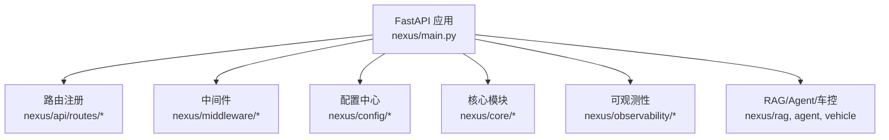
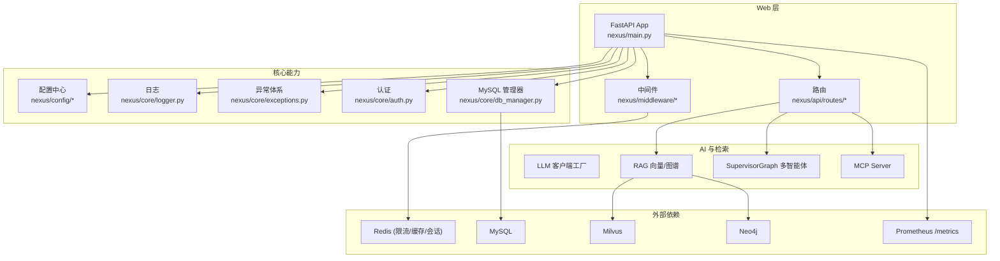
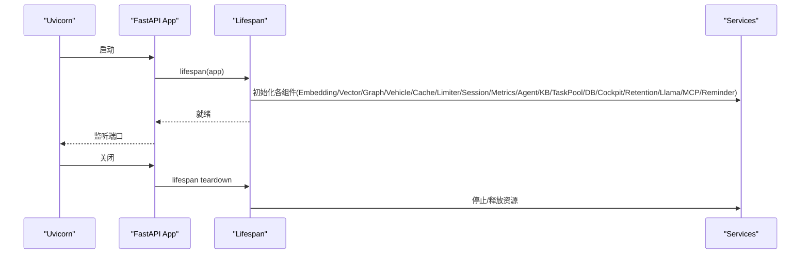
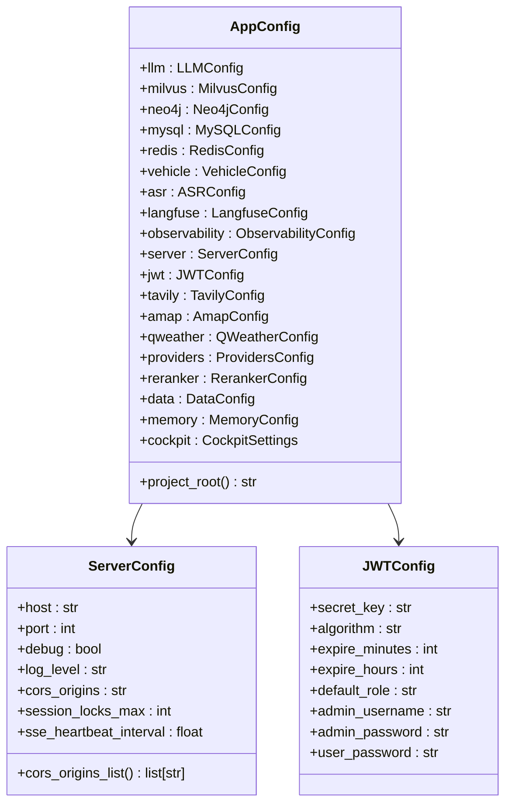
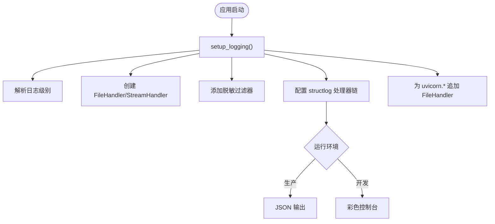
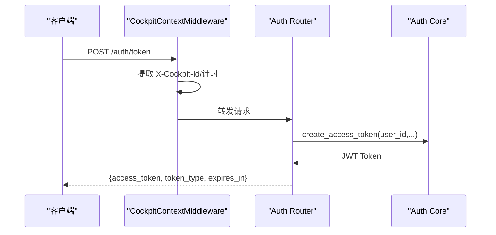
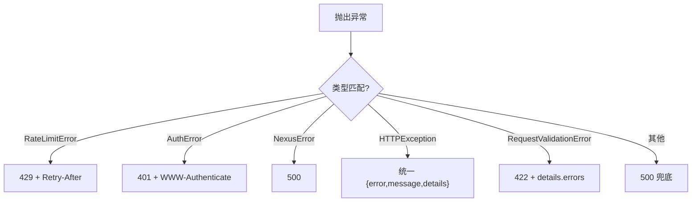
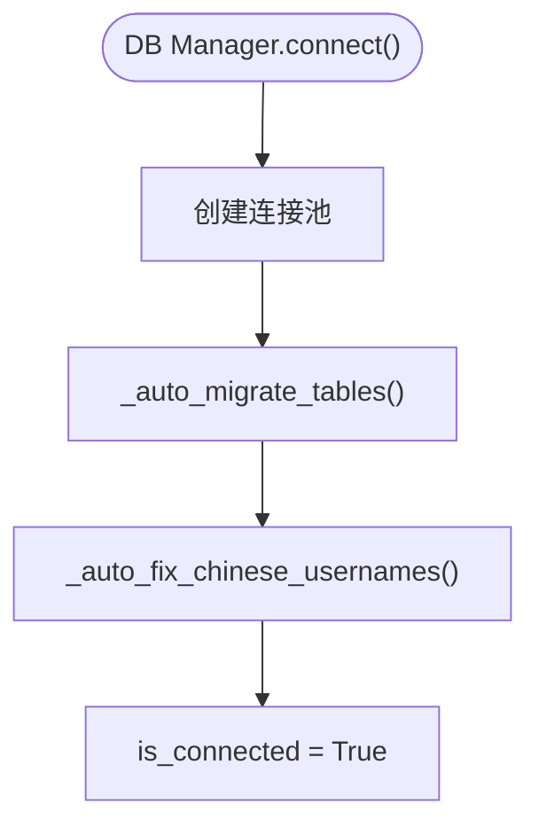
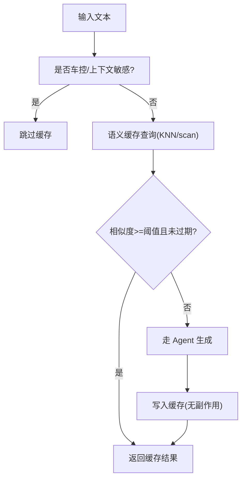
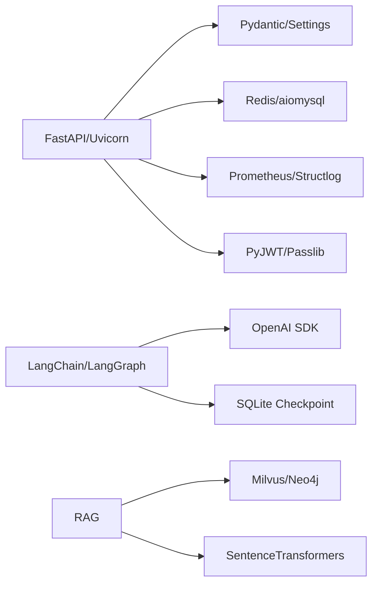

# 后端服务

<cite>
**本文引用的文件**   
- [main.py](file://backend_design/nexus/main.py)
- [config/__init__.py](file://backend_design/nexus/config/__init__.py)
- [config/server.py](file://backend_design/nexus/config/server.py)
- [core/logger.py](file://backend_design/nexus/core/logger.py)
- [core/exceptions.py](file://backend_design/nexus/core/exceptions.py)
- [core/auth.py](file://backend_design/nexus/core/auth.py)
- [middleware/rate_limiter.py](file://backend_design/nexus/middleware/rate_limiter.py)
- [middleware/redis_cache.py](file://backend_design/nexus/middleware/redis_cache.py)
- [api/routes/auth.py](file://backend_design/nexus/api/routes/auth.py)
- [api/routes/chat.py](file://backend_design/nexus/api/routes/chat.py)
- [core/db_manager.py](file://backend_design/nexus/core/db_manager.py)
- [pyproject.toml](file://backend_design/pyproject.toml)
</cite>

## 目录
1. [简介](#简介)
2. [项目结构](#项目结构)
3. [核心组件](#核心组件)
4. [架构总览](#架构总览)
5. [详细组件分析](#详细组件分析)
6. [依赖关系分析](#依赖关系分析)
7. [性能考量](#性能考量)
8. [故障排查指南](#故障排查指南)
9. [结论](#结论)
10. [附录：扩展指南与最佳实践](#附录扩展指南与最佳实践)

## 简介
本文件面向 NexusCockpit Python 后端开发者，系统性阐述 FastAPI 应用架构、生命周期管理、组件初始化流程、配置管理、日志记录、API 路由设计、中间件机制、异常处理策略与错误码规范，并给出异步编程模式、依赖注入与性能优化技巧。文档同时提供扩展新 API 端点与中间件的实操指引，帮助团队高效迭代与维护。

## 项目结构
后端采用模块化分层组织：
- 入口与生命周期：nexus/main.py
- 配置中心：nexus/config/*（按子系统拆分）
- 核心能力：nexus/core/*（认证、数据库、日志、异常等）
- API 路由：nexus/api/routes/*（REST + WebSocket）
- 中间件：nexus/middleware/*（限流、语义缓存、会话存储）
- 可观测性：nexus/observability/*（指标、追踪、数据保留）
- RAG/Agent/车辆控制等：nexus/rag, nexus/agent, nexus/vehicle 等

**图表来源** 
- [main.py:436-488](file://backend_design/nexus/main.py#L436-L488)

**章节来源**
- [main.py:436-488](file://backend_design/nexus/main.py#L436-L488)

## 核心组件
- FastAPI 应用实例与生命周期：通过 lifespan 钩子完成启动时组件初始化与关闭时资源清理。
- 配置系统：基于 Pydantic Settings 的集中式 AppConfig，支持 .env 与环境变量覆盖。
- 日志系统：结构化日志 structlog + 标准 logging，支持敏感信息脱敏与多输出目标。
- 异常体系：统一基类与分类异常，配合全局异常处理器返回一致 JSON 格式。
- 认证与鉴权：JWT Token 签发与验证，FastAPI Depends 注入当前用户。
- 中间件：纯 ASGI 上下文中间件、Redis 限流器、语义缓存、会话存储。
- 数据库：MySQL 异步连接池与自动迁移，支撑审计、成本追踪、用户管理等。

**章节来源**
- [main.py:75-433](file://backend_design/nexus/main.py#L75-L433)
- [config/__init__.py:84-167](file://backend_design/nexus/config/__init__.py#L84-L167)
- [core/logger.py:83-202](file://backend_design/nexus/core/logger.py#L83-L202)
- [core/exceptions.py:19-128](file://backend_design/nexus/core/exceptions.py#L19-L128)
- [core/auth.py:35-140](file://backend_design/nexus/core/auth.py#L35-L140)
- [middleware/rate_limiter.py:117-297](file://backend_design/nexus/middleware/rate_limiter.py#L117-L297)
- [middleware/redis_cache.py:57-615](file://backend_design/nexus/middleware/redis_cache.py#L57-L615)
- [core/db_manager.py:40-104](file://backend_design/nexus/core/db_manager.py#L40-L104)

## 架构总览
NexusCockpit 以 FastAPI 为 Web 框架，结合 Redis、MySQL、Milvus、Neo4j、LLM 客户端与 MCP Server，形成“多智能体编排 + GraphRAG + 语义缓存 + 指标追踪”的企业级车载语音 Agent 平台。

**图表来源** 
- [main.py:436-488](file://backend_design/nexus/main.py#L436-L488)
- [core/db_manager.py:40-104](file://backend_design/nexus/core/db_manager.py#L40-L104)
- [middleware/rate_limiter.py:117-297](file://backend_design/nexus/middleware/rate_limiter.py#L117-L297)
- [middleware/redis_cache.py:57-615](file://backend_design/nexus/middleware/redis_cache.py#L57-L615)

## 详细组件分析

### FastAPI 应用与生命周期管理
- 创建应用：create_app() 构建 FastAPI 实例，挂载 CORS、路由、静态文件与 Prometheus 指标端点。
- 生命周期：lifespan 中顺序初始化 Embedding、向量/图谱存储、车控适配器、语义缓存、限流器、会话存储、Langfuse 监控、指标 Redis、Agent 工作流、Cherry 知识库、任务池、MySQL 数据库、座舱管理器、数据保留策略、llama.cpp 子进程、MCP Server、提醒扫描器；并在关闭阶段逐一释放资源。
- 中间件：纯 ASGI CockpitContextMiddleware 提取 X-Cockpit-Id 并设置 contextvars，同时统计请求计数与延迟。

**图表来源** 
- [main.py:75-433](file://backend_design/nexus/main.py#L75-L433)

**章节来源**
- [main.py:436-488](file://backend_design/nexus/main.py#L436-L488)
- [main.py:75-433](file://backend_design/nexus/main.py#L75-L433)

### 配置管理系统
- 聚合配置：AppConfig 聚合所有子系统配置（LLM、数据库、缓存、车控、ASR、可观测性、服务器/JWT、第三方服务、部署模式、数据/记忆、多座舱）。
- 加载机制：基于 pydantic-settings，从 _ENV_FILE（.env.local/.env）与环境变量加载，支持 extra="ignore" 忽略未知字段。
- 快捷访问：get_config() 单例 + get_llm_config()/get_milvus_config()/get_redis_config() 便捷方法。
- 服务器配置：ServerConfig 包含 host/port/debug/log_level/cors_origins/session_locks_max/sse_heartbeat_interval；JWTConfig 包含密钥、算法、过期时间、RBAC 默认角色与管理员/用户密码。

**图表来源** 
- [config/__init__.py:84-167](file://backend_design/nexus/config/__init__.py#L84-L167)
- [config/server.py:15-61](file://backend_design/nexus/config/server.py#L15-L61)

**章节来源**
- [config/__init__.py:84-167](file://backend_design/nexus/config/__init__.py#L84-L167)
- [config/server.py:15-61](file://backend_design/nexus/config/server.py#L15-L61)

### 日志记录系统
- 双栈日志：structlog（结构化 JSON）+ 标准 logging（控制台/文件），生产环境 JSON，开发环境彩色控制台。
- 敏感信息脱敏：对 key/value 中的 api_key/secret/token/password/bearer 等进行掩码处理。
- 输出目标：stdout + 文件（按日期命名），并为 uvicorn.* 日志追加共享 FileHandler。
- 上下文绑定：bind_context/clear_context 支持 request_id/user_id 等链路追踪字段。
- 初始化时机：在 lifespan 启动早期调用 setup_logging()，确保后续日志正常输出。

**图表来源** 
- [core/logger.py:83-202](file://backend_design/nexus/core/logger.py#L83-L202)

**章节来源**
- [core/logger.py:83-202](file://backend_design/nexus/core/logger.py#L83-L202)

### API 路由设计与中间件机制
- 路由组织：按功能划分 routes（auth/chat/vehicle/admin/cockpit/dataplatform/settings/asr/ws/health/middleware_status）。
- 认证依赖：get_current_user/get_optional_user 通过 Depends 注入 user_id，未携带或无效 Token 返回 401。
- 中间件：
  - CockpitContextMiddleware：纯 ASGI 中间件，提取 X-Cockpit-Id 到 contextvars，注入响应头 x-response-time-ms，统计 Prometheus 指标。
  - RateLimiter：基于 Redis Lua 的滑动窗口与令牌桶限流，原子操作保证分布式安全。
  - SemanticCache：基于 Redis 8 RediSearch KNN 的语义缓存，支持用户分片、TTL 分级、副作用隔离（车控指令不缓存）。
  - SessionStore：会话历史持久化（Redis 优先，内存降级）。

**图表来源** 
- [main.py:598-652](file://backend_design/nexus/main.py#L598-L652)
- [api/routes/auth.py:48-77](file://backend_design/nexus/api/routes/auth.py#L48-L77)
- [core/auth.py:35-140](file://backend_design/nexus/core/auth.py#L35-L140)

**章节来源**
- [api/routes/auth.py:48-77](file://backend_design/nexus/api/routes/auth.py#L48-L77)
- [core/auth.py:35-140](file://backend_design/nexus/core/auth.py#L35-L140)
- [middleware/rate_limiter.py:117-297](file://backend_design/nexus/middleware/rate_limiter.py#L117-L297)
- [middleware/redis_cache.py:57-615](file://backend_design/nexus/middleware/redis_cache.py#L57-L615)

### 异常处理策略与错误码规范
- 自定义异常：NexusError 基类，派生 ConfigError/LLMError/RAGError/VectorStoreError/GraphStoreError/MemoryError/SkillError/IntentError/VehicleError/CacheError/AuthError/RateLimitError/CircuitBreakerError。
- 全局处理器：
  - RateLimitError → 429 Too Many Requests，附带 Retry-After 头。
  - AuthError → 401 Unauthorized，附带 WWW-Authenticate: Bearer。
  - NexusError → 500 Internal Server Error。
  - HTTPException → 统一为 {error, message, details} 格式。
  - RequestValidationError → 422，details.errors 保留原始校验详情。
  - Exception → 兜底捕获，避免泄露内部堆栈。
- 前端只需处理统一 JSON 结构，便于一致性体验。

**图表来源** 
- [main.py:503-596](file://backend_design/nexus/main.py#L503-L596)
- [core/exceptions.py:19-128](file://backend_design/nexus/core/exceptions.py#L19-L128)

**章节来源**
- [main.py:503-596](file://backend_design/nexus/main.py#L503-L596)
- [core/exceptions.py:19-128](file://backend_design/nexus/core/exceptions.py#L19-L128)

### 数据库管理与自动迁移
- 连接池：aiomysql.create_pool，minsize/maxsize 控制并发。
- 自动迁移：启动时确保 cockpits/users/chat_history/cockpit_stats/subagent_logs/mainagent_logs/audit_logs/agent_feedback/llm_cost_tracking/voiceprint_enrollments/chat_sessions/user_habits/chat_logs 等表存在，并插入默认座舱与用户数据。
- 中文修复：将已有中文用户名/座舱名修正为英文，避免编码问题。
- CRUD 接口：SubAgent/MainAgent 日志、审计日志、LLM 成本追踪、用户管理（CRUD）、查询汇总等。

**图表来源** 
- [core/db_manager.py:56-85](file://backend_design/nexus/core/db_manager.py#L56-L85)

**章节来源**
- [core/db_manager.py:56-85](file://backend_design/nexus/core/db_manager.py#L56-L85)

### 聊天路由与语义缓存
- 聊天接口：REST + SSE 流式事件，支持 checkpoint 持久化、语义缓存、座舱级指标记录。
- 缓存策略：
  - 跳过场景：车控指令（has_side_effect=True）、上下文敏感查询（天气/附近/推荐等）。
  - 命中逻辑：KNN 向量检索（RediSearch）或 O(n) scan 回退，相似度阈值与 TTL 控制。
  - 写入保护：有副作用的响应禁止写入缓存，防止车控指令被缓存后不执行。
- 会话历史：优先 Redis SessionStore，不可用时回退内存 dict。

**图表来源** 
- [api/routes/chat.py:112-200](file://backend_design/nexus/api/routes/chat.py#L112-L200)
- [middleware/redis_cache.py:213-365](file://backend_design/nexus/middleware/redis_cache.py#L213-L365)

**章节来源**
- [api/routes/chat.py:112-200](file://backend_design/nexus/api/routes/chat.py#L112-L200)
- [middleware/redis_cache.py:213-365](file://backend_design/nexus/middleware/redis_cache.py#L213-L365)

## 依赖关系分析
- 框架与运行时：fastapi、uvicorn、starlette、websockets。
- AI/Agent：langchain-openai、langgraph、langgraph-checkpoint-sqlite。
- RAG/存储：pymilvus、neo4j、sentence-transformers、langchain-community。
- 中间件：redis、aiomysql、mcp。
- 配置/校验：pydantic、pydantic-settings、python-dotenv。
- 可观测性：langfuse、prometheus-client、structlog。
- 认证：pyjwt、passlib[bcrypt]。
- 音频/ASR/TTS：funasr、modelscope、torchaudio、librosa、soundfile、pydub。
- 网络：httpx、requests、aiohttp。
- 工具：orjson、tiktoken、pyyaml、numpy、pandas、sentencepiece、transformers、tokenizers、aiosqlite。

**图表来源** 
- [pyproject.toml:10-100](file://backend_design/pyproject.toml#L10-L100)

**章节来源**
- [pyproject.toml:10-100](file://backend_design/pyproject.toml#L10-L100)

## 性能考量
- 异步 I/O：使用 aiomysql、aioredis、aiosqlite、httpx/aiohttp，避免阻塞事件循环。
- 连接池：MySQL/Redis 连接池减少频繁创建销毁开销。
- 缓存：Redis 语义缓存（KNN）显著降低重复请求延迟；滑动窗口/令牌桶限流保护下游。
- 后台预加载：ASR/TTS 模型后台加载，不阻塞服务启动；首次请求按需加载。
- 指标采集：Prometheus REQUEST_COUNT/REQUEST_LATENCY 实时统计，Grafana 可视化。
- 降级策略：Redis/向量/图谱不可用时降级内存或本地实现，保障可用性。

[本节为通用指导，无需特定文件引用]

## 故障排查指南
- 日志定位：查看 logs/backend_logs/*.log，关注敏感信息已脱敏；使用 bind_context(request_id=...) 关联请求链路。
- 认证失败：检查 Authorization: Bearer <token> 是否正确；确认 JWT_SECRET_KEY 与算法一致。
- 限流触发：RateLimitError 429，检查 Redis 连通性与限流参数；必要时调整 max_requests/window_seconds。
- 缓存未命中：确认 Redis 版本与 FT.* 命令可用；检查相似度阈值与 TTL；车控指令不会命中缓存。
- 数据库异常：检查 MySQL 连接池与自动迁移脚本；查看 is_connected 状态与错误日志。
- 指标缺失：确认 /metrics 端点挂载与 Prometheus 抓取配置；检查 CockpitContextMiddleware 是否正常注入指标。

**章节来源**
- [core/logger.py:83-202](file://backend_design/nexus/core/logger.py#L83-L202)
- [core/auth.py:85-140](file://backend_design/nexus/core/auth.py#L85-L140)
- [middleware/rate_limiter.py:156-211](file://backend_design/nexus/middleware/rate_limiter.py#L156-L211)
- [middleware/redis_cache.py:90-128](file://backend_design/nexus/middleware/redis_cache.py#L90-L128)
- [core/db_manager.py:56-85](file://backend_design/nexus/core/db_manager.py#L56-L85)

## 结论
NexusCockpit 后端以 FastAPI 为核心，结合结构化日志、统一异常、JWT 认证、Redis 限流与语义缓存、MySQL 异步连接池、RAG/Agent 多智能体编排与 MCP 标准化协同，构建了高可用、可观测、可扩展的车载语音 Agent 平台。通过清晰的配置管理与生命周期管理，开发者可快速扩展新功能并保持系统稳定性。

[本节为总结，无需特定文件引用]

## 附录：扩展指南与最佳实践

### 新增 API 端点
- 步骤：
  1. 在 nexus/api/routes/ 下新建路由文件（如 new_feature.py），定义 APIRouter 与请求/响应模型。
  2. 在 main.py 中 include_router(new_feature_router)。
  3. 如需认证，使用 Depends(get_current_user) 注入 user_id。
  4. 如需限流/缓存，在端点内调用 RateLimiter.check_or_raise() 与 SemanticCache.get/set()。
  5. 记录日志与指标，遵循统一异常体系抛出 NexusError 子类。
- 参考路径：
  - 路由注册：[main.py:473-484](file://backend_design/nexus/main.py#L473-L484)
  - 认证依赖：[core/auth.py:85-140](file://backend_design/nexus/core/auth.py#L85-L140)
  - 限流示例：[middleware/rate_limiter.py:204-211](file://backend_design/nexus/middleware/rate_limiter.py#L204-L211)
  - 缓存示例：[middleware/redis_cache.py:213-365](file://backend_design/nexus/middleware/redis_cache.py#L213-L365)

### 新增中间件
- 步骤：
  1. 在 nexus/middleware/ 下实现 ASGI 中间件类（__call__(scope, receive, send)）。
  2. 在 main.py 的 create_app() 中 app.add_middleware(YourMiddleware)。
  3. 如需注入上下文（如 cockpit_id），参考 CockpitContextMiddleware 的实现。
- 参考路径：
  - 中间件注册：[main.py:652-652](file://backend_design/nexus/main.py#L652-L652)
  - 上下文中间件：[main.py:604-652](file://backend_design/nexus/main.py#L604-L652)

### 异步编程模式
- 使用 async def 定义端点与内部函数，避免阻塞 I/O。
- 使用 asyncio.to_thread 执行 CPU 密集任务（如模型加载）。
- 使用 aiomysql/aioredis/aiosqlite 进行异步数据库/缓存操作。
- 参考路径：
  - 后台预加载：[main.py:366-381](file://backend_design/nexus/main.py#L366-L381)
  - 数据库异步：[core/db_manager.py:56-85](file://backend_design/nexus/core/db_manager.py#L56-L85)

### 依赖注入
- 使用 FastAPI Depends 注入认证用户、配置、服务等。
- 通过 app.state 共享全局对象（如 embedding_service、vector_store、agent_graph）。
- 参考路径：
  - 认证依赖：[core/auth.py:85-140](file://backend_design/nexus/core/auth.py#L85-L140)
  - 全局对象：[main.py:112-276](file://backend_design/nexus/main.py#L112-L276)

### 性能优化技巧
- 启用 Redis 语义缓存（KNN）与 TTL 分级。
- 使用连接池（MySQL/Redis）与预加载 Lua 脚本。
- 限制大对象传输（如音频文件通过静态目录直接访问）。
- 监控指标（/metrics）与日志（结构化 JSON）定位瓶颈。
- 参考路径：
  - 指标端点：[main.py:486-488](file://backend_design/nexus/main.py#L486-L488)
  - 静态文件挂载：[main.py:492-501](file://backend_design/nexus/main.py#L492-L501)

**章节来源**
- [main.py:473-501](file://backend_design/nexus/main.py#L473-L501)
- [core/auth.py:85-140](file://backend_design/nexus/core/auth.py#L85-L140)
- [middleware/rate_limiter.py:204-211](file://backend_design/nexus/middleware/rate_limiter.py#L204-L211)
- [middleware/redis_cache.py:213-365](file://backend_design/nexus/middleware/redis_cache.py#L213-L365)
- [core/db_manager.py:56-85](file://backend_design/nexus/core/db_manager.py#L56-L85)