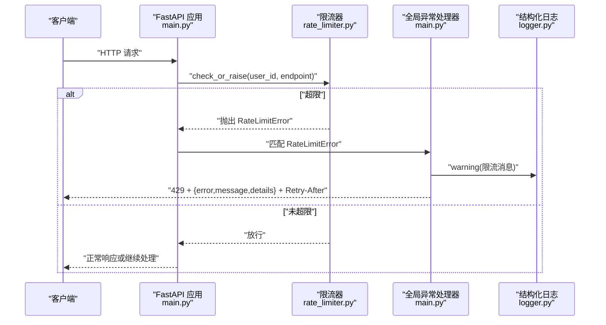
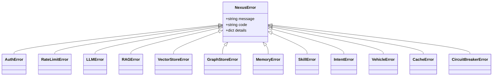
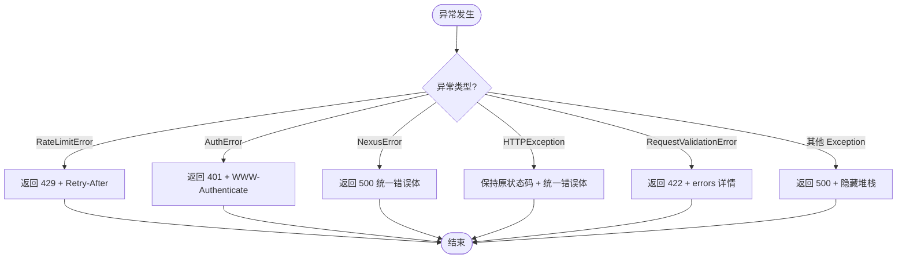
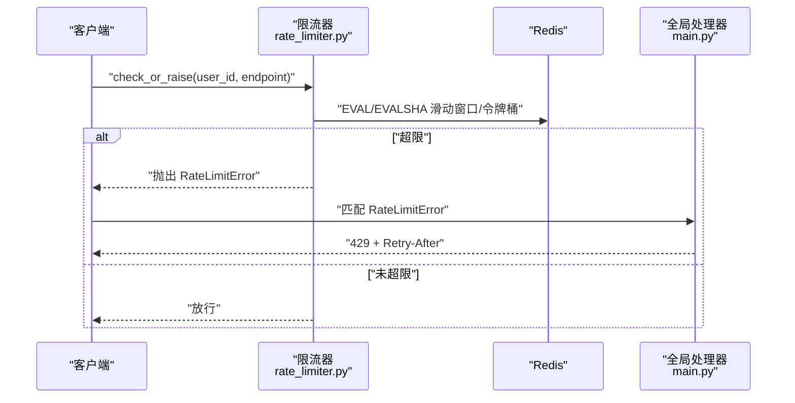
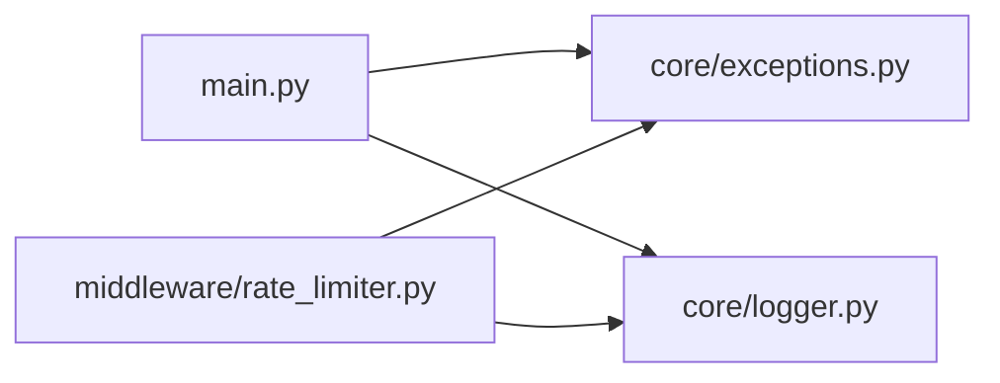

# 异常处理机制

<cite>
**本文引用的文件**   
- [backend_design/nexus/core/exceptions.py](file://backend_design/nexus/core/exceptions.py)
- [backend_design/nexus/main.py](file://backend_design/nexus/main.py)
- [backend_design/nexus/middleware/rate_limiter.py](file://backend_design/nexus/middleware/rate_limiter.py)
- [backend_design/nexus/core/logger.py](file://backend_design/nexus/core/logger.py)
</cite>

## 目录
1. [简介](#简介)
2. [项目结构](#项目结构)
3. [核心组件](#核心组件)
4. [架构总览](#架构总览)
5. [详细组件分析](#详细组件分析)
6. [依赖关系分析](#依赖关系分析)
7. [性能考量](#性能考量)
8. [故障排查指南](#故障排查指南)
9. [结论](#结论)
10. [附录](#附录)

## 简介
本文件系统化阐述 NexusCockpit 的异常处理机制，覆盖自定义异常类层次、全局异常处理器、HTTP 状态码策略、错误响应格式、日志与堆栈记录、限流与认证异常流程、前端错误处理与用户提示策略、监控告警集成以及开发与调试最佳实践。目标是帮助开发者快速定位问题、统一错误表达、提升系统可观测性与用户体验。

## 项目结构
与异常处理相关的关键位置：
- 自定义异常定义：backend_design/nexus/core/exceptions.py
- 全局异常处理器与路由注册：backend_design/nexus/main.py
- 限流中间件（触发 RateLimitError）：backend_design/nexus/middleware/rate_limiter.py
- 结构化日志与脱敏：backend_design/nexus/core/logger.py

```mermaid
graph TB
A["FastAPI 应用<br/>main.py"] --> B["全局异常处理器<br/>main.py"]
A --> C["限流中间件<br/>rate_limiter.py"]
C --> D["抛出 RateLimitError<br/>rate_limiter.py"]
B --> E["返回统一 JSON 响应<br/>main.py"]
F["业务代码<br/>抛出 NexusError 子类"] --> B
G["第三方 HTTPException / 校验异常"] --> B
H["结构化日志器<br/>logger.py"] <- --> B
```

图表来源 
- [backend_design/nexus/main.py:503-596](file://backend_design/nexus/main.py#L503-L596)
- [backend_design/nexus/middleware/rate_limiter.py:204-211](file://backend_design/nexus/middleware/rate_limiter.py#L204-L211)
- [backend_design/nexus/core/logger.py:180-202](file://backend_design/nexus/core/logger.py#L180-L202)

章节来源
- [backend_design/nexus/main.py:503-596](file://backend_design/nexus/main.py#L503-L596)
- [backend_design/nexus/middleware/rate_limiter.py:1-297](file://backend_design/nexus/middleware/rate_limiter.py#L1-L297)
- [backend_design/nexus/core/logger.py:1-249](file://backend_design/nexus/core/logger.py#L1-L249)

## 核心组件
- 自定义异常体系
  - 基类：NexusError，统一携带 message、code、details，便于全局捕获与标准化输出。
  - 领域异常：AuthError、RateLimitError、LLMError、RAGError、VectorStoreError、GraphStoreError、MemoryError、SkillError、IntentError、VehicleError、CacheError、CircuitBreakerError 等，各自设定语义化 error_code。
- 全局异常处理器
  - 针对 RateLimitError → 429，附带 Retry-After 头。
  - 针对 AuthError → 401，附带 WWW-Authenticate 头。
  - 针对 NexusError → 500，统一错误体。
  - 针对 FastAPI HTTPException → 保持原状态码，统一为 {error, message, details}。
  - 针对 RequestValidationError → 422，保留原始校验细节。
  - 兜底 Exception → 500，隐藏内部堆栈，仅记录完整堆栈到日志。
- 限流器
  - 基于 Redis 原子滑动窗口与令牌桶 Lua 脚本实现分布式限流。
  - check_or_raise 在超限时抛出 RateLimitError，由全局处理器映射为 429。
- 结构化日志
  - 使用 structlog 输出 JSON，自动包含时间戳、级别、调用栈、异常信息。
  - 内置敏感字段脱敏（API Key、Token、密码等），避免泄露。

章节来源
- [backend_design/nexus/core/exceptions.py:19-128](file://backend_design/nexus/core/exceptions.py#L19-L128)
- [backend_design/nexus/main.py:503-596](file://backend_design/nexus/main.py#L503-L596)
- [backend_design/nexus/middleware/rate_limiter.py:117-211](file://backend_design/nexus/middleware/rate_limiter.py#L117-L211)
- [backend_design/nexus/core/logger.py:83-202](file://backend_design/nexus/core/logger.py#L83-L202)

## 架构总览
下图展示请求进入后，异常如何被捕获并转化为统一响应，同时记录结构化日志。



图表来源 
- [backend_design/nexus/main.py:505-517](file://backend_design/nexus/main.py#L505-L517)
- [backend_design/nexus/middleware/rate_limiter.py:204-211](file://backend_design/nexus/middleware/rate_limiter.py#L204-L211)
- [backend_design/nexus/core/logger.py:180-202](file://backend_design/nexus/core/logger.py#L180-L202)

## 详细组件分析

### 自定义异常类层次设计
- 基类 NexusError
  - 属性：message（人类可读）、code（程序识别）、details（上下文详情）。
  - 所有业务异常均继承该基类，确保全局处理器能统一捕获。
- 典型子类
  - AuthError：认证失败（如 Token 无效/过期），用于 401 场景。
  - RateLimitError：频率限制触发，用于 429 场景。
  - LLMError/RAGError/VectorStoreError/GraphStoreError/MemoryError/SkillError/IntentError/VehicleError/CacheError/CircuitBreakerError：各子系统错误域，统一以 500 返回，便于前端按 code 做差异化处理。



图表来源 
- [backend_design/nexus/core/exceptions.py:19-128](file://backend_design/nexus/core/exceptions.py#L19-L128)

章节来源
- [backend_design/nexus/core/exceptions.py:19-128](file://backend_design/nexus/core/exceptions.py#L19-L128)

### 全局异常处理器与响应标准化
- 处理器职责
  - RateLimitError → 429，附加 Retry-After 头。
  - AuthError → 401，附加 WWW-Authenticate 头。
  - NexusError → 500，统一错误体。
  - HTTPException → 保持原状态码，转换为 {error, message, details}。
  - RequestValidationError → 422，保留 errors 列表供前端调试。
  - 兜底 Exception → 500，隐藏内部堆栈，仅记录完整堆栈。
- 响应格式
  - 统一 JSON：{ "error": "错误码", "message": "人类可读描述", "details": {} }。
  - 前端只需处理一种结构，降低适配成本。



图表来源 
- [backend_design/nexus/main.py:505-596](file://backend_design/nexus/main.py#L505-L596)

章节来源
- [backend_design/nexus/main.py:505-596](file://backend_design/nexus/main.py#L505-L596)

### 限流异常与 429 策略
- 限流算法
  - 滑动窗口：Redis ZSET 原子操作，清理旧条目、统计计数、添加新条目，超限直接拒绝且不污染计数器。
  - 令牌桶：支持突发流量，适合 LLM API 调用场景。
- 触发方式
  - 中间件调用 check_or_raise，超限即抛出 RateLimitError。
- 响应策略
  - 429 Too Many Requests，附带 Retry-After 头，前端可据此退避重试。



图表来源 
- [backend_design/nexus/middleware/rate_limiter.py:156-211](file://backend_design/nexus/middleware/rate_limiter.py#L156-L211)
- [backend_design/nexus/main.py:505-517](file://backend_design/nexus/main.py#L505-L517)

章节来源
- [backend_design/nexus/middleware/rate_limiter.py:1-297](file://backend_design/nexus/middleware/rate_limiter.py#L1-L297)
- [backend_design/nexus/main.py:505-517](file://backend_design/nexus/main.py#L505-L517)

### 认证异常与 401 策略
- 触发点
  - 认证逻辑中抛出 AuthError（例如 JWT 无效/过期）。
- 响应策略
  - 401 Unauthorized，附带 WWW-Authenticate 头，提示前端重新鉴权。
- 前端策略
  - 捕获 401 后跳转登录页或刷新 Token。

章节来源
- [backend_design/nexus/core/exceptions.py:105-110](file://backend_design/nexus/core/exceptions.py#L105-L110)
- [backend_design/nexus/main.py:519-531](file://backend_design/nexus/main.py#L519-L531)

### 错误日志与堆栈跟踪
- 结构化日志
  - 使用 structlog 输出 JSON，包含时间戳、级别、模块名、调用栈、异常信息。
  - 开发环境彩色控制台，生产环境 JSON 便于采集。
- 敏感数据脱敏
  - 对 key/value 中的 API Key、Token、密码等进行掩码处理，防止泄露。
- 异常记录
  - 全局处理器在每种异常路径上记录 warning/error，兜底异常记录完整堆栈。

章节来源
- [backend_design/nexus/core/logger.py:83-202](file://backend_design/nexus/core/logger.py#L83-L202)
- [backend_design/nexus/main.py:505-596](file://backend_design/nexus/main.py#L505-L596)

### 前端错误处理与用户友好提示
- 后端统一错误体
  - { "error": "错误码", "message": "人类可读描述", "details": {} }，前端无需区分多种结构。
- 建议策略
  - 401：引导用户重新登录或刷新 Token。
  - 429：显示“请求过于频繁，请稍后再试”，并根据 Retry-After 进行指数退避。
  - 422：高亮具体字段错误，提供修正建议。
  - 5xx：提示“服务器繁忙，请稍后重试”，并上报埋点。
- 体验优化
  - 将 details.errors 渲染为表单级提示。
  - 对网络错误与超时给出明确提示与重试按钮。

[本节为通用指导，不直接分析具体文件]

### 监控与告警集成
- Prometheus 指标
  - 请求计数与延迟通过中间件记录，暴露 /metrics 端点。
- 结构化日志
  - JSON 格式便于 ELK/Loki 采集与检索。
- 建议告警
  - 429 突增：限流阈值过低或上游攻击。
  - 401 突增：认证服务异常或 Token 失效。
  - 5xx 比例升高：后端服务不稳定。

章节来源
- [backend_design/nexus/main.py:486-488](file://backend_design/nexus/main.py#L486-L488)
- [backend_design/nexus/core/logger.py:180-202](file://backend_design/nexus/core/logger.py#L180-L202)

## 依赖关系分析
- main.py 依赖 exceptions 与 logger，并在 create_app 中注册各类异常处理器。
- rate_limiter.py 依赖 exceptions 抛出 RateLimitError，并通过 Redis Lua 脚本实现原子限流。
- logger.py 提供结构化日志与脱敏能力，被 main.py 与 rate_limiter.py 使用。



图表来源 
- [backend_design/nexus/main.py:503-596](file://backend_design/nexus/main.py#L503-L596)
- [backend_design/nexus/middleware/rate_limiter.py:117-211](file://backend_design/nexus/middleware/rate_limiter.py#L117-L211)
- [backend_design/nexus/core/logger.py:180-202](file://backend_design/nexus/core/logger.py#L180-L202)

章节来源
- [backend_design/nexus/main.py:503-596](file://backend_design/nexus/main.py#L503-L596)
- [backend_design/nexus/middleware/rate_limiter.py:117-211](file://backend_design/nexus/middleware/rate_limiter.py#L117-L211)
- [backend_design/nexus/core/logger.py:180-202](file://backend_design/nexus/core/logger.py#L180-L202)

## 性能考量
- 限流算法
  - 滑动窗口与令牌桶均通过 Redis Lua 脚本原子执行，减少竞争条件与额外 RTT。
  - EVALSHA 预加载脚本，提高后续调用效率。
- 日志开销
  - 生产环境 JSON 输出，避免过多字符串拼接；敏感字段脱敏在处理器层完成，避免重复计算。
- 降级策略
  - Redis 不可用时，限流器放行（避免阻塞正常请求），但会记录警告日志。

章节来源
- [backend_design/nexus/middleware/rate_limiter.py:142-155](file://backend_design/nexus/middleware/rate_limiter.py#L142-L155)
- [backend_design/nexus/middleware/rate_limiter.py:200-203](file://backend_design/nexus/middleware/rate_limiter.py#L200-L203)
- [backend_design/nexus/core/logger.py:180-202](file://backend_design/nexus/core/logger.py#L180-L202)

## 故障排查指南
- 常见问题
  - 429 频繁出现：检查限流配置与上游调用频率；查看 Redis 连接与 Lua 脚本加载是否成功。
  - 401 频繁出现：检查 Token 签发与校验逻辑；确认前端是否正确携带 Authorization。
  - 500 错误增多：查看结构化日志中的 error 与 details，定位具体异常子类与堆栈。
- 调试技巧
  - 开启 debug 模式，观察彩色控制台日志。
  - 使用 /metrics 端点观察请求量与延迟。
  - 在关键路径增加 bind_context(request_id=...)，便于链路追踪。
- 日志定位
  - 查找 backend_logs 下的日志文件，过滤 ERROR/WARNING 级别。
  - 关注敏感字段是否被正确脱敏。

章节来源
- [backend_design/nexus/core/logger.py:97-136](file://backend_design/nexus/core/logger.py#L97-L136)
- [backend_design/nexus/main.py:486-488](file://backend_design/nexus/main.py#L486-L488)

## 结论
NexusCockpit 的异常处理机制以统一的异常层次与全局处理器为核心，结合结构化日志与限流中间件，实现了稳定、可观测、易维护的错误处理体系。通过标准化的响应格式与清晰的 HTTP 状态码策略，前端可高效处理错误并提供友好的用户提示。配合 Prometheus 与结构化日志，可实现完善的监控与告警闭环。

## 附录
- 最佳实践
  - 业务异常尽量抛出 NexusError 子类，设置明确的 code 与 details。
  - 在中间件或网关层进行限流，避免后端过载。
  - 使用结构化日志记录关键路径与异常堆栈，避免泄露敏感信息。
  - 前端统一解析 {error, message, details}，针对不同状态码提供差异化提示。
  - 建立监控告警规则，及时感知 429/401/5xx 异常趋势。

[本节为通用指导，不直接分析具体文件]