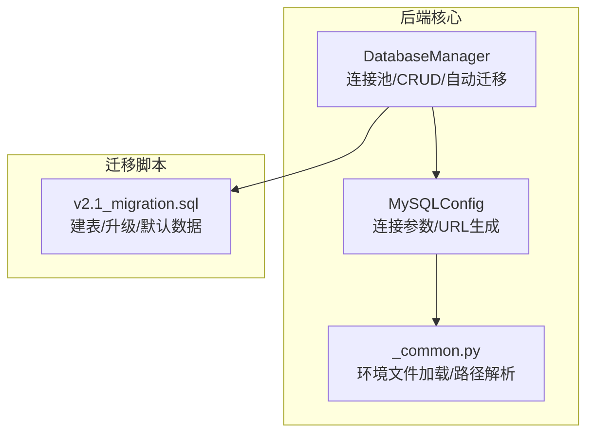
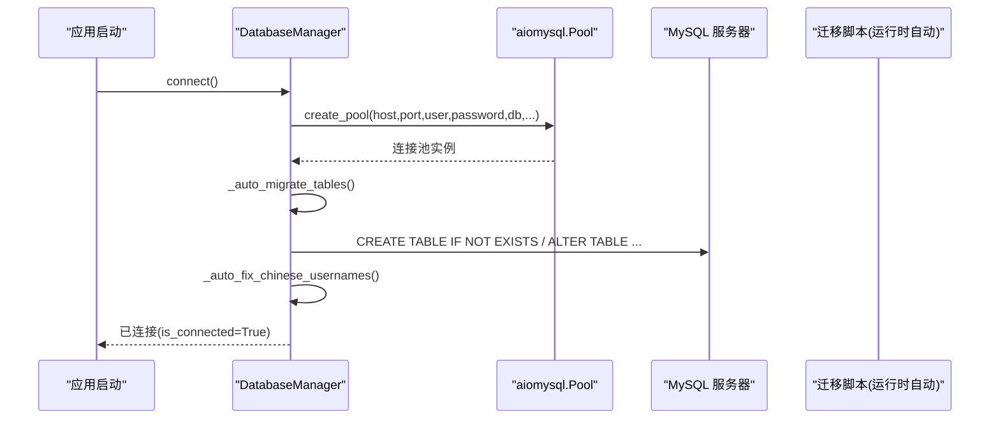
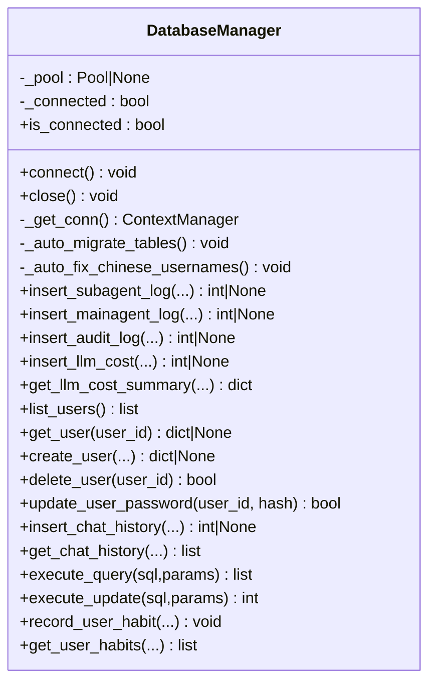
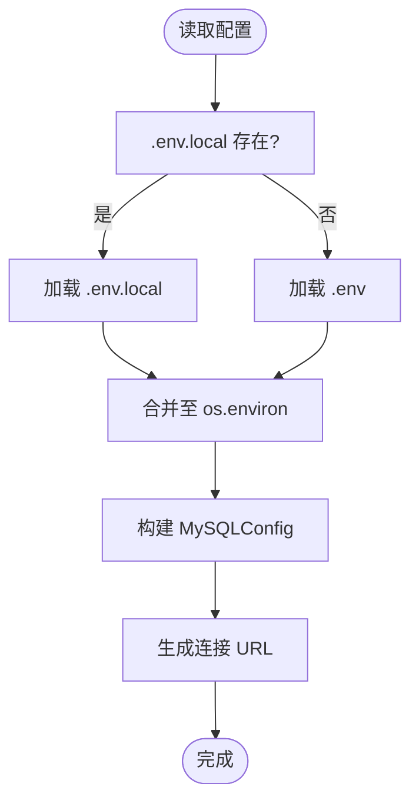
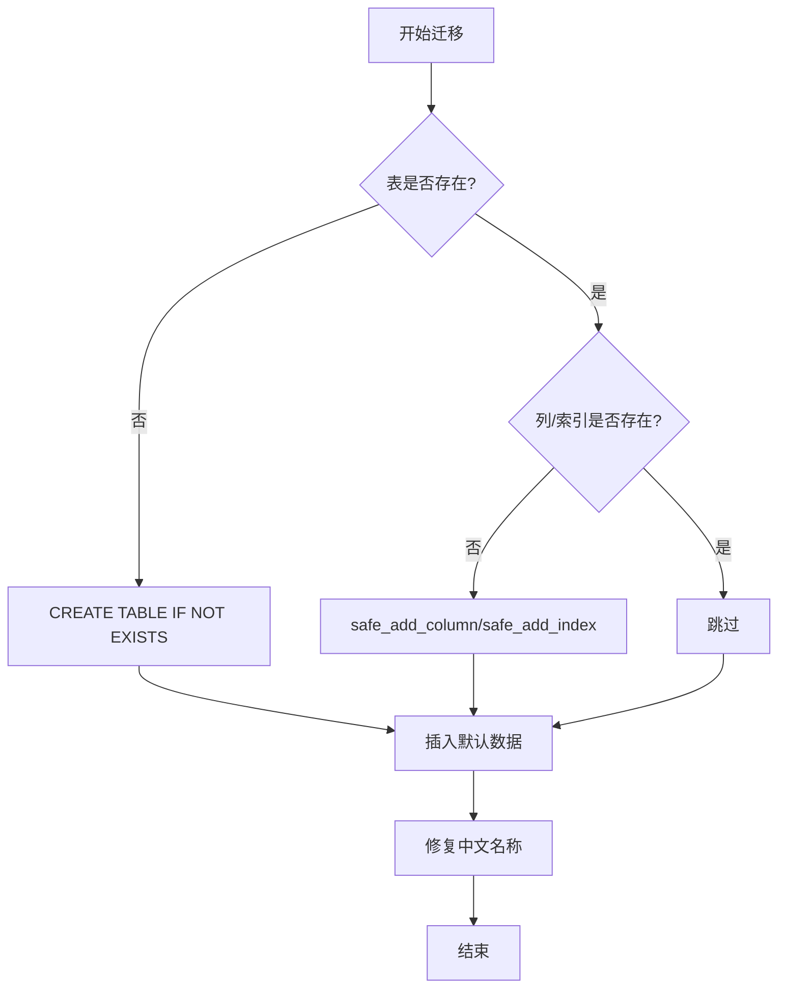
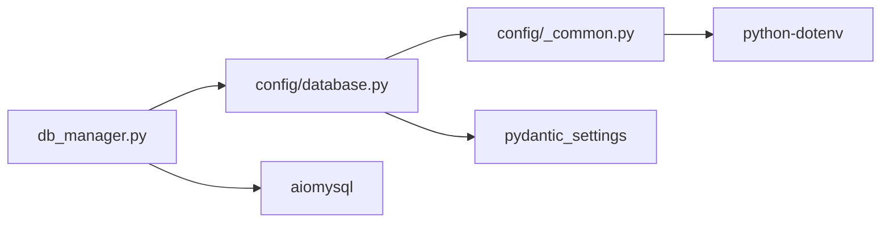

# 数据库管理器

<cite>
**本文引用的文件**   
- [db_manager.py](file://backend_design/nexus/core/db_manager.py)
- [database.py](file://backend_design/nexus/config/database.py)
- [_common.py](file://backend_design/nexus/config/_common.py)
- [v2.1_migration.sql](file://backend_design/scripts/v2.1_migration.sql)
</cite>

## 目录
1. [简介](#简介)
2. [项目结构](#项目结构)
3. [核心组件](#核心组件)
4. [架构总览](#架构总览)
5. [详细组件分析](#详细组件分析)
6. [依赖关系分析](#依赖关系分析)
7. [性能考虑](#性能考虑)
8. [故障排查指南](#故障排查指南)
9. [结论](#结论)
10. [附录](#附录)

## 简介
本文件为 NexusCockpit 的 MySQL 数据库管理器提供完整、深入的技术文档。内容涵盖连接池管理、异步操作支持、连接生命周期与自动重连策略、SQL 查询构建与 ORM 映射实现、事务管理与数据一致性保证、迁移脚本与版本控制策略、性能监控与优化建议、连接池配置与调优参数、备份恢复与数据完整性检查，以及面向开发者的操作指南与故障排查方法。

## 项目结构
NexusCockpit 的数据库相关代码主要位于后端 Python 模块中：
- 数据库管理器核心逻辑：backend_design/nexus/core/db_manager.py
- 数据库配置（MySQL/Milvus/Neo4j）：backend_design/nexus/config/database.py
- 配置公共工具与环境加载：backend_design/nexus/config/_common.py
- 数据库迁移脚本：backend_design/scripts/v2.1_migration.sql

图表来源
- [db_manager.py:40-110](file://backend_design/nexus/core/db_manager.py#L40-L110)
- [database.py:42-61](file://backend_design/nexus/config/database.py#L42-L61)
- [_common.py:39-53](file://backend_design/nexus/config/_common.py#L39-L53)
- [v2.1_migration.sql:10-33](file://backend_design/scripts/v2.1_migration.sql#L10-L33)

章节来源
- [db_manager.py:40-110](file://backend_design/nexus/core/db_manager.py#L40-L110)
- [database.py:42-61](file://backend_design/nexus/config/database.py#L42-L61)
- [_common.py:39-53](file://backend_design/nexus/config/_common.py#L39-L53)
- [v2.1_migration.sql:10-33](file://backend_design/scripts/v2.1_migration.sql#L10-L33)

## 核心组件
- DatabaseManager：单例式 MySQL 数据库管理器，封装 aiomysql 连接池、自动迁移、常用 CRUD、审计与日志写入等能力。
- MySQLConfig：基于 Pydantic Settings 的 MySQL 配置类，提供 host/port/user/password/database 及 URL 生成。
- _common：统一的环境文件加载策略（优先 .env.local，回退 .env），并暴露路径解析工具。
- v2.1_migration.sql：幂等的数据库迁移脚本，包含建表、安全升级列/索引、插入默认数据与修复中文名称。

章节来源
- [db_manager.py:40-110](file://backend_design/nexus/core/db_manager.py#L40-L110)
- [database.py:42-61](file://backend_design/nexus/config/database.py#L42-L61)
- [_common.py:39-53](file://backend_design/nexus/config/_common.py#L39-L53)
- [v2.1_migration.sql:10-33](file://backend_design/scripts/v2.1_migration.sql#L10-L33)

## 架构总览
下图展示了数据库管理器在应用中的位置与关键交互：配置层提供连接参数，数据库管理器负责连接池与 SQL 执行，迁移脚本确保 schema 一致性与默认数据就绪。

图表来源
- [db_manager.py:56-85](file://backend_design/nexus/core/db_manager.py#L56-L85)
- [db_manager.py:86-156](file://backend_design/nexus/core/db_manager.py#L86-L156)
- [db_manager.py:359-395](file://backend_design/nexus/core/db_manager.py#L359-L395)
- [database.py:42-61](file://backend_design/nexus/config/database.py#L42-L61)

## 详细组件分析

### DatabaseManager：连接池与异步操作
- 连接池初始化
  - 使用 aiomysql.create_pool 创建连接池，设置字符集 utf8mb4，启用 autocommit，最小/最大连接数分别为 2/10。
  - 连接成功后触发自动迁移与中文用户名修复。
- 连接生命周期
  - connect()：初始化池并标记已连接；close()：关闭池并重置状态；is_connected：判断可用。
  - _get_conn()：从池中获取连接上下文管理器，未初始化时抛出异常。
- 自动迁移与数据修复
  - _auto_migrate_tables()：以 IF NOT EXISTS 方式创建多张业务表，并在必要时通过 ALTER TABLE 添加缺失列与索引；同时插入默认座舱与用户数据。
  - _auto_fix_chinese_usernames()：将历史中文用户名与座舱名修正为英文，避免编码问题。
- 异步 CRUD 与通用查询
  - 提供 SubAgent/MainAgent/Audit/LLM Cost/Chat History/User/Habits 等专用写入接口。
  - execute_query()/execute_update()：通用查询与更新入口，返回字典列表或受影响行数。
- 错误处理
  - 所有 I/O 操作均捕获异常并记录日志，失败时返回 None/False/空列表，保证上层调用稳定。

图表来源
- [db_manager.py:40-110](file://backend_design/nexus/core/db_manager.py#L40-L110)
- [db_manager.py:421-466](file://backend_design/nexus/core/db_manager.py#L421-L466)
- [db_manager.py:472-523](file://backend_design/nexus/core/db_manager.py#L472-L523)
- [db_manager.py:529-570](file://backend_design/nexus/core/db_manager.py#L529-L570)
- [db_manager.py:576-682](file://backend_design/nexus/core/db_manager.py#L576-L682)
- [db_manager.py:688-741](file://backend_design/nexus/core/db_manager.py#L688-L741)
- [db_manager.py:743-781](file://backend_design/nexus/core/db_manager.py#L743-L781)
- [db_manager.py:783-812](file://backend_design/nexus/core/db_manager.py#L783-L812)
- [db_manager.py:818-889](file://backend_design/nexus/core/db_manager.py#L818-L889)
- [db_manager.py:895-925](file://backend_design/nexus/core/db_manager.py#L895-L925)
- [db_manager.py:931-978](file://backend_design/nexus/core/db_manager.py#L931-L978)

章节来源
- [db_manager.py:56-85](file://backend_design/nexus/core/db_manager.py#L56-L85)
- [db_manager.py:86-156](file://backend_design/nexus/core/db_manager.py#L86-L156)
- [db_manager.py:359-395](file://backend_design/nexus/core/db_manager.py#L359-L395)
- [db_manager.py:895-925](file://backend_design/nexus/core/db_manager.py#L895-L925)

### 配置与连接参数
- MySQLConfig
  - 字段：host、port、user、password、database，均支持环境变量覆盖。
  - 计算字段 url：生成 mysql+aiomysql 连接字符串，便于其他组件复用。
- 环境加载
  - _common 优先加载 .env.local，若不存在则回退 .env，并通过 dotenv 显式加载到 os.environ，避免覆盖问题。

图表来源
- [_common.py:39-53](file://backend_design/nexus/config/_common.py#L39-L53)
- [database.py:42-61](file://backend_design/nexus/config/database.py#L42-L61)

章节来源
- [database.py:42-61](file://backend_design/nexus/config/database.py#L42-L61)
- [_common.py:39-53](file://backend_design/nexus/config/_common.py#L39-L53)

### 迁移脚本与版本控制策略
- v2.1_migration.sql
  - 幂等建表：CREATE TABLE IF NOT EXISTS 确保多表结构一致。
  - 安全升级：通过存储过程 safe_add_column/safe_add_index 实现“列/索引不存在则添加”的语义。
  - 默认数据：INSERT ... ON DUPLICATE KEY UPDATE 插入默认座舱与用户。
  - 数据修复：修正历史中文用户名与座舱名，避免乱码。
  - 多会话支持：新增 chat_sessions 表并为 chat_logs 补充 session_id 列与索引。
- 运行策略
  - 建议在首次部署或升级前手动执行一次迁移脚本，确保数据库结构与默认数据完备。
  - 运行时仍保留自动迁移逻辑作为兜底，但生产环境建议以脚本为主、自动迁移为辅。

图表来源
- [v2.1_migration.sql:10-33](file://backend_design/scripts/v2.1_migration.sql#L10-L33)
- [v2.1_migration.sql:186-227](file://backend_design/scripts/v2.1_migration.sql#L186-L227)
- [v2.1_migration.sql:252-267](file://backend_design/scripts/v2.1_migration.sql#L252-L267)
- [v2.1_migration.sql:304-315](file://backend_design/scripts/v2.1_migration.sql#L304-L315)
- [v2.1_migration.sql:321-332](file://backend_design/scripts/v2.1_migration.sql#L321-L332)
- [v2.1_migration.sql:377-383](file://backend_design/scripts/v2.1_migration.sql#L377-L383)

章节来源
- [v2.1_migration.sql:10-33](file://backend_design/scripts/v2.1_migration.sql#L10-L33)
- [v2.1_migration.sql:186-227](file://backend_design/scripts/v2.1_migration.sql#L186-L227)
- [v2.1_migration.sql:252-267](file://backend_design/scripts/v2.1_migration.sql#L252-L267)
- [v2.1_migration.sql:304-315](file://backend_design/scripts/v2.1_migration.sql#L304-L315)
- [v2.1_migration.sql:321-332](file://backend_design/scripts/v2.1_migration.sql#L321-L332)
- [v2.1_migration.sql:377-383](file://backend_design/scripts/v2.1_migration.sql#L377-L383)

### SQL 查询构建器与 ORM 映射
- 查询构建
  - 采用原生 SQL 拼接与参数化占位符（%s），结合 aiomysql.DictCursor 返回字典结果，简化对象映射。
  - 通用接口 execute_query/execute_update 提供统一的查询与更新入口。
- ORM 映射
  - 未引入 ORM 框架，直接以结构化字典作为实体表示，减少依赖与学习成本。
  - JSON 字段（如 experts_involved、check_items）通过 json.dumps/dumps 序列化存储。

章节来源
- [db_manager.py:895-925](file://backend_design/nexus/core/db_manager.py#L895-L925)
- [db_manager.py:818-857](file://backend_design/nexus/core/db_manager.py#L818-L857)

### 事务管理与数据一致性
- 当前实现
  - 连接池配置 autocommit=True，每个语句独立提交，适合高并发写场景与简单写入。
  - 部分业务（如聊天会话删除）在路由层使用显式事务（commit/rollback）保证多表一致性。
- 建议改进
  - 对需要原子性的多步写入，可在 DatabaseManager 内封装事务上下文（begin/commit/rollback），统一由管理器控制。
  - 针对长事务与锁竞争，评估分片或读写分离策略。

章节来源
- [db_manager.py:70](file://backend_design/nexus/core/db_manager.py#L70)

### 连接池配置与调优参数
- 当前参数
  - minsize=2，maxsize=10，charset=utf8mb4，autocommit=True。
- 调优建议
  - maxsize：根据并发请求峰值与 MySQL 连接上限调整，避免连接耗尽。
  - minsize：保持一定基线连接，降低冷启动延迟。
  - charset：utf8mb4 支持完整 Unicode（含 emoji）。
  - autocommit：开启可简化写入流程；如需强一致性事务，应改为手动事务管理。

章节来源
- [db_manager.py:62-74](file://backend_design/nexus/core/db_manager.py#L62-L74)

### 备份恢复与数据完整性检查
- 备份建议
  - 使用 mysqldump 全量导出，配合 binlog 增量恢复，确保 RPO/RTO 目标达成。
  - 定期校验备份可用性（导入测试库验证）。
- 完整性检查
  - 运行迁移脚本后核对表数量、索引与默认数据。
  - 对关键表进行外键约束与唯一性校验（如 users.cockpit_id、chat_sessions.session_id 唯一约束）。

[本节为通用指导，不直接分析具体文件]

### 开发者操作指南
- 初始化步骤
  - 准备 .env/.env.local，设置 MYSQL_* 环境变量。
  - 首次运行前执行 v2.1_migration.sql 完成建表与默认数据。
  - 调用 get_db_manager().connect() 建立连接池。
- 常用操作
  - 写入日志：insert_subagent_log/insert_mainagent_log/insert_audit_log/insert_llm_cost。
  - 用户管理：create_user/get_user/list_users/delete_user/update_user_password。
  - 对话历史：insert_chat_history/get_chat_history。
  - 习惯记录：record_user_habit/get_user_habits。
  - 通用查询：execute_query/execute_update。

章节来源
- [db_manager.py:421-466](file://backend_design/nexus/core/db_manager.py#L421-L466)
- [db_manager.py:472-523](file://backend_design/nexus/core/db_manager.py#L472-L523)
- [db_manager.py:529-570](file://backend_design/nexus/core/db_manager.py#L529-L570)
- [db_manager.py:576-682](file://backend_design/nexus/core/db_manager.py#L576-L682)
- [db_manager.py:688-741](file://backend_design/nexus/core/db_manager.py#L688-L741)
- [db_manager.py:743-781](file://backend_design/nexus/core/db_manager.py#L743-L781)
- [db_manager.py:783-812](file://backend_design/nexus/core/db_manager.py#L783-L812)
- [db_manager.py:818-889](file://backend_design/nexus/core/db_manager.py#L818-L889)
- [db_manager.py:931-978](file://backend_design/nexus/core/db_manager.py#L931-L978)
- [db_manager.py:895-925](file://backend_design/nexus/core/db_manager.py#L895-L925)

## 依赖关系分析
- 模块依赖
  - db_manager.py 依赖 config.database.MySQLConfig 获取连接参数，依赖 logger 输出日志。
  - database.py 依赖 pydantic_settings 与 _common 的环境加载机制。
  - v2.1_migration.sql 为纯 SQL 脚本，无代码依赖。
- 外部依赖
  - aiomysql：异步 MySQL 驱动与连接池。
  - pydantic/pydantic-settings：配置模型与环境变量绑定。
  - python-dotenv：加载 .env/.env.local。

图表来源
- [db_manager.py:25-30](file://backend_design/nexus/core/db_manager.py#L25-L30)
- [database.py:9-11](file://backend_design/nexus/config/database.py#L9-L11)
- [_common.py:49-53](file://backend_design/nexus/config/_common.py#L49-L53)

章节来源
- [db_manager.py:25-30](file://backend_design/nexus/core/db_manager.py#L25-L30)
- [database.py:9-11](file://backend_design/nexus/config/database.py#L9-L11)
- [_common.py:49-53](file://backend_design/nexus/config/_common.py#L49-L53)

## 性能考虑
- 连接池
  - 合理设置 maxsize 与 minsize，避免频繁创建销毁连接。
  - 在高并发下关注连接等待与超时，必要时扩容或引入连接池代理。
- 查询优化
  - 利用现有索引（cockpit_time、user_time、session 等）优化热点查询。
  - 对大文本字段（TEXT/JSON）谨慎选择查询条件，避免全表扫描。
- 写入优化
  - 批量写入与 UPSERT 减少往返次数（如 user_habits 的 ON DUPLICATE KEY UPDATE）。
  - 对高频写入表考虑分区或归档策略。
- 监控指标
  - 连接池活跃连接数、等待队列长度、慢查询比例、错误率。
  - LLM 成本汇总与调用频次统计用于容量规划。

[本节为通用指导，不直接分析具体文件]

## 故障排查指南
- 连接失败
  - 检查 MySQLConfig 环境变量是否正确，确认网络可达与端口开放。
  - 查看日志中 “MySQL connection failed” 信息定位原因。
- 自动迁移失败
  - 检查权限（是否具备 CREATE/ALTER 权限），确认字符集与排序规则。
  - 查看 “Auto-migrate tables failed (non-fatal)” 警告，按提示修复。
- 中文乱码
  - 确认客户端与服务端字符集均为 utf8mb4，必要时执行中文名称修复。
- 事务不一致
  - 对于多表写入，建议在路由层使用显式事务包裹，确保 commit/rollback 正确。
- 性能问题
  - 观察连接池饱和与慢查询，增加索引或优化 SQL。
  - 评估是否需要读写分离或缓存层（Redis）分担压力。

章节来源
- [db_manager.py:82-84](file://backend_design/nexus/core/db_manager.py#L82-L84)
- [db_manager.py:356-357](file://backend_design/nexus/core/db_manager.py#L356-L357)
- [db_manager.py:394-395](file://backend_design/nexus/core/db_manager.py#L394-L395)

## 结论
NexusCockpit 的数据库管理器以 aiomysql 为核心，提供轻量、高效的异步连接池与 CRUD 能力，并通过自动迁移与数据修复保障初始环境与演进兼容性。当前实现偏向简洁实用，未引入 ORM 与复杂事务封装，适合快速迭代与高并发写入场景。生产环境中建议以迁移脚本为主、自动迁移为辅，并结合监控与优化策略提升稳定性与性能。

[本节为总结，不直接分析具体文件]

## 附录
- 常用表清单
  - cockpits、users、chat_history、cockpit_stats、subagent_logs、mainagent_logs、audit_logs、agent_feedback、llm_cost_tracking、voiceprint_enrollments、chat_sessions、user_habits、chat_logs。
- 关键索引
  - idx_cockpit_time、idx_user_time、idx_session、idx_role、idx_active 等，用于加速时间范围与用户维度查询。
- 默认数据
  - 三个默认座舱与四个默认用户（含超级管理员），便于演示与快速上手。

章节来源
- [v2.1_migration.sql:21-33](file://backend_design/scripts/v2.1_migration.sql#L21-L33)
- [v2.1_migration.sql:38-49](file://backend_design/scripts/v2.1_migration.sql#L38-L49)
- [v2.1_migration.sql:54-69](file://backend_design/scripts/v2.1_migration.sql#L54-L69)
- [v2.1_migration.sql:74-86](file://backend_design/scripts/v2.1_migration.sql#L74-L86)
- [v2.1_migration.sql:91-100](file://backend_design/scripts/v2.1_migration.sql#L91-L100)
- [v2.1_migration.sql:105-116](file://backend_design/scripts/v2.1_migration.sql#L105-L116)
- [v2.1_migration.sql:121-131](file://backend_design/scripts/v2.1_migration.sql#L121-L131)
- [v2.1_migration.sql:136-146](file://backend_design/scripts/v2.1_migration.sql#L136-L146)
- [v2.1_migration.sql:151-162](file://backend_design/scripts/v2.1_migration.sql#L151-L162)
- [v2.1_migration.sql:167-178](file://backend_design/scripts/v2.1_migration.sql#L167-L178)
- [v2.1_migration.sql:321-332](file://backend_design/scripts/v2.1_migration.sql#L321-L332)
- [v2.1_migration.sql:290-301](file://backend_design/scripts/v2.1_migration.sql#L290-L301)
- [v2.1_migration.sql:274-287](file://backend_design/scripts/v2.1_migration.sql#L274-L287)
- [v2.1_migration.sql:252-267](file://backend_design/scripts/v2.1_migration.sql#L252-L267)