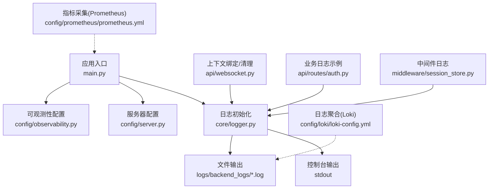
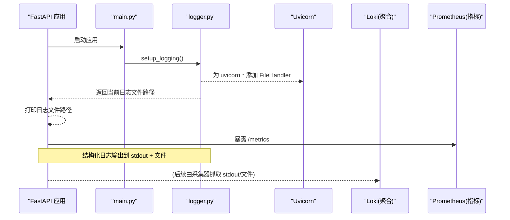
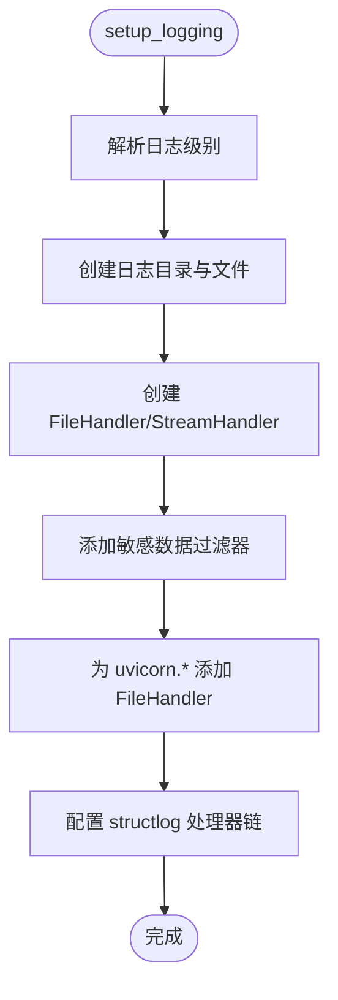
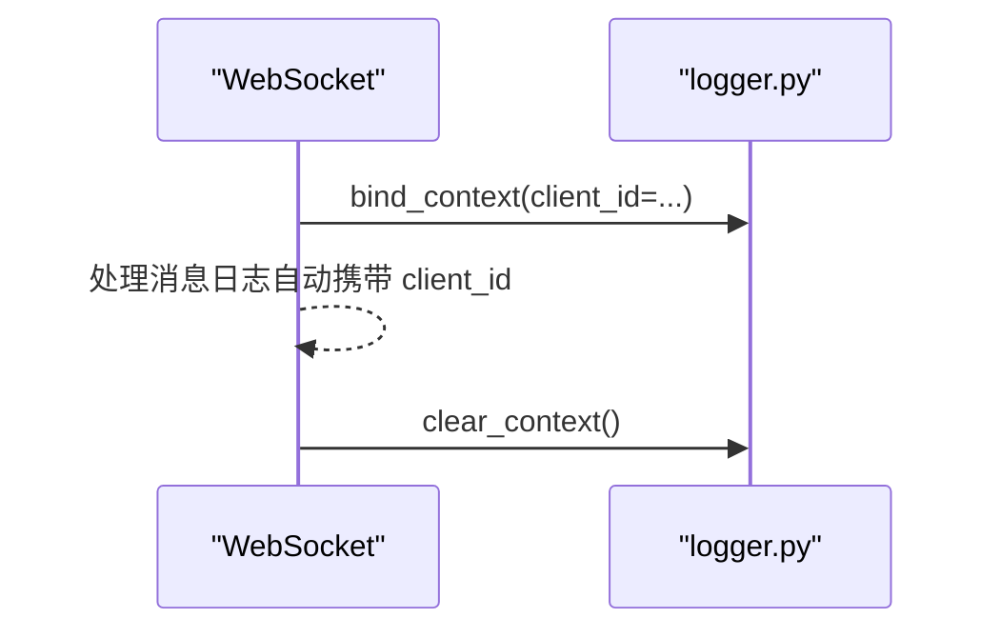
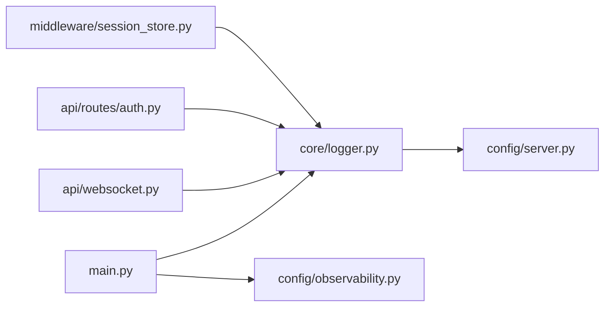

# 日志系统

<cite>
**本文引用的文件**   
- [backend_design/nexus/core/logger.py](file://backend_design/nexus/core/logger.py)
- [backend_design/nexus/main.py](file://backend_design/nexus/main.py)
- [config/loki/loki-config.yml](file://config/loki/loki-config.yml)
- [config/prometheus/prometheus.yml](file://config/prometheus/prometheus.yml)
- [backend_design/nexus/config/server.py](file://backend_design/nexus/config/server.py)
- [backend_design/nexus/config/observability.py](file://backend_design/nexus/config/observability.py)
- [backend_design/nexus/api/websocket.py](file://backend_design/nexus/api/websocket.py)
- [backend_design/nexus/api/routes/auth.py](file://backend_design/nexus/api/routes/auth.py)
- [backend_design/nexus/middleware/session_store.py](file://backend_design/nexus/middleware/session_store.py)
</cite>

## 目录
1. [简介](#简介)
2. [项目结构](#项目结构)
3. [核心组件](#核心组件)
4. [架构总览](#架构总览)
5. [详细组件分析](#详细组件分析)
6. [依赖关系分析](#依赖关系分析)
7. [性能考量](#性能考量)
8. [故障排查指南](#故障排查指南)
9. [结论](#结论)
10. [附录](#附录)

## 简介
本文件为 NexusCockpit 的日志系统提供完整、深入的文档，涵盖结构化日志的设计理念与实现、日志级别与格式化、输出目标与轮转策略、上下文传递（含异步场景）、以及日志聚合与分析工具集成（Loki/Prometheus/Grafana/Langfuse）。同时给出最佳实践、性能分析与优化建议，帮助开发者高效记录、定位问题并提升可观测性。

## 项目结构
NexusCockpit 的日志体系围绕以下关键位置组织：
- 结构化日志核心：backend_design/nexus/core/logger.py
- 应用启动与初始化：backend_design/nexus/main.py
- 服务器与日志级别配置：backend_design/nexus/config/server.py
- 可观测性配置（Langfuse、Prometheus）：backend_design/nexus/config/observability.py
- 日志聚合（Loki）：config/loki/loki-config.yml
- 指标采集（Prometheus）：config/prometheus/prometheus.yml
- 上下文绑定与清理（WebSocket）：backend_design/nexus/api/websocket.py
- 业务模块日志示例（认证接口等）：backend_design/nexus/api/routes/auth.py
- 中间件中的日志使用（会话存储）：backend_design/nexus/middleware/session_store.py

图表来源 
- [backend_design/nexus/main.py:75-101](file://backend_design/nexus/main.py#L75-L101)
- [backend_design/nexus/core/logger.py:83-202](file://backend_design/nexus/core/logger.py#L83-L202)
- [backend_design/nexus/config/server.py:15-34](file://backend_design/nexus/config/server.py#L15-L34)
- [backend_design/nexus/config/observability.py:15-47](file://backend_design/nexus/config/observability.py#L15-L47)
- [config/loki/loki-config.yml:1-56](file://config/loki/loki-config.yml#L1-L56)
- [config/prometheus/prometheus.yml:1-35](file://config/prometheus/prometheus.yml#L1-L35)
- [backend_design/nexus/api/websocket.py:38-208](file://backend_design/nexus/api/websocket.py#L38-L208)
- [backend_design/nexus/api/routes/auth.py:29-77](file://backend_design/nexus/api/routes/auth.py#L29-L77)
- [backend_design/nexus/middleware/session_store.py:27-176](file://backend_design/nexus/middleware/session_store.py#L27-L176)

章节来源
- [backend_design/nexus/main.py:75-101](file://backend_design/nexus/main.py#L75-L101)
- [backend_design/nexus/core/logger.py:83-202](file://backend_design/nexus/core/logger.py#L83-L202)
- [backend_design/nexus/config/server.py:15-34](file://backend_design/nexus/config/server.py#L15-L34)
- [backend_design/nexus/config/observability.py:15-47](file://backend_design/nexus/config/observability.py#L15-L47)
- [config/loki/loki-config.yml:1-56](file://config/loki/loki-config.yml#L1-L56)
- [config/prometheus/prometheus.yml:1-35](file://config/prometheus/prometheus.yml#L1-L35)

## 核心组件
- 结构化日志器（structlog）：统一 JSON 输出、时间戳、级别、调用栈、异常信息、敏感字段脱敏；开发环境彩色控制台，生产环境 JSON。
- 标准 logging 适配：为 uvicorn 及其子 logger 添加共享 FileHandler，确保访问日志也写入文件。
- 上下文变量：通过 structlog.contextvars 绑定 request_id、user_id 等，跨异步链路自动携带。
- 日志文件路径管理：按日期+时间生成文件名，保存在 logs/backend_logs 目录下。
- 可观测性集成：Prometheus 指标端点 /metrics；Langfuse LLM 追踪（可选）。

章节来源
- [backend_design/nexus/core/logger.py:83-202](file://backend_design/nexus/core/logger.py#L83-L202)
- [backend_design/nexus/core/logger.py:218-249](file://backend_design/nexus/core/logger.py#L218-L249)
- [backend_design/nexus/main.py:86-101](file://backend_design/nexus/main.py#L86-L101)
- [backend_design/nexus/config/observability.py:15-47](file://backend_design/nexus/config/observability.py#L15-L47)

## 架构总览
下图展示从应用启动到日志输出与聚合的整体流程：

图表来源 
- [backend_design/nexus/main.py:86-101](file://backend_design/nexus/main.py#L86-L101)
- [backend_design/nexus/core/logger.py:161-177](file://backend_design/nexus/core/logger.py#L161-L177)
- [config/prometheus/prometheus.yml:6-20](file://config/prometheus/prometheus.yml#L6-L20)

## 详细组件分析

### 结构化日志器（core/logger.py）
- 处理器链：合并上下文变量 → 添加级别 → ISO 时间戳 → 调用栈 → 异常格式化 → 敏感字段脱敏 → JSON 渲染（或开发彩色控制台）。
- 敏感数据过滤：对 key 名匹配（如 api_key、secret、token、password、authorization、jwt、bearer）进行掩码；对值中 Bearer token 与长密钥字符串进行部分掩码。
- 输出目标：
  - 控制台：StreamHandler，便于本地调试。
  - 文件：FileHandler，路径 logs/backend_logs/backend_YYYYMMDD_HHMMSS.log。
- 第三方库降噪：redis-py、neo4j、aiosqlite、openai、httpcore、python_multipart 等默认降级至 INFO/WARNING/ERROR，避免刷屏。
- 上下文 API：get_logger(name)、bind_context(**kwargs)、clear_context()。

图表来源 
- [backend_design/nexus/core/logger.py:93-177](file://backend_design/nexus/core/logger.py#L93-L177)
- [backend_design/nexus/core/logger.py:180-202](file://backend_design/nexus/core/logger.py#L180-L202)

章节来源
- [backend_design/nexus/core/logger.py:33-81](file://backend_design/nexus/core/logger.py#L33-L81)
- [backend_design/nexus/core/logger.py:83-202](file://backend_design/nexus/core/logger.py#L83-L202)
- [backend_design/nexus/core/logger.py:218-249](file://backend_design/nexus/core/logger.py#L218-L249)

### 应用启动与日志文件路径（main.py）
- 在 lifespan 中调用 setup_logging() 初始化日志。
- 获取当前日志文件路径并打印，便于运维快速定位。
- 初始化 Prometheus 指标、Agent、缓存、向量/图谱存储等组件。

章节来源
- [backend_design/nexus/main.py:75-101](file://backend_design/nexus/main.py#L75-L101)

### 服务器与日志级别配置（config/server.py）
- ServerConfig 包含 host、port、debug、log_level、CORS 等。
- log_level 支持字符串（如 "INFO"），在 logger 中转换为 logging 常量。

章节来源
- [backend_design/nexus/config/server.py:15-34](file://backend_design/nexus/config/server.py#L15-L34)

### 可观测性配置（config/observability.py）
- LangfuseConfig：LLM 追踪平台配置（public_key、secret_key、host 等），is_enabled 判断是否启用。
- ObservabilityConfig：Prometheus URL、Grafana URL（仅用于日志输出）。

章节来源
- [backend_design/nexus/config/observability.py:15-47](file://backend_design/nexus/config/observability.py#L15-L47)

### WebSocket 上下文绑定与清理（api/websocket.py）
- 在连接建立时 bind_context(client_id=...)，确保后续所有日志携带 client_id。
- 在连接关闭时 clear_context()，防止上下文泄漏。

图表来源 
- [backend_design/nexus/api/websocket.py:38-208](file://backend_design/nexus/api/websocket.py#L38-L208)
- [backend_design/nexus/core/logger.py:230-249](file://backend_design/nexus/core/logger.py#L230-L249)

章节来源
- [backend_design/nexus/api/websocket.py:38-208](file://backend_design/nexus/api/websocket.py#L38-L208)

### 业务模块日志示例（api/routes/auth.py）
- 在认证相关接口中使用 get_logger(__name__) 记录用户操作与错误。
- 注意避免在日志中直接输出敏感信息（密码、验证码等），应遵循脱敏规范。

章节来源
- [backend_design/nexus/api/routes/auth.py:29-77](file://backend_design/nexus/api/routes/auth.py#L29-L77)

### 中间件日志（middleware/session_store.py）
- Redis 连接失败时降级内存，并记录警告。
- 读写异常时记录错误，保证服务可用性与可诊断性。

章节来源
- [backend_design/nexus/middleware/session_store.py:27-176](file://backend_design/nexus/middleware/session_store.py#L27-L176)

## 依赖关系分析
- logger.py 依赖 config.server 的 log_level 与 debug 控制输出格式与级别。
- main.py 在启动阶段调用 setup_logging() 并暴露 /metrics。
- websocket.py 使用 logger 的上下文绑定与清理，保障异步链路上下文一致性。
- observability.py 提供 Langfuse 与 Prometheus 的配置项。

图表来源 
- [backend_design/nexus/core/logger.py:83-202](file://backend_design/nexus/core/logger.py#L83-L202)
- [backend_design/nexus/config/server.py:15-34](file://backend_design/nexus/config/server.py#L15-L34)
- [backend_design/nexus/config/observability.py:15-47](file://backend_design/nexus/config/observability.py#L15-L47)
- [backend_design/nexus/main.py:86-101](file://backend_design/nexus/main.py#L86-L101)
- [backend_design/nexus/api/websocket.py:38-208](file://backend_design/nexus/api/websocket.py#L38-L208)
- [backend_design/nexus/api/routes/auth.py:29-77](file://backend_design/nexus/api/routes/auth.py#L29-L77)
- [backend_design/nexus/middleware/session_store.py:27-176](file://backend_design/nexus/middleware/session_store.py#L27-L176)

章节来源
- [backend_design/nexus/core/logger.py:83-202](file://backend_design/nexus/core/logger.py#L83-L202)
- [backend_design/nexus/config/server.py:15-34](file://backend_design/nexus/config/server.py#L15-L34)
- [backend_design/nexus/config/observability.py:15-47](file://backend_design/nexus/config/observability.py#L15-L47)
- [backend_design/nexus/main.py:86-101](file://backend_design/nexus/main.py#L86-L101)

## 性能考量
- 日志级别控制：生产环境建议使用 INFO 或 WARNING，减少 DEBUG 输出带来的 I/O 压力。
- 结构化 JSON：便于高效采集与索引，但需避免在 event_dict 中放入过大对象。
- 脱敏处理：正则匹配会遍历 event_dict，建议在高频路径上谨慎添加大字段。
- 第三方库降噪：已对 redis-py、neo4j、openai 等降级，避免大量无用日志影响吞吐。
- 文件 I/O：单文件写入，高并发下可能成为瓶颈；建议结合外部采集器（如 Filebeat/Fluent Bit）将 stdout 或文件转发至 Loki。

[本节为通用指导，不直接分析具体文件]

## 故障排查指南
- 无法找到日志文件：确认 logs/backend_logs 目录存在且应用有写权限；检查 main.py 启动后是否打印了日志文件路径。
- 访问日志未写入文件：确认 uvicorn.* logger 已添加 FileHandler；检查日志级别设置。
- 敏感信息泄露：检查 event_dict 键名是否符合敏感模式；确认值中是否包含 Bearer token 或长密钥字符串。
- 上下文丢失：在 WebSocket 或异步任务中确保 bind_context/clear_context 成对出现。
- Prometheus 指标不可用：检查 /metrics 端点是否暴露；确认 prometheus.yml 的 scrape 配置正确。

章节来源
- [backend_design/nexus/core/logger.py:161-177](file://backend_design/nexus/core/logger.py#L161-L177)
- [backend_design/nexus/main.py:86-101](file://backend_design/nexus/main.py#L86-L101)
- [config/prometheus/prometheus.yml:6-20](file://config/prometheus/prometheus.yml#L6-L20)

## 结论
NexusCockpit 的日志系统以 structlog 为核心，结合标准 logging 与 uvicorn 适配，实现了结构化、安全、可追踪的日志输出。通过上下文绑定与清理机制，保障了异步链路的一致性；通过 Prometheus 与 Langfuse 的可观测性配置，形成了完整的指标与追踪闭环。配合 Loki 的日志聚合能力，可为开发与运维提供高效的排障与监控体验。

[本节为总结，不直接分析具体文件]

## 附录

### 日志级别与格式化
- 级别：DEBUG < INFO < WARNING < ERROR < CRITICAL，可通过 .env 的 LOG_LEVEL 控制。
- 格式化：
  - 开发环境：彩色控制台（ConsoleRenderer）。
  - 生产环境：JSON（JSONRenderer），便于 ELK/Loki 采集。

章节来源
- [backend_design/nexus/config/server.py:23-25](file://backend_design/nexus/config/server.py#L23-L25)
- [backend_design/nexus/core/logger.py:180-202](file://backend_design/nexus/core/logger.py#L180-L202)

### 输出目标与轮转策略
- 输出目标：
  - 控制台：stdout，便于本地调试。
  - 文件：logs/backend_logs/backend_YYYYMMDD_HHMMSS.log。
- 轮转策略：当前实现按启动时间命名新文件，未内置自动轮转；建议结合外部工具（如 logrotate/Filebeat）进行轮转与归档。

章节来源
- [backend_design/nexus/core/logger.py:97-109](file://backend_design/nexus/core/logger.py#L97-L109)

### 上下文信息传递（异步）
- 使用 bind_context(request_id=user_id=...) 绑定上下文。
- 在请求/连接结束时调用 clear_context() 清理。
- 适用于 FastAPI 中间件、WebSocket、异步任务等场景。

章节来源
- [backend_design/nexus/core/logger.py:230-249](file://backend_design/nexus/core/logger.py#L230-L249)
- [backend_design/nexus/api/websocket.py:99-208](file://backend_design/nexus/api/websocket.py#L99-L208)

### 日志聚合与分析工具集成
- Loki：单机模式配置位于 config/loki/loki-config.yml，保留期 7 天，文件系统存储。
- Prometheus：采集 Python 后端与 Go Gateway 指标，job_name 分别为 nexus-ai 与 nexus-gate。
- Grafana：可视化仪表盘（参考 docs 或 grafana provisioning 配置）。
- Langfuse：LLM 追踪（可选），通过环境变量配置 public_key/secret_key/host。

章节来源
- [config/loki/loki-config.yml:1-56](file://config/loki/loki-config.yml#L1-L56)
- [config/prometheus/prometheus.yml:1-35](file://config/prometheus/prometheus.yml#L1-L35)
- [backend_design/nexus/config/observability.py:15-47](file://backend_design/nexus/config/observability.py#L15-L47)

### 实际日志记录示例与最佳实践
- 示例位置：
  - 认证接口：backend_design/nexus/api/routes/auth.py
  - 会话存储：backend_design/nexus/middleware/session_store.py
- 最佳实践：
  - 使用 get_logger(__name__) 获取模块级日志器。
  - 避免在日志中输出敏感信息；必要时使用脱敏键名或值匹配规则。
  - 在异步链路中始终绑定/清理上下文。
  - 合理选择日志级别，生产环境避免 DEBUG。
  - 将大对象序列化后再记录，避免 event_dict 过大。

章节来源
- [backend_design/nexus/api/routes/auth.py:29-77](file://backend_design/nexus/api/routes/auth.py#L29-L77)
- [backend_design/nexus/middleware/session_store.py:27-176](file://backend_design/nexus/middleware/session_store.py#L27-L176)
- [backend_design/nexus/core/logger.py:33-81](file://backend_design/nexus/core/logger.py#L33-L81)