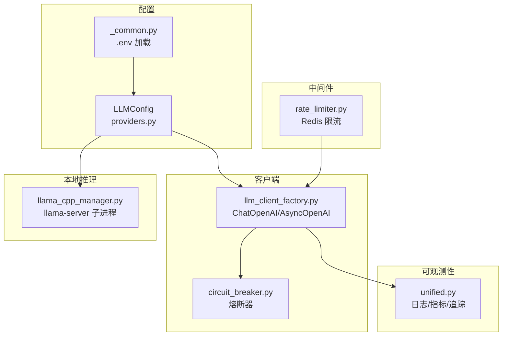
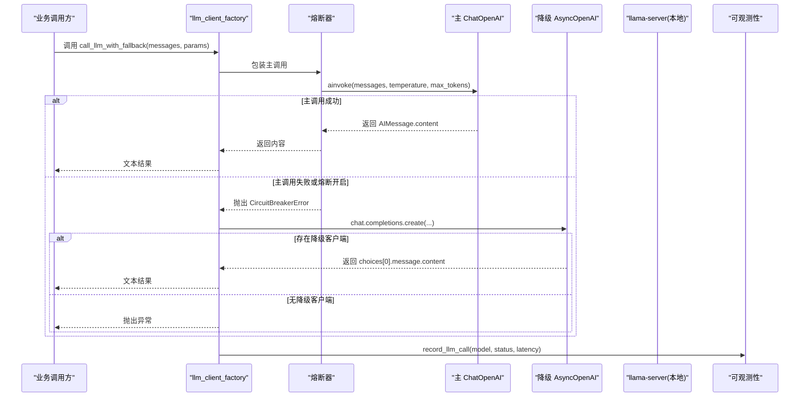
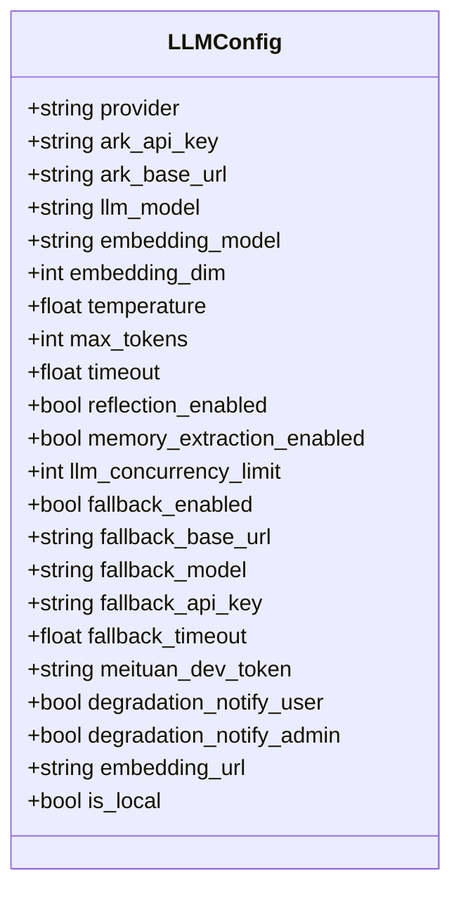
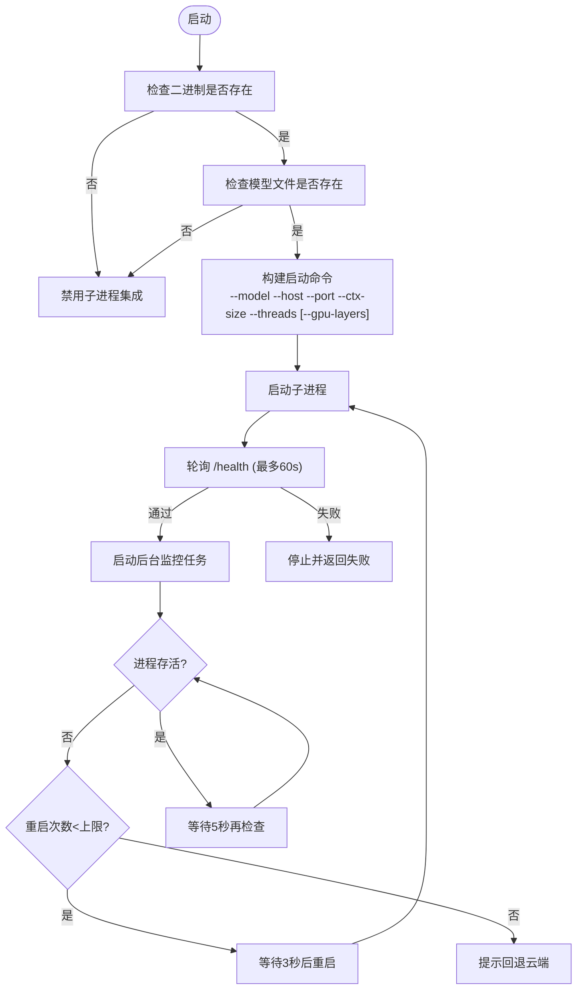
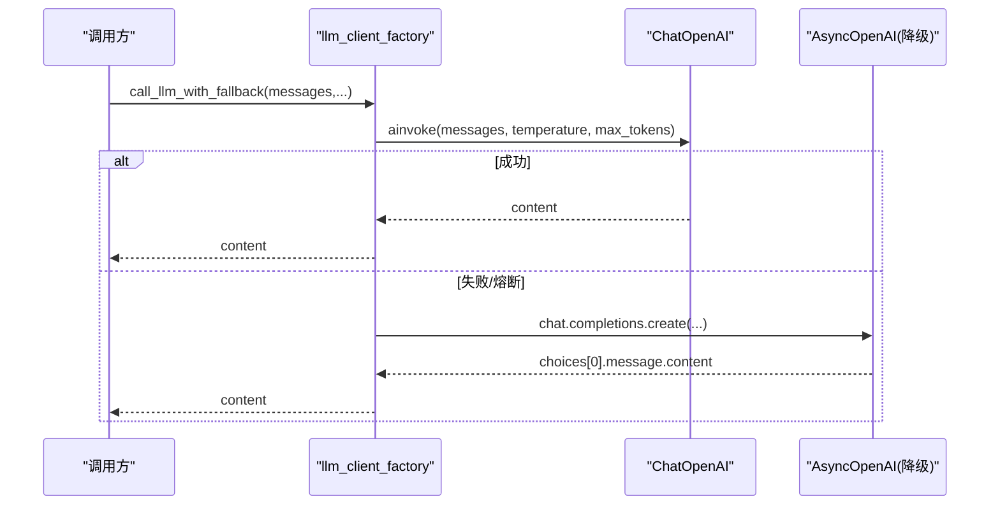
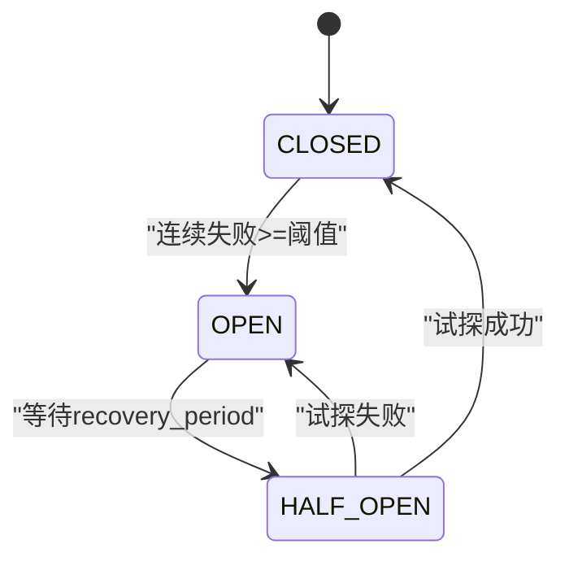
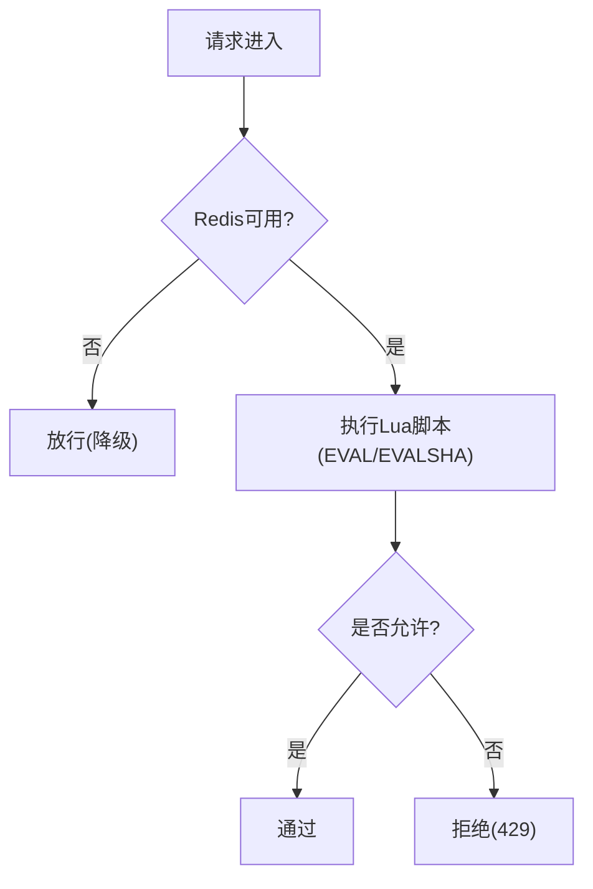
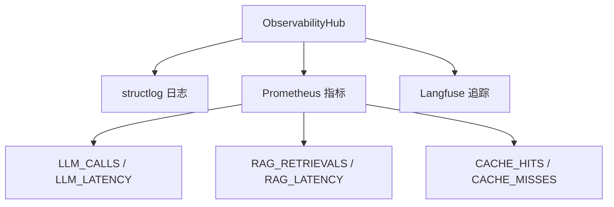
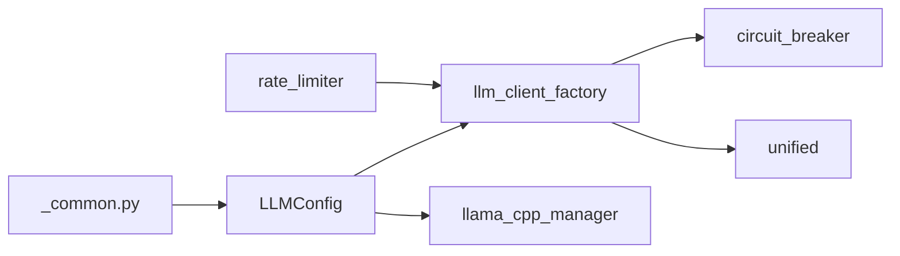

# LLM配置

<cite>
**本文引用的文件**   
- [llm.py](file://backend_design/nexus/config/llm.py)
- [providers.py](file://backend_design/nexus/config/providers.py)
- [_common.py](file://backend_design/nexus/config/_common.py)
- [llama_cpp_manager.py](file://backend_design/nexus/core/llama_cpp_manager.py)
- [llm_client_factory.py](file://backend_design/nexus/agent/llm_client_factory.py)
- [circuit_breaker.py](file://backend_design/nexus/core/circuit_breaker.py)
- [rate_limiter.py](file://backend_design/nexus/middleware/rate_limiter.py)
- [unified.py](file://backend_design/nexus/observability/unified.py)
</cite>

## 目录
1. [简介](#简介)
2. [项目结构](#项目结构)
3. [核心组件](#核心组件)
4. [架构总览](#架构总览)
5. [详细组件分析](#详细组件分析)
6. [依赖关系分析](#依赖关系分析)
7. [性能与调优](#性能与调优)
8. [故障排查指南](#故障排查指南)
9. [结论](#结论)
10. [附录：配置项速查](#附录配置项速查)

## 简介
本文件面向 NexusCockpit 的 LLM 配置，系统性说明多模型支持（云端 OpenAI 兼容、本地 llama.cpp）、模型选择策略、负载均衡与故障转移、API 密钥管理、请求限流与成本控制、本地模型部署参数、并行调用与结果融合、响应时间优化、版本管理与灰度发布思路、健康检查与监控告警等。文档严格基于仓库代码实现进行解读，并提供可视化图示帮助理解。

## 项目结构
NexusCockpit 将 LLM 相关配置与运行时能力拆分为多个模块：
- 配置层：统一通过 Pydantic Settings 加载环境变量，提供 LLMConfig、ProvidersConfig 等
- 客户端层：统一创建 ChatOpenAI/AsyncOpenAI 客户端，封装降级与熔断
- 本地推理：llama.cpp 子进程管理器负责启动、健康检查、自动重启与优雅停止
- 中间件：Redis 原子滑动窗口/令牌桶限流
- 可观测性：统一日志、指标、追踪门面

图表来源 
- [llm.py:15-72](file://backend_design/nexus/config/llm.py#L15-L72)
- [providers.py:15-47](file://backend_design/nexus/config/providers.py#L15-L47)
- [_common.py:39-53](file://backend_design/nexus/config/_common.py#L39-L53)
- [llm_client_factory.py:59-111](file://backend_design/nexus/agent/llm_client_factory.py#L59-L111)
- [circuit_breaker.py:48-177](file://backend_design/nexus/core/circuit_breaker.py#L48-L177)
- [llama_cpp_manager.py:40-240](file://backend_design/nexus/core/llama_cpp_manager.py#L40-L240)
- [rate_limiter.py:117-297](file://backend_design/nexus/middleware/rate_limiter.py#L117-L297)
- [unified.py:78-269](file://backend_design/nexus/observability/unified.py#L78-L269)

章节来源
- [llm.py:15-72](file://backend_design/nexus/config/llm.py#L15-L72)
- [providers.py:15-47](file://backend_design/nexus/config/providers.py#L15-L47)
- [_common.py:39-53](file://backend_design/nexus/config/_common.py#L39-L53)

## 核心组件
- LLMConfig：集中管理 LLM 提供商连接参数、温度、最大 token、超时、并发限制、降级开关、本地 fallback 参数、嵌入模型维度等；支持 provider=cloud/local 一键切换
- ProvidersConfig：控制向量库、图存储、缓存、重排器等 Provider 的选择（默认 local）
- LlamaCppProcessManager：管理 llama-server 子进程生命周期、健康检查、崩溃重启、优雅停止、GPU/CPU 参数注入
- LLM Client Factory：统一创建 ChatOpenAI/AsyncOpenAI 客户端，内置熔断器保护与降级到本地 fallback
- Rate Limiter：基于 Redis 的滑动窗口与令牌桶限流，Lua 脚本保证原子性
- Observability Hub：统一日志、指标、追踪入口，记录 LLM 调用与延迟

章节来源
- [llm.py:15-72](file://backend_design/nexus/config/llm.py#L15-L72)
- [providers.py:15-47](file://backend_design/nexus/config/providers.py#L15-L47)
- [llama_cpp_manager.py:40-240](file://backend_design/nexus/core/llama_cpp_manager.py#L40-L240)
- [llm_client_factory.py:59-111](file://backend_design/nexus/agent/llm_client_factory.py#L59-L111)
- [rate_limiter.py:117-297](file://backend_design/nexus/middleware/rate_limiter.py#L117-L297)
- [unified.py:78-269](file://backend_design/nexus/observability/unified.py#L78-L269)

## 架构总览
下图展示从配置到客户端、熔断、降级与本地推理的整体流程。

图表来源 
- [llm_client_factory.py:149-207](file://backend_design/nexus/agent/llm_client_factory.py#L149-L207)
- [circuit_breaker.py:97-177](file://backend_design/nexus/core/circuit_breaker.py#L97-L177)
- [unified.py:229-234](file://backend_design/nexus/observability/unified.py#L229-L234)

## 详细组件分析

### LLMConfig 多模型支持与配置参数
- 提供商选择：provider 字段支持 cloud/local；当为 local 时自动将 base_url、api_key、model、timeout 切换到本地 llama-server 参数
- 云端参数：ark_api_key、ark_base_url、llm_model、temperature、max_tokens、timeout
- 本地参数：fallback_base_url、fallback_model、fallback_api_key、fallback_timeout
- 其他：embedding_model、embedding_dim、reflection_enabled、memory_extraction_enabled、llm_concurrency_limit、降级通知开关等
- 计算字段：embedding_url、is_local

图表来源 
- [llm.py:15-72](file://backend_design/nexus/config/llm.py#L15-L72)

章节来源
- [llm.py:15-72](file://backend_design/nexus/config/llm.py#L15-L72)

### 本地模型部署：llama.cpp 子进程管理
- 二进制与模型路径：支持环境变量覆盖 LLAMA_CPP_BINARY、LLAMA_CPP_MODEL_PATH
- 运行参数：host/port、ctx_size、gpu_layers、threads、并行与连续批处理
- 健康检查：启动后轮询 /health，超时则失败并停止
- 崩溃恢复：后台监控，最多重启次数，超过阈值提示回退云端
- 优雅停止：SIGTERM → 等待 → SIGKILL

图表来源 
- [llama_cpp_manager.py:88-196](file://backend_design/nexus/core/llama_cpp_manager.py#L88-L196)

章节来源
- [llama_cpp_manager.py:40-240](file://backend_design/nexus/core/llama_cpp_manager.py#L40-L240)

### 客户端工厂与降级策略
- get_chat_model()：创建 ChatOpenAI 单例，读取 LLMConfig 中的 model、base_url、api_key、temperature、max_tokens、timeout、重试次数
- get_llm_client()：已弃用，保留 AsyncOpenAI 单例用于兼容
- get_fallback_client()：仅在 cloud 模式且启用 fallback 时创建
- call_llm_with_fallback()：优先使用 ChatOpenAI，失败或熔断开启时降级到 AsyncOpenAI 本地

图表来源 
- [llm_client_factory.py:59-111](file://backend_design/nexus/agent/llm_client_factory.py#L59-L111)
- [llm_client_factory.py:149-207](file://backend_design/nexus/agent/llm_client_factory.py#L149-L207)

章节来源
- [llm_client_factory.py:59-111](file://backend_design/nexus/agent/llm_client_factory.py#L59-L111)
- [llm_client_factory.py:149-207](file://backend_design/nexus/agent/llm_client_factory.py#L149-L207)

### 熔断器与故障转移
- 三态：CLOSED → OPEN（连续失败达到阈值）→ HALF_OPEN（恢复期后试探）→ CLOSED（成功）
- 在 LLM 调用中，熔断开启直接跳过主客户端，走降级路径，避免长时间等待

图表来源 
- [circuit_breaker.py:48-177](file://backend_design/nexus/core/circuit_breaker.py#L48-L177)

章节来源
- [circuit_breaker.py:48-177](file://backend_design/nexus/core/circuit_breaker.py#L48-L177)

### 请求限流与成本控制
- 滑动窗口：基于 Redis ZSET，原子 Lua 脚本清理旧条目、统计计数、添加新条目，超限不写入计数器避免污染
- 令牌桶：允许突发流量，按速率补充令牌，适合 LLM API 调用场景
- 降级策略：Redis 不可用时放行，确保服务可用性

图表来源 
- [rate_limiter.py:117-297](file://backend_design/nexus/middleware/rate_limiter.py#L117-L297)

章节来源
- [rate_limiter.py:117-297](file://backend_design/nexus/middleware/rate_limiter.py#L117-L297)

### 可观测性与监控告警
- 统一门面：setup() 初始化日志、指标、追踪；shutdown() 刷新缓冲
- 指标：记录 LLM 调用次数与延迟、RAG 检索、缓存命中/未命中、Agent 节点调用等
- 追踪：Langfuse 上下文自动绑定 trace_id，便于链路追踪

图表来源 
- [unified.py:78-269](file://backend_design/nexus/observability/unified.py#L78-L269)

章节来源
- [unified.py:78-269](file://backend_design/nexus/observability/unified.py#L78-L269)

## 依赖关系分析
- LLMConfig 依赖 _common.py 的环境文件加载逻辑
- LLM Client Factory 依赖 LLMConfig 与熔断器
- LlamaCppProcessManager 独立于 Python 进程，通过 HTTP 暴露 OpenAI 兼容接口
- Rate Limiter 依赖 Redis，Lua 脚本原子化操作
- Observability Hub 聚合日志、指标、追踪

图表来源 
- [_common.py:39-53](file://backend_design/nexus/config/_common.py#L39-L53)
- [llm.py:15-72](file://backend_design/nexus/config/llm.py#L15-L72)
- [llm_client_factory.py:59-111](file://backend_design/nexus/agent/llm_client_factory.py#L59-L111)
- [circuit_breaker.py:48-177](file://backend_design/nexus/core/circuit_breaker.py#L48-L177)
- [llama_cpp_manager.py:40-240](file://backend_design/nexus/core/llama_cpp_manager.py#L40-L240)
- [rate_limiter.py:117-297](file://backend_design/nexus/middleware/rate_limiter.py#L117-L297)
- [unified.py:78-269](file://backend_design/nexus/observability/unified.py#L78-L269)

章节来源
- [llm.py:15-72](file://backend_design/nexus/config/llm.py#L15-L72)
- [llm_client_factory.py:59-111](file://backend_design/nexus/agent/llm_client_factory.py#L59-L111)
- [llama_cpp_manager.py:40-240](file://backend_design/nexus/core/llama_cpp_manager.py#L40-L240)
- [rate_limiter.py:117-297](file://backend_design/nexus/middleware/rate_limiter.py#L117-L297)
- [unified.py:78-269](file://backend_design/nexus/observability/unified.py#L78-L269)

## 性能与调优
- 模型选择策略
  - 默认 cloud 模式，provider=local 时自动切换至本地 llama-server
  - 建议根据场景选择：高实时/低延迟场景优先本地小模型，复杂推理/高质量回答优先云端大模型
- 负载均衡与并行
  - llama-server 启动参数包含 --parallel 与 --cont-batching，提升并发吞吐
  - LLMConfig.llm_concurrency_limit 可用于限制并发（当前默认 0，表示不限制）
- 响应时间优化
  - 合理设置 temperature、max_tokens、timeout，避免过长生成与超时
  - 启用熔断器减少失败等待，快速降级到本地
- 成本控制
  - 通过 rate limiter 限制单位时间请求数，结合令牌桶平衡突发与平均速率
  - 使用本地模型降低云端调用成本
- 版本管理与灰度
  - 通过环境变量切换 llm_model/fallback_model，配合熔断与降级实现灰度与回滚
  - 建议在观察面板上监控 LLM_LATENCY 与错误率，逐步放量

章节来源
- [llm.py:15-72](file://backend_design/nexus/config/llm.py#L15-L72)
- [llama_cpp_manager.py:115-133](file://backend_design/nexus/core/llama_cpp_manager.py#L115-L133)
- [llm_client_factory.py:149-207](file://backend_design/nexus/agent/llm_client_factory.py#L149-L207)
- [rate_limiter.py:212-277](file://backend_design/nexus/middleware/rate_limiter.py#L212-L277)

## 故障排查指南
- 本地模型无法启动
  - 检查二进制与模型文件路径是否正确
  - 查看健康检查是否通过（/health），确认端口占用与防火墙
  - 关注崩溃重启次数，超过上限需排查外部依赖或资源不足
- 云端调用失败
  - 检查 API Key 与 base_url 是否正确
  - 观察熔断器状态，若频繁触发需排查上游稳定性
  - 查看可观测性指标 LLM_CALLS/LLM_LATENCY 与错误率
- 限流触发
  - 调整滑动窗口大小与最大请求数，或令牌桶容量与速率
  - 检查 Redis 连通性与 Lua 脚本加载情况

章节来源
- [llama_cpp_manager.py:88-196](file://backend_design/nexus/core/llama_cpp_manager.py#L88-L196)
- [llm_client_factory.py:149-207](file://backend_design/nexus/agent/llm_client_factory.py#L149-L207)
- [rate_limiter.py:117-297](file://backend_design/nexus/middleware/rate_limiter.py#L117-L297)
- [unified.py:229-234](file://backend_design/nexus/observability/unified.py#L229-L234)

## 结论
NexusCockpit 的 LLM 配置以 LLMConfig 为核心，结合客户端工厂、熔断器与本地 llama.cpp 子进程管理，实现了云/本地无缝切换、自动降级与高可用保障。通过 Redis 限流与统一可观测性，系统具备稳定的性能与可运维性。建议在生产环境中结合指标与日志持续调优，并根据业务需求选择合适的模型与参数组合。

## 附录：配置项速查
- LLMConfig（关键项）
  - provider：cloud/local
  - ark_api_key、ark_base_url、llm_model、temperature、max_tokens、timeout
  - embedding_model、embedding_dim
  - fallback_enabled、fallback_base_url、fallback_model、fallback_api_key、fallback_timeout
  - llm_concurrency_limit、degradation_notify_user/admin
- ProvidersConfig（关键项）
  - vector_store、graph_store、cache、reranker、checkpoint
- LlamaCppProcessManager（关键环境变量）
  - LLAMA_CPP_BINARY、LLAMA_CPP_MODEL_PATH、LLAMA_CPP_PORT、LLAMA_CPP_HOST
  - LLAMA_CPP_CTX_SIZE、LLAMA_CPP_GPU_LAYERS、LLAMA_CPP_THREADS
- Rate Limiter（关键项）
  - 滑动窗口：max_requests、window_seconds
  - 令牌桶：capacity、rate、cost
- Observability（关键指标）
  - LLM_CALLS、LLM_LATENCY、RAG_RETRIEVALS、RAG_LATENCY、CACHE_HITS、CACHE_MISSES

章节来源
- [llm.py:15-72](file://backend_design/nexus/config/llm.py#L15-L72)
- [providers.py:15-47](file://backend_design/nexus/config/providers.py#L15-L47)
- [llama_cpp_manager.py:57-78](file://backend_design/nexus/core/llama_cpp_manager.py#L57-L78)
- [rate_limiter.py:117-297](file://backend_design/nexus/middleware/rate_limiter.py#L117-L297)
- [unified.py:229-234](file://backend_design/nexus/observability/unified.py#L229-L234)