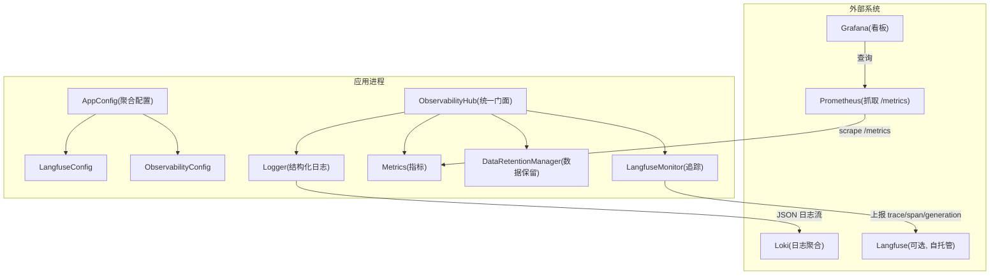
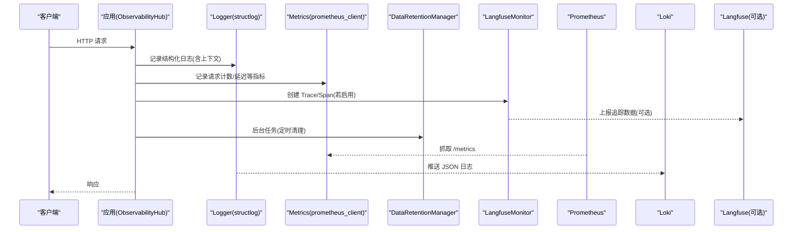
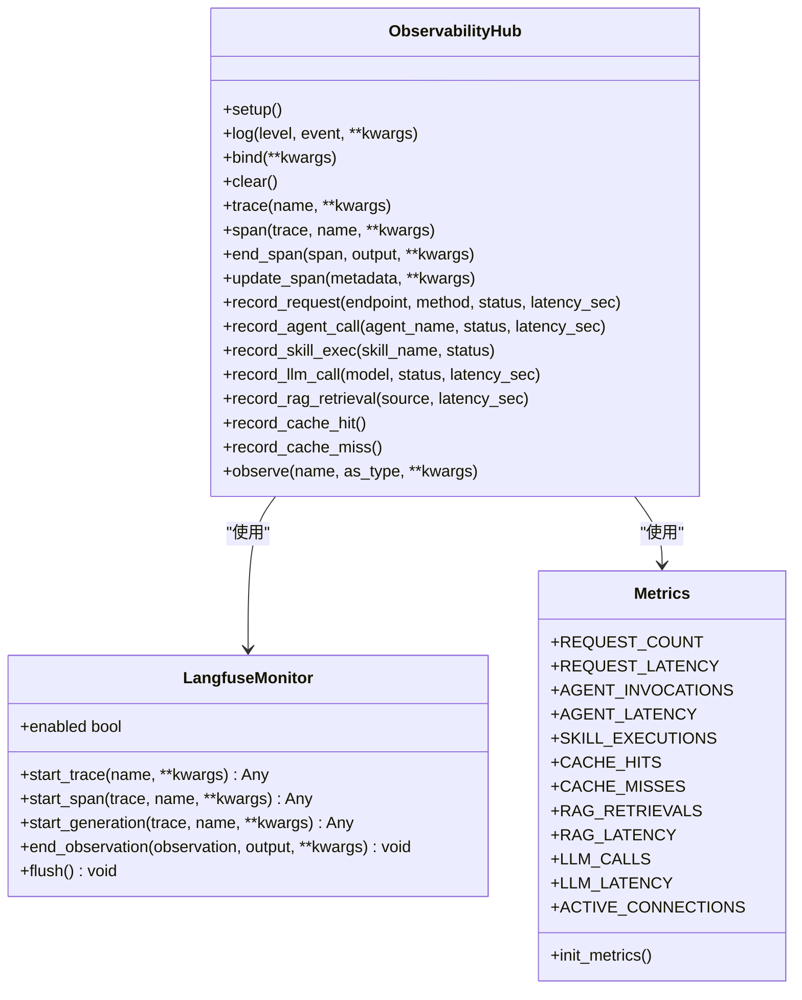
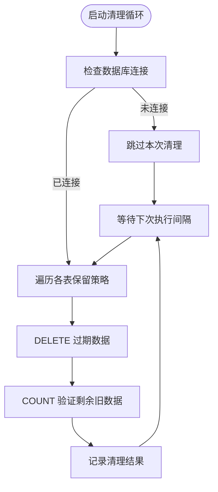
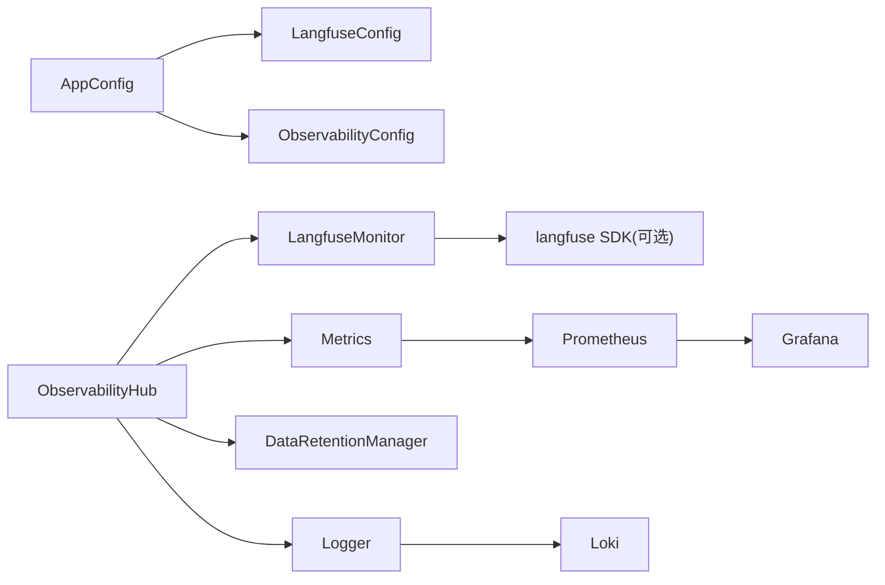

# 可观测性配置

<cite>
**本文引用的文件**   
- [observability.py](file://backend_design/nexus/config/observability.py)
- [__init__.py](file://backend_design/nexus/config/__init__.py)
- [langfuse.py](file://backend_design/nexus/observability/langfuse.py)
- [metrics.py](file://backend_design/nexus/observability/metrics.py)
- [unified.py](file://backend_design/nexus/observability/unified.py)
- [data_retention.py](file://backend_design/nexus/observability/data_retention.py)
- [logger.py](file://backend_design/nexus/core/logger.py)
- [prometheus.yml](file://config/prometheus/prometheus.yml)
- [grafana-datasource.yml](file://config/grafana/provisioning/datasources/prometheus.yml)
- [nexuscockpit-overview.json](file://config/grafana/provisioning/dashboards/nexuscockpit-overview.json)
- [loki-config.yml](file://config/loki/loki-config.yml)
</cite>

## 目录
1. [简介](#简介)
2. [项目结构](#项目结构)
3. [核心组件](#核心组件)
4. [架构总览](#架构总览)
5. [详细组件分析](#详细组件分析)
6. [依赖关系分析](#依赖关系分析)
7. [性能考量](#性能考量)
8. [故障排查指南](#故障排查指南)
9. [结论](#结论)
10. [附录](#附录)

## 简介
本文件面向 NexusCockpit 的可观测性配置，覆盖以下方面：
- Langfuse 追踪配置（API 密钥、服务地址、启用判定等）
- Prometheus 指标采集（端点、指标粒度、标签设计）
- 日志配置（级别、输出格式、结构化字段与脱敏）
- 分布式追踪（Trace ID 传播、Span 采样、链路聚合）
- 性能指标定义、业务埋点与异常检测
- 监控看板、告警规则与通知渠道集成建议
- 数据保留策略、查询优化与成本管控
- 调试工具使用、问题定位方法与性能分析方法

## 项目结构
NexusCockpit 的可观测性由“配置 + 实现 + 基础设施”三部分构成：
- 配置层：LangfuseConfig、ObservabilityConfig 通过 pydantic-settings 从环境变量加载
- 实现层：统一门面 ObservabilityHub 整合日志、追踪、指标与数据保留；LangfuseMonitor 封装追踪；metrics.py 暴露 Prometheus 指标
- 基础设施层：Prometheus 抓取、Grafana 展示、Loki 日志聚合

图表来源
- [__init__.py:84-132](file://backend_design/nexus/config/__init__.py#L84-L132)
- [observability.py:15-47](file://backend_design/nexus/config/observability.py#L15-L47)
- [unified.py:78-118](file://backend_design/nexus/observability/unified.py#L78-L118)
- [langfuse.py:144-168](file://backend_design/nexus/observability/langfuse.py#L144-L168)
- [metrics.py:14-97](file://backend_design/nexus/observability/metrics.py#L14-L97)
- [data_retention.py:44-76](file://backend_design/nexus/observability/data_retention.py#L44-L76)
- [logger.py:83-202](file://backend_design/nexus/core/logger.py#L83-L202)

章节来源
- [__init__.py:84-132](file://backend_design/nexus/config/__init__.py#L84-L132)
- [observability.py:15-47](file://backend_design/nexus/config/observability.py#L15-L47)

## 核心组件
- LangfuseConfig：定义 Langfuse 追踪所需的环境变量与默认值，提供 is_enabled 判断是否启用追踪。
- ObservabilityConfig：定义 Prometheus/Grafana 相关 URL，便于日志输出或辅助信息打印。
- ObservabilityHub：统一入口，负责初始化日志、指标、追踪与数据保留，并提供统一的 log/trace/span/record_* API。
- LangfuseMonitor：封装 Langfuse SDK，未安装或未配置时自动降级为空操作。
- metrics：基于 prometheus_client 暴露 /metrics 端点的各类 Counter/Histogram/Gauge/Info。
- DataRetentionManager：按表维度定期清理过期数据，防止存储无限增长。
- logger：基于 structlog 的结构化日志，支持 JSON/控制台输出、敏感字段脱敏与上下文绑定。

章节来源
- [observability.py:15-47](file://backend_design/nexus/config/observability.py#L15-L47)
- [unified.py:78-118](file://backend_design/nexus/observability/unified.py#L78-L118)
- [langfuse.py:144-168](file://backend_design/nexus/observability/langfuse.py#L144-L168)
- [metrics.py:14-97](file://backend_design/nexus/observability/metrics.py#L14-L97)
- [data_retention.py:44-76](file://backend_design/nexus/observability/data_retention.py#L44-L76)
- [logger.py:83-202](file://backend_design/nexus/core/logger.py#L83-L202)

## 架构总览
下图展示了请求进入后，日志、指标、追踪与数据保留的协作方式。

图表来源
- [unified.py:100-136](file://backend_design/nexus/observability/unified.py#L100-L136)
- [metrics.py:99-108](file://backend_design/nexus/observability/metrics.py#L99-L108)
- [langfuse.py:144-168](file://backend_design/nexus/observability/langfuse.py#L144-L168)
- [data_retention.py:59-76](file://backend_design/nexus/observability/data_retention.py#L59-L76)
- [logger.py:83-202](file://backend_design/nexus/core/logger.py#L83-L202)

## 详细组件分析

### LangfuseConfig 追踪配置
- 关键字段与环境变量映射
  - public_key: LANGFUSE_PUBLIC_KEY
  - secret_key: LANGFUSE_SECRET_KEY
  - host: LANGFUSE_HOST
  - db_password: LANGFUSE_DB_PASSWORD
  - nextauth_secret: LANGFUSE_NEXTAUTH_SECRET
  - salt: LANGFUSE_SALT
- 启用判定
  - is_enabled: 当 public_key 与 secret_key 均非空时启用
- 默认值与加载
  - 通过 SettingsConfigDict 指定 env_file 与 extra="ignore"，仅读取声明的字段

注意：当前配置未包含采样率与数据保留策略字段，如需控制采样可在上层调用处结合业务逻辑进行条件上报。

章节来源
- [observability.py:15-33](file://backend_design/nexus/config/observability.py#L15-L33)

### ObservabilityConfig 监控指标收集
- 关键字段与环境变量映射
  - prometheus_url: PROMETHEUS_URL
  - grafana_url: GRAFANA_URL
- 用途说明
  - prometheus_url 用于连接 Prometheus 抓取目标
  - grafana_url 主要用于日志输出或辅助信息展示

章节来源
- [observability.py:35-47](file://backend_design/nexus/config/observability.py#L35-L47)

### 日志配置（级别、格式、结构化字段）
- 日志级别
  - 通过 ServerConfig.log_level 控制（如 INFO/DEBUG），在 setup_logging 中转换为 logging 常量
- 输出格式
  - 生产环境：JSON 输出（便于 Loki/ELK 采集）
  - 开发环境：彩色控制台输出
- 结构化字段
  - 时间戳（ISO）、日志级别、模块名、调用栈、异常信息
  - 上下文变量（request_id、user_id 等）自动合并到每条日志
- 敏感数据脱敏
  - 对 key 匹配 api_key/secret/token/password 等进行掩码
  - 对 Bearer token 与长密钥字符串进行部分掩码
- 文件输出
  - 统一写入 logs/backend_logs/*.log，并附加到 uvicorn 相关 logger

章节来源
- [logger.py:83-202](file://backend_design/nexus/core/logger.py#L83-L202)

### 分布式追踪（Trace ID 传播、Span 采样、链路聚合）
- Trace/Span 生命周期
  - ObservabilityHub.trace() 创建 Trace 并绑定 trace_id 到日志上下文
  - span()/end_span() 管理子 Span
  - update_current_span() 更新当前 Span 的 metadata
- 降级策略
  - 未安装 Langfuse SDK 或未配置时，observe 装饰器与 LangfuseMonitor 方法退化为空操作，不影响业务执行
- 采样策略
  - 当前代码未内置采样开关，可按需在上层根据条件决定是否创建 Trace/Span

图表来源
- [unified.py:78-269](file://backend_design/nexus/observability/unified.py#L78-L269)
- [langfuse.py:144-221](file://backend_design/nexus/observability/langfuse.py#L144-L221)
- [metrics.py:14-108](file://backend_design/nexus/observability/metrics.py#L14-L108)

章节来源
- [unified.py:175-208](file://backend_design/nexus/observability/unified.py#L175-L208)
- [langfuse.py:44-86](file://backend_design/nexus/observability/langfuse.py#L44-86)

### 指标定义与埋点
- 请求类
  - nexus_requests_total（Counter，标签：endpoint/method/status）
  - nexus_request_latency_seconds（Histogram，标签：endpoint）
- Agent 类
  - nexus_agent_invocations_total（Counter，标签：agent_name/status）
  - nexus_agent_latency_seconds（Histogram，标签：agent_name）
- 技能类
  - nexus_skill_executions_total（Counter，标签：skill_name/status）
- 缓存类
  - nexus_cache_hits_total / nexus_cache_misses_total（Counter）
- RAG 类
  - nexus_rag_retrievals_total（Counter，标签：source）
  - nexus_rag_latency_seconds（Histogram）
- LLM 类
  - nexus_llm_calls_total（Counter，标签：model/status）
  - nexus_llm_latency_seconds（Histogram）
- 系统类
  - nexus_active_connections（Gauge）

章节来源
- [metrics.py:20-97](file://backend_design/nexus/observability/metrics.py#L20-L97)

### 数据保留策略
- 清理范围与周期
  - subagent_logs: 30 天
  - mainagent_logs: 90 天
  - audit_logs: 180 天
  - chat_history: 30 天
  - llm_cost_tracking: 365 天
  - cockpit_stats: 7 天
- 执行频率
  - 默认每 86400 秒（约 24 小时）执行一次
- 清理方式
  - DELETE 旧数据，并通过 COUNT 校验剩余条数

图表来源
- [data_retention.py:78-128](file://backend_design/nexus/observability/data_retention.py#L78-L128)

章节来源
- [data_retention.py:30-38](file://backend_design/nexus/observability/data_retention.py#L30-L38)
- [data_retention.py:59-76](file://backend_design/nexus/observability/data_retention.py#L59-L76)

### 监控看板与告警建议
- 数据源
  - Grafana 数据源指向 Prometheus（http://prometheus:9090）
- 预置看板
  - 概览看板包含：API 请求总数、P95 延迟、缓存命中率、活跃连接数、按方法分组的请求速率、延迟分布、Agent 调用速率、缓存命中/未命中趋势、Agent 执行延迟、RAG/LLM 延迟等
- 告警建议（示例思路）
  - 错误率突增：nexus_requests_total 中 status=error 比率超过阈值
  - 延迟劣化：nexus_request_latency_seconds P95/P99 持续高于阈值
  - 缓存命中率下降：cache_hits/(hits+misses) 低于阈值
  - Agent 节点耗时异常：nexus_agent_latency_seconds 某 agent_name 的 P95 超阈
  - LLM 调用失败率升高：nexus_llm_calls_total 中 status!=ok 的比例上升

章节来源
- [grafana-datasource.yml:1-14](file://config/grafana/provisioning/datasources/prometheus.yml#L1-L14)
- [nexuscockpit-overview.json:1-800](file://config/grafana/provisioning/dashboards/nexuscockpit-overview.json#L1-L800)

### 日志聚合与查询优化
- Loki 配置要点
  - 单机模式，HTTP 端口 3100，GRPC 端口 9096
  - 存储后端为文件系统，schema v12，索引前缀 index_，周期 24h
  - 保留期 168h（7 天），拒绝旧样本
  - 查询结果缓存开启（100MB）
- 查询优化建议
  - 合理选择时间窗口与标签过滤，避免全量扫描
  - 利用 compactor 与 retention 控制数据规模
  - 将高频查询结果缓存命中提升

章节来源
- [loki-config.yml:1-56](file://config/loki/loki-config.yml#L1-L56)

### 调试工具与问题定位
- 日志定位
  - 查看 logs/backend_logs/*.log 获取结构化日志与脱敏后的安全内容
  - 通过 bind_context/clear_context 确保上下文不泄漏
- 指标诊断
  - 访问 /metrics 查看实时指标，结合 Prometheus 历史数据定位瓶颈
- 追踪定位
  - 启用 Langfuse 后，通过 trace_id 关联日志与链路，快速定位慢点
- 常见问题
  - Langfuse 未安装或未配置：追踪功能降级为空操作，不影响运行
  - Prometheus 抓取失败：检查 target 可达性与端口映射
  - Loki 磁盘增长：确认 retention_period 与 reject_old_samples 生效

章节来源
- [logger.py:209-249](file://backend_design/nexus/core/logger.py#L209-L249)
- [langfuse.py:36-41](file://backend_design/nexus/observability/langfuse.py#L36-L41)
- [prometheus.yml:1-35](file://config/prometheus/prometheus.yml#L1-L35)

## 依赖关系分析
- 配置聚合
  - AppConfig 聚合 LangfuseConfig、ObservabilityConfig 等子系统配置
- 运行时依赖
  - ObservabilityHub 依赖 Logger、LangfuseMonitor、Metrics、DataRetentionManager
  - LangfuseMonitor 依赖 langfuse SDK（可选）
  - Metrics 依赖 prometheus_client
  - DataRetentionManager 依赖数据库管理器
- 外部系统
  - Prometheus 抓取 /metrics
  - Grafana 读取 Prometheus 数据源
  - Loki 接收 JSON 日志
  - Langfuse（可选）接收追踪数据

图表来源
- [__init__.py:84-132](file://backend_design/nexus/config/__init__.py#L84-L132)
- [unified.py:78-118](file://backend_design/nexus/observability/unified.py#L78-L118)
- [langfuse.py:36-41](file://backend_design/nexus/observability/langfuse.py#L36-L41)
- [metrics.py:14-97](file://backend_design/nexus/observability/metrics.py#L14-L97)
- [data_retention.py:44-76](file://backend_design/nexus/observability/data_retention.py#L44-L76)

章节来源
- [__init__.py:84-132](file://backend_design/nexus/config/__init__.py#L84-L132)

## 性能考量
- 指标粒度
  - Histogram buckets 设置需平衡精度与内存占用，避免过细导致 Cardinality 爆炸
- 标签基数
  - 谨慎使用高基数字段（如用户 ID）作为标签，必要时转为事件属性而非标签
- 日志吞吐
  - 生产环境使用 JSON 输出，减少解析开销；合理设置日志级别，避免 DEBUG 刷屏
- 追踪开销
  - 仅在关键路径创建 Trace/Span，避免过度埋点影响性能
- 数据保留
  - 合理设置 retention_period，控制存储成本与查询性能

[本节为通用指导，不直接分析具体文件]

## 故障排查指南
- 无法看到指标
  - 检查 Prometheus scrape 配置与目标可达性
  - 确认 /metrics 端点正常返回
- 追踪未生效
  - 确认 Langfuse 环境变量已正确设置且 is_enabled 为真
  - 检查 langfuse SDK 是否安装
- 日志缺失或格式异常
  - 检查 setup_logging 是否被调用
  - 确认日志文件路径与权限
- 数据保留未执行
  - 检查数据库连接状态与清理任务是否启动
  - 查看清理日志中的错误信息

章节来源
- [prometheus.yml:1-35](file://config/prometheus/prometheus.yml#L1-L35)
- [langfuse.py:36-41](file://backend_design/nexus/observability/langfuse.py#L36-L41)
- [logger.py:83-202](file://backend_design/nexus/core/logger.py#L83-L202)
- [data_retention.py:78-128](file://backend_design/nexus/observability/data_retention.py#L78-L128)

## 结论
NexusCockpit 的可观测性体系以统一门面为核心，整合了结构化日志、Prometheus 指标、Langfuse 追踪与数据保留策略。通过合理的配置与埋点，可实现端到端的可观测能力，支撑性能分析与问题定位。建议在关键路径完善埋点，结合 Grafana/Loki 建立告警与看板，形成闭环运维体系。

[本节为总结，不直接分析具体文件]

## 附录
- 环境变量清单（节选）
  - LANGFUSE_PUBLIC_KEY、LANGFUSE_SECRET_KEY、LANGFUSE_HOST、LANGFUSE_DB_PASSWORD、LANGFUSE_NEXTAUTH_SECRET、LANGFUSE_SALT
  - PROMETHEUS_URL、GRAFANA_URL
- 指标命名规范
  - 前缀：nexus_
  - 类型：requests_total、latency_seconds、invocations_total、executions_total、retrievals_total、calls_total、active_connections
- 看板与数据源
  - Grafana 数据源：Prometheus（http://prometheus:9090）
  - 概览看板：nexuscockpit-overview.json

章节来源
- [observability.py:15-47](file://backend_design/nexus/config/observability.py#L15-L47)
- [metrics.py:14-97](file://backend_design/nexus/observability/metrics.py#L14-L97)
- [grafana-datasource.yml:1-14](file://config/grafana/provisioning/datasources/prometheus.yml#L1-L14)
- [nexuscockpit-overview.json:1-800](file://config/grafana/provisioning/dashboards/nexuscockpit-overview.json#L1-L800)