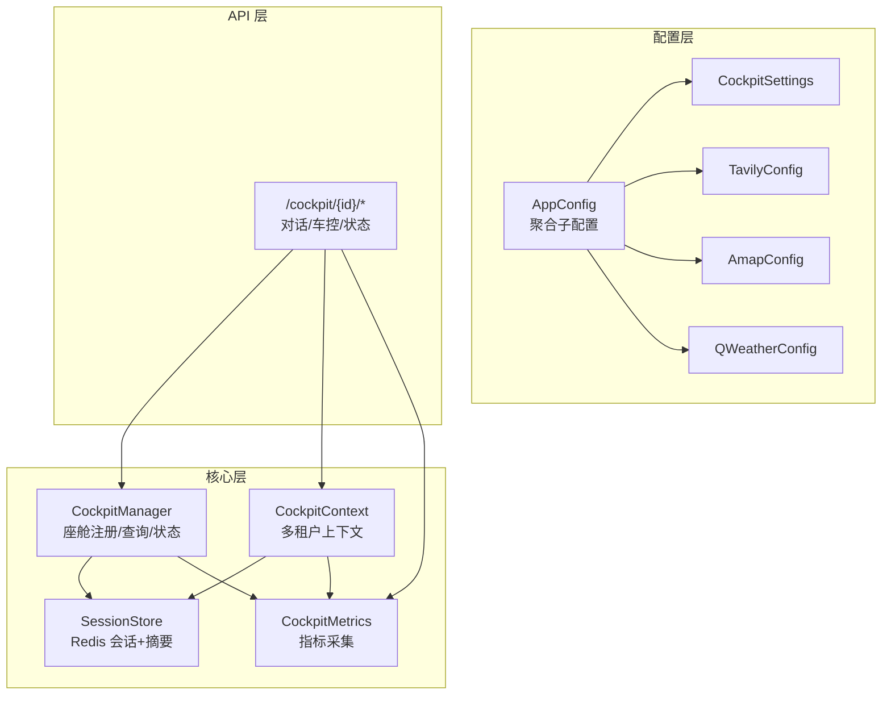
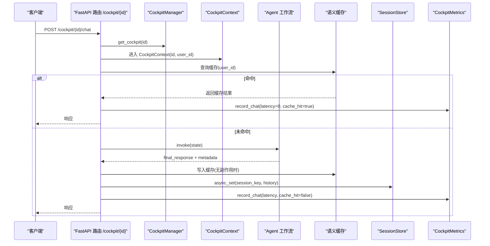
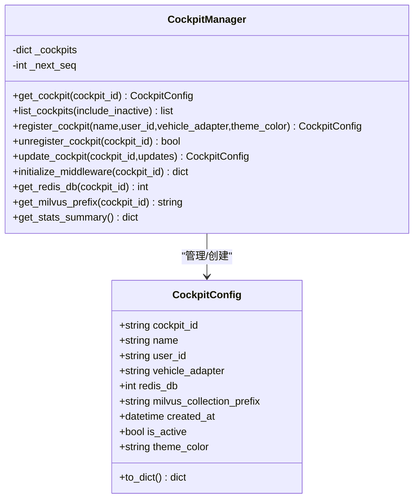
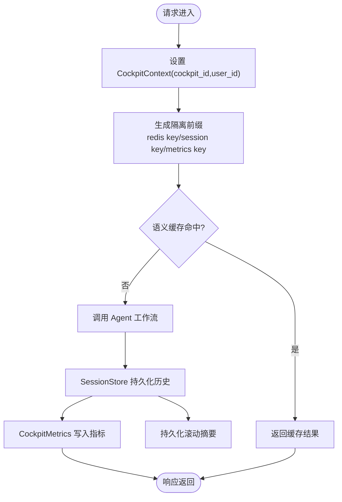
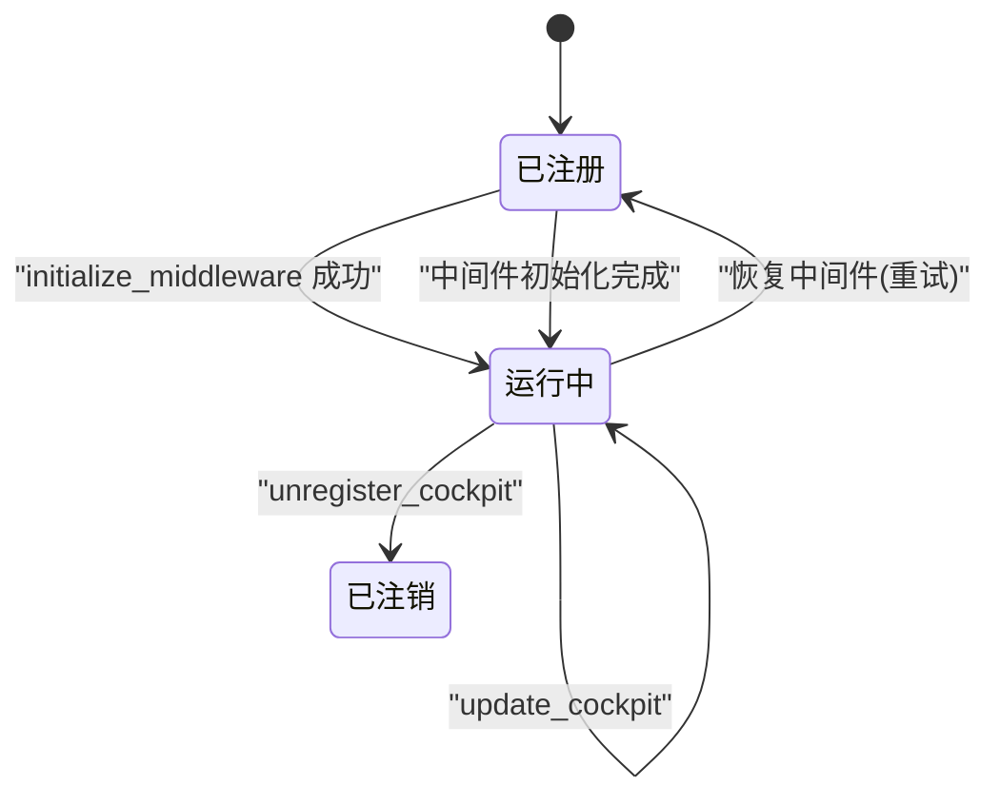
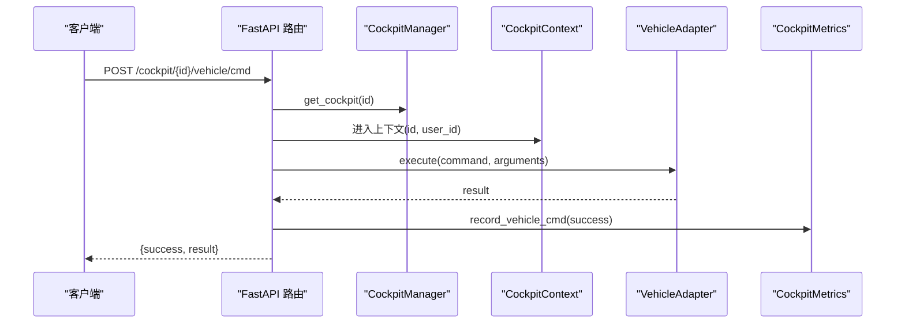
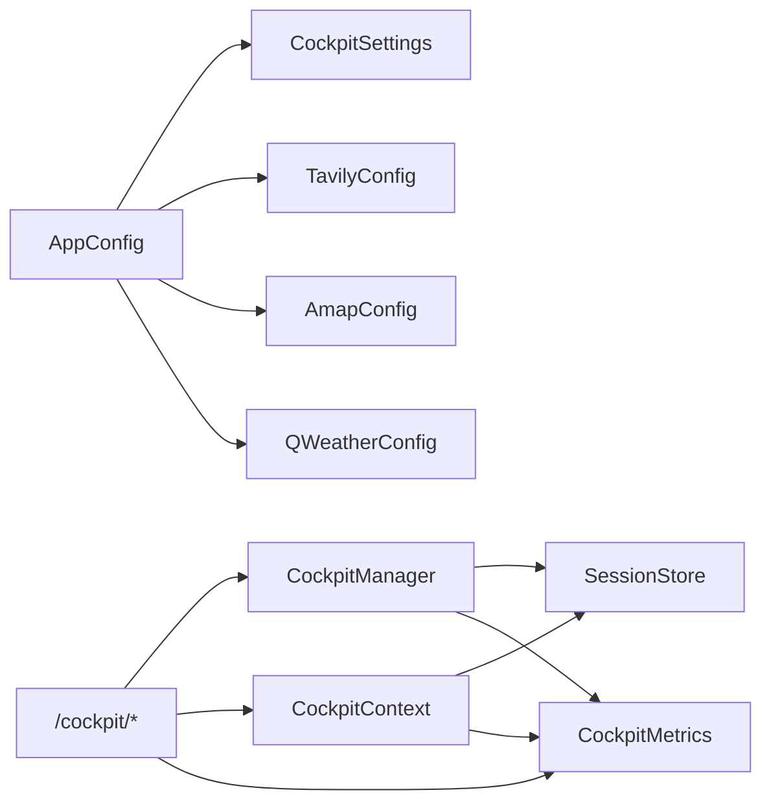

# 座舱配置

<cite>
**本文引用的文件**
- [cockpit.py](file://backend_design/nexus/config/cockpit.py)
- [__init__.py](file://backend_design/nexus/config/__init__.py)
- [cockpit_manager.py](file://backend_design/nexus/core/cockpit_manager.py)
- [cockpit.py](file://backend_design/nexus/models/cockpit.py)
- [cockpit.py](file://backend_design/nexus/api/routes/cockpit.py)
- [session_store.py](file://backend_design/nexus/middleware/session_store.py)
- [tenant_context.py](file://backend_design/nexus/core/tenant_context.py)
- [cockpit_metrics.py](file://backend_design/nexus/observability/cockpit_metrics.py)
</cite>

## 目录
1. [简介](#简介)
2. [项目结构](#项目结构)
3. [核心组件](#核心组件)
4. [架构总览](#架构总览)
5. [详细组件分析](#详细组件分析)
6. [依赖关系分析](#依赖关系分析)
7. [性能考虑](#性能考虑)
8. [故障排查指南](#故障排查指南)
9. [结论](#结论)
10. [附录](#附录)

## 简介
本文件面向 NexusCockpit 的“座舱配置”主题，系统性说明多座舱管理、第三方服务配置（Tavily 搜索、高德地图、和风天气）、会话与数据隔离、资源共享与同步策略、模板化部署与批量管理、生命周期管理与监控恢复、以及性能优化与容量规划。文档以代码为依据，提供可追溯的文件来源与图示，帮助读者快速理解并落地实施。

## 项目结构
围绕座舱配置的核心代码分布在以下模块：
- 配置中心：统一聚合各子系统配置，暴露 CockpitSettings、TavilyConfig、AmapConfig、QWeatherConfig 等
- 座舱管理器：维护座舱注册、查询、状态与中间件资源初始化
- API 路由：按 cockpit_id 路由对话、车控、状态接口，设置多租户上下文
- 会话存储：基于 Redis 的会话历史与滚动摘要持久化，支持降级
- 多租户上下文：协程安全的 cockpit_id/user_id 传递，实现自动隔离
- 指标采集：记录各座舱对话、车控、错误与延迟等指标

**图表来源**
- [__init__.py:84-131](file://backend_design/nexus/config/__init__.py#L84-L131)
- [cockpit.py:15-83](file://backend_design/nexus/config/cockpit.py#L15-L83)
- [cockpit_manager.py:75-110](file://backend_design/nexus/core/cockpit_manager.py#L75-L110)
- [tenant_context.py:71-103](file://backend_design/nexus/core/tenant_context.py#L71-L103)
- [session_store.py:43-80](file://backend_design/nexus/middleware/session_store.py#L43-L80)
- [cockpit_metrics.py:24-36](file://backend_design/nexus/observability/cockpit_metrics.py#L24-L36)
- [cockpit.py:29-74](file://backend_design/nexus/api/routes/cockpit.py#L29-L74)

**章节来源**
- [__init__.py:84-131](file://backend_design/nexus/config/__init__.py#L84-L131)
- [cockpit.py:15-83](file://backend_design/nexus/config/cockpit.py#L15-L83)
- [cockpit_manager.py:75-110](file://backend_design/nexus/core/cockpit_manager.py#L75-L110)
- [tenant_context.py:71-103](file://backend_design/nexus/core/tenant_context.py#L71-L103)
- [session_store.py:43-80](file://backend_design/nexus/middleware/session_store.py#L43-L80)
- [cockpit_metrics.py:24-36](file://backend_design/nexus/observability/cockpit_metrics.py#L24-L36)
- [cockpit.py:29-74](file://backend_design/nexus/api/routes/cockpit.py#L29-L74)

## 核心组件
- CockpitSettings：多座舱基础配置（默认数量、网关地址/端口/模式、RBAC 默认角色与管理员用户名、声纹模型/阈值/注册次数）
- TavilyConfig：搜索引擎 API Key
- AmapConfig：高德地图 API Key
- QWeatherConfig：和风天气 API Key/Key/ProjectID/CredentialID/API Host，并提供 effective_key 属性
- CockpitManager：座舱注册、查询、注销、更新、中间件初始化（Redis/Milvus/MySQL）、统计摘要
- CockpitContext：协程安全的多租户上下文（cockpit_id/user_id），为缓存/限流/会话等提供隔离前缀
- SessionStore：Redis 会话历史与滚动摘要持久化，带内存降级
- CockpitMetrics：对话/车控/错误/延迟等指标写入 Redis，供巡检与中台使用

**章节来源**
- [cockpit.py:15-83](file://backend_design/nexus/config/cockpit.py#L15-L83)
- [cockpit_manager.py:75-110](file://backend_design/nexus/core/cockpit_manager.py#L75-L110)
- [tenant_context.py:71-103](file://backend_design/nexus/core/tenant_context.py#L71-L103)
- [session_store.py:43-80](file://backend_design/nexus/middleware/session_store.py#L43-L80)
- [cockpit_metrics.py:24-36](file://backend_design/nexus/observability/cockpit_metrics.py#L24-L36)

## 架构总览
下图展示从请求到座舱隔离、会话与指标采集的整体流程。

**图表来源**
- [cockpit.py:76-149](file://backend_design/nexus/api/routes/cockpit.py#L76-L149)
- [cockpit_manager.py:112-134](file://backend_design/nexus/core/cockpit_manager.py#L112-L134)
- [tenant_context.py:71-103](file://backend_design/nexus/core/tenant_context.py#L71-L103)
- [session_store.py:152-177](file://backend_design/nexus/middleware/session_store.py#L152-L177)
- [cockpit_metrics.py:38-64](file://backend_design/nexus/observability/cockpit_metrics.py#L38-L64)

## 详细组件分析

### CockpitSettings 多座舱管理
- 座舱标识：通过 CockpitManager.register_cockpit 生成唯一 cockpit_id（cockpit-XX），避免删除后冲突；list/get/unregister/update 提供完整生命周期
- 用户绑定：每个座舱绑定 user_id，用于会话与权限隔离；注册时可在 MySQL 创建用户记录
- 会话管理：会话 key 由 session_id 或 user_id 构成，配合 CockpitContext 实现请求级隔离；SessionStore 负责持久化与 TTL 续期
- 中间件隔离：注册后异步初始化 Redis DB、Milvus collection 前缀、MySQL 用户与审计日志；当前采用共享 Milvus 并通过 cockpit_id 过滤
- 统计摘要：get_stats_summary 汇总总数、活跃数、各座舱信息

**图表来源**
- [cockpit_manager.py:33-73](file://backend_design/nexus/core/cockpit_manager.py#L33-L73)
- [cockpit_manager.py:75-110](file://backend_design/nexus/core/cockpit_manager.py#L75-L110)
- [cockpit_manager.py:136-191](file://backend_design/nexus/core/cockpit_manager.py#L136-L191)
- [cockpit_manager.py:193-297](file://backend_design/nexus/core/cockpit_manager.py#L193-L297)
- [cockpit_manager.py:299-341](file://backend_design/nexus/core/cockpit_manager.py#L299-L341)
- [cockpit_manager.py:343-380](file://backend_design/nexus/core/cockpit_manager.py#L343-L380)

**章节来源**
- [cockpit_manager.py:75-110](file://backend_design/nexus/core/cockpit_manager.py#L75-L110)
- [cockpit_manager.py:136-191](file://backend_design/nexus/core/cockpit_manager.py#L136-L191)
- [cockpit_manager.py:193-297](file://backend_design/nexus/core/cockpit_manager.py#L193-L297)
- [cockpit_manager.py:299-341](file://backend_design/nexus/core/cockpit_manager.py#L299-L341)
- [cockpit_manager.py:343-380](file://backend_design/nexus/core/cockpit_manager.py#L343-L380)

### TavilyConfig 搜索引擎配置
- api_key：Tavily 专用搜索引擎的 API Key，用于联网搜索技能（如查天气、新闻）
- 环境变量：TAVILY_API_KEY
- 使用建议：在 .env 中配置；若为空则相关搜索能力不可用

**章节来源**
- [cockpit.py:38-47](file://backend_design/nexus/config/cockpit.py#L38-L47)

### AmapConfig 地图服务配置
- api_key：高德地图 API Key，用于逆地理编码与 POI 周边搜索
- 环境变量：AMAP_KEY
- 使用建议：申请密钥后填入 .env；未配置将导致地图相关功能不可用

**章节来源**
- [cockpit.py:49-58](file://backend_design/nexus/config/cockpit.py#L49-L58)

### QWeatherConfig 天气服务配置
- api_key/key：认证方式优先使用 api_key，回退到 key（effective_key 属性）
- project_id/credential_id：项目与凭据标识
- api_host：个性化域名（默认 devapi.qweather.com）
- 环境变量：QWEATHER_APIKEY、QWEATHER_KEY、QWEATHER_PROJECT_ID、QWEATHER_CREDENTIAL_ID、QWEATHER_API_HOST
- 使用建议：优先设置 QWEATHER_APIKEY；如需兼容旧配置可同时设置 QWEATHER_KEY

**章节来源**
- [cockpit.py:61-83](file://backend_design/nexus/config/cockpit.py#L61-L83)

### 座舱间数据隔离、资源共享与同步策略
- 隔离机制
  - 请求级隔离：CockpitContext 设置 cockpit_id/user_id，所有中间件据此生成隔离前缀
  - 会话隔离：SessionStore 以 session_key 为键，独立存储历史与滚动摘要
  - 指标隔离：CockpitMetrics 以 cockpit_id:stats 为键记录指标
- 资源共享
  - Milvus 当前采用共享 collection，通过 cockpit_id 过滤实现逻辑隔离
  - Redis 通过不同 DB 编号与会话 key 前缀隔离
- 同步策略
  - 会话历史：每次保存截断至最近 N 条（MemoryConfig.max_history_len），并自动续期 TTL
  - 滚动摘要：压缩后持久化，与会话同 TTL，确保上下文不丢失
  - 指标写入：Redis 管道批量写入，降低网络开销

**图表来源**
- [tenant_context.py:62-68](file://backend_design/nexus/core/tenant_context.py#L62-L68)
- [session_store.py:152-177](file://backend_design/nexus/middleware/session_store.py#L152-L177)
- [cockpit_metrics.py:38-64](file://backend_design/nexus/observability/cockpit_metrics.py#L38-L64)
- [cockpit.py:96-149](file://backend_design/nexus/api/routes/cockpit.py#L96-L149)

**章节来源**
- [tenant_context.py:62-68](file://backend_design/nexus/core/tenant_context.py#L62-L68)
- [session_store.py:152-177](file://backend_design/nexus/middleware/session_store.py#L152-L177)
- [cockpit_metrics.py:38-64](file://backend_design/nexus/observability/cockpit_metrics.py#L38-L64)
- [cockpit.py:96-149](file://backend_design/nexus/api/routes/cockpit.py#L96-L149)

### 座舱模板配置、快速部署与批量管理
- 模板化
  - 默认座舱：启动时初始化三个默认座舱（名称、主题色、user_id、redis_db、milvus 前缀）
  - 字段模板：name、user_id、vehicle_adapter、theme_color 可作为模板字段
- 快速部署
  - 通过 register_cockpit 动态创建新座舱，自动分配 ID 与中间件资源
  - initialize_middleware 异步初始化 Redis/Milvus/MySQL，失败不阻塞注册
- 批量管理
  - list_cockpits 支持 include_inactive 参数获取全部或仅活跃座舱
  - update_cockpit 允许批量更新 name/user_id/vehicle_adapter/theme_color/is_active
  - unregister_cockpit 软删除（标记 is_active=False），序号不回退

**章节来源**
- [cockpit_manager.py:92-110](file://backend_design/nexus/core/cockpit_manager.py#L92-L110)
- [cockpit_manager.py:136-191](file://backend_design/nexus/core/cockpit_manager.py#L136-L191)
- [cockpit_manager.py:193-297](file://backend_design/nexus/core/cockpit_manager.py#L193-L297)
- [cockpit_manager.py:299-341](file://backend_design/nexus/core/cockpit_manager.py#L299-L341)

### 座舱生命周期管理、状态监控与故障恢复
- 生命周期
  - 注册：register_cockpit → initialize_middleware（Redis/Milvus/MySQL）
  - 运行：API 路由处理对话/车控/状态，记录指标与会话
  - 更新：update_cockpit 限制合法字段更新
  - 注销：unregister_cockpit 软删除
- 状态监控
  - CockpitStatusResponse 包含 cockpit_id/name/is_active/metrics
  - CockpitMetrics 提供 chat_count/vehicle_cmd_count/cache_hit_rate/avg_latency_ms/error_rate 等
- 故障恢复
  - SessionStore 在 Redis 不可用时降级为内存存储，保证可用性
  - initialize_middleware 各阶段异常捕获并记录，不影响整体注册流程

**图表来源**
- [cockpit_manager.py:136-191](file://backend_design/nexus/core/cockpit_manager.py#L136-L191)
- [cockpit_manager.py:193-297](file://backend_design/nexus/core/cockpit_manager.py#L193-L297)
- [cockpit_manager.py:299-341](file://backend_design/nexus/core/cockpit_manager.py#L299-L341)
- [session_store.py:69-80](file://backend_design/nexus/middleware/session_store.py#L69-L80)

**章节来源**
- [cockpit_manager.py:136-191](file://backend_design/nexus/core/cockpit_manager.py#L136-L191)
- [cockpit_manager.py:193-297](file://backend_design/nexus/core/cockpit_manager.py#L193-L297)
- [cockpit_manager.py:299-341](file://backend_design/nexus/core/cockpit_manager.py#L299-L341)
- [session_store.py:69-80](file://backend_design/nexus/middleware/session_store.py#L69-L80)

### API 路由与多租户上下文
- 路由前缀：/cockpit/{cockpit_id}/*
- 主要接口
  - GET /status：返回座舱状态与实时指标
  - POST /chat：非流式对话，含缓存检查与指标记录
  - POST /chat/stream：SSE 流式对话，确保上下文正确清理
  - POST /vehicle/cmd：执行车控指令，记录成功/失败
  - GET /vehicle/status：获取车辆状态
- 多租户上下文：CockpitContext 在进入作用域时设置 cockpit_id/user_id，退出时恢复

**图表来源**
- [cockpit.py:204-236](file://backend_design/nexus/api/routes/cockpit.py#L204-L236)
- [cockpit_manager.py:112-134](file://backend_design/nexus/core/cockpit_manager.py#L112-L134)
- [tenant_context.py:71-103](file://backend_design/nexus/core/tenant_context.py#L71-L103)
- [cockpit_metrics.py:65-84](file://backend_design/nexus/observability/cockpit_metrics.py#L65-L84)

**章节来源**
- [cockpit.py:54-74](file://backend_design/nexus/api/routes/cockpit.py#L54-L74)
- [cockpit.py:76-149](file://backend_design/nexus/api/routes/cockpit.py#L76-L149)
- [cockpit.py:152-201](file://backend_design/nexus/api/routes/cockpit.py#L152-L201)
- [cockpit.py:204-236](file://backend_design/nexus/api/routes/cockpit.py#L204-L236)
- [cockpit.py:239-266](file://backend_design/nexus/api/routes/cockpit.py#L239-L266)
- [tenant_context.py:71-103](file://backend_design/nexus/core/tenant_context.py#L71-L103)

## 依赖关系分析
- 配置聚合：AppConfig 聚合 LLM/数据库/缓存/车控/ASR/可观测性/服务器/JWT/第三方服务/数据/记忆/多座舱等子配置
- 运行时依赖：API 路由依赖 CockpitManager、CockpitContext、CockpitMetrics、SessionStore
- 中间件依赖：SessionStore 依赖 RedisConfig；CockpitMetrics 依赖 Redis；CockpitManager.initialize_middleware 依赖 Redis/Milvus/MySQL

**图表来源**
- [__init__.py:84-131](file://backend_design/nexus/config/__init__.py#L84-L131)
- [cockpit.py:15-83](file://backend_design/nexus/config/cockpit.py#L15-L83)
- [cockpit_manager.py:75-110](file://backend_design/nexus/core/cockpit_manager.py#L75-L110)
- [tenant_context.py:71-103](file://backend_design/nexus/core/tenant_context.py#L71-L103)
- [session_store.py:43-80](file://backend_design/nexus/middleware/session_store.py#L43-L80)
- [cockpit_metrics.py:24-36](file://backend_design/nexus/observability/cockpit_metrics.py#L24-L36)
- [cockpit.py:29-74](file://backend_design/nexus/api/routes/cockpit.py#L29-L74)

**章节来源**
- [__init__.py:84-131](file://backend_design/nexus/config/__init__.py#L84-L131)
- [cockpit.py:15-83](file://backend_design/nexus/config/cockpit.py#L15-L83)
- [cockpit_manager.py:75-110](file://backend_design/nexus/core/cockpit_manager.py#L75-L110)
- [tenant_context.py:71-103](file://backend_design/nexus/core/tenant_context.py#L71-L103)
- [session_store.py:43-80](file://backend_design/nexus/middleware/session_store.py#L43-L80)
- [cockpit_metrics.py:24-36](file://backend_design/nexus/observability/cockpit_metrics.py#L24-L36)
- [cockpit.py:29-74](file://backend_design/nexus/api/routes/cockpit.py#L29-L74)

## 性能考虑
- 指标计算优化
  - 平均延迟基于 total_latency_ms/latency_count 计算，避免单次值偏差
  - 缓存命中率与错误率基于累计计数，减少抖动
- 写入优化
  - Redis 管道批量写入 stats，降低网络往返
  - 会话历史截断至 max_history_len，控制内存占用
- 降级与容错
  - SessionStore 在 Redis 不可用时自动降级为内存，保障可用性
  - initialize_middleware 各阶段异常捕获，不阻塞主流程
- 并发与隔离
  - CockpitContext 协程安全，避免跨请求污染
  - 每座舱独立 Redis DB 与会话 key 前缀，避免竞争

[本节为通用指导，无需特定文件来源]

## 故障排查指南
- 常见问题定位
  - 座舱不存在或未激活：GET /status 返回 404；检查 CockpitManager.get_cockpit 与 is_active
  - 中间件初始化失败：查看 initialize_middleware 返回的 results 字典中的 redis/milvus/mysql 状态
  - 会话丢失：确认 SessionStore.is_redis_mode 与 TTL 配置；检查 Redis 连接与 keys 前缀
  - 指标缺失：检查 CockpitMetrics 是否写入 Redis；确认 stats_key 格式
- 诊断步骤
  - 查看日志：logger.warning/error 输出关键路径异常
  - 检查 Redis：keys nexus:* 与 {cockpit_id}:* 是否存在
  - 验证配置：AppConfig 子配置是否正确加载（.env 变量）

**章节来源**
- [cockpit_manager.py:193-297](file://backend_design/nexus/core/cockpit_manager.py#L193-L297)
- [session_store.py:69-80](file://backend_design/nexus/middleware/session_store.py#L69-L80)
- [cockpit_metrics.py:102-161](file://backend_design/nexus/observability/cockpit_metrics.py#L102-L161)
- [cockpit.py:54-74](file://backend_design/nexus/api/routes/cockpit.py#L54-L74)

## 结论
NexusCockpit 的座舱配置体系以 CockpitSettings 为核心，结合 CockpitManager、CockpitContext、SessionStore 与 CockpitMetrics，实现了多座舱的标识、用户绑定、会话隔离、资源共享与指标采集。Tavily/Amap/QWeather 配置为外部能力提供统一入口。通过模板化注册、异步初始化与降级策略，系统具备高可用与可扩展性。建议在生产环境完善 .env 配置、监控指标与告警规则，并结合容量规划进行资源分配。

[本节为总结性内容，无需特定文件来源]

## 附录
- 环境变量参考
  - COCKPIT_COUNT/NEXUS_GATE_HOST/NEXUS_GATE_PORT/NEXUS_GATE_MODE/RBAC_DEFAULT_ROLE/RBAC_ADMIN_USERNAME/VOICEPRINT_MODEL/VOICEPRINT_THRESHOLD/VOICEPRINT_ENROLL_COUNT
  - TAVILY_API_KEY
  - AMAP_KEY
  - QWEATHER_APIKEY/QWEATHER_KEY/QWEATHER_PROJECT_ID/QWEATHER_CREDENTIAL_ID/QWEATHER_API_HOST
  - SESSION_TTL_SECONDS（会话过期秒数）
- 常用操作
  - 注册座舱：POST /cockpit/{id}/...（内部调用 register_cockpit）
  - 更新座舱：PUT/PATCH 更新 name/user_id/vehicle_adapter/theme_color/is_active
  - 注销座舱：软删除 is_active=False
  - 查询状态：GET /cockpit/{id}/status
  - 对话：POST /cockpit/{id}/chat 或 /chat/stream
  - 车控：POST /cockpit/{id}/vehicle/cmd；GET /cockpit/{id}/vehicle/status

**章节来源**
- [cockpit.py:15-83](file://backend_design/nexus/config/cockpit.py#L15-L83)
- [cockpit_manager.py:136-191](file://backend_design/nexus/core/cockpit_manager.py#L136-L191)
- [cockpit.py:54-74](file://backend_design/nexus/api/routes/cockpit.py#L54-L74)
- [cockpit.py:76-149](file://backend_design/nexus/api/routes/cockpit.py#L76-L149)
- [cockpit.py:204-236](file://backend_design/nexus/api/routes/cockpit.py#L204-L236)
- [session_store.py:38-41](file://backend_design/nexus/middleware/session_store.py#L38-L41)