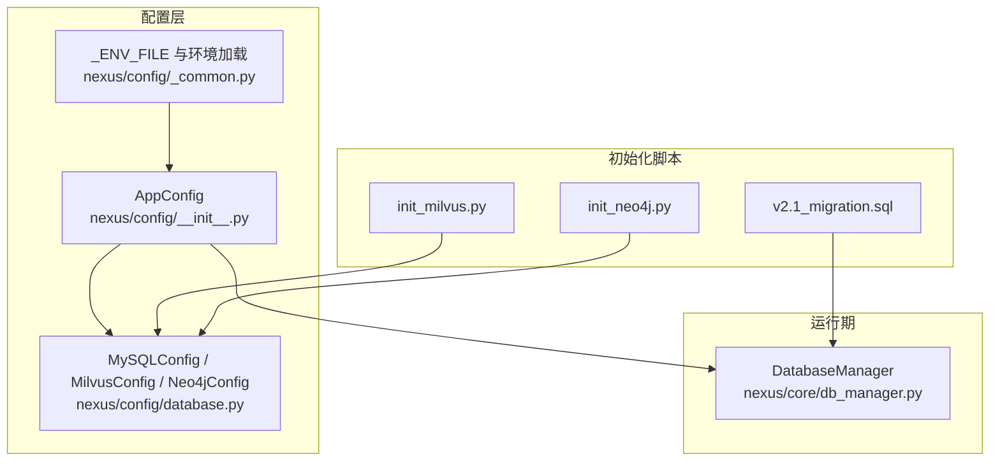
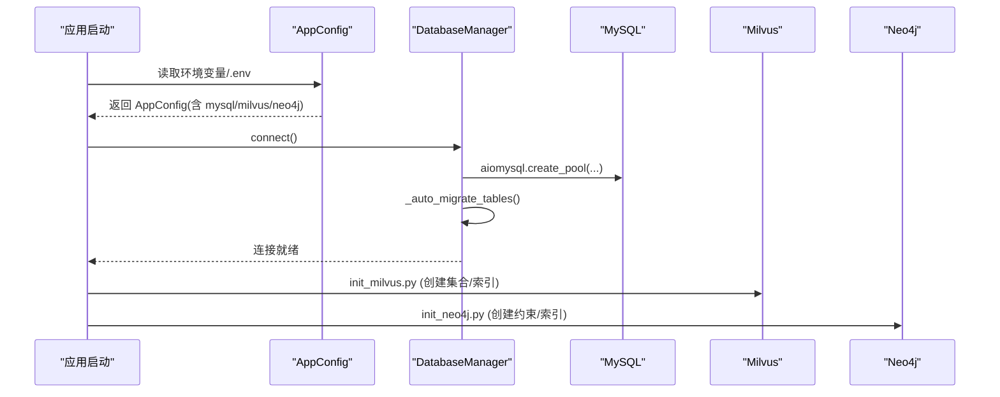
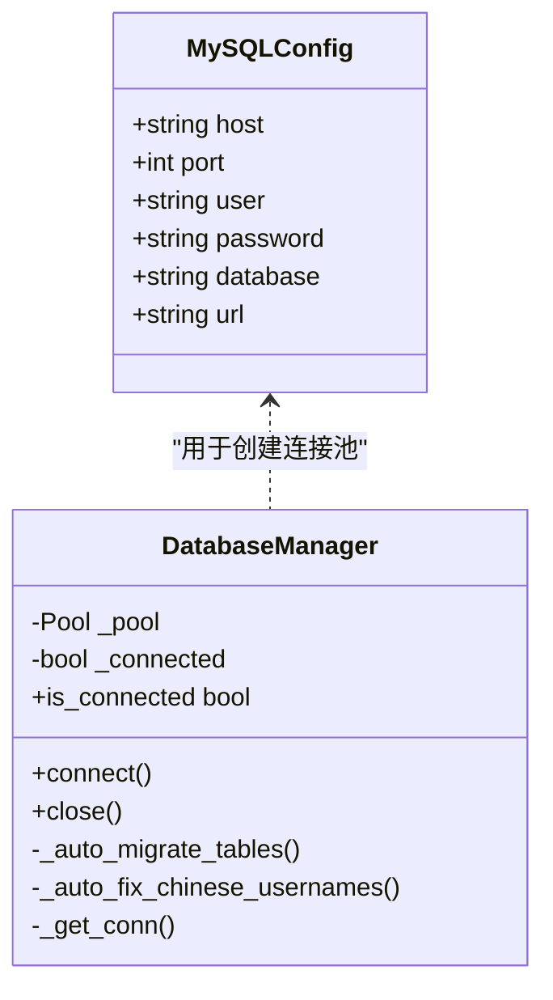
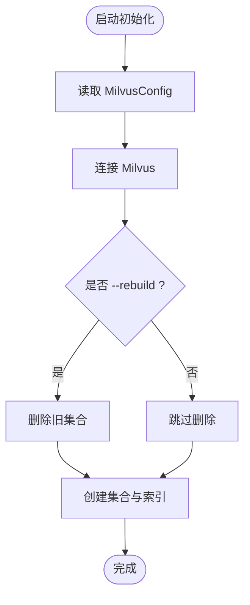
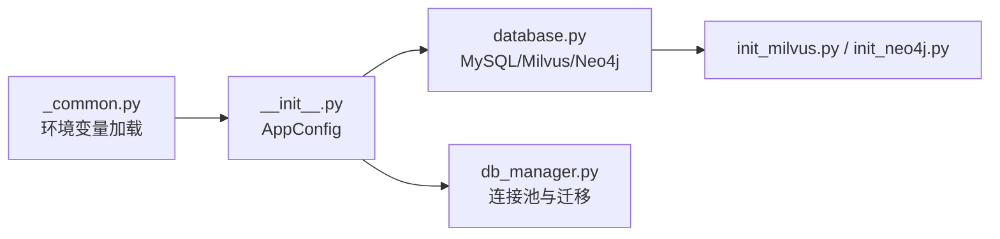
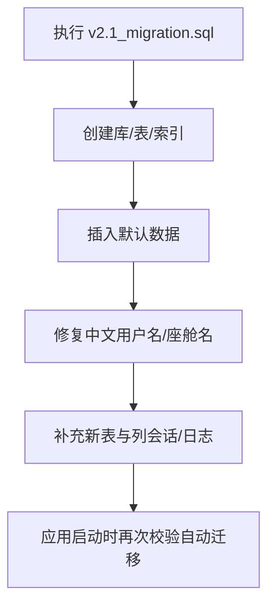

# 数据库配置

<cite>
**本文引用的文件**
- [backend_design/nexus/config/database.py](file://backend_design/nexus/config/database.py)
- [backend_design/nexus/config/__init__.py](file://backend_design/nexus/config/__init__.py)
- [backend_design/nexus/config/_common.py](file://backend_design/nexus/config/_common.py)
- [backend_design/nexus/core/db_manager.py](file://backend_design/nexus/core/db_manager.py)
- [backend_design/scripts/init_milvus.py](file://backend_design/scripts/init_milvus.py)
- [backend_design/scripts/init_neo4j.py](file://backend_design/scripts/init_neo4j.py)
- [backend_design/scripts/v2.1_migration.sql](file://backend_design/scripts/v2.1_migration.sql)
- [backend_design/nexus/core/circuit_breaker.py](file://backend_design/nexus/core/circuit_breaker.py)
</cite>

## 目录
1. [简介](#简介)
2. [项目结构](#项目结构)
3. [核心组件](#核心组件)
4. [架构总览](#架构总览)
5. [详细组件分析](#详细组件分析)
6. [依赖关系分析](#依赖关系分析)
7. [性能与连接池管理](#性能与连接池管理)
8. [故障恢复与熔断降级](#故障恢复与熔断降级)
9. [数据库初始化与版本迁移](#数据库初始化与版本迁移)
10. [多环境配置示例与最佳实践](#多环境配置示例与最佳实践)
11. [健康检查、自动重连与监控指标](#健康检查自动重连与监控指标)
12. [故障排查指南](#故障排查指南)
13. [结论](#结论)

## 简介
本文件为 NexusCockpit 的数据库配置与运维文档，覆盖 MySQL、Milvus（向量库）、Neo4j（图数据库）三类数据源的配置项、连接池、超时与重试策略、初始化脚本执行、版本迁移管理，以及健康检查、自动重连和监控指标采集。目标是帮助开发者与运维人员快速、安全地完成部署与调优。

## 项目结构
NexusCockpit 将配置按子系统拆分，并通过统一入口聚合：
- 配置定义：database.py（MySQL/Milvus/Neo4j）、_common.py（环境变量加载策略）、__init__.py（全局 AppConfig 单例）
- 运行时访问：core/db_manager.py（MySQL 连接池与表迁移）
- 初始化脚本：scripts/init_milvus.py、scripts/init_neo4j.py、scripts/v2.1_migration.sql

图表来源
- [backend_design/nexus/config/__init__.py:84-132](file://backend_design/nexus/config/__init__.py#L84-L132)
- [backend_design/nexus/config/database.py:15-51](file://backend_design/nexus/config/database.py#L15-L51)
- [backend_design/nexus/config/_common.py:39-53](file://backend_design/nexus/config/_common.py#L39-L53)
- [backend_design/nexus/core/db_manager.py:56-85](file://backend_design/nexus/core/db_manager.py#L56-L85)
- [backend_design/scripts/init_milvus.py:21-47](file://backend_design/scripts/init_milvus.py#L21-L47)
- [backend_design/scripts/init_neo4j.py:18-34](file://backend_design/scripts/init_neo4j.py#L18-L34)
- [backend_design/scripts/v2.1_migration.sql:1-12](file://backend_design/scripts/v2.1_migration.sql#L1-L12)

章节来源
- [backend_design/nexus/config/__init__.py:84-132](file://backend_design/nexus/config/__init__.py#L84-L132)
- [backend_design/nexus/config/database.py:15-51](file://backend_design/nexus/config/database.py#L15-L51)
- [backend_design/nexus/config/_common.py:39-53](file://backend_design/nexus/config/_common.py#L39-L53)

## 核心组件
- MySQLConfig：定义 MySQL 连接参数与异步 URL 生成
- MilvusConfig：定义向量库连接与索引/检索参数
- Neo4jConfig：定义图数据库连接参数
- DatabaseManager：MySQL 连接池管理与自动迁移
- 初始化脚本：Milvus/Neo4j 集合与约束创建；MySQL v2.1 迁移

章节来源
- [backend_design/nexus/config/database.py:15-51](file://backend_design/nexus/config/database.py#L15-L51)
- [backend_design/nexus/core/db_manager.py:56-85](file://backend_design/nexus/core/db_manager.py#L56-L85)
- [backend_design/scripts/init_milvus.py:21-47](file://backend_design/scripts/init_milvus.py#L21-L47)
- [backend_design/scripts/init_neo4j.py:18-34](file://backend_design/scripts/init_neo4j.py#L18-L34)
- [backend_design/scripts/v2.1_migration.sql:1-12](file://backend_design/scripts/v2.1_migration.sql#L1-L12)

## 架构总览
下图展示配置到运行期的关键路径：应用通过 AppConfig 读取各子配置，DatabaseManager 使用 MySQLConfig 建立连接池并执行自动迁移；Milvus/Neo4j 通过各自初始化脚本完成集合/索引准备。

图表来源
- [backend_design/nexus/config/__init__.py:144-151](file://backend_design/nexus/config/__init__.py#L144-L151)
- [backend_design/nexus/core/db_manager.py:56-85](file://backend_design/nexus/core/db_manager.py#L56-L85)
- [backend_design/scripts/init_milvus.py:21-47](file://backend_design/scripts/init_milvus.py#L21-L47)
- [backend_design/scripts/init_neo4j.py:18-34](file://backend_design/scripts/init_neo4j.py#L18-L34)

## 详细组件分析

### MySQL 配置与连接池
- 连接参数
  - host、port、user、password、database：用于构建连接串
  - url：异步驱动 aiomysql 的连接 URL（utf8mb4）
- 连接池
  - 使用 aiomysql.create_pool，minsize=2，maxsize=10，autocommit=True
  - 提供 is_connected、close、_get_conn 等生命周期方法
- 自动迁移
  - 启动时确保所有表存在，必要时添加缺失列与索引
  - 插入默认座舱与用户数据（幂等）
  - 修复历史中文用户名/座舱名，避免编码问题

图表来源
- [backend_design/nexus/config/database.py:42-61](file://backend_design/nexus/config/database.py#L42-L61)
- [backend_design/nexus/core/db_manager.py:56-85](file://backend_design/nexus/core/db_manager.py#L56-L85)
- [backend_design/nexus/core/db_manager.py:86-104](file://backend_design/nexus/core/db_manager.py#L86-L104)

章节来源
- [backend_design/nexus/config/database.py:42-61](file://backend_design/nexus/config/database.py#L42-L61)
- [backend_design/nexus/core/db_manager.py:56-85](file://backend_design/nexus/core/db_manager.py#L56-L85)
- [backend_design/nexus/core/db_manager.py:86-104](file://backend_design/nexus/core/db_manager.py#L86-L104)

### Milvus 向量库配置
- 连接与集合
  - host、port、uri：服务地址
  - collection_food、collection_memory：集合名
  - alias：别名
- 索引与检索
  - index_type：HNSW
  - metric_type：IP（内积）
  - index_params：M、efConstruction
  - search_params：ef
- 初始化
  - scripts/init_milvus.py 负责连接、创建集合与索引，支持 --rebuild 重建

图表来源
- [backend_design/nexus/config/database.py:15-30](file://backend_design/nexus/config/database.py#L15-L30)
- [backend_design/scripts/init_milvus.py:21-47](file://backend_design/scripts/init_milvus.py#L21-L47)

章节来源
- [backend_design/nexus/config/database.py:15-30](file://backend_design/nexus/config/database.py#L15-L30)
- [backend_design/scripts/init_milvus.py:21-47](file://backend_design/scripts/init_milvus.py#L21-L47)

### Neo4j 图数据库配置
- 连接参数
  - uri、user、password
- 初始化
  - scripts/init_neo4j.py 负责连接后创建约束与索引（如 user_id_unique、entity_name_index）

章节来源
- [backend_design/nexus/config/database.py:32-39](file://backend_design/nexus/config/database.py#L32-L39)
- [backend_design/scripts/init_neo4j.py:18-34](file://backend_design/scripts/init_neo4j.py#L18-L34)

### 配置中心与全局单例
- AppConfig 聚合所有子系统配置（mysql/milvus/neo4j/redis/llm 等）
- get_config() 返回线程安全的单例实例
- 环境变量加载优先级：.env.local > .env

章节来源
- [backend_design/nexus/config/__init__.py:84-132](file://backend_design/nexus/config/__init__.py#L84-L132)
- [backend_design/nexus/config/__init__.py:144-151](file://backend_design/nexus/config/__init__.py#L144-L151)
- [backend_design/nexus/config/_common.py:39-53](file://backend_design/nexus/config/_common.py#L39-L53)

## 依赖关系分析
- 配置层依赖 _common.py 的环境变量加载逻辑
- DatabaseManager 依赖 MySQLConfig 提供的连接参数
- 初始化脚本依赖对应 Provider 的配置（milvus/neo4j）

图表来源
- [backend_design/nexus/config/_common.py:39-53](file://backend_design/nexus/config/_common.py#L39-L53)
- [backend_design/nexus/config/__init__.py:84-132](file://backend_design/nexus/config/__init__.py#L84-L132)
- [backend_design/nexus/config/database.py:15-51](file://backend_design/nexus/config/database.py#L15-L51)
- [backend_design/nexus/core/db_manager.py:56-85](file://backend_design/nexus/core/db_manager.py#L56-L85)
- [backend_design/scripts/init_milvus.py:21-47](file://backend_design/scripts/init_milvus.py#L21-L47)
- [backend_design/scripts/init_neo4j.py:18-34](file://backend_design/scripts/init_neo4j.py#L18-L34)

章节来源
- [backend_design/nexus/config/_common.py:39-53](file://backend_design/nexus/config/_common.py#L39-L53)
- [backend_design/nexus/config/__init__.py:84-132](file://backend_design/nexus/config/__init__.py#L84-L132)

## 性能与连接池管理
- MySQL 连接池
  - minsize=2，maxsize=10，autocommit=True，减少频繁建连开销
  - 建议根据并发量调整 maxsize，观察连接等待与队列长度
- 字符集与时区
  - utf8mb4 保证多语言与表情存储
  - 写入时间使用东八区时区，避免容器 UTC 偏差
- 索引与查询
  - 迁移脚本中为常用字段添加复合索引，提升查询性能
- 资源释放
  - close() 会关闭连接池并等待关闭完成

章节来源
- [backend_design/nexus/core/db_manager.py:56-85](file://backend_design/nexus/core/db_manager.py#L56-L85)
- [backend_design/nexus/core/db_manager.py:397-405](file://backend_design/nexus/core/db_manager.py#L397-L405)
- [backend_design/scripts/v2.1_migration.sql:21-33](file://backend_design/scripts/v2.1_migration.sql#L21-L33)

## 故障恢复与熔断降级
- 熔断器
  - CLOSED → OPEN（连续失败达到阈值）→ HALF_OPEN（恢复期后试探）→ CLOSED（成功恢复）
  - 适用于 LLM API、Milvus、车控服务等外部依赖
- 建议
  - 对关键调用包裹熔断器，设置合理的 failure_threshold 与 recovery_period
  - 在 HALF_OPEN 限制试探请求数，避免雪崩

章节来源
- [backend_design/nexus/core/circuit_breaker.py:48-176](file://backend_design/nexus/core/circuit_breaker.py#L48-L176)

## 数据库初始化与版本迁移
- MySQL 迁移
  - v2.1_migration.sql：创建库/表、安全添加列与索引、插入默认数据、修复中文名称、新增会话表与 chat_logs.session_id
  - 运行方式：mysql -u root -p < v2.1_migration.sql
- 自动迁移
  - DatabaseManager._auto_migrate_tables() 在连接时确保表结构与默认数据存在
- Milvus 初始化
  - init_milvus.py：创建集合与索引，支持 --rebuild 重建
- Neo4j 初始化
  - init_neo4j.py：创建约束与索引

图表来源
- [backend_design/scripts/v2.1_migration.sql:1-12](file://backend_design/scripts/v2.1_migration.sql#L1-L12)
- [backend_design/scripts/v2.1_migration.sql:21-33](file://backend_design/scripts/v2.1_migration.sql#L21-L33)
- [backend_design/scripts/v2.1_migration.sql:249-267](file://backend_design/scripts/v2.1_migration.sql#L249-L267)
- [backend_design/scripts/v2.1_migration.sql:320-332](file://backend_design/scripts/v2.1_migration.sql#L320-L332)
- [backend_design/nexus/core/db_manager.py:86-104](file://backend_design/nexus/core/db_manager.py#L86-L104)

章节来源
- [backend_design/scripts/v2.1_migration.sql:1-12](file://backend_design/scripts/v2.1_migration.sql#L1-L12)
- [backend_design/nexus/core/db_manager.py:86-104](file://backend_design/nexus/core/db_manager.py#L86-L104)
- [backend_design/scripts/init_milvus.py:21-47](file://backend_design/scripts/init_milvus.py#L21-47)
- [backend_design/scripts/init_neo4j.py:18-34](file://backend_design/scripts/init_neo4j.py#L18-34)

## 多环境配置示例与最佳实践
- 环境变量命名
  - MySQL：MYSQL_HOST、MYSQL_PORT、MYSQL_USER、MYSQL_PASSWORD、MYSQL_DATABASE
  - Milvus：MILVUS_HOST、MILVUS_PORT、MILVUS_URI、MILVUS_COLLECTION_FOOD、MILVUS_COLLECTION_MEMORY
  - Neo4j：NEO4J_URI、NEO4J_USER、NEO4J_PASSWORD
- 环境文件优先级
  - .env.local（本地覆盖，不提交）优先于 .env（默认值）
- 建议
  - 生产环境使用独立账号与最小权限原则
  - 使用专用网络与端口映射，避免暴露敏感端口
  - 合理设置连接池大小与超时，结合监控告警

章节来源
- [backend_design/nexus/config/database.py:15-51](file://backend_design/nexus/config/database.py#L15-L51)
- [backend_design/nexus/config/_common.py:39-53](file://backend_design/nexus/config/_common.py#L39-L53)

## 健康检查、自动重连与监控指标
- 健康检查
  - 可通过 is_connected 判断 MySQL 连接状态
  - 对外暴露健康端点（由业务层实现），检测数据库连通性
- 自动重连
  - 当前未内置自动重连逻辑，建议在调用层捕获异常并重试，或结合熔断器进行恢复
- 监控指标
  - ObservabilityConfig 提供 Prometheus/Grafana 地址
  - 可采集连接池状态、错误率、延迟等指标（需接入观测平台）

章节来源
- [backend_design/nexus/core/db_manager.py:406-415](file://backend_design/nexus/core/db_manager.py#L406-L415)
- [backend_design/nexus/config/observability.py:35-47](file://backend_design/nexus/config/observability.py#L35-L47)

## 故障排查指南
- 连接失败
  - 检查 MYSQL_HOST/PORT/USER/PASSWORD/DATABASE 是否正确
  - 确认防火墙与安全组放行端口
- 迁移失败
  - 查看 v2.1_migration.sql 执行结果与错误日志
  - 确认字符集与排序规则一致（utf8mb4_unicode_ci）
- 中文乱码
  - 使用自动修复流程将中文用户名/座舱名替换为英文
- 向量库不可用
  - 检查 MILVUS_URI/集合名与维度一致性，必要时 --rebuild
- 图数据库不可用
  - 检查 NEO4J_URI/认证信息，确认约束与索引已创建

章节来源
- [backend_design/nexus/core/db_manager.py:86-104](file://backend_design/nexus/core/db_manager.py#L86-L104)
- [backend_design/nexus/core/db_manager.py:359-395](file://backend_design/nexus/core/db_manager.py#L359-L395)
- [backend_design/scripts/init_milvus.py:21-47](file://backend_design/scripts/init_milvus.py#L21-47)
- [backend_design/scripts/init_neo4j.py:18-34](file://backend_design/scripts/init_neo4j.py#L18-34)

## 结论
NexusCockpit 通过统一的配置中心与模块化设计，实现了 MySQL、Milvus、Neo4j 的多库协同。配合自动迁移、初始化脚本与熔断器，系统具备较强的健壮性与可维护性。建议在生产环境中严格遵循最小权限、合理容量规划与完善的监控告警策略，以确保稳定运行。