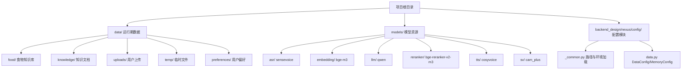
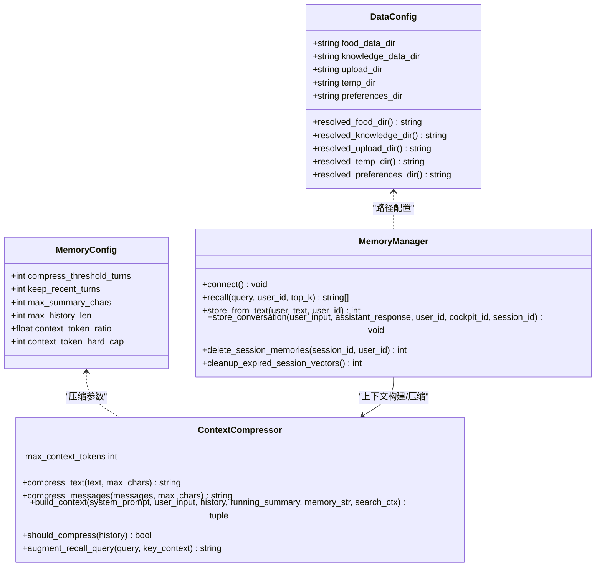
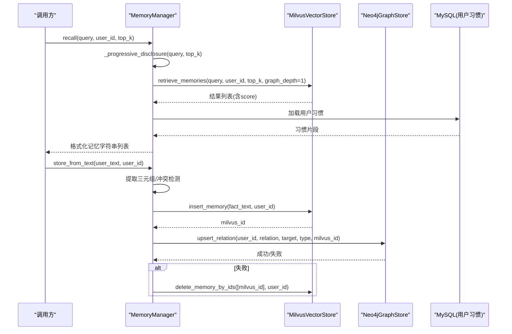
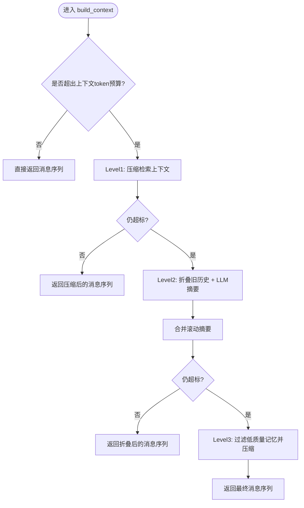
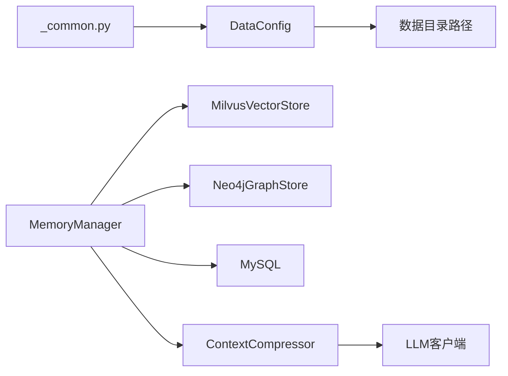

# 数据配置

<cite>
**本文引用的文件**   
- [data.py](file://backend_design/nexus/config/data.py)
- [_common.py](file://backend_design/nexus/config/_common.py)
- [README.md](file://data/README.md)
- [default_user.json](file://data/preferences/default_user.json)
- [manager.py](file://backend_design/nexus/memory/manager.py)
- [compressor.py](file://backend_design/nexus/memory/compressor.py)
- [v2.1_migration.sql](file://backend_design/scripts/v2.1_migration.sql)
</cite>

## 目录
1. [简介](#简介)
2. [项目结构](#项目结构)
3. [核心组件](#核心组件)
4. [架构总览](#架构总览)
5. [详细组件分析](#详细组件分析)
6. [依赖关系分析](#依赖关系分析)
7. [性能考虑](#性能考虑)
8. [故障排查指南](#故障排查指南)
9. [结论](#结论)
10. [附录](#附录)

## 简介
本文件面向 NexusCockpit 的数据配置与记忆管理，系统性说明 DataConfig 的数据目录管理（知识库路径、模型文件位置、临时目录等）与 MemoryConfig 的记忆存储配置（记忆类型、存储后端、压缩策略等）。同时覆盖数据文件的组织结构、命名规范、版本管理、导入导出与批量操作、增量更新、备份恢复与完整性校验、迁移脚本与格式转换工具、清理任务、权限控制与隐私合规，以及数据存储优化、索引策略与查询性能调优。

## 项目结构
NexusCockpit 将“运行期数据”与“模型资源”分离：
- 运行期数据位于 data/ 目录，包含食物知识库、知识文档、上传文件、临时文件与用户偏好等。
- 模型资源位于 models/ 目录，包含 ASR、Embedding、LLM、Reranker、TTS、声纹等模型文件。
- 配置集中在 backend_design/nexus/config/ 下，通过 _common.py 统一解析环境变量与相对路径。

图表来源 
- [data.py:15-44](file://backend_design/nexus/config/data.py#L15-L44)
- [_common.py:25-74](file://backend_design/nexus/config/_common.py#L25-L74)

章节来源
- [data.py:15-44](file://backend_design/nexus/config/data.py#L15-L44)
- [_common.py:25-74](file://backend_design/nexus/config/_common.py#L25-L74)
- [README.md:1-15](file://data/README.md#L1-L15)

## 核心组件
- DataConfig：定义数据目录与路径解析，包括食物知识库、知识文档、上传目录、临时目录与用户偏好目录，并提供绝对路径解析方法。
- MemoryConfig：定义记忆上下文压缩与窗口策略，包括压缩阈值、保留最近轮数、摘要长度上限、历史长度上限、上下文 token 比例与硬上限。
- 路径与环境加载：_common.py 负责自动定位项目根目录、加载 .env.local/.env 并统一解析相对路径为基于项目根的绝对路径。

章节来源
- [data.py:15-44](file://backend_design/nexus/config/data.py#L15-L44)
- [data.py:47-63](file://backend_design/nexus/config/data.py#L47-L63)
- [_common.py:39-74](file://backend_design/nexus/config/_common.py#L39-L74)

## 架构总览
数据与记忆在运行时由多个组件协作：
- 数据目录：DataConfig 提供统一路径访问，所有子目录通过 _resolve_path 解析为绝对路径。
- 记忆系统：MemoryManager 协调短期（会话）、长期（向量+图谱）与习惯（MySQL）三层记忆；检索采用三路融合（向量+图谱+BM25）+ Rerank。
- 上下文压缩：ContextCompressor 使用 trim_messages 与 LLM 摘要进行分级压缩，保障上下文不超限。

图表来源 
- [data.py:15-44](file://backend_design/nexus/config/data.py#L15-L44)
- [data.py:47-63](file://backend_design/nexus/config/data.py#L47-L63)
- [compressor.py:36-98](file://backend_design/nexus/memory/compressor.py#L36-L98)
- [manager.py:38-96](file://backend_design/nexus/memory/manager.py#L38-L96)

## 详细组件分析

### DataConfig 数据目录管理
- 食物知识库：默认 ./data/food，可通过 FOOD_DATA_DIR 覆盖。
- 知识文档：默认 ./data/knowledge，可通过 KNOWLEDGE_DATA_DIR 覆盖。
- 上传目录：默认 ./data/uploads，可通过 UPLOAD_DIR 覆盖。
- 临时目录：默认 ./data/temp，可通过 TEMP_DIR 覆盖。
- 用户偏好目录：默认 ./data/preferences，可通过 PREFERENCES_DIR 覆盖。
- 路径解析：所有 resolved_* 方法通过 _resolve_path 将相对路径解析为基于项目根的绝对路径，确保跨工作目录稳定运行。

建议实践
- 生产环境建议将 data/ 挂载到持久化卷，避免容器重启丢失。
- 对 uploads/ 与 temp/ 设置访问控制与定期清理策略。
- 对 knowledge/ 与 food/ 建立只读权限，防止运行时篡改。

章节来源
- [data.py:15-44](file://backend_design/nexus/config/data.py#L15-L44)
- [_common.py:56-74](file://backend_design/nexus/config/_common.py#L56-L74)
- [README.md:1-15](file://data/README.md#L1-L15)

### MemoryConfig 记忆存储配置
- 压缩阈值：compress_threshold_turns 控制触发阈值压缩的对话轮数。
- 保留最近轮数：keep_recent_turns 决定压缩后保留的最近对话轮数。
- 摘要长度上限：max_summary_chars 限制滚动摘要的最大字符数。
- 历史长度上限：max_history_len 限制上下文历史的最大长度。
- 上下文 token 比例：context_token_ratio 用于计算最大上下文 token 预算。
- 上下文 token 硬上限：context_token_hard_cap 作为最终上限保护。

章节来源
- [data.py:47-63](file://backend_design/nexus/config/data.py#L47-L63)

### 记忆管理器 MemoryManager
- 连接与容错：分别连接向量库与图谱库，任一失败不影响其他。
- 召回管道：GraphRAGRetriever 三路召回（向量+图谱+BM25）+ Rerank，支持渐进式披露（简单指令少召回，复杂查询多召回）。
- 记忆写入：从文本提取三元组，冲突检测后双向写入 Milvus 与 Neo4j，具备补偿回滚机制保证一致性。
- 对话存储：将完整对话向量化存储到 Milvus，支持按会话 ID 清理。
- 异步存储：fire-and-forget 非阻塞写入，带重试与异常回调。
- 定时清理：后台任务定期清理过期会话级向量，保留用户级记忆。

图表来源 
- [manager.py:98-150](file://backend_design/nexus/memory/manager.py#L98-L150)
- [manager.py:212-300](file://backend_design/nexus/memory/manager.py#L212-L300)

章节来源
- [manager.py:38-96](file://backend_design/nexus/memory/manager.py#L38-L96)
- [manager.py:98-150](file://backend_design/nexus/memory/manager.py#L98-L150)
- [manager.py:212-300](file://backend_design/nexus/memory/manager.py#L212-L300)
- [manager.py:302-335](file://backend_design/nexus/memory/manager.py#L302-L335)
- [manager.py:466-583](file://backend_design/nexus/memory/manager.py#L466-L583)

### 上下文压缩器 ContextCompressor
- 分级预算组装：trim_messages 裁剪历史 + LLM 摘要，三级降级（压缩检索上下文 → 折叠旧历史 → 压缩记忆）。
- 关键信息提取：正则匹配位置与偏好，零 LLM 调用增强召回。
- 阈值压缩：当对话超过阈值时，自动将旧对话压缩为滚动摘要，合并摘要避免膨胀。
- 上下文构建：根据 system_prompt、memory_str、running_summary、search_ctx 与 history 动态组装消息序列。

图表来源 
- [compressor.py:316-394](file://backend_design/nexus/memory/compressor.py#L316-L394)

章节来源
- [compressor.py:36-98](file://backend_design/nexus/memory/compressor.py#L36-L98)
- [compressor.py:155-179](file://backend_design/nexus/memory/compressor.py#L155-L179)
- [compressor.py:246-294](file://backend_design/nexus/memory/compressor.py#L246-L294)
- [compressor.py:316-394](file://backend_design/nexus/memory/compressor.py#L316-L394)

### 数据文件组织与命名规范
- data/food：食物知识库，建议 JSON/CSV，字段包含名称、类别、辣度、价格区间等。
- data/knowledge：知识文档，支持 txt/md/pdf，建议以主题分目录，文件名体现版本与日期。
- data/uploads：用户上传文件，建议按用户 ID/会话 ID 分目录，文件名包含时间戳与哈希。
- data/temp：临时文件，运行时生成，需定期清理。
- data/preferences：用户偏好，JSON 结构，示例 default_user.json 包含音乐、食物、位置、气候、导航等维度。

章节来源
- [README.md:1-15](file://data/README.md#L1-L15)
- [default_user.json:1-46](file://data/preferences/default_user.json#L1-L46)

### 版本管理与迁移
- 数据库迁移脚本 v2.1_migration.sql：创建/升级表结构、插入默认数据、修复中文用户名与座舱名、新增会话支持与索引。
- 建议每次变更执行迁移前备份数据库，迁移后校验表结构与索引。

章节来源
- [v2.1_migration.sql:1-386](file://backend_design/scripts/v2.1_migration.sql#L1-L386)

### 数据导入导出与批量操作
- 导入：知识文档与食物知识库可批量导入，建议在导入前进行格式校验与去重。
- 导出：对话历史与日志可按座舱/用户/时间范围导出，注意脱敏与权限控制。
- 批量操作：建议使用事务与分页处理，避免大事务锁表与内存溢出。

[本节为通用指导，无需特定文件引用]

### 增量更新配置
- 增量更新适用于知识库与偏好数据，建议记录 last_updated 时间戳与版本号。
- 对比新旧数据差异，仅更新变更部分，减少 IO 与嵌入开销。

[本节为通用指导，无需特定文件引用]

### 备份策略、恢复机制与完整性校验
- 备份：对 data/ 与 MySQL 数据库进行定期快照与异地备份。
- 恢复：优先恢复数据库，再恢复 data/ 目录，确保一致性。
- 校验：对重要文件计算哈希值，恢复后进行比对；数据库执行一致性检查。

[本节为通用指导，无需特定文件引用]

### 数据迁移脚本与格式转换工具
- 迁移脚本：v2.1_migration.sql 提供表结构升级与默认数据初始化。
- 格式转换：可将 CSV/JSON 转换为标准知识库格式，确保字段映射一致。

章节来源
- [v2.1_migration.sql:1-386](file://backend_design/scripts/v2.1_migration.sql#L1-L386)

### 清理任务配置
- MemoryManager 启动后台清理任务，定期删除过期会话级向量，保留用户级记忆。
- 清理间隔与 TTL 可在代码中调整，建议结合业务负载设定。

章节来源
- [manager.py:466-583](file://backend_design/nexus/memory/manager.py#L466-L583)

### 权限控制、隐私保护与合规要求
- 角色与权限：users 表支持四级角色（super_admin、cockpit_admin、cockpit_user、cockpit_viewer），配合 cockpit_id 实现多租户隔离。
- 审计日志：audit_logs 记录操作行为，便于追踪与合规审计。
- 隐私数据：chat_logs 与用户习惯属于敏感数据，应限制管理员查看内容，遵循最小权限原则。

章节来源
- [v2.1_migration.sql:38-49](file://backend_design/scripts/v2.1_migration.sql#L38-L49)
- [v2.1_migration.sql:121-131](file://backend_design/scripts/v2.1_migration.sql#L121-L131)
- [v2.1_migration.sql:274-301](file://backend_design/scripts/v2.1_migration.sql#L274-L301)

### 数据存储优化、索引策略与查询性能调优
- 索引策略：为常用查询列添加复合索引，如 (cockpit_id, created_at)、(user_id, created_at)、(session_id)。
- 向量检索：Milvus 集合选择合适维度与度量方式，合理设置 top_k 与 graph_depth。
- 图谱查询：Neo4j 查询避免全图扫描，使用标签与属性索引。
- 缓存与降级：Redis 缓存热点数据，服务降级时回退到单路召回。

章节来源
- [v2.1_migration.sql:54-69](file://backend_design/scripts/v2.1_migration.sql#L54-L69)
- [v2.1_migration.sql:274-301](file://backend_design/scripts/v2.1_migration.sql#L274-L301)
- [manager.py:98-150](file://backend_design/nexus/memory/manager.py#L98-L150)

## 依赖关系分析
- DataConfig 依赖 _common.py 的路径解析与环境加载。
- MemoryManager 依赖向量库、图谱库与 MySQL，内部使用 GraphRAGRetriever 与 Reranker。
- ContextCompressor 依赖 LLM 客户端与 trim_messages 框架能力。

图表来源 
- [_common.py:39-74](file://backend_design/nexus/config/_common.py#L39-L74)
- [data.py:15-44](file://backend_design/nexus/config/data.py#L15-L44)
- [manager.py:38-96](file://backend_design/nexus/memory/manager.py#L38-L96)
- [compressor.py:36-98](file://backend_design/nexus/memory/compressor.py#L36-L98)

章节来源
- [_common.py:39-74](file://backend_design/nexus/config/_common.py#L39-L74)
- [data.py:15-44](file://backend_design/nexus/config/data.py#L15-L44)
- [manager.py:38-96](file://backend_design/nexus/memory/manager.py#L38-L96)
- [compressor.py:36-98](file://backend_design/nexus/memory/compressor.py#L36-L98)

## 性能考虑
- 上下文预算：通过 context_token_ratio 与 hard cap 控制 LLM 输入大小，避免超时与成本过高。
- 渐进式披露：根据查询复杂度动态调整 top_k，降低简单指令延迟。
- 异步写入：记忆与对话存储采用 fire-and-forget，提升主流程吞吐。
- 定时清理：定期清理过期会话向量，释放存储空间。

章节来源
- [data.py:47-63](file://backend_design/nexus/config/data.py#L47-L63)
- [manager.py:98-150](file://backend_design/nexus/memory/manager.py#L98-L150)
- [manager.py:466-583](file://backend_design/nexus/memory/manager.py#L466-L583)
- [compressor.py:316-394](file://backend_design/nexus/memory/compressor.py#L316-L394)

## 故障排查指南
- 连接失败：向量库或图谱库连接失败会降级，检查网络与凭据。
- 写入失败：双向写入不一致时触发补偿回滚，检查 Neo4j 与 Milvus 状态。
- 清理失败：后台清理任务异常会被捕获并记录，检查事件循环与权限。
- 路径错误：确认 .env.local/.env 配置与 _resolve_path 解析结果。

章节来源
- [manager.py:85-96](file://backend_design/nexus/memory/manager.py#L85-L96)
- [manager.py:278-296](file://backend_design/nexus/memory/manager.py#L278-L296)
- [manager.py:501-583](file://backend_design/nexus/memory/manager.py#L501-L583)
- [_common.py:56-74](file://backend_design/nexus/config/_common.py#L56-L74)

## 结论
NexusCockpit 的数据配置与记忆管理通过 DataConfig 与 MemoryConfig 提供了清晰的路径与策略控制，MemoryManager 与 ContextCompressor 协同实现了高效、稳定的记忆检索与上下文构建。结合迁移脚本、权限控制与性能优化，系统具备良好的可扩展性与运维友好性。

## 附录
- 环境变量参考：FOOD_DATA_DIR、KNOWLEDGE_DATA_DIR、UPLOAD_DIR、TEMP_DIR、PREFERENCES_DIR 及 MEMORY_* 系列。
- 默认用户偏好：data/preferences/default_user.json 提供初始模板，可按需扩展。

章节来源
- [data.py:15-44](file://backend_design/nexus/config/data.py#L15-L44)
- [data.py:47-63](file://backend_design/nexus/config/data.py#L47-L63)
- [default_user.json:1-46](file://data/preferences/default_user.json#L1-L46)