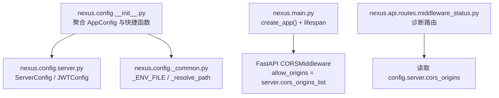
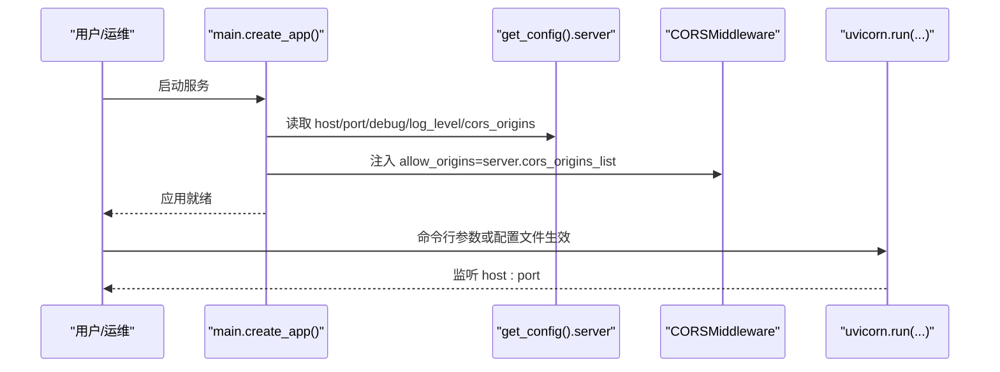
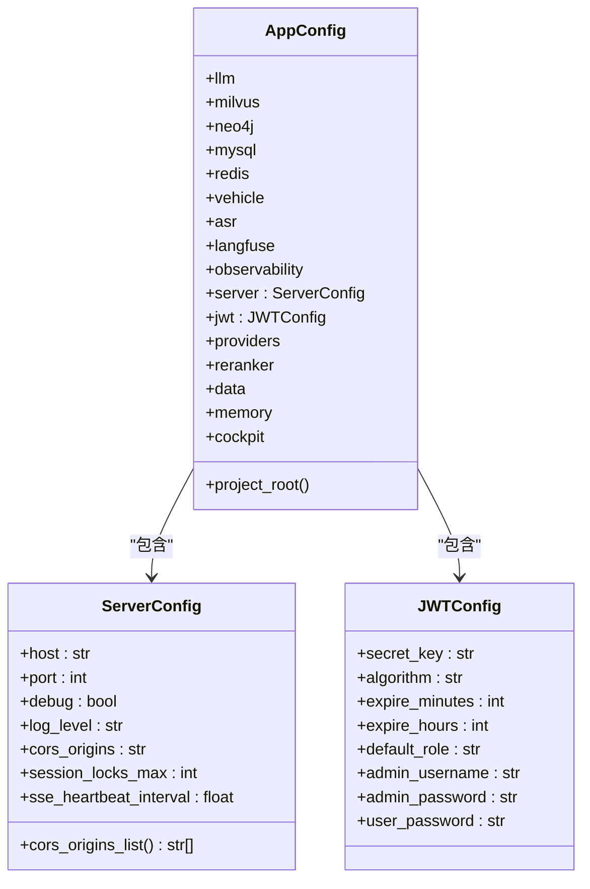

# 服务器配置

<cite>
**本文引用的文件**   
- [server.py](file://backend_design/nexus/config/server.py)
- [__init__.py](file://backend_design/nexus/config/__init__.py)
- [_common.py](file://backend_design/nexus/config/_common.py)
- [main.py](file://backend_design/nexus/main.py)
- [middleware_status.py](file://backend_design/nexus/api/routes/middleware_status.py)
</cite>

## 目录
1. [简介](#简介)
2. [项目结构](#项目结构)
3. [核心组件](#核心组件)
4. [架构总览](#架构总览)
5. [详细组件分析](#详细组件分析)
6. [依赖关系分析](#依赖关系分析)
7. [性能与进程管理](#性能与进程管理)
8. [故障排查指南](#故障排查指南)
9. [结论](#结论)
10. [附录：环境模板与示例](#附录环境模板与示例)

## 简介
本文件面向 NexusCockpit 服务器的配置，聚焦以下目标：
- ServerConfig 各项参数（host、port、debug、log_level、cors_origins、session_locks_max、sse_heartbeat_interval）的用途与安全建议
- JWTConfig 认证相关参数（secret_key、algorithm、expire_minutes、expire_hours、RBAC 默认角色与账号）
- CORS 跨域白名单机制与安全注意事项
- 调试模式启用方式与开发优化选项
- 服务器启动流程、进程管理与关键性能调优参数
- 不同部署环境（开发、测试、生产）的配置模板与示例
- 配置热重载机制与运行时修改限制

## 项目结构
NexusCockpit 将配置按子系统拆分到多个模块，并通过统一入口聚合导出。与“服务器配置”直接相关的文件包括：
- 服务器与认证配置定义：backend_design/nexus/config/server.py
- 全局配置聚合与单例访问：backend_design/nexus/config/__init__.py
- 环境变量加载与路径工具：backend_design/nexus/config/_common.py
- FastAPI 应用创建与中间件挂载（含 CORS）：backend_design/nexus/main.py
- 运行时暴露部分配置（如 cors_origins）用于诊断接口：backend_design/nexus/api/routes/middleware_status.py

**图表来源** 
- [__init__.py:84-132](file://backend_design/nexus/config/__init__.py#L84-L132)
- [server.py:15-41](file://backend_design/nexus/config/server.py#L15-L41)
- [_common.py:39-53](file://backend_design/nexus/config/_common.py#L39-L53)
- [main.py:454-461](file://backend_design/nexus/main.py#L454-L461)
- [middleware_status.py:258](file://backend_design/nexus/api/routes/middleware_status.py#L258)

**章节来源**
- [__init__.py:84-132](file://backend_design/nexus/config/__init__.py#L84-L132)
- [server.py:15-41](file://backend_design/nexus/config/server.py#L15-L41)
- [_common.py:39-53](file://backend_design/nexus/config/_common.py#L39-L53)
- [main.py:454-461](file://backend_design/nexus/main.py#L454-L461)
- [middleware_status.py:258](file://backend_design/nexus/api/routes/middleware_status.py#L258)

## 核心组件
- ServerConfig：FastAPI 服务器运行参数与跨域策略
- JWTConfig：JWT 签名算法、密钥与过期策略，以及 RBAC 默认角色/账号
- AppConfig：聚合所有子系统配置，提供 get_config() 单例访问
- 环境变量加载：_common.py 负责 .env.local/.env 的优先级与加载

要点：
- ServerConfig.cors_origins_list 将逗号分隔字符串转换为列表，支持通配符 “*”
- JWTConfig.expire_minutes 与 expire_hours 同时存在，具体使用由业务逻辑决定
- AppConfig 通过 lru_cache 保证单例，避免重复初始化

**章节来源**
- [server.py:15-41](file://backend_design/nexus/config/server.py#L15-L41)
- [server.py:44-61](file://backend_design/nexus/config/server.py#L44-L61)
- [__init__.py:144-151](file://backend_design/nexus/config/__init__.py#L144-L151)
- [_common.py:39-53](file://backend_design/nexus/config/_common.py#L39-L53)

## 架构总览
下图展示服务器配置在应用生命周期中的使用位置与数据流向：

**图表来源** 
- [main.py:442-461](file://backend_design/nexus/main.py#L442-L461)
- [main.py:661-672](file://backend_design/nexus/main.py#L661-L672)
- [server.py:15-41](file://backend_design/nexus/config/server.py#L15-L41)

## 详细组件分析

### ServerConfig 参数说明
- host：监听地址，默认 0.0.0.0（所有网卡），生产环境建议绑定内网 IP
- port：监听端口，默认 8000
- debug：是否开启 uvicorn 热重载（reload=True），仅开发环境使用
- log_level：日志级别，默认 INFO
- cors_origins：允许的来源（逗号分隔字符串），默认 http://localhost:3000；生产必须指定具体域名
- session_locks_max：会话并发锁最大数量，超过时清理空闲锁防内存泄漏
- sse_heartbeat_interval：SSE 心跳间隔秒数，防止代理/防火墙超时断连

注意：
- cors_origins_list 属性会将字符串解析为列表，若值为 “*” 则返回 ["*"]
- 该配置通过环境变量 HOST、PORT、DEBUG、LOG_LEVEL、CORS_ORIGINS、SESSION_LOCKS_MAX、SSE_HEARTBEAT_INTERVAL 覆盖

**章节来源**
- [server.py:15-41](file://backend_design/nexus/config/server.py#L15-L41)

### JWTConfig 安全配置
- secret_key：JWT 签名密钥，默认值仅供开发，生产务必替换为强随机密钥
- algorithm：签名算法，默认 HS256
- expire_minutes：令牌有效期（分钟），默认 1440（24 小时）
- expire_hours：令牌有效期（小时），默认 24（与 expire_minutes 并存，具体使用取决于业务实现）
- RBAC 默认角色与账号：default_role、admin_username、admin_password、user_password

安全建议：
- 生产环境必须更换 secret_key，并选择更安全的算法（如 RS256，需配合公钥/私钥）
- 合理设置过期时间，结合刷新令牌策略降低泄露风险
- 默认管理员密码仅用于本地开发，生产应通过外部身份源或安全配置中心注入

**章节来源**
- [server.py:44-61](file://backend_design/nexus/config/server.py#L44-L61)

### CORS 跨域白名单机制与安全
- 白名单来源：config.server.cors_origins_list
- 应用层：FastAPI 的 CORSMiddleware 使用 allow_origins 控制允许的 Origin
- 诊断接口：middleware_status.py 会暴露当前 cors_origins 值，便于运维核对

安全注意事项：
- 生产环境禁止使用 “*” 作为 allow_origins
- 明确列出前端域名（含协议与端口），避免子域泛化导致风险
- 如需携带凭证（cookies），确保 allow_credentials=True 且 allow_origins 不为 “*”

**章节来源**
- [main.py:454-461](file://backend_design/nexus/main.py#L454-L461)
- [middleware_status.py:258](file://backend_design/nexus/api/routes/middleware_status.py#L258)
- [server.py:37-41](file://backend_design/nexus/config/server.py#L37-L41)

### 调试模式与开发优化
- debug=True 时，uvicorn 启用 reload，代码变更自动重启
- log_level 可设置为 DEBUG 以输出更详细的日志
- SSE 心跳间隔可调，避免长连接被中间设备断开
- 会话锁上限 session_locks_max 可根据并发规模调整

**章节来源**
- [server.py:15-41](file://backend_design/nexus/config/server.py#L15-L41)
- [main.py:661-672](file://backend_design/nexus/main.py#L661-L672)

### 服务器启动配置与进程管理
- create_app() 中完成中间件注册、路由挂载、异常处理器与指标端点挂载
- lifespan 钩子中初始化各子系统（向量库、图谱、缓存、Agent、MCP、提醒扫描等）
- 直接运行入口通过 uvicorn.run(host, port, reload, log_level) 启动

进程管理建议：
- 生产建议使用进程管理器（systemd/supervisor/docker）托管 uvicorn
- 通过环境变量或外部配置中心注入敏感信息，避免硬编码
- 监控 /metrics 端点，结合 Prometheus/Grafana 观测性能

**章节来源**
- [main.py:436-488](file://backend_design/nexus/main.py#L436-L488)
- [main.py:661-672](file://backend_design/nexus/main.py#L661-L672)

## 依赖关系分析
- AppConfig 聚合 ServerConfig/JWTConfig，并通过 get_config() 提供单例访问
- main.py 在应用创建阶段读取 server 配置并注入 CORSMiddleware
- middleware_status.py 读取 server.cors_origins 用于诊断输出
- _common.py 负责 .env.local/.env 的加载顺序与环境变量注入

**图表来源** 
- [__init__.py:84-132](file://backend_design/nexus/config/__init__.py#L84-L132)
- [server.py:15-41](file://backend_design/nexus/config/server.py#L15-L41)
- [server.py:44-61](file://backend_design/nexus/config/server.py#L44-L61)

**章节来源**
- [__init__.py:84-132](file://backend_design/nexus/config/__init__.py#L84-L132)
- [server.py:15-41](file://backend_design/nexus/config/server.py#L15-L41)
- [server.py:44-61](file://backend_design/nexus/config/server.py#L44-L61)

## 性能与进程管理
- 日志级别：根据环境调整 log_level（开发 DEBUG，生产 INFO/WARNING）
- 并发与锁：session_locks_max 影响会话锁上限，过高可能增加内存占用
- SSE 心跳：sse_heartbeat_interval 影响长连接稳定性，过短会增加网络开销
- 指标采集：/metrics 端点暴露 Prometheus 指标，建议接入监控系统
- 进程管理：生产建议使用容器化与进程管理器，配合健康检查与优雅停机

[本节为通用指导，不直接分析具体文件]

## 故障排查指南
- CORS 问题：确认 cors_origins 列表包含前端域名，且生产不使用 “*”
- 认证失败：检查 JWT secret_key 是否与签发方一致，算法匹配
- 启动失败：查看 lifespan 初始化日志，定位数据库/缓存/Agent 连接错误
- 限流/鉴权异常：检查 RateLimitError/AuthError 处理逻辑与响应格式

**章节来源**
- [main.py:505-596](file://backend_design/nexus/main.py#L505-L596)
- [middleware_status.py:258](file://backend_design/nexus/api/routes/middleware_status.py#L258)

## 结论
- ServerConfig 与 JWTConfig 是 NexusCockpit 服务器运行的关键配置，分别控制网络监听、跨域策略与认证安全
- 通过 AppConfig 单例集中管理，main.py 在应用启动时读取并注入中间件
- 生产环境需严格限定 CORS 白名单、替换 JWT 密钥、合理设置过期时间与日志级别
- 借助 /metrics 与结构化日志进行监控与排障，结合进程管理器保障稳定运行

[本节为总结性内容，不直接分析具体文件]

## 附录：环境模板与示例
以下为不同环境的配置要点与示例键名（请根据实际部署调整）：

- 开发环境（local）
  - HOST=0.0.0.0
  - PORT=8000
  - DEBUG=true
  - LOG_LEVEL=DEBUG
  - CORS_ORIGINS=http://localhost:3000
  - JWT_SECRET_KEY=开发用弱密钥（勿用于生产）
  - JWT_ALGORITHM=HS256
  - JWT_EXPIRE_MINUTES=1440
  - JWT_EXPIRE_HOURS=24
  - SESSION_LOCKS_MAX=500
  - SSE_HEARTBEAT_INTERVAL=15.0

- 测试环境（staging）
  - HOST=内网IP
  - PORT=8000
  - DEBUG=false
  - LOG_LEVEL=INFO
  - CORS_ORIGINS=https://test.example.com
  - JWT_SECRET_KEY=强随机密钥
  - JWT_ALGORITHM=HS256 或 RS256（需配套公钥）
  - JWT_EXPIRE_MINUTES=60
  - JWT_EXPIRE_HOURS=1
  - SESSION_LOCKS_MAX=1000
  - SSE_HEARTBEAT_INTERVAL=10.0

- 生产环境（production）
  - HOST=内网IP
  - PORT=8000
  - DEBUG=false
  - LOG_LEVEL=WARNING
  - CORS_ORIGINS=https://app.example.com,https://admin.example.com
  - JWT_SECRET_KEY=强随机密钥（长度足够，定期轮换）
  - JWT_ALGORITHM=RS256（推荐）
  - JWT_EXPIRE_MINUTES=30
  - JWT_EXPIRE_HOURS=1
  - SESSION_LOCKS_MAX=2000
  - SSE_HEARTBEAT_INTERVAL=10.0

提示：
- 环境变量优先级：.env.local > .env（由 _common.py 加载逻辑决定）
- 敏感信息（如 API Key、JWT Secret）放入 .env.local，不要提交至版本库
- 运行时修改限制：AppConfig 使用 lru_cache 单例，修改 .env 后需重启服务或调用缓存清除（见 main.py 启动时的缓存清理逻辑）

**章节来源**
- [_common.py:39-53](file://backend_design/nexus/config/_common.py#L39-L53)
- [main.py:93-95](file://backend_design/nexus/main.py#L93-L95)