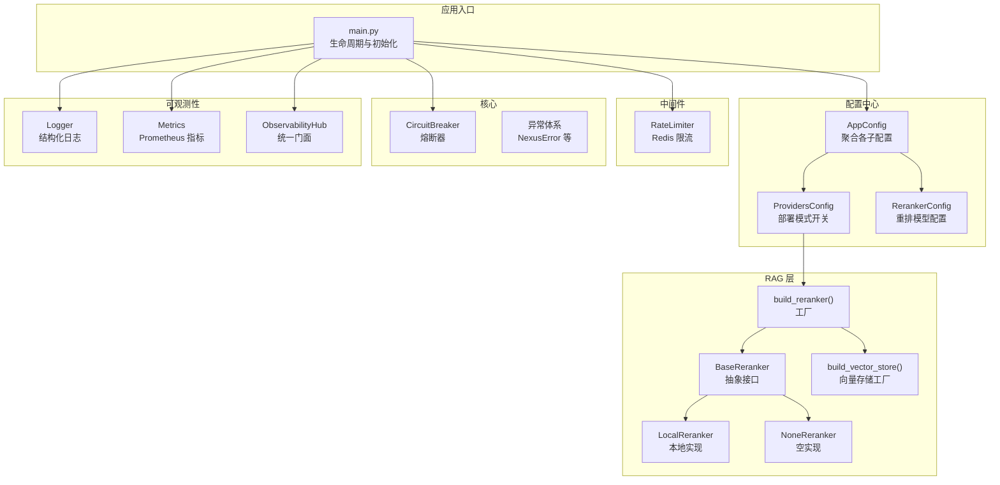
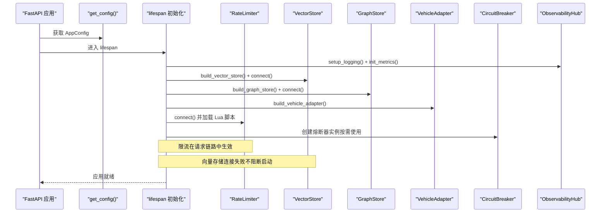
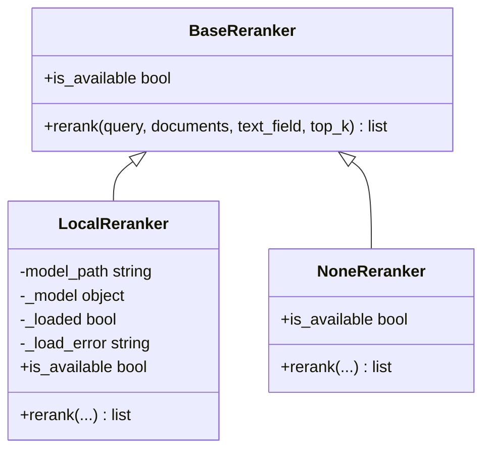
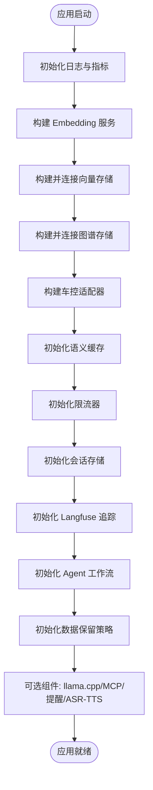
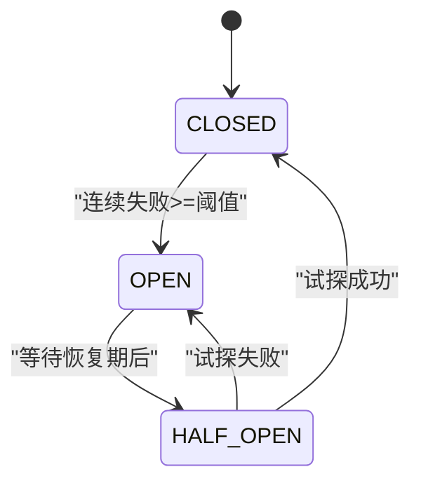
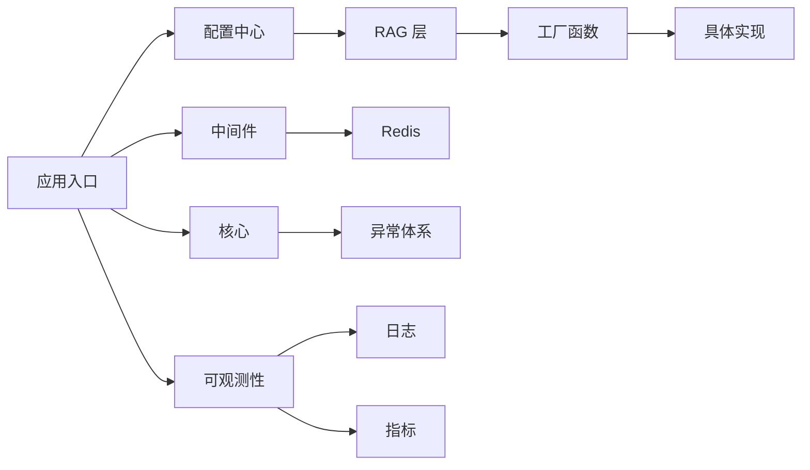

# 服务提供商配置

<cite>
**本文引用的文件**   
- [providers.py](file://backend_design/nexus/config/providers.py)
- [__init__.py](file://backend_design/nexus/config/__init__.py)
- [reranker_base.py](file://backend_design/nexus/rag/reranker_base.py)
- [reranker.py](file://backend_design/nexus/rag/reranker.py)
- [reranker_factory.py](file://backend_design/nexus/rag/reranker_factory.py)
- [vector_factory.py](file://backend_design/nexus/rag/vector_factory.py)
- [circuit_breaker.py](file://backend_design/nexus/core/circuit_breaker.py)
- [rate_limiter.py](file://backend_design/nexus/middleware/rate_limiter.py)
- [logger.py](file://backend_design/nexus/core/logger.py)
- [exceptions.py](file://backend_design/nexus/core/exceptions.py)
- [metrics.py](file://backend_design/nexus/observability/metrics.py)
- [unified.py](file://backend_design/nexus/observability/unified.py)
- [main.py](file://backend_design/nexus/main.py)
</cite>

## 目录
1. [简介](#简介)
2. [项目结构](#项目结构)
3. [核心组件](#核心组件)
4. [架构总览](#架构总览)
5. [详细组件分析](#详细组件分析)
6. [依赖关系分析](#依赖关系分析)
7. [性能考量](#性能考量)
8. [故障排查指南](#故障排查指南)
9. [结论](#结论)
10. [附录](#附录)

## 简介
本文件面向 NexusCockpit 的“服务提供商配置”主题，聚焦以下目标：
- ProvidersConfig 的服务发现与管理：服务注册、健康检查、负载均衡等实践建议与落地方案。
- RerankerConfig 的重排序配置：模型选择、权重设置、融合策略等。
- 第三方服务的统一接入规范、接口抽象与适配器模式。
- 服务依赖关系、启动顺序与初始化策略。
- 熔断、降级与限流配置。
- 扩展指南、自定义服务开发与插件机制。
- 监控、性能分析与故障诊断方法。
- 版本管理、兼容性检查与升级策略。

## 项目结构
NexusCockpit 将配置按子系统拆分，并通过统一的配置中心聚合导出。RAG 层提供重排（Reranker）与向量存储（Vector Store）的工厂化构建；中间件提供限流能力；核心模块提供熔断器与异常体系；可观测性模块提供日志、指标与追踪的统一门面。

图表来源 
- [__init__.py:84-132](file://backend_design/nexus/config/__init__.py#L84-L132)
- [providers.py:15-47](file://backend_design/nexus/config/providers.py#L15-L47)
- [reranker_base.py:17-50](file://backend_design/nexus/rag/reranker_base.py#L17-L50)
- [reranker.py:34-148](file://backend_design/nexus/rag/reranker.py#L34-L148)
- [reranker_factory.py:25-59](file://backend_design/nexus/rag/reranker_factory.py#L25-L59)
- [vector_factory.py:21-34](file://backend_design/nexus/rag/vector_factory.py#L21-L34)
- [rate_limiter.py:117-297](file://backend_design/nexus/middleware/rate_limiter.py#L117-L297)
- [circuit_breaker.py:48-177](file://backend_design/nexus/core/circuit_breaker.py#L48-L177)
- [logger.py:83-202](file://backend_design/nexus/core/logger.py#L83-L202)
- [metrics.py:14-108](file://backend_design/nexus/observability/metrics.py#L14-L108)
- [unified.py:78-118](file://backend_design/nexus/observability/unified.py#L78-L118)
- [main.py:75-180](file://backend_design/nexus/main.py#L75-L180)

章节来源
- [__init__.py:84-132](file://backend_design/nexus/config/__init__.py#L84-L132)
- [providers.py:15-47](file://backend_design/nexus/config/providers.py#L15-L47)

## 核心组件
- 配置中心 AppConfig：聚合所有子系统配置，提供全局单例 get_config()。
- ProvidersConfig：定义 vector_store、graph_store、cache、reranker、checkpoint 等 Provider 的选择项，并提供 normalized() 归一化输出。
- RerankerConfig：定义 reranker 模型名称（如 bge-reranker-v2-m3）。
- BaseReranker：重排抽象接口，规定 rerank() 与 is_available 属性。
- LocalReranker：基于本地 CrossEncoder 的实现，支持延迟加载、Top-K 重排与回退。
- NoneReranker：跳过重排的空实现。
- build_reranker()：根据 providers.normalized()["reranker"] 返回具体实现。
- build_vector_store()：固定返回本地 Milvus 向量存储实例。
- RateLimiter：基于 Redis 的滑动窗口与令牌桶限流。
- CircuitBreaker：三状态熔断器（CLOSED/OPEN/HALF_OPEN），保护外部调用。
- Logger/Metrics/ObservabilityHub：结构化日志、Prometheus 指标与统一可观测性门面。
- main.py：应用生命周期，按序初始化 Embedding、向量存储、图谱存储、车控适配器、缓存、限流、会话、Langfuse、Agent、数据保留、MCP、提醒扫描、ASR/TTS 预加载等。

章节来源
- [__init__.py:84-132](file://backend_design/nexus/config/__init__.py#L84-L132)
- [providers.py:15-47](file://backend_design/nexus/config/providers.py#L15-L47)
- [reranker_base.py:17-50](file://backend_design/nexus/rag/reranker_base.py#L17-L50)
- [reranker.py:34-148](file://backend_design/nexus/rag/reranker.py#L34-L148)
- [reranker_factory.py:25-59](file://backend_design/nexus/rag/reranker_factory.py#L25-L59)
- [vector_factory.py:21-34](file://backend_design/nexus/rag/vector_factory.py#L21-L34)
- [rate_limiter.py:117-297](file://backend_design/nexus/middleware/rate_limiter.py#L117-L297)
- [circuit_breaker.py:48-177](file://backend_design/nexus/core/circuit_breaker.py#L48-L177)
- [logger.py:83-202](file://backend_design/nexus/core/logger.py#L83-L202)
- [metrics.py:14-108](file://backend_design/nexus/observability/metrics.py#L14-L108)
- [unified.py:78-118](file://backend_design/nexus/observability/unified.py#L78-L118)
- [main.py:75-180](file://backend_design/nexus/main.py#L75-L180)

## 架构总览
下图展示从配置到运行时初始化的关键路径，以及限流、熔断与可观测性的集成点。

图表来源 
- [main.py:75-180](file://backend_design/nexus/main.py#L75-L180)
- [vector_factory.py:21-34](file://backend_design/nexus/rag/vector_factory.py#L21-L34)
- [rate_limiter.py:142-155](file://backend_design/nexus/middleware/rate_limiter.py#L142-L155)
- [circuit_breaker.py:48-177](file://backend_design/nexus/core/circuit_breaker.py#L48-L177)
- [unified.py:100-118](file://backend_design/nexus/observability/unified.py#L100-L118)

## 详细组件分析

### ProvidersConfig 与服务发现管理
- 作用：通过环境变量控制各组件的 Provider 选择（如 vector_store、graph_store、cache、reranker、checkpoint），默认均为 local/sqlite。
- 归一化：normalized() 返回小写键值字典，供工厂函数读取。
- 服务发现与管理建议：
  - 服务注册：在启动阶段由工厂根据 ProvidersConfig 动态装配实例，并将实例挂载到 app.state 以便后续访问。
  - 健康检查：为每个 Provider 暴露 /health 或内部探针，结合 Prometheus 指标与健康端点，定期探测可用性。
  - 负载均衡：对多实例 Provider（如多个 Milvus/Neo4j/Redis）可通过客户端侧轮询/加权策略或网关层分发。
  - 版本管理与兼容性：在 normalized() 输出中加入 provider_version 字段，配合启动时的兼容性校验与告警。

章节来源
- [providers.py:15-47](file://backend_design/nexus/config/providers.py#L15-L47)
- [__init__.py:84-132](file://backend_design/nexus/config/__init__.py#L84-L132)

### RerankerConfig 与重排序配置
- 作用：指定重排模型名称（如 BAAI/bge-reranker-v2-m3），用于提升检索结果的相关度。
- 工厂行为：
  - provider=none：返回 NoneReranker，直接返回 Top-K 原序结果。
  - provider=local：返回 LocalReranker，使用本地 CrossEncoder 进行重排。
- 融合策略建议：
  - 多模型融合：在 BaseReranker 上扩展融合接口，支持加权平均、堆叠学习或元排序器。
  - 权重设置：通过配置项传入不同模型的权重，或在运行时根据质量指标动态调整。
  - 降级策略：当模型不可用时回退到 none 或原始顺序。

图表来源 
- [reranker_base.py:17-50](file://backend_design/nexus/rag/reranker_base.py#L17-L50)
- [reranker.py:34-148](file://backend_design/nexus/rag/reranker.py#L34-L148)
- [reranker_factory.py:25-59](file://backend_design/nexus/rag/reranker_factory.py#L25-L59)

章节来源
- [reranker_base.py:17-50](file://backend_design/nexus/rag/reranker_base.py#L17-L50)
- [reranker.py:34-148](file://backend_design/nexus/rag/reranker.py#L34-L148)
- [reranker_factory.py:25-59](file://backend_design/nexus/rag/reranker_factory.py#L25-L59)

### 第三方服务统一接入规范与适配器模式
- 接口抽象：以 BaseReranker 为例，定义统一接口，屏蔽本地/云端差异。
- 适配器模式：通过工厂函数（build_reranker、build_vector_store）根据配置选择具体实现，对外暴露一致 API。
- 扩展建议：新增 Provider 时，仅需实现对应接口并在工厂中注册，无需改动上层调用逻辑。

章节来源
- [reranker_base.py:17-50](file://backend_design/nexus/rag/reranker_base.py#L17-L50)
- [reranker_factory.py:25-59](file://backend_design/nexus/rag/reranker_factory.py#L25-L59)
- [vector_factory.py:21-34](file://backend_design/nexus/rag/vector_factory.py#L21-L34)

### 服务依赖关系、启动顺序与初始化策略
- 启动顺序（摘要）：
  1) 初始化日志与指标
  2) 构建 Embedding 服务
  3) 构建并连接向量存储（Milvus）
  4) 构建并连接图谱存储（Neo4j）
  5) 构建车控适配器
  6) 初始化语义缓存（Redis）
  7) 初始化限流器（Redis Lua）
  8) 初始化会话存储（Redis/内存降级）
  9) 初始化 Langfuse 追踪
  10) 初始化 Agent 工作流（Supervisor + 专家）
  11) 初始化数据保留策略
  12) 可选：llama.cpp 子进程、MCP Server、提醒扫描、ASR/TTS 后台预加载
- 初始化策略：
  - 非关键依赖失败不阻断启动（如 Milvus/Neo4j 连接失败记录警告并继续）。
  - 资源清理在关闭阶段统一执行。

图表来源 
- [main.py:75-180](file://backend_design/nexus/main.py#L75-L180)
- [main.py:180-358](file://backend_design/nexus/main.py#L180-L358)

章节来源
- [main.py:75-180](file://backend_design/nexus/main.py#L75-L180)
- [main.py:180-358](file://backend_design/nexus/main.py#L180-L358)

### 服务熔断、降级与限流配置
- 熔断器（CircuitBreaker）：
  - 三状态：CLOSED（正常）、OPEN（拒绝）、HALF_OPEN（试探恢复）。
  - 参数：failure_threshold、recovery_period、half_open_max_calls。
  - 使用场景：LLM API、Milvus、车控服务等连续失败时自动降级。
- 限流器（RateLimiter）：
  - 滑动窗口：基于 Redis ZSET，原子 Lua 脚本保证一致性。
  - 令牌桶：允许突发流量，适合 LLM API 调用限制。
  - 降级策略：Redis 不可用时放行，避免阻塞主流程。
- 降级策略：
  - Reranker：模型不可用或加载失败时回退到 NoneReranker。
  - 向量/图谱存储：连接失败不阻断启动，运行时重试或降级。

图表来源 
- [circuit_breaker.py:48-177](file://backend_design/nexus/core/circuit_breaker.py#L48-L177)
- [rate_limiter.py:117-297](file://backend_design/nexus/middleware/rate_limiter.py#L117-L297)
- [reranker_factory.py:25-59](file://backend_design/nexus/rag/reranker_factory.py#L25-L59)

章节来源
- [circuit_breaker.py:48-177](file://backend_design/nexus/core/circuit_breaker.py#L48-L177)
- [rate_limiter.py:117-297](file://backend_design/nexus/middleware/rate_limiter.py#L117-L297)
- [reranker_factory.py:25-59](file://backend_design/nexus/rag/reranker_factory.py#L25-L59)

### 监控、性能分析与故障诊断
- 结构化日志：structlog 输出 JSON，支持敏感字段脱敏与上下文绑定（request_id/user_id）。
- 指标采集：Prometheus 暴露 /metrics，包含请求计数、延迟、Agent/技能/缓存/RAG/LLM 指标。
- 统一可观测性：ObservabilityHub 统一日志、追踪与指标入口，简化使用。
- 诊断方法：
  - 查看日志文件路径与内容，定位错误与警告。
  - 通过 /metrics 抓取指标，结合 Grafana 面板分析瓶颈。
  - 使用 Langfuse 追踪链路，定位慢节点与失败原因。

章节来源
- [logger.py:83-202](file://backend_design/nexus/core/logger.py#L83-L202)
- [metrics.py:14-108](file://backend_design/nexus/observability/metrics.py#L14-L108)
- [unified.py:78-118](file://backend_design/nexus/observability/unified.py#L78-L118)

### 服务扩展指南、自定义服务开发与插件机制
- 扩展步骤：
  1) 定义新 Provider 的配置项（在 ProvidersConfig 中添加字段）。
  2) 实现接口（如 BaseReranker 或新的抽象基类）。
  3) 在工厂函数中注册新实现（根据配置选择）。
  4) 在启动流程中按需初始化与挂载。
- 插件机制建议：
  - 基于约定优于配置的插件发现（如扫描目录注册）。
  - 通过配置文件声明式启用/禁用插件。
  - 提供插件生命周期钩子（初始化、健康检查、关闭）。

章节来源
- [providers.py:15-47](file://backend_design/nexus/config/providers.py#L15-L47)
- [reranker_base.py:17-50](file://backend_design/nexus/rag/reranker_base.py#L17-L50)
- [reranker_factory.py:25-59](file://backend_design/nexus/rag/reranker_factory.py#L25-L59)

### 服务版本管理、兼容性检查与升级策略
- 版本管理：
  - 在 ProvidersConfig.normalized() 中增加 provider_version 字段，便于识别版本。
  - 在启动时打印关键组件版本信息（如模型名、库版本）。
- 兼容性检查：
  - 启动阶段校验依赖库版本与接口契约，不兼容则告警或阻止启动。
  - 对旧配置项提供迁移提示与自动转换。
- 升级策略：
  - 灰度发布：逐步切换 Provider 或权重，观察指标与错误率。
  - 回滚策略：快速回退到上一版本配置与镜像。

章节来源
- [providers.py:15-47](file://backend_design/nexus/config/providers.py#L15-L47)
- [main.py:75-180](file://backend_design/nexus/main.py#L75-L180)

## 依赖关系分析
- 配置中心依赖：_common（路径与环境文件）、各子系统配置模块。
- RAG 层依赖：BaseReranker 被 LocalReranker/NoneReranker 继承；工厂函数依赖配置中心。
- 中间件依赖：RateLimiter 依赖 Redis 与 Lua 脚本。
- 核心依赖：CircuitBreaker 依赖异常体系与日志。
- 可观测性依赖：Logger/Metrics/ObservabilityHub 相互协作，统一入口。
- 应用入口依赖：main.py 串联所有组件，按序初始化。

图表来源 
- [__init__.py:84-132](file://backend_design/nexus/config/__init__.py#L84-L132)
- [reranker_factory.py:25-59](file://backend_design/nexus/rag/reranker_factory.py#L25-L59)
- [rate_limiter.py:117-297](file://backend_design/nexus/middleware/rate_limiter.py#L117-L297)
- [circuit_breaker.py:48-177](file://backend_design/nexus/core/circuit_breaker.py#L48-L177)
- [logger.py:83-202](file://backend_design/nexus/core/logger.py#L83-L202)
- [metrics.py:14-108](file://backend_design/nexus/observability/metrics.py#L14-L108)
- [main.py:75-180](file://backend_design/nexus/main.py#L75-L180)

章节来源
- [__init__.py:84-132](file://backend_design/nexus/config/__init__.py#L84-L132)
- [reranker_factory.py:25-59](file://backend_design/nexus/rag/reranker_factory.py#L25-L59)
- [rate_limiter.py:117-297](file://backend_design/nexus/middleware/rate_limiter.py#L117-L297)
- [circuit_breaker.py:48-177](file://backend_design/nexus/core/circuit_breaker.py#L48-L177)
- [logger.py:83-202](file://backend_design/nexus/core/logger.py#L83-L202)
- [metrics.py:14-108](file://backend_design/nexus/observability/metrics.py#L14-L108)
- [main.py:75-180](file://backend_design/nexus/main.py#L75-L180)

## 性能考量
- 重排模型延迟：LocalReranker 首次加载约 2 秒，推理 CPU 约 200ms/20 条；可通过预热与批处理优化。
- 向量/图谱存储连接：连接失败不阻断启动，但会影响检索性能；建议健康检查与重试。
- 限流算法：滑动窗口与令牌桶均基于 Redis Lua 脚本，保证原子性与分布式安全。
- 指标采集：Prometheus 指标粒度细，注意标签基数与采样频率。

章节来源
- [reranker.py:34-148](file://backend_design/nexus/rag/reranker.py#L34-L148)
- [rate_limiter.py:117-297](file://backend_design/nexus/middleware/rate_limiter.py#L117-L297)
- [metrics.py:14-108](file://backend_design/nexus/observability/metrics.py#L14-L108)

## 故障排查指南
- 常见问题：
  - Reranker 模型未找到或导入失败：检查模型路径与依赖安装。
  - Redis 连接失败：限流降级放行，检查 Redis 服务与网络。
  - Milvus/Neo4j 连接失败：记录警告并继续启动，检查服务状态与配置。
  - 限流触发：查看用户 ID 与端点，调整限流参数或扩容。
  - 熔断器开启：检查下游服务健康与重试策略。
- 诊断工具：
  - 日志文件：查看后端日志文件路径与内容。
  - /metrics：抓取指标，分析延迟与错误率。
  - Langfuse：追踪链路，定位慢节点与失败原因。

章节来源
- [reranker.py:34-148](file://backend_design/nexus/rag/reranker.py#L34-L148)
- [rate_limiter.py:117-297](file://backend_design/nexus/middleware/rate_limiter.py#L117-L297)
- [circuit_breaker.py:48-177](file://backend_design/nexus/core/circuit_breaker.py#L48-L177)
- [logger.py:83-202](file://backend_design/nexus/core/logger.py#L83-L202)
- [metrics.py:14-108](file://backend_design/nexus/observability/metrics.py#L14-L108)

## 结论
NexusCockpit 通过配置中心与工厂模式实现了灵活的服务提供商管理，结合熔断、限流与可观测性，构建了高可用、易扩展的后端架构。Reranker 与向量存储的本地化降级提升了稳定性与成本效益。建议在生产环境中完善健康检查、负载均衡与版本管理，持续优化性能与可维护性。

## 附录
- 环境变量示例：
  - VECTOR_STORE_PROVIDER、GRAPH_STORE_PROVIDER、CACHE_PROVIDER、RERANKER_PROVIDER、CHECKPOINT_PROVIDER
  - RERANK_MODEL
- 启动命令：
  - python -m nexus.main
  - make dev

章节来源
- [providers.py:15-47](file://backend_design/nexus/config/providers.py#L15-L47)
- [main.py:661-673](file://backend_design/nexus/main.py#L661-L673)