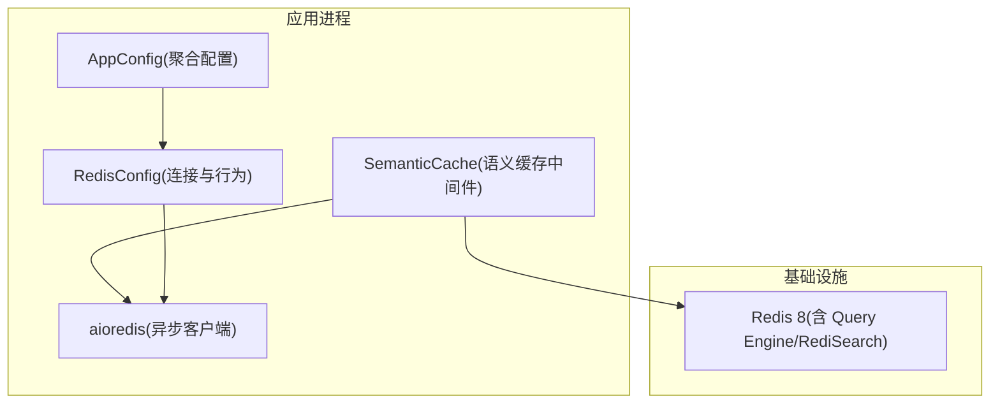
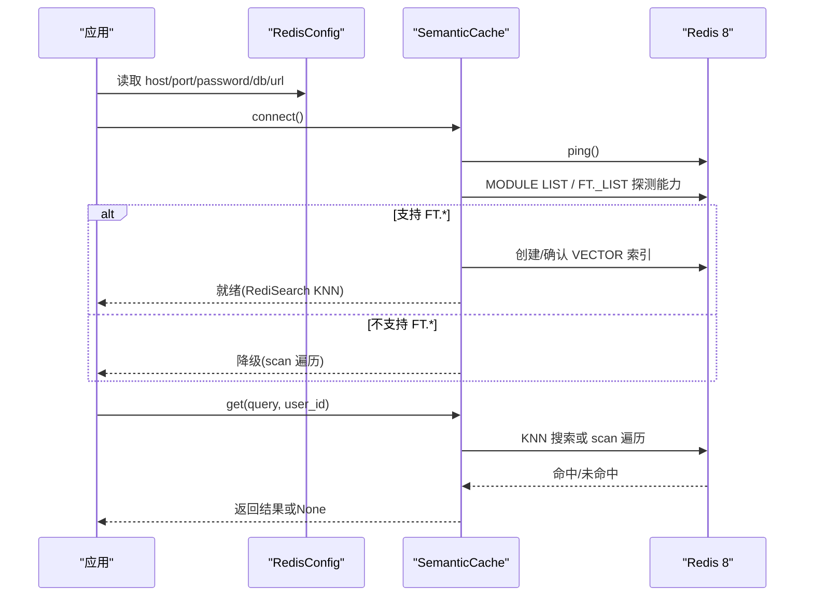
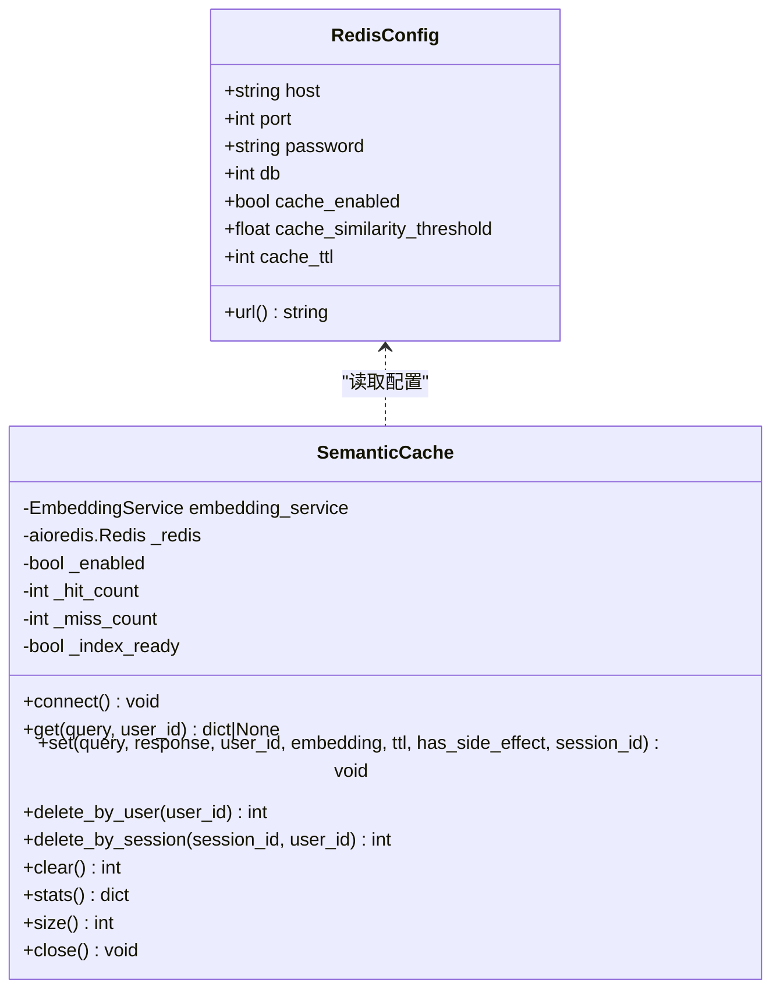
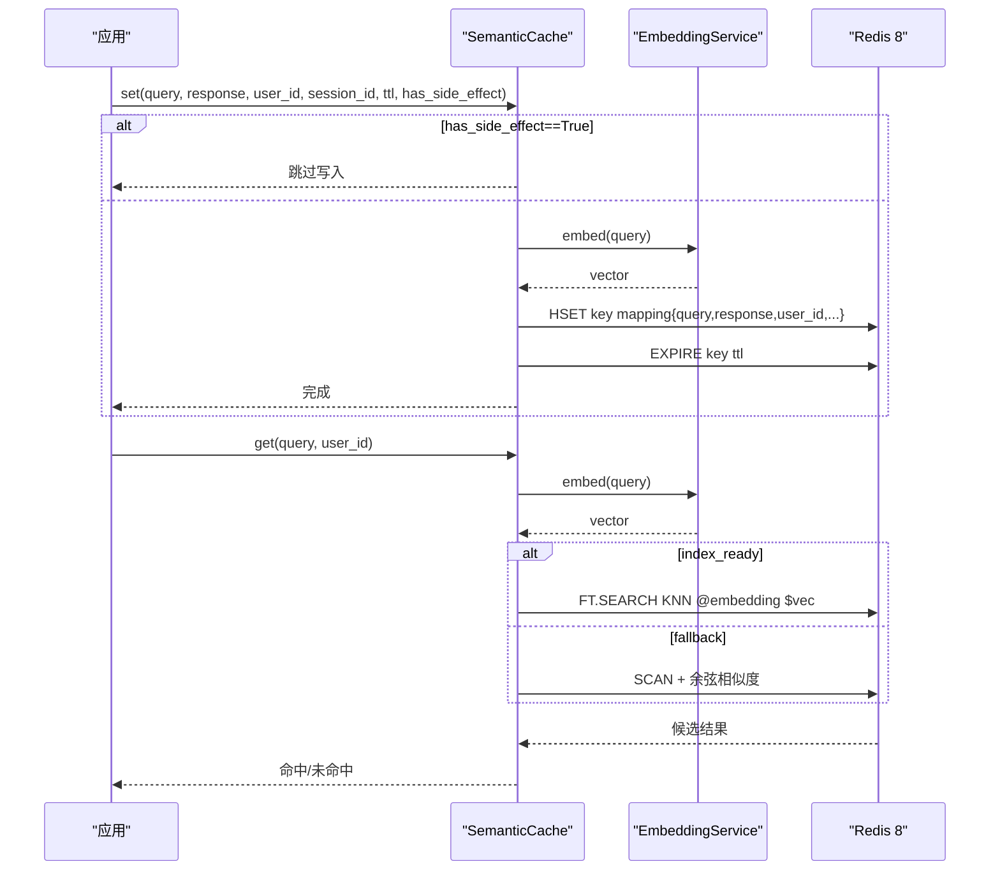
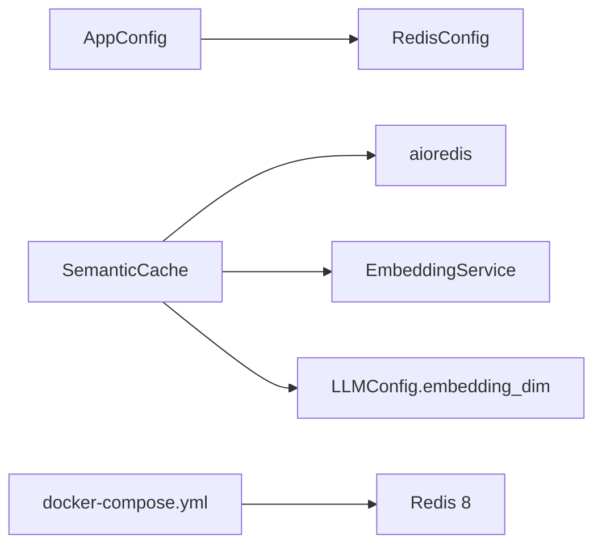

# 缓存配置

<cite>
**本文引用的文件**   
- [backend_design/nexus/config/cache.py](file://backend_design/nexus/config/cache.py)
- [backend_design/nexus/middleware/redis_cache.py](file://backend_design/nexus/middleware/redis_cache.py)
- [backend_design/nexus/config/__init__.py](file://backend_design/nexus/config/__init__.py)
- [docker-compose.yml](file://docker-compose.yml)
- [backend_design/nexus/api/routes/settings.py](file://backend_design/nexus/api/routes/settings.py)
- [backend_design/nexus/core/cockpit_manager.py](file://backend_design/nexus/core/cockpit_manager.py)
- [backend_design/nexus/main.py](file://backend_design/nexus/main.py)
</cite>

## 目录
1. [简介](#简介)
2. [项目结构](#项目结构)
3. [核心组件](#核心组件)
4. [架构总览](#架构总览)
5. [详细组件分析](#详细组件分析)
6. [依赖关系分析](#依赖关系分析)
7. [性能与容量规划](#性能与容量规划)
8. [故障排查指南](#故障排查指南)
9. [结论](#结论)
10. [附录：参数与环境变量对照表](#附录参数与环境变量对照表)

## 简介
本文件为 NexusCockpit 的 Redis 缓存配置与使用指南，聚焦于 RedisConfig 连接与行为参数、键空间隔离策略、TTL 过期策略、内存淘汰与持久化、集群/主从支持说明、缓存预热与数据同步、故障转移机制、命中率监控与调优、以及一致性、穿透与雪崩防护等。文档同时给出架构图、类图与时序图，帮助读者快速理解并落地生产实践。

## 项目结构
NexusCockpit 将 Redis 相关配置与实现拆分为“配置层”和“中间件层”：
- 配置层：RedisConfig 定义连接与语义缓存行为参数，并通过全局配置中心暴露。
- 中间件层：SemanticCache 基于 Redis 8 的 RediSearch（FT.*）或降级 scan 模式实现语义缓存。

图表来源
- [backend_design/nexus/config/__init__.py:84-132](file://backend_design/nexus/config/__init__.py#L84-L132)
- [backend_design/nexus/config/cache.py:15-41](file://backend_design/nexus/config/cache.py#L15-L41)
- [backend_design/nexus/middleware/redis_cache.py:57-128](file://backend_design/nexus/middleware/redis_cache.py#L57-L128)

章节来源
- [backend_design/nexus/config/__init__.py:84-132](file://backend_design/nexus/config/__init__.py#L84-L132)
- [backend_design/nexus/config/cache.py:15-41](file://backend_design/nexus/config/cache.py#L15-L41)
- [backend_design/nexus/middleware/redis_cache.py:57-128](file://backend_design/nexus/middleware/redis_cache.py#L57-L128)

## 核心组件
- RedisConfig：封装 Redis 连接参数与语义缓存开关、相似度阈值、TTL 等；提供 url 计算属性用于 aioredis 连接。
- SemanticCache：实现语义缓存的 KNN 检索、写入、清理、统计与降级策略；内置副作用安全控制（车控指令不缓存）。

章节来源
- [backend_design/nexus/config/cache.py:15-41](file://backend_design/nexus/config/cache.py#L15-L41)
- [backend_design/nexus/middleware/redis_cache.py:57-128](file://backend_design/nexus/middleware/redis_cache.py#L57-L128)

## 架构总览
下图展示 Redis 在系统中的角色与关键交互：配置加载、连接建立、索引初始化、读写流程与降级路径。

图表来源
- [backend_design/nexus/middleware/redis_cache.py:90-128](file://backend_design/nexus/middleware/redis_cache.py#L90-L128)
- [backend_design/nexus/middleware/redis_cache.py:129-162](file://backend_design/nexus/middleware/redis_cache.py#L129-L162)
- [backend_design/nexus/middleware/redis_cache.py:164-212](file://backend_design/nexus/middleware/redis_cache.py#L164-L212)
- [backend_design/nexus/middleware/redis_cache.py:213-301](file://backend_design/nexus/middleware/redis_cache.py#L213-L301)

## 详细组件分析

### RedisConfig 参数详解
- host：Redis 主机地址，默认 127.0.0.1，环境变量 REDIS_HOST。
- port：Redis 端口，默认 16379（开发映射），环境变量 REDIS_PORT。
- password：密码，默认空字符串，环境变量 REDIS_PASSWORD。
- db：数据库编号，默认 0，环境变量 REDIS_DB。
- cache_enabled：是否启用语义缓存，默认 True，环境变量 SEMANTIC_CACHE_ENABLED。
- cache_similarity_threshold：相似度阈值，默认 0.92，环境变量 SEMANTIC_CACHE_SIMILARITY_THRESHOLD。
- cache_ttl：缓存 TTL（秒），默认 3600，环境变量 SEMANTIC_CACHE_TTL_SECONDS。
- url：由 host/port/password/db 动态拼接的 Redis URL，供 aioredis.from_url 使用。

注意：当前 RedisConfig 未包含 prefix、max_connections 字段。前缀由中间件层常量管理；连接池大小由 aioredis 默认策略决定，可通过外部客户端构造覆盖。

章节来源
- [backend_design/nexus/config/cache.py:15-41](file://backend_design/nexus/config/cache.py#L15-L41)
- [backend_design/nexus/config/__init__.py:164-167](file://backend_design/nexus/config/__init__.py#L164-L167)

### 键空间隔离与命名规范
- 索引名：nexus:cache:index（固定命名，避免与其他业务冲突）。
- 缓存 Key 前缀：nexus:cache:entry:（所有缓存条目以该前缀开头，便于扫描与清理）。
- 分片维度：user_id、session_id 作为 TAG 字段参与过滤，实现用户与会话级隔离。
- 向量维度：通过 LLM 配置的 embedding_dim 动态获取，确保与 EmbeddingService 输出一致。

章节来源
- [backend_design/nexus/middleware/redis_cache.py:44-55](file://backend_design/nexus/middleware/redis_cache.py#L44-L55)
- [backend_design/nexus/middleware/redis_cache.py:164-212](file://backend_design/nexus/middleware/redis_cache.py#L164-L212)

### TTL 过期策略与内存淘汰
- TTL 设置：写入时调用 expire(cache_key, ttl)，默认取自 RedisConfig.cache_ttl。
- 查询校验：命中后检查 timestamp 与 cache_ttl，超过则视为未命中。
- 内存淘汰：Docker 中 Redis 使用 allkeys-lru 策略，配合 maxmemory 限制内存上限。
- 持久化：开启 appendonly yes（AOF），保障重启后数据恢复。

章节来源
- [backend_design/nexus/middleware/redis_cache.py:367-436](file://backend_design/nexus/middleware/redis_cache.py#L367-L436)
- [docker-compose.yml:166-186](file://docker-compose.yml#L166-L186)

### 集群模式与主从复制
- 当前实现基于单实例 Redis（aioredis.from_url），未直接体现 cluster_mode 或节点列表。
- 若需集群/主从：可在上层替换为 redis.asyncio.RedisCluster 或通过代理（如 Twemproxy/Redis Cluster）接入；需在连接构建处注入相应参数。
- 建议：生产环境优先采用托管 Redis 或自建集群，结合健康检查与重试策略。

章节来源
- [backend_design/nexus/middleware/redis_cache.py:90-128](file://backend_design/nexus/middleware/redis_cache.py#L90-L128)

### 缓存预热、数据同步与故障转移
- 预热：启动时调用 ensure_index 并确保索引存在；可按需批量 set 热点 query→response 对。
- 数据同步：删除接口支持按 user_id 或 session_id 精确清理，保证会话级一致性。
- 故障转移：connect 失败会记录日志并禁用缓存；FT.* 不可用时自动降级为 scan 模式，保障可用性。

章节来源
- [backend_design/nexus/middleware/redis_cache.py:90-128](file://backend_design/nexus/middleware/redis_cache.py#L90-L128)
- [backend_design/nexus/middleware/redis_cache.py:437-514](file://backend_design/nexus/middleware/redis_cache.py#L437-L514)

### 安全性与一致性
- 副作用隔离：has_side_effect=True 的响应永不写入缓存，防止车控指令被缓存导致不执行。
- 相似度阈值：低于 cache_similarity_threshold 视为未命中，避免误命中。
- 会话级清理：delete_by_session 仅清理指定会话，不影响同用户其他会话。

章节来源
- [backend_design/nexus/middleware/redis_cache.py:367-436](file://backend_design/nexus/middleware/redis_cache.py#L367-L436)
- [backend_design/nexus/middleware/redis_cache.py:466-498](file://backend_design/nexus/middleware/redis_cache.py#L466-L498)

### 监控与统计
- 命中率：hit_count/miss_count/hit_rate 由 stats() 汇总。
- 规模：size() 统计当前缓存条目数。
- 索引状态：index_ready 标识是否成功创建 RediSearch 索引。

章节来源
- [backend_design/nexus/middleware/redis_cache.py:580-615](file://backend_design/nexus/middleware/redis_cache.py#L580-L615)

### 与业务数据的缓存一致性策略与失效机制
- 写路径：业务生成 response 后，若无副作用则写入缓存，附带 user_id/session_id/timestamp/embedding。
- 读路径：先查缓存，命中且满足相似度与 TTL 则直接返回；否则回源并可选择回填。
- 失效：会话结束或用户注销时调用 delete_by_session/delete_by_user 清理；也可 clear() 全量清理。

章节来源
- [backend_design/nexus/middleware/redis_cache.py:367-436](file://backend_design/nexus/middleware/redis_cache.py#L367-L436)
- [backend_design/nexus/middleware/redis_cache.py:437-514](file://backend_design/nexus/middleware/redis_cache.py#L437-L514)

### 缓存穿透、雪崩防护与降级方案
- 穿透防护：未命中返回 None，建议在业务层对空结果做短期本地缓存或布隆过滤器（可选扩展）。
- 雪崩防护：TTL 可加随机抖动（建议在上层封装时增加 jitter）；Redis 侧使用 allkeys-lru 缓解突发压力。
- 降级：FT.* 不可用或异常时自动降级为 scan 模式；连接失败则禁用缓存并记录日志。

章节来源
- [backend_design/nexus/middleware/redis_cache.py:129-162](file://backend_design/nexus/middleware/redis_cache.py#L129-L162)
- [backend_design/nexus/middleware/redis_cache.py:303-365](file://backend_design/nexus/middleware/redis_cache.py#L303-L365)

### 类图（代码级）

图表来源
- [backend_design/nexus/config/cache.py:15-41](file://backend_design/nexus/config/cache.py#L15-L41)
- [backend_design/nexus/middleware/redis_cache.py:57-128](file://backend_design/nexus/middleware/redis_cache.py#L57-L128)

### 时序图（写入与查询）

图表来源
- [backend_design/nexus/middleware/redis_cache.py:367-436](file://backend_design/nexus/middleware/redis_cache.py#L367-L436)
- [backend_design/nexus/middleware/redis_cache.py:213-301](file://backend_design/nexus/middleware/redis_cache.py#L213-L301)

## 依赖关系分析
- 配置聚合：AppConfig 聚合 RedisConfig，并提供 get_redis_config() 快捷访问。
- 运行时依赖：SemanticCache 依赖 aioredis、EmbeddingService、LLM 配置中的 embedding_dim。
- 部署依赖：docker-compose 中 Redis 镜像为 redis:8-alpine，启用 AOF、内存限制与 LRU 淘汰。

图表来源
- [backend_design/nexus/config/__init__.py:84-132](file://backend_design/nexus/config/__init__.py#L84-L132)
- [backend_design/nexus/middleware/redis_cache.py:57-128](file://backend_design/nexus/middleware/redis_cache.py#L57-L128)
- [docker-compose.yml:166-186](file://docker-compose.yml#L166-L186)

章节来源
- [backend_design/nexus/config/__init__.py:84-132](file://backend_design/nexus/config/__init__.py#L84-L132)
- [backend_design/nexus/middleware/redis_cache.py:57-128](file://backend_design/nexus/middleware/redis_cache.py#L57-L128)
- [docker-compose.yml:166-186](file://docker-compose.yml#L166-L186)

## 性能与容量规划
- 连接与并发：默认 aioredis 连接池大小由库决定；如需调整，可在上层构造 Redis 客户端时传入 connection_pool_kwargs。
- 向量维度：务必与 EmbeddingService 输出一致，避免索引创建失败或检索异常。
- 相似度阈值：0.92 为默认值，可根据业务召回质量与命中率权衡调优。
- TTL：默认 3600s，热点数据可适当延长；冷数据缩短以降低内存占用。
- 内存与淘汰：maxmemory 建议根据 QPS×平均对象大小估算；allkeys-lru 适合高吞吐场景。
- I/O 线程：io-threads 与 io-threads-do-reads 提升网络 I/O 吞吐。
- 监控指标：关注 hit_rate、size、index_ready、错误日志与 Redis 慢查询。

[本节为通用指导，无需引用具体文件]

## 故障排查指南
- 连接失败：检查 host/port/password/db 是否正确，Redis 服务是否健康；查看 connect() 异常日志。
- 索引不可用：确认 Redis 版本与镜像（8-alpine 或 7+redis-stack-server）；查看 _check_search_capability 与 _ensure_index 日志。
- 未命中率高：检查相似度阈值、TTL 是否过短、embedding_dim 是否匹配。
- 车控指令仍命中旧缓存：运行 purge_vehicle_command_cache 清理历史条目。
- 内存不足：增大 maxmemory 或降低 TTL；观察 allkeys-lru 淘汰效果。

章节来源
- [backend_design/nexus/middleware/redis_cache.py:90-128](file://backend_design/nexus/middleware/redis_cache.py#L90-L128)
- [backend_design/nexus/middleware/redis_cache.py:129-162](file://backend_design/nexus/middleware/redis_cache.py#L129-L162)
- [backend_design/nexus/middleware/redis_cache.py:516-561](file://backend_design/nexus/middleware/redis_cache.py#L516-L561)
- [docker-compose.yml:166-186](file://docker-compose.yml#L166-L186)

## 结论
NexusCockpit 的 Redis 缓存以 RedisConfig 为中心，结合 SemanticCache 实现了具备向量检索能力的语义缓存，并在 Redis 8 环境下提供高性能 KNN 检索与完善的降级策略。通过合理的键空间隔离、TTL 与内存淘汰策略、以及严格的安全控制（副作用隔离），系统在高并发与多租户场景下具备良好的可用性与稳定性。生产部署建议结合集群/主从与监控告警，持续优化命中率与资源利用率。

[本节为总结性内容，无需引用具体文件]

## 附录：参数与环境变量对照表
- host → REDIS_HOST
- port → REDIS_PORT
- password → REDIS_PASSWORD
- db → REDIS_DB
- cache_enabled → SEMANTIC_CACHE_ENABLED
- cache_similarity_threshold → SEMANTIC_CACHE_SIMILARITY_THRESHOLD
- cache_ttl → SEMANTIC_CACHE_TTL_SECONDS

章节来源
- [backend_design/nexus/config/cache.py:21-33](file://backend_design/nexus/config/cache.py#L21-L33)