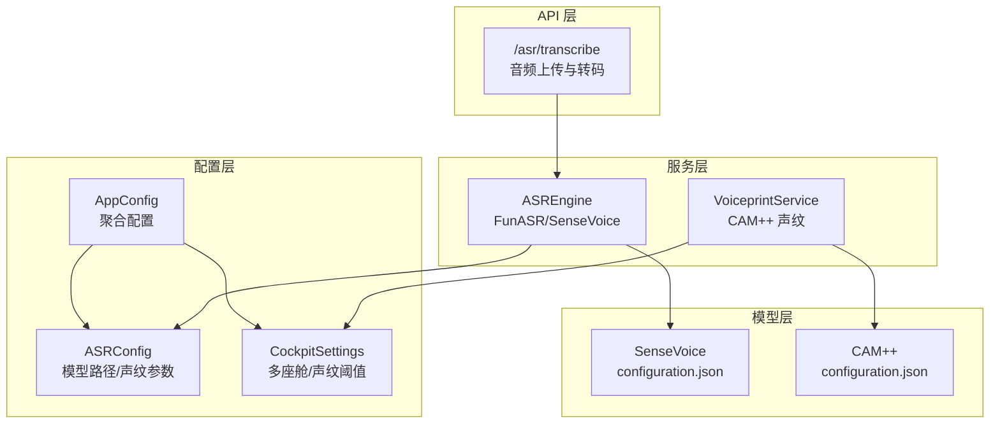
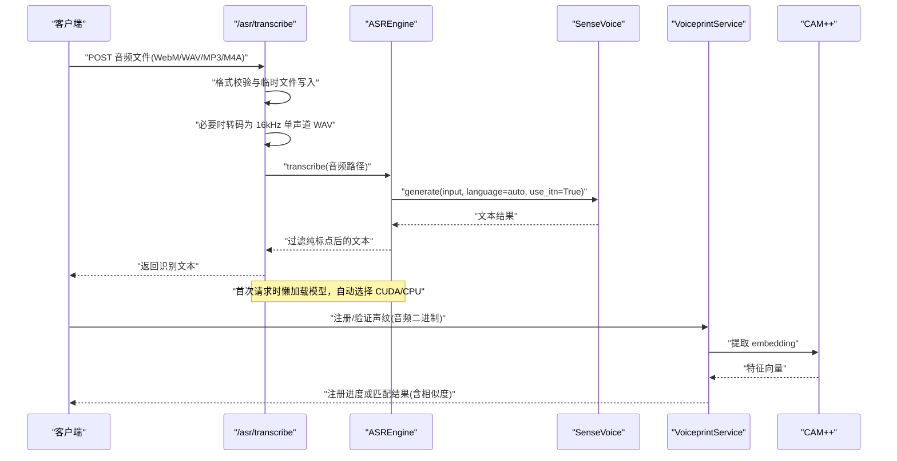
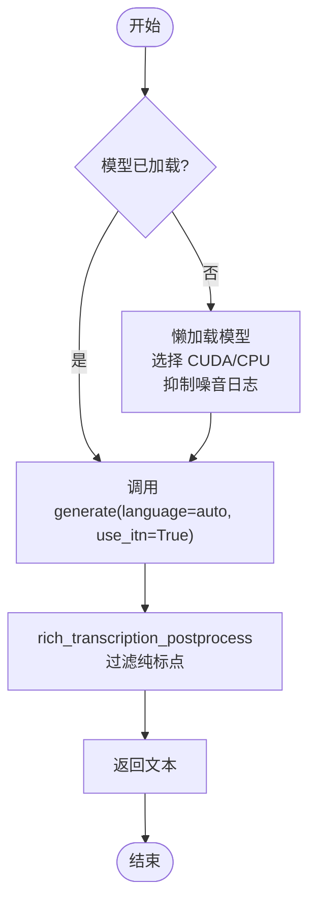
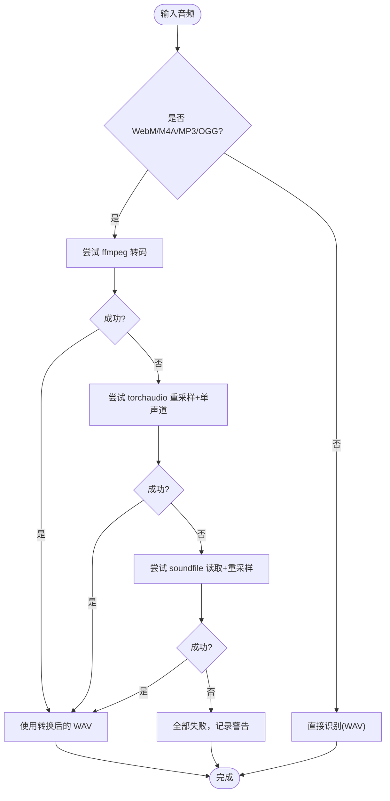
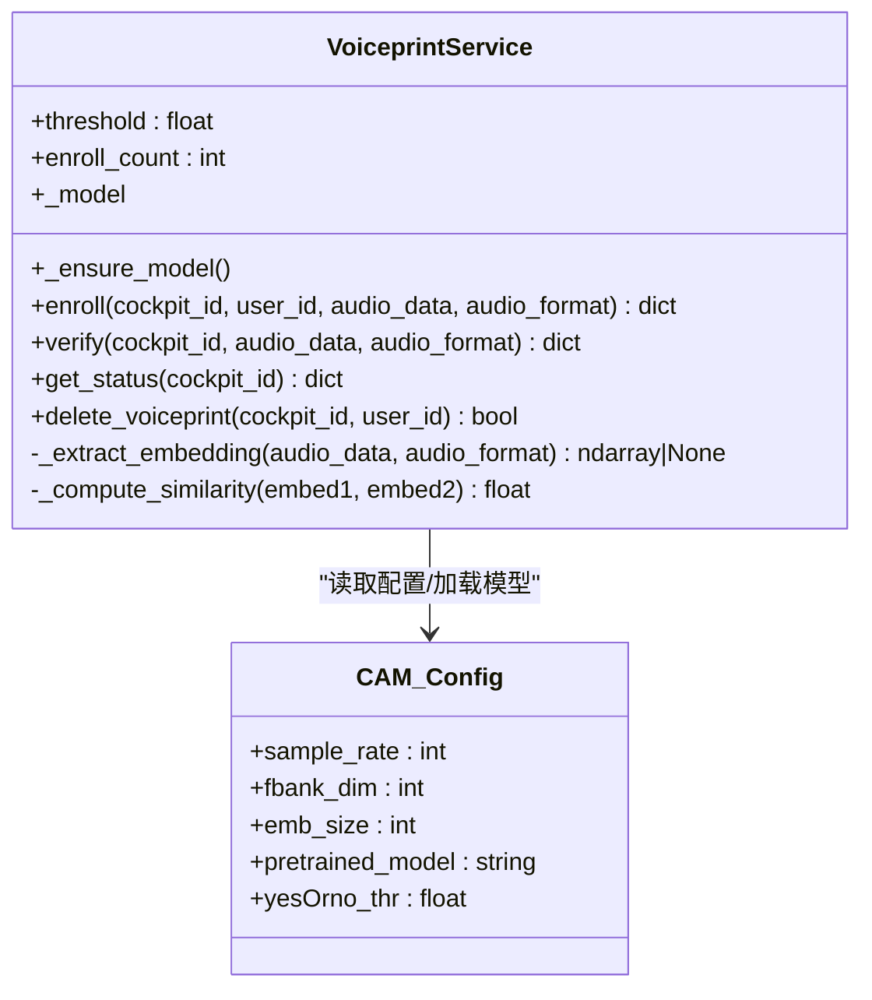
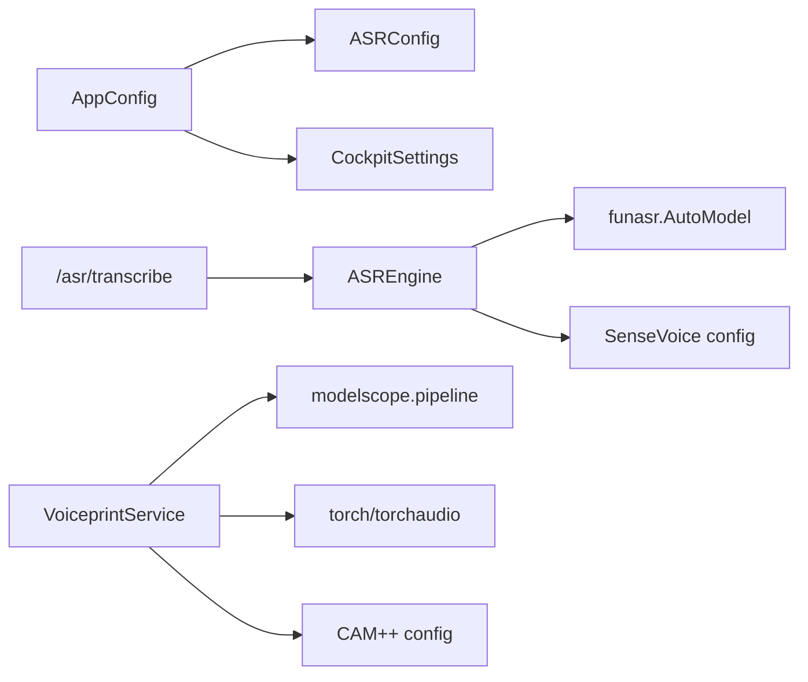

# 语音配置

<cite>
**本文引用的文件**   
- [backend_design/nexus/config/asr.py](file://backend_design/nexus/config/asr.py)
- [backend_design/nexus/config/__init__.py](file://backend_design/nexus/config/__init__.py)
- [backend_design/nexus/config/cockpit.py](file://backend_design/nexus/config/cockpit.py)
- [backend_design/nexus/asr/engine.py](file://backend_design/nexus/asr/engine.py)
- [backend_design/nexus/api/routes/asr.py](file://backend_design/nexus/api/routes/asr.py)
- [backend_design/nexus/core/voiceprint.py](file://backend_design/nexus/core/voiceprint.py)
- [models/asr/sensevoice/configuration.json](file://models/asr/sensevoice/configuration.json)
- [models/sv/cam_plus/configuration.json](file://models/sv/cam_plus/configuration.json)
- [docs/内部开发存档文档/语音技术文档/asr-guide.md](file://docs/内部开发存档文档/语音技术文档/asr-guide.md)
- [docs/内部开发存档文档/语音技术文档/voiceprint-guide.md](file://docs/内部开发存档文档/语音技术文档/voiceprint-guide.md)
</cite>

## 目录
1. [引言](#引言)
2. [项目结构](#项目结构)
3. [核心组件](#核心组件)
4. [架构总览](#架构总览)
5. [详细组件分析](#详细组件分析)
6. [依赖关系分析](#依赖关系分析)
7. [性能与扩展性](#性能与扩展性)
8. [故障排查指南](#故障排查指南)
9. [结论](#结论)
10. [附录：场景化配置模板与调优建议](#附录场景化配置模板与调优建议)

## 引言
本文件面向 NexusCockpit 的语音子系统，系统性说明 ASR（自动语音识别）与声纹识别的配置、部署与运行方式。内容覆盖：
- ASRConfig 的模型路径、采样率、语言代码、VAD 参数、热词等配置项
- SenseVoice 模型的部署参数、GPU 加速与批量处理设置
- 音频格式支持、编码转换与实时流处理要点
- 声纹识别（CAM++）的参数、用户注册流程与相似度阈值
- 语音质量增强、噪声抑制与回声消除的参数调优思路
- 水平扩展、负载均衡与故障恢复机制
- 性能监控、延迟优化与资源使用分析

## 项目结构
语音相关能力主要分布在以下模块：
- 配置中心：聚合各子系统配置，提供全局单例访问
- ASR 引擎：封装 FunASR/SenseVoice 的加载与推理
- API 路由：对外暴露 /asr/transcribe 接口，负责上传音频与格式转换
- 声纹服务：基于 CAM++ 的注册、验证与管理
- 模型元数据：SenseVoice 与 CAM++ 的 configuration.json 描述模型输入输出与关键参数

图表来源 
- [backend_design/nexus/config/__init__.py:84-131](file://backend_design/nexus/config/__init__.py#L84-L131)
- [backend_design/nexus/config/asr.py:15-45](file://backend_design/nexus/config/asr.py#L15-L45)
- [backend_design/nexus/config/cockpit.py:15-35](file://backend_design/nexus/config/cockpit.py#L15-L35)
- [backend_design/nexus/asr/engine.py:78-136](file://backend_design/nexus/asr/engine.py#L78-L136)
- [backend_design/nexus/api/routes/asr.py:48-121](file://backend_design/nexus/api/routes/asr.py#L48-L121)
- [backend_design/nexus/core/voiceprint.py:43-92](file://backend_design/nexus/core/voiceprint.py#L43-L92)
- [models/asr/sensevoice/configuration.json:1-14](file://models/asr/sensevoice/configuration.json#L1-L14)
- [models/sv/cam_plus/configuration.json:1-17](file://models/sv/cam_plus/configuration.json#L1-L17)

章节来源
- [backend_design/nexus/config/__init__.py:84-131](file://backend_design/nexus/config/__init__.py#L84-L131)
- [backend_design/nexus/config/asr.py:15-45](file://backend_design/nexus/config/asr.py#L15-L45)
- [backend_design/nexus/config/cockpit.py:15-35](file://backend_design/nexus/config/cockpit.py#L15-L35)

## 核心组件
- ASRConfig：集中管理离线语音模型路径与声纹基础参数，包括 FunASR/SenseVoice、CosyVoice、CAM++ 的路径以及声纹阈值、注册次数等。
- CockpitSettings：多座舱配置，包含声纹阈值与注册次数等运行时开关。
- ASREngine：封装 FunASR AutoModel 的懒加载、设备选择（CUDA/CPU）、日志降噪与文本后处理。
- VoiceprintService：基于 CAM++ 的声纹特征提取、注册存储、相似度比对与结果判定。
- /asr/transcribe：REST 接口，负责接收多种音频格式、转换为 16kHz 单声道 WAV，并调用 ASREngine 进行识别。

章节来源
- [backend_design/nexus/config/asr.py:15-45](file://backend_design/nexus/config/asr.py#L15-L45)
- [backend_design/nexus/config/cockpit.py:15-35](file://backend_design/nexus/config/cockpit.py#L15-L35)
- [backend_design/nexus/asr/engine.py:78-136](file://backend_design/nexus/asr/engine.py#L78-L136)
- [backend_design/nexus/core/voiceprint.py:43-92](file://backend_design/nexus/core/voiceprint.py#L43-L92)
- [backend_design/nexus/api/routes/asr.py:48-121](file://backend_design/nexus/api/routes/asr.py#L48-L121)

## 架构总览
下图展示从前端上传到 ASR 识别、再到声纹验证的整体流程，以及配置与模型文件的交互关系。

图表来源 
- [backend_design/nexus/api/routes/asr.py:48-121](file://backend_design/nexus/api/routes/asr.py#L48-L121)
- [backend_design/nexus/asr/engine.py:89-136](file://backend_design/nexus/asr/engine.py#L89-L136)
- [backend_design/nexus/core/voiceprint.py:108-190](file://backend_design/nexus/core/voiceprint.py#L108-L190)
- [backend_design/nexus/core/voiceprint.py:192-269](file://backend_design/nexus/core/voiceprint.py#L192-L269)

## 详细组件分析

### ASR 配置与 SenseVoice 部署
- 模型路径与环境变量
  - ASRConfig 通过环境变量 FUNASR_MODEL_PATH 指定 SenseVoice 模型目录，并在初始化时将相对路径解析为绝对路径。
  - 同时维护 CosyVoice 与 CAM++ 的模型路径，便于统一管理与扩展。
- 设备与加载策略
  - ASREngine.load() 在首次调用时懒加载模型，优先选择 cuda:0，否则回退 CPU。
  - 启动时关闭版本检查以提升加载速度，并抑制 FunASR/PyTorch 的噪音日志。
- 识别流程与后处理
  - transcribe() 调用 AutoModel.generate，language="auto"，use_itn=True。
  - 使用 rich_transcription_postprocess 对文本进行规范化，并过滤纯标点结果。
- 模型元数据
  - models/asr/sensevoice/configuration.json 声明框架、任务类型、tokenizer 与 CMVN 文件等。

图表来源 
- [backend_design/nexus/asr/engine.py:89-136](file://backend_design/nexus/asr/engine.py#L89-L136)
- [backend_design/nexus/asr/engine.py:138-173](file://backend_design/nexus/asr/engine.py#L138-L173)
- [models/asr/sensevoice/configuration.json:1-14](file://models/asr/sensevoice/configuration.json#L1-L14)

章节来源
- [backend_design/nexus/config/asr.py:15-45](file://backend_design/nexus/config/asr.py#L15-L45)
- [backend_design/nexus/asr/engine.py:89-136](file://backend_design/nexus/asr/engine.py#L89-L136)
- [backend_design/nexus/asr/engine.py:138-173](file://backend_design/nexus/asr/engine.py#L138-L173)
- [models/asr/sensevoice/configuration.json:1-14](file://models/asr/sensevoice/configuration.json#L1-L14)

### 音频格式支持与编码转换
- 支持的上传格式：WAV、WebM、MP3、M4A（部分由后端转码）。
- 转换策略优先级：
  1) 系统 ffmpeg（功能最全）
  2) imageio_ffmpeg（pip 内置二进制）
  3) torchaudio（支持 WAV/FLAC，不支持 WebM）
  4) soundfile/libsndfile（OGG/FLAC/WAV）
- 目标格式：16kHz、单声道、PCM 16-bit WAV，确保与 SenseVoice 输入一致。

图表来源 
- [backend_design/nexus/api/routes/asr.py:142-247](file://backend_design/nexus/api/routes/asr.py#L142-L247)

章节来源
- [backend_design/nexus/api/routes/asr.py:48-121](file://backend_design/nexus/api/routes/asr.py#L48-L121)
- [backend_design/nexus/api/routes/asr.py:142-247](file://backend_design/nexus/api/routes/asr.py#L142-L247)

### 声纹识别（CAM++）配置与流程
- 配置项
  - CockpitSettings.voiceprint_threshold：相似度阈值（默认 0.7）
  - CockpitSettings.voiceprint_enroll_count：注册所需音频条数（默认 3）
  - ASRConfig.voiceprint_model：声纹模型标识（cam_plus）
- 模型加载
  - 使用 modelscope pipeline 加载 CAM++，若不可用则进入 mock 模式并跳过验证。
- 注册流程
  - 提取 embedding → 保存 .npy 与原始音频 → 统计已注册数量 → 达到阈值标记完成。
- 验证流程
  - 提取当前音频 embedding → 遍历该座舱下所有用户的已注册 embedding → 计算余弦相似度 → 超过阈值即匹配成功。

图表来源 
- [backend_design/nexus/core/voiceprint.py:43-92](file://backend_design/nexus/core/voiceprint.py#L43-L92)
- [backend_design/nexus/core/voiceprint.py:108-190](file://backend_design/nexus/core/voiceprint.py#L108-L190)
- [backend_design/nexus/core/voiceprint.py:192-269](file://backend_design/nexus/core/voiceprint.py#L192-L269)
- [backend_design/nexus/core/voiceprint.py:322-370](file://backend_design/nexus/core/voiceprint.py#L322-L370)
- [models/sv/cam_plus/configuration.json:1-17](file://models/sv/cam_plus/configuration.json#L1-L17)

章节来源
- [backend_design/nexus/config/cockpit.py:15-35](file://backend_design/nexus/config/cockpit.py#L15-L35)
- [backend_design/nexus/core/voiceprint.py:43-92](file://backend_design/nexus/core/voiceprint.py#L43-L92)
- [backend_design/nexus/core/voiceprint.py:108-190](file://backend_design/nexus/core/voiceprint.py#L108-L190)
- [backend_design/nexus/core/voiceprint.py:192-269](file://backend_design/nexus/core/voiceprint.py#L192-L269)
- [models/sv/cam_plus/configuration.json:1-17](file://models/sv/cam_plus/configuration.json#L1-L17)

### 实时流处理与 VAD/热词
- 当前实现以“上传文件”为主，未提供 WebSocket 实时流接口；如需实时流，可在 API 层增加流式接收与分片缓存，再按帧送入 ASR。
- VAD（语音活动检测）与热词未在 ASRConfig 中显式暴露；SenseVoice 的 language=auto 与 use_itn 已在引擎层启用。若需开启 VAD/热词，建议在 AutoModel 构造参数中补充相应字段，并在 ASRConfig 中新增对应配置项。

章节来源
- [backend_design/nexus/asr/engine.py:115-122](file://backend_design/nexus/asr/engine.py#L115-L122)
- [backend_design/nexus/asr/engine.py:154-159](file://backend_design/nexus/asr/engine.py#L154-L159)

## 依赖关系分析
- 配置依赖
  - AppConfig 聚合 ASRConfig 与 CockpitSettings，提供 get_config() 全局单例。
- 运行时依赖
  - ASREngine 依赖 has_cuda() 判断 GPU 可用性，依赖 funasr.AutoModel 进行推理。
  - VoiceprintService 依赖 modelscope.pipeline 与 torch/torchaudio 进行特征提取。
- 模型依赖
  - SenseVoice 的 configuration.json 定义 tokenizer 与 CMVN 文件路径。
  - CAM++ 的 configuration.json 定义 sample_rate、fbank_dim、emb_size 等。

图表来源 
- [backend_design/nexus/config/__init__.py:84-131](file://backend_design/nexus/config/__init__.py#L84-L131)
- [backend_design/nexus/asr/engine.py:89-136](file://backend_design/nexus/asr/engine.py#L89-L136)
- [backend_design/nexus/core/voiceprint.py:62-92](file://backend_design/nexus/core/voiceprint.py#L62-L92)
- [models/asr/sensevoice/configuration.json:1-14](file://models/asr/sensevoice/configuration.json#L1-L14)
- [models/sv/cam_plus/configuration.json:1-17](file://models/sv/cam_plus/configuration.json#L1-L17)

章节来源
- [backend_design/nexus/config/__init__.py:84-131](file://backend_design/nexus/config/__init__.py#L84-L131)
- [backend_design/nexus/asr/engine.py:89-136](file://backend_design/nexus/asr/engine.py#L89-L136)
- [backend_design/nexus/core/voiceprint.py:62-92](file://backend_design/nexus/core/voiceprint.py#L62-L92)

## 性能与扩展性
- 延迟优化
  - 懒加载模型，避免冷启动开销；首次请求才加载。
  - 关闭 FunASR 版本检查，减少启动耗时。
  - 使用 GPU（cuda:0）显著降低推理延迟；无 GPU 时回退 CPU。
- 并发与批处理
  - 当前为单实例单模型，适合低并发；高并发可通过多进程/多实例部署，结合网关负载均衡。
  - 若需批量处理，可在 ASREngine 中引入队列与批调度，注意显存占用与超时控制。
- 资源使用
  - 模型加载期间抑制噪音日志，避免 I/O 阻塞影响主线程。
  - 音频转码采用多策略降级，保证在不同环境下的可用性。
- 可观测性
  - 建议在 API 层增加请求耗时、转码耗时、推理耗时的埋点，接入 Prometheus/Grafana 监控。

[本节为通用指导，不直接分析具体文件]

## 故障排查指南
- ASR 模型未加载
  - 现象：/asr/status 返回 loaded=false，或 /asr/transcribe 提示“模型未加载”。
  - 排查：确认 FUNASR_MODEL_PATH 指向正确目录；检查 has_cuda() 返回值；查看日志中的加载错误信息。
- 音频格式不支持
  - 现象：转码失败，无法生成 16kHz 单声道 WAV。
  - 排查：安装 ffmpeg 或 imageio_ffmpeg；确认 torchaudio/soundfile 可用；检查输入文件是否损坏。
- 声纹识别不可用
  - 现象：注册/验证返回“模型未加载”或“mock 模式”。
  - 排查：确认 CAM++ 模型路径存在；安装 modelscope、torch、torchaudio；查看日志中的 ImportError 或异常堆栈。
- 识别结果为空或仅标点
  - 现象：返回空字符串或纯标点被过滤。
  - 排查：检查录音时长与清晰度；确认 postprocess 逻辑；适当调整输入音量与静音段。

章节来源
- [backend_design/nexus/asr/engine.py:124-136](file://backend_design/nexus/asr/engine.py#L124-L136)
- [backend_design/nexus/asr/engine.py:138-173](file://backend_design/nexus/asr/engine.py#L138-L173)
- [backend_design/nexus/api/routes/asr.py:142-247](file://backend_design/nexus/api/routes/asr.py#L142-L247)
- [backend_design/nexus/core/voiceprint.py:86-92](file://backend_design/nexus/core/voiceprint.py#L86-L92)

## 结论
NexusCockpit 的语音子系统以 ASRConfig 与 CockpitSettings 为核心配置入口，ASREngine 与 VoiceprintService 分别承担识别与声纹能力。通过懒加载、设备自适应与多策略转码，系统在车载环境下具备较好的可用性与稳定性。后续可按需扩展 VAD、热词、流式接口与批处理能力，并结合监控指标持续优化延迟与吞吐。

[本节为总结性内容，不直接分析具体文件]

## 附录：场景化配置模板与调优建议
- 车载低延迟场景
  - 启用 GPU（cuda:0），关闭版本检查，保持 language=auto 与 use_itn=True。
  - 推荐输入格式：16kHz 单声道 WAV；如前端为 WebM，确保服务端 ffmpeg 可用。
- 隐私敏感场景（本地部署）
  - 使用本地 SenseVoice 与 CAM++ 模型，避免云端依赖。
  - 合理设置 VOICEPRINT_THRESHOLD 与 VOICEPRINT_ENROLL_COUNT，平衡误识率与用户体验。
- 高并发场景
  - 多实例部署 + 网关负载均衡；为每个实例独立模型加载，避免共享状态冲突。
  - 引入请求队列与超时熔断，防止雪崩。
- 实时交互场景
  - 在 API 层增加 WebSocket 流式接口，按帧缓冲与 VAD 切分，逐步送入 ASR。
  - 针对网络抖动设计重试与丢帧策略，保障首字延迟。

章节来源
- [docs/内部开发存档文档/语音技术文档/asr-guide.md:1-64](file://docs/内部开发存档文档/语音技术文档/asr-guide.md#L1-L64)
- [docs/内部开发存档文档/语音技术文档/voiceprint-guide.md:1-64](file://docs/内部开发存档文档/语音技术文档/voiceprint-guide.md#L1-L64)