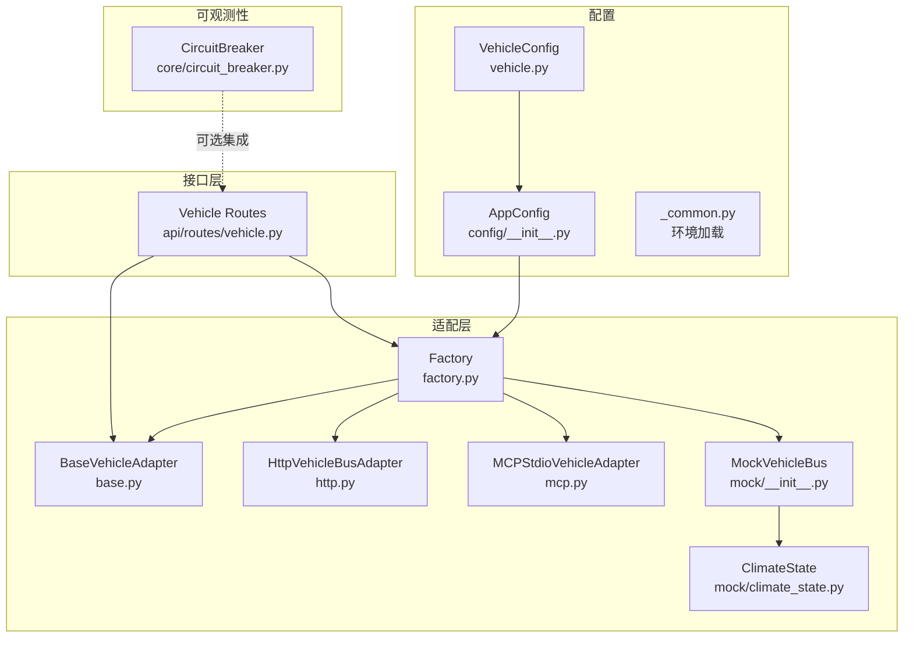
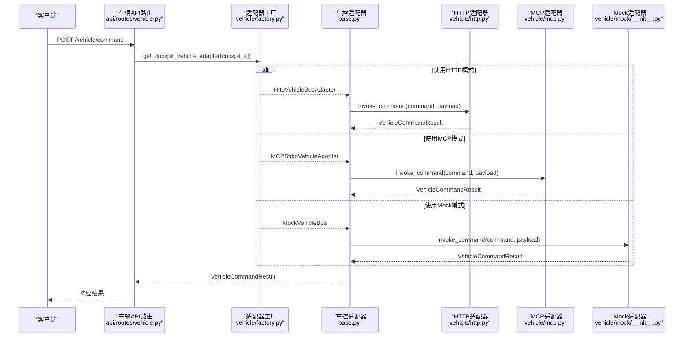
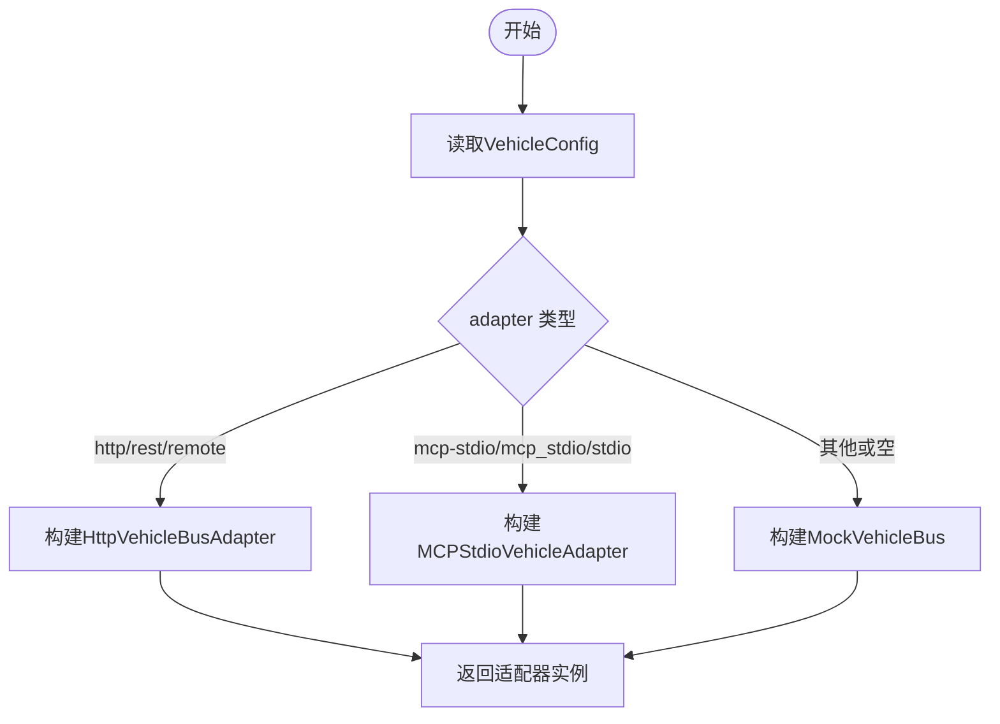
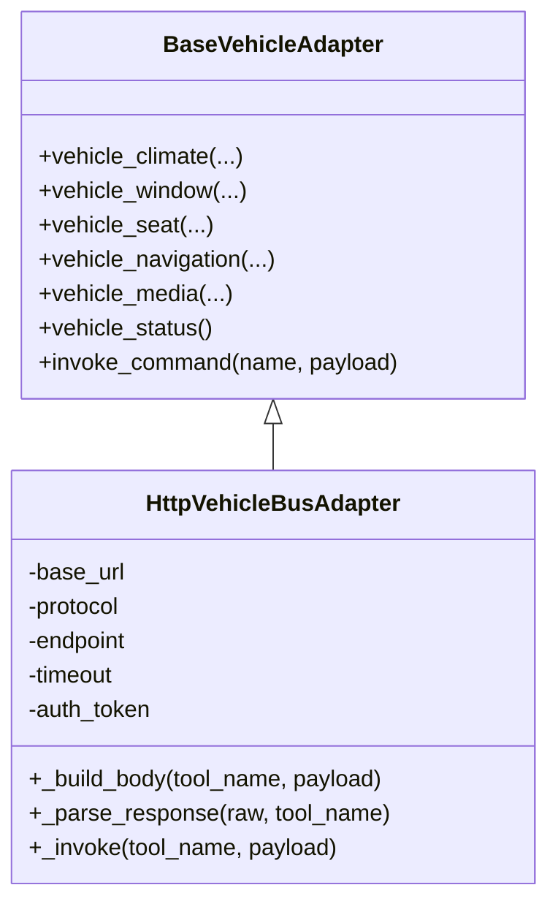
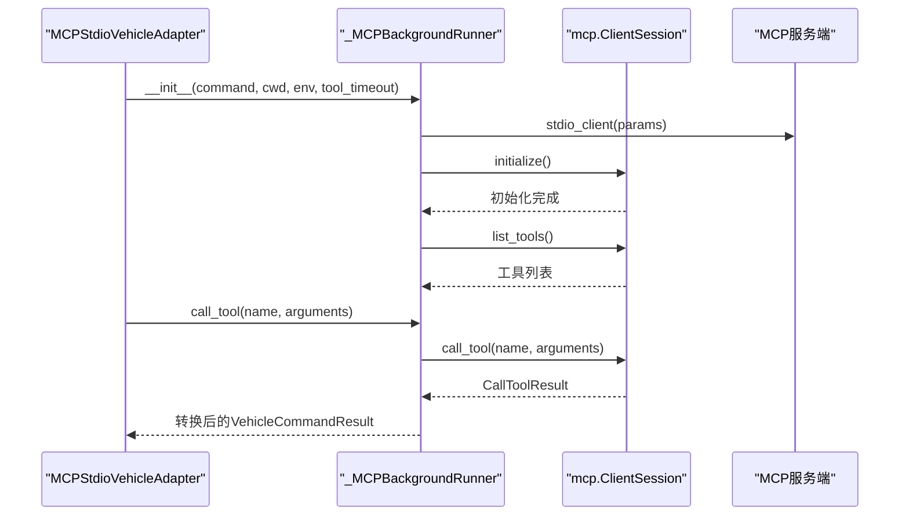
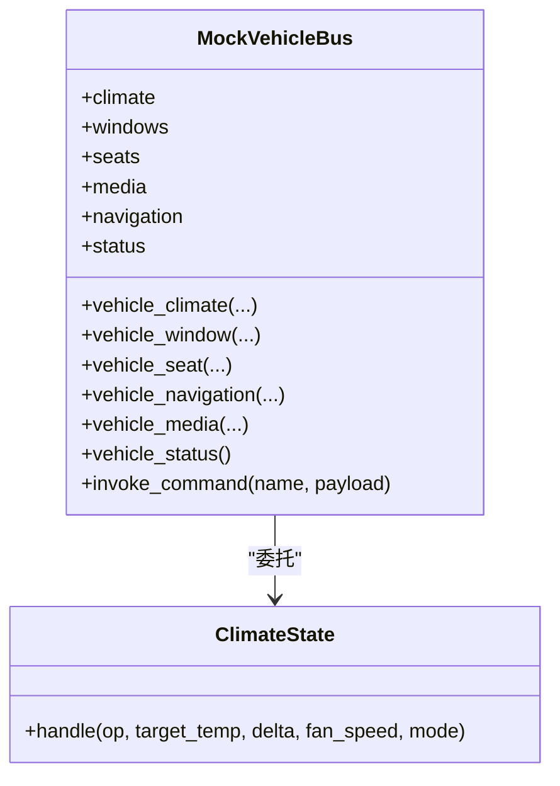
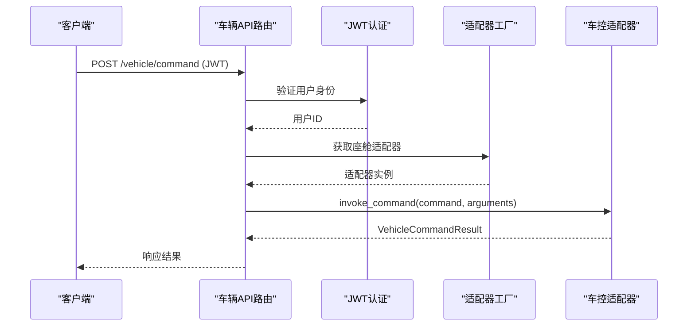
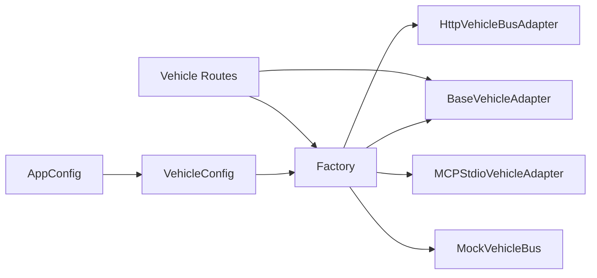

# 车控配置

<cite>
**本文引用的文件**   
- [backend_design/nexus/config/vehicle.py](file://backend_design/nexus/config/vehicle.py)
- [backend_design/nexus/config/__init__.py](file://backend_design/nexus/config/__init__.py)
- [backend_design/nexus/config/_common.py](file://backend_design/nexus/config/_common.py)
- [backend_design/nexus/vehicle/base.py](file://backend_design/nexus/vehicle/base.py)
- [backend_design/nexus/vehicle/factory.py](file://backend_design/nexus/vehicle/factory.py)
- [backend_design/nexus/vehicle/http.py](file://backend_design/nexus/vehicle/http.py)
- [backend_design/nexus/vehicle/mcp.py](file://backend_design/nexus/vehicle/mcp.py)
- [backend_design/nexus/vehicle/mock/__init__.py](file://backend_design/nexus/vehicle/mock/__init__.py)
- [backend_design/nexus/vehicle/mock/climate_state.py](file://backend_design/nexus/vehicle/mock/climate_state.py)
- [backend_design/nexus/api/routes/vehicle.py](file://backend_design/nexus/api/routes/vehicle.py)
- [backend_design/nexus/core/circuit_breaker.py](file://backend_design/nexus/core/circuit_breaker.py)
</cite>

## 目录
1. [简介](#简介)
2. [项目结构](#项目结构)
3. [核心组件](#核心组件)
4. [架构总览](#架构总览)
5. [详细组件分析](#详细组件分析)
6. [依赖关系分析](#依赖关系分析)
7. [性能与可观测性](#性能与可观测性)
8. [故障排查指南](#故障排查指南)
9. [结论](#结论)
10. [附录：配置模板与扩展指南](#附录配置模板与扩展指南)

## 简介
本文件为 NexusCockpit 车控配置的权威文档，覆盖 VehicleConfig 的三模式支持（mock、http、mcp），HTTP 模式的 API 地址、认证方式、超时设置等；MCP 协议的服务发现、消息路由、状态同步机制；设备管理能力（注册、监控、命令下发）；安全验证、权限控制与审计日志；不同车型的适配模板与扩展方法；以及容错机制、重试策略、降级方案与性能优化建议。

## 项目结构
车控相关代码集中在 backend_design/nexus 下，关键路径如下：
- 配置层：nexus/config/vehicle.py、nexus/config/__init__.py、nexus/config/_common.py
- 适配层：nexus/vehicle/base.py、factory.py、http.py、mcp.py、mock/*
- 接口层：nexus/api/routes/vehicle.py
- 可观测性与熔断：nexus/core/circuit_breaker.py

图表来源
- [backend_design/nexus/config/vehicle.py:15-49](file://backend_design/nexus/config/vehicle.py#L15-L49)
- [backend_design/nexus/config/__init__.py:84-132](file://backend_design/nexus/config/__init__.py#L84-L132)
- [backend_design/nexus/config/_common.py:39-53](file://backend_design/nexus/config/_common.py#L39-L53)
- [backend_design/nexus/vehicle/base.py:35-92](file://backend_design/nexus/vehicle/base.py#L35-L92)
- [backend_design/nexus/vehicle/factory.py:86-123](file://backend_design/nexus/vehicle/factory.py#L86-L123)
- [backend_design/nexus/vehicle/http.py:23-40](file://backend_design/nexus/vehicle/http.py#L23-L40)
- [backend_design/nexus/vehicle/mcp.py:167-197](file://backend_design/nexus/vehicle/mcp.py#L167-L197)
- [backend_design/nexus/vehicle/mock/__init__.py:39-90](file://backend_design/nexus/vehicle/mock/__init__.py#L39-L90)
- [backend_design/nexus/api/routes/vehicle.py:32-46](file://backend_design/nexus/api/routes/vehicle.py#L32-46)
- [backend_design/nexus/core/circuit_breaker.py:48-74](file://backend_design/nexus/core/circuit_breaker.py#L48-74)

章节来源
- [backend_design/nexus/config/vehicle.py:15-49](file://backend_design/nexus/config/vehicle.py#L15-L49)
- [backend_design/nexus/config/__init__.py:84-132](file://backend_design/nexus/config/__init__.py#L84-L132)
- [backend_design/nexus/vehicle/factory.py:86-123](file://backend_design/nexus/vehicle/factory.py#L86-L123)
- [backend_design/nexus/api/routes/vehicle.py:32-46](file://backend_design/nexus/api/routes/vehicle.py#L32-46)

## 核心组件
- VehicleConfig：定义车控总线适配器类型与通信参数（mock/http/mcp）。
- BaseVehicleAdapter：统一抽象接口，所有适配器必须实现空调、车窗、座椅、导航、媒体、状态查询与通用命令调用。
- Factory：根据环境变量选择并创建具体适配器实例，支持多座舱隔离。
- HttpVehicleBusAdapter：通过 HTTP/REST 或 JSON-RPC 与车机服务通信，支持超时与 Bearer Token 认证。
- MCPStdioVehicleAdapter：通过 MCP stdio 与外部 MCP 服务通信，自动发现工具列表，异步后台事件循环桥接同步调用。
- MockVehicleBus：开发测试用模拟实现，按子系统拆分状态管理，提供别名映射与统一入口。

章节来源
- [backend_design/nexus/config/vehicle.py:15-49](file://backend_design/nexus/config/vehicle.py#L15-L49)
- [backend_design/nexus/vehicle/base.py:35-92](file://backend_design/nexus/vehicle/base.py#L35-L92)
- [backend_design/nexus/vehicle/factory.py:38-123](file://backend_design/nexus/vehicle/factory.py#L38-L123)
- [backend_design/nexus/vehicle/http.py:23-40](file://backend_design/nexus/vehicle/http.py#L23-L40)
- [backend_design/nexus/vehicle/mcp.py:167-197](file://backend_design/nexus/vehicle/mcp.py#L167-L197)
- [backend_design/nexus/vehicle/mock/__init__.py:39-90](file://backend_design/nexus/vehicle/mock/__init__.py#L39-L90)

## 架构总览
车控请求从 API 路由进入，经工厂获取对应座舱的适配器实例，再调用具体实现（Mock/HTTP/MCP）。HTTP 模式通过 REST/JSON-RPC 调用车机服务；MCP 模式通过 stdio 启动子进程并与 MCP SDK 交互；Mock 模式在内存中维护各子系统状态。

图表来源
- [backend_design/nexus/api/routes/vehicle.py:48-85](file://backend_design/nexus/api/routes/vehicle.py#L48-85)
- [backend_design/nexus/vehicle/factory.py:55-84](file://backend_design/nexus/vehicle/factory.py#L55-84)
- [backend_design/nexus/vehicle/base.py:89-92](file://backend_design/nexus/vehicle/base.py#L89-L92)
- [backend_design/nexus/vehicle/http.py:65-68](file://backend_design/nexus/vehicle/http.py#L65-L68)
- [backend_design/nexus/vehicle/mcp.py:222-224](file://backend_design/nexus/vehicle/mcp.py#L222-L224)
- [backend_design/nexus/vehicle/mock/__init__.py:194-220](file://backend_design/nexus/vehicle/mock/__init__.py#L194-L220)

## 详细组件分析

### VehicleConfig 配置项说明
- adapter：适配器类型，取值 mock、http、rest、remote、mcp-stdio、mcp_stdio、stdio。
- api_base_url：HTTP 模式下的车机 API 基地址。
- api_protocol：HTTP 协议类型，支持 rest 与 jsonrpc。
- api_endpoint：HTTP 接口路径，默认 /vehicle/tools/invoke。
- api_timeout：HTTP 调用超时时间（秒）。
- api_token：HTTP 认证 Token（Bearer）。
- mcp_command：MCP 子进程启动命令（可为字符串或 JSON 数组）。
- mcp_args：MCP 启动参数（可为字符串或 JSON 数组）。
- mcp_workdir：MCP 工作目录。
- mcp_validate_tools：是否校验 MCP 工具列表。

章节来源
- [backend_design/nexus/config/vehicle.py:15-49](file://backend_design/nexus/config/vehicle.py#L15-L49)
- [backend_design/nexus/config/_common.py:39-53](file://backend_design/nexus/config/_common.py#L39-L53)

### 适配器工厂与多座舱隔离
- build_vehicle_adapter：全局单例，避免重复初始化。
- get_cockpit_vehicle_adapter：按座舱 ID 返回独立 Mock 实例；HTTP/MCP 复用无状态单例。
- _create_adapter：根据配置选择具体适配器，解析 MCP 命令与参数。

图表来源
- [backend_design/nexus/vehicle/factory.py:86-123](file://backend_design/nexus/vehicle/factory.py#L86-L123)
- [backend_design/nexus/vehicle/factory.py:125-147](file://backend_design/nexus/vehicle/factory.py#L125-L147)

章节来源
- [backend_design/nexus/vehicle/factory.py:38-123](file://backend_design/nexus/vehicle/factory.py#L38-L123)

### HTTP 模式详解
- 请求体构造：rest 模式下为 {tool, arguments}；jsonrpc 模式下为 {jsonrpc, id, method, params}。
- 认证：Authorization: Bearer <token>。
- 超时：urllib.request.urlopen(timeout)。
- 错误处理：HTTPError、URLError 与通用异常均转换为 VehicleCommandResult。

图表来源
- [backend_design/nexus/vehicle/base.py:35-92](file://backend_design/nexus/vehicle/base.py#L35-L92)
- [backend_design/nexus/vehicle/http.py:23-40](file://backend_design/nexus/vehicle/http.py#L23-L40)
- [backend_design/nexus/vehicle/http.py:94-127](file://backend_design/nexus/vehicle/http.py#L94-L127)

章节来源
- [backend_design/nexus/vehicle/http.py:23-40](file://backend_design/nexus/vehicle/http.py#L23-L40)
- [backend_design/nexus/vehicle/http.py:69-93](file://backend_design/nexus/vehicle/http.py#L69-L93)
- [backend_design/nexus/vehicle/http.py:94-127](file://backend_design/nexus/vehicle/http.py#L94-L127)

### MCP 模式详解
- 后台运行器：在独立线程中运行 asyncio 事件循环，管理 stdio_client 与 ClientSession 生命周期。
- 服务发现：initialize 后 list_tools 获取可用工具集合。
- 消息路由：call_tool 将同步调用桥接到异步 session.call_tool。
- 状态同步：available_tools 暴露当前可用工具集，validate_tools 控制是否启用。

图表来源
- [backend_design/nexus/vehicle/mcp.py:25-81](file://backend_design/nexus/vehicle/mcp.py#L25-81)
- [backend_design/nexus/vehicle/mcp.py:96-136](file://backend_design/nexus/vehicle/mcp.py#L96-L136)
- [backend_design/nexus/vehicle/mcp.py:137-151](file://backend_design/nexus/vehicle/mcp.py#L137-L151)
- [backend_design/nexus/vehicle/mcp.py:225-238](file://backend_design/nexus/vehicle/mcp.py#L225-L238)

章节来源
- [backend_design/nexus/vehicle/mcp.py:167-197](file://backend_design/nexus/vehicle/mcp.py#L167-L197)
- [backend_design/nexus/vehicle/mcp.py:96-136](file://backend_design/nexus/vehicle/mcp.py#L96-L136)
- [backend_design/nexus/vehicle/mcp.py:225-238](file://backend_design/nexus/vehicle/mcp.py#L225-L238)

### Mock 模式与设备管理能力
- 门面模式：MockVehicleBus 对外保持与 BaseVehicleAdapter 一致的接口，内部委托到各子系统状态模块。
- 设备状态：空调、车窗、座椅、导航、媒体、车况各自维护状态字典。
- 命令别名：COMMAND_ALIASES 支持多种命令名映射到统一方法。
- 位置更新：支持浏览器 GPS 坐标更新与 IP 降级定位。

图表来源
- [backend_design/nexus/vehicle/mock/__init__.py:39-90](file://backend_design/nexus/vehicle/mock/__init__.py#L39-L90)
- [backend_design/nexus/vehicle/mock/climate_state.py:22-40](file://backend_design/nexus/vehicle/mock/climate_state.py#L22-L40)

章节来源
- [backend_design/nexus/vehicle/mock/__init__.py:39-90](file://backend_design/nexus/vehicle/mock/__init__.py#L39-L90)
- [backend_design/nexus/vehicle/mock/climate_state.py:41-143](file://backend_design/nexus/vehicle/mock/climate_state.py#L41-L143)
- [backend_design/nexus/api/routes/vehicle.py:117-152](file://backend_design/nexus/api/routes/vehicle.py#L117-L152)

### API 路由与安全验证
- /vehicle/command：直接执行车控命令，需要 JWT 认证，支持多座舱隔离。
- /vehicle/status：获取车辆当前状态，需要 JWT 认证。
- /vehicle/location：更新当前位置（GPS 坐标），用于后续逆地理编码。

图表来源
- [backend_design/nexus/api/routes/vehicle.py:48-85](file://backend_design/nexus/api/routes/vehicle.py#L48-85)
- [backend_design/nexus/api/routes/vehicle.py:88-108](file://backend_design/nexus/api/routes/vehicle.py#L88-108)
- [backend_design/nexus/api/routes/vehicle.py:117-152](file://backend_design/nexus/api/routes/vehicle.py#L117-L152)

章节来源
- [backend_design/nexus/api/routes/vehicle.py:48-85](file://backend_design/nexus/api/routes/vehicle.py#L48-85)
- [backend_design/nexus/api/routes/vehicle.py:88-108](file://backend_design/nexus/api/routes/vehicle.py#L88-108)

## 依赖关系分析
- 配置依赖：AppConfig 聚合 VehicleConfig，_common.py 负责环境文件加载。
- 适配器依赖：Factory 依赖 VehicleConfig 与 logger，动态导入具体适配器。
- HTTP/MCP 依赖：分别依赖 urllib 与 mcp SDK，通过 BaseVehicleAdapter 统一接口。
- API 路由依赖：依赖 auth、tenant_context、metrics 与 factory。

图表来源
- [backend_design/nexus/config/__init__.py:84-132](file://backend_design/nexus/config/__init__.py#L84-L132)
- [backend_design/nexus/vehicle/factory.py:86-123](file://backend_design/nexus/vehicle/factory.py#L86-L123)
- [backend_design/nexus/api/routes/vehicle.py:32-46](file://backend_design/nexus/api/routes/vehicle.py#L32-46)

章节来源
- [backend_design/nexus/config/__init__.py:84-132](file://backend_design/nexus/config/__init__.py#L84-L132)
- [backend_design/nexus/vehicle/factory.py:86-123](file://backend_design/nexus/vehicle/factory.py#L86-L123)

## 性能与可观测性
- 指标采集：SKILL_EXECUTIONS 记录指令执行成功/失败计数。
- 熔断器：CircuitBreaker 支持 CLOSED/OPEN/HALF_OPEN 三态切换，适用于 LLM、Milvus、车控服务等场景。
- 超时与重试：HTTP 模式通过 timeout 控制；MCP 模式通过 tool_timeout 控制；可在上层封装重试逻辑。
- 资源优化：Mock 模式内存状态隔离；HTTP/MCP 复用单例减少初始化开销。

章节来源
- [backend_design/nexus/api/routes/vehicle.py:78](file://backend_design/nexus/api/routes/vehicle.py#L78)
- [backend_design/nexus/core/circuit_breaker.py:48-74](file://backend_design/nexus/core/circuit_breaker.py#L48-74)
- [backend_design/nexus/vehicle/http.py:32](file://backend_design/nexus/vehicle/http.py#L32)
- [backend_design/nexus/vehicle/mcp.py:183](file://backend_design/nexus/vehicle/mcp.py#L183)

## 故障排查指南
- HTTP 连接失败：检查 api_base_url、网络连通性与防火墙规则；查看 URLError 原因。
- HTTP 认证失败：确认 api_token 是否正确，Authorization 头是否携带 Bearer。
- MCP 初始化超时：检查 mcp_command 与 mcp_args 是否正确，子进程能否正常启动；查看初始化超时日志。
- 工具未暴露：MCP server 未列出所需工具，检查 validate_tools 与工具命名。
- 命令执行失败：查看 VehicleCommandResult.error 字段，定位具体错误码（如 invalid_op、tool_not_exposed）。

章节来源
- [backend_design/nexus/vehicle/http.py:86-93](file://backend_design/nexus/vehicle/http.py#L86-L93)
- [backend_design/nexus/vehicle/mcp.py:77-81](file://backend_design/nexus/vehicle/mcp.py#L77-L81)
- [backend_design/nexus/vehicle/mcp.py:225-238](file://backend_design/nexus/vehicle/mcp.py#L225-L238)
- [backend_design/nexus/vehicle/mock/climate_state.py:60-66](file://backend_design/nexus/vehicle/mock/climate_state.py#L60-66)

## 结论
NexusCockpit 车控系统通过统一的 BaseVehicleAdapter 抽象与 Factory 动态装配，实现了 mock/http/mcp 三种通信模式的灵活切换。HTTP 模式提供 REST/JSON-RPC 支持与认证超时配置；MCP 模式通过 stdio 与外部服务解耦，具备工具发现与异步桥接能力；Mock 模式便于开发与测试。结合 JWT 认证、指标采集与熔断器，系统具备良好的安全性、可观测性与容错能力。

## 附录：配置模板与扩展指南

### 环境变量模板（示例）
- 适配器类型：VEHICLE_ADAPTER=mock|http|mcp-stdio
- HTTP 模式：
  - VEHICLE_API_BASE_URL=http://your-vehicle-api
  - VEHICLE_API_PROTOCOL=rest|jsonrpc
  - VEHICLE_API_ENDPOINT=/vehicle/tools/invoke
  - VEHICLE_API_TIMEOUT=5.0
  - VEHICLE_API_TOKEN=your-bearer-token
- MCP 模式：
  - VEHICLE_MCP_COMMAND=["python","vehicle_mcp_server.py"] 或 "python vehicle_mcp_server.py"
  - VEHICLE_MCP_ARGS="--port 8080 --debug" 或 ["--port","8080","--debug"]
  - VEHICLE_MCP_WORKDIR=/path/to/workdir
  - VEHICLE_MCP_VALIDATE_TOOLS=true

章节来源
- [backend_design/nexus/config/vehicle.py:24-47](file://backend_design/nexus/config/vehicle.py#L24-L47)
- [backend_design/nexus/vehicle/factory.py:125-147](file://backend_design/nexus/vehicle/factory.py#L125-L147)

### 车型适配扩展步骤
- 新增适配器：继承 BaseVehicleAdapter，实现所有抽象方法；在 Factory._create_adapter 中添加分支。
- 新增命令别名：在 MockVehicleBus.COMMAND_ALIASES 中增加映射。
- 新增状态模型：在 vehicle/mock 下新增状态模块，并在 MockVehicleBus 中组合。
- 安全与审计：在 API 路由层集成鉴权中间件与审计日志；对敏感操作进行白名单校验。

章节来源
- [backend_design/nexus/vehicle/base.py:35-92](file://backend_design/nexus/vehicle/base.py#L35-L92)
- [backend_design/nexus/vehicle/factory.py:86-123](file://backend_design/nexus/vehicle/factory.py#L86-L123)
- [backend_design/nexus/vehicle/mock/__init__.py:46-80](file://backend_design/nexus/vehicle/mock/__init__.py#L46-80)

### 容错与降级策略
- 熔断器：对车控服务连续失败触发 OPEN，等待 recovery_period 后 HALF_OPEN 试探恢复。
- 降级：HTTP/MCP 不可用时回退到 Mock 模式（可通过上层逻辑判断）。
- 重试：在 API 路由层对特定错误码实施指数退避重试。

章节来源
- [backend_design/nexus/core/circuit_breaker.py:48-74](file://backend_design/nexus/core/circuit_breaker.py#L48-74)
- [backend_design/nexus/api/routes/vehicle.py:70-78](file://backend_design/nexus/api/routes/vehicle.py#L70-78)