# 配置管理系统

<cite>
**本文引用的文件**   
- [backend_design/nexus/config/__init__.py](file://backend_design/nexus/config/__init__.py)
- [backend_design/nexus/config/_common.py](file://backend_design/nexus/config/_common.py)
- [backend_design/nexus/config/server.py](file://backend_design/nexus/config/server.py)
- [backend_design/nexus/config/database.py](file://backend_design/nexus/config/database.py)
- [backend_design/nexus/config/llm.py](file://backend_design/nexus/config/llm.py)
- [backend_design/nexus/config/asr.py](file://backend_design/nexus/config/asr.py)
- [backend_design/nexus/config/cache.py](file://backend_design/nexus/config/cache.py)
- [backend_design/nexus/config/observability.py](file://backend_design/nexus/config/observability.py)
- [backend_design/nexus/config/providers.py](file://backend_design/nexus/config/providers.py)
- [backend_design/nexus/config/data.py](file://backend_design/nexus/config/data.py)
- [backend_design/nexus/config/cockpit.py](file://backend_design/nexus/config/cockpit.py)
- [backend_design/nexus/config/vehicle.py](file://backend_design/nexus/config/vehicle.py)
- [backend_design/nexus/api/routes/settings.py](file://backend_design/nexus/api/routes/settings.py)
</cite>

## 目录
1. [简介](#简介)
2. [项目结构](#项目结构)
3. [核心组件](#核心组件)
4. [架构总览](#架构总览)
5. [详细组件分析](#详细组件分析)
6. [依赖关系分析](#依赖关系分析)
7. [性能考虑](#性能考虑)
8. [故障排查指南](#故障排查指南)
9. [结论](#结论)
10. [附录](#附录)

## 简介
本文件为 NexusCockpit 配置管理系统的完整技术文档，面向开发者与运维人员。内容涵盖：
- 配置文件层次结构与加载优先级：.env.local > .env > 环境变量 > 默认值
- 各配置模块职责与字段说明（服务器、数据库、LLM、ASR/TTS、缓存、可观测性、车控、数据与记忆、多座舱与第三方服务等）
- 配置验证机制与类型安全保证（基于 Pydantic Settings）
- 动态配置更新与环境切换最佳实践
- 配置模板与实际使用示例
- 热重载机制与调试技巧
- 常见问题定位与排障方法

## 项目结构
NexusCockpit 的配置中心位于 backend_design/nexus/config 包内，采用“按子系统拆分 + 统一聚合”的设计：
- _common.py：公共路径常量与环境文件加载策略
- __init__.py：聚合所有子配置类，提供全局单例与快捷访问函数
- 各子系统独立文件：server.py、database.py、llm.py、asr.py、cache.py、observability.py、providers.py、data.py、cockpit.py、vehicle.py

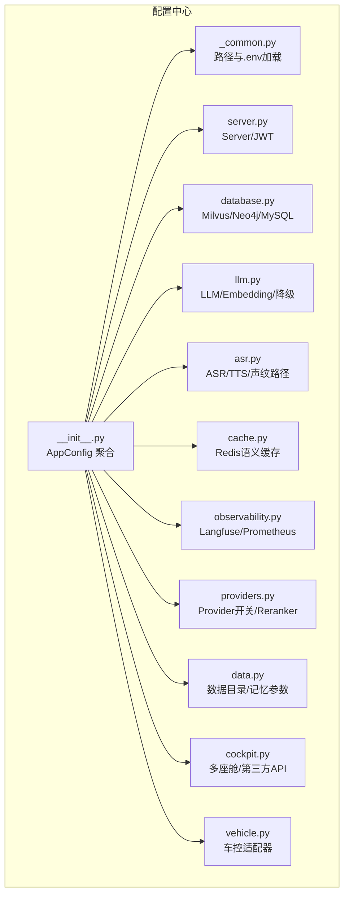

图表来源
- [backend_design/nexus/config/__init__.py:84-132](file://backend_design/nexus/config/__init__.py#L84-L132)
- [backend_design/nexus/config/_common.py:39-53](file://backend_design/nexus/config/_common.py#L39-L53)

章节来源
- [backend_design/nexus/config/__init__.py:1-167](file://backend_design/nexus/config/__init__.py#L1-L167)
- [backend_design/nexus/config/_common.py:1-75](file://backend_design/nexus/config/_common.py#L1-L75)

## 核心组件
- AppConfig：全局应用配置聚合器，包含所有子系统配置实例，并通过 get_config() 暴露线程安全的单例访问。
- 子配置类：每个子系统均继承自 BaseSettings，通过 validation_alias 绑定环境变量名，并设置 model_config 指定 env_file 与 extra="ignore" 以忽略未知变量。
- 路径工具：_resolve_path() 将相对路径解析为基于项目根目录的绝对路径，确保跨工作目录启动的一致性。
- 环境文件加载：优先 .env.local，不存在则回退到 .env；同时显式 load_dotenv(override=True) 避免被空值覆盖。

章节来源
- [backend_design/nexus/config/__init__.py:84-132](file://backend_design/nexus/config/__init__.py#L84-L132)
- [backend_design/nexus/config/_common.py:39-53](file://backend_design/nexus/config/_common.py#L39-L53)
- [backend_design/nexus/config/_common.py:56-75](file://backend_design/nexus/config/_common.py#L56-L75)

## 架构总览
配置加载与访问流程如下：
- 启动时导入 config 包，触发 _common.py 的环境文件选择与加载
- 构建 AppConfig，依次初始化各子配置类，读取对应环境变量或 .env 值
- 通过 get_config() 获取全局单例，业务模块按需访问子配置

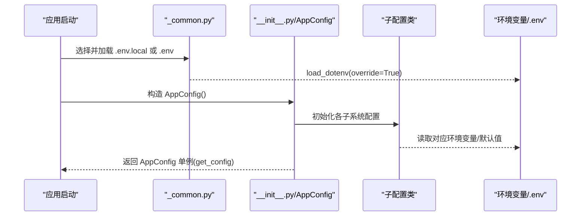

图表来源
- [backend_design/nexus/config/_common.py:39-53](file://backend_design/nexus/config/_common.py#L39-L53)
- [backend_design/nexus/config/__init__.py:144-151](file://backend_design/nexus/config/__init__.py#L144-L151)

## 详细组件分析

### 服务器与认证配置（ServerConfig、JWTConfig）
- 职责：FastAPI 监听地址与端口、调试模式、日志级别、CORS 来源、会话锁上限、SSE 心跳间隔；JWT 密钥、算法、过期时间、RBAC 默认角色与管理员账号密码。
- 关键特性：
  - cors_origins_list 属性将逗号分隔字符串转为列表，支持通配符 "*"
  - JWT 相关字段用于鉴权与会话管理

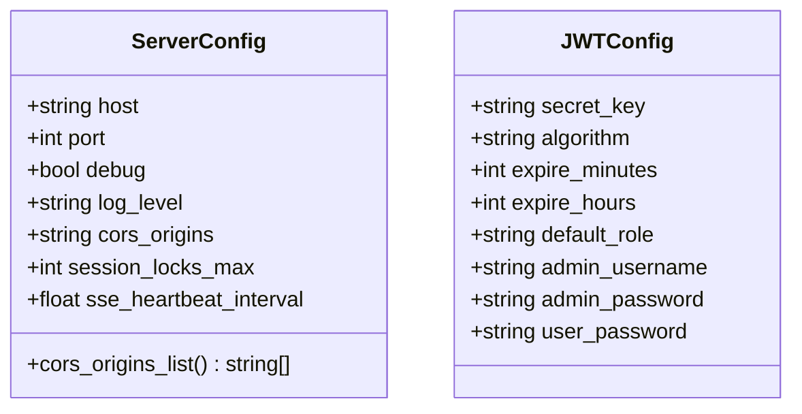

图表来源
- [backend_design/nexus/config/server.py:15-41](file://backend_design/nexus/config/server.py#L15-L41)
- [backend_design/nexus/config/server.py:44-61](file://backend_design/nexus/config/server.py#L44-L61)

章节来源
- [backend_design/nexus/config/server.py:1-61](file://backend_design/nexus/config/server.py#L1-L61)

### 数据库配置（MilvusConfig、Neo4jConfig、MySQLConfig）
- 职责：向量数据库 Milvus 连接与索引参数、知识图谱 Neo4j 连接、MySQL 异步连接 URL 生成。
- 关键特性：
  - Milvus 支持集合名、索引类型、度量类型与搜索参数
  - MySQL 通过 computed_field 生成 aiomysql 驱动的连接 URL

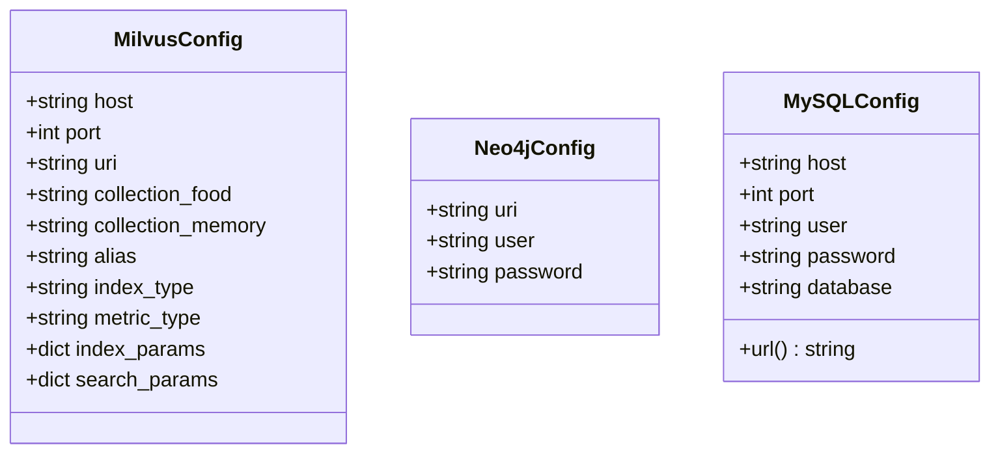

图表来源
- [backend_design/nexus/config/database.py:15-29](file://backend_design/nexus/config/database.py#L15-L29)
- [backend_design/nexus/config/database.py:32-39](file://backend_design/nexus/config/database.py#L32-L39)
- [backend_design/nexus/config/database.py:42-61](file://backend_design/nexus/config/database.py#L42-L61)

章节来源
- [backend_design/nexus/config/database.py:1-61](file://backend_design/nexus/config/database.py#L1-L61)

### LLM 配置（LLMConfig）
- 职责：大模型供应商选择（云端/本地）、API Key 与基础 URL、模型与嵌入维度、温度与最大 token、超时、反射与记忆抽取开关、并发限制、降级策略与通知开关。
- 关键特性：
  - model_post_init：当 provider=local 时自动切换到本地 llama.cpp 参数
  - embedding_url 计算字段拼接 /embeddings 端点
  - is_local 判断当前是否使用本地 LLM

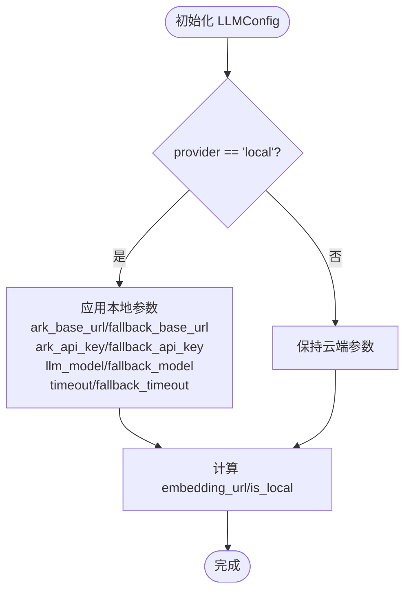

图表来源
- [backend_design/nexus/config/llm.py:15-51](file://backend_design/nexus/config/llm.py#L15-L51)
- [backend_design/nexus/config/llm.py:53-72](file://backend_design/nexus/config/llm.py#L53-L72)

章节来源
- [backend_design/nexus/config/llm.py:1-72](file://backend_design/nexus/config/llm.py#L1-L72)

### ASR/TTS 与声纹配置（ASRConfig）
- 职责：离线语音模型路径（FunASR SenseVoice、CosyVoice TTS、CAM++ 声纹）、用户注册与用户库目录、声纹阈值与注册次数。
- 关键特性：
  - model_post_init：将相对路径解析为绝对路径
  - resolved_* 方法返回已解析的绝对路径

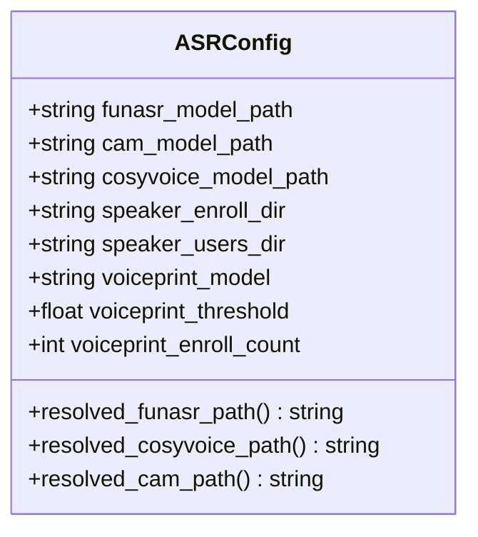

图表来源
- [backend_design/nexus/config/asr.py:15-54](file://backend_design/nexus/config/asr.py#L15-L54)
- [backend_design/nexus/config/asr.py:55-66](file://backend_design/nexus/config/asr.py#L55-L66)

章节来源
- [backend_design/nexus/config/asr.py:1-66](file://backend_design/nexus/config/asr.py#L1-L66)

### Redis 缓存配置（RedisConfig）
- 职责：Redis 连接参数与语义缓存行为（相似度阈值、TTL）。
- 关键特性：
  - url 计算字段生成完整的 redis:// 连接串

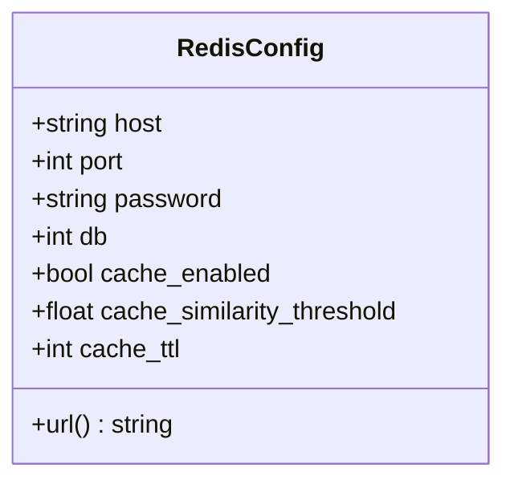

图表来源
- [backend_design/nexus/config/cache.py:15-41](file://backend_design/nexus/config/cache.py#L15-L41)

章节来源
- [backend_design/nexus/config/cache.py:1-41](file://backend_design/nexus/config/cache.py#L1-L41)

### 可观测性配置（LangfuseConfig、ObservabilityConfig）
- 职责：Langfuse 追踪平台连接与启用判断；Prometheus 指标采集与 Grafana 地址。
- 关键特性：
  - is_enabled：当 public_key 和 secret_key 均存在时启用 Langfuse

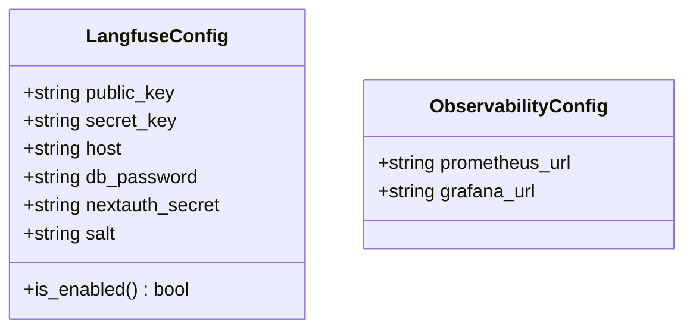

图表来源
- [backend_design/nexus/config/observability.py:15-33](file://backend_design/nexus/config/observability.py#L15-L33)
- [backend_design/nexus/config/observability.py:35-47](file://backend_design/nexus/config/observability.py#L35-L47)

章节来源
- [backend_design/nexus/config/observability.py:1-47](file://backend_design/nexus/config/observability.py#L1-L47)

### 部署模式与重排器（ProvidersConfig、RerankerConfig）
- 职责：控制各组件 Provider 选择（向量存储、图存储、缓存、重排器、检查点），并提供归一化字典；Reranker 模型名称。
- 关键特性：
  - normalized() 返回小写化的 provider 映射

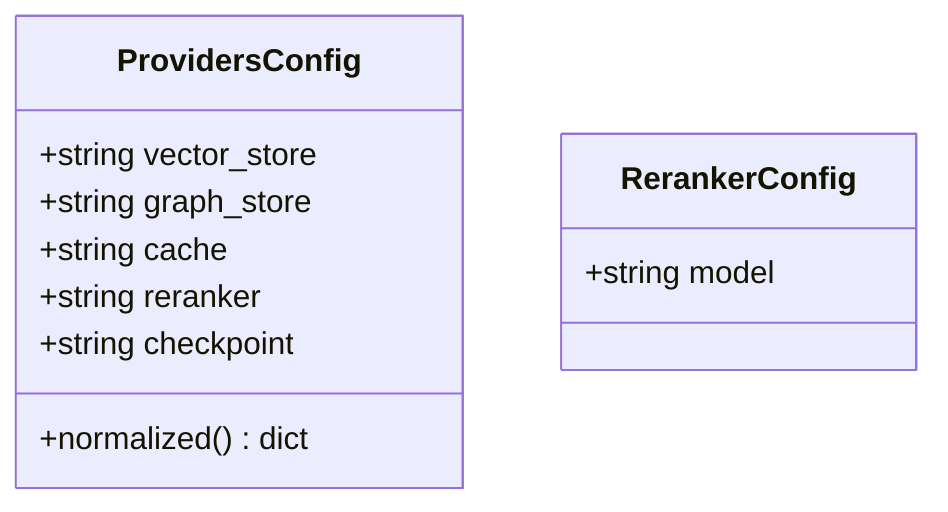

图表来源
- [backend_design/nexus/config/providers.py:15-38](file://backend_design/nexus/config/providers.py#L15-L38)
- [backend_design/nexus/config/providers.py:41-47](file://backend_design/nexus/config/providers.py#L41-L47)

章节来源
- [backend_design/nexus/config/providers.py:1-47](file://backend_design/nexus/config/providers.py#L1-L47)

### 数据目录与记忆管理（DataConfig、MemoryConfig）
- 职责：食物知识库、上传文件、临时文件、偏好数据等目录路径；对话历史压缩、摘要、窗口大小、上下文 token 比例与硬上限。
- 关键特性：
  - resolved_* 方法返回绝对路径

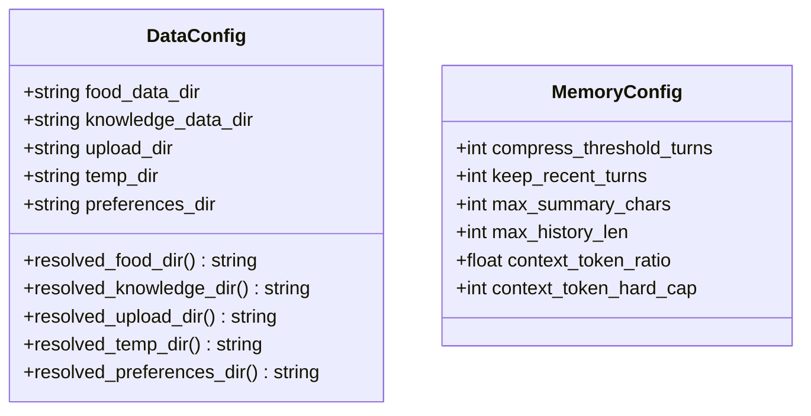

图表来源
- [backend_design/nexus/config/data.py:15-44](file://backend_design/nexus/config/data.py#L15-L44)
- [backend_design/nexus/config/data.py:47-63](file://backend_design/nexus/config/data.py#L47-L63)

章节来源
- [backend_design/nexus/config/data.py:1-63](file://backend_design/nexus/config/data.py#L1-L63)

### 多座舱与第三方服务（CockpitSettings、TavilyConfig、AmapConfig、QWeatherConfig）
- 职责：多座舱数量与网关配置、RBAC 默认角色、声纹参数；Tavily 搜索 API Key；高德地图 API Key；和风天气 API Key、Key、项目 ID、凭证 ID、API Host 及有效 Key 选择。
- 关键特性：
  - effective_key：优先 QWEATHER_APIKEY，其次 QWEATHER_KEY

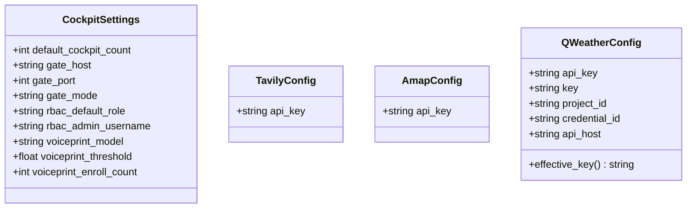

图表来源
- [backend_design/nexus/config/cockpit.py:15-35](file://backend_design/nexus/config/cockpit.py#L15-L35)
- [backend_design/nexus/config/cockpit.py:38-46](file://backend_design/nexus/config/cockpit.py#L38-L46)
- [backend_design/nexus/config/cockpit.py:49-58](file://backend_design/nexus/config/cockpit.py#L49-L58)
- [backend_design/nexus/config/cockpit.py:61-83](file://backend_design/nexus/config/cockpit.py#L61-L83)

章节来源
- [backend_design/nexus/config/cockpit.py:1-83](file://backend_design/nexus/config/cockpit.py#L1-L83)

### 车控总线适配器（VehicleConfig）
- 职责：车控指令发送方式（mock/http/mcp）、HTTP 接口地址与协议、超时与 Token、MCP 命令与参数、工作目录与工具校验。
- 关键特性：
  - adapter 决定运行时使用的适配器实现

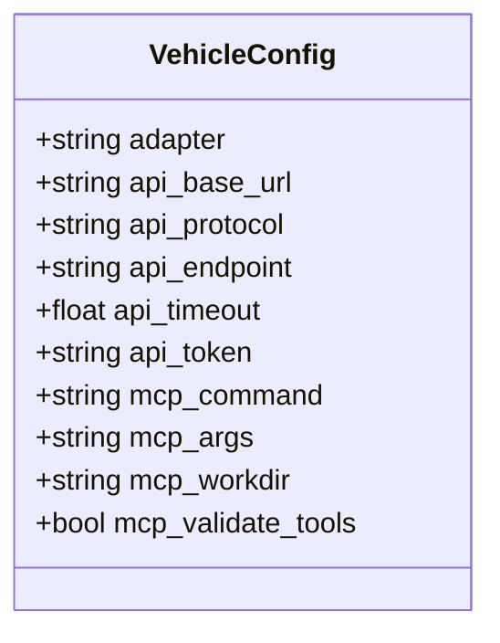

图表来源
- [backend_design/nexus/config/vehicle.py:15-49](file://backend_design/nexus/config/vehicle.py#L15-L49)

章节来源
- [backend_design/nexus/config/vehicle.py:1-50](file://backend_design/nexus/config/vehicle.py#L1-L50)

## 依赖关系分析
- 耦合与内聚：
  - 各子配置类高度内聚，仅依赖 _common.py 的路径与 env_file
  - AppConfig 作为聚合层，降低业务模块对具体子配置的耦合
- 外部依赖：
  - pydantic-settings 负责类型校验与环境变量绑定
  - python-dotenv 负责 .env 文件加载
- 潜在循环依赖：
  - 通过 _common.py 隔离路径与加载逻辑，避免 __init__.py 与各子模块间的循环导入

```mermaid
graph TB
AppConfig["AppConfig(__init__.py)"] --> Server["ServerConfig(server.py)"]
AppConfig --> DB["database.py(Milvus/Neo4j/MySQL)"]
AppConfig --> LLM["LLMConfig(llm.py)"]
AppConfig --> ASR["ASRConfig(asr.py)"]
AppConfig --> Cache["RedisConfig(cache.py)"]
AppConfig --> Obs["observability.py(Langfuse/Observability)"]
AppConfig --> Prov["providers.py(Providers/Reranker)"]
AppConfig --> Data["data.py(Data/Memory)"]
AppConfig --> Cockpit["cockpit.py(Cockpit/Tavily/Amap/QWeather)"]
AppConfig --> Vehicle["vehicle.py(Vehicle)"]
All["所有子配置"] --> Common["_common.py(_ENV_FILE/_resolve_path)"]
```

图表来源
- [backend_design/nexus/config/__init__.py:84-132](file://backend_design/nexus/config/__init__.py#L84-L132)
- [backend_design/nexus/config/_common.py:39-53](file://backend_design/nexus/config/_common.py#L39-L53)

章节来源
- [backend_design/nexus/config/__init__.py:1-167](file://backend_design/nexus/config/__init__.py#L1-L167)
- [backend_design/nexus/config/_common.py:1-75](file://backend_design/nexus/config/_common.py#L1-L75)

## 性能考虑
- 配置加载开销：
  - AppConfig 使用 lru_cache(maxsize=1) 保证只创建一次，避免重复初始化
- 路径解析优化：
  - _resolve_path() 仅在需要时转换相对路径，减少不必要的字符串操作
- 网络与超时：
  - LLMConfig.timeout 与 fallback_timeout 影响请求延迟，需根据网络状况调优
- 缓存与并发：
  - RedisConfig.cache_ttl 与语义缓存阈值影响命中率与内存占用
  - ServerConfig.session_locks_max 防止会话锁过多导致内存泄漏

[本节为通用指导，不直接分析具体文件]

## 故障排查指南
- 常见错误与定位：
  - 环境变量未生效：确认 .env.local 或 .env 是否存在且未被空值覆盖；检查 APP_ENV 与变量名是否与 validation_alias 一致
  - 路径错误：确认相对路径是否正确，必要时使用 resolved_* 方法打印绝对路径
  - 连接失败：检查数据库、Redis、Milvus、Neo4j 的 host/port/password 与 URL 格式
  - CORS 问题：确认 cors_origins 列表包含前端域名
  - LLM 降级：检查 provider 与 fallback_* 参数，确认本地服务可用
- 调试技巧：
  - 在 settings API 路由中输出当前配置快照，便于对比环境与默认值差异
  - 开启 debug 模式与日志级别调整，观察配置加载顺序与异常堆栈

章节来源
- [backend_design/nexus/api/routes/settings.py](file://backend_design/nexus/api/routes/settings.py)

## 结论
NexusCockpit 的配置系统通过模块化拆分与 Pydantic Settings 的类型安全机制，实现了高内聚、低耦合、易扩展的配置管理。统一的加载优先级与路径解析确保了跨环境一致性，结合动态配置更新与热重载能力，可满足开发与生产环境的多样化需求。

[本节为总结，不直接分析具体文件]

## 附录

### 配置文件层次结构与加载优先级
- 优先级：.env.local > .env > 环境变量 > 默认值
- 加载策略：
  - 若 .env.local 存在则优先加载，否则回退到 .env
  - 使用 load_dotenv(override=True) 确保 .env.local 的值不被 .env 中的空值覆盖
  - 各子配置类通过 model_config 指定 env_file=_ENV_FILE，并按 validation_alias 绑定环境变量

章节来源
- [backend_design/nexus/config/_common.py:39-53](file://backend_design/nexus/config/_common.py#L39-L53)
- [backend_design/nexus/config/server.py:34](file://backend_design/nexus/config/server.py#L34)
- [backend_design/nexus/config/database.py:29](file://backend_design/nexus/config/database.py#L29)
- [backend_design/nexus/config/llm.py:51](file://backend_design/nexus/config/llm.py#L51)
- [backend_design/nexus/config/asr.py:45](file://backend_design/nexus/config/asr.py#L45)
- [backend_design/nexus/config/cache.py:33](file://backend_design/nexus/config/cache.py#L33)
- [backend_design/nexus/config/observability.py:27](file://backend_design/nexus/config/observability.py#L27)
- [backend_design/nexus/config/providers.py:28](file://backend_design/nexus/config/providers.py#L28)
- [backend_design/nexus/config/data.py:24](file://backend_design/nexus/config/data.py#L24)
- [backend_design/nexus/config/cockpit.py:35](file://backend_design/nexus/config/cockpit.py#L35)
- [backend_design/nexus/config/vehicle.py:49](file://backend_design/nexus/config/vehicle.py#L49)

### 配置验证机制与类型安全保证
- 使用 pydantic-settings 的 BaseSettings 进行字段类型校验与默认值管理
- validation_alias 将环境变量名与字段绑定，确保命名规范与可读性
- model_config.extra="ignore" 忽略未知环境变量，避免意外报错

章节来源
- [backend_design/nexus/config/server.py:34](file://backend_design/nexus/config/server.py#L34)
- [backend_design/nexus/config/database.py:29](file://backend_design/nexus/config/database.py#L29)
- [backend_design/nexus/config/llm.py:51](file://backend_design/nexus/config/llm.py#L51)
- [backend_design/nexus/config/asr.py:45](file://backend_design/nexus/config/asr.py#L45)
- [backend_design/nexus/config/cache.py:33](file://backend_design/nexus/config/cache.py#L33)
- [backend_design/nexus/config/observability.py:27](file://backend_design/nexus/config/observability.py#L27)
- [backend_design/nexus/config/providers.py:28](file://backend_design/nexus/config/providers.py#L28)
- [backend_design/nexus/config/data.py:24](file://backend_design/nexus/config/data.py#L24)
- [backend_design/nexus/config/cockpit.py:35](file://backend_design/nexus/config/cockpit.py#L35)
- [backend_design/nexus/config/vehicle.py:49](file://backend_design/nexus/config/vehicle.py#L49)

### 动态配置更新与环境切换最佳实践
- 动态更新：
  - 通过 settings API 路由读取与展示当前配置，结合前端界面进行在线修改
  - 修改后重启服务或调用热重载接口使新配置生效
- 环境切换：
  - 通过 APP_ENV 与 .env.local/.env 切换不同环境
  - LLM provider 切换：cloud/local，配合 fallback_* 参数实现降级

章节来源
- [backend_design/nexus/api/routes/settings.py](file://backend_design/nexus/api/routes/settings.py)
- [backend_design/nexus/config/_common.py:39-53](file://backend_design/nexus/config/_common.py#L39-L53)
- [backend_design/nexus/config/llm.py:53-72](file://backend_design/nexus/config/llm.py#L53-L72)

### 配置模板与实际使用示例
- 模板建议：
  - .env：提供默认值与开发环境常用配置
  - .env.local：存放个人敏感信息（API Key、密码等）
- 使用示例：
  - 在代码中通过 get_config().server.host 访问服务器主机
  - 通过 get_llm_config().provider 获取 LLM 提供商
  - 通过 get_milvus_config().uri 获取向量数据库 URI
  - 通过 get_redis_config().url 获取 Redis 连接串

章节来源
- [backend_design/nexus/config/__init__.py:144-167](file://backend_design/nexus/config/__init__.py#L144-L167)

### 配置热重载机制与调试技巧
- 热重载：
  - 在开发环境下启用 debug=True，框架支持代码热重载
  - 配置变更可通过 settings API 动态刷新
- 调试技巧：
  - 打印 AppConfig.model_dump() 查看完整配置快照
  - 检查 _common.py 的 _ENV_FILE 选择是否符合预期
  - 使用日志记录关键配置项的变化与异常

章节来源
- [backend_design/nexus/config/server.py:23](file://backend_design/nexus/config/server.py#L23)
- [backend_design/nexus/config/_common.py:39-53](file://backend_design/nexus/config/_common.py#L39-L53)
- [backend_design/nexus/api/routes/settings.py](file://backend_design/nexus/api/routes/settings.py)