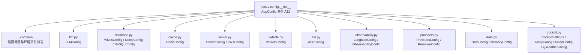
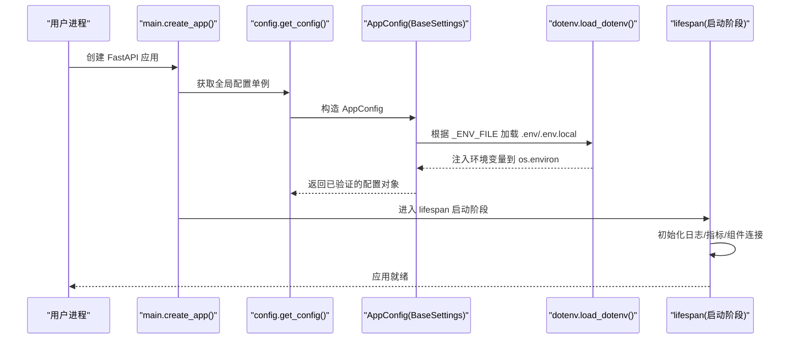
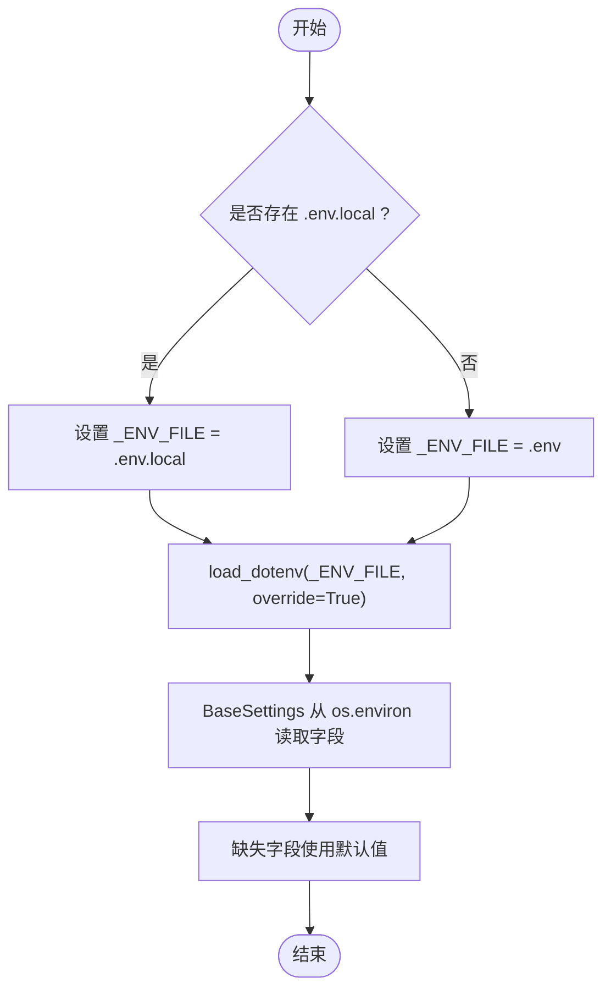
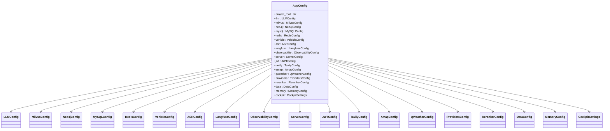
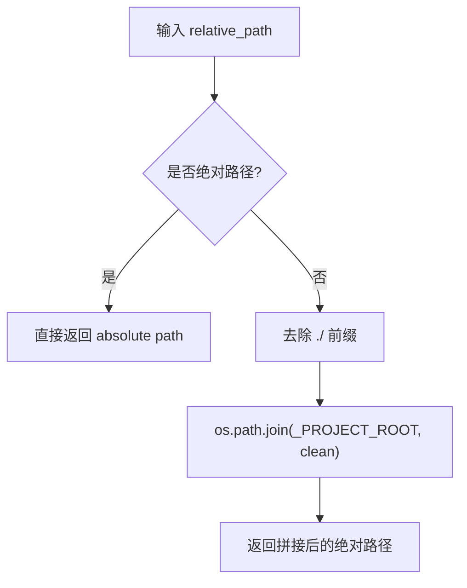
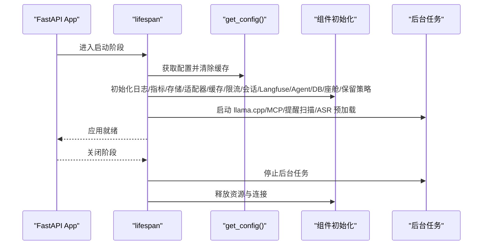
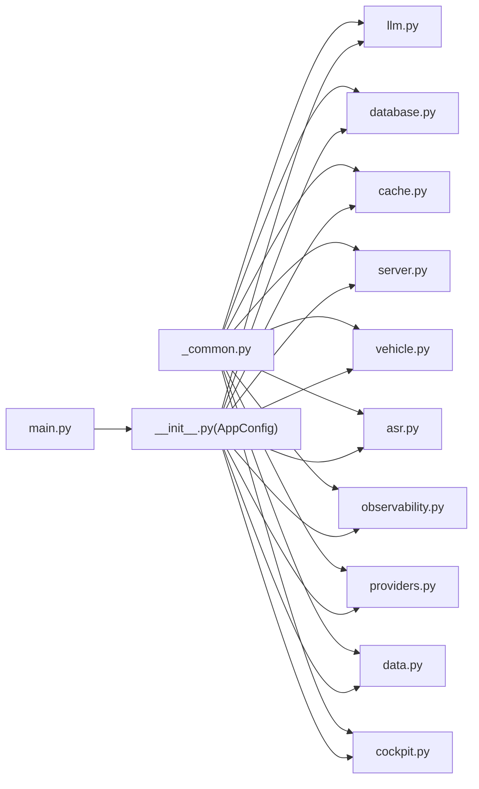

# 配置系统概览

<cite>
**本文引用的文件**   
- [backend_design/nexus/config/__init__.py](file://backend_design/nexus/config/__init__.py)
- [backend_design/nexus/config/_common.py](file://backend_design/nexus/config/_common.py)
- [backend_design/nexus/config/llm.py](file://backend_design/nexus/config/llm.py)
- [backend_design/nexus/config/database.py](file://backend_design/nexus/config/database.py)
- [backend_design/nexus/config/cache.py](file://backend_design/nexus/config/cache.py)
- [backend_design/nexus/config/server.py](file://backend_design/nexus/config/server.py)
- [backend_design/nexus/config/vehicle.py](file://backend_design/nexus/config/vehicle.py)
- [backend_design/nexus/config/asr.py](file://backend_design/nexus/config/asr.py)
- [backend_design/nexus/config/observability.py](file://backend_design/nexus/config/observability.py)
- [backend_design/nexus/config/providers.py](file://backend_design/nexus/config/providers.py)
- [backend_design/nexus/config/data.py](file://backend_design/nexus/config/data.py)
- [backend_design/nexus/config/cockpit.py](file://backend_design/nexus/config/cockpit.py)
- [backend_design/nexus/main.py](file://backend_design/nexus/main.py)
</cite>

## 目录
1. [简介](#简介)
2. [项目结构](#项目结构)
3. [核心组件](#核心组件)
4. [架构总览](#架构总览)
5. [详细组件分析](#详细组件分析)
6. [依赖关系分析](#依赖关系分析)
7. [性能考量](#性能考量)
8. [故障排查指南](#故障排查指南)
9. [结论](#结论)
10. [附录：最佳实践与访问模式](#附录最佳实践与访问模式)

## 简介
本文件为 NexusCockpit 配置系统的权威文档，聚焦基于 Pydantic Settings 的模块化配置管理。系统采用“聚合类 + 子模块拆分 + 全局单例”的设计，提供类型安全、可验证、可扩展的配置体系。配置加载优先级遵循 .env.local > .env > 环境变量 > 默认值，确保本地覆盖与开箱即用并存。同时，通过 _resolve_path() 统一路径解析，保证跨工作目录启动时的稳定性。

## 项目结构
配置系统位于 backend_design/nexus/config 包内，按子系统拆分为多个独立文件，并在 __init__.py 中聚合导出。_common.py 提供路径常量与环境文件加载策略，各子模块分别负责 LLM、数据库、缓存、车控、ASR/TTS、可观测性、服务器与认证、第三方服务、部署模式、数据目录与记忆、多座舱等配置。

图表来源
- [backend_design/nexus/config/__init__.py:84-132](file://backend_design/nexus/config/__init__.py#L84-L132)
- [backend_design/nexus/config/_common.py:20-53](file://backend_design/nexus/config/_common.py#L20-L53)

章节来源
- [backend_design/nexus/config/__init__.py:1-167](file://backend_design/nexus/config/__init__.py#L1-L167)
- [backend_design/nexus/config/_common.py:1-75](file://backend_design/nexus/config/_common.py#L1-L75)

## 核心组件
- AppConfig：聚合所有子系统配置，作为全局唯一入口；通过 get_config() 获取线程安全的单例实例。
- _common：定义 _PROJECT_ROOT、_ENV_FILE，以及 _resolve_path() 路径解析工具。
- 子配置类：每个子系统一个 BaseSettings 子类，声明字段、默认值、validation_alias（环境变量映射）与 computed_field（派生属性）。
- 快捷访问函数：get_llm_config()、get_milvus_config()、get_redis_config() 等便捷方法。

章节来源
- [backend_design/nexus/config/__init__.py:84-167](file://backend_design/nexus/config/__init__.py#L84-L167)
- [backend_design/nexus/config/_common.py:20-75](file://backend_design/nexus/config/_common.py#L20-L75)

## 架构总览
配置系统以 Pydantic Settings 为核心，结合 dotenv 实现环境文件加载，并通过 lru_cache 提供全局单例。启动流程在 FastAPI 生命周期中完成配置读取、日志与指标初始化、组件连接与后台任务启动。

图表来源
- [backend_design/nexus/main.py:436-452](file://backend_design/nexus/main.py#L436-L452)
- [backend_design/nexus/main.py:75-101](file://backend_design/nexus/main.py#L75-L101)
- [backend_design/nexus/config/__init__.py:144-151](file://backend_design/nexus/config/__init__.py#L144-L151)
- [backend_design/nexus/config/_common.py:43-53](file://backend_design/nexus/config/_common.py#L43-L53)

## 详细组件分析

### 配置加载优先级机制
- 优先级顺序：.env.local > .env > 环境变量 > 默认值
- 实现要点：
  - _common 自动定位项目根目录并选择 .env.local（存在则优先），否则回退 .env。
  - 使用 dotenv 的 override=True 显式加载，避免空值覆盖已有变量。
  - BaseSettings 的 model_config.env_file 指向 _ENV_FILE，确保字段从环境变量正确填充。
  - 若未安装 dotenv，忽略导入错误，仍可从 os.environ 读取。

图表来源
- [backend_design/nexus/config/_common.py:39-53](file://backend_design/nexus/config/_common.py#L39-L53)
- [backend_design/nexus/config/__init__.py:132](file://backend_design/nexus/config/__init__.py#L132)

章节来源
- [backend_design/nexus/config/_common.py:20-53](file://backend_design/nexus/config/_common.py#L20-L53)
- [backend_design/nexus/config/__init__.py:132](file://backend_design/nexus/config/__init__.py#L132)

### AppConfig 聚合类与各子模块组织
- AppConfig 将 LLM、数据库、缓存、车控、ASR、可观测性、服务器与认证、第三方服务、部署模式、数据目录与记忆、多座舱等配置聚合为一个对象。
- 每个子模块独立维护自己的 env_file 前缀与字段命名约定，通过 validation_alias 映射环境变量名。
- 快捷访问函数简化常用配置的获取。

图表来源
- [backend_design/nexus/config/__init__.py:84-132](file://backend_design/nexus/config/__init__.py#L84-L132)

章节来源
- [backend_design/nexus/config/__init__.py:84-132](file://backend_design/nexus/config/__init__.py#L84-L132)

### _resolve_path() 路径解析机制与项目根目录管理
- _PROJECT_ROOT 通过向上四级路径计算得到项目根目录，确保无论从哪里启动都能正确定位。
- _resolve_path() 将相对路径（如 ./models/asr）转换为基于项目根的绝对路径，兼容 Windows 与 Unix 路径。
- 对需要绝对路径的子模块（如 ASRConfig、DataConfig），在 model_post_init 或专用方法中调用 _resolve_path() 进行转换。

图表来源
- [backend_design/nexus/config/_common.py:25-27](file://backend_design/nexus/config/_common.py#L25-L27)
- [backend_design/nexus/config/_common.py:56-75](file://backend_design/nexus/config/_common.py#L56-L75)
- [backend_design/nexus/config/asr.py:47-53](file://backend_design/nexus/config/asr.py#L47-L53)
- [backend_design/nexus/config/data.py:26-44](file://backend_design/nexus/config/data.py#L26-L44)

章节来源
- [backend_design/nexus/config/_common.py:25-75](file://backend_design/nexus/config/_common.py#L25-L75)
- [backend_design/nexus/config/asr.py:47-53](file://backend_design/nexus/config/asr.py#L47-L53)
- [backend_design/nexus/config/data.py:26-44](file://backend_design/nexus/config/data.py#L26-L44)

### 配置验证机制、类型安全与错误处理
- 类型安全：Pydantic 字段声明确保类型校验（如 int、float、bool、str）。
- 验证别名：validation_alias 将环境变量名映射到字段名，便于外部配置。
- 计算字段：computed_field 提供派生属性（如 Redis.url、MySQL.url、LLM.embedding_url、is_local）。
- 错误处理：
  - BaseSettings 在构造时进行字段校验，失败抛出异常。
  - main.py 中的 lifespan 对关键组件连接进行 try/except 包裹，非致命错误不阻止启动。
  - 全局异常处理器统一返回 JSON 格式的错误响应。

章节来源
- [backend_design/nexus/config/cache.py:35-41](file://backend_design/nexus/config/cache.py#L35-L41)
- [backend_design/nexus/config/database.py:53-61](file://backend_design/nexus/config/database.py#L53-L61)
- [backend_design/nexus/config/llm.py:61-72](file://backend_design/nexus/config/llm.py#L61-L72)
- [backend_design/nexus/main.py:503-596](file://backend_design/nexus/main.py#L503-L596)

### 启动流程与生命周期管理
- create_app() 构建 FastAPI 应用，注册路由与中间件。
- lifespan 钩子在启动阶段执行：
  - 重置 LLM 客户端单例与 get_config 缓存，确保热重载后配置生效。
  - 初始化日志、指标、向量存储、图谱存储、车控适配器、语义缓存、限流器、会话存储、Langfuse 监控、Agent 工作流、MySQL 管理器、座舱管理器、数据保留策略、llama.cpp 子进程、MCP Server、提醒扫描器等。
  - 后台预加载 ASR/TTS 模型，不阻塞主流程。
- 关闭阶段依次停止子进程、清理资源、断开连接。

图表来源
- [backend_design/nexus/main.py:75-101](file://backend_design/nexus/main.py#L75-L101)
- [backend_design/nexus/main.py:112-358](file://backend_design/nexus/main.py#L112-L358)
- [backend_design/nexus/main.py:385-433](file://backend_design/nexus/main.py#L385-L433)

章节来源
- [backend_design/nexus/main.py:436-452](file://backend_design/nexus/main.py#L436-L452)
- [backend_design/nexus/main.py:75-101](file://backend_design/nexus/main.py#L75-L101)
- [backend_design/nexus/main.py:112-358](file://backend_design/nexus/main.py#L112-L358)
- [backend_design/nexus/main.py:385-433](file://backend_design/nexus/main.py#L385-L433)

## 依赖关系分析
- 子配置模块均依赖 _common 提供的 _ENV_FILE 与 _resolve_path()。
- AppConfig 聚合所有子配置，并通过 lru_cache 提供单例。
- main.py 依赖 config.get_config() 获取配置，并在 lifespan 中初始化各组件。

图表来源
- [backend_design/nexus/config/_common.py:12-13](file://backend_design/nexus/config/_common.py#L12-L13)
- [backend_design/nexus/config/__init__.py:38-49](file://backend_design/nexus/config/__init__.py#L38-L49)
- [backend_design/nexus/main.py:56](file://backend_design/nexus/main.py#L56)

章节来源
- [backend_design/nexus/config/_common.py:12-13](file://backend_design/nexus/config/_common.py#L12-L13)
- [backend_design/nexus/config/__init__.py:38-49](file://backend_design/nexus/config/__init__.py#L38-L49)
- [backend_design/nexus/main.py:56](file://backend_design/nexus/main.py#L56)

## 性能考量
- 配置单例：使用 lru_cache(maxsize=1) 确保 AppConfig 只创建一次，减少重复开销。
- 热重载支持：在 lifespan 中强制重置 LLM 客户端与 get_config 缓存，确保 uvicorn --reload 后配置即时生效。
- 异步初始化：关键组件连接与后台任务使用异步与后台任务，避免阻塞主事件循环。
- 资源清理：关闭阶段有序释放连接与资源，防止内存泄漏。

章节来源
- [backend_design/nexus/config/__init__.py:144-151](file://backend_design/nexus/config/__init__.py#L144-L151)
- [backend_design/nexus/main.py:89-95](file://backend_design/nexus/main.py#L89-L95)
- [backend_design/nexus/main.py:385-433](file://backend_design/nexus/main.py#L385-L433)

## 故障排查指南
- API Key 为空：检查 .env.local 中的 ARK_API_KEY 是否正确加载，启动日志会显示密钥长度与末四位。
- 组件连接失败：Milvus/Neo4j/Redis 等连接失败不会阻止启动，但相关功能会降级；查看日志中的警告信息。
- 路径问题：确认 _resolve_path() 是否正确解析相对路径，必要时打印 project_root 与实际路径。
- 配置未生效：确保环境变量名与 validation_alias 一致，检查 .env.local 是否被 dotenv 正确加载。

章节来源
- [backend_design/nexus/main.py:103-111](file://backend_design/nexus/main.py#L103-L111)
- [backend_design/nexus/main.py:117-132](file://backend_design/nexus/main.py#L117-L132)
- [backend_design/nexus/config/_common.py:43-53](file://backend_design/nexus/config/_common.py#L43-L53)

## 结论
NexusCockpit 配置系统通过 Pydantic Settings 实现了类型安全、可验证、模块化的配置管理。_.env.local > .env > 环境变量 > 默认值的优先级机制确保了灵活性与安全性。_resolve_path() 解决了跨工作目录的路径问题。全局单例与生命周期管理保证了启动效率与资源清理。整体设计清晰、扩展性强，适合企业级车载智能体平台的需求。

## 附录：最佳实践与访问模式
- 访问方式：
  - 全局单例：from nexus.config import get_config; config = get_config()
  - 快捷访问：from nexus.config import get_llm_config, get_milvus_config, get_redis_config
- 配置项命名：
  - 使用 validation_alias 明确环境变量名，保持与业务语义一致。
  - 敏感信息放入 .env.local，不要提交到版本库。
- 路径管理：
  - 所有相对路径以 ./ 开头，由 _resolve_path() 转换为绝对路径。
  - 在 model_post_init 或专用方法中调用 _resolve_path()。
- 调试技巧：
  - 打印 config.project_root 确认项目根目录。
  - 检查日志中的 API Key 加载状态与组件连接状态。
- 热重载：
  - 重启服务或使用 uvicorn --reload，确保 get_config.cache_clear() 被调用。

章节来源
- [backend_design/nexus/config/__init__.py:144-167](file://backend_design/nexus/config/__init__.py#L144-L167)
- [backend_design/nexus/config/_common.py:25-27](file://backend_design/nexus/config/_common.py#L25-L27)
- [backend_design/nexus/config/asr.py:47-53](file://backend_design/nexus/config/asr.py#L47-L53)
- [backend_design/nexus/main.py:89-95](file://backend_design/nexus/main.py#L89-L95)