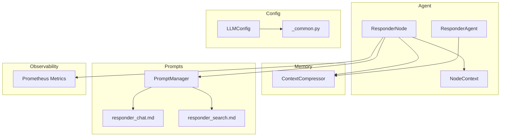
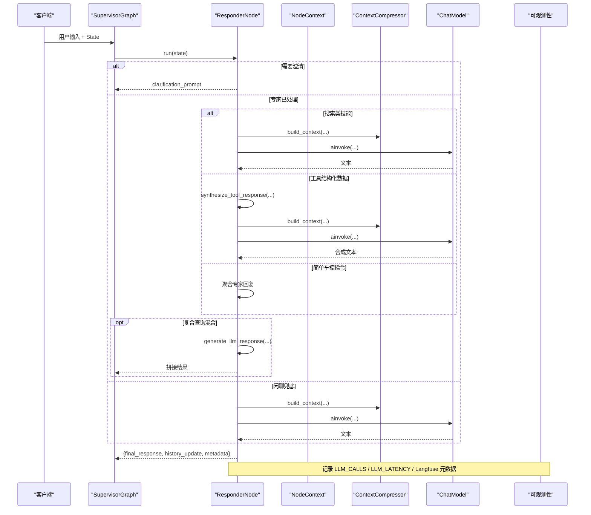
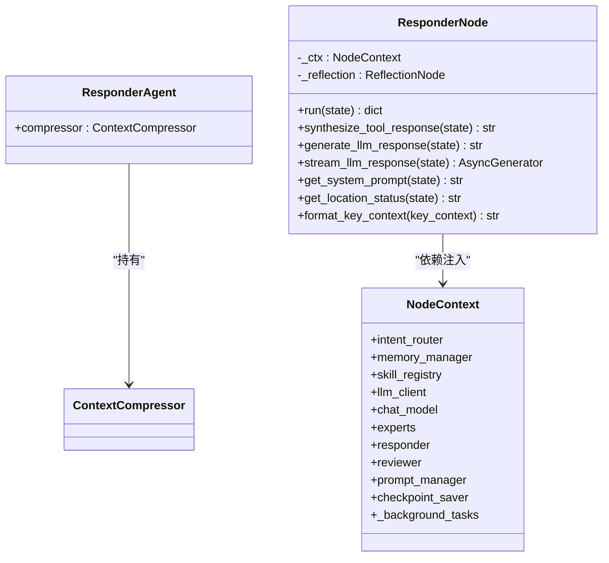
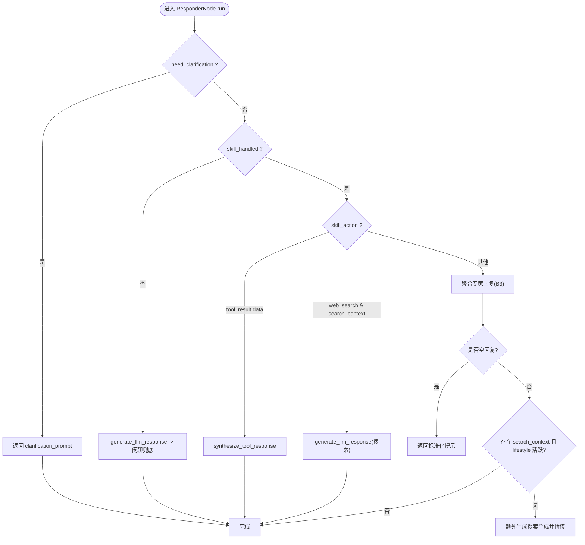
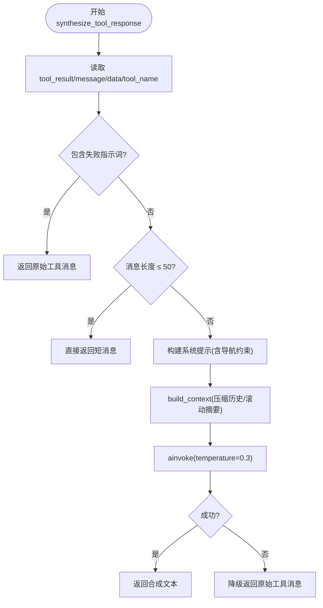
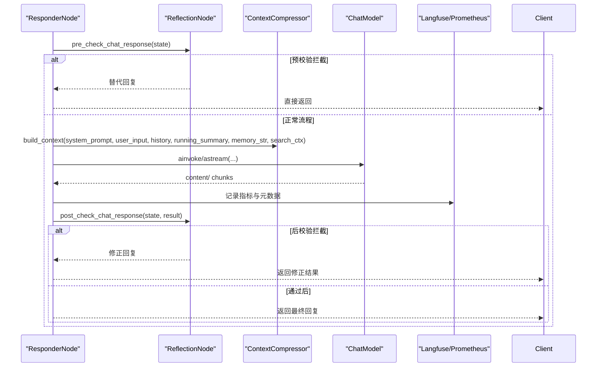
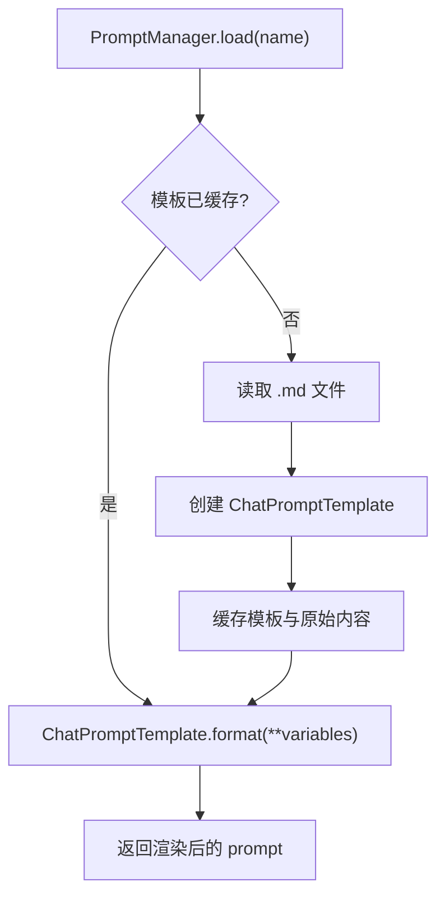
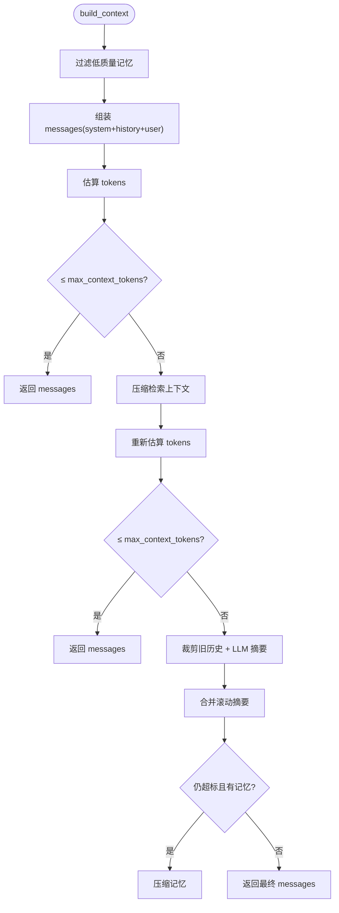
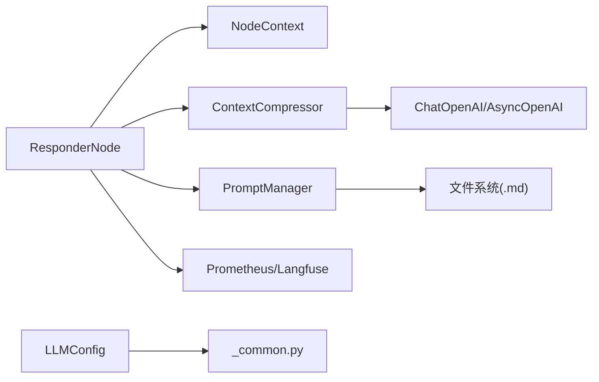

# Responder响应器

<cite>
**本文引用的文件**   
- [responder.py](file://backend_design/nexus/agent/responder.py)
- [responder_node.py](file://backend_design/nexus/agent/nodes/responder_node.py)
- [context.py](file://backend_design/nexus/agent/nodes/context.py)
- [compressor.py](file://backend_design/nexus/memory/compressor.py)
- [__init__.py](file://backend_design/nexus/prompts/__init__.py)
- [responder_chat.md](file://backend_design/nexus/prompts/responder_chat.md)
- [responder_search.md](file://backend_design/nexus/prompts/responder_search.md)
- [llm.py](file://backend_design/nexus/config/llm.py)
- [_common.py](file://backend_design/nexus/config/_common.py)
- [metrics.py](file://backend_design/nexus/observability/metrics.py)
</cite>

## 目录
1. [简介](#简介)
2. [项目结构](#项目结构)
3. [核心组件](#核心组件)
4. [架构总览](#架构总览)
5. [详细组件分析](#详细组件分析)
6. [依赖关系分析](#依赖关系分析)
7. [性能与优化](#性能与优化)
8. [故障排查指南](#故障排查指南)
9. [结论](#结论)
10. [附录：示例与最佳实践](#附录示例与最佳实践)

## 简介
本技术文档聚焦于 NexusCockpit 的 Responder 响应器，系统性阐述 ResponderAgent 的回复生成机制与 LLM 调用策略，以及 ResponderNode 的多模式响应流程（LLM 生成、Tool→LLM 合成、车控指令聚合、搜索内容合成）。同时覆盖 Prompt 模板管理、流式输出实现、上下文格式化、位置状态处理、质量优化、缓存策略与性能监控等关键主题。读者无需深入源码即可理解整体设计，并通过“章节来源”快速定位到具体代码片段。

## 项目结构
Responder 相关能力由以下模块协同完成：
- Agent 层：ResponderAgent 持有上下文压缩器；ResponderNode 负责分支路由与回复生成。
- Memory 层：ContextCompressor 提供上下文构建、阈值压缩与滚动摘要。
- Prompts 层：PromptManager 统一加载与渲染 .md 模板。
- Config 层：LLM 配置与环境路径解析。
- Observability 层：Prometheus 指标采集与 Langfuse 观测注入。

图表来源
- [responder.py:1-39](file://backend_design/nexus/agent/responder.py#L1-L39)
- [responder_node.py:1-120](file://backend_design/nexus/agent/nodes/responder_node.py#L1-L120)
- [context.py:1-64](file://backend_design/nexus/agent/nodes/context.py#L1-L64)
- [compressor.py:1-120](file://backend_design/nexus/memory/compressor.py#L1-L120)
- [__init__.py:1-161](file://backend_design/nexus/prompts/__init__.py#L1-L161)
- [llm.py:1-72](file://backend_design/nexus/config/llm.py#L1-L72)
- [_common.py:1-75](file://backend_design/nexus/config/_common.py#L1-L75)
- [metrics.py:1-108](file://backend_design/nexus/observability/metrics.py#L1-L108)

章节来源
- [responder.py:1-39](file://backend_design/nexus/agent/responder.py#L1-L39)
- [responder_node.py:1-120](file://backend_design/nexus/agent/nodes/responder_node.py#L1-L120)
- [context.py:1-64](file://backend_design/nexus/agent/nodes/context.py#L1-L64)
- [compressor.py:1-120](file://backend_design/nexus/memory/compressor.py#L1-L120)
- [__init__.py:1-161](file://backend_design/nexus/prompts/__init__.py#L1-L161)
- [llm.py:1-72](file://backend_design/nexus/config/llm.py#L1-L72)
- [_common.py:1-75](file://backend_design/nexus/config/_common.py#L1-L75)
- [metrics.py:1-108](file://backend_design/nexus/observability/metrics.py#L1-L108)

## 核心组件
- ResponderAgent：作为“上下文压缩器持有者”，供 SupervisorGraph 通过 self.responder.compressor 访问，避免直接耦合。
- ResponderNode：根据 state 分支选择回复策略，执行闲聊预校验/后校验，构建 System Prompt，调用 LLM 或进行 Tool→LLM 合成，并维护 running_summary 与压缩历史。
- ContextCompressor：基于 langchain_core.trim_messages 的分级预算上下文构建，支持阈值压缩、滚动摘要、检索上下文压缩与记忆过滤。
- PromptManager：从 .md 模板加载并使用 ChatPromptTemplate 渲染变量，支持版本管理与降级回退。
- NodeContext：节点共享依赖容器，解耦各节点对 SupervisorGraph 的直接引用。
- LLM 配置与环境解析：统一 provider、模型、超时、本地/云端切换与路径解析。
- 可观测性：Prometheus 指标与 Langfuse 观测注入，记录调用次数、延迟、Token 用量等。

章节来源
- [responder.py:1-39](file://backend_design/nexus/agent/responder.py#L1-L39)
- [responder_node.py:1-120](file://backend_design/nexus/agent/nodes/responder_node.py#L1-L120)
- [compressor.py:1-120](file://backend_design/nexus/memory/compressor.py#L1-L120)
- [__init__.py:1-161](file://backend_design/nexus/prompts/__init__.py#L1-L161)
- [context.py:1-64](file://backend_design/nexus/agent/nodes/context.py#L1-L64)
- [llm.py:1-72](file://backend_design/nexus/config/llm.py#L1-L72)
- [_common.py:1-75](file://backend_design/nexus/config/_common.py#L1-L75)
- [metrics.py:1-108](file://backend_design/nexus/observability/metrics.py#L1-L108)

## 架构总览
Responder 的工作流围绕 ResponderNode.run() 展开，按分支策略决定最终回复来源与生成方式，并通过 ContextCompressor 构建上下文、调用 LLM，最后返回 final_response、history_update 与 running_summary。

图表来源
- [responder_node.py:57-174](file://backend_design/nexus/agent/nodes/responder_node.py#L57-L174)
- [compressor.py:316-395](file://backend_design/nexus/memory/compressor.py#L316-L395)
- [metrics.py:79-108](file://backend_design/nexus/observability/metrics.py#L79-L108)

## 详细组件分析

### ResponderAgent 与 ResponderNode 协作
- ResponderAgent 仅持有 ContextCompressor，供 SupervisorGraph 使用，降低耦合。
- ResponderNode 通过 NodeContext 获取 chat_model、prompt_manager、compressor 等依赖，避免循环依赖。
- ReflectionNode 通过 set_reflection_node 注入，用于闲聊预校验/后校验。

图表来源
- [responder.py:23-39](file://backend_design/nexus/agent/responder.py#L23-L39)
- [responder_node.py:34-52](file://backend_design/nexus/agent/nodes/responder_node.py#L34-L52)
- [context.py:31-64](file://backend_design/nexus/agent/nodes/context.py#L31-L64)

章节来源
- [responder.py:23-39](file://backend_design/nexus/agent/responder.py#L23-L39)
- [responder_node.py:34-52](file://backend_design/nexus/agent/nodes/responder_node.py#L34-L52)
- [context.py:31-64](file://backend_design/nexus/agent/nodes/context.py#L31-L64)

### ResponderNode 多模式响应流程
- 分支 A：需要澄清 → 直接返回 clarification_prompt。
- 分支 B：专家已处理
  - B1：搜索类技能 → 使用 search 提示词生成。
  - B2：工具结构化数据 → Tool→LLM 合成，严格约束禁止编造。
  - B3：简单车控指令 → 聚合所有专家回复，空回复兜底。
  - B5：复合查询混合 → 车控回复 + LLM 合成搜索结果拼接。
- 分支 C：LLM 闲聊兜底。

图表来源
- [responder_node.py:57-174](file://backend_design/nexus/agent/nodes/responder_node.py#L57-L174)

章节来源
- [responder_node.py:57-174](file://backend_design/nexus/agent/nodes/responder_node.py#L57-L174)

### Tool→LLM 合成策略
- 失败指示检测：包含“未知/不可用/失败/错误/无法/不支持”时跳过 LLM 合成，直接返回原始消息。
- 快速路径：短消息（≤50 字符）视为自然语言，跳过 LLM 合成。
- 导航类特殊约束：禁止编造路线、路况、距离、预计时间等未提供的信息。
- 安全约束：只能基于工具数据回答，禁止添加天气/新闻/推荐等外部信息，不注入记忆与习惯。

图表来源
- [responder_node.py:180-310](file://backend_design/nexus/agent/nodes/responder_node.py#L180-L310)

章节来源
- [responder_node.py:180-310](file://backend_design/nexus/agent/nodes/responder_node.py#L180-L310)

### LLM 闲聊生成与流式输出
- 非流式 generate_llm_response：预校验 → 构建上下文 → ainvoke → 后校验 → 返回结果。
- 流式 stream_llm_response：预校验 → 构建上下文 → astream → 逐块 yield。
- 失败降级：搜索场景下若 LLM 失败，返回原始搜索结果片段；否则返回通用兜底文案。
- 指标与观测：记录 LLM_CALLS、LLM_LATENCY，并通过 Langfuse update_current_span 注入 model、temperature、token 用量、latency 等元数据。

图表来源
- [responder_node.py:315-450](file://backend_design/nexus/agent/nodes/responder_node.py#L315-L450)
- [metrics.py:79-108](file://backend_design/nexus/observability/metrics.py#L79-L108)

章节来源
- [responder_node.py:315-450](file://backend_design/nexus/agent/nodes/responder_node.py#L315-L450)
- [metrics.py:79-108](file://backend_design/nexus/observability/metrics.py#L79-L108)

### Prompt 模板管理系统与多场景提示词
- PromptManager 从 .md 模板加载并使用 ChatPromptTemplate 渲染变量，支持版本管理与降级回退。
- 多场景模板：
  - responder_chat.md：闲聊系统提示，要求极简回答。
  - responder_search.md：搜索结果组织提示，强调基于搜索结果回答，简洁实用。
- ResponderNode.get_system_prompt：根据 skill_action 动态选择模板，注入用户画像、记忆、习惯、当前位置状态与关键上下文，并在历史查询时引导 LLM 从滚动摘要中查找。

图表来源
- [__init__.py:86-143](file://backend_design/nexus/prompts/__init__.py#L86-L143)
- [responder_chat.md:1-3](file://backend_design/nexus/prompts/responder_chat.md#L1-L3)
- [responder_search.md:1-12](file://backend_design/nexus/prompts/responder_search.md#L1-L12)

章节来源
- [__init__.py:86-143](file://backend_design/nexus/prompts/__init__.py#L86-L143)
- [responder_chat.md:1-3](file://backend_design/nexus/prompts/responder_chat.md#L1-L3)
- [responder_search.md:1-12](file://backend_design/nexus/prompts/responder_search.md#L1-L12)
- [responder_node.py:455-570](file://backend_design/nexus/agent/nodes/responder_node.py#L455-L570)

### 上下文格式化与位置状态处理
- ContextCompressor.build_context：分级预算组装上下文，Level 0-3 渐进式压缩检索上下文、历史与记忆，确保不超过 max_context_tokens。
- ResponderNode.get_location_status：优先使用缓存地址，若无则尝试逆地理编码；坐标可用但地址解析失败时告知坐标；不可用时明确禁止编造位置。
- 关键上下文格式化：extract_key_context 提取位置/偏好/身份，format_key_context 转为可读文本注入 system prompt。

图表来源
- [compressor.py:316-395](file://backend_design/nexus/memory/compressor.py#L316-L395)
- [responder_node.py:597-671](file://backend_design/nexus/agent/nodes/responder_node.py#L597-L671)

章节来源
- [compressor.py:316-395](file://backend_design/nexus/memory/compressor.py#L316-L395)
- [responder_node.py:597-671](file://backend_design/nexus/agent/nodes/responder_node.py#L597-L671)

### LLM 调用策略与配置
- LLMConfig：支持 provider(local/cloud)、模型、温度、最大 token、超时、本地/云端切换、降级通知等。
- ResponderNode：在 Tool→LLM 合成中使用较低 temperature(0.3) 保证事实准确性；闲聊使用 0.7；失败时降级为原始工具消息或搜索结果片段。
- 可观测性：记录 LLM_CALLS、LLM_LATENCY，并通过 Langfuse update_current_span 注入 model、temperature、token 用量、latency。

章节来源
- [llm.py:15-72](file://backend_design/nexus/config/llm.py#L15-L72)
- [responder_node.py:278-310](file://backend_design/nexus/agent/nodes/responder_node.py#L278-L310)
- [metrics.py:79-108](file://backend_design/nexus/observability/metrics.py#L79-L108)

## 依赖关系分析
- ResponderNode 依赖 NodeContext 提供的 chat_model、prompt_manager、compressor 等。
- ContextCompressor 依赖 LLM 客户端与 ChatOpenAI 实例进行压缩与摘要。
- PromptManager 依赖文件系统与 LangChain ChatPromptTemplate。
- LLMConfig 依赖 _common.py 的环境文件加载与路径解析。
- 可观测性模块被 ResponderNode 在 LLM 调用前后注入指标与元数据。

图表来源
- [responder_node.py:1-120](file://backend_design/nexus/agent/nodes/responder_node.py#L1-L120)
- [context.py:31-64](file://backend_design/nexus/agent/nodes/context.py#L31-L64)
- [compressor.py:1-120](file://backend_design/nexus/memory/compressor.py#L1-L120)
- [__init__.py:1-161](file://backend_design/nexus/prompts/__init__.py#L1-L161)
- [llm.py:1-72](file://backend_design/nexus/config/llm.py#L1-L72)
- [_common.py:1-75](file://backend_design/nexus/config/_common.py#L1-L75)
- [metrics.py:1-108](file://backend_design/nexus/observability/metrics.py#L1-L108)

章节来源
- [responder_node.py:1-120](file://backend_design/nexus/agent/nodes/responder_node.py#L1-L120)
- [context.py:31-64](file://backend_design/nexus/agent/nodes/context.py#L31-L64)
- [compressor.py:1-120](file://backend_design/nexus/memory/compressor.py#L1-L120)
- [__init__.py:1-161](file://backend_design/nexus/prompts/__init__.py#L1-L161)
- [llm.py:1-72](file://backend_design/nexus/config/llm.py#L1-L72)
- [_common.py:1-75](file://backend_design/nexus/config/_common.py#L1-L75)
- [metrics.py:1-108](file://backend_design/nexus/observability/metrics.py#L1-L108)

## 性能与优化
- 上下文压缩与阈值控制：ContextCompressor 使用 trim_messages 与 LLM 摘要，避免超长上下文导致延迟与成本上升。
- 快速路径优化：Tool→LLM 合成对短消息直接返回，减少不必要的 LLM 调用。
- 温度与 Token 限制：Tool→LLM 合成使用低温度提升准确性；max_tokens 限制输出长度。
- 指标与监控：Prometheus 指标与 Langfuse 观测帮助定位瓶颈与异常。
- 建议：
  - 合理设置 compress_threshold_turns、keep_recent_turns、max_summary_chars 以平衡上下文长度与质量。
  - 针对高频场景启用缓存（如搜索结果片段），减少重复 LLM 调用。
  - 监控 LLM_CALLS 与 LLM_LATENCY，结合业务峰值调整并发与超时。

[本节为通用指导，不直接分析具体文件]

## 故障排查指南
- LLM 调用失败：检查 LLMConfig 的 provider、base_url、timeout；查看 metrics 中的 LLM_CALLS 与 LLM_LATENCY；确认 Langfuse 元数据是否正确注入。
- 上下文溢出：检查 ContextCompressor 的阈值配置与模板长度；必要时增加 max_context_tokens 或缩短模板。
- 位置状态异常：确认车辆适配器导航状态与逆地理编码逻辑；检查 get_location_status 的日志与降级路径。
- 模板渲染失败：验证 PromptManager 的模板文件是否存在与语法正确；查看降级回退逻辑是否生效。

章节来源
- [llm.py:15-72](file://backend_design/nexus/config/llm.py#L15-L72)
- [compressor.py:316-395](file://backend_design/nexus/memory/compressor.py#L316-L395)
- [responder_node.py:597-671](file://backend_design/nexus/agent/nodes/responder_node.py#L597-L671)
- [__init__.py:111-143](file://backend_design/nexus/prompts/__init__.py#L111-L143)
- [metrics.py:79-108](file://backend_design/nexus/observability/metrics.py#L79-L108)

## 结论
Responder 响应器通过 ResponderNode 的多分支策略与 ContextCompressor 的上下文管理，实现了高质量、低延迟、可观测的回复生成。Prompt 模板系统与位置状态处理进一步提升了准确性与用户体验。配合 Prometheus 与 Langfuse，可实现端到端的性能监控与问题定位。建议在部署中合理配置阈值与缓存策略，持续优化 LLM 调用效率与稳定性。

[本节为总结性内容，不直接分析具体文件]

## 附录：示例与最佳实践
- 复杂复合请求处理：当车控专家执行指令（B3）且生活专家返回搜索结果时，触发 B5 合成搜索内容并与车控回复拼接，确保用户获得完整答复。
- 混合响应场景：Tool→LLM 合成在导航类工具上强化约束，防止编造路线与距离；失败时回退原始消息，保障可用性。
- 流式输出：stream_llm_response 在失败时返回搜索结果片段或通用兜底文案，提升用户体验。
- 最佳实践：
  - 使用 PromptManager 统一管理模板，便于迭代与版本控制。
  - 利用 ContextCompressor 的阈值压缩与滚动摘要，控制上下文长度与成本。
  - 通过指标与观测持续优化 LLM 调用策略与资源分配。

[本节为概念性内容，不直接分析具体文件]