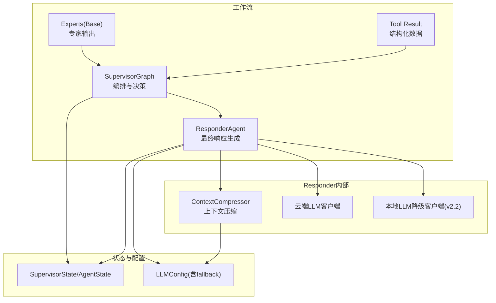
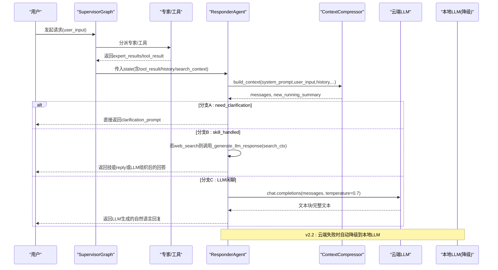
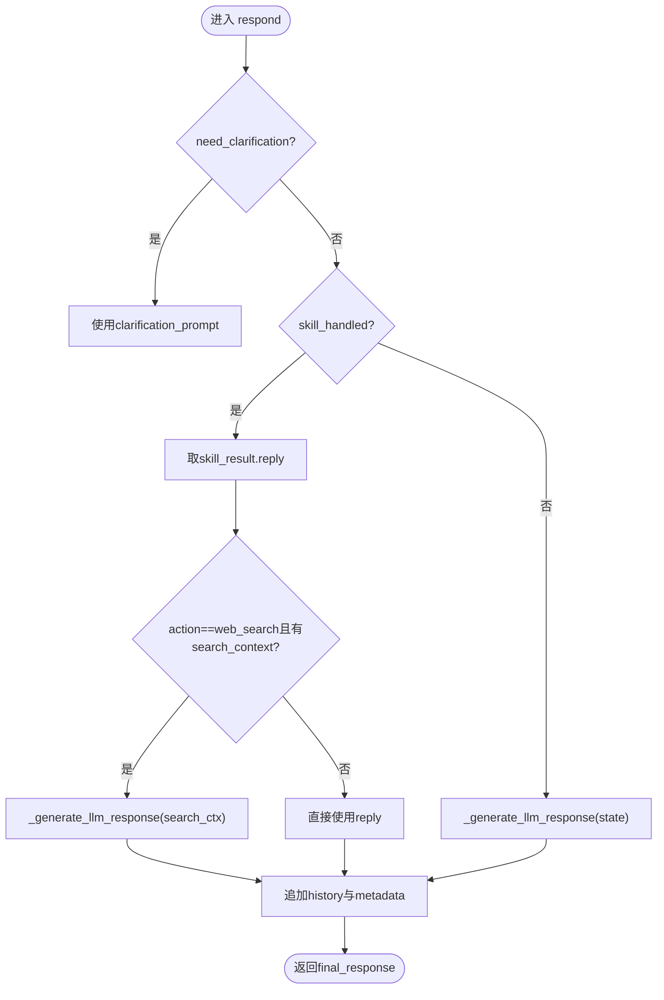
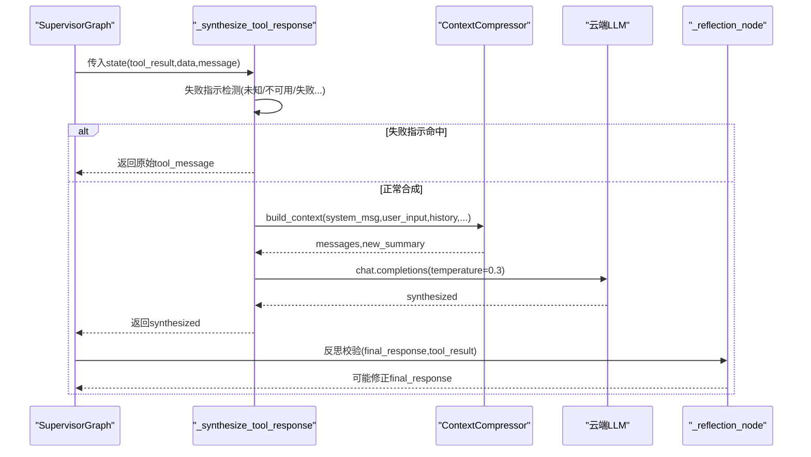
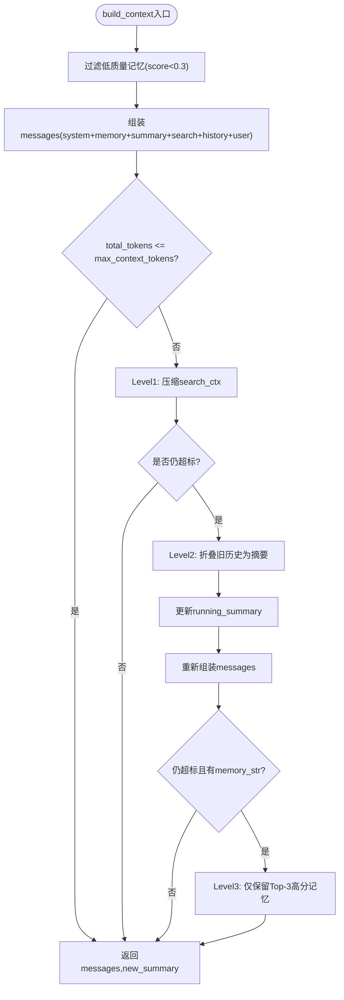
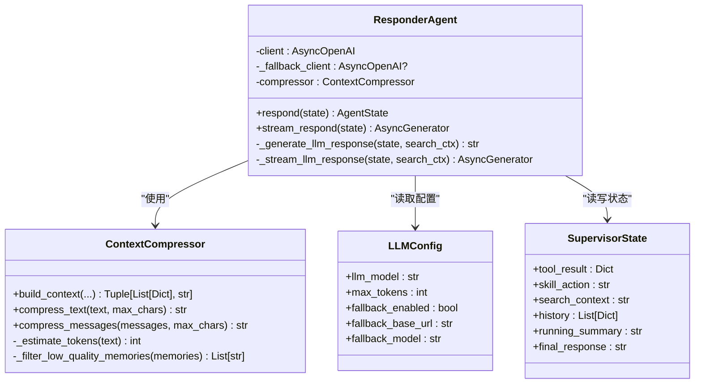

# Responder聚合器

<cite>
**本文引用的文件**   
- [responder.py](file://backend_design/nexus/agent/responder.py)
- [compressor.py](file://backend_design/nexus/memory/compressor.py)
- [state.py](file://backend_design/nexus/models/state.py)
- [config.py](file://backend_design/nexus/config.py)
- [supervisor_graph.py](file://backend_design/nexus/agent/supervisor_graph.py)
- [base.py](file://backend_design/nexus/agent/experts/base.py)
</cite>

## 目录
1. [简介](#简介)
2. [项目结构](#项目结构)
3. [核心组件](#核心组件)
4. [架构总览](#架构总览)
5. [详细组件分析](#详细组件分析)
6. [依赖关系分析](#依赖关系分析)
7. [性能考量](#性能考量)
8. [故障排查指南](#故障排查指南)
9. [结论](#结论)
10. [附录：扩展新分支示例](#附录扩展新分支示例)

## 简介
本文件聚焦于 Responder 聚合器的技术实现与工作机制，围绕以下目标展开：
- 解释 ResponderAgent 的核心职责：汇总多个专家的输出，生成最终自然语言回复。
- 详解三种响应分支的处理逻辑：分支A（澄清请求）、分支B（专家已处理）、分支C（LLM闲聊兜底）。
- 深入说明 v2.2 增强的 Tool→LLM 合成机制：结构化数据转自然语言、CoT思维链推理、事实性检查的实现细节。
- 解释 ContextCompressor 上下文压缩器的作用：历史消息管理、运行摘要更新、记忆注入策略。
- 解析 _generate_llm_response() 方法的提示词工程：系统提示构建、用户上下文组装、温度参数调优。
- 提供实际代码示例路径，展示如何扩展新的响应分支和处理逻辑。

## 项目结构
Responder 聚合器位于多智能体工作流的第三站，负责将前置阶段（意图路由、专家执行、工具调用）的结果汇聚为最终回复。其关键依赖包括：
- 状态模型：SupervisorState/AgentState，承载对话历史、工具结果、搜索上下文等。
- 上下文压缩器：ContextCompressor，负责动态预算分配与四级渐进式压缩。
- LLM 客户端：云端 OpenAI 兼容接口，以及 v2.2 新增的本地降级客户端。
- Supervisor 编排：在 supervisor_graph.py 中集成 Tool→LLM 合成与反思校验节点。

图表来源
- [responder.py:35-109](file://backend_design/nexus/agent/responder.py#L35-L109)
- [compressor.py:56-115](file://backend_design/nexus/memory/compressor.py#L56-L115)
- [state.py:38-101](file://backend_design/nexus/models/state.py#L38-L101)
- [config.py:97-158](file://backend_design/nexus/config.py#L97-L158)
- [supervisor_graph.py:450-533](file://backend_design/nexus/agent/supervisor_graph.py#L450-L533)

章节来源
- [responder.py:35-109](file://backend_design/nexus/agent/responder.py#L35-L109)
- [compressor.py:56-115](file://backend_design/nexus/memory/compressor.py#L56-L115)
- [state.py:38-101](file://backend_design/nexus/models/state.py#L38-L101)
- [config.py:97-158](file://backend_design/nexus/config.py#L97-L158)
- [supervisor_graph.py:450-533](file://backend_design/nexus/agent/supervisor_graph.py#L450-L533)

## 核心组件
- ResponderAgent
  - 职责：根据 state 中的标志位与结果，选择分支A/B/C，生成 final_response；维护 history 与运行摘要；支持非流式与流式两种模式。
  - 关键方法：respond(), stream_respond(), _generate_llm_response(), _stream_llm_response()。
- ContextCompressor
  - 职责：按模型窗口动态计算上下文上限，进行四级渐进式压缩（检索上下文、旧历史折叠、记忆过滤），并返回组装好的 messages 与更新的 running_summary。
  - 关键方法：build_context(), compress_text(), compress_messages(), _estimate_tokens(), _filter_low_quality_memories()。
- SupervisorState/AgentState
  - 职责：定义共享状态字段，包含 tool_result、skill_action、search_context、history、running_summary、final_response 等。
- LLMConfig
  - 职责：集中管理 LLM 连接参数与 v2.2 本地降级配置（fallback_enabled、fallback_base_url、fallback_model 等）。

章节来源
- [responder.py:35-109](file://backend_design/nexus/agent/responder.py#L35-L109)
- [compressor.py:56-115](file://backend_design/nexus/memory/compressor.py#L56-L115)
- [state.py:38-101](file://backend_design/nexus/models/state.py#L38-L101)
- [config.py:97-158](file://backend_design/nexus/config.py#L97-L158)

## 架构总览
Responder 的工作流由 SupervisorGraph 驱动，结合专家输出与工具调用结果，进入 Responder 进行最终响应生成。v2.2 引入 Tool→LLM 合成与反思校验，确保结构化数据到自然语言的准确转换。

图表来源
- [supervisor_graph.py:1164-1190](file://backend_design/nexus/agent/supervisor_graph.py#L1164-L1190)
- [responder.py:66-109](file://backend_design/nexus/agent/responder.py#L66-L109)
- [compressor.py:237-352](file://backend_design/nexus/memory/compressor.py#L237-L352)
- [config.py:131-147](file://backend_design/nexus/config.py#L131-L147)

## 详细组件分析

### ResponderAgent 分支逻辑与提示词工程
- 分支A（澄清请求）
  - 触发条件：state.need_clarification 且存在 clarification_prompt。
  - 行为：直接返回澄清提问，不经过 LLM。
- 分支B（专家已处理）
  - 触发条件：state.skill_handled 为真。
  - 行为：优先使用 skill_result.reply；若 action 为 web_search 且有 search_context，则调用 _generate_llm_response(state, search_ctx) 组织搜索结果。
- 分支C（LLM闲聊兜底）
  - 触发条件：前两个分支均未命中。
  - 行为：调用 _generate_llm_response(state) 生成自然语言回复。

_ generate_llm_response() 提示词工程要点：
- 系统提示构建：
  - 搜索类：强调“基于搜索结果回答，不要编造”，要求简洁实用、口语化表达，限制长度。
  - 闲聊类：设定角色与极简风格，限制字数。
- 用户上下文组装：通过 compressor.build_context 注入 memory_str、running_summary、history、user_input 等。
- 温度参数调优：默认 temperature=0.7，兼顾创造性与稳定性。
- 错误处理与降级：云端异常时尝试本地 LLM 降级；均失败则返回友好错误信息。

图表来源
- [responder.py:66-109](file://backend_design/nexus/agent/responder.py#L66-L109)
- [responder.py:151-203](file://backend_design/nexus/agent/responder.py#L151-L203)

章节来源
- [responder.py:66-109](file://backend_design/nexus/agent/responder.py#L66-L109)
- [responder.py:151-203](file://backend_design/nexus/agent/responder.py#L151-L203)

### v2.2 增强的 Tool→LLM 合成机制
- 触发路径：当专家返回 tool_result 且包含 data 时，SupervisorGraph 调用 _synthesize_tool_response(state)。
- CoT 思维链推理：
  - 以工具返回的结构化数据为事实依据，LLM 基于 user_input + tool_data 生成自然语言回复。
  - 强化约束：禁止添加工具结果外的信息（如天气、新闻、推荐等），禁止使用记忆或历史补充。
- 事实性检查：
  - 失败指示检测：若 tool_message 包含“未知/不可用/失败/错误/无法/不支持”等关键词，跳过合成，直接返回原始消息。
  - 低温度生成：temperature=0.3，确保事实准确性。
  - 反射校验：_reflection_node 对合成结果做一致性、无幻觉、相关性检查，必要时修正。

图表来源
- [supervisor_graph.py:450-533](file://backend_design/nexus/agent/supervisor_graph.py#L450-L533)
- [supervisor_graph.py:534-649](file://backend_design/nexus/agent/supervisor_graph.py#L534-L649)
- [base.py:95-133](file://backend_design/nexus/agent/experts/base.py#L95-L133)

章节来源
- [supervisor_graph.py:450-533](file://backend_design/nexus/agent/supervisor_graph.py#L450-L533)
- [supervisor_graph.py:534-649](file://backend_design/nexus/agent/supervisor_graph.py#L534-L649)
- [base.py:95-133](file://backend_design/nexus/agent/experts/base.py#L95-L133)

### ContextCompressor 上下文压缩器
- 动态上下文预算：
  - 根据模型窗口计算 max_context_tokens（取 70%，上限 4096）。
  - 四级渐进式披露与压缩：
    - Level 0：未超标，直接返回。
    - Level 1：压缩检索上下文（search_ctx）。
    - Level 2：折叠旧历史为摘要（rolling summary）。
    - Level 3：压缩记忆上下文（仅保留 Top-3 高分记忆）。
- 记忆注入策略：
  - 过滤低质量记忆（score < 0.3，去重，最多保留 5 条）。
  - 在 system prompt 中自然融入记忆，避免生硬拼接。
- 运行摘要更新：
  - 在 Level 2 时合并 old_summary 到 running_summary，限制长度。
- Token 估算：
  - 优先 tiktoken 精准计数，回退到中文/英文估算规则。

图表来源
- [compressor.py:237-352](file://backend_design/nexus/memory/compressor.py#L237-L352)
- [compressor.py:199-236](file://backend_design/nexus/memory/compressor.py#L199-L236)
- [compressor.py:94-115](file://backend_design/nexus/memory/compressor.py#L94-L115)

章节来源
- [compressor.py:237-352](file://backend_design/nexus/memory/compressor.py#L237-L352)
- [compressor.py:199-236](file://backend_design/nexus/memory/compressor.py#L199-L236)
- [compressor.py:94-115](file://backend_design/nexus/memory/compressor.py#L94-L115)

### 状态模型与工具结果提升
- SupervisorState/AgentState 定义了 tool_result 字段，供 Responder 与 Supervisor 进行合成与反思。
- 专家基类 BaseExpert 在 handled 且存在 skill_data 或 reply 时，将 tool_result 提升到顶层 state，便于后续流程统一处理。

章节来源
- [state.py:77-86](file://backend_design/nexus/models/state.py#L77-L86)
- [base.py:123-132](file://backend_design/nexus/agent/experts/base.py#L123-L132)

## 依赖关系分析
- ResponderAgent 依赖：
  - ContextCompressor：用于构建 messages 与更新 running_summary。
  - LLM 客户端：云端 OpenAI 兼容接口；v2.2 新增本地降级客户端。
  - 配置中心：读取 LLM 相关参数（model、max_tokens、fallback_*）。
- SupervisorGraph 集成：
  - 在工具返回结构化数据时，调用 _synthesize_tool_response 与 _reflection_node。
  - 将 tool_result 从专家输出提升到顶层 state。

图表来源
- [responder.py:35-109](file://backend_design/nexus/agent/responder.py#L35-L109)
- [compressor.py:56-115](file://backend_design/nexus/memory/compressor.py#L56-L115)
- [state.py:38-101](file://backend_design/nexus/models/state.py#L38-L101)
- [config.py:97-158](file://backend_design/nexus/config.py#L97-L158)

章节来源
- [responder.py:35-109](file://backend_design/nexus/agent/responder.py#L35-L109)
- [compressor.py:56-115](file://backend_design/nexus/memory/compressor.py#L56-L115)
- [state.py:38-101](file://backend_design/nexus/models/state.py#L38-L101)
- [config.py:97-158](file://backend_design/nexus/config.py#L97-L158)

## 性能考量
- 上下文预算控制：
  - 动态 max_context_tokens 避免单次请求过大，降低超时与成本风险。
  - 四级渐进式压缩减少冗余信息，提高 token 利用率。
- 流式与非流式：
  - stream_respond 适用于 SSE/WebSocket，提升首字延迟体验。
- 降级策略：
  - 云端 LLM 失败时自动切换到本地 LLM，保障可用性。
- 反思开销：
  - reflection_enabled 可关闭以减少额外 LLM 调用，适合免费 API 限流场景。

## 故障排查指南
- 常见问题定位：
  - 分支未命中：检查 state.need_clarification、state.skill_handled、state.tool_result 是否正确设置。
  - 搜索类回答不准确：确认 search_context 内容有效，_generate_llm_response 的系统提示是否被正确注入。
  - 工具合成失败：查看 _synthesize_tool_response 的失败指示检测与降级逻辑。
  - 上下文溢出：观察 ContextCompressor 的日志，确认 Level 1/2/3 压缩是否生效。
  - 降级链路：确认 fallback_enabled 与本地 LLM 服务可达性。
- 日志关键字：
  - “Context overflow”、“Falling back to local LLM”、“Tool synthesis SKIPPED (failure detected)”、“Reflection skipped (disabled by config)”。

章节来源
- [responder.py:187-203](file://backend_design/nexus/agent/responder.py#L187-L203)
- [responder.py:244-265](file://backend_design/nexus/agent/responder.py#L244-L265)
- [compressor.py:291-352](file://backend_design/nexus/memory/compressor.py#L291-L352)
- [supervisor_graph.py:478-533](file://backend_design/nexus/agent/supervisor_graph.py#L478-L533)

## 结论
Responder 聚合器在多智能体工作流中承担最终响应生成的关键职责，通过清晰的分支逻辑、强大的上下文压缩能力与 v2.2 增强的 Tool→LLM 合成与反思校验，实现了高可用、高质量的自然语言回复。配合灵活的提示词工程与降级策略，系统在复杂场景下仍能保持稳健表现。

## 附录：扩展新分支示例
以下示例展示如何在现有框架内扩展新的响应分支与处理逻辑（以“新增分支D：知识库问答”为例）：

- 步骤一：在 ResponderAgent.respond 中添加分支判断
  - 参考路径：[responder.py:66-109](file://backend_design/nexus/agent/responder.py#L66-L109)
  - 新增逻辑：
    - 判断 state.kb_answered 是否为真。
    - 若为真，使用 state.kb_reply 作为 full_response。
    - 否则继续原有分支A/B/C。

- 步骤二：在 SupervisorState 中增加字段
  - 参考路径：[state.py:77-86](file://backend_design/nexus/models/state.py#L77-L86)
  - 新增字段：kb_answered: bool; kb_reply: str。

- 步骤三：在专家或工具节点中写入新字段
  - 参考路径：[base.py:123-132](file://backend_design/nexus/agent/experts/base.py#L123-L132)
  - 在 handled 为真且存在 kb_reply 时，写入 state.kb_answered 与 state.kb_reply。

- 步骤四：可选——为新分支定制提示词与压缩策略
  - 参考路径：[compressor.py:237-352](file://backend_design/nexus/memory/compressor.py#L237-L352)
  - 在 build_context 中针对 kb_answered 分支调整 memory_str 与 running_summary 的注入方式。

- 步骤五：测试与验证
  - 覆盖分支命中与未命中的用例。
  - 验证 history 与 metadata 更新是否符合预期。
  - 检查流式与非流式输出的一致性。

章节来源
- [responder.py:66-109](file://backend_design/nexus/agent/responder.py#L66-L109)
- [state.py:77-86](file://backend_design/nexus/models/state.py#L77-L86)
- [base.py:123-132](file://backend_design/nexus/agent/experts/base.py#L123-L132)
- [compressor.py:237-352](file://backend_design/nexus/memory/compressor.py#L237-L352)