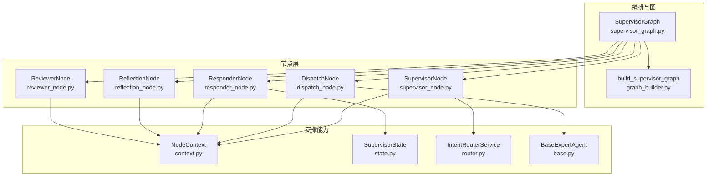
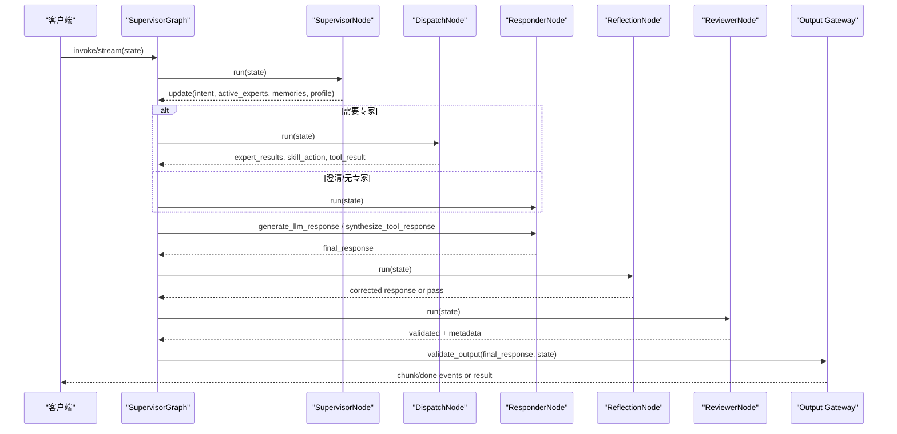
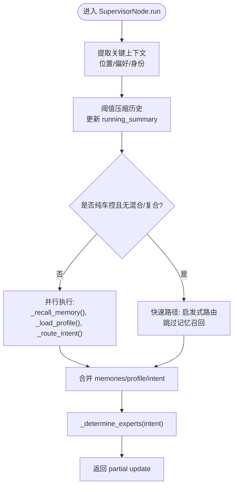
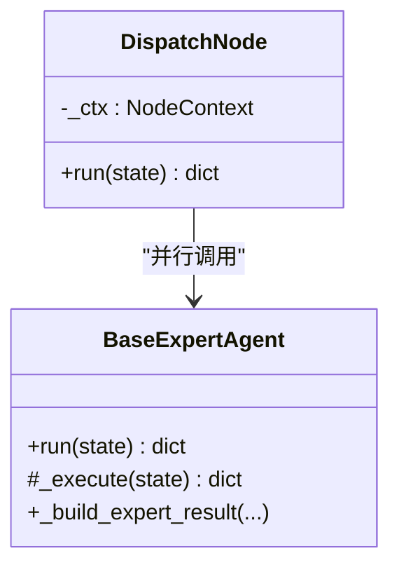
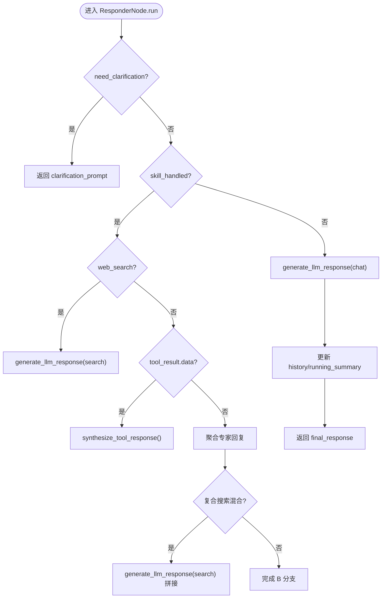
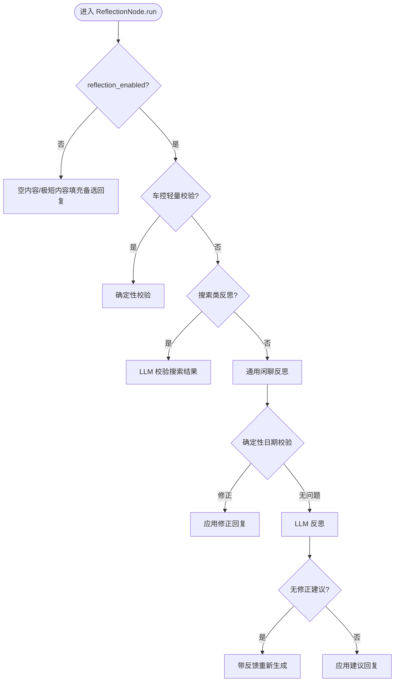
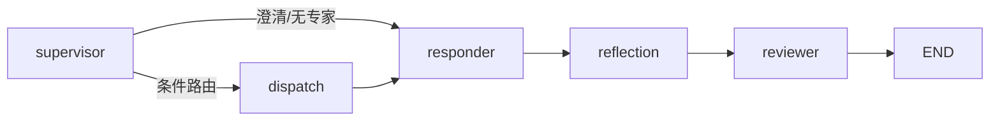
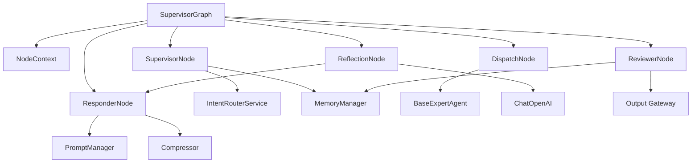

# Supervisor调度器

<cite>
**本文引用的文件**   
- [supervisor_graph.py](file://backend_design/nexus/agent/supervisor_graph.py)
- [graph_builder.py](file://backend_design/nexus/agent/graph_builder.py)
- [state.py](file://backend_design/nexus/models/state.py)
- [supervisor_node.py](file://backend_design/nexus/agent/nodes/supervisor_node.py)
- [dispatch_node.py](file://backend_design/nexus/agent/nodes/dispatch_node.py)
- [responder_node.py](file://backend_design/nexus/agent/nodes/responder_node.py)
- [reflection_node.py](file://backend_design/nexus/agent/nodes/reflection_node.py)
- [reviewer_node.py](file://backend_design/nexus/agent/nodes/reviewer_node.py)
- [context.py](file://backend_design/nexus/agent/nodes/context.py)
- [base.py](file://backend_design/nexus/agent/experts/base.py)
- [router.py](file://backend_design/nexus/intent/router.py)
</cite>

## 目录
1. [简介](#简介)
2. [项目结构](#项目结构)
3. [核心组件](#核心组件)
4. [架构总览](#架构总览)
5. [详细组件分析](#详细组件分析)
6. [依赖关系分析](#依赖关系分析)
7. [性能与优化](#性能与优化)
8. [故障排查指南](#故障排查指南)
9. [结论](#结论)
10. [附录：扩展与自定义示例](#附录扩展与自定义示例)

## 简介
本技术文档围绕 NexusCockpit 的 Supervisor 调度器，系统阐述基于 LangGraph StateGraph 的多智能体编排机制、有状态图工作流设计原理，以及 SupervisorNode 的意图识别算法、记忆召回策略和专家分派决策逻辑。文档还覆盖图构建过程（节点注册、边连接、编译配置）、SupervisorState 状态管理、上下文传递与错误恢复机制，并提供实际代码路径示例以展示如何自定义路由规则与扩展新专家类型。最后给出性能优化技巧、调试方法与监控指标建议。

## 项目结构
Supervisor 调度器位于 backend_design/nexus/agent 目录下，核心由以下模块组成：
- 编排入口与图构建：supervisor_graph.py、graph_builder.py
- 节点实现：nodes/supervisor_node.py、nodes/dispatch_node.py、nodes/responder_node.py、nodes/reflection_node.py、nodes/reviewer_node.py
- 共享依赖容器：nodes/context.py
- 状态定义：models/state.py
- 意图路由：intent/router.py
- 专家基类：experts/base.py

图表来源
- [supervisor_graph.py:93-179](file://backend_design/nexus/agent/supervisor_graph.py#L93-L179)
- [graph_builder.py:40-119](file://backend_design/nexus/agent/graph_builder.py#L40-L119)
- [supervisor_node.py:40-62](file://backend_design/nexus/agent/nodes/supervisor_node.py#L40-L62)
- [dispatch_node.py:25-48](file://backend_design/nexus/agent/nodes/dispatch_node.py#L25-L48)
- [responder_node.py:34-52](file://backend_design/nexus/agent/nodes/responder_node.py#L34-L52)
- [reflection_node.py:46-64](file://backend_design/nexus/agent/nodes/reflection_node.py#L46-L64)
- [reviewer_node.py:26-36](file://backend_design/nexus/agent/nodes/reviewer_node.py#L26-L36)
- [context.py:31-64](file://backend_design/nexus/agent/nodes/context.py#L31-L64)
- [state.py:38-106](file://backend_design/nexus/models/state.py#L38-L106)
- [router.py:32-102](file://backend_design/nexus/intent/router.py#L32-L102)
- [base.py:26-48](file://backend_design/nexus/agent/experts/base.py#L26-L48)

章节来源
- [supervisor_graph.py:93-179](file://backend_design/nexus/agent/supervisor_graph.py#L93-L179)
- [graph_builder.py:40-119](file://backend_design/nexus/agent/graph_builder.py#L40-L119)

## 核心组件
- SupervisorGraph：编排入口，负责初始化各节点、注入共享依赖、构建并编译 LangGraph 图，提供 invoke() 与 stream()/stream_with_events() 两种调用模式。
- graph_builder：集中注册节点、连接边、设置入口与编译参数，返回 CompiledGraph。
- SupervisorNode：记忆召回 + 用户画像加载 + 意图路由 + 专家分派决策；支持快速路径（纯车控指令）跳过记忆召回以降低延迟。
- DispatchNode：并行执行所有活跃专家，合并 partial updates，处理异常与多动作聚合。
- ResponderNode：按分支生成回复（澄清/工具合成/LLM闲聊），构建 System Prompt 注入画像/记忆/习惯/位置/关键上下文，支持预校验与后校验。
- ReflectionNode：对 LLM 输出做事实性/一致性/无幻觉/车载场景合规检查，含确定性日期校验与渐进式 retry。
- ReviewerNode：终审强校验 + 记忆存储 + 对话向量化 + 延迟统计 + Agent活动日志记录。
- NodeContext：共享依赖容器，通过依赖注入消除循环依赖。
- SupervisorState：TypedDict 状态模型，使用 Annotated reducer 自动合并列表与字典字段。
- IntentRouterService：三级路由（启发式 → LLM → 默认闲聊），支持复合查询增强与结构化日志。
- BaseExpertAgent：专家基类，封装 run() 与 _execute() 模板方法，统一结果结构与 tool_result 透传。

章节来源
- [supervisor_graph.py:93-179](file://backend_design/nexus/agent/supervisor_graph.py#L93-L179)
- [graph_builder.py:40-119](file://backend_design/nexus/agent/graph_builder.py#L40-L119)
- [supervisor_node.py:40-62](file://backend_design/nexus/agent/nodes/supervisor_node.py#L40-L62)
- [dispatch_node.py:25-48](file://backend_design/nexus/agent/nodes/dispatch_node.py#L25-L48)
- [responder_node.py:34-52](file://backend_design/nexus/agent/nodes/responder_node.py#L34-L52)
- [reflection_node.py:46-64](file://backend_design/nexus/agent/nodes/reflection_node.py#L46-L64)
- [reviewer_node.py:26-36](file://backend_design/nexus/agent/nodes/reviewer_node.py#L26-L36)
- [context.py:31-64](file://backend_design/nexus/agent/nodes/context.py#L31-L64)
- [state.py:38-106](file://backend_design/nexus/models/state.py#L38-L106)
- [router.py:32-102](file://backend_design/nexus/intent/router.py#L32-L102)
- [base.py:26-48](file://backend_design/nexus/agent/experts/base.py#L26-L48)

## 架构总览
Supervisor 工作流采用五层链路闭环：
- supervisor → dispatch → responder → reflection → reviewer → END
- 当无需专家或需要澄清时，supervisor 直接路由到 responder

图表来源
- [supervisor_graph.py:183-207](file://backend_design/nexus/agent/supervisor_graph.py#L183-L207)
- [supervisor_graph.py:209-384](file://backend_design/nexus/agent/supervisor_graph.py#L209-L384)
- [supervisor_graph.py:386-617](file://backend_design/nexus/agent/supervisor_graph.py#L386-L617)
- [graph_builder.py:94-119](file://backend_design/nexus/agent/graph_builder.py#L94-L119)

## 详细组件分析

### SupervisorNode：意图识别、记忆召回与专家分派
- 意图识别算法
  - 三级路由：启发式规则（关键词匹配）→ LLM 语义理解 → 默认闲聊兜底
  - 复合查询增强：当文本包含多个子句但仅部分被识别时，触发 LLM 多意图路由补充未识别需求
  - 混合意图优化：当已检测到车控+非车控意图时，直接使用启发式结果，跳过 LLM 路由节省延迟
- 记忆召回策略
  - 从短期历史提取关键上下文（位置/偏好/身份），用于增强长期记忆召回查询
  - 并行执行：记忆召回、用户画像加载、意图路由
  - 阈值压缩：对话轮数超阈值时自动压缩旧对话为滚动摘要，减少上下文长度
- 专家分派决策逻辑
  - 车控动作优先 → vehicle
  - 导航动作 → navigation（需明确目的地或 location op）
  - 搜索/点餐/提醒/POI/天气 → lifestyle
  - 车辆健康诊断 → health
  - 习惯画像/声纹注册 → chat
  - 对话历史查询 → chat（与车控等并行）
  - 无匹配 → chat 兜底
  - 防漂移机制：车控意图特征白名单强制路由，检测误匹配时自动修复并记录日志

图表来源
- [supervisor_node.py:64-106](file://backend_design/nexus/agent/nodes/supervisor_node.py#L64-L106)
- [supervisor_node.py:170-259](file://backend_design/nexus/agent/nodes/supervisor_node.py#L170-L259)
- [supervisor_node.py:333-422](file://backend_design/nexus/agent/nodes/supervisor_node.py#L333-L422)

章节来源
- [supervisor_node.py:64-106](file://backend_design/nexus/agent/nodes/supervisor_node.py#L64-L106)
- [supervisor_node.py:170-259](file://backend_design/nexus/agent/nodes/supervisor_node.py#L170-L259)
- [supervisor_node.py:333-422](file://backend_design/nexus/agent/nodes/supervisor_node.py#L333-L422)
- [router.py:103-218](file://backend_design/nexus/intent/router.py#L103-L218)

### DispatchNode：专家并行分派与结果合并
- 使用 asyncio.gather 并行调用所有活跃专家的 run() 方法
- 合并 partial updates：expert_results 累加、skill_action/skill_handled/search_context 合并、tool_result 收集与主结果保留
- 异常处理：捕获专家异常并记录 error 信息到 expert_results
- 元数据合并：multi_actions、latency_ms、error 标记等

图表来源
- [dispatch_node.py:38-140](file://backend_design/nexus/agent/nodes/dispatch_node.py#L38-L140)
- [base.py:48-87](file://backend_design/nexus/agent/experts/base.py#L48-L87)

章节来源
- [dispatch_node.py:38-140](file://backend_design/nexus/agent/nodes/dispatch_node.py#L38-L140)
- [base.py:48-87](file://backend_design/nexus/agent/experts/base.py#L48-L87)

### ResponderNode：回复生成与 Tool→LLM 合成
- 分支策略：
  - A: 澄清 → 直接返回 clarification_prompt
  - B1: 搜索类技能 → LLM 用 search 提示词生成
  - B2: 工具返回结构化数据 → Tool→LLM 合成
  - B3: 简单车控指令 → 聚合所有专家回复
  - B5: 复合查询混合 → 车控回复 + LLM 合成搜索结果拼接
  - C: LLM 闲聊兜底
- System Prompt 构建：注入用户画像、记忆、习惯、位置状态、关键上下文；搜索类提示词注入位置状态约束
- 预校验与后校验：拦截无历史时的对话历史询问，检测编造历史模式
- 滚动摘要持久化：保存 new_summary 到 state，确保跨轮次持久化

图表来源
- [responder_node.py:58-174](file://backend_design/nexus/agent/nodes/responder_node.py#L58-L174)
- [responder_node.py:180-310](file://backend_design/nexus/agent/nodes/responder_node.py#L180-L310)
- [responder_node.py:316-395](file://backend_design/nexus/agent/nodes/responder_node.py#L316-L395)

章节来源
- [responder_node.py:58-174](file://backend_design/nexus/agent/nodes/responder_node.py#L58-L174)
- [responder_node.py:180-310](file://backend_design/nexus/agent/nodes/responder_node.py#L180-L310)
- [responder_node.py:316-395](file://backend_design/nexus/agent/nodes/responder_node.py#L316-L395)

### ReflectionNode：反思校验与渐进式重试
- 分支策略：
  - 车控轻量校验：确定性检查无 LLM 调用
  - 搜索类反思：LLM 校验基于搜索结果无幻觉、时效性正确
  - 通用闲聊反思：渐进式校验（首次反思→采纳修正建议→带反馈 retry）
- 确定性日期校验：正则检测今天/明天/后天日期错误并自动修正
- 快速跳过：短回复 + 失败关键词 → 确定性兜底，无需 LLM 反思
- 带反馈重新生成：使用压缩历史 + 反思反馈引导 LLM 修正

图表来源
- [reflection_node.py:82-117](file://backend_design/nexus/agent/nodes/reflection_node.py#L82-L117)
- [reflection_node.py:254-309](file://backend_design/nexus/agent/nodes/reflection_node.py#L254-L309)
- [reflection_node.py:382-485](file://backend_design/nexus/agent/nodes/reflection_node.py#L382-L485)
- [reflection_node.py:512-656](file://backend_design/nexus/agent/nodes/reflection_node.py#L512-L656)
- [reflection_node.py:662-728](file://backend_design/nexus/agent/nodes/reflection_node.py#L662-L728)

章节来源
- [reflection_node.py:82-117](file://backend_design/nexus/agent/nodes/reflection_node.py#L82-L117)
- [reflection_node.py:254-309](file://backend_design/nexus/agent/nodes/reflection_node.py#L254-L309)
- [reflection_node.py:382-485](file://backend_design/nexus/agent/nodes/reflection_node.py#L382-L485)
- [reflection_node.py:512-656](file://backend_design/nexus/agent/nodes/reflection_node.py#L512-L656)
- [reflection_node.py:662-728](file://backend_design/nexus/agent/nodes/reflection_node.py#L662-L728)

### ReviewerNode：终审强校验与记忆存储
- 响应质量检查：空内容/极短内容填充备选回复
- 业务准确性校验：车控指令回复必须包含执行状态
- 合规性校验：通过 Output Gateway 做最终全局校验
- 记忆存储：触发后台异步存储（三元组提取 + 对话向量化）
- 延迟统计：计算整个流程的总耗时
- Agent 活动日志：记录到 MySQL subagent_logs

章节来源
- [reviewer_node.py:39-184](file://backend_design/nexus/agent/nodes/reviewer_node.py#L39-L184)

### 图构建过程：节点注册、边连接与编译配置
- 节点注册：supervisor、dispatch、responder、reflection、reviewer，以及专家节点（vehicle_expert、nav_expert、lifestyle_expert、health_expert、chat_expert）
- 条件边：supervisor → dispatch 或 responder（根据 need_clarification 与 active_experts）
- 顺序边：dispatch → responder → reflection → reviewer → END
- 编译配置：可选 checkpoint_saver 用于持久化

图表来源
- [graph_builder.py:70-119](file://backend_design/nexus/agent/graph_builder.py#L70-L119)

章节来源
- [graph_builder.py:70-119](file://backend_design/nexus/agent/graph_builder.py#L70-L119)

### SupervisorState 状态管理与上下文传递
- TypedDict 定义，使用 Annotated reducer：
  - list 用 add 累加（如 expert_results、history）
  - dict 用 merge_dict 合并（如 metadata、span_ids）
- 关键字段分组：输入、记忆召回、意图路由、专家输出、对话、最终输出、可观测性
- create_initial_state：推荐入口，确保 reducer 字段初始值正确
- 上下文传递：NodeContext 通过依赖注入传递共享服务，避免循环依赖

章节来源
- [state.py:38-165](file://backend_design/nexus/models/state.py#L38-L165)
- [context.py:31-64](file://backend_design/nexus/agent/nodes/context.py#L31-L64)

## 依赖关系分析
- SupervisorGraph 依赖 NodeContext 注入共享服务，创建各节点实例并构建图
- SupervisorNode 依赖 IntentRouterService 进行意图路由，依赖 MemoryManager 进行记忆召回
- DispatchNode 依赖 BaseExpertAgent 并行执行专家
- ResponderNode 依赖 PromptManager 构建 System Prompt，依赖 Compressor 处理历史压缩
- ReflectionNode 依赖 ChatOpenAI 进行反思校验，依赖 ResponderNode 获取 System Prompt
- ReviewerNode 依赖 MemoryManager 进行记忆存储，依赖 Output Gateway 进行最终校验

图表来源
- [supervisor_graph.py:140-179](file://backend_design/nexus/agent/supervisor_graph.py#L140-L179)
- [supervisor_node.py:80-106](file://backend_design/nexus/agent/nodes/supervisor_node.py#L80-L106)
- [dispatch_node.py:45-62](file://backend_design/nexus/agent/nodes/dispatch_node.py#L45-L62)
- [responder_node.py:45-52](file://backend_design/nexus/agent/nodes/responder_node.py#L45-L52)
- [reflection_node.py:57-64](file://backend_design/nexus/agent/nodes/reflection_node.py#L57-L64)
- [reviewer_node.py:35-36](file://backend_design/nexus/agent/nodes/reviewer_node.py#L35-L36)

章节来源
- [supervisor_graph.py:140-179](file://backend_design/nexus/agent/supervisor_graph.py#L140-L179)
- [supervisor_node.py:80-106](file://backend_design/nexus/agent/nodes/supervisor_node.py#L80-L106)
- [dispatch_node.py:45-62](file://backend_design/nexus/agent/nodes/dispatch_node.py#L45-L62)
- [responder_node.py:45-52](file://backend_design/nexus/agent/nodes/responder_node.py#L45-L52)
- [reflection_node.py:57-64](file://backend_design/nexus/agent/nodes/reflection_node.py#L57-L64)
- [reviewer_node.py:35-36](file://backend_design/nexus/agent/nodes/reviewer_node.py#L35-L36)

## 性能与优化
- 快速路径优化：纯车控指令跳过记忆召回和用户画像加载，将 supervisor 延迟从 ~7.5s 降至 <100ms
- 并行执行：记忆召回、用户画像加载、意图路由并行执行，减少串行等待
- 阈值压缩：对话轮数超阈值时自动压缩旧对话为滚动摘要，减少上下文长度和 LLM 调用成本
- 快速跳过策略：短回复 + 失败关键词时跳过 LLM 反思，避免不必要的 LLM 调用
- 工具消息快速路径：短工具消息已是自然语言时跳过 LLM 合成，直接返回原始消息
- 流式输出：支持 stream() 与 stream_with_events()，提升用户体验和实时性
- 指标埋点：AGENT_INVOCATIONS、AGENT_LATENCY、RAG_RETRIEVALS、RAG_LATENCY、LLM_CALLS、LLM_LATENCY 等 Prometheus 指标

章节来源
- [supervisor_node.py:183-204](file://backend_design/nexus/agent/nodes/supervisor_node.py#L183-L204)
- [supervisor_node.py:254-259](file://backend_design/nexus/agent/nodes/supervisor_node.py#L254-L259)
- [responder_node.py:218-228](file://backend_design/nexus/agent/nodes/responder_node.py#L218-L228)
- [reflection_node.py:499-510](file://backend_design/nexus/agent/nodes/reflection_node.py#L499-L510)
- [supervisor_graph.py:209-384](file://backend_design/nexus/agent/supervisor_graph.py#L209-L384)

## 故障排查指南
- LLM 不可用处理：在 stream() 中检测到 LLM_Error 时，走完整 Reviewer + Output Gateway 错误兜底分支，确保全链路闭环
- 专家异常处理：DispatchNode 捕获专家异常并记录 error 信息到 expert_results，不影响其他专家执行
- 反思超时处理：ReflectionNode 对 LLM 反思设置 15s 超时，超时则跳过反思并记录原因
- 工具合成失败降级：ResponserNode 在 Tool→LLM 合成失败时返回原始工具消息，保证基本可用性
- 记忆存储失败：ReviewerNode 触发后台记忆存储时捕获异常并记录错误，不影响主流程
- 调试日志：各节点均记录详细日志，包括路由命中、专家执行结果、反思结果、网关校验原因等

章节来源
- [supervisor_graph.py:231-244](file://backend_design/nexus/agent/supervisor_graph.py#L231-L244)
- [dispatch_node.py:68-78](file://backend_design/nexus/agent/nodes/dispatch_node.py#L68-L78)
- [reflection_node.py:235-242](file://backend_design/nexus/agent/nodes/reflection_node.py#L235-L242)
- [responder_node.py:306-309](file://backend_design/nexus/agent/nodes/responder_node.py#L306-L309)
- [reviewer_node.py:113-122](file://backend_design/nexus/agent/nodes/reviewer_node.py#L113-L122)

## 结论
NexusCockpit Supervisor 调度器通过 LangGraph StateGraph 实现了高度模块化、可扩展的多智能体编排框架。SupervisorNode 的意图识别算法结合启发式规则与 LLM 语义理解，支持复合查询与混合意图处理；记忆召回策略通过关键上下文增强和阈值压缩提升效率；专家分派决策逻辑确保车控指令优先且防漂移。五层链路闭环（supervisor → dispatch → responder → reflection → reviewer）保证了输出的质量与安全性。通过 NodeContext 依赖注入和 SupervisorState reducer 机制，系统实现了松耦合的状态管理和上下文传递。性能优化策略包括快速路径、并行执行、阈值压缩和快速跳过，显著降低了延迟和 LLM 调用成本。

## 附录：扩展与自定义示例

### 自定义路由规则
- 修改 IntentRouterService._DEFAULT_INTENT_TEMPLATE 添加新的意图字段
- 在 _tool_to_intent 中添加新的工具名映射逻辑
- 在 SupervisorNode._determine_experts 中添加新的专家分派规则

章节来源
- [router.py:59-80](file://backend_design/nexus/intent/router.py#L59-L80)
- [router.py:355-577](file://backend_design/nexus/intent/router.py#L355-L577)
- [supervisor_node.py:333-422](file://backend_design/nexus/agent/nodes/supervisor_node.py#L333-L422)

### 扩展新的专家类型
- 继承 BaseExpertAgent，实现 _execute() 方法
- 在 SupervisorGraph.__init__ 中注册新专家实例
- 在 graph_builder.py 中添加专家节点映射
- 在 SupervisorNode._determine_experts 中添加分派规则

章节来源
- [base.py:85-87](file://backend_design/nexus/agent/experts/base.py#L85-L87)
- [supervisor_graph.py:122-128](file://backend_design/nexus/agent/supervisor_graph.py#L122-L128)
- [graph_builder.py:80-91](file://backend_design/nexus/agent/graph_builder.py#L80-L91)
- [supervisor_node.py:333-422](file://backend_design/nexus/agent/nodes/supervisor_node.py#L333-L422)

### 实际代码示例路径
- SupervisorGraph 初始化与图构建：[supervisor_graph.py:110-179](file://backend_design/nexus/agent/supervisor_graph.py#L110-L179)
- 意图路由服务：[router.py:103-218](file://backend_design/nexus/intent/router.py#L103-L218)
- 专家基类实现：[base.py:48-87](file://backend_design/nexus/agent/experts/base.py#L48-L87)
- 状态定义与初始化工具：[state.py:108-165](file://backend_design/nexus/models/state.py#L108-L165)