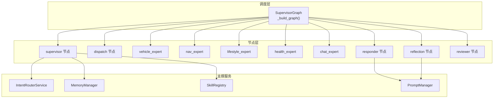
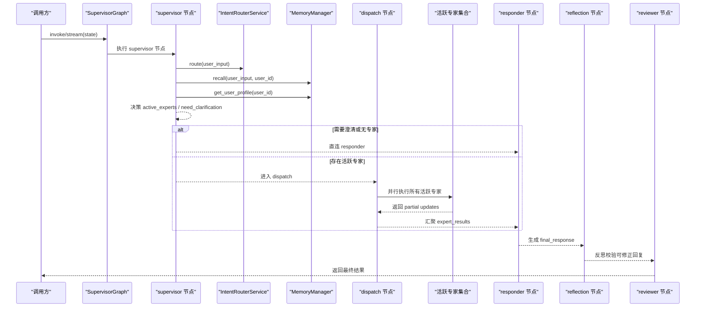
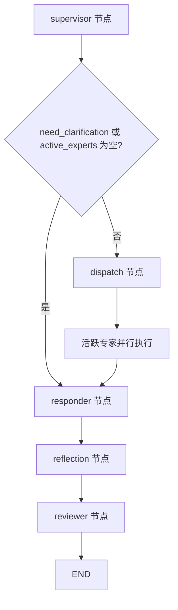
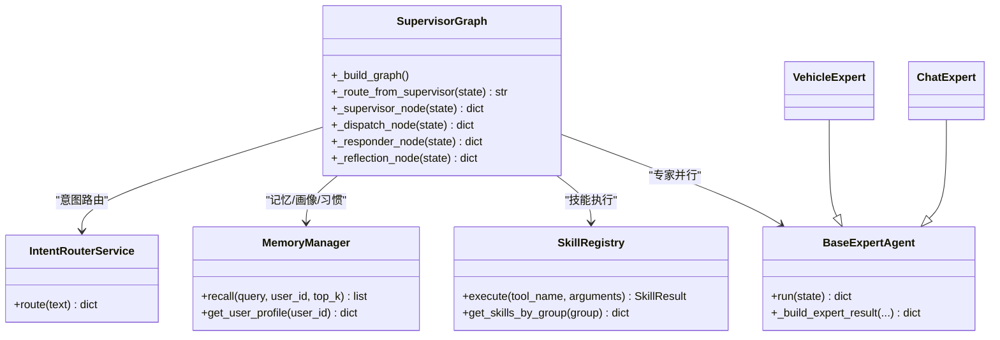

# Supervisor调度架构

<cite>
**本文引用的文件列表**
- [supervisor_graph.py](file://backend_design/nexus/agent/supervisor_graph.py)
- [state.py](file://backend_design/nexus/models/state.py)
- [responder.py](file://backend_design/nexus/agent/responder.py)
- [reviewer.py](file://backend_design/nexus/agent/reviewer.py)
- [base.py](file://backend_design/nexus/agent/experts/base.py)
- [vehicle_expert.py](file://backend_design/nexus/agent/experts/vehicle_expert.py)
- [chat_expert.py](file://backend_design/nexus/agent/experts/chat_expert.py)
- [router.py](file://backend_design/nexus/intent/router.py)
- [manager.py](file://backend_design/nexus/memory/manager.py)
- [registry.py](file://backend_design/nexus/skills/registry.py)
- [__init__.py (prompts)](file://backend_design/nexus/prompts/__init__.py)
</cite>

## 目录
1. [简介](#简介)
2. [项目结构](#项目结构)
3. [核心组件](#核心组件)
4. [架构总览](#架构总览)
5. [详细组件分析](#详细组件分析)
6. [依赖关系分析](#依赖关系分析)
7. [性能考量](#性能考量)
8. [故障排查指南](#故障排查指南)
9. [结论](#结论)
10. [附录：扩展指南与示例路径](#附录扩展指南与示例路径)

## 简介
本技术文档聚焦于 Supervisor 调度架构，深入解析基于 LangGraph StateGraph 的工作流编排机制。内容涵盖节点注册、条件路由、状态管理、专家并行分派、工具结果合成与反思校验等关键实现；并说明 v2.1 增强能力（记忆召回、用户画像加载、习惯注入）以及 v2.2 新增的 Tool→LLM 合成与反思自检流程。文末提供扩展新调度节点与路由规则的方法与参考路径。

## 项目结构
Supervisor 调度位于 agent 子模块中，围绕一个中心类构建有向图工作流，配合意图路由、记忆管理、技能注册与提示词模板共同协作。

图表来源
- [supervisor_graph.py:127-173](file://backend_design/nexus/agent/supervisor_graph.py#L127-L173)
- [router.py:78-115](file://backend_design/nexus/intent/router.py#L78-L115)
- [manager.py:95-140](file://backend_design/nexus/memory/manager.py#L95-L140)
- [registry.py:141-196](file://backend_design/nexus/skills/registry.py#L141-L196)
- [__init__.py (prompts):45-95](file://backend_design/nexus/prompts/__init__.py#L45-L95)

章节来源
- [supervisor_graph.py:127-173](file://backend_design/nexus/agent/supervisor_graph.py#L127-L173)

## 核心组件
- SupervisorGraph：基于 LangGraph StateGraph 构建工作流，负责节点注册、边定义、入口设置与编译。
- SupervisorState：共享状态模型，使用 Annotated reducer 支持多节点并行写入时的自动合并与累加。
- IntentRouterService：三级意图路由（启发式 → LLM → 默认闲聊），输出标准意图字典，驱动专家选择与澄清判断。
- MemoryManager：v2.1 记忆召回（GraphRAG 三路融合 + Rerank）、用户画像加载、习惯注入。
- SkillRegistry：技能注册中心，按组暴露给专家 Agent，统一执行接口。
- ResponderAgent / ReviewerAgent：最终响应生成与质量审查后处理。
- 专家基类 BaseExpertAgent：抽象 run/_execute，封装 _build_expert_result 以产出 partial update。

章节来源
- [supervisor_graph.py:69-126](file://backend_design/nexus/agent/supervisor_graph.py#L69-L126)
- [state.py:38-101](file://backend_design/nexus/models/state.py#L38-L101)
- [router.py:32-115](file://backend_design/nexus/intent/router.py#L32-L115)
- [manager.py:41-140](file://backend_design/nexus/memory/manager.py#L41-L140)
- [registry.py:35-196](file://backend_design/nexus/skills/registry.py#L35-L196)
- [responder.py:35-109](file://backend_design/nexus/agent/responder.py#L35-L109)
- [reviewer.py:26-79](file://backend_design/nexus/agent/reviewer.py#L26-L79)
- [base.py:26-133](file://backend_design/nexus/agent/experts/base.py#L26-L133)

## 架构总览
下图展示了从 supervisor 到 END 的完整流程，包括条件路由、专家并行、Responder 汇总、Reflection 反思与 Reviewer 审查。

图表来源
- [supervisor_graph.py:127-173](file://backend_design/nexus/agent/supervisor_graph.py#L127-L173)
- [supervisor_graph.py:175-283](file://backend_design/nexus/agent/supervisor_graph.py#L175-L283)
- [supervisor_graph.py:326-399](file://backend_design/nexus/agent/supervisor_graph.py#L326-L399)
- [supervisor_graph.py:401-450](file://backend_design/nexus/agent/supervisor_graph.py#L401-L450)
- [supervisor_graph.py:534-675](file://backend_design/nexus/agent/supervisor_graph.py#L534-L675)
- [reviewer.py:36-79](file://backend_design/nexus/agent/reviewer.py#L36-L79)

## 详细组件分析

### 1) 有向图构建与节点注册
- 入口与节点注册：在 _build_graph() 中通过 add_node 注册 supervisor、各专家、dispatch、responder、reflection、reviewer 节点，并 set_entry_point("supervisor")。
- 条件边：supervisor 通过 add_conditional_edges 与 _route_from_supervisor 决定走 dispatch 还是直接 responder。
- 专家汇聚：dispatch 节点并行执行活跃专家，将结果合并后进入 responder。
- 后续链路：responder → reflection → reviewer → END。

图表来源
- [supervisor_graph.py:127-173](file://backend_design/nexus/agent/supervisor_graph.py#L127-L173)
- [supervisor_graph.py:175-182](file://backend_design/nexus/agent/supervisor_graph.py#L175-L182)

章节来源
- [supervisor_graph.py:127-173](file://backend_design/nexus/agent/supervisor_graph.py#L127-L173)

### 2) 条件路由逻辑 _route_from_supervisor()
- 若 need_clarification 为真，则直连 responder（用于澄清提问）。
- 若 active_experts 为空，也直连 responder（兜底闲聊）。
- 否则返回 dispatch，进入专家并行阶段。

章节来源
- [supervisor_graph.py:175-182](file://backend_design/nexus/agent/supervisor_graph.py#L175-L182)

### 3) Supervisor 节点：记忆召回、用户画像、意图路由与专家决策
- 并行执行三项任务：
  - 记忆召回：调用 MemoryManager.recall(user_input, user_id, top_k)，返回格式化记忆字符串列表。
  - 用户画像加载：调用 MemoryManager.get_user_profile(user_id)。
  - 意图路由：调用 IntentRouterService.route(user_input)。
- 根据 intent 字段映射到活跃专家列表（如车控动作 → vehicle，导航 → navigation，搜索/点餐 → lifestyle，声纹注册 → chat，无匹配 → chat）。
- 若 need_clarification 为真，则不设置 active_experts，交由 responder 输出澄清提示。

章节来源
- [supervisor_graph.py:183-283](file://backend_design/nexus/agent/supervisor_graph.py#L183-L283)
- [supervisor_graph.py:285-324](file://backend_design/nexus/agent/supervisor_graph.py#L285-L324)

### 4) 专家并行分派 _dispatch_node()
- 读取 active_experts，遍历对应专家实例，使用 asyncio.gather 并行执行 run(state)。
- 合并各专家的 partial updates：
  - expert_results 通过 reducer 自动累加。
  - skill_action / skill_handled / search_context 取最后一个非空值。
  - tool_result 提升到顶层 state，供 Responder 做 Tool→LLM 合成与反思校验。
  - metadata 合并。
- 确保 skill_handled 等关键字段具备默认值。

章节来源
- [supervisor_graph.py:326-399](file://backend_design/nexus/agent/supervisor_graph.py#L326-L399)

### 5) Responder 节点：分支策略与 Tool→LLM 合成
- 分支 A：需要澄清时，直接返回 clarification_prompt。
- 分支 B：专家已处理：
  - 搜索类：使用专用 search 提示词组织回答。
  - 工具结构化数据：调用 _synthesize_tool_response 进行 Tool→LLM 合成。
  - 简单车控指令：直接使用工具返回的自然语言消息。
- 分支 C：LLM 闲聊兜底。
- 更新 history 与元数据。

章节来源
- [supervisor_graph.py:401-450](file://backend_design/nexus/agent/supervisor_graph.py#L401-L450)
- [supervisor_graph.py:452-533](file://backend_design/nexus/agent/supervisor_graph.py#L452-L533)

### 6) Reflection 节点：反思校验与自我批评
- 当配置关闭反思时，仅做轻量检查与幻觉兜底。
- 有工具数据时：
  - 构造反思提示，要求 LLM 输出 JSON（valid/reason/suggested_response）。
  - 若 valid=false，应用 suggested_response 作为修正后的 final_response。
- 搜索类回复：额外进行时效性与事实性检查。
- 记录 reflection_result 与延迟信息。

章节来源
- [supervisor_graph.py:534-675](file://backend_design/nexus/agent/supervisor_graph.py#L534-L675)
- [supervisor_graph.py:677-752](file://backend_design/nexus/agent/supervisor_graph.py#L677-L752)

### 7) Reviewer 节点：质量检查与后台记忆存储
- 若 final_response 为空或过短，填充备选回复。
- 触发异步记忆存储（进程内异步，fire-and-forget）。
- 计算总延迟并写入 latency_ms 与 total_latency_ms。

章节来源
- [reviewer.py:36-79](file://backend_design/nexus/agent/reviewer.py#L36-L79)

### 8) SupervisorState 状态模型设计（含 v2.1 增强）
- 输入字段：user_input、user_id、session_id、cockpit_id（多租户隔离键）。
- 记忆相关：recalled_memories（list 累加）、memory_str、habits_str（v2.1 习惯注入）、user_profile。
- 路由与分派：intent、intent_source、need_clarification、clarification_prompt、active_experts、query_type。
- 专家输出：expert_results（list 累加）、search_context、tool_result（v2.2 工具结果）。
- 对话与输出：history（list 累加）、running_summary、llm_response、final_response、metadata（dict 合并）。
- 可观测性：trace_id、span_ids（dict 合并）、latency_ms。
- 初始状态创建：create_initial_state 提供安全默认值，避免 reducer 字段未初始化问题。

章节来源
- [state.py:38-101](file://backend_design/nexus/models/state.py#L38-L101)
- [state.py:110-161](file://backend_design/nexus/models/state.py#L110-L161)

### 9) 意图路由与专家决策细节
- 三级路由：启发式规则（快速命中常见车控）→ LLM 语义理解（复杂/模糊）→ 默认闲聊。
- 输出标准意图字典包含各技能动作字段与澄清标记。
- 专家决策依据意图字段映射到活跃专家集合。

章节来源
- [router.py:78-115](file://backend_design/nexus/intent/router.py#L78-L115)
- [router.py:136-292](file://backend_design/nexus/intent/router.py#L136-L292)
- [supervisor_graph.py:285-324](file://backend_design/nexus/agent/supervisor_graph.py#L285-L324)

### 10) 记忆召回、用户画像与习惯注入（v2.1）
- GraphRAG 三路召回（向量+图谱+BM25）+ Rerank 重排。
- 渐进式披露：根据查询复杂度动态调整 top_k。
- 用户画像：从 Neo4j 图谱获取 relations 等信息。
- 习惯注入：从 MySQL user_habits 表加载高频偏好，格式化为记忆字符串。

章节来源
- [manager.py:95-140](file://backend_design/nexus/memory/manager.py#L95-L140)
- [manager.py:175-202](file://backend_design/nexus/memory/manager.py#L175-L202)
- [manager.py:389-391](file://backend_design/nexus/memory/manager.py#L389-L391)

### 11) 专家基类与具体专家实现
- BaseExpertAgent：
  - is_active：检查是否在 active_experts 中。
  - run：包装执行、异常捕获、延迟统计。
  - _build_expert_result：统一输出 partial update，并在 handled 时将 tool_result 提升到顶层。
- VehicleExpert：
  - 将 intent 中的车控动作映射到具体技能名，调用 SkillRegistry.execute。
- ChatExpert：
  - 处理声纹注册与纯闲聊（不标记 handled 时由 Responder 走 LLM 分支）。

章节来源
- [base.py:26-133](file://backend_design/nexus/agent/experts/base.py#L26-L133)
- [vehicle_expert.py:33-63](file://backend_design/nexus/agent/experts/vehicle_expert.py#L33-L63)
- [chat_expert.py:24-56](file://backend_design/nexus/agent/experts/chat_expert.py#L24-L56)

### 12) 提示词模板管理
- PromptManager 从 prompts 目录加载 .md 模板，支持变量注入与版本读取。
- 在 Responder 与 Reflection 中使用不同模板（如 search、chat、vehicle 等）。

章节来源
- [__init__.py (prompts):45-95](file://backend_design/nexus/prompts/__init__.py#L45-L95)
- [supervisor_graph.py:754-800](file://backend_design/nexus/agent/supervisor_graph.py#L754-L800)

## 依赖关系分析
- SupervisorGraph 依赖：
  - IntentRouterService：意图识别与澄清判断。
  - MemoryManager：记忆召回、用户画像、习惯注入。
  - SkillRegistry：技能发现与执行。
  - ResponderAgent / ReviewerAgent：最终响应与质量审查。
  - PromptManager：模板渲染。
- 专家依赖：
  - BaseExpertAgent 依赖 SkillRegistry 与 SupervisorState。
  - 具体专家（VehicleExpert、ChatExpert）通过 registry.execute 调用底层技能。
- 记忆系统依赖：
  - MilvusVectorStore、Neo4jGraphStore、Reranker、GraphRAGRetriever。

图表来源
- [supervisor_graph.py:127-173](file://backend_design/nexus/agent/supervisor_graph.py#L127-L173)
- [router.py:78-115](file://backend_design/nexus/intent/router.py#L78-L115)
- [manager.py:95-140](file://backend_design/nexus/memory/manager.py#L95-L140)
- [registry.py:141-196](file://backend_design/nexus/skills/registry.py#L141-L196)
- [base.py:26-133](file://backend_design/nexus/agent/experts/base.py#L26-L133)
- [vehicle_expert.py:33-63](file://backend_design/nexus/agent/experts/vehicle_expert.py#L33-L63)
- [chat_expert.py:24-56](file://backend_design/nexus/agent/experts/chat_expert.py#L24-L56)

章节来源
- [supervisor_graph.py:127-173](file://backend_design/nexus/agent/supervisor_graph.py#L127-L173)
- [base.py:26-133](file://backend_design/nexus/agent/experts/base.py#L26-L133)

## 性能考量
- 并行化优化：
  - Supervisor 节点内记忆召回、用户画像加载、意图路由三任务并行执行，显著降低端到端延迟。
  - 专家并行通过 asyncio.gather 同时执行，减少串行等待。
- 渐进式记忆召回：
  - 根据查询复杂度动态调整 top_k，简单指令快速返回，复杂查询深度召回。
- 降级与容错：
  - 反思开关 REFLECTION_ENABLED 控制是否执行 LLM 反思，避免不必要的调用。
  - 云端 LLM 失败时降级到本地 LLM（Responder 内置 fallback）。
  - 工具返回失败/未知结果时跳过 LLM 合成，直接返回原始消息，防止编造。

[本节为通用指导，无需特定文件引用]

## 故障排查指南
- 意图路由失败：
  - 检查 Heuristic 与 LLM 路由是否启用，确认 tool_catalog 与最小置信度阈值。
  - 关注 Route_Source 与 Need_Clarification 字段，定位是否需要澄清。
- 记忆召回异常：
  - 查看 GraphRAG 三路召回是否可用，必要时回退到向量检索。
  - 检查 MySQL user_habits 连接与数据完整性。
- 专家执行异常：
  - 观察 expert_results 中的 error 字段与 metadata 中的错误键。
  - 确认 SkillRegistry 是否正确注册与实例化。
- 反思校验异常：
  - 检查反射提示词与 JSON 解析逻辑，确认 LLM 返回格式。
  - 若禁用反思，仍需关注幻觉兜底检查是否生效。
- 最终响应为空：
  - Reviewer 会填充备选回复，但需检查上游分支是否被正确触发。

章节来源
- [router.py:78-115](file://backend_design/nexus/intent/router.py#L78-L115)
- [manager.py:117-140](file://backend_design/nexus/memory/manager.py#L117-L140)
- [supervisor_graph.py:326-399](file://backend_design/nexus/agent/supervisor_graph.py#L326-L399)
- [supervisor_graph.py:534-675](file://backend_design/nexus/agent/supervisor_graph.py#L534-L675)
- [reviewer.py:36-79](file://backend_design/nexus/agent/reviewer.py#L36-L79)

## 结论
Supervisor 调度架构通过 LangGraph StateGraph 实现了清晰、可扩展的多智能体编排：supervisor 负责记忆与意图理解，dispatch 并行调度专家，responder 汇总输出，reflection 进行事实性与一致性校验，reviewer 完成质量把关与延迟统计。v2.1 的记忆与画像增强提升了个性化体验，v2.2 的工具合成与反思机制进一步保障了输出的准确性与安全性。整体设计具备良好的可观测性与容错能力，适合车载语音助手等高可靠场景。

[本节为总结性内容，无需特定文件引用]

## 附录：扩展指南与示例路径
- 新增调度节点：
  - 在 _build_graph() 中通过 add_node 注册新节点函数。
  - 在合适的时机通过 add_edge 或 add_conditional_edges 接入图。
  - 参考路径：[supervisor_graph.py:127-173](file://backend_design/nexus/agent/supervisor_graph.py#L127-L173)
- 新增路由规则：
  - 在 _determine_experts() 中增加意图字段到专家名称的映射。
  - 在 IntentRouterService 中扩展工具名到意图字段的转换。
  - 参考路径：
    - [supervisor_graph.py:285-324](file://backend_design/nexus/agent/supervisor_graph.py#L285-L324)
    - [router.py:168-292](file://backend_design/nexus/intent/router.py#L168-L292)
- 新增专家 Agent：
  - 继承 BaseExpertAgent，实现 _execute(state) 并返回 partial update。
  - 在 SupervisorGraph.__init__ 中注册该专家实例。
  - 参考路径：
    - [base.py:85-133](file://backend_design/nexus/agent/experts/base.py#L85-L133)
    - [vehicle_expert.py:33-63](file://backend_design/nexus/agent/experts/vehicle_expert.py#L33-L63)
    - [supervisor_graph.py:102-126](file://backend_design/nexus/agent/supervisor_graph.py#L102-L126)
- 新增技能：
  - 使用 @register_skill 装饰器或在 _register_legacy_skills 中兼容注册。
  - 通过 SkillRegistry.execute 执行，返回 SkillResult。
  - 参考路径：
    - [registry.py:97-140](file://backend_design/nexus/skills/registry.py#L97-L140)
    - [registry.py:171-196](file://backend_design/nexus/skills/registry.py#L171-L196)
- 扩展提示词模板：
  - 在 prompts 目录新增 .md 模板，并通过 PromptManager.render 注入变量。
  - 参考路径：
    - [__init__.py (prompts):45-95](file://backend_design/nexus/prompts/__init__.py#L45-L95)
    - [supervisor_graph.py:754-800](file://backend_design/nexus/agent/supervisor_graph.py#L754-L800)

章节来源
- [supervisor_graph.py:127-173](file://backend_design/nexus/agent/supervisor_graph.py#L127-L173)
- [supervisor_graph.py:285-324](file://backend_design/nexus/agent/supervisor_graph.py#L285-L324)
- [router.py:168-292](file://backend_design/nexus/intent/router.py#L168-L292)
- [base.py:85-133](file://backend_design/nexus/agent/experts/base.py#L85-L133)
- [vehicle_expert.py:33-63](file://backend_design/nexus/agent/experts/vehicle_expert.py#L33-L63)
- [registry.py:97-140](file://backend_design/nexus/skills/registry.py#L97-L140)
- [registry.py:171-196](file://backend_design/nexus/skills/registry.py#L171-L196)
- [__init__.py (prompts):45-95](file://backend_design/nexus/prompts/__init__.py#L45-L95)
- [supervisor_graph.py:754-800](file://backend_design/nexus/agent/supervisor_graph.py#L754-L800)