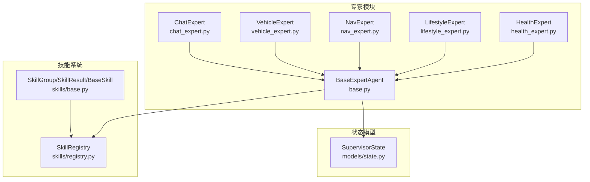
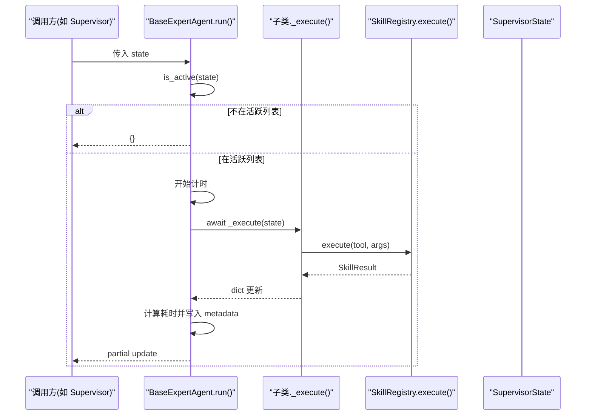
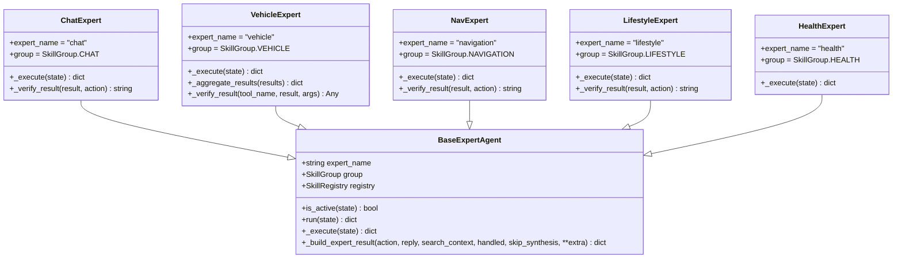
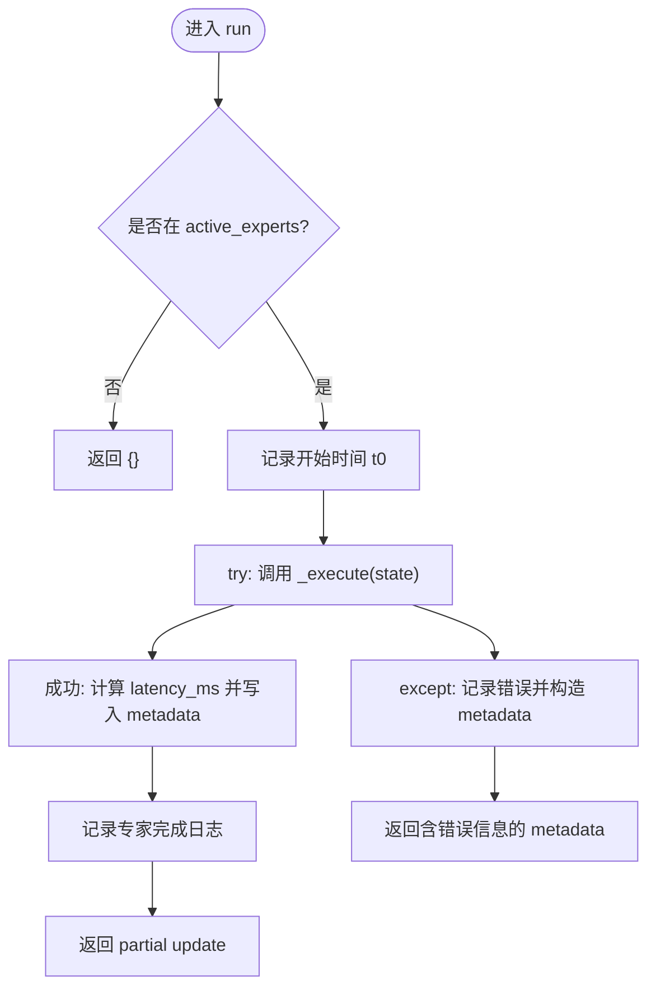
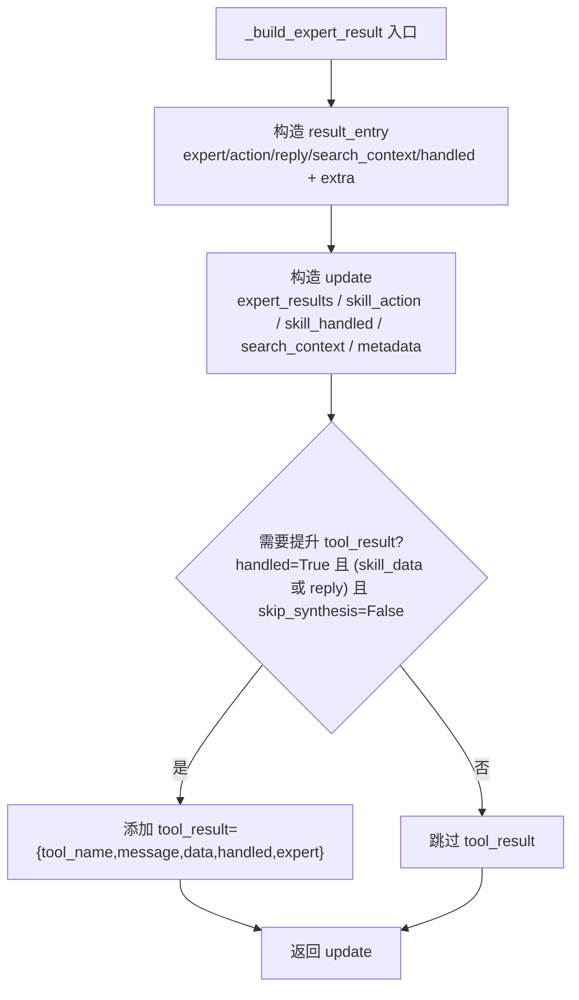
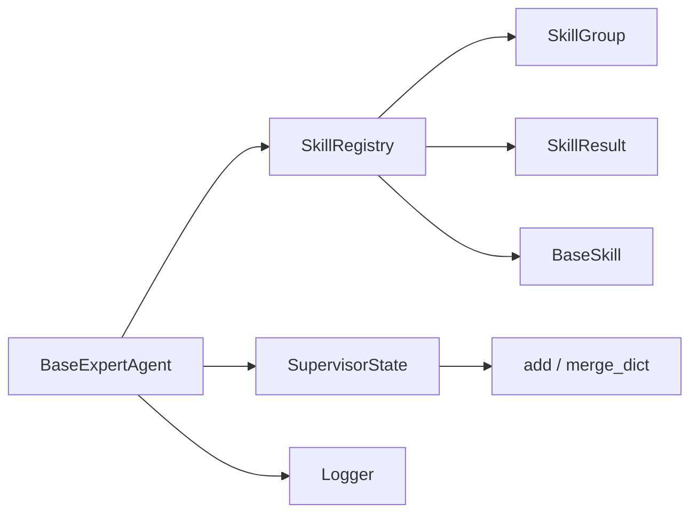

# BaseExpertAgent基类

<cite>
**本文引用的文件**   
- [base.py](file://backend_design/nexus/agent/experts/base.py)
- [__init__.py](file://backend_design/nexus/agent/experts/__init__.py)
- [chat_expert.py](file://backend_design/nexus/agent/experts/chat_expert.py)
- [vehicle_expert.py](file://backend_design/nexus/agent/experts/vehicle_expert.py)
- [nav_expert.py](file://backend_design/nexus/agent/experts/nav_expert.py)
- [lifestyle_expert.py](file://backend_design/nexus/agent/experts/lifestyle_expert.py)
- [health_expert.py](file://backend_design/nexus/agent/experts/health_expert.py)
- [state.py](file://backend_design/nexus/models/state.py)
- [base.py](file://backend_design/nexus/skills/base.py)
- [registry.py](file://backend_design/nexus/skills/registry.py)
</cite>

## 目录
1. [简介](#简介)
2. [项目结构](#项目结构)
3. [核心组件](#核心组件)
4. [架构总览](#架构总览)
5. [详细组件分析](#详细组件分析)
6. [依赖关系分析](#依赖关系分析)
7. [性能考量](#性能考量)
8. [故障排查指南](#故障排查指南)
9. [结论](#结论)
10. [附录：自定义专家 Agent 开发指南](#附录自定义专家-agent-开发指南)

## 简介
本文件为 BaseExpertAgent 抽象基类的技术文档，面向希望扩展或实现“专家 Agent”的开发者。内容涵盖：
- 设计模式与扩展机制（expert_name、group、registry）
- run() 执行流程、异常处理与性能监控
- _execute() 抽象方法的设计意图与子类实现规范
- _build_expert_result() 如何构建标准化的 partial state update（expert_results、metadata、tool_result 提升）
- 创建自定义专家 Agent 的完整指南（接口定义、状态管理、错误处理最佳实践）

## 项目结构
BaseExpertAgent 位于 agent/experts 模块，作为所有专家 Agent 的统一基类；各具体专家通过继承该基类实现各自领域逻辑。技能系统由 skills 模块提供注册中心与统一结果模型，SupervisorState 定义了多智能体共享状态及 reducer 行为。

图表来源
- [base.py:26-87](file://backend_design/nexus/agent/experts/base.py#L26-L87)
- [chat_expert.py:24-71](file://backend_design/nexus/agent/experts/chat_expert.py#L24-L71)
- [vehicle_expert.py:43-116](file://backend_design/nexus/agent/experts/vehicle_expert.py#L43-L116)
- [nav_expert.py:26-82](file://backend_design/nexus/agent/experts/nav_expert.py#L26-L82)
- [lifestyle_expert.py:24-173](file://backend_design/nexus/agent/experts/lifestyle_expert.py#L24-L173)
- [health_expert.py:24-74](file://backend_design/nexus/agent/experts/health_expert.py#L24-L74)
- [base.py:35-114](file://backend_design/nexus/skills/base.py#L35-L114)
- [registry.py:36-108](file://backend_design/nexus/skills/registry.py#L36-L108)
- [state.py:38-106](file://backend_design/nexus/models/state.py#L38-L106)

章节来源
- [__init__.py:22-36](file://backend_design/nexus/agent/experts/__init__.py#L22-L36)

## 核心组件
- BaseExpertAgent：专家 Agent 的抽象基类，封装通用执行流程、性能监控、异常处理与标准化输出构建。
- SkillRegistry：技能注册中心，负责自动发现与手动注册技能，提供 execute()/execute_batch() 等执行入口。
- SupervisorState：多智能体共享状态，使用 Annotated + reducer 实现列表累加与字典合并。
- SkillGroup/SkillResult：技能分组枚举与统一结果模型，用于专家与技能之间的契约。

章节来源
- [base.py:26-87](file://backend_design/nexus/agent/experts/base.py#L26-L87)
- [registry.py:36-108](file://backend_design/nexus/skills/registry.py#L36-L108)
- [state.py:38-106](file://backend_design/nexus/models/state.py#L38-L106)
- [base.py:35-114](file://backend_design/nexus/skills/base.py#L35-L114)

## 架构总览
BaseExpertAgent.run() 是 LangGraph 节点函数，接收完整的 SupervisorState，返回 partial state update。其核心流程包括：
- 活跃性检查：仅当 expert_name 在 active_experts 中时执行
- 性能计时：使用 perf_counter 统计耗时并写入 metadata
- 执行委托：调用子类实现的 _execute()
- 异常兜底：捕获异常并记录错误信息到 metadata
- 标准化输出：通过 _build_expert_result() 生成 expert_results、metadata、skill_action/handled、search_context，并在条件满足时提升 tool_result 供 Responder 合成与反思

图表来源
- [base.py:48-83](file://backend_design/nexus/agent/experts/base.py#L48-L83)
- [registry.py:222-286](file://backend_design/nexus/skills/registry.py#L222-L286)
- [state.py:38-106](file://backend_design/nexus/models/state.py#L38-L106)

## 详细组件分析

### BaseExpertAgent 基类
- 属性
  - expert_name：专家名称，用于日志和 active_experts 匹配
  - group：技能分组（对应 SkillGroup），用于按组筛选技能
  - registry：技能注册中心实例，用于调用具体技能
- 关键方法
  - is_active(state)：判断是否被 Supervisor 分派执行
  - run(state)：执行入口，包含计时、异常处理、日志与 metadata 注入
  - _execute(state)：抽象方法，子类必须实现
  - _build_expert_result(...)：构建标准化 partial state update，支持 tool_result 提升

图表来源
- [base.py:26-140](file://backend_design/nexus/agent/experts/base.py#L26-L140)
- [chat_expert.py:24-71](file://backend_design/nexus/agent/experts/chat_expert.py#L24-L71)
- [vehicle_expert.py:43-116](file://backend_design/nexus/agent/experts/vehicle_expert.py#L43-L116)
- [nav_expert.py:26-82](file://backend_design/nexus/agent/experts/nav_expert.py#L26-L82)
- [lifestyle_expert.py:24-173](file://backend_design/nexus/agent/experts/lifestyle_expert.py#L24-L173)
- [health_expert.py:24-74](file://backend_design/nexus/agent/experts/health_expert.py#L24-L74)

章节来源
- [base.py:26-140](file://backend_design/nexus/agent/experts/base.py#L26-L140)

### run() 执行流程与异常处理
- 活跃性检查：若不在 active_experts，直接返回空字典（no-op）
- 性能监控：perf_counter 计时，将 latency_ms 写入 metadata
- 执行委托：await self._execute(state)
- 异常处理：捕获 Exception，记录错误并返回包含 {expert_name}_error 与 {expert_name}_latency_ms 的 metadata
- 日志输出：记录 handled、action、latency 等信息

图表来源
- [base.py:48-83](file://backend_design/nexus/agent/experts/base.py#L48-L83)

章节来源
- [base.py:48-83](file://backend_design/nexus/agent/experts/base.py#L48-L83)

### _build_expert_result() 标准化输出构建
- 输入参数
  - action：动作名（工具名）
  - reply：回复消息
  - search_context：搜索上下文
  - handled：是否被处理
  - skip_synthesis：是否跳过 LLM 合成（车控指令通常设为 True）
  - extra：额外字段（如 skill_data、skill_status 等）
- 输出结构
  - expert_results：列表项包含 expert/action/reply/search_context/handled 以及 extra 中的字段
  - skill_action/skill_handled/search_context：兼容旧版字段
  - metadata：包含 {expert_name}_action/{expert_name}_handled 等键
  - tool_result：当 handled=True 且未设置 skip_synthesis，且存在 skill_data 或 reply 时，提升到顶层 state，供 Responder 做 Tool→LLM 合成与反思校验

图表来源
- [base.py:89-139](file://backend_design/nexus/agent/experts/base.py#L89-L139)

章节来源
- [base.py:89-139](file://backend_design/nexus/agent/experts/base.py#L89-L139)

### 具体专家实现要点

#### ChatExpert（闲聊专家）
- 职责：处理声纹注册与纯 LLM 闲聊
- 特点：
  - 声纹注册：调用 register_voice 技能，返回 handled=True 的消息
  - 纯闲聊：不标记 handled，让 Responder 走 LLM 分支
- 验证：_verify_result 检查 status 与 message 有效性

章节来源
- [chat_expert.py:24-71](file://backend_design/nexus/agent/experts/chat_expert.py#L24-L71)

#### VehicleExpert（车控专家）
- 职责：处理空调/车窗/座椅/媒体/状态查询，支持多动作并行与互斥检测
- 特点：
  - 收集 intent 字段映射到具体工具
  - 沙箱审查与安全拦截
  - 并行执行独立动作，互斥组内串行执行
  - 聚合结果为 expert_results 列表，并决定是否提升 tool_result（车控通常 skip_synthesis=True）
- 验证：_verify_result 对温度、车窗位置、媒体播放进行一致性校验

章节来源
- [vehicle_expert.py:43-116](file://backend_design/nexus/agent/experts/vehicle_expert.py#L43-L116)
- [vehicle_expert.py:246-325](file://backend_design/nexus/agent/experts/vehicle_expert.py#L246-L325)
- [vehicle_expert.py:327-428](file://backend_design/nexus/agent/experts/vehicle_expert.py#L327-L428)

#### NavExpert（导航专家）
- 职责：目的地设置、路线规划、当前位置查询
- 特点：
  - 查询位置时从车辆适配器缓存注入 GPS 坐标，避免 IP 定位超时
  - 调用 vehicle_navigation 技能并验证结果

章节来源
- [nav_expert.py:26-82](file://backend_design/nexus/agent/experts/nav_expert.py#L26-L82)

#### LifestyleExpert（生活推荐专家）
- 职责：联网搜索、外卖点餐、本地生活推荐
- 特点：
  - 原子任务并行执行（POI 搜索、天气、搜索、点餐、提醒）
  - 天气与搜索互斥，避免重复查询
  - 聚合 expert_results 与 search_context，选择第一个 handled=True 的结果作为主结果

章节来源
- [lifestyle_expert.py:24-173](file://backend_design/nexus/agent/experts/lifestyle_expert.py#L24-L173)
- [lifestyle_expert.py:186-256](file://backend_design/nexus/agent/experts/lifestyle_expert.py#L186-L256)

#### HealthExpert（车辆健康专家）
- 职责：故障诊断、故障码翻译、保养建议
- 特点：根据 Health_Action.skill 路由到不同技能，默认 fallback 到 diagnose_vehicle

章节来源
- [health_expert.py:24-74](file://backend_design/nexus/agent/experts/health_expert.py#L24-L74)

## 依赖关系分析
- BaseExpertAgent 依赖：
  - SkillRegistry：通过 registry.execute() 调用具体技能
  - SupervisorState：读取 intent、active_experts、cockpit_id 等上下文
  - Logger：记录执行日志与异常
- 技能系统：
  - SkillGroup：分组标识（vehicle/navigation/lifestyle/health/chat）
  - SkillResult：统一结果模型（status/message/data/error/action/handled）
  - BaseSkill：技能基类，to_structured_tool() 适配 LangChain
- 状态模型：
  - SupervisorState：使用 Annotated[list, add] 与 Annotated[dict, merge_dict] 实现 reducer 行为

图表来源
- [base.py:26-87](file://backend_design/nexus/agent/experts/base.py#L26-L87)
- [registry.py:36-108](file://backend_design/nexus/skills/registry.py#L36-L108)
- [base.py:35-114](file://backend_design/nexus/skills/base.py#L35-L114)
- [state.py:38-106](file://backend_design/nexus/models/state.py#L38-L106)

章节来源
- [base.py:26-87](file://backend_design/nexus/agent/experts/base.py#L26-L87)
- [registry.py:36-108](file://backend_design/nexus/skills/registry.py#L36-L108)
- [base.py:35-114](file://backend_design/nexus/skills/base.py#L35-L114)
- [state.py:38-106](file://backend_design/nexus/models/state.py#L38-L106)

## 性能考量
- 计时与监控：run() 使用 perf_counter 统计延迟并写入 metadata.latency_ms
- 并发执行：
  - VehicleExpert：独立动作并行，互斥组内串行，避免硬件冲突
  - LifestyleExpert：原子任务 asyncio.gather 并行执行
- 超时与重试：SkillRegistry.execute() 内置超时保护与瞬时故障重试（最多 _MAX_RETRIES+1 次）
- 副作用控制：车控类技能 has_side_effect=True，禁止语义缓存命中导致的安全问题

章节来源
- [base.py:48-83](file://backend_design/nexus/agent/experts/base.py#L48-L83)
- [vehicle_expert.py:117-177](file://backend_design/nexus/agent/experts/vehicle_expert.py#L117-L177)
- [lifestyle_expert.py:174-184](file://backend_design/nexus/agent/experts/lifestyle_expert.py#L174-L184)
- [registry.py:222-286](file://backend_design/nexus/skills/registry.py#L222-L286)
- [state.py:88-91](file://backend_design/nexus/models/state.py#L88-L91)

## 故障排查指南
- 常见异常来源
  - 技能未找到：SkillRegistry.execute() 返回 error 并标注 skill_not_found
  - 超时：SkillRegistry 抛出 TimeoutError，记录警告并降级为失败
  - 沙箱拦截：VehicleExpert 的沙箱审查拒绝危险操作，记录 reason
  - 结果不一致：VehicleExpert._verify_result 检测到目标与实际不一致，返回错误提示
- 排查步骤
  - 查看 metadata 中的 {expert_name}_error 与 {expert_name}_latency_ms
  - 检查 logger 输出的警告与错误信息
  - 确认 active_experts 是否正确包含当前专家
  - 对于车控，检查沙箱审计日志与验证失败原因

章节来源
- [registry.py:222-286](file://backend_design/nexus/skills/registry.py#L222-L286)
- [vehicle_expert.py:76-116](file://backend_design/nexus/agent/experts/vehicle_expert.py#L76-L116)
- [vehicle_expert.py:327-428](file://backend_design/nexus/agent/experts/vehicle_expert.py#L327-L428)
- [base.py:76-83](file://backend_design/nexus/agent/experts/base.py#L76-L83)

## 结论
BaseExpertAgent 提供了统一的专家 Agent 框架，通过 run() 标准化执行流程、异常处理与性能监控，配合 _build_expert_result() 构建一致的 partial state update，使多专家协作与结果聚合变得简单可靠。结合 SkillRegistry 与 SupervisorState，可实现高内聚、低耦合的多智能体编排。

## 附录：自定义专家 Agent 开发指南
- 接口定义
  - 继承 BaseExpertAgent，设置 expert_name 与 group（对应 SkillGroup）
  - 实现 _execute(state) 方法，读取 state.intent 并调用 registry.execute()
  - 可选实现 _verify_result() 用于结果验证与错误修复
- 状态管理
  - 使用 _build_expert_result() 构建标准化输出，确保 expert_results、metadata、skill_action/handled/search_context 正确填充
  - 如需提升 tool_result，确保 handled=True 且未设置 skip_synthesis，并提供 reply 或 skill_data
- 错误处理最佳实践
  - 在 _execute() 中捕获异常并返回明确的 SkillResult.message
  - 利用 SkillRegistry.execute() 的超时与重试机制，避免外部服务慢响应阻塞
  - 对车控类操作进行一致性验证，防止“成功但实际未变更”的问题
- 示例参考
  - ChatExpert：声纹注册与纯闲聊
  - VehicleExpert：多动作并行与互斥检测
  - NavExpert：GPS 坐标注入与导航技能调用
  - LifestyleExpert：原子任务并行与互斥策略
  - HealthExpert：技能路由与默认回退

章节来源
- [base.py:26-140](file://backend_design/nexus/agent/experts/base.py#L26-L140)
- [chat_expert.py:24-71](file://backend_design/nexus/agent/experts/chat_expert.py#L24-L71)
- [vehicle_expert.py:43-116](file://backend_design/nexus/agent/experts/vehicle_expert.py#L43-L116)
- [nav_expert.py:26-82](file://backend_design/nexus/agent/experts/nav_expert.py#L26-L82)
- [lifestyle_expert.py:24-173](file://backend_design/nexus/agent/experts/lifestyle_expert.py#L24-L173)
- [health_expert.py:24-74](file://backend_design/nexus/agent/experts/health_expert.py#L24-L74)