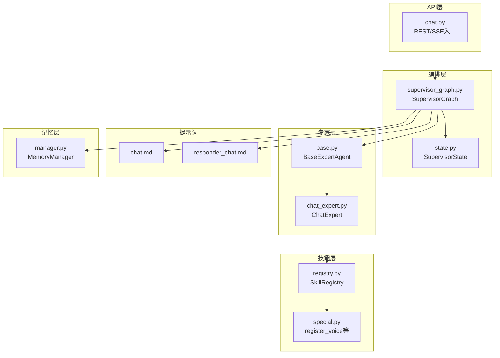
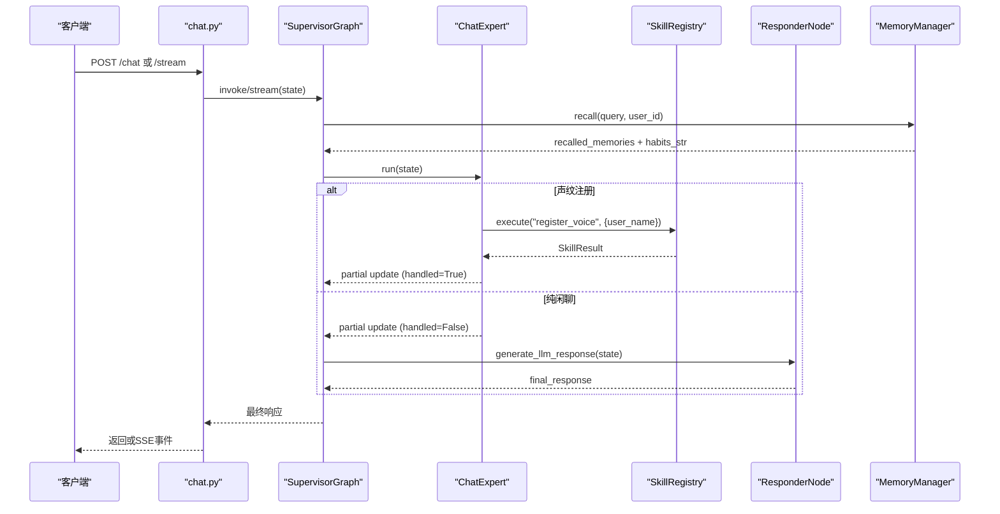
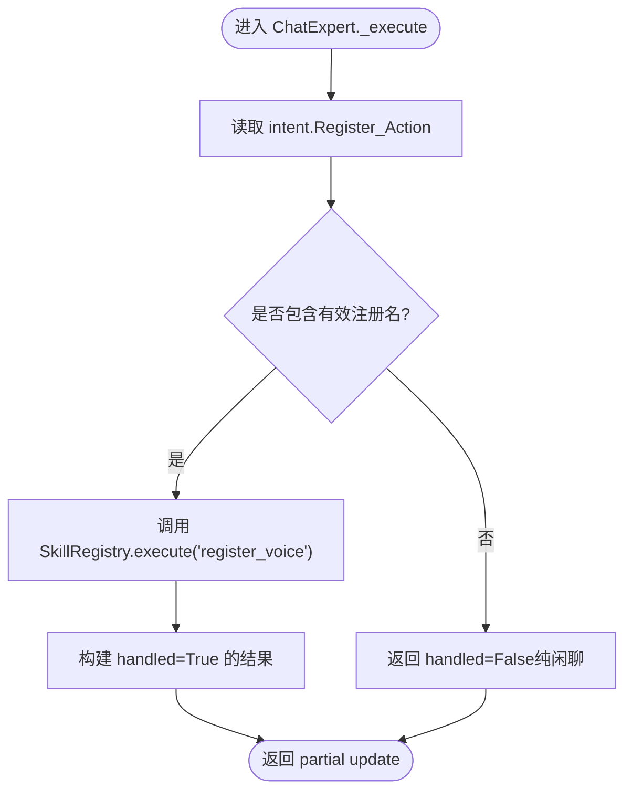
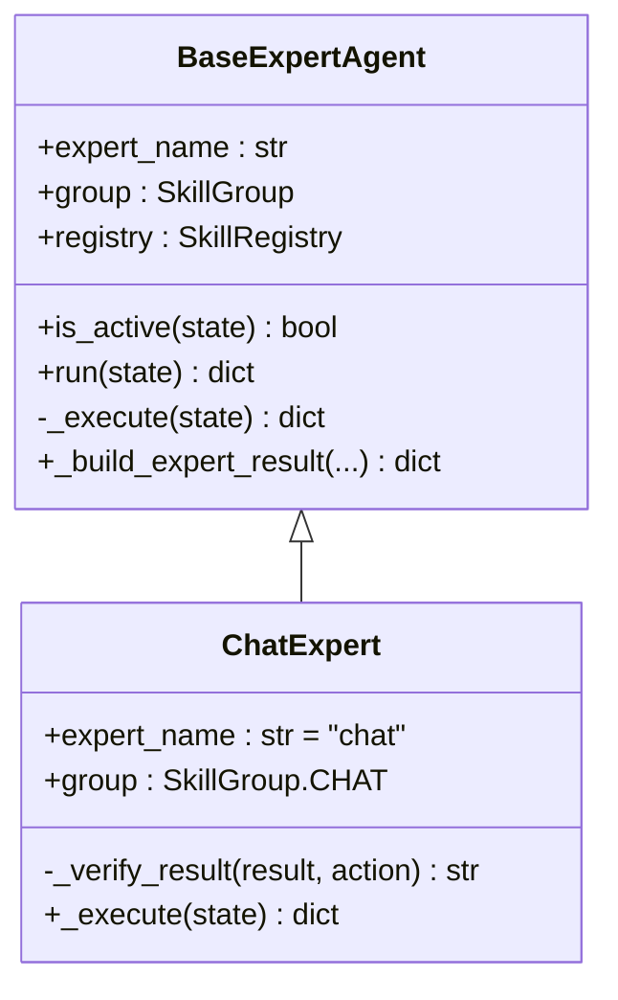
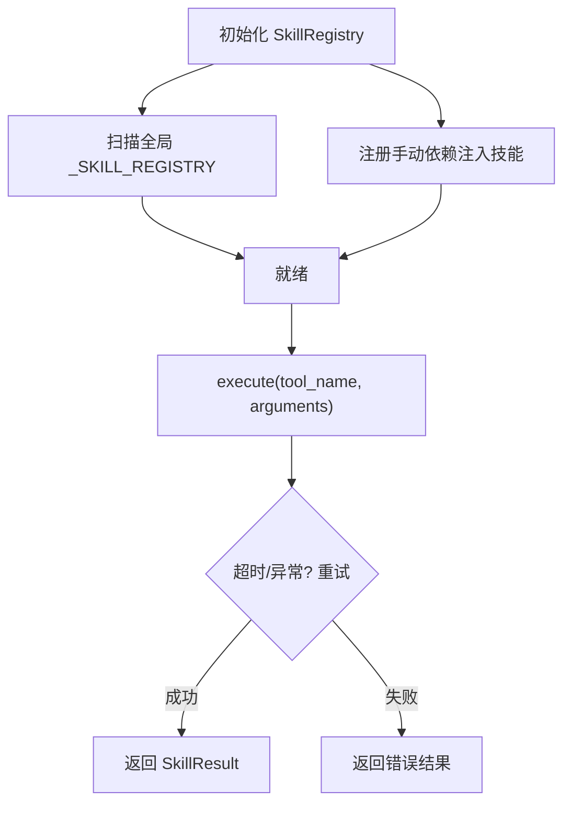
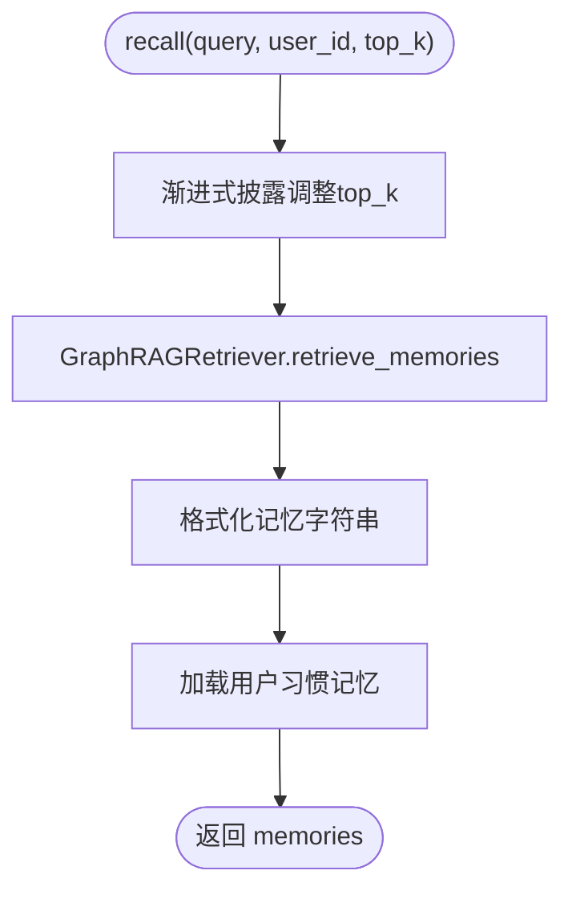
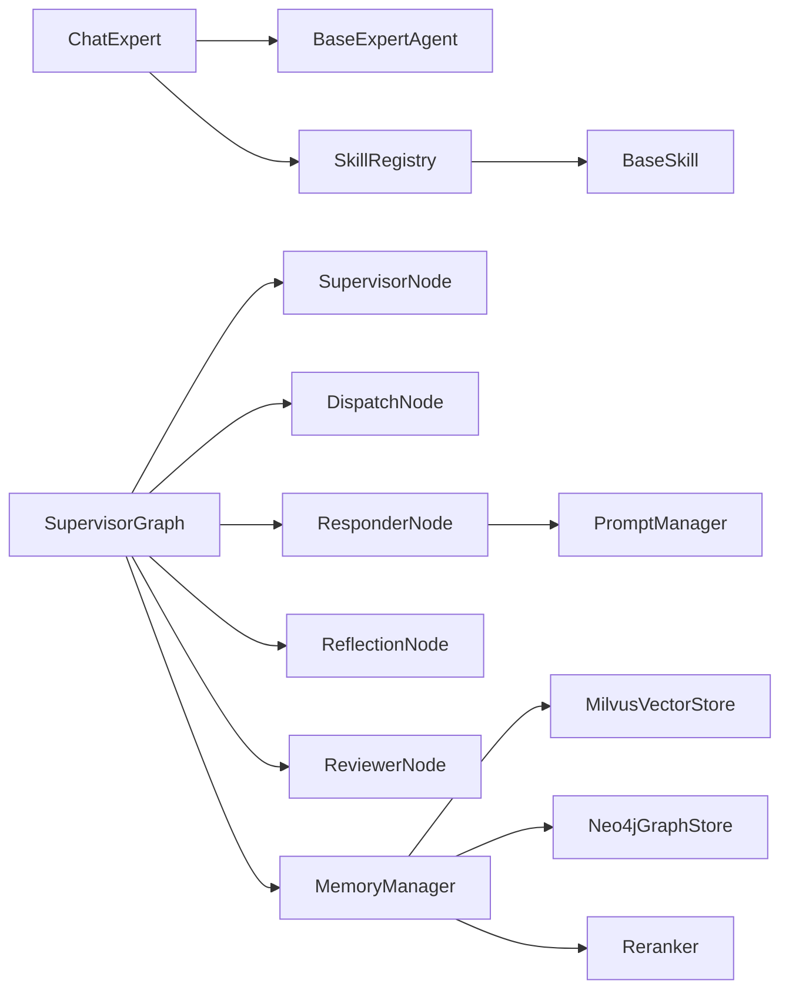

# ChatExpert聊天专家

<cite>
**本文引用的文件**   
- [chat_expert.py](file://backend_design/nexus/agent/experts/chat_expert.py)
- [base.py](file://backend_design/nexus/agent/experts/base.py)
- [registry.py](file://backend_design/nexus/skills/registry.py)
- [special.py](file://backend_design/nexus/skills/special.py)
- [state.py](file://backend_design/nexus/models/state.py)
- [supervisor_graph.py](file://backend_design/nexus/agent/supervisor_graph.py)
- [chat.md](file://backend_design/nexus/prompts/chat.md)
- [responder_chat.md](file://backend_design/nexus/prompts/responder_chat.md)
- [manager.py](file://backend_design/nexus/memory/manager.py)
- [chat.py](file://backend_design/nexus/api/routes/chat.py)
</cite>

## 目录
1. [简介](#简介)
2. [项目结构](#项目结构)
3. [核心组件](#核心组件)
4. [架构总览](#架构总览)
5. [详细组件分析](#详细组件分析)
6. [依赖关系分析](#依赖关系分析)
7. [性能与优化](#性能与优化)
8. [故障排查指南](#故障排查指南)
9. [结论](#结论)
10. [附录：扩展示例与配置](#附录扩展示例与配置)

## 简介
ChatExpert 是车载多智能体系统中的“闲聊专家”，负责处理通用对话、情感交流、知识问答等非业务特定任务，并在需要时调用声纹注册等聊天相关技能。其职责包括：
- 接收意图路由分派的闲聊请求，执行轻量验证与结果构建
- 通过 SkillRegistry 调用聊天类技能（如 register_voice）
- 将未命中技能的纯闲聊交由 Responder 走 LLM 分支生成自然语言回复
- 与记忆系统协作，注入用户画像、长期记忆与习惯，提升个性化响应质量
- 在多轮对话中维护状态，支持上下文敏感查询与复合指令聚合

## 项目结构
围绕 ChatExpert 的关键代码分布在以下模块：
- 专家层：BaseExpertAgent 抽象与 ChatExpert 实现
- 技能层：SkillRegistry 统一注册与执行，special.py 中的聊天相关技能
- 编排层：SupervisorGraph 工作流编排，决定何时进入 ChatExpert
- 提示词：chat.md、responder_chat.md 定义闲聊与合成策略
- 记忆层：MemoryManager 提供三路召回与渐进式披露
- 状态模型：SupervisorState 定义共享状态与 reducer
- API 层：chat.py 暴露 REST/SSE 接口，集成语义缓存与会话管理

**图表来源** 
- [chat.py:319-464](file://backend_design/nexus/api/routes/chat.py#L319-L464)
- [supervisor_graph.py:93-179](file://backend_design/nexus/agent/supervisor_graph.py#L93-L179)
- [state.py:38-107](file://backend_design/nexus/models/state.py#L38-L107)
- [base.py:26-87](file://backend_design/nexus/agent/experts/base.py#L26-L87)
- [chat_expert.py:24-71](file://backend_design/nexus/agent/experts/chat_expert.py#L24-L71)
- [registry.py:36-108](file://backend_design/nexus/skills/registry.py#L36-L108)
- [special.py:927-954](file://backend_design/nexus/skills/special.py#L927-L954)
- [chat.md:1-39](file://backend_design/nexus/prompts/chat.md#L1-L39)
- [responder_chat.md:1-3](file://backend_design/nexus/prompts/responder_chat.md#L1-L3)
- [manager.py:38-100](file://backend_design/nexus/memory/manager.py#L38-L100)

**章节来源**
- [chat.py:319-464](file://backend_design/nexus/api/routes/chat.py#L319-L464)
- [supervisor_graph.py:93-179](file://backend_design/nexus/agent/supervisor_graph.py#L93-L179)
- [state.py:38-107](file://backend_design/nexus/models/state.py#L38-L107)
- [base.py:26-87](file://backend_design/nexus/agent/experts/base.py#L26-L87)
- [chat_expert.py:24-71](file://backend_design/nexus/agent/experts/chat_expert.py#L24-L71)
- [registry.py:36-108](file://backend_design/nexus/skills/registry.py#L36-L108)
- [special.py:927-954](file://backend_design/nexus/skills/special.py#L927-L954)
- [chat.md:1-39](file://backend_design/nexus/prompts/chat.md#L1-L39)
- [responder_chat.md:1-3](file://backend_design/nexus/prompts/responder_chat.md#L1-L3)
- [manager.py:38-100](file://backend_design/nexus/memory/manager.py#L38-L100)

## 核心组件
- BaseExpertAgent：专家基类，封装 run() 生命周期、异常统计、partial update 构建；子类实现 _execute()
- ChatExpert：闲聊专家，处理 register_voice 与纯闲聊；不标记 handled 时交由 Responder 走 LLM
- SkillRegistry：技能注册中心，自动扫描装饰器 + 手动注册，统一 execute 超时重试与指标上报
- MemoryManager：统一记忆管理器，三路召回（向量+图谱+BM25）+ Rerank，渐进式披露与异步存储
- SupervisorState：多智能体共享状态，使用 Annotated reducer 合并 expert_results/history/metadata
- SupervisorGraph：工作流编排，决定何时进入 ChatExpert，并聚合专家输出、LLM 合成与反思审查

**章节来源**
- [base.py:26-87](file://backend_design/nexus/agent/experts/base.py#L26-L87)
- [chat_expert.py:24-71](file://backend_design/nexus/agent/experts/chat_expert.py#L24-L71)
- [registry.py:36-108](file://backend_design/nexus/skills/registry.py#L36-L108)
- [manager.py:38-100](file://backend_design/nexus/memory/manager.py#L38-L100)
- [state.py:38-107](file://backend_design/nexus/models/state.py#L38-L107)
- [supervisor_graph.py:93-179](file://backend_design/nexus/agent/supervisor_graph.py#L93-L179)

## 架构总览
ChatExpert 在 SupervisorGraph 的调度下参与多智能体并行执行。当意图路由判定为闲聊或无匹配技能时，ChatExpert 被激活；若未标记 handled，Responder 节点将基于 chat.md 与 responder_chat.md 提示词进行 LLM 合成，并通过 Reflection/Reviewer 校验后输出。

**图表来源** 
- [chat.py:319-464](file://backend_design/nexus/api/routes/chat.py#L319-L464)
- [supervisor_graph.py:184-207](file://backend_design/nexus/agent/supervisor_graph.py#L184-L207)
- [chat_expert.py:49-71](file://backend_design/nexus/agent/experts/chat_expert.py#L49-L71)
- [registry.py:222-286](file://backend_design/nexus/skills/registry.py#L222-L286)
- [manager.py:98-150](file://backend_design/nexus/memory/manager.py#L98-L150)

## 详细组件分析

### ChatExpert 闲聊专家
- 职责：识别 Register_Action，调用 register_voice；否则返回 handled=False 让 Responder 走 LLM
- 结果验证：_verify_result 检查 error 状态与空消息，确保稳健性
- 与 SkillRegistry 交互：通过 registry.execute 调用 register_voice，传入 user_name

**图表来源** 
- [chat_expert.py:49-71](file://backend_design/nexus/agent/experts/chat_expert.py#L49-L71)
- [registry.py:222-286](file://backend_design/nexus/skills/registry.py#L222-L286)

**章节来源**
- [chat_expert.py:24-71](file://backend_design/nexus/agent/experts/chat_expert.py#L24-L71)

### BaseExpertAgent 专家基类
- run() 生命周期：检查 active_experts、计时、异常捕获、写入 latency_ms
- _build_expert_result：构造 expert_results、skill_action/handled、tool_result（供 Responder 合成）
- 支持 skip_synthesis 跳过 LLM 合成（车控类直接返回自然语言）

**图表来源** 
- [base.py:26-140](file://backend_design/nexus/agent/experts/base.py#L26-L140)
- [chat_expert.py:24-71](file://backend_design/nexus/agent/experts/chat_expert.py#L24-L71)

**章节来源**
- [base.py:26-140](file://backend_design/nexus/agent/experts/base.py#L26-L140)

### SkillRegistry 技能注册中心
- 自动发现装饰器注册的技能，手动注册特殊依赖注入（vehicle_adapter/graph_store）
- execute() 统一超时保护与瞬时故障重试，记录指标 SKILL_EXECUTIONS
- get_skills_by_group() 按专家分组获取技能，ChatExpert 仅使用 CHAT 组

**图表来源** 
- [registry.py:36-108](file://backend_design/nexus/skills/registry.py#L36-L108)
- [registry.py:222-286](file://backend_design/nexus/skills/registry.py#L222-L286)

**章节来源**
- [registry.py:36-108](file://backend_design/nexus/skills/registry.py#L36-L108)
- [registry.py:222-286](file://backend_design/nexus/skills/registry.py#L222-L286)

### MemoryManager 记忆管理器
- recall() 使用 GraphRAGRetriever 三路融合 + Rerank，渐进式披露调整 top_k
- store_from_text/store_conversation 异步非阻塞存储，带重试与补偿回滚
- 习惯记忆从 MySQL 加载，增强记忆上下文

**图表来源** 
- [manager.py:98-150](file://backend_design/nexus/memory/manager.py#L98-L150)

**章节来源**
- [manager.py:98-150](file://backend_design/nexus/memory/manager.py#L98-L150)
- [manager.py:212-300](file://backend_design/nexus/memory/manager.py#L212-L300)

### 提示词模板设计
- chat.md：定义小千人设、回复原则、时间注入、用户画像与长期记忆约束
- responder_chat.md：极简回答约束（不超过30字），用于工具→LLM 合成后的精炼

**章节来源**
- [chat.md:1-39](file://backend_design/nexus/prompts/chat.md#L1-L39)
- [responder_chat.md:1-3](file://backend_design/nexus/prompts/responder_chat.md#L1-L3)

### 对话状态管理与多轮对话
- SupervisorState 使用 Annotated[list, add] 累加 history/expert_results，dict 用 merge_dict 合并 metadata
- create_initial_state() 初始化所有字段，支持 running_summary 恢复滚动摘要
- API 层通过 SessionStore 持久化历史，避免并发交叉污染

**章节来源**
- [state.py:38-165](file://backend_design/nexus/models/state.py#L38-L165)
- [chat.py:151-187](file://backend_design/nexus/api/routes/chat.py#L151-L187)

## 依赖关系分析
- ChatExpert 依赖 BaseExpertAgent 与 SkillRegistry
- SkillRegistry 依赖 BaseSkill 与 LangChain StructuredTool 转换
- SupervisorGraph 依赖各节点（Supervisor/Dispatch/Responder/Reflection/Reviewer）与 PromptManager
- MemoryManager 依赖 MilvusVectorStore、Neo4jGraphStore、Reranker

**图表来源** 
- [chat_expert.py:24-71](file://backend_design/nexus/agent/experts/chat_expert.py#L24-L71)
- [base.py:26-140](file://backend_design/nexus/agent/experts/base.py#L26-L140)
- [registry.py:36-108](file://backend_design/nexus/skills/registry.py#L36-L108)
- [supervisor_graph.py:93-179](file://backend_design/nexus/agent/supervisor_graph.py#L93-L179)
- [manager.py:38-100](file://backend_design/nexus/memory/manager.py#L38-L100)

**章节来源**
- [chat_expert.py:24-71](file://backend_design/nexus/agent/experts/chat_expert.py#L24-L71)
- [base.py:26-140](file://backend_design/nexus/agent/experts/base.py#L26-L140)
- [registry.py:36-108](file://backend_design/nexus/skills/registry.py#L36-L108)
- [supervisor_graph.py:93-179](file://backend_design/nexus/agent/supervisor_graph.py#L93-L179)
- [manager.py:38-100](file://backend_design/nexus/memory/manager.py#L38-L100)

## 性能与优化
- 语义缓存：chat.py 对非车控与非上下文敏感查询启用缓存，命中则直接返回，降低延迟
- 会话锁：同一 session 并发请求串行化，防止历史交叉污染
- SSE 心跳：长连接保活，避免中间代理断开
- 记忆异步存储：store_from_text_async/store_conversation_async 非阻塞，带重试与补偿
- 技能超时重试：SkillRegistry.execute() 统一超时与重试，防止外部 API 慢响应阻塞

**章节来源**
- [chat.py:114-148](file://backend_design/nexus/api/routes/chat.py#L114-L148)
- [chat.py:224-245](file://backend_design/nexus/api/routes/chat.py#L224-L245)
- [chat.py:467-686](file://backend_design/nexus/api/routes/chat.py#L467-L686)
- [manager.py:336-387](file://backend_design/nexus/memory/manager.py#L336-L387)
- [registry.py:222-286](file://backend_design/nexus/skills/registry.py#L222-L286)

## 故障排查指南
- ChatExpert 验证失败：检查 result.status 是否为 error，message 是否为空
- 技能执行失败：查看 SkillRegistry.execute() 日志，确认超时与重试次数
- 记忆召回失败：检查 Milvus/Neo4j 连接，降级到向量-only 模式
- 流式中断：chat.py finally 块强制持久化 chat_logs，填充兜底话术

**章节来源**
- [chat_expert.py:34-47](file://backend_design/nexus/agent/experts/chat_expert.py#L34-L47)
- [registry.py:222-286](file://backend_design/nexus/skills/registry.py#L222-L286)
- [manager.py:85-96](file://backend_design/nexus/memory/manager.py#L85-L96)
- [chat.py:641-676](file://backend_design/nexus/api/routes/chat.py#L641-L676)

## 结论
ChatExpert 作为闲聊专家，通过与 SkillRegistry、MemoryManager、SupervisorGraph 的协同，实现了稳定、可观测、个性化的通用对话能力。其设计强调安全（副作用控制）、性能（缓存与异步）、可维护性（装饰器注册与分层状态）。在实际使用中，可通过扩展 special.py 中的技能与调整提示词模板，快速增强聊天能力。

## 附录：扩展示例与配置
- 扩展聊天技能：在 special.py 新增 BaseSkill 子类，实现 execute()，并通过 @register_skill 或手动注册到 SkillRegistry
- 配置选项：
  - 联网搜索：TAVILY_API_KEY
  - 天气服务：QWEATHER_APIKEY
  - 地图服务：AMAP_KEY
  - 记忆提取开关：MEMORY_EXTRACTION_ENABLED=false
- 常见场景：
  - 纯闲聊：不标记 handled，由 Responder 生成回复
  - 声纹注册：设置 Register_Action，调用 register_voice
  - 复合指令：车控+搜索，SupervisorGraph 聚合多专家回复

**章节来源**
- [special.py:927-954](file://backend_design/nexus/skills/special.py#L927-L954)
- [registry.py:93-168](file://backend_design/nexus/skills/registry.py#L93-L168)
- [chat.py:319-464](file://backend_design/nexus/api/routes/chat.py#L319-L464)