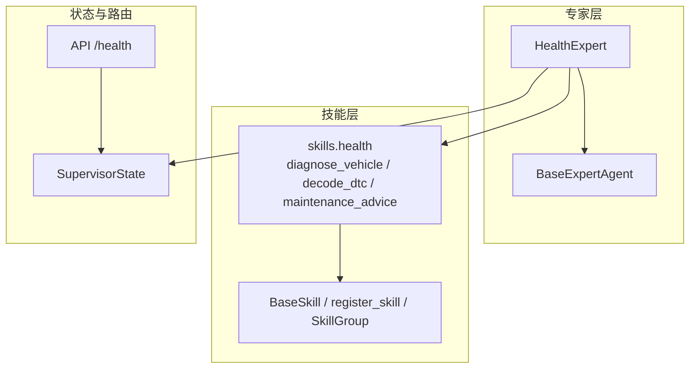
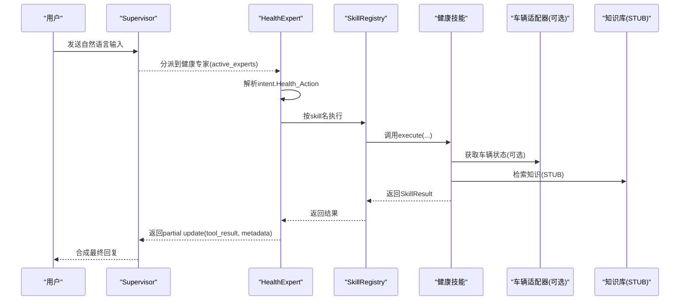
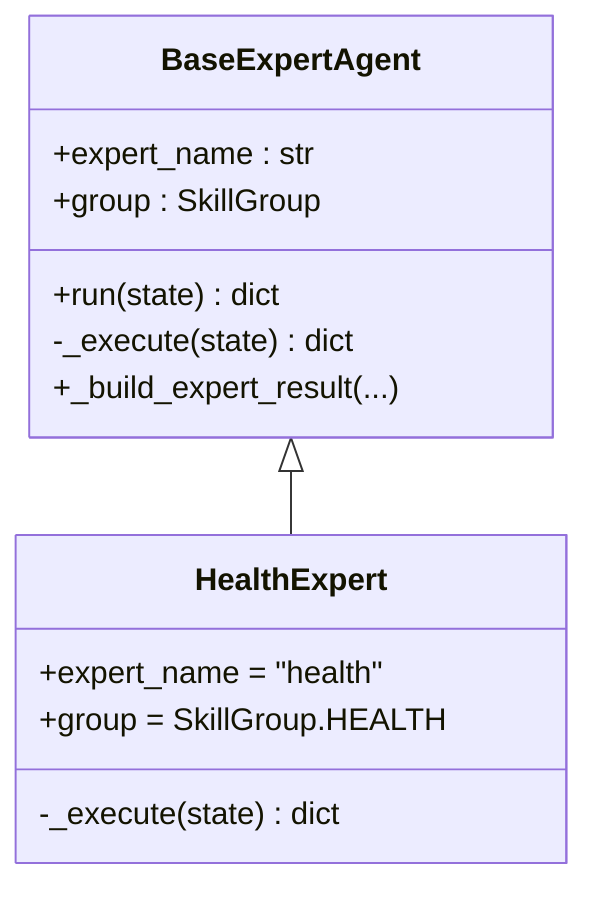
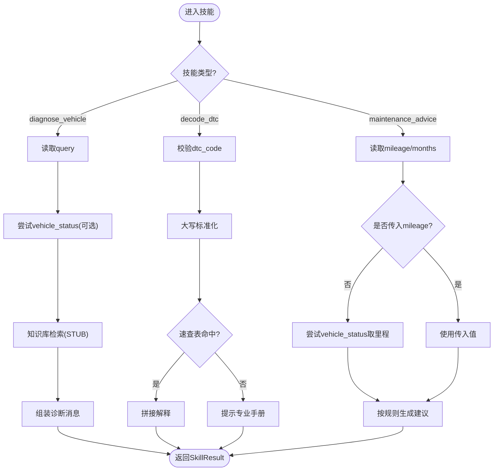
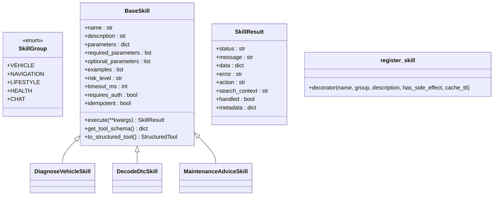
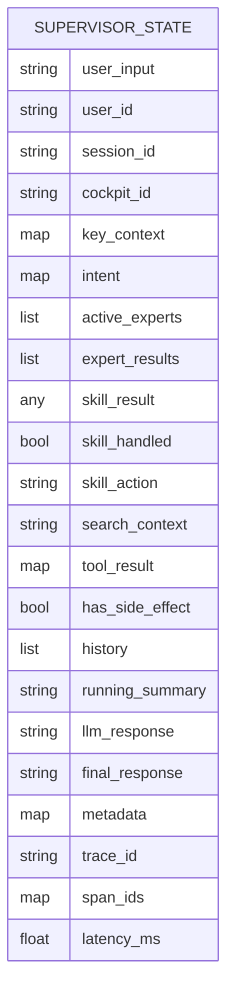
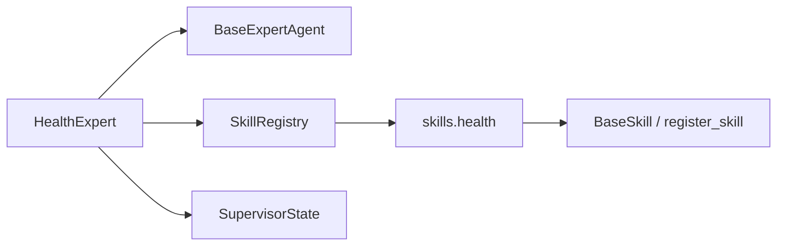
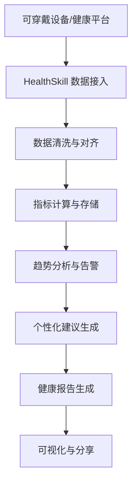

# HealthExpert健康专家

<cite>
**本文引用的文件**   
- [health_expert.py](file://backend_design/nexus/agent/experts/health_expert.py)
- [base.py](file://backend_design/nexus/agent/experts/base.py)
- [health.py](file://backend_design/nexus/skills/health.py)
- [base.py](file://backend_design/nexus/skills/base.py)
- [state.py](file://backend_design/nexus/models/state.py)
- [__init__.py](file://backend_design/nexus/agent/experts/__init__.py)
- [__init__.py](file://backend_design/nexus/skills/__init__.py)
- [health.py](file://backend_design/nexus/api/routes/health.py)
</cite>

## 目录
1. [简介](#简介)
2. [项目结构](#项目结构)
3. [核心组件](#核心组件)
4. [架构总览](#架构总览)
5. [详细组件分析](#详细组件分析)
6. [依赖关系分析](#依赖关系分析)
7. [性能与可扩展性](#性能与可扩展性)
8. [故障排查指南](#故障排查指南)
9. [结论](#结论)
10. [附录](#附录)

## 简介
HealthExpert（健康专家）是 NexusCockpit 多智能体系统中的“车辆健康”方向专家，负责将用户的自然语言意图路由到健康类技能，完成：
- 车辆异常问题诊断（结合实时车辆状态与知识库检索）
- 故障码翻译（基于本地速查表或知识库）
- 保养建议生成（按里程/时间规则输出建议）

当前实现聚焦于“车辆健康”，尚未包含人体健康指标监测、可穿戴设备同步与健康报告可视化等能力。文档在现有代码基础上给出可落地的扩展路线，帮助后续接入 HealthSkill 与外部数据源，形成完整的健康监测与建议闭环。

## 项目结构
与健康专家相关的核心路径与职责如下：
- 专家层：HealthExpert 负责解析意图并调度具体技能
- 技能层：diagnose_vehicle、decode_dtc、maintenance_advice 三个技能实现
- 基类与注册：BaseExpertAgent、BaseSkill、register_skill、SkillGroup 提供统一抽象与自动注册
- 状态模型：SupervisorState 定义多智能体共享状态与字段合并策略
- API 路由：/health 健康检查端点用于系统级健康探测（非业务健康数据）

**图表来源** 
- [health_expert.py:24-74](file://backend_design/nexus/agent/experts/health_expert.py#L24-L74)
- [base.py:26-140](file://backend_design/nexus/agent/experts/base.py#L26-L140)
- [health.py:47-228](file://backend_design/nexus/skills/health.py#L47-L228)
- [base.py:35-264](file://backend_design/nexus/skills/base.py#L35-L264)
- [state.py:38-165](file://backend_design/nexus/models/state.py#L38-L165)
- [health.py:26-95](file://backend_design/nexus/api/routes/health.py#L26-L95)

**章节来源**
- [health_expert.py:24-74](file://backend_design/nexus/agent/experts/health_expert.py#L24-L74)
- [health.py:47-228](file://backend_design/nexus/skills/health.py#L47-L228)
- [base.py:35-264](file://backend_design/nexus/skills/base.py#L35-L264)
- [state.py:38-165](file://backend_design/nexus/models/state.py#L38-L165)
- [health.py:26-95](file://backend_design/nexus/api/routes/health.py#L26-L95)

## 核心组件
- HealthExpert：从 SupervisorState 读取 intent，根据 Health_Action.skill 分发到对应技能，封装返回结果
- BaseExpertAgent：专家通用执行框架，计时、错误处理、构建 partial state update
- skills.health：三大健康技能的具体实现，含参数校验、缓存 TTL、日志与结构化返回
- BaseSkill / register_skill：技能元数据、Tool Schema 生成、LangChain StructuredTool 适配
- SupervisorState：多智能体共享状态，含 expert_results、tool_result、metadata 等关键字段

关键要点
- 专家不直接修改 state，而是返回 partial update，由编排器合并
- 技能通过装饰器自动注册，无需硬编码
- 技能返回统一 SkillResult，便于上层统一处理

**章节来源**
- [health_expert.py:24-74](file://backend_design/nexus/agent/experts/health_expert.py#L24-L74)
- [base.py:26-140](file://backend_design/nexus/agent/experts/base.py#L26-L140)
- [health.py:47-228](file://backend_design/nexus/skills/health.py#L47-L228)
- [base.py:35-264](file://backend_design/nexus/skills/base.py#L35-L264)
- [state.py:38-165](file://backend_design/nexus/models/state.py#L38-L165)

## 架构总览
下图展示一次健康相关请求的端到端流程：用户输入经 Supervisor 分派至 HealthExpert，再由 HealthExpert 调用具体技能；技能可能访问车辆适配器与知识库（当前为 STUB），最终返回结构化结果供 Responder 合成回复。

**图表来源** 
- [health_expert.py:36-74](file://backend_design/nexus/agent/experts/health_expert.py#L36-L74)
- [health.py:70-102](file://backend_design/nexus/skills/health.py#L70-L102)
- [health.py:137-162](file://backend_design/nexus/skills/health.py#L137-L162)
- [health.py:189-227](file://backend_design/nexus/skills/health.py#L189-L227)
- [base.py:48-84](file://backend_design/nexus/agent/experts/base.py#L48-L84)

## 详细组件分析

### HealthExpert 专家
- 职责：解析 intent.Health_Action，选择 diagnose_vehicle / decode_dtc / maintenance_advice，构造参数并调用 registry.execute
- 返回：通过 _build_expert_result 写入 expert_results、skill_action、skill_handled、search_context、metadata 等
- 健壮性：当 health_action 缺失或类型不符时，快速返回 handled=False，避免误判

**图表来源** 
- [base.py:26-140](file://backend_design/nexus/agent/experts/base.py#L26-L140)
- [health_expert.py:24-74](file://backend_design/nexus/agent/experts/health_expert.py#L24-L74)

**章节来源**
- [health_expert.py:24-74](file://backend_design/nexus/agent/experts/health_expert.py#L24-L74)
- [base.py:26-140](file://backend_design/nexus/agent/experts/base.py#L26-L140)

### 健康技能组（skills.health）
- diagnose_vehicle：查询车辆状态（可选）、检索知识库（STUB），组装诊断建议
- decode_dtc：从本地 JSON 速查表加载故障码释义，未命中则提示专业手册
- maintenance_advice：按里程/时间规则生成保养建议，支持从车辆适配器取里程

**图表来源** 
- [health.py:70-102](file://backend_design/nexus/skills/health.py#L70-L102)
- [health.py:137-162](file://backend_design/nexus/skills/health.py#L137-L162)
- [health.py:189-227](file://backend_design/nexus/skills/health.py#L189-L227)

**章节来源**
- [health.py:47-228](file://backend_design/nexus/skills/health.py#L47-L228)

### 技能基类与注册机制（skills.base）
- SkillGroup：标识技能归属（HEALTH 等）
- @register_skill：装饰器注入类属性并写入全局注册表
- BaseSkill：定义 execute() 接口、Tool Schema 生成、to_structured_tool() 适配 LangChain
- SkillResult：统一返回结构，含 status/message/data/metadata 等

**图表来源** 
- [base.py:35-264](file://backend_design/nexus/skills/base.py#L35-L264)

**章节来源**
- [base.py:35-264](file://backend_design/nexus/skills/base.py#L35-L264)

### 多智能体状态（SupervisorState）
- 关键字段：expert_results（累加）、tool_result（工具结果）、metadata（合并）、has_side_effect（副作用标记）
- reducer：list 用 add 拼接，dict 用 merge_dict 合并，保证并行专家输出不冲突

**图表来源** 
- [state.py:38-165](file://backend_design/nexus/models/state.py#L38-L165)

**章节来源**
- [state.py:38-165](file://backend_design/nexus/models/state.py#L38-L165)

### API 健康检查（/health）
- 作用：检查 Milvus、Neo4j、Redis、MySQL、OSS、Agent 工作流等组件连接状态
- 注意：该端点为系统级健康检查，并非健康数据业务接口

**章节来源**
- [health.py:26-95](file://backend_design/nexus/api/routes/health.py#L26-L95)

## 依赖关系分析
- HealthExpert 依赖 BaseExpertAgent 与 SkillRegistry
- 健康技能依赖 BaseSkill、SkillGroup、日志模块、车辆适配器（可选）、知识库（STUB）
- 专家与技能通过 SupervisorState 进行数据交换
- 技能通过装饰器自动注册，运行时由 __init__.py 触发导入

**图表来源** 
- [health_expert.py:24-74](file://backend_design/nexus/agent/experts/health_expert.py#L24-L74)
- [base.py:26-140](file://backend_design/nexus/agent/experts/base.py#L26-L140)
- [health.py:47-228](file://backend_design/nexus/skills/health.py#L47-L228)
- [base.py:35-264](file://backend_design/nexus/skills/base.py#L35-L264)
- [state.py:38-165](file://backend_design/nexus/models/state.py#L38-L165)
- [__init__.py:22-28](file://backend_design/nexus/skills/__init__.py#L22-L28)

**章节来源**
- [__init__.py:22-37](file://backend_design/nexus/agent/experts/__init__.py#L22-L37)
- [__init__.py:22-28](file://backend_design/nexus/skills/__init__.py#L22-L28)

## 性能与可扩展性
- 缓存策略：各技能通过 cache_ttl 控制缓存（如 decode_dtc 长 TTL，diagnose_vehicle 短 TTL）
- 副作用控制：has_side_effect 用于禁止车控类操作的语义缓存，避免安全与一致性风险
- 异步执行：技能 execute 为异步方法，配合 StructuredTool 的 arun 提升吞吐
- 可扩展点：
  - 新增健康技能：继承 BaseSkill，使用 @register_skill 注册，补充 parameters/examples
  - 接入真实知识库：替换 _search_knowledge_base 为 Cherry KB 检索
  - 接入车辆适配器：完善 vehicle_adapter.invoke_command 的数据映射

[本节为通用指导，不直接分析具体文件]

## 故障排查指南
- 症状：健康技能返回空消息或未命中
  - 排查：确认 intent.Health_Action 是否正确传递；检查 vehicle_adapter 是否可用；确认 dtc_codes.json 是否存在且格式正确
- 症状：知识库检索为空
  - 排查：当前为 STUB，需集成 Cherry KB；检查 _search_knowledge_base 实现
- 症状：保养建议不符合预期
  - 排查：核对 mileage/months 输入；确认 vehicle_adapter 返回字段；检查规则分支逻辑
- 系统级健康检查失败
  - 排查：/health 端点返回的 services 字段，定位具体组件（Milvus/Neo4j/Redis/MySQL/OSS/Agent）

**章节来源**
- [health.py:70-102](file://backend_design/nexus/skills/health.py#L70-L102)
- [health.py:137-162](file://backend_design/nexus/skills/health.py#L137-L162)
- [health.py:189-227](file://backend_design/nexus/skills/health.py#L189-L227)
- [health.py:26-95](file://backend_design/nexus/api/routes/health.py#L26-L95)

## 结论
HealthExpert 当前聚焦“车辆健康”领域，已具备意图路由、技能执行、结构化返回与日志追踪的基础能力。下一步可通过以下路径扩展为“人体健康专家”：
- 引入 HealthSkill：对接可穿戴设备与健康平台，采集心率、血压、血氧、睡眠等指标
- 建立健康数据管道：清洗、对齐、存储与趋势分析
- 个性化建议引擎：基于用户画像与历史数据生成建议
- 隐私与安全：加密敏感数据、最小化授权、合规审计
- 可视化与分享：仪表盘、趋势图、报告导出与分享

[本节为总结性内容，不直接分析具体文件]

## 附录

### 与 HealthSkill 的集成方案（概念设计）
- 数据收集：通过 HealthSkill 聚合可穿戴设备与第三方平台数据，统一为内部指标模型
- 指标分析：计算统计量、阈值告警、趋势预测
- 报告生成：周期性生成健康报告，支持 PDF/HTML 导出与分享链接
- 紧急处理：阈值越界触发告警，推送通知与应急指引

[本图为概念流程，不映射具体源码，故无图表来源]

### 隐私保护与合规要求（概念建议）
- 数据最小化：仅采集必要指标，明确保留期限
- 传输与存储加密：TLS 传输，AES 静态加密
- 访问控制：RBAC 与细粒度权限，审计日志
- 合规：遵循当地医疗数据法规，提供用户同意与撤回机制

[本节为通用指导，不直接分析具体文件]

### 前端可视化与分享（概念建议）
- 仪表盘：折线图（趋势）、柱状图（对比）、热力图（分布）
- 报告：摘要、趋势、建议、风险提示
- 分享：受控链接、水印、有效期

[本节为通用指导，不直接分析具体文件]