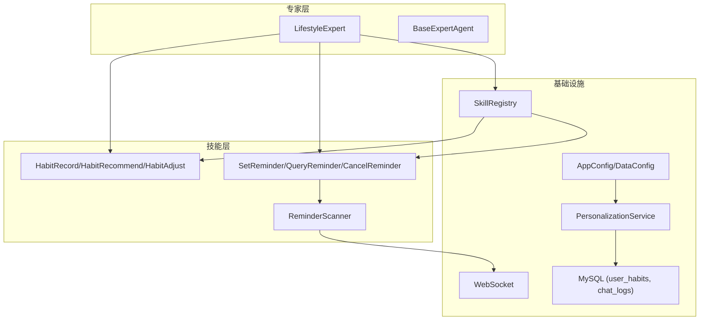
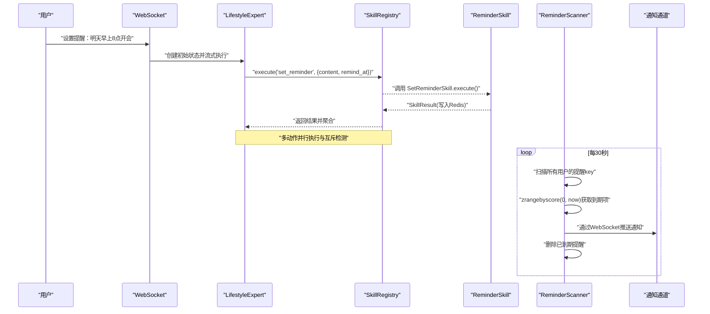
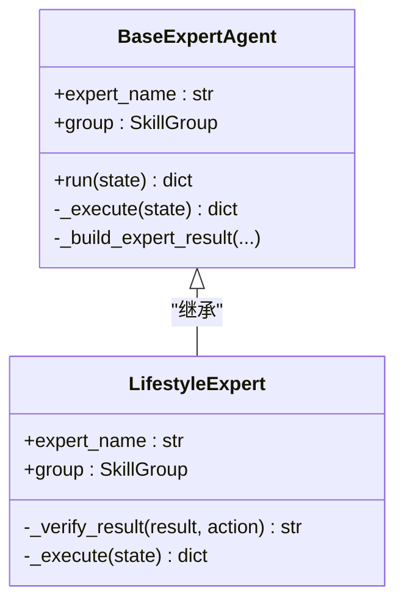
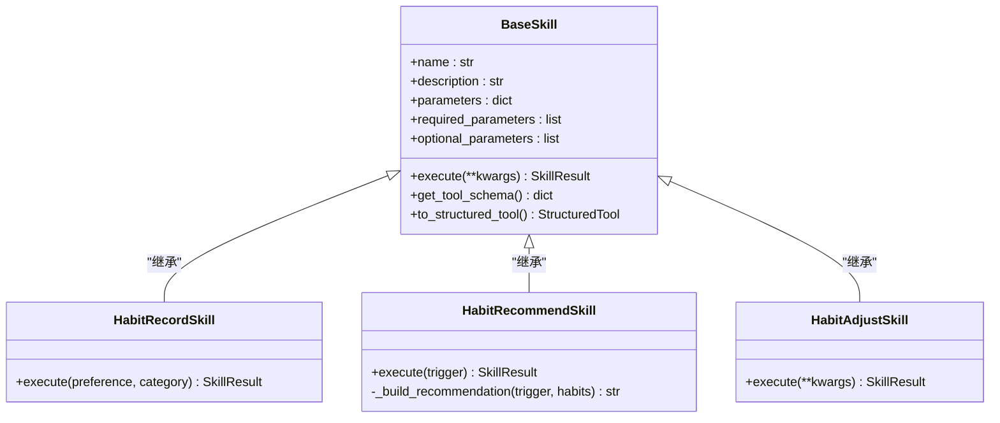
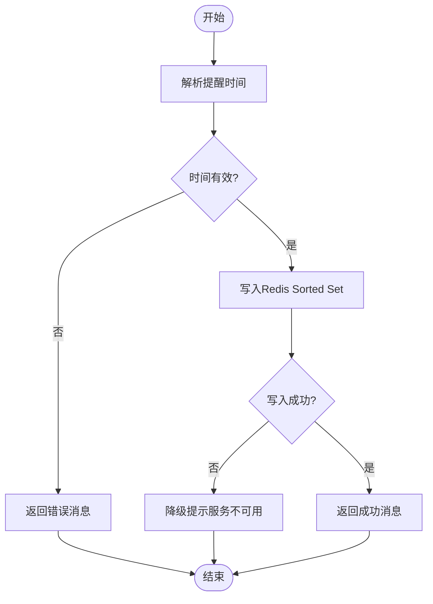
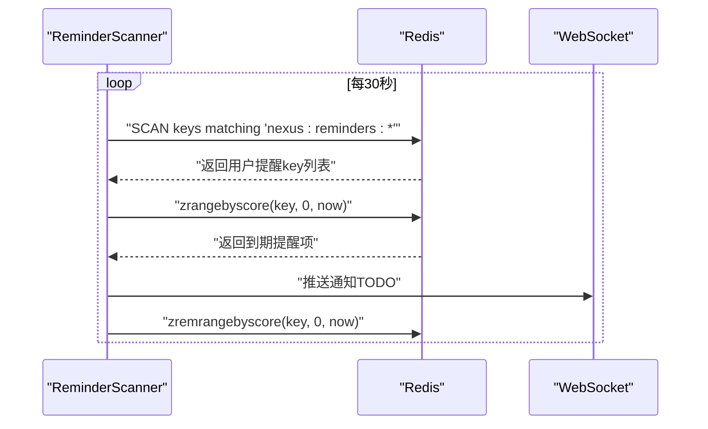
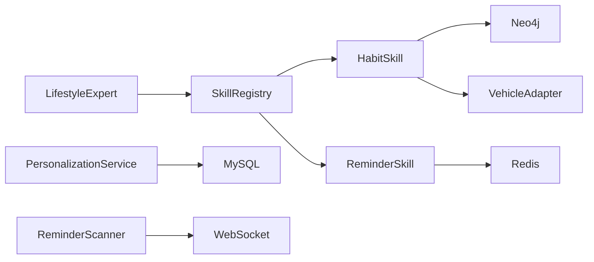

# LifestyleExpert生活专家

<cite>
**本文引用的文件**   
- [lifestyle_expert.py](file://backend_design/nexus/agent/experts/lifestyle_expert.py)
- [base.py](file://backend_design/nexus/agent/experts/base.py)
- [base.py](file://backend_design/nexus/skills/base.py)
- [registry.py](file://backend_design/nexus/skills/registry.py)
- [habit.py](file://backend_design/nexus/skills/habit.py)
- [reminder.py](file://backend_design/nexus/skills/reminder.py)
- [reminder_scanner.py](file://backend_design/nexus/skills/reminder_scanner.py)
- [personalization.py](file://backend_design/nexus/core/personalization.py)
- [data.py](file://backend_design/nexus/config/data.py)
- [__init__.py](file://backend_design/nexus/config/__init__.py)
- [websocket.py](file://backend_design/nexus/api/websocket.py)
- [db_manager.py](file://backend_design/nexus/core/db_manager.py)
</cite>

## 目录
1. [简介](#简介)
2. [项目结构](#项目结构)
3. [核心组件](#核心组件)
4. [架构总览](#架构总览)
5. [详细组件分析](#详细组件分析)
6. [依赖关系分析](#依赖关系分析)
7. [性能考量](#性能考量)
8. [故障排查指南](#故障排查指南)
9. [结论](#结论)
10. [附录](#附录)

## 简介
本技术文档聚焦于“LifestyleExpert 生活专家”的职责与实现，涵盖提醒事项、习惯追踪、日程管理等日常任务的处理流程；详细说明与 HabitSkill（习惯画像）和 ReminderSkill（日程提醒）的集成方式，包括提醒调度、习惯记录与用户偏好管理；解释生活数据的持久化存储、定时任务调度与通知机制；并覆盖提醒类型多样化支持、智能触发条件、用户行为分析、隐私保护与数据安全、跨设备同步策略，以及扩展指南与自定义提醒规则配置方法。

## 项目结构
围绕生活专家的核心代码主要分布在以下模块：
- 专家层：LifestyleExpert 负责意图解析后的多动作并行执行与结果聚合
- 技能层：HabitSkill（习惯画像）、ReminderSkill（日程提醒）等具体能力
- 注册中心：SkillRegistry 统一管理与调用技能
- 个性化服务：PersonalizationService 提供用户画像与偏好注入
- 配置中心：DataConfig、AppConfig 提供数据目录与系统参数
- 实时通信：WebSocket 用于通知推送通道
- 数据库：MySQL 持久化用户习惯与对话历史等

图表来源
- [lifestyle_expert.py:24-256](file://backend_design/nexus/agent/experts/lifestyle_expert.py#L24-L256)
- [base.py:26-140](file://backend_design/nexus/agent/experts/base.py#L26-L140)
- [registry.py:36-321](file://backend_design/nexus/skills/registry.py#L36-L321)
- [habit.py:26-215](file://backend_design/nexus/skills/habit.py#L26-L215)
- [reminder.py:51-296](file://backend_design/nexus/skills/reminder.py#L51-L296)
- [reminder_scanner.py:28-136](file://backend_design/nexus/skills/reminder_scanner.py#L28-L136)
- [personalization.py:32-349](file://backend_design/nexus/core/personalization.py#L32-L349)
- [data.py:15-63](file://backend_design/nexus/config/data.py#L15-L63)
- [__init__.py:84-167](file://backend_design/nexus/config/__init__.py#L84-L167)
- [websocket.py:71-209](file://backend_design/nexus/api/websocket.py#L71-L209)
- [db_manager.py:285-299](file://backend_design/nexus/core/db_manager.py#L285-L299)

章节来源
- [lifestyle_expert.py:24-256](file://backend_design/nexus/agent/experts/lifestyle_expert.py#L24-L256)
- [registry.py:36-321](file://backend_design/nexus/skills/registry.py#L36-L321)
- [habit.py:26-215](file://backend_design/nexus/skills/habit.py#L26-L215)
- [reminder.py:51-296](file://backend_design/nexus/skills/reminder.py#L51-L296)
- [reminder_scanner.py:28-136](file://backend_design/nexus/skills/reminder_scanner.py#L28-L136)
- [personalization.py:32-349](file://backend_design/nexus/core/personalization.py#L32-L349)
- [data.py:15-63](file://backend_design/nexus/config/data.py#L15-L63)
- [__init__.py:84-167](file://backend_design/nexus/config/__init__.py#L84-L167)
- [websocket.py:71-209](file://backend_design/nexus/api/websocket.py#L71-L209)
- [db_manager.py:285-299](file://backend_design/nexus/core/db_manager.py#L285-L299)

## 核心组件
- LifestyleExpert：基于 BaseExpertAgent 封装生活类技能的多动作并行执行与结果聚合，支持天气查询、POI搜索、点餐、提醒设置等原子任务，具备互斥检测与上下文合并能力。
- SkillRegistry：统一注册与发现技能，提供超时保护、重试、分组查询与批量执行能力。
- HabitSkill：记录、推荐与调整用户习惯，写入 Neo4j 图谱或结合车控适配器下发指令。
- ReminderSkill：设置、查询与取消提醒，使用 Redis Sorted Set 按时间戳排序，后台扫描器定时到期推送。
- PersonalizationService：读取用户偏好 JSON 与 MySQL 习惯记录，构建画像文本注入 Prompt，支持本地音乐匹配。
- WebSocket：提供双向实时通信，作为提醒通知推送通道。
- DataConfig/AppConfig：集中管理数据目录、记忆参数与系统配置。
- DatabaseManager：维护 MySQL 连接池与表结构迁移，包含 user_habits 等关键表。

章节来源
- [base.py:26-140](file://backend_design/nexus/agent/experts/base.py#L26-L140)
- [registry.py:36-321](file://backend_design/nexus/skills/registry.py#L36-L321)
- [habit.py:26-215](file://backend_design/nexus/skills/habit.py#L26-L215)
- [reminder.py:51-296](file://backend_design/nexus/skills/reminder.py#L51-L296)
- [personalization.py:32-349](file://backend_design/nexus/core/personalization.py#L32-L349)
- [websocket.py:71-209](file://backend_design/nexus/api/websocket.py#L71-L209)
- [data.py:15-63](file://backend_design/nexus/config/data.py#L15-L63)
- [__init__.py:84-167](file://backend_design/nexus/config/__init__.py#L84-L167)
- [db_manager.py:285-299](file://backend_design/nexus/core/db_manager.py#L285-L299)

## 架构总览
LifestyleExpert 通过 SkillRegistry 调用各类生活技能，形成“意图→技能→结果聚合”的流水线。提醒场景由 ReminderSkill 写入 Redis，ReminderScanner 定时扫描到期项并通过 WebSocket 推送通知。习惯画像由 HabitSkill 写入 Neo4j 或结合车控适配器调整车辆设置，PersonalizationService 将用户偏好与高频习惯合成画像文本注入 LLM。

图表来源
- [lifestyle_expert.py:45-256](file://backend_design/nexus/agent/experts/lifestyle_expert.py#L45-L256)
- [registry.py:222-321](file://backend_design/nexus/skills/registry.py#L222-L321)
- [reminder.py:72-121](file://backend_design/nexus/skills/reminder.py#L72-L121)
- [reminder_scanner.py:78-121](file://backend_design/nexus/skills/reminder_scanner.py#L78-L121)
- [websocket.py:71-209](file://backend_design/nexus/api/websocket.py#L71-L209)

## 详细组件分析

### LifestyleExpert 组件分析
- 职责：解析 SupervisorState 中的意图，收集匹配的原子任务（POI搜索、天气查询、联网搜索、点餐、提醒设置），并行执行并聚合结果。
- 互斥检测：当天气查询命中时跳过联网搜索，避免重复。
- 结果聚合：合并 search_context，选择首个 handled=True 的结果为主结果，提升 tool_result 到顶层 state。
- 错误处理：捕获异常并记录日志，返回结构化错误信息。

图表来源
- [base.py:26-140](file://backend_design/nexus/agent/experts/base.py#L26-L140)
- [lifestyle_expert.py:24-256](file://backend_design/nexus/agent/experts/lifestyle_expert.py#L24-L256)

章节来源
- [lifestyle_expert.py:45-256](file://backend_design/nexus/agent/experts/lifestyle_expert.py#L45-L256)
- [base.py:26-140](file://backend_design/nexus/agent/experts/base.py#L26-L140)

### HabitSkill 组件分析
- HabitRecordSkill：记录用户偏好到 Neo4j HABIT 关系，支持类别分类。
- HabitRecommendSkill：根据触发场景（如 morning_start、nav_start）查询用户习惯并生成推荐话术。
- HabitAdjustSkill：读取画像并批量下发车控指令（空调、媒体等）。

图表来源
- [base.py:116-264](file://backend_design/nexus/skills/base.py#L116-L264)
- [habit.py:26-215](file://backend_design/nexus/skills/habit.py#L26-L215)

章节来源
- [habit.py:26-215](file://backend_design/nexus/skills/habit.py#L26-L215)
- [base.py:116-264](file://backend_design/nexus/skills/base.py#L116-L264)

### ReminderSkill 组件分析
- SetReminderSkill：解析时间（ISO 或 relative:秒数），写入 Redis Sorted Set，失败降级提示。
- QueryReminderSkill：查询未过期提醒，格式化输出列表。
- CancelReminderSkill：按内容关键词删除提醒。

图表来源
- [reminder.py:72-121](file://backend_design/nexus/skills/reminder.py#L72-L121)
- [reminder.py:165-217](file://backend_design/nexus/skills/reminder.py#L165-L217)
- [reminder.py:240-295](file://backend_design/nexus/skills/reminder.py#L240-L295)

章节来源
- [reminder.py:72-121](file://backend_design/nexus/skills/reminder.py#L72-L121)
- [reminder.py:165-217](file://backend_design/nexus/skills/reminder.py#L165-L217)
- [reminder.py:240-295](file://backend_design/nexus/skills/reminder.py#L240-L295)

### ReminderScanner 组件分析
- 后台任务：每 30 秒扫描 Redis 中所有用户的提醒 key，获取到期项并通过 WebSocket 推送通知。
- 清理逻辑：删除已到期提醒，确保数据一致性。

图表来源
- [reminder_scanner.py:78-121](file://backend_design/nexus/skills/reminder_scanner.py#L78-L121)
- [websocket.py:71-209](file://backend_design/nexus/api/websocket.py#L71-L209)

章节来源
- [reminder_scanner.py:78-121](file://backend_design/nexus/skills/reminder_scanner.py#L78-L121)
- [websocket.py:71-209](file://backend_design/nexus/api/websocket.py#L71-L209)

### PersonalizationService 组件分析
- 用户画像：合并 JSON 偏好与 MySQL 习惯记录，生成 profile_text 注入 Prompt。
- 音乐匹配：扫描本地音乐库，按用户偏好模糊匹配歌曲。
- 偏好保存：更新用户偏好 JSON 文件，记录时间戳。

章节来源
- [personalization.py:46-197](file://backend_design/nexus/core/personalization.py#L46-L197)
- [personalization.py:199-296](file://backend_design/nexus/core/personalization.py#L199-L296)
- [personalization.py:297-349](file://backend_design/nexus/core/personalization.py#L297-L349)

## 依赖关系分析
- LifestyleExpert 依赖 SkillRegistry 进行技能调用，SkillRegistry 自动发现并实例化技能类。
- HabitSkill 依赖 Neo4j graph_store（可选）与 vehicle_adapter（可选）。
- ReminderSkill 依赖 Redis 异步客户端，ReminderScanner 独立运行后台任务。
- PersonalizationService 依赖 DataConfig 与 MySQL 数据库。
- WebSocket 作为通知通道，需 JWT 认证与心跳检测。

图表来源
- [registry.py:36-321](file://backend_design/nexus/skills/registry.py#L36-L321)
- [habit.py:26-215](file://backend_design/nexus/skills/habit.py#L26-L215)
- [reminder.py:51-296](file://backend_design/nexus/skills/reminder.py#L51-L296)
- [reminder_scanner.py:28-136](file://backend_design/nexus/skills/reminder_scanner.py#L28-L136)
- [personalization.py:32-349](file://backend_design/nexus/core/personalization.py#L32-L349)
- [websocket.py:71-209](file://backend_design/nexus/api/websocket.py#L71-L209)

章节来源
- [registry.py:36-321](file://backend_design/nexus/skills/registry.py#L36-L321)
- [habit.py:26-215](file://backend_design/nexus/skills/habit.py#L26-L215)
- [reminder.py:51-296](file://backend_design/nexus/skills/reminder.py#L51-L296)
- [reminder_scanner.py:28-136](file://backend_design/nexus/skills/reminder_scanner.py#L28-L136)
- [personalization.py:32-349](file://backend_design/nexus/core/personalization.py#L32-L349)
- [websocket.py:71-209](file://backend_design/nexus/api/websocket.py#L71-L209)

## 性能考量
- 并行执行：LifestyleExpert 使用 asyncio.gather 并行执行多个原子任务，减少整体延迟。
- 超时与重试：SkillRegistry 为每个技能设置超时与重试机制，防止外部 API 慢响应阻塞。
- 缓存控制：BaseSkill 提供 cache_ttl 属性，副作用技能禁用缓存。
- 扫描间隔：ReminderScanner 每 30 秒扫描一次，平衡实时性与资源消耗。
- 连接池：DatabaseManager 使用 aiomysql 连接池，提高数据库访问效率。

[本节为通用指导，不直接分析具体文件]

## 故障排查指南
- 技能执行失败：检查 SkillRegistry 的 execute 返回值与日志，确认技能名称与参数正确性。
- Redis 不可用：ReminderSkill 会降级提示，检查 Redis 配置与连接状态。
- WebSocket 连接问题：确认 JWT Token 有效性，检查心跳检测与连接生命周期。
- 用户画像缺失：检查 PersonalizationService 的 JSON 偏好文件与 MySQL 连接状态。
- 数据库迁移失败：查看 DatabaseManager 的 _auto_migrate_tables 日志，确认表结构与权限。

章节来源
- [registry.py:222-321](file://backend_design/nexus/skills/registry.py#L222-L321)
- [reminder.py:72-121](file://backend_design/nexus/skills/reminder.py#L72-L121)
- [websocket.py:71-209](file://backend_design/nexus/api/websocket.py#L71-L209)
- [personalization.py:46-197](file://backend_design/nexus/core/personalization.py#L46-L197)
- [db_manager.py:86-158](file://backend_design/nexus/core/db_manager.py#L86-L158)

## 结论
LifestyleExpert 通过模块化技能设计与并行执行机制，实现了高效、可扩展的生活类任务处理能力。与 HabitSkill 和 ReminderSkill 的深度集成，提供了完整的习惯画像与提醒调度方案。配合 PersonalizationService 与 WebSocket，实现了个性化体验与实时通知。未来可进一步扩展提醒类型、优化触发条件与用户行为分析，增强隐私保护与跨设备同步能力。

[本节为总结性内容，不直接分析具体文件]

## 附录
- 扩展指南：新增技能需在 base.py 中使用 @register_skill 装饰器标记，并在 registry.py 中手动注册（如需依赖注入）。
- 自定义提醒规则：在 reminder.py 中扩展 SetReminderSkill 的时间解析逻辑，支持更多格式（如 cron 表达式）。
- 隐私与安全：确保 WebSocket 使用 JWT 认证，敏感数据加密存储，定期清理临时文件。
- 跨设备同步：通过 Redis 与 MySQL 实现状态共享，结合用户 ID 进行数据隔离与同步。

[本节为补充说明，不直接分析具体文件]