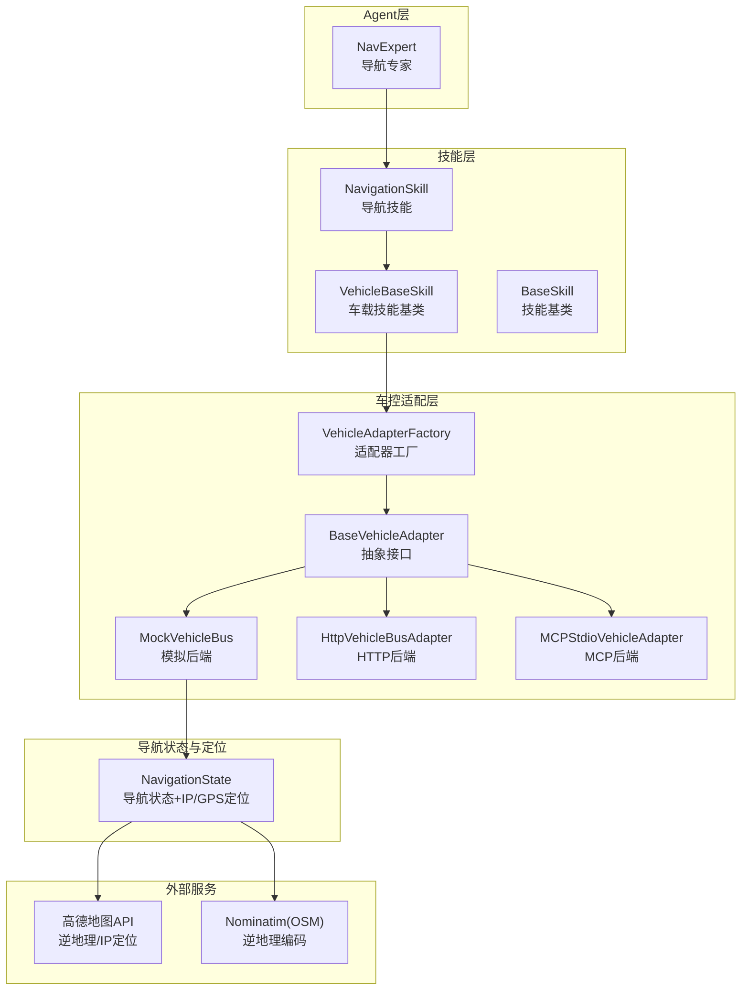
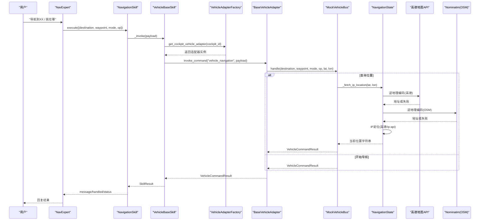
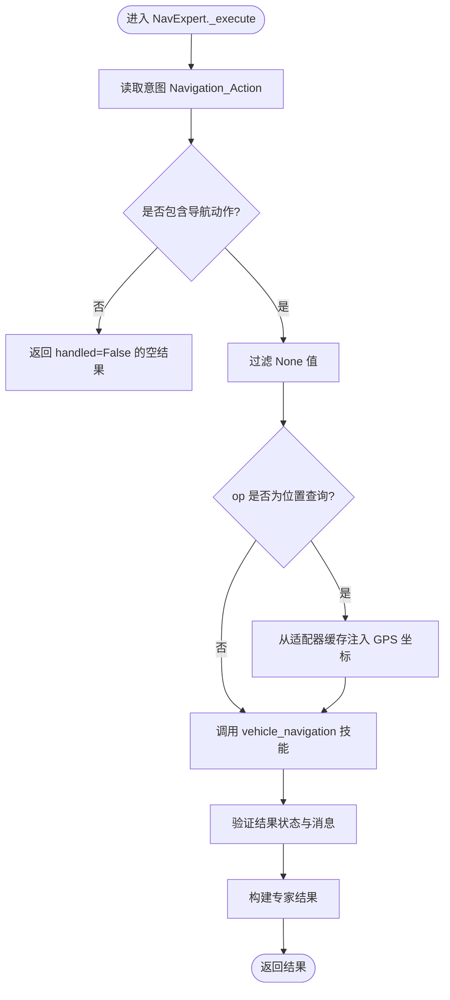
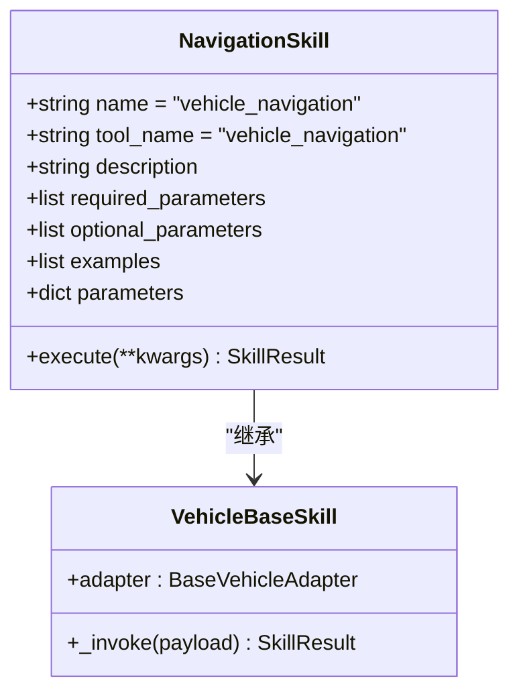
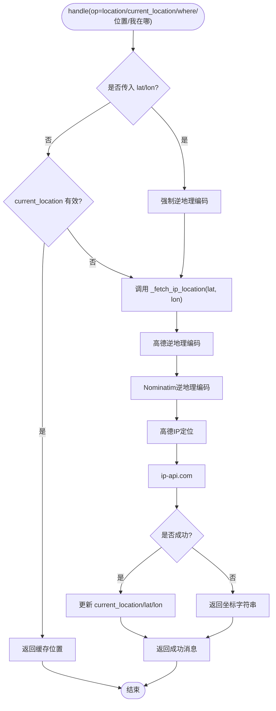
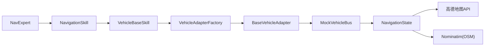

# NavExpert导航专家

<cite>
**本文引用的文件**
- [nav_expert.py](file://backend_design/nexus/agent/experts/nav_expert.py)
- [navigation.py](file://backend_design/nexus/skills/vehicle/navigation.py)
- [base.py](file://backend_design/nexus/skills/base.py)
- [__init__.py](file://backend_design/nexus/skills/vehicle/__init__.py)
- [navigation_state.py](file://backend_design/nexus/vehicle/mock/navigation_state.py)
- [factory.py](file://backend_design/nexus/vehicle/factory.py)
- [base.py](file://backend_design/nexus/vehicle/base.py)
- [_common.py](file://backend_design/nexus/config/_common.py)
- [responder_search.md](file://backend_design/nexus/prompts/responder_search.md)
</cite>

## 目录
1. [简介](#简介)
2. [项目结构](#项目结构)
3. [核心组件](#核心组件)
4. [架构总览](#架构总览)
5. [详细组件分析](#详细组件分析)
6. [依赖关系分析](#依赖关系分析)
7. [性能考虑](#性能考虑)
8. [故障排查指南](#故障排查指南)
9. [结论](#结论)
10. [附录](#附录)

## 简介
本技术文档围绕 NavExpert 导航专家，系统阐述其在车载智能座舱中的核心能力与实现方式，包括：
- 目的地搜索、路线规划、实时导航、交通信息获取（通过技能与适配器扩展）
- 与地图服务API的集成：地理编码、路径计算、ETA预测（通过适配器与外部服务）
- 自然语言地址解析、POI搜索、导航指令生成（由意图路由与Prompt模板协同）
- 多模态输入支持（语音、文本、位置），离线导航缓存与导航状态同步机制
- 导航精度优化、路线偏好设置、用户习惯学习（通过配置与个性化模块）
- 导航相关Prompt模板与错误恢复策略

## 项目结构
导航功能在Agent层由“导航专家”驱动，经由“技能层”调用“车控适配层”，最终落到具体后端（Mock/HTTP/MCP）。定位与逆地理编码逻辑在Mock导航状态中实现，结合高德与OpenStreetMap等外部服务。

图表来源
- [nav_expert.py:1-98](file://backend_design/nexus/agent/experts/nav_expert.py#L1-L98)
- [navigation.py:1-39](file://backend_design/nexus/skills/vehicle/navigation.py#L1-L39)
- [base.py:1-264](file://backend_design/nexus/skills/base.py#L1-L264)
- [__init__.py:1-55](file://backend_design/nexus/skills/vehicle/__init__.py#L1-L55)
- [factory.py:1-147](file://backend_design/nexus/vehicle/factory.py#L1-L147)
- [base.py:1-92](file://backend_design/nexus/vehicle/base.py#L1-L92)
- [navigation_state.py:1-216](file://backend_design/nexus/vehicle/mock/navigation_state.py#L1-L216)

章节来源
- [nav_expert.py:1-98](file://backend_design/nexus/agent/experts/nav_expert.py#L1-L98)
- [navigation.py:1-39](file://backend_design/nexus/skills/vehicle/navigation.py#L1-L39)
- [base.py:1-264](file://backend_design/nexus/skills/base.py#L1-L264)
- [__init__.py:1-55](file://backend_design/nexus/skills/vehicle/__init__.py#L1-L55)
- [factory.py:1-147](file://backend_design/nexus/vehicle/factory.py#L1-L147)
- [base.py:1-92](file://backend_design/nexus/vehicle/base.py#L1-L92)
- [navigation_state.py:1-216](file://backend_design/nexus/vehicle/mock/navigation_state.py#L1-L216)

## 核心组件
- 导航专家（NavExpert）
  - 负责接收意图并执行导航操作；在查询位置时从适配器缓存注入GPS坐标，避免IP定位超时导致的未知位置问题。
- 导航技能（NavigationSkill）
  - 定义工具名称、参数与示例，封装导航操作的语义与校验，统一返回SkillResult。
- 车载技能基类（VehicleBaseSkill）
  - 统一通过车控适配器调用底层命令，按座舱隔离获取适配器实例。
- 车控适配器工厂（VehicleAdapterFactory）
  - 根据配置选择Mock/HTTP/MCP后端，并提供多座舱隔离的适配器实例。
- 导航状态（NavigationState）
  - 管理导航上下文（目的地、途经点、模式、当前位置、经纬度等），实现IP/GPS定位与逆地理编码流程。
- 技能基类（BaseSkill）
  - 提供技能元数据、Schema生成、LangChain StructuredTool包装、副作用与缓存控制等通用能力。

章节来源
- [nav_expert.py:1-98](file://backend_design/nexus/agent/experts/nav_expert.py#L1-L98)
- [navigation.py:1-39](file://backend_design/nexus/skills/vehicle/navigation.py#L1-L39)
- [base.py:1-264](file://backend_design/nexus/skills/base.py#L1-L264)
- [__init__.py:1-55](file://backend_design/nexus/skills/vehicle/__init__.py#L1-L55)
- [factory.py:1-147](file://backend_design/nexus/vehicle/factory.py#L1-L147)
- [base.py:1-92](file://backend_design/nexus/vehicle/base.py#L1-L92)
- [navigation_state.py:1-216](file://backend_design/nexus/vehicle/mock/navigation_state.py#L1-L216)

## 架构总览
导航请求从Agent层进入，经技能层转换为结构化调用，再由适配器工厂选择后端执行。定位与逆地理编码在导航状态中完成，优先使用浏览器GPS坐标进行高精度逆地理编码，失败则回退到IP定位或多备选服务。

图表来源
- [nav_expert.py:1-98](file://backend_design/nexus/agent/experts/nav_expert.py#L1-L98)
- [navigation.py:1-39](file://backend_design/nexus/skills/vehicle/navigation.py#L1-L39)
- [base.py:1-264](file://backend_design/nexus/skills/base.py#L1-L264)
- [__init__.py:1-55](file://backend_design/nexus/skills/vehicle/__init__.py#L1-L55)
- [factory.py:1-147](file://backend_design/nexus/vehicle/factory.py#L1-L147)
- [base.py:1-92](file://backend_design/nexus/vehicle/base.py#L1-L92)
- [navigation_state.py:1-216](file://backend_design/nexus/vehicle/mock/navigation_state.py#L1-L216)

## 详细组件分析

### 导航专家（NavExpert）
- 职责
  - 解析意图中的导航动作，过滤无效字段；在位置查询时从适配器缓存注入GPS坐标，提升定位精度。
  - 调用注册表执行“vehicle_navigation”技能，并对结果进行验证与标准化。
- 关键流程
  - 读取意图中的Navigation_Action，清理None值。
  - 若操作为location/where/位置/我在哪，尝试从适配器导航缓存注入latitude/longitude。
  - 执行技能并验证返回消息与状态，构建专家结果。

图表来源
- [nav_expert.py:1-98](file://backend_design/nexus/agent/experts/nav_expert.py#L1-L98)

章节来源
- [nav_expert.py:1-98](file://backend_design/nexus/agent/experts/nav_expert.py#L1-L98)

### 导航技能（NavigationSkill）
- 职责
  - 声明工具名、描述、参数与示例，统一封装execute调用。
- 参数说明
  - destination：目的地
  - waypoint：途经点
  - mode：导航模式（如drive/walk）
  - op：操作类型（location表示查询当前位置）
- 执行流程
  - 将参数透传给VehicleBaseSkill._invoke，最终调用车控适配器。

图表来源
- [navigation.py:1-39](file://backend_design/nexus/skills/vehicle/navigation.py#L1-L39)
- [__init__.py:1-55](file://backend_design/nexus/skills/vehicle/__init__.py#L1-L55)

章节来源
- [navigation.py:1-39](file://backend_design/nexus/skills/vehicle/navigation.py#L1-L39)
- [__init__.py:1-55](file://backend_design/nexus/skills/vehicle/__init__.py#L1-L55)

### 车载技能基类（VehicleBaseSkill）
- 职责
  - 通过租户上下文获取当前座舱的适配器实例，确保多座舱隔离。
  - 统一调用适配器invoke_command，并将结果封装为SkillResult。
- 关键点
  - adapter属性动态解析cockpit_id并获取对应适配器。
  - _invoke方法将VehicleCommandResult映射为SkillResult。

章节来源
- [__init__.py:1-55](file://backend_design/nexus/skills/vehicle/__init__.py#L1-L55)

### 车控适配器工厂（VehicleAdapterFactory）
- 职责
  - 根据配置选择Mock/HTTP/MCP后端，提供单例与多座舱隔离的适配器实例。
- 关键点
  - build_vehicle_adapter：创建全局单例适配器。
  - get_cockpit_vehicle_adapter：按座舱ID返回独立Mock实例或复用无状态适配器。
  - _create_adapter：依据VEHICLE_ADAPTER与环境变量决定具体实现。

章节来源
- [factory.py:1-147](file://backend_design/nexus/vehicle/factory.py#L1-L147)

### 导航状态与定位（NavigationState）
- 职责
  - 维护导航上下文（目的地、途经点、模式、当前位置、经纬度、速度、朝向等）。
  - 处理位置查询与导航启动；实现IP/GPS定位与逆地理编码流程。
- 定位优先级
  - 浏览器GPS坐标 → 高德逆地理编码 → Nominatim逆地理编码 → 高德IP定位 → ip-api.com → 降级为坐标字符串。
- 关键点
  - 当显式传入lat/lon时，强制走逆地理编码路径，避免旧缓存导致的位置不准确。
  - 存储client_ip用于客户端级IP定位，避免服务器IP导致的偏差。

图表来源
- [navigation_state.py:1-216](file://backend_design/nexus/vehicle/mock/navigation_state.py#L1-L216)

章节来源
- [navigation_state.py:1-216](file://backend_design/nexus/vehicle/mock/navigation_state.py#L1-L216)

### 技能基类（BaseSkill）
- 职责
  - 提供技能元数据、Schema生成、LangChain StructuredTool包装、副作用与缓存控制。
- 关键点
  - get_tool_schema：生成OpenAI Function Calling格式的工具描述。
  - to_structured_tool：动态创建Pydantic模型作为args_schema，包装异步execute。
  - has_side_effect/cache_ttl：控制缓存安全。

章节来源
- [base.py:1-264](file://backend_design/nexus/skills/base.py#L1-L264)

### 车控适配器抽象（BaseVehicleAdapter）
- 职责
  - 定义统一的车辆控制接口，包括空调、车窗、座椅、导航、媒体、状态查询与通用命令调用。
- 关键点
  - vehicle_navigation：导航命令入口。
  - invoke_command：通用命令调用，供技能层统一转发。

章节来源
- [base.py:1-92](file://backend_design/nexus/vehicle/base.py#L1-L92)

## 依赖关系分析
- Agent层依赖技能层：NavExpert通过注册表调用vehicle_navigation技能。
- 技能层依赖车控适配层：VehicleBaseSkill通过适配器工厂获取适配器实例，再调用invoke_command。
- 导航状态依赖外部服务：高德地图与Nominatim用于逆地理编码与IP定位。
- 配置依赖：_common.py提供路径与环境加载策略，确保配置可移植与覆盖。

图表来源
- [nav_expert.py:1-98](file://backend_design/nexus/agent/experts/nav_expert.py#L1-L98)
- [navigation.py:1-39](file://backend_design/nexus/skills/vehicle/navigation.py#L1-L39)
- [base.py:1-264](file://backend_design/nexus/skills/base.py#L1-L264)
- [__init__.py:1-55](file://backend_design/nexus/skills/vehicle/__init__.py#L1-L55)
- [factory.py:1-147](file://backend_design/nexus/vehicle/factory.py#L1-L147)
- [base.py:1-92](file://backend_design/nexus/vehicle/base.py#L1-L92)
- [navigation_state.py:1-216](file://backend_design/nexus/vehicle/mock/navigation_state.py#L1-L216)

章节来源
- [factory.py:1-147](file://backend_design/nexus/vehicle/factory.py#L1-L147)
- [_common.py:1-75](file://backend_design/nexus/config/_common.py#L1-L75)

## 性能考虑
- 定位精度与延迟优化
  - 优先使用浏览器GPS坐标进行逆地理编码，减少IP定位带来的误差与延迟。
  - 多级回退策略（高德→OSM→IP→坐标字符串）保证可用性。
- 缓存与隔离
  - 多座舱隔离的适配器实例避免状态污染；Mock模式下每座舱独立状态。
- 工具调用与Schema
  - 基于Pydantic的动态Schema生成降低LLM调用成本，提高参数准确性。
- 超时与降级
  - 外部服务调用设置合理超时；失败时快速降级，保障用户体验。

[本节为通用指导，不直接分析具体文件]

## 故障排查指南
- 常见问题
  - 位置查询返回“未知位置”：检查浏览器GPS权限与网络连通性；确认高德/OSM服务可用。
  - 导航指令未生效：确认适配器模式（Mock/HTTP/MCP）与配置是否正确；查看日志中的错误信息。
  - 多座舱状态干扰：确认cockpit_id正确传递，适配器按座舱隔离。
- 调试建议
  - 启用日志输出，关注NavExpert与NavigationState的警告与调试信息。
  - 检查.env.local/.env中的API Key与适配器配置。
  - 使用responder_search.md模板组织搜索结果，确保回答简洁准确。

章节来源
- [nav_expert.py:1-98](file://backend_design/nexus/agent/experts/nav_expert.py#L1-L98)
- [navigation_state.py:1-216](file://backend_design/nexus/vehicle/mock/navigation_state.py#L1-L216)
- [responder_search.md:1-12](file://backend_design/nexus/prompts/responder_search.md#L1-L12)

## 结论
NavExpert导航专家通过清晰的Agent-技能-适配器分层架构，实现了稳定的导航能力与高精度的位置服务。借助多源定位与多级回退策略，系统在复杂环境下仍能提供可靠的导航体验。未来可扩展更多地图服务与个性化偏好，进一步提升导航精度与用户体验。

[本节为总结性内容，不直接分析具体文件]

## 附录
- 配置与环境
  - 使用_common.py的路径与环境加载策略，确保配置可移植与覆盖。
- Prompt模板
  - responder_search.md用于组织搜索结果，确保回答简洁实用。

章节来源
- [_common.py:1-75](file://backend_design/nexus/config/_common.py#L1-L75)
- [responder_search.md:1-12](file://backend_design/nexus/prompts/responder_search.md#L1-L12)