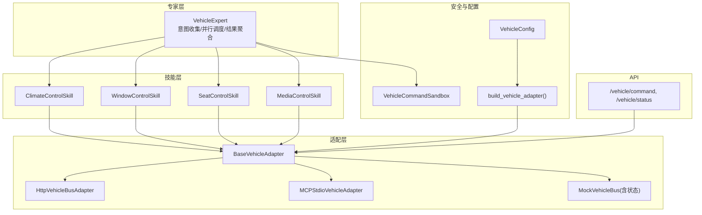
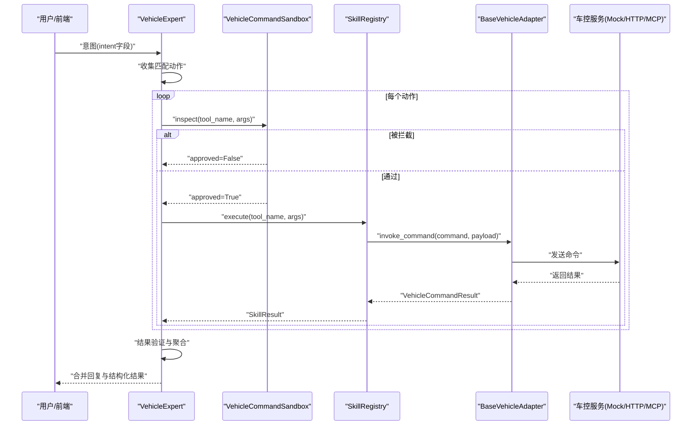
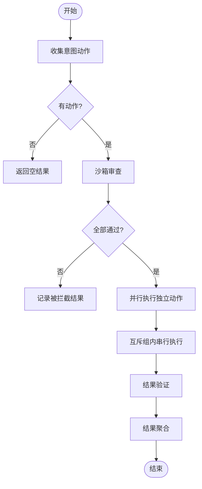
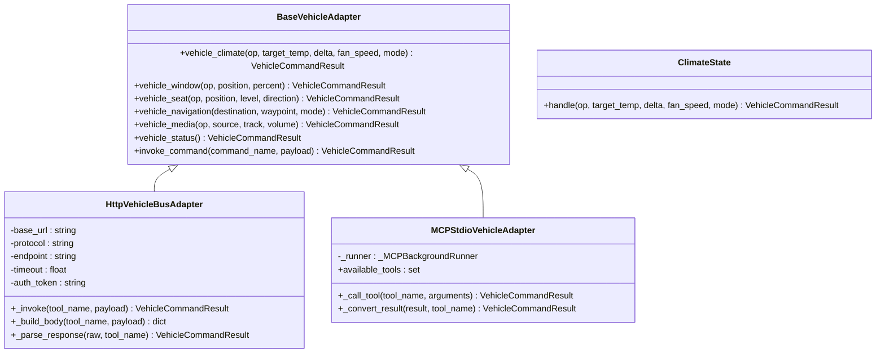
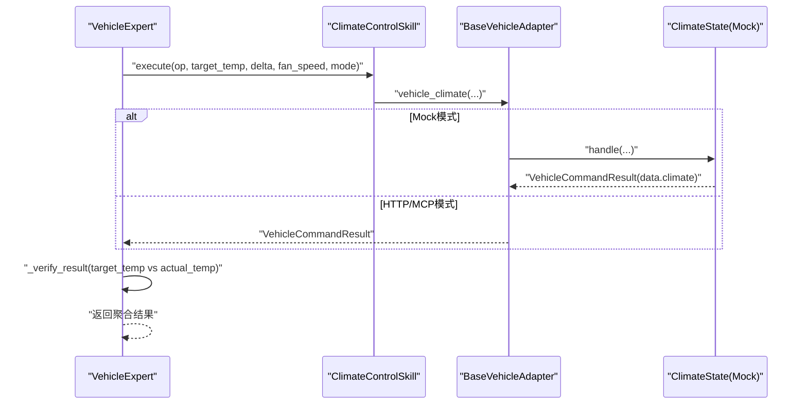
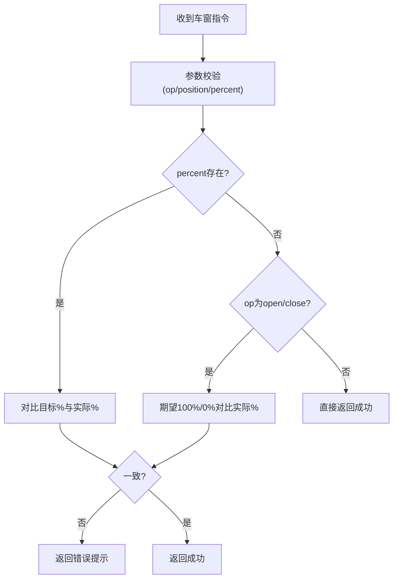
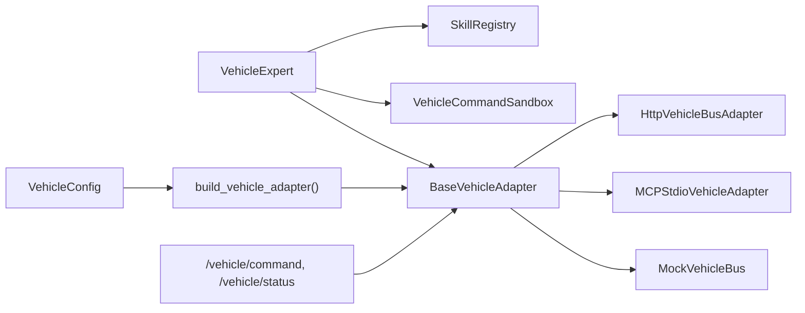

# VehicleExpert车辆专家

<cite>
**本文引用的文件**   
- [vehicle_expert.py](file://backend_design/nexus/agent/experts/vehicle_expert.py)
- [base.py](file://backend_design/nexus/skills/base.py)
- [__init__.py](file://backend_design/nexus/skills/vehicle/__init__.py)
- [climate.py](file://backend_design/nexus/skills/vehicle/climate.py)
- [window.py](file://backend_design/nexus/skills/vehicle/window.py)
- [seat.py](file://backend_design/nexus/skills/vehicle/seat.py)
- [media.py](file://backend_design/nexus/skills/vehicle/media.py)
- [base.py](file://backend_design/nexus/vehicle/base.py)
- [factory.py](file://backend_design/nexus/vehicle/factory.py)
- [http.py](file://backend_design/nexus/vehicle/http.py)
- [mcp.py](file://backend_design/nexus/vehicle/mcp.py)
- [climate_state.py](file://backend_design/nexus/vehicle/mock/climate_state.py)
- [vehicle.py](file://backend_design/nexus/api/routes/vehicle.py)
- [sandbox.py](file://backend_design/nexus/core/sandbox.py)
- [vehicle.py](file://backend_design/nexus/config/vehicle.py)
</cite>

## 目录
1. [简介](#简介)
2. [项目结构](#项目结构)
3. [核心组件](#核心组件)
4. [架构总览](#架构总览)
5. [详细组件分析](#详细组件分析)
6. [依赖关系分析](#依赖关系分析)
7. [性能考虑](#性能考虑)
8. [故障排查指南](#故障排查指南)
9. [结论](#结论)
10. [附录：车控指令自然语言映射表与参数规范](#附录车控指令自然语言映射表与参数规范)

## 简介
VehicleExpert（车辆专家）是车载多智能体系统中的“车控专家”，负责解析上层意图、调用车控技能、执行安全校验与结果验证，并聚合多动作的执行结果。其职责包括：
- 解析车控指令（空调、车窗、座椅、媒体、状态查询等）
- 通过统一适配器调用底层车控系统（Mock/HTTP/MCP三种模式）
- 对高危指令进行沙箱审查与频率限制
- 并行执行无冲突动作，互斥组内串行避免硬件冲突
- 对执行结果进行一致性校验，确保状态变更符合预期
- 输出统一的回复与结构化结果供上层编排器使用

## 项目结构
围绕 VehicleExpert 的关键代码分布在以下模块：
- 专家层：vehicle_expert.py（意图收集、并行/串行调度、结果聚合与验证）
- 技能层：skills/vehicle/*（具体车控技能的参数定义与调用封装）
- 适配层：vehicle/*（BaseVehicleAdapter 抽象及 Mock/HTTP/MCP 实现）
- 配置与工厂：config/vehicle.py、vehicle/factory.py（按环境变量选择适配器）
- 安全隔离：core/sandbox.py（参数范围、频率限制、审计日志）
- API 路由：api/routes/vehicle.py（直接命令接口与状态查询）

**图表来源** 
- [vehicle_expert.py:1-120](file://backend_design/nexus/agent/experts/vehicle_expert.py#L1-L120)
- [__init__.py:1-55](file://backend_design/nexus/skills/vehicle/__init__.py#L1-L55)
- [base.py:1-92](file://backend_design/nexus/vehicle/base.py#L1-L92)
- [factory.py:1-147](file://backend_design/nexus/vehicle/factory.py#L1-L147)
- [http.py:1-127](file://backend_design/nexus/vehicle/http.py#L1-L127)
- [mcp.py:1-285](file://backend_design/nexus/vehicle/mcp.py#L1-L285)
- [sandbox.py:1-120](file://backend_design/nexus/core/sandbox.py#L1-L120)
- [vehicle.py:1-50](file://backend_design/nexus/config/vehicle.py#L1-L50)
- [vehicle.py:1-152](file://backend_design/nexus/api/routes/vehicle.py#L1-L152)

**章节来源**
- [vehicle_expert.py:1-120](file://backend_design/nexus/agent/experts/vehicle_expert.py#L1-L120)
- [base.py:1-92](file://backend_design/nexus/vehicle/base.py#L1-L92)
- [factory.py:1-147](file://backend_design/nexus/vehicle/factory.py#L1-L147)
- [sandbox.py:1-120](file://backend_design/nexus/core/sandbox.py#L1-L120)
- [vehicle.py:1-50](file://backend_design/nexus/config/vehicle.py#L1-L50)
- [vehicle.py:1-152](file://backend_design/nexus/api/routes/vehicle.py#L1-L152)

## 核心组件
- VehicleExpert：车控专家主流程，负责意图收集、沙箱审查、并行/串行执行、结果聚合与验证。
- VehicleBaseSkill：车控技能基类，统一通过 BaseVehicleAdapter 调用车控总线，支持多座舱隔离。
- BaseVehicleAdapter：车控适配器抽象，定义空调、车窗、座椅、导航、媒体、状态查询与通用 invoke_command 接口。
- 适配器实现：
  - HttpVehicleBusAdapter：HTTP/REST 或 JSON-RPC 方式对接真实车控服务。
  - MCPStdioVehicleAdapter：通过 MCP stdio 与外部服务通信，内部异步驱动。
  - MockVehicleBus：开发测试用模拟实现，提供状态隔离的 Mock 状态管理。
- VehicleCommandSandbox：高危指令沙箱，进行参数范围校验、频率限制、危险组合拦截与审计日志。
- VehicleConfig：车控适配器配置（adapter、HTTP 地址/超时/Token、MCP 启动命令等）。
- API 路由：/vehicle/command 与 /vehicle/status，支持直接命令执行与状态查询，具备 JWT 认证与座舱隔离。

**章节来源**
- [vehicle_expert.py:1-120](file://backend_design/nexus/agent/experts/vehicle_expert.py#L1-L120)
- [__init__.py:1-55](file://backend_design/nexus/skills/vehicle/__init__.py#L1-L55)
- [base.py:1-92](file://backend_design/nexus/vehicle/base.py#L1-L92)
- [http.py:1-127](file://backend_design/nexus/vehicle/http.py#L1-L127)
- [mcp.py:1-285](file://backend_design/nexus/vehicle/mcp.py#L1-L285)
- [sandbox.py:1-120](file://backend_design/nexus/core/sandbox.py#L1-L120)
- [vehicle.py:1-50](file://backend_design/nexus/config/vehicle.py#L1-L50)
- [vehicle.py:1-152](file://backend_design/nexus/api/routes/vehicle.py#L1-L152)

## 架构总览
VehicleExpert 将上层意图转换为多个车控动作，经沙箱审查后并行执行；同一互斥组内的动作串行执行以避免硬件冲突。所有动作通过 SkillRegistry 执行，最终由适配器统一发送到后端车控系统。

**图表来源** 
- [vehicle_expert.py:49-116](file://backend_design/nexus/agent/experts/vehicle_expert.py#L49-L116)
- [sandbox.py:133-176](file://backend_design/nexus/core/sandbox.py#L133-L176)
- [__init__.py:44-55](file://backend_design/nexus/skills/vehicle/__init__.py#L44-L55)
- [base.py:90-92](file://backend_design/nexus/vehicle/base.py#L90-L92)
- [http.py:65-98](file://backend_design/nexus/vehicle/http.py#L65-L98)
- [mcp.py:222-238](file://backend_design/nexus/vehicle/mcp.py#L222-L238)

## 详细组件分析

### VehicleExpert 执行流程与互斥控制
- 意图收集：根据 _VEHICLE_ACTION_MAP 将 intent 字段映射到工具名（如 vehicle_climate、vehicle_window 等），过滤空值。
- 沙箱审查：逐个检查 tool_name 与 args，未通过的记录为 blocked_results。
- 并行/串行执行：独立动作并发执行；同一互斥组（如 climate、window、seat、media）内动作串行执行，组间并行。
- 结果聚合：合并 expert_results、skill_action、skill_handled、metadata、reply 等，跳过 LLM 合成直接使用工具返回的自然语言消息。
- 结果验证：针对空调温度、车窗位置、媒体播放状态等进行一致性校验，失败时修正状态与消息。

**图表来源** 
- [vehicle_expert.py:49-116](file://backend_design/nexus/agent/experts/vehicle_expert.py#L49-L116)
- [vehicle_expert.py:117-178](file://backend_design/nexus/agent/experts/vehicle_expert.py#L117-L178)
- [vehicle_expert.py:246-326](file://backend_design/nexus/agent/experts/vehicle_expert.py#L246-L326)
- [vehicle_expert.py:327-428](file://backend_design/nexus/agent/experts/vehicle_expert.py#L327-L428)

**章节来源**
- [vehicle_expert.py:49-116](file://backend_design/nexus/agent/experts/vehicle_expert.py#L49-L116)
- [vehicle_expert.py:117-178](file://backend_design/nexus/agent/experts/vehicle_expert.py#L117-L178)
- [vehicle_expert.py:246-326](file://backend_design/nexus/agent/experts/vehicle_expert.py#L246-L326)
- [vehicle_expert.py:327-428](file://backend_design/nexus/agent/experts/vehicle_expert.py#L327-L428)

### 车控技能与适配器集成
- VehicleBaseSkill：统一通过 adapter.invoke_command(tool_name, payload) 调用，返回 SkillResult。
- BaseVehicleAdapter：定义各子系统方法（climate/window/seat/navigation/media/status）与通用 invoke_command。
- 适配器实现：
  - HTTP：构建请求体（JSON-RPC 或 REST），处理响应格式，异常分类（HTTP错误、连接失败、调用失败）。
  - MCP：后台线程运行事件循环，初始化会话、列出可用工具、同步桥接异步调用，转换 CallToolResult 为 VehicleCommandResult。
  - Mock：内存状态管理，支持电源开关、温度/风量/模式设置与状态查询。

**图表来源** 
- [base.py:35-92](file://backend_design/nexus/vehicle/base.py#L35-L92)
- [http.py:23-98](file://backend_design/nexus/vehicle/http.py#L23-L98)
- [mcp.py:167-238](file://backend_design/nexus/vehicle/mcp.py#L167-L238)
- [climate_state.py:22-143](file://backend_design/nexus/vehicle/mock/climate_state.py#L22-L143)

**章节来源**
- [__init__.py:21-55](file://backend_design/nexus/skills/vehicle/__init__.py#L21-L55)
- [base.py:35-92](file://backend_design/nexus/vehicle/base.py#L35-L92)
- [http.py:23-98](file://backend_design/nexus/vehicle/http.py#L23-L98)
- [mcp.py:167-238](file://backend_design/nexus/vehicle/mcp.py#L167-L238)
- [climate_state.py:22-143](file://backend_design/nexus/vehicle/mock/climate_state.py#L22-L143)

### 空调控制（Climate）
- 技能定义：ClimateControlSkill，参数包含 op、target_temp、delta、fan_speed、mode。
- 执行流程：通过 VehicleBaseSkill._invoke 调用 adapter.vehicle_climate，返回 SkillResult。
- Mock 状态：ClimateState.handle 支持电源开关、温度微调、风量设置、模式切换与状态查询，复合指令可同时生效。
- 验证逻辑：VehicleExpert._verify_result 对比目标温度与实际温度，不一致则返回错误提示。

**图表来源** 
- [climate.py:15-37](file://backend_design/nexus/skills/vehicle/climate.py#L15-L37)
- [__init__.py:44-55](file://backend_design/nexus/skills/vehicle/__init__.py#L44-L55)
- [climate_state.py:41-143](file://backend_design/nexus/vehicle/mock/climate_state.py#L41-L143)
- [vehicle_expert.py:346-364](file://backend_design/nexus/agent/experts/vehicle_expert.py#L346-L364)

**章节来源**
- [climate.py:15-37](file://backend_design/nexus/skills/vehicle/climate.py#L15-L37)
- [climate_state.py:41-143](file://backend_design/nexus/vehicle/mock/climate_state.py#L41-L143)
- [vehicle_expert.py:346-364](file://backend_design/nexus/agent/experts/vehicle_expert.py#L346-L364)

### 车窗调节（Window）
- 技能定义：WindowControlSkill，参数包含 op、position、percent。
- 执行流程：通过 VehicleBaseSkill._invoke 调用 adapter.vehicle_window。
- 验证逻辑：对比目标百分比或 open/close 操作期望值与实际值，不一致则返回错误提示。

**图表来源** 
- [window.py:15-34](file://backend_design/nexus/skills/vehicle/window.py#L15-L34)
- [vehicle_expert.py:365-400](file://backend_design/nexus/agent/experts/vehicle_expert.py#L365-L400)

**章节来源**
- [window.py:15-34](file://backend_design/nexus/skills/vehicle/window.py#L15-L34)
- [vehicle_expert.py:365-400](file://backend_design/nexus/agent/experts/vehicle_expert.py#L365-L400)

### 座椅设置（Seat）
- 技能定义：SeatControlSkill，参数包含 op、position、level、direction。
- 执行流程：通过 VehicleBaseSkill._invoke 调用 adapter.vehicle_seat。
- 沙箱校验：对 level 进行范围校验与类型校验，非法值将被阻断。

**章节来源**
- [seat.py:15-35](file://backend_design/nexus/skills/vehicle/seat.py#L15-L35)
- [sandbox.py:310-320](file://backend_design/nexus/core/sandbox.py#L310-L320)

### 导航控制（Navigation）
- 适配器接口：vehicle_navigation(destination, waypoint, mode)。
- 执行流程：通过 VehicleBaseSkill._invoke 调用 adapter.vehicle_navigation。
- 注意：当前文档未提供具体技能实现文件，但可通过通用 invoke_command 调用。

**章节来源**
- [base.py:70-73](file://backend_design/nexus/vehicle/base.py#L70-L73)
- [__init__.py:44-55](file://backend_design/nexus/skills/vehicle/__init__.py#L44-L55)

### 媒体控制（Media）
- 技能定义：MediaControlSkill，参数包含 op、source、track、volume。
- 执行流程：通过 VehicleBaseSkill._invoke 调用 adapter.vehicle_media。
- 验证逻辑：play/pause 操作后检查 media.playing 状态，不一致则返回错误提示。

**章节来源**
- [media.py:15-36](file://backend_design/nexus/skills/vehicle/media.py#L15-L36)
- [vehicle_expert.py:401-425](file://backend_design/nexus/agent/experts/vehicle_expert.py#L401-L425)

### 状态查询（Status）
- 适配器接口：vehicle_status()。
- API 路由：GET /vehicle/status 返回扁平化状态数据，支持座舱隔离。

**章节来源**
- [base.py:86-87](file://backend_design/nexus/vehicle/base.py#L86-L87)
- [vehicle.py:88-109](file://backend_design/nexus/api/routes/vehicle.py#L88-L109)

## 依赖关系分析
- VehicleExpert 依赖 SkillRegistry 执行技能，依赖 Sandbox 进行安全审查，依赖适配器统一调用后端。
- 适配器工厂根据配置选择 Mock/HTTP/MCP 实现，支持多座舱隔离。
- API 路由通过 JWT 认证与座舱 ID 获取对应适配器实例。

**图表来源** 
- [vehicle_expert.py:49-116](file://backend_design/nexus/agent/experts/vehicle_expert.py#L49-L116)
- [factory.py:38-123](file://backend_design/nexus/vehicle/factory.py#L38-L123)
- [vehicle.py:1-50](file://backend_design/nexus/config/vehicle.py#L1-L50)
- [vehicle.py:1-152](file://backend_design/nexus/api/routes/vehicle.py#L1-L152)

**章节来源**
- [vehicle_expert.py:49-116](file://backend_design/nexus/agent/experts/vehicle_expert.py#L49-L116)
- [factory.py:38-123](file://backend_design/nexus/vehicle/factory.py#L38-L123)
- [vehicle.py:1-50](file://backend_design/nexus/config/vehicle.py#L1-L50)
- [vehicle.py:1-152](file://backend_design/nexus/api/routes/vehicle.py#L1-L152)

## 性能考虑
- 并行执行：无冲突动作通过 asyncio.gather 并发执行，提升吞吐。
- 互斥串行：同一互斥组内串行执行，避免硬件冲突。
- 超时控制：单个动作执行设置超时（默认10秒），防止阻塞。
- 适配器优化：HTTP 模式支持连接复用与超时配置；MCP 模式后台事件循环减少阻塞。
- 缓存策略：技能层可配置 cache_ttl，车控类通常 has_side_effect=True 禁止缓存。

[本节为通用指导，不直接分析具体文件]

## 故障排查指南
- 常见错误类型：
  - 沙箱拦截：参数范围超限、频率限制、危险组合、非法操作符。
  - 执行超时：设备离线或服务响应慢，需重试或检查网络。
  - 结果不一致：温度/车窗位置/媒体状态与预期不符，检查后端状态与验证逻辑。
  - 适配器不可用：HTTP 连接失败、MCP 会话未初始化、Mock 状态未更新。
- 排查步骤：
  - 查看沙箱审计日志（get_audit_log），确认被拦截原因。
  - 检查适配器日志（HTTP/MCP），确认请求与响应格式。
  - 验证意图字段映射是否正确，参数是否齐全。
  - 使用 /vehicle/status 获取当前状态，对比执行前后差异。

**章节来源**
- [sandbox.py:133-176](file://backend_design/nexus/core/sandbox.py#L133-L176)
- [sandbox.py:334-386](file://backend_design/nexus/core/sandbox.py#L334-L386)
- [http.py:82-92](file://backend_design/nexus/vehicle/http.py#L82-L92)
- [mcp.py:225-238](file://backend_design/nexus/vehicle/mcp.py#L225-L238)
- [vehicle_expert.py:189-208](file://backend_design/nexus/agent/experts/vehicle_expert.py#L189-L208)

## 结论
VehicleExpert 通过意图解析、沙箱审查、并行/串行调度与结果验证，实现了安全、高效的车控指令执行。其适配器抽象与工厂机制支持 Mock/HTTP/MCP 三种模式灵活切换，满足开发与生产环境需求。建议在生产环境中启用沙箱与监控，结合 API 路由与状态查询进行持续观测与故障定位。

[本节为总结性内容，不直接分析具体文件]

## 附录：车控指令自然语言映射表与参数规范
- 空调控制（Climate）
  - 示例输入与参数：
    - “有点冷，调高一点温度” → {"op": "temp_up", "delta": 1}
    - “把空调调到24度” → {"op": "set_temp", "target_temp": 24}
    - “风量调到3档” → {"op": "set_fan", "fan_speed": 3}
    - “切到自动空调” → {"op": "set_mode", "mode": "auto"}
  - 参数说明：
    - op: 操作类型（temp_up/temp_down/set_temp/set_fan/set_mode/status）
    - target_temp: 目标温度（整数）
    - delta: 相对调节幅度（整数）
    - fan_speed: 风量档位（1-7）
    - mode: 模式（auto/cool/heat/defog/vent/defrost）

- 车窗调节（Window）
  - 示例输入与参数：
    - “打开车窗” → {"op": "open", "position": "all", "percent": 100}
    - “关闭天窗” → {"op": "close", "position": "sunroof", "percent": 0}
    - “把左前窗调到一半” → {"op": "set_position", "position": "front_left", "percent": 50}
  - 参数说明：
    - op: 操作类型（open/close/up/down/set_position）
    - position: 位置（all/sunroof/front_left/front_right/rear_left/rear_right）
    - percent: 开合百分比（0-100）

- 座椅设置（Seat）
  - 示例输入与参数：
    - “打开主驾座椅加热” → {"op": "heat_on", "position": "driver", "level": 1}
    - “副驾座椅通风开到2档” → {"op": "cool_on", "position": "passenger", "level": 2}
    - “打开按摩” → {"op": "massage_on", "position": "driver", "level": 1}
  - 参数说明：
    - op: 操作类型（heat_on/cool_on/massage_on/forward/backward）
    - position: 座椅位置（driver/passenger）
    - level: 档位（0-3）
    - direction: 方向（forward/backward）

- 媒体控制（Media）
  - 示例输入与参数：
    - “播放音乐” → {"op": "play", "source": "local"}
    - “下一首” → {"op": "next"}
    - “音量调到16” → {"op": "set_volume", "volume": 16}
    - “切换到蓝牙” → {"op": "set_source", "source": "bluetooth"}
  - 参数说明：
    - op: 操作类型（play/pause/next/prev/set_volume/set_source）
    - source: 媒体来源（local/bluetooth/radio）
    - track: 指定曲目或内容
    - volume: 音量大小（0-30）

- 状态查询（Status）
  - 无需参数，返回空调、车窗、座椅、媒体、导航、车况等状态。

**章节来源**
- [climate.py:21-33](file://backend_design/nexus/skills/vehicle/climate.py#L21-L33)
- [window.py:21-30](file://backend_design/nexus/skills/vehicle/window.py#L21-L30)
- [seat.py:21-31](file://backend_design/nexus/skills/vehicle/seat.py#L21-L31)
- [media.py:21-32](file://backend_design/nexus/skills/vehicle/media.py#L21-L32)