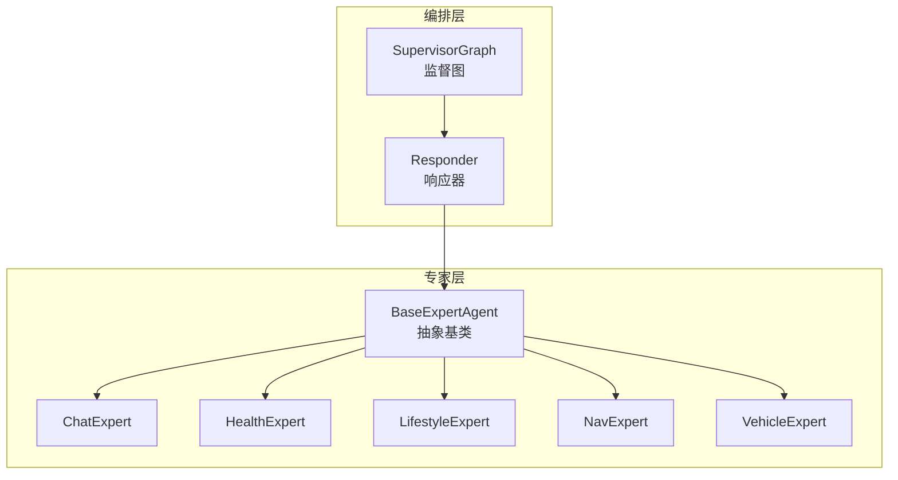
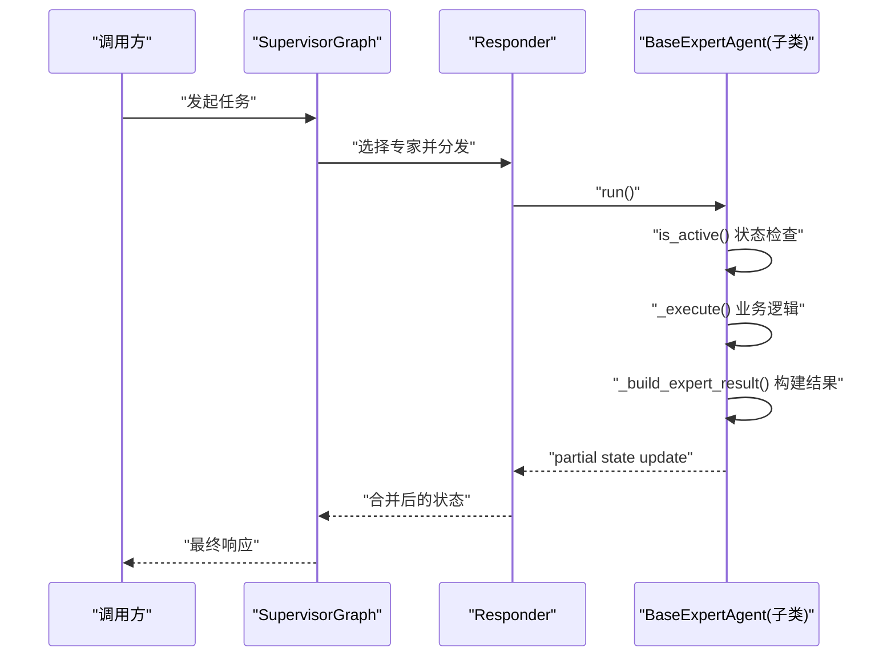
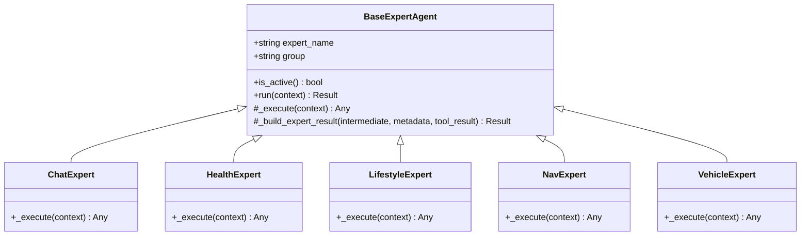
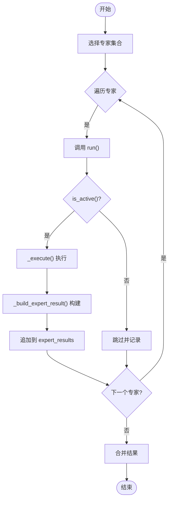
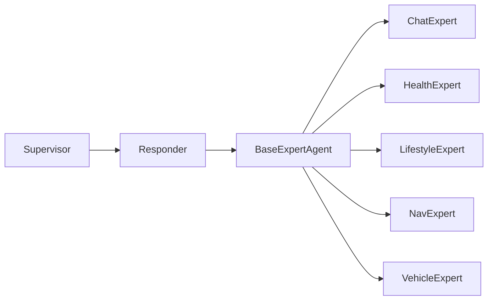

# 专家Agent基础框架

<cite>
**本文引用的文件**   
- [base.py](file://backend_design/nexus/agent/experts/base.py)
- [chat_expert.py](file://backend_design/nexus/agent/experts/chat_expert.py)
- [health_expert.py](file://backend_design/nexus/agent/experts/health_expert.py)
- [lifestyle_expert.py](file://backend_design/nexus/agent/experts/lifestyle_expert.py)
- [nav_expert.py](file://backend_design/nexus/agent/experts/nav_expert.py)
- [vehicle_expert.py](file://backend_design/nexus/agent/experts/vehicle_expert.py)
- [responder.py](file://backend_design/nexus/agent/responder.py)
- [supervisor_graph.py](file://backend_design/nexus/agent/supervisor_graph.py)
</cite>

## 目录
1. [简介](#简介)
2. [项目结构](#项目结构)
3. [核心组件](#核心组件)
4. [架构总览](#架构总览)
5. [详细组件分析](#详细组件分析)
6. [依赖关系分析](#依赖关系分析)
7. [性能考量](#性能考量)
8. [故障排查指南](#故障排查指南)
9. [结论](#结论)
10. [附录](#附录)

## 简介
本文件面向“专家Agent基础框架”的技术文档，聚焦于 BaseExpertAgent 抽象基类的设计模式与核心机制。内容涵盖：
- expert_name 与 group 属性的职责与使用约定
- is_active() 的状态检查逻辑
- run() 的完整执行流程（含性能监控、异常处理、日志记录）
- _execute() 抽象方法的实现规范
- _build_expert_result() 结果构建器的参数格式与返回结构
- partial state update 机制的工作原理（expert_results 累加策略、metadata 标准化、tool_result 顶层字段作用）
- 自定义专家Agent的开发指南（继承步骤、_execute 示例路径、错误处理与性能优化最佳实践）

## 项目结构
专家Agent相关代码位于 backend_design/nexus/agent 目录下，其中 experts 子目录包含 BaseExpertAgent 抽象基类与各具体专家实现；responder.py 与 supervisor_graph.py 负责编排与调度。

图表来源
- [base.py:1-200](file://backend_design/nexus/agent/experts/base.py#L1-L200)
- [chat_expert.py:1-200](file://backend_design/nexus/agent/experts/chat_expert.py#L1-L200)
- [health_expert.py:1-200](file://backend_design/nexus/agent/experts/health_expert.py#L1-L200)
- [lifestyle_expert.py:1-200](file://backend_design/nexus/agent/experts/lifestyle_expert.py#L1-L200)
- [nav_expert.py:1-200](file://backend_design/nexus/agent/experts/nav_expert.py#L1-L200)
- [vehicle_expert.py:1-200](file://backend_design/nexus/agent/experts/vehicle_expert.py#L1-L200)
- [responder.py:1-200](file://backend_design/nexus/agent/responder.py#L1-L200)
- [supervisor_graph.py:1-200](file://backend_design/nexus/agent/supervisor_graph.py#L1-L200)

章节来源
- [base.py:1-200](file://backend_design/nexus/agent/experts/base.py#L1-L200)
- [responder.py:1-200](file://backend_design/nexus/agent/responder.py#L1-L200)
- [supervisor_graph.py:1-200](file://backend_design/nexus/agent/supervisor_graph.py#L1-L200)

## 核心组件
- BaseExpertAgent：定义专家Agent的统一接口与通用执行流程，包括状态检查、运行生命周期、结果构建与部分状态更新。
- 具体专家实现：如 ChatExpert、HealthExpert、LifestyleExpert、NavExpert、VehicleExpert，均继承自 BaseExpertAgent，并实现领域特定的 _execute() 逻辑。
- Responder：协调多个专家的执行，收集并合并各专家的 partial state update。
- SupervisorGraph：高层编排，决定调用哪些专家以及顺序。

章节来源
- [base.py:1-200](file://backend_design/nexus/agent/experts/base.py#L1-L200)
- [chat_expert.py:1-200](file://backend_design/nexus/agent/experts/chat_expert.py#L1-L200)
- [health_expert.py:1-200](file://backend_design/nexus/agent/experts/health_expert.py#L1-L200)
- [lifestyle_expert.py:1-200](file://backend_design/nexus/agent/experts/lifestyle_expert.py#L1-L200)
- [nav_expert.py:1-200](file://backend_design/nexus/agent/experts/nav_expert.py#L1-L200)
- [vehicle_expert.py:1-200](file://backend_design/nexus/agent/experts/vehicle_expert.py#L1-L200)
- [responder.py:1-200](file://backend_design/nexus/agent/responder.py#L1-L200)
- [supervisor_graph.py:1-200](file://backend_design/nexus/agent/supervisor_graph.py#L1-L200)

## 架构总览
下图展示了从请求进入编排层到专家执行与结果聚合的整体流程。

图表来源
- [supervisor_graph.py:1-200](file://backend_design/nexus/agent/supervisor_graph.py#L1-L200)
- [responder.py:1-200](file://backend_design/nexus/agent/responder.py#L1-L200)
- [base.py:1-200](file://backend_design/nexus/agent/experts/base.py#L1-L200)

## 详细组件分析

### BaseExpertAgent 抽象基类
BaseExpertAgent 定义了专家Agent的统一契约与通用执行流程。其关键要点如下：
- 属性约定
  - expert_name：专家的唯一标识名，用于注册、路由与日志追踪。
  - group：专家分组标签，便于批量管理与权限控制。
- 状态检查
  - is_active()：在每次执行前进行活跃性检查，若返回非活跃则跳过执行或返回空结果，避免无效计算。
- 执行流程 run()
  - 入口方法，封装了完整的生命周期：
    - 性能监控：在进入与退出时记录耗时指标。
    - 异常处理：捕获异常并转换为标准错误结构，确保上层可统一处理。
    - 日志记录：输出关键节点信息（开始、结束、异常）。
    - 调用 _execute() 执行业务逻辑。
    - 调用 _build_expert_result() 将执行结果包装为标准结构。
    - 触发 partial state update，将结果追加到 expert_results 列表。
- 抽象方法 _execute()
  - 由子类实现，承载领域特定逻辑。
  - 输入参数通常为上下文对象（如用户意图、会话状态、工具集等），需保证幂等性与可重试性。
  - 返回值应为中间结果，供 _build_expert_result() 包装。
- 结果构建 _build_expert_result()
  - 参数格式：包含 _execute() 的中间结果、元数据（metadata）、可选的工具返回（tool_result）等。
  - 返回结构：标准化的专家结果对象，至少包含：
    - content：主文本或结构化内容
    - metadata：标准化元数据（如时间戳、版本、来源、评分等）
    - tool_result：顶层字段，用于透传工具调用结果（如外部API返回、数据库查询结果等）
    - status：执行状态（成功/失败/部分成功）
    - error：错误信息（当失败时）
- Partial State Update 机制
  - expert_results 列表：每个专家执行后，将其结果追加到该列表，支持多专家并行或串行执行后的增量聚合。
  - metadata 标准化：所有元数据遵循统一键名与类型约定，便于下游消费与可视化。
  - tool_result 顶层字段：作为工具调用的透明通道，允许上层直接访问原始工具返回，无需二次解析。

图表来源
- [base.py:1-200](file://backend_design/nexus/agent/experts/base.py#L1-L200)
- [chat_expert.py:1-200](file://backend_design/nexus/agent/experts/chat_expert.py#L1-L200)
- [health_expert.py:1-200](file://backend_design/nexus/agent/experts/health_expert.py#L1-L200)
- [lifestyle_expert.py:1-200](file://backend_design/nexus/agent/experts/lifestyle_expert.py#L1-L200)
- [nav_expert.py:1-200](file://backend_design/nexus/agent/experts/nav_expert.py#L1-L200)
- [vehicle_expert.py:1-200](file://backend_design/nexus/agent/experts/vehicle_expert.py#L1-L200)

章节来源
- [base.py:1-200](file://backend_design/nexus/agent/experts/base.py#L1-L200)

### 具体专家实现要点
- ChatExpert：对话型专家，侧重自然语言理解与回复生成。
- HealthExpert：健康领域专家，整合健康数据与建议。
- LifestyleExpert：生活方式专家，提供习惯、日程等建议。
- NavExpert：导航专家，处理路线规划与位置服务。
- VehicleExpert：车辆控制专家，对接车辆能力与状态。

以上实现均遵循 BaseExpertAgent 的契约，差异主要体现在 _execute() 的业务逻辑与 _build_expert_result() 的参数组装。

章节来源
- [chat_expert.py:1-200](file://backend_design/nexus/agent/experts/chat_expert.py#L1-L200)
- [health_expert.py:1-200](file://backend_design/nexus/agent/experts/health_expert.py#L1-L200)
- [lifestyle_expert.py:1-200](file://backend_design/nexus/agent/experts/lifestyle_expert.py#L1-L200)
- [nav_expert.py:1-200](file://backend_design/nexus/agent/experts/nav_expert.py#L1-L200)
- [vehicle_expert.py:1-200](file://backend_design/nexus/agent/experts/vehicle_expert.py#L1-L200)

### 编排与聚合
- Responder：负责根据 SupervisorGraph 的决策，依次或并行调用专家，收集 partial state update，并进行合并。
- SupervisorGraph：高层编排，依据意图识别、规则或模型路由选择专家集合与执行顺序。

图表来源
- [responder.py:1-200](file://backend_design/nexus/agent/responder.py#L1-L200)
- [supervisor_graph.py:1-200](file://backend_design/nexus/agent/supervisor_graph.py#L1-L200)
- [base.py:1-200](file://backend_design/nexus/agent/experts/base.py#L1-L200)

章节来源
- [responder.py:1-200](file://backend_design/nexus/agent/responder.py#L1-L200)
- [supervisor_graph.py:1-200](file://backend_design/nexus/agent/supervisor_graph.py#L1-L200)

## 依赖关系分析
- BaseExpertAgent 被所有具体专家继承，形成稳定的抽象边界。
- Responder 依赖 BaseExpertAgent 的公共接口，不感知具体实现细节，符合开闭原则。
- SupervisorGraph 依赖 Responder 与专家集合，负责宏观调度。

图表来源
- [base.py:1-200](file://backend_design/nexus/agent/experts/base.py#L1-L200)
- [responder.py:1-200](file://backend_design/nexus/agent/responder.py#L1-L200)
- [supervisor_graph.py:1-200](file://backend_design/nexus/agent/supervisor_graph.py#L1-L200)

章节来源
- [base.py:1-200](file://backend_design/nexus/agent/experts/base.py#L1-L200)
- [responder.py:1-200](file://backend_design/nexus/agent/responder.py#L1-L200)
- [supervisor_graph.py:1-200](file://backend_design/nexus/agent/supervisor_graph.py#L1-L200)

## 性能考量
- 在 run() 中引入性能监控，有助于定位慢专家与热点路径。
- is_active() 的快速短路可减少不必要的计算开销。
- partial state update 的增量追加策略有利于并行执行与流式聚合。
- 建议在 _execute() 中避免阻塞I/O，必要时采用异步或缓存策略。

[本节为通用指导，不涉及具体文件分析]

## 故障排查指南
- 常见异常类型
  - 参数校验失败：检查传入上下文的必填字段。
  - 外部依赖超时：关注 _execute() 中的网络或数据库调用。
  - 结果构建错误：确认 _build_expert_result() 的返回结构与上游期望一致。
- 诊断建议
  - 启用详细日志，记录 run() 的开始与结束时间、异常堆栈。
  - 检查 expert_results 列表是否按预期追加，确认 metadata 标准化。
  - 对 tool_result 顶层字段进行断言，确保其存在且类型正确。

章节来源
- [base.py:1-200](file://backend_design/nexus/agent/experts/base.py#L1-L200)

## 结论
BaseExpertAgent 通过统一的抽象与执行流程，为专家Agent提供了稳定可扩展的基础设施。结合 partial state update 机制与标准化的结果结构，系统实现了高内聚、低耦合的专家生态。遵循本文档的开发指南与最佳实践，可快速构建高质量的专业领域专家。

[本节为总结性内容，不涉及具体文件分析]

## 附录

### 自定义专家Agent开发指南
- 继承 BaseExpertAgent
  - 设置 expert_name 与 group 属性，确保唯一性与分组清晰。
  - 实现 is_active()，定义专家活跃条件（如配置开关、依赖可用性）。
- 实现 _execute()
  - 接收上下文参数，执行业务逻辑，返回中间结果。
  - 保持幂等与可重试，避免副作用。
- 使用 _build_expert_result()
  - 组装 content、metadata、tool_result、status、error 等字段。
  - 确保 metadata 键名与类型符合标准化约定。
- 错误处理与性能优化
  - 在 _execute() 中捕获并转换异常，避免污染上层。
  - 对耗时操作增加缓存或降级策略。
  - 利用 run() 的性能监控数据进行持续优化。

章节来源
- [base.py:1-200](file://backend_design/nexus/agent/experts/base.py#L1-L200)