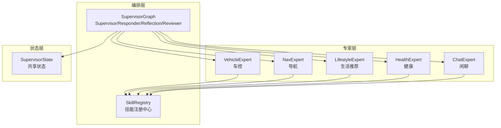
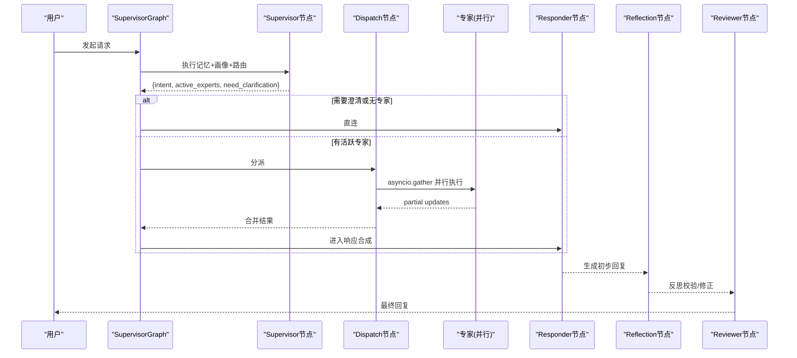
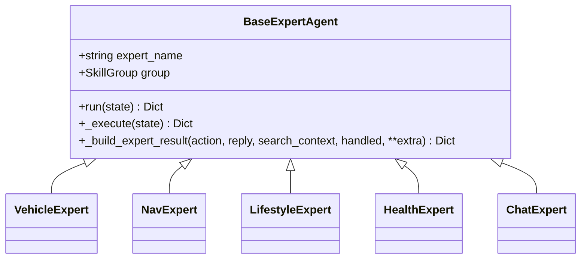
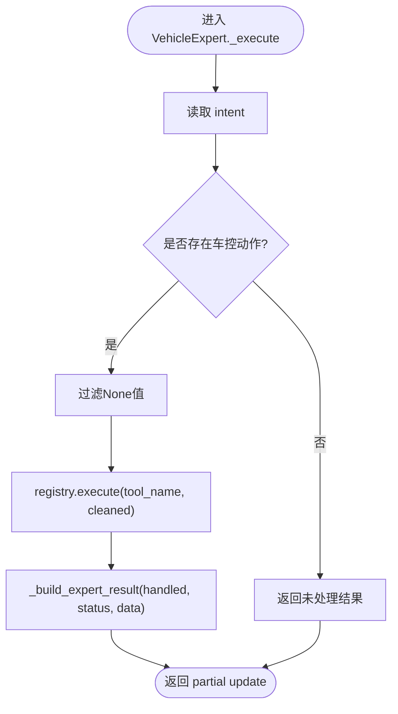
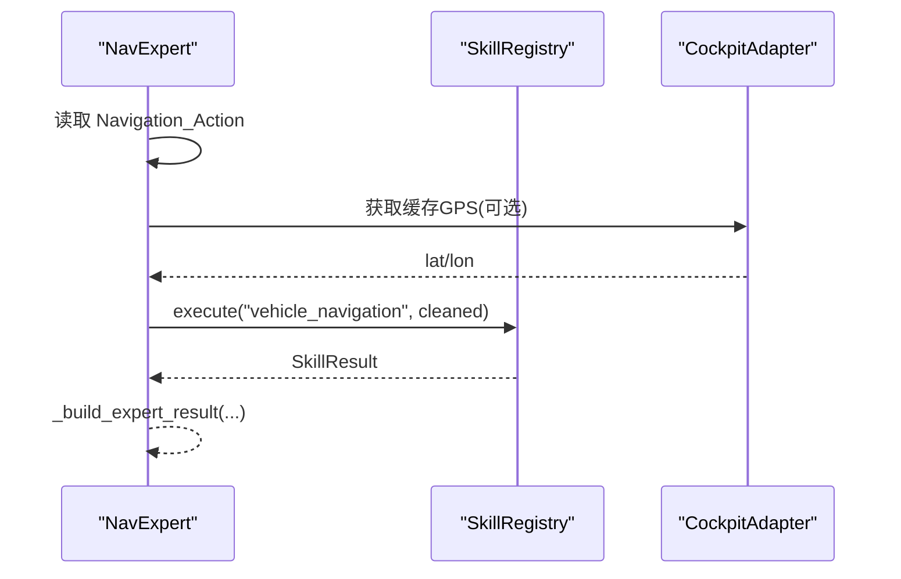
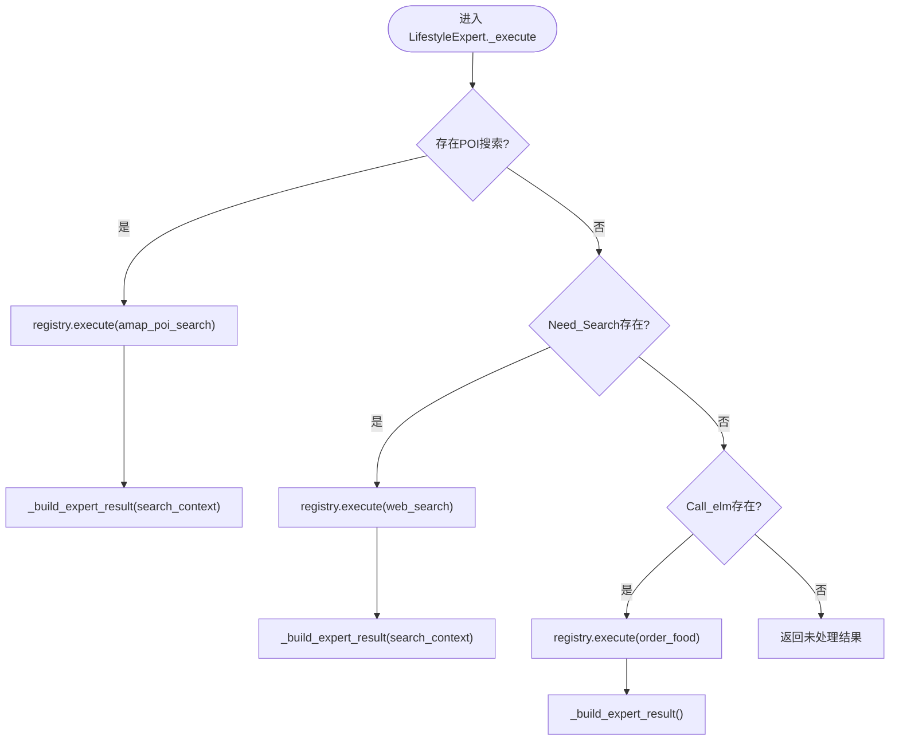
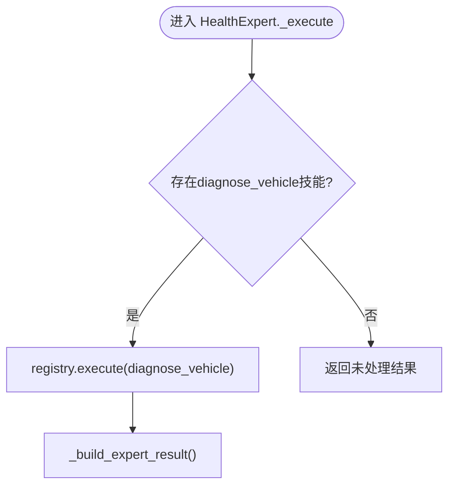
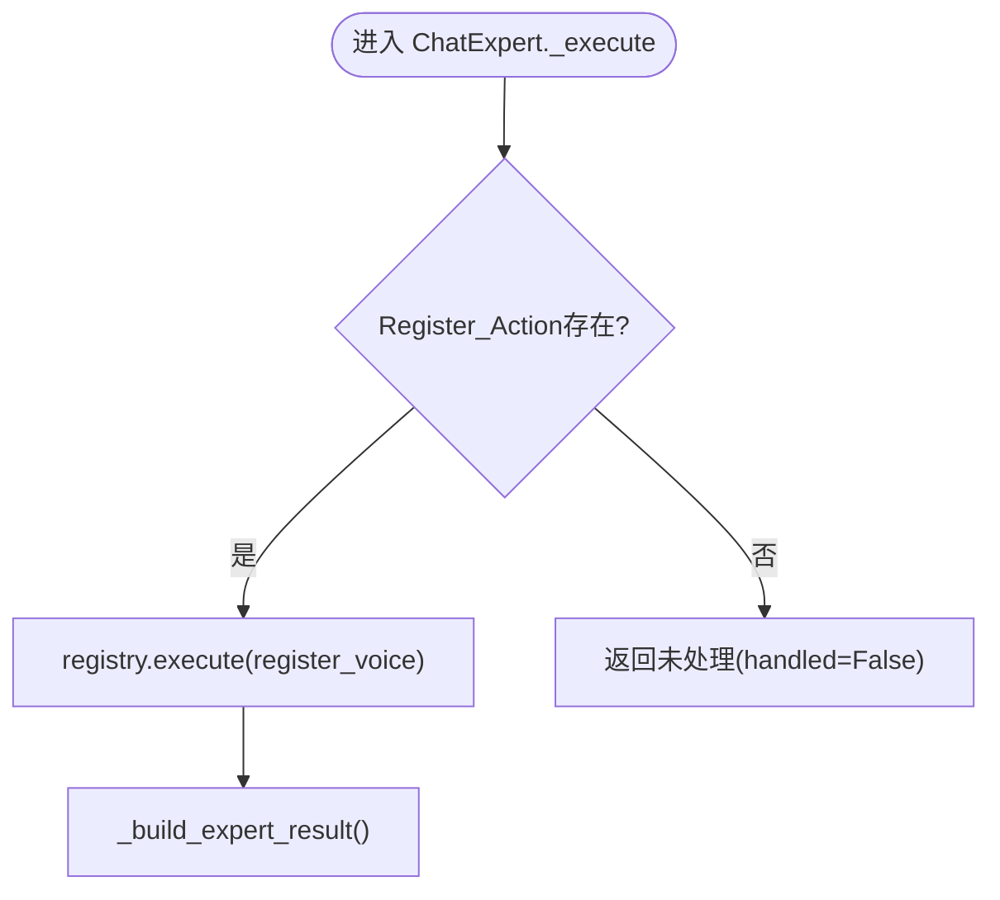
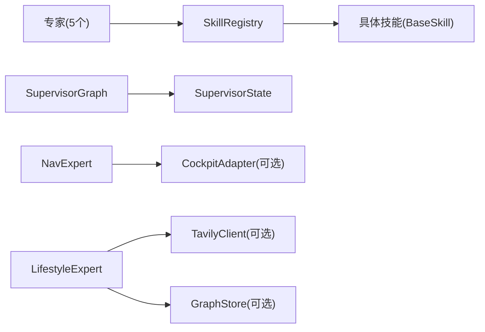

# 专家Agent系统

<cite>
**本文引用的文件**
- [base.py](file://backend_design/nexus/agent/experts/base.py)
- [vehicle_expert.py](file://backend_design/nexus/agent/experts/vehicle_expert.py)
- [nav_expert.py](file://backend_design/nexus/agent/experts/nav_expert.py)
- [lifestyle_expert.py](file://backend_design/nexus/agent/experts/lifestyle_expert.py)
- [health_expert.py](file://backend_design/nexus/agent/experts/health_expert.py)
- [chat_expert.py](file://backend_design/nexus/agent/experts/chat_expert.py)
- [supervisor_graph.py](file://backend_design/nexus/agent/supervisor_graph.py)
- [state.py](file://backend_design/nexus/models/state.py)
- [base.py](file://backend_design/nexus/skills/base.py)
- [registry.py](file://backend_design/nexus/skills/registry.py)
- [special.py](file://backend_design/nexus/skills/special.py)
</cite>

## 目录
1. [引言](#引言)
2. [项目结构](#项目结构)
3. [核心组件](#核心组件)
4. [架构总览](#架构总览)
5. [详细组件分析](#详细组件分析)
6. [依赖关系分析](#依赖关系分析)
7. [性能考量](#性能考量)
8. [故障排查指南](#故障排查指南)
9. [结论](#结论)
10. [附录：自定义专家开发指南](#附录自定义专家开发指南)

## 引言
本技术文档面向“专家Agent系统”，聚焦于多智能体编排与并行执行机制。系统以 Supervisor 为调度中心，将用户意图路由到五个专业领域专家（车控、导航、生活推荐、健康咨询、闲聊），各专家通过统一的技能注册中心调用具体工具，最终由 Responder 汇总并生成自然语言回复，Reviewer 进行质量审查与反思校验。

## 项目结构
专家Agent系统位于后端设计模块的 agent 与 skills 子系统中，核心文件包括：
- 专家基类与具体专家实现：agent/experts 目录
- 工作流编排与并行调度：agent/supervisor_graph.py
- 共享状态定义：models/state.py
- 技能抽象与注册中心：skills/base.py、skills/registry.py
- 非车载技能示例：skills/special.py

图表来源
- [supervisor_graph.py:127-173](file://backend_design/nexus/agent/supervisor_graph.py#L127-L173)
- [state.py:38-101](file://backend_design/nexus/models/state.py#L38-L101)

章节来源
- [supervisor_graph.py:127-173](file://backend_design/nexus/agent/supervisor_graph.py#L127-L173)
- [state.py:38-101](file://backend_design/nexus/models/state.py#L38-L101)

## 核心组件
- BaseExpertAgent：所有专家的抽象基类，提供 run() 接口规范、partial updates 构建、错误处理与元数据注入。
- 五大专家：VehicleExpert、NavExpert、LifestyleExpert、HealthExpert、ChatExpert，各自封装一组相关技能。
- SkillRegistry：统一技能发现、实例化与执行入口，支持装饰器自动注册与手动兼容。
- SupervisorState：LangGraph 共享状态，使用 Annotated reducer 合并列表与字典字段。
- SupervisorGraph：编排 Supervisor → 专家并行 → Responder → Reflection → Reviewer 的工作流。

章节来源
- [base.py:26-133](file://backend_design/nexus/agent/experts/base.py#L26-L133)
- [registry.py:35-196](file://backend_design/nexus/skills/registry.py#L35-L196)
- [state.py:38-161](file://backend_design/nexus/models/state.py#L38-L161)
- [supervisor_graph.py:69-173](file://backend_design/nexus/agent/supervisor_graph.py#L69-L173)

## 架构总览
SupervisorGraph 基于 LangGraph StateGraph 构建，关键流程如下：
- Supervisor 节点：记忆召回 + 用户画像加载 + 意图路由 + 决定 active_experts
- dispatch 节点：并行执行所有活跃专家（asyncio.gather）
- Responder 节点：根据 skill_handled/tool_result/search_context 分支生成最终回复
- Reflection 节点：对 LLM 输出做事实性/一致性/无幻觉检查，必要时修正
- Reviewer 节点：最终审查后结束

图表来源
- [supervisor_graph.py:127-173](file://backend_design/nexus/agent/supervisor_graph.py#L127-L173)
- [supervisor_graph.py:326-399](file://backend_design/nexus/agent/supervisor_graph.py#L326-L399)
- [supervisor_graph.py:401-450](file://backend_design/nexus/agent/supervisor_graph.py#L401-L450)
- [supervisor_graph.py:534-675](file://backend_design/nexus/agent/supervisor_graph.py#L534-L675)

## 详细组件分析

### BaseExpertAgent 抽象基类
- run() 接口规范
  - 接收完整 SupervisorState，若不在 active_experts 中则返回空字典（no-op）。
  - 记录耗时并写入 metadata.latency_ms。
  - 捕获异常，返回包含 expert_name_error 与 expert_name_latency_ms 的 partial update。
- _execute(state) 子类实现
  - 读取 intent，判断是否需要执行，调用 SkillRegistry.execute(...)。
  - 返回 partial state update，不直接修改原 state。
- _build_expert_result(...)
  - 构造 result_entry 追加到 expert_results 列表。
  - 同时写入 skill_action、skill_handled、search_context 等兼容 v1.0 字段。
  - v2.2：当 handled 且存在 tool_data 或 reply 时，提升 tool_result 到顶层 state，供 Responder 合成与反思使用。

图表来源
- [base.py:26-133](file://backend_design/nexus/agent/experts/base.py#L26-L133)

章节来源
- [base.py:26-133](file://backend_design/nexus/agent/experts/base.py#L26-L133)

### VehicleExpert（车控操作）
- 职责：处理空调/车窗/座椅/媒体/车辆状态查询。
- 意图映射：从 intent 中提取 Climate_Action、Window_Action、Seat_Action、Media_Action、Vehicle_Status_Action，映射到对应 vehicle_* 技能。
- 上下文处理：过滤 None 值后传入 registry.execute(...)；返回 handled 与 skill_status、skill_data。
- 典型调用路径：VehicleExpert._execute → SkillRegistry.execute("vehicle_xxx") → 具体技能 execute(...)

图表来源
- [vehicle_expert.py:33-63](file://backend_design/nexus/agent/experts/vehicle_expert.py#L33-L63)

章节来源
- [vehicle_expert.py:33-63](file://backend_design/nexus/agent/experts/vehicle_expert.py#L33-L63)

### NavExpert（导航服务）
- 职责：目的地设置、路线规划、途经点、当前位置查询。
- 位置增强：v2.2.2 修复，在 location/current_location/where/位置/我在哪 等操作时，尝试从 cockpit 适配器缓存中注入 GPS 坐标，避免 IP 定位超时导致“未知位置”。
- 调用路径：NavExpert._execute → registry.execute("vehicle_navigation", cleaned)

图表来源
- [nav_expert.py:27-74](file://backend_design/nexus/agent/experts/nav_expert.py#L27-L74)

章节来源
- [nav_expert.py:27-74](file://backend_design/nexus/agent/experts/nav_expert.py#L27-L74)

### LifestyleExpert（生活推荐）
- 职责：联网搜索、外卖点餐、本地生活推荐。
- 优先级策略：
  - 优先高德 POI 周边搜索（amap_poi_search），适用于“附近美食”、“周边加油站”等基于位置的推荐。
  - 其次通用联网搜索（web_search），用于实时信息、天气、新闻等。
  - 再次点餐（order_food），结合 graph_store 匹配菜单。
- 调用路径：依据 intent 字段选择 amap_poi_search / web_search / order_food。

图表来源
- [lifestyle_expert.py:23-78](file://backend_design/nexus/agent/experts/lifestyle_expert.py#L23-L78)

章节来源
- [lifestyle_expert.py:23-78](file://backend_design/nexus/agent/experts/lifestyle_expert.py#L23-L78)

### HealthExpert（健康咨询）
- 职责：车辆健康诊断、故障码翻译、保养建议。
- 当前阶段：骨架实现，检测 diagnose_vehicle 技能是否可用；若存在则调用，否则返回未处理。
- 调用路径：registry.get_skill("diagnose_vehicle") → registry.execute("diagnose_vehicle", {"query": user_input})

图表来源
- [health_expert.py:24-53](file://backend_design/nexus/agent/experts/health_expert.py#L24-L53)

章节来源
- [health_expert.py:24-53](file://backend_design/nexus/agent/experts/health_expert.py#L24-L53)

### ChatExpert（闲聊对话）
- 职责：纯 LLM 闲聊与声纹注册。
- 行为：
  - 若 Register_Action 存在，调用 register_voice 技能，返回 ACTION_REGISTER 指令供前端处理。
  - 纯闲聊时不标记 handled=True，让 Responder 走 LLM 分支。
- 调用路径：registry.execute("register_voice", {"user_name": ...})

图表来源
- [chat_expert.py:24-56](file://backend_design/nexus/agent/experts/chat_expert.py#L24-L56)

章节来源
- [chat_expert.py:24-56](file://backend_design/nexus/agent/experts/chat_expert.py#L24-L56)

## 依赖关系分析
- 专家与技能注册中心耦合度低：专家仅通过 SkillRegistry.execute(...) 调用工具，便于扩展与维护。
- 共享状态集中管理：SupervisorState 使用 Annotated reducer 合并 expert_results、metadata、history 等字段，避免覆盖冲突。
- 外部依赖：
  - 导航专家可能访问 Cockpit 适配器缓存（GPS 坐标）。
  - 生活推荐中的 web_search 依赖 TavilyClient（可选）。
  - 点餐技能依赖 graph_store（可选）。

图表来源
- [registry.py:35-196](file://backend_design/nexus/skills/registry.py#L35-L196)
- [state.py:38-101](file://backend_design/nexus/models/state.py#L38-L101)
- [nav_expert.py:27-74](file://backend_design/nexus/agent/experts/nav_expert.py#L27-L74)
- [special.py:29-112](file://backend_design/nexus/skills/special.py#L29-L112)

章节来源
- [registry.py:35-196](file://backend_design/nexus/skills/registry.py#L35-L196)
- [state.py:38-101](file://backend_design/nexus/models/state.py#L38-L101)
- [nav_expert.py:27-74](file://backend_design/nexus/agent/experts/nav_expert.py#L27-L74)
- [special.py:29-112](file://backend_design/nexus/skills/special.py#L29-L112)

## 性能考量
- 并行执行：dispatch 节点使用 asyncio.gather 并发调用所有活跃专家，显著降低端到端延迟。
- 合并策略：expert_results 通过 reducer 自动拼接；metadata 使用 merge_dict 合并；tool_result 传递到顶层供后续合成。
- 降级与容错：
  - 专家内部异常被捕获并记录 latency 与 error 信息。
  - 导航位置查询失败时回退到原始消息，避免 LLM 编造。
  - 反思节点可配置关闭以减少 LLM 调用。

[本节为通用指导，无需源码引用]

## 故障排查指南
- 专家运行异常
  - 现象：某专家抛出异常，日志中出现 expert_name_error 与 expert_name_latency_ms。
  - 排查：检查该专家 _execute 逻辑与 SkillRegistry.execute 返回值，确认参数清洗与工具可用性。
- 导航“未知位置”
  - 现象：location 查询返回未知位置。
  - 排查：确认 Cockpit 适配器缓存中存在 latitude/longitude；检查 NavExpert 注入逻辑是否触发。
- 搜索时效性问题
  - 现象：搜索结果时间偏差。
  - 排查：确认 WebSearchSkill 注入东八区时间与日期；检查反思节点是否正确提示时效性。
- 反思校验失败
  - 现象：final_response 被修正或反射结果为 corrected/error。
  - 排查：查看 reflection 节点 JSON 解析与 suggested_response；确认工具结果是否包含失败指示词。

章节来源
- [base.py:76-83](file://backend_design/nexus/agent/experts/base.py#L76-L83)
- [nav_expert.py:43-64](file://backend_design/nexus/agent/experts/nav_expert.py#L43-L64)
- [special.py:68-112](file://backend_design/nexus/skills/special.py#L68-L112)
- [supervisor_graph.py:534-675](file://backend_design/nexus/agent/supervisor_graph.py#L534-L675)

## 结论
专家Agent系统通过清晰的抽象基类与技能注册中心解耦了业务逻辑与工具调用，SupervisorGraph 利用 LangGraph 与 asyncio.gather 实现了高效的并行编排。Responder 的 Tool→LLM 合成与 Reflection 的反思校验共同保障了输出的准确性与一致性。整体架构具备良好的可扩展性与可维护性。

[本节为总结，无需源码引用]

## 附录：自定义专家开发指南
目标：新增一个自定义专家 Agent，继承 BaseExpertAgent，实现 run 方法（实际为 _execute），并注册到 Supervisor。

步骤
- 创建专家类
  - 新建文件 experts/custom_expert.py，继承 BaseExpertAgent。
  - 设置 expert_name 与 group（对应 SkillGroup 枚举）。
  - 实现 async def _execute(self, state): 读取 intent，调用 SkillRegistry.execute(...)，返回 partial update。
- 注册到 Supervisor
  - 在 SupervisorGraph.__init__ 中添加自定义专家实例到 self.experts 字典。
  - 在 _build_graph 中 workflow.add_node("custom_expert", self.experts["custom"].run)。
  - 在 _determine_experts 中增加意图匹配规则，将 custom 加入 active_experts。
- 最佳实践
  - 始终使用 _build_expert_result 构建返回，确保 expert_results、skill_action、skill_handled、search_context、metadata 正确填充。
  - 对异常进行 try/except 包裹，记录错误与耗时。
  - 对于副作用操作（如车控），确保 has_side_effect 控制缓存安全。
  - 对于需要外部依赖的技能，优先通过 SkillRegistry 注册与发现，避免硬编码。

参考路径
- 专家基类与 partial updates 构建：[base.py:26-133](file://backend_design/nexus/agent/experts/base.py#L26-L133)
- 专家注册与图构建：[supervisor_graph.py:102-173](file://backend_design/nexus/agent/supervisor_graph.py#L102-L173)
- 意图分派决策：[supervisor_graph.py:285-324](file://backend_design/nexus/agent/supervisor_graph.py#L285-L324)
- 并行分发与合并：[supervisor_graph.py:326-399](file://backend_design/nexus/agent/supervisor_graph.py#L326-L399)
- 技能注册中心与执行：[registry.py:35-196](file://backend_design/nexus/skills/registry.py#L35-L196)

章节来源
- [base.py:26-133](file://backend_design/nexus/agent/experts/base.py#L26-L133)
- [supervisor_graph.py:102-173](file://backend_design/nexus/agent/supervisor_graph.py#L102-L173)
- [supervisor_graph.py:285-324](file://backend_design/nexus/agent/supervisor_graph.py#L285-L324)
- [supervisor_graph.py:326-399](file://backend_design/nexus/agent/supervisor_graph.py#L326-L399)
- [registry.py:35-196](file://backend_design/nexus/skills/registry.py#L35-L196)