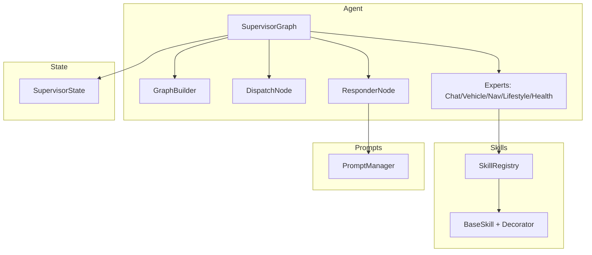
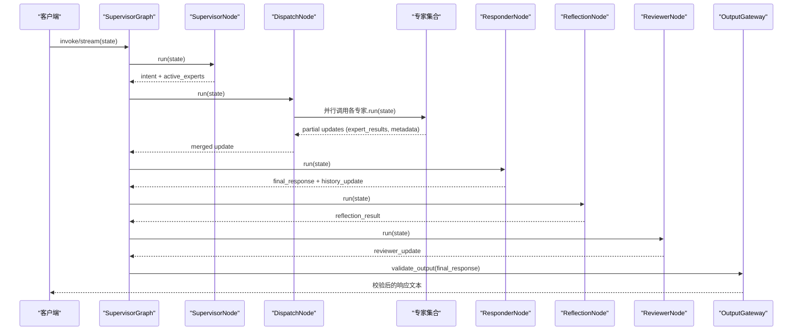
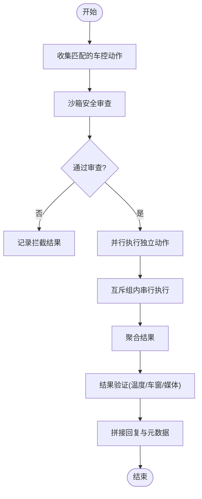
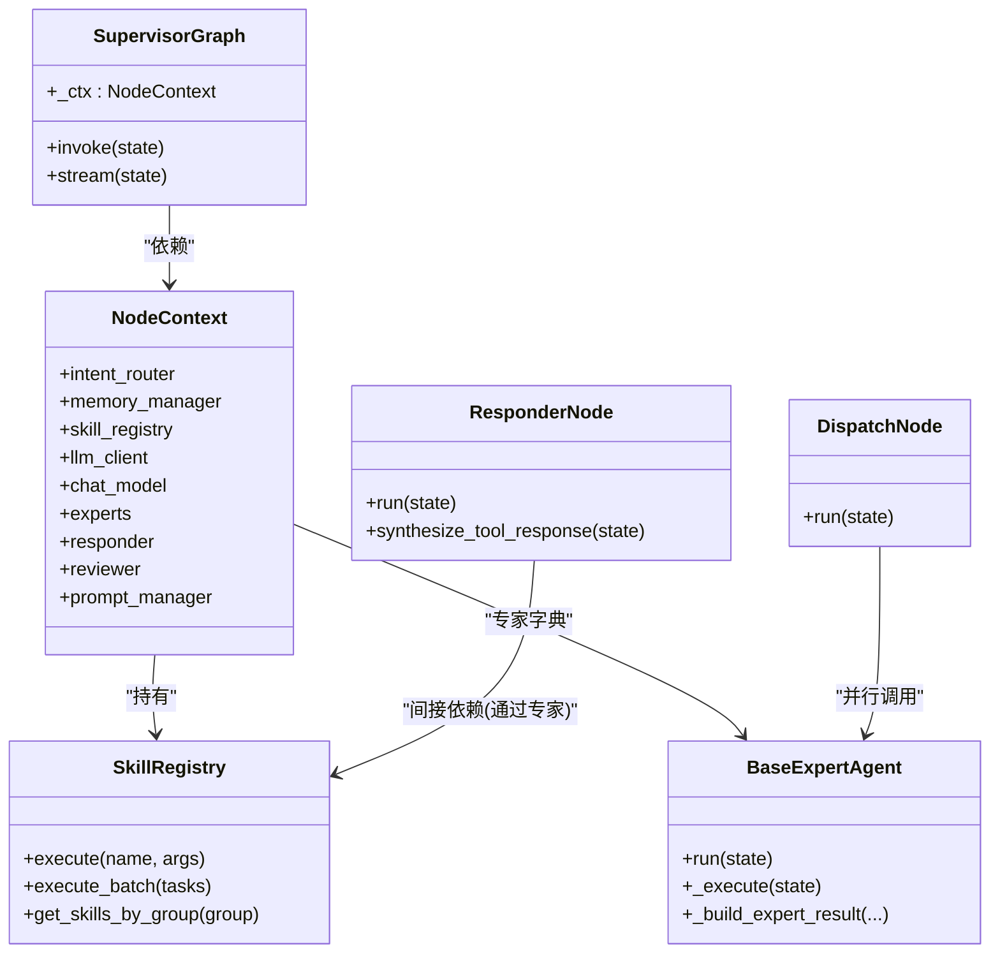

# 专家Agent系统

<cite>
**本文引用的文件**   
- [backend_design/nexus/agent/experts/base.py](file://backend_design/nexus/agent/experts/base.py)
- [backend_design/nexus/agent/experts/chat_expert.py](file://backend_design/nexus/agent/experts/chat_expert.py)
- [backend_design/nexus/agent/experts/vehicle_expert.py](file://backend_design/nexus/agent/experts/vehicle_expert.py)
- [backend_design/nexus/agent/experts/nav_expert.py](file://backend_design/nexus/agent/experts/nav_expert.py)
- [backend_design/nexus/agent/experts/lifestyle_expert.py](file://backend_design/nexus/agent/experts/lifestyle_expert.py)
- [backend_design/nexus/agent/experts/health_expert.py](file://backend_design/nexus/agent/experts/health_expert.py)
- [backend_design/nexus/skills/base.py](file://backend_design/nexus/skills/base.py)
- [backend_design/nexus/skills/registry.py](file://backend_design/nexus/skills/registry.py)
- [backend_design/nexus/models/state.py](file://backend_design/nexus/models/state.py)
- [backend_design/nexus/agent/graph_builder.py](file://backend_design/nexus/agent/graph_builder.py)
- [backend_design/nexus/agent/supervisor_graph.py](file://backend_design/nexus/agent/supervisor_graph.py)
- [backend_design/nexus/agent/nodes/dispatch_node.py](file://backend_design/nexus/agent/nodes/dispatch_node.py)
- [backend_design/nexus/agent/nodes/responder_node.py](file://backend_design/nexus/agent/nodes/responder_node.py)
- [backend_design/nexus/prompts/__init__.py](file://backend_design/nexus/prompts/__init__.py)
</cite>

## 目录
1. [引言](#引言)
2. [项目结构](#项目结构)
3. [核心组件](#核心组件)
4. [架构总览](#架构总览)
5. [详细组件分析](#详细组件分析)
6. [依赖关系分析](#依赖关系分析)
7. [性能与并发策略](#性能与并发策略)
8. [错误处理与容错](#错误处理与容错)
9. [测试策略](#测试策略)
10. [扩展指南：创建新专家 Agent](#扩展指南创建新专家-agent)
11. [结论](#结论)

## 引言
本技术文档面向 NexusCockpit 专家 Agent 系统，聚焦 BaseExpertAgent 抽象基类的设计模式与扩展机制，深入解析五大专家（ChatExpert、VehicleExpert、NavExpert、LifestyleExpert、HealthExpert）的职责分工与实现细节。文档同时阐述专家间的并行处理策略、结果合并机制与冲突解决算法，说明 SkillRegistry 技能注册中心的工作原理与动态加载机制，并提供创建新专家 Agent 的完整指南（接口定义、Prompt 模板与工具集成）。最后涵盖性能调优、错误处理与测试策略，帮助读者快速掌握并安全扩展系统能力。

## 项目结构
NexusCockpit 后端采用分层模块化设计，专家 Agent 位于 agent/experts 目录，技能体系位于 skills 目录，工作流编排由 agent/supervisor_graph.py 与 graph_builder.py 协作完成，状态模型在 models/state.py 中统一定义。

```mermaid
graph TB
subgraph "Agent"
SG["SupervisorGraph"]
GB["GraphBuilder"]
DN["DispatchNode"]
RN["ResponderNode"]
EXPERTS["Experts: Chat/Vehicle/Nav/Lifestyle/Health"]
end
subgraph "Skills"
SB["BaseSkill + Decorator"]
SR["SkillRegistry"]
end
subgraph "State"
SS["SupervisorState"]
end
subgraph "Prompts"
PM["PromptManager"]
end
SG --> GB
SG --> DN
SG --> RN
SG --> EXPERTS
EXPERTS --> SR
SR --> SB
SG --> SS
RN --> PM
```

图表来源
- [backend_design/nexus/agent/supervisor_graph.py:93-179](file://backend_design/nexus/agent/supervisor_graph.py#L93-L179)
- [backend_design/nexus/agent/graph_builder.py:40-119](file://backend_design/nexus/agent/graph_builder.py#L40-L119)
- [backend_design/nexus/agent/nodes/dispatch_node.py:25-140](file://backend_design/nexus/agent/nodes/dispatch_node.py#L25-L140)
- [backend_design/nexus/agent/nodes/responder_node.py:34-174](file://backend_design/nexus/agent/nodes/responder_node.py#L34-L174)
- [backend_design/nexus/skills/base.py:35-90](file://backend_design/nexus/skills/base.py#L35-L90)
- [backend_design/nexus/skills/registry.py:36-168](file://backend_design/nexus/skills/registry.py#L36-L168)
- [backend_design/nexus/models/state.py:38-106](file://backend_design/nexus/models/state.py#L38-L106)
- [backend_design/nexus/prompts/__init__.py:42-161](file://backend_design/nexus/prompts/__init__.py#L42-L161)

章节来源
- [backend_design/nexus/agent/supervisor_graph.py:93-179](file://backend_design/nexus/agent/supervisor_graph.py#L93-L179)
- [backend_design/nexus/agent/graph_builder.py:40-119](file://backend_design/nexus/agent/graph_builder.py#L40-L119)
- [backend_design/nexus/models/state.py:38-106](file://backend_design/nexus/models/state.py#L38-L106)

## 核心组件
- BaseExpertAgent：所有专家 Agent 的抽象基类，提供 run() 生命周期、执行计时、异常捕获、partial state update 构建等通用能力。
- 五大专家：ChatExpert、VehicleExpert、NavExpert、LifestyleExpert、HealthExpert，分别负责闲聊/声纹、车控多动作、导航、生活推荐与健康诊断。
- SkillRegistry：技能注册中心，支持装饰器自动发现与手动注册，统一超时保护与重试，按分组查询与批量执行。
- SupervisorState：LangGraph 共享状态，使用 reducer 自动合并 expert_results、metadata、span_ids 等字段。
- DispatchNode：并行分派节点，使用 asyncio.gather 并行调用活跃专家，合并 partial updates。
- ResponderNode：回复生成节点，按分支选择策略（澄清/搜索合成/工具合成/车控聚合/LLM兜底），并进行历史更新与摘要维护。
- PromptManager：模板管理，从 .md 文件加载并使用 ChatPromptTemplate 注入变量。

章节来源
- [backend_design/nexus/agent/experts/base.py:26-140](file://backend_design/nexus/agent/experts/base.py#L26-L140)
- [backend_design/nexus/agent/experts/chat_expert.py:24-71](file://backend_design/nexus/agent/experts/chat_expert.py#L24-L71)
- [backend_design/nexus/agent/experts/vehicle_expert.py:43-428](file://backend_design/nexus/agent/experts/vehicle_expert.py#L43-L428)
- [backend_design/nexus/agent/experts/nav_expert.py:26-98](file://backend_design/nexus/agent/experts/nav_expert.py#L26-L98)
- [backend_design/nexus/agent/experts/lifestyle_expert.py:24-256](file://backend_design/nexus/agent/experts/lifestyle_expert.py#L24-L256)
- [backend_design/nexus/agent/experts/health_expert.py:24-74](file://backend_design/nexus/agent/experts/health_expert.py#L24-L74)
- [backend_design/nexus/skills/registry.py:36-321](file://backend_design/nexus/skills/registry.py#L36-L321)
- [backend_design/nexus/models/state.py:38-165](file://backend_design/nexus/models/state.py#L38-L165)
- [backend_design/nexus/agent/nodes/dispatch_node.py:25-140](file://backend_design/nexus/agent/nodes/dispatch_node.py#L25-L140)
- [backend_design/nexus/agent/nodes/responder_node.py:34-174](file://backend_design/nexus/agent/nodes/responder_node.py#L34-L174)
- [backend_design/nexus/prompts/__init__.py:42-161](file://backend_design/nexus/prompts/__init__.py#L42-L161)

## 架构总览
整体工作流基于 LangGraph StateGraph 编排，入口为 SupervisorGraph，内部包含 Supervisor → Dispatch → Responder → Reflection → Reviewer 五层链路。专家节点通过 DispatchNode 并行调用，结果经 Responder 汇总与 LLM 合成，最终由 Reviewer 终审并通过 Output Gateway 输出。

```mermaid
sequenceDiagram
participant Client as "客户端"
participant SG as "SupervisorGraph"
participant SN as "SupervisorNode"
participant DN as "DispatchNode"
participant EXP as "专家集合"
participant RN as "ResponderNode"
participant RF as "ReflectionNode"
participant RV as "ReviewerNode"
participant GW as "OutputGateway"
Client->>SG : invoke/stream(state)
SG->>SN : run(state)
SN-->>SG : intent + active_experts
SG->>DN : run(state)
DN->>EXP : 并行调用各专家.run(state)
EXP-->>DN : partial updates (expert_results, metadata)
DN-->>SG : merged update
SG->>RN : run(state)
RN-->>SG : final_response + history_update
SG->>RF : run(state)
RF-->>SG : reflection_result
SG->>RV : run(state)
RV-->>SG : reviewer_update
SG->>GW : validate_output(final_response)
GW-->>Client : 校验后的响应文本
```

图表来源
- [backend_design/nexus/agent/supervisor_graph.py:183-384](file://backend_design/nexus/agent/supervisor_graph.py#L183-L384)
- [backend_design/nexus/agent/nodes/dispatch_node.py:37-140](file://backend_design/nexus/agent/nodes/dispatch_node.py#L37-L140)
- [backend_design/nexus/agent/nodes/responder_node.py:57-174](file://backend_design/nexus/agent/nodes/responder_node.py#L57-L174)

## 详细组件分析

### BaseExpertAgent 抽象基类
- 职责：封装专家运行生命周期，包括活跃检查、异步执行、耗时统计、异常捕获、partial state update 构建。
- 关键方法：
  - is_active：判断是否在 active_experts 列表中。
  - run：统一入口，调用 _execute 并记录延迟与错误信息。
  - _build_expert_result：标准化返回结构，支持 tool_result 提升供 Responder 合成。
- 设计要点：
  - 不直接修改 state，仅返回 partial update，交由 reducer 合并。
  - 支持 skip_synthesis 控制是否跳过 Tool→LLM 合成（如车控指令直接使用工具自然语言消息）。

章节来源
- [backend_design/nexus/agent/experts/base.py:26-140](file://backend_design/nexus/agent/experts/base.py#L26-L140)

### ChatExpert（闲聊专家）
- 职责：处理纯 LLM 闲聊与声纹注册；当意图未匹配任何技能时由 Supervisor 分派至此。
- 行为：
  - 若存在 Register_Action，则调用 register_voice 技能并返回结构化结果。
  - 纯闲聊场景不标记 handled，让 Responder 走 LLM 分支。
- 验证逻辑：对 error 状态或空消息进行降级提示。

章节来源
- [backend_design/nexus/agent/experts/chat_expert.py:24-71](file://backend_design/nexus/agent/experts/chat_expert.py#L24-L71)

### VehicleExpert（车控专家）
- 职责：处理空调/车窗/座椅/媒体/状态查询等多动作组合，支持并行执行与互斥检测。
- 关键流程：
  - 收集匹配动作，沙箱审查过滤非法请求。
  - 将无冲突动作并行执行，同一互斥组内串行避免硬件冲突。
  - 聚合结果，合并回复与元数据，设置 has_side_effect 标记。
- 验证逻辑：针对温度、车窗位置、媒体播放/暂停进行一致性校验，失败则修正状态与消息。

```mermaid
flowchart TD
Start(["开始"]) --> Collect["收集匹配的车控动作"]
Collect --> Sandbox["沙箱安全审查"]
Sandbox --> Approved{"通过审查?"}
Approved --> |否| Blocked["记录拦截结果"]
Approved --> |是| Parallel["并行执行独立动作"]
Parallel --> Mutex["互斥组内串行执行"]
Mutex --> Aggregate["聚合结果"]
Aggregate --> Verify["结果验证(温度/车窗/媒体)"]
Verify --> Reply["拼接回复与元数据"]
Reply --> End(["结束"])
```

图表来源
- [backend_design/nexus/agent/experts/vehicle_expert.py:49-116](file://backend_design/nexus/agent/experts/vehicle_expert.py#L49-L116)
- [backend_design/nexus/agent/experts/vehicle_expert.py:117-177](file://backend_design/nexus/agent/experts/vehicle_expert.py#L117-L177)
- [backend_design/nexus/agent/experts/vehicle_expert.py:246-325](file://backend_design/nexus/agent/experts/vehicle_expert.py#L246-L325)
- [backend_design/nexus/agent/experts/vehicle_expert.py:327-428](file://backend_design/nexus/agent/experts/vehicle_expert.py#L327-L428)

章节来源
- [backend_design/nexus/agent/experts/vehicle_expert.py:43-428](file://backend_design/nexus/agent/experts/vehicle_expert.py#L43-L428)

### NavExpert（导航专家）
- 职责：处理目的地设置、路线规划、当前位置查询。
- 优化点：查询位置时优先从适配器缓存读取 GPS 坐标，避免 IP 定位超时导致“未知位置”。
- 验证逻辑：对 error 状态或空消息进行降级提示。

章节来源
- [backend_design/nexus/agent/experts/nav_expert.py:26-98](file://backend_design/nexus/agent/experts/nav_expert.py#L26-L98)

### LifestyleExpert（生活推荐专家）
- 职责：处理联网搜索、外卖点餐、本地生活推荐、天气查询、日程提醒等。
- 并行策略：遍历所有匹配的技能动作，用 asyncio.gather 并行执行，将所有结果聚合为 expert_results 列表。
- 互斥检测：天气查询与联网搜索存在语义重叠，命中天气查询时跳过 Need_Search，避免重复查询。
- 聚合策略：合并 search_context，首个 handled=True 的结果作为主结果用于 skill_action/tool_result。

章节来源
- [backend_design/nexus/agent/experts/lifestyle_expert.py:24-256](file://backend_design/nexus/agent/experts/lifestyle_expert.py#L24-L256)

### HealthExpert（车辆健康专家）
- 职责：根据 Health_Action.skill 路由到具体技能：diagnose_vehicle、decode_dtc、maintenance_advice。
- 参数构建：根据不同 skill 类型构造参数，缺失必要参数时返回明确提示。
- 结果处理：统一通过 _build_expert_result 返回结构化结果。

章节来源
- [backend_design/nexus/agent/experts/health_expert.py:24-74](file://backend_design/nexus/agent/experts/health_expert.py#L24-L74)

### SkillRegistry（技能注册中心）
- 功能：
  - 装饰器自动发现：@register_skill 将技能类写入全局表，初始化时自动实例化。
  - 手动注册：需要依赖注入的技能（如车载技能需 vehicle_adapter）通过 _register_manual_skills 注册。
  - 执行入口：execute 提供超时保护与瞬时故障重试，支持 idempotent 控制是否重试。
  - 批量执行：execute_batch 并行执行多个技能任务。
- 分组查询：get_skills_by_group 按专家分组获取技能，供专家 Agent 使用。

章节来源
- [backend_design/nexus/skills/base.py:35-90](file://backend_design/nexus/skills/base.py#L35-L90)
- [backend_design/nexus/skills/registry.py:36-321](file://backend_design/nexus/skills/registry.py#L36-L321)

### SupervisorState（共享状态）
- 特点：使用 TypedDict 与 Annotated reducer，支持 list add 累加与 dict merge_dict 合并。
- 关键字段：expert_results、active_experts、skill_handled、tool_result、has_side_effect、metadata、history 等。
- 初始化工具：create_initial_state 确保带 reducer 的字段有正确初始值。

章节来源
- [backend_design/nexus/models/state.py:38-165](file://backend_design/nexus/models/state.py#L38-L165)

### DispatchNode（并行分派节点）
- 功能：使用 asyncio.gather 并行调用所有活跃专家，合并 partial updates。
- 合并策略：
  - expert_results 累加。
  - skill_handled 任一为 True 则为 True。
  - search_context 拼接。
  - tool_result 列表收集，保留首个作为主结果。
  - metadata 合并。

章节来源
- [backend_design/nexus/agent/nodes/dispatch_node.py:25-140](file://backend_design/nexus/agent/nodes/dispatch_node.py#L25-L140)

### ResponderNode（回复生成节点）
- 分支策略：
  - A：需要澄清 → 直接返回 clarification_prompt。
  - B1：搜索类技能 → LLM 用 search 提示词生成。
  - B2：工具返回结构化数据 → Tool→LLM 合成。
  - B3：简单车控指令 → 聚合所有专家回复。
  - B5：复合查询混合 → 车控回复 + LLM 合成搜索结果拼接。
  - C：LLM 闲聊兜底。
- 历史更新：追加新轮次到压缩后的历史，确保 SessionStore 持久化压缩后数据。

章节来源
- [backend_design/nexus/agent/nodes/responder_node.py:34-174](file://backend_design/nexus/agent/nodes/responder_node.py#L34-L174)

### PromptManager（模板管理）
- 功能：从 .md 文件加载模板，使用 ChatPromptTemplate 注入变量，支持版本管理与模板列表。
- 渲染逻辑：优先使用 ChatPromptTemplate.format()，失败时降级为手动替换。

章节来源
- [backend_design/nexus/prompts/__init__.py:42-161](file://backend_design/nexus/prompts/__init__.py#L42-L161)

## 依赖关系分析
- SupervisorGraph 依赖 NodeContext 容器，注入 IntentRouter、MemoryManager、SkillRegistry、LLM 客户端、专家字典、Responder、Reviewer、PromptManager。
- 专家 Agent 依赖 SkillRegistry 执行技能，部分专家（如 NavExpert）依赖 Vehicle Adapter 获取缓存 GPS。
- DispatchNode 通过 NodeContext 获取专家字典，并行调用专家 run()。
- ResponderNode 依赖 PromptManager 与 LLM 客户端进行回复生成与合成。

```mermaid
classDiagram
class SupervisorGraph {
+invoke(state)
+stream(state)
+_ctx : NodeContext
}
class NodeContext {
+intent_router
+memory_manager
+skill_registry
+llm_client
+chat_model
+experts
+responder
+reviewer
+prompt_manager
}
class BaseExpertAgent {
+run(state)
+_execute(state)
+_build_expert_result(...)
}
class SkillRegistry {
+execute(name, args)
+execute_batch(tasks)
+get_skills_by_group(group)
}
class DispatchNode {
+run(state)
}
class ResponderNode {
+run(state)
+synthesize_tool_response(state)
}
SupervisorGraph --> NodeContext : "依赖"
NodeContext --> SkillRegistry : "持有"
NodeContext --> BaseExpertAgent : "专家字典"
DispatchNode --> BaseExpertAgent : "并行调用"
ResponderNode --> SkillRegistry : "间接依赖(通过专家)"
```

图表来源
- [backend_design/nexus/agent/supervisor_graph.py:110-179](file://backend_design/nexus/agent/supervisor_graph.py#L110-L179)
- [backend_design/nexus/agent/experts/base.py:26-140](file://backend_design/nexus/agent/experts/base.py#L26-L140)
- [backend_design/nexus/skills/registry.py:36-321](file://backend_design/nexus/skills/registry.py#L36-L321)
- [backend_design/nexus/agent/nodes/dispatch_node.py:25-140](file://backend_design/nexus/agent/nodes/dispatch_node.py#L25-L140)
- [backend_design/nexus/agent/nodes/responder_node.py:34-174](file://backend_design/nexus/agent/nodes/responder_node.py#L34-L174)

章节来源
- [backend_design/nexus/agent/supervisor_graph.py:110-179](file://backend_design/nexus/agent/supervisor_graph.py#L110-L179)
- [backend_design/nexus/agent/experts/base.py:26-140](file://backend_design/nexus/agent/experts/base.py#L26-L140)
- [backend_design/nexus/skills/registry.py:36-321](file://backend_design/nexus/skills/registry.py#L36-L321)
- [backend_design/nexus/agent/nodes/dispatch_node.py:25-140](file://backend_design/nexus/agent/nodes/dispatch_node.py#L25-L140)
- [backend_design/nexus/agent/nodes/responder_node.py:34-174](file://backend_design/nexus/agent/nodes/responder_node.py#L34-L174)

## 性能与并发策略
- 并行执行：DispatchNode 使用 asyncio.gather 并行调用活跃专家；VehicleExpert 与 LifestyleExpert 内部也使用并行策略提升吞吐。
- 互斥串行：VehicleExpert 对同一互斥组内的动作串行执行，避免硬件冲突。
- 超时与重试：SkillRegistry.execute 提供超时保护与瞬时故障重试，支持 idempotent 控制。
- 状态合并：SupervisorState 使用 reducer 自动合并 expert_results、metadata、span_ids，减少锁竞争。
- 流式输出：SupervisorGraph.stream_with_events 提供事件驱动的输出，前端可尽早显示加载状态。

章节来源
- [backend_design/nexus/agent/nodes/dispatch_node.py:37-140](file://backend_design/nexus/agent/nodes/dispatch_node.py#L37-L140)
- [backend_design/nexus/agent/experts/vehicle_expert.py:117-177](file://backend_design/nexus/agent/experts/vehicle_expert.py#L117-L177)
- [backend_design/nexus/agent/experts/lifestyle_expert.py:174-185](file://backend_design/nexus/agent/experts/lifestyle_expert.py#L174-L185)
- [backend_design/nexus/skills/registry.py:222-286](file://backend_design/nexus/skills/registry.py#L222-L286)
- [backend_design/nexus/models/state.py:26-36](file://backend_design/nexus/models/state.py#L26-L36)
- [backend_design/nexus/agent/supervisor_graph.py:386-617](file://backend_design/nexus/agent/supervisor_graph.py#L386-L617)

## 错误处理与容错
- 专家层：BaseExpertAgent.run 捕获异常并记录错误信息，返回包含错误元数据的 partial update。
- 车控专家：VehicleExpert 对超时、异常进行统一处理，并记录沙箱审计日志。
- 技能执行：SkillRegistry.execute 捕获超时与异常，支持重试与不可重试控制。
- 工作流级：SupervisorGraph.stream 对 LLM 不可用进行兜底，仍走完整 Reviewer + Output Gateway 校验。
- 输出网关：validate_output 对所有输出进行最终安全校验，未通过内容不输出前端。

章节来源
- [backend_design/nexus/agent/experts/base.py:63-84](file://backend_design/nexus/agent/experts/base.py#L63-L84)
- [backend_design/nexus/agent/experts/vehicle_expert.py:185-232](file://backend_design/nexus/agent/experts/vehicle_expert.py#L185-L232)
- [backend_design/nexus/skills/registry.py:222-286](file://backend_design/nexus/skills/registry.py#L222-L286)
- [backend_design/nexus/agent/supervisor_graph.py:231-244](file://backend_design/nexus/agent/supervisor_graph.py#L231-L244)

## 测试策略
- 单元测试：
  - 专家 Agent：模拟 SkillRegistry.execute 返回不同状态，验证 _verify_result 与 _build_expert_result 行为。
  - SkillRegistry：测试自动发现、手动注册、超时重试、批量执行路径。
  - DispatchNode：验证并行调用与结果合并逻辑。
- 集成测试：
  - SupervisorGraph：端到端测试工作流，覆盖澄清、工具合成、车控聚合、LLM 兜底分支。
  - 状态合并：验证 SupervisorState reducer 行为。
- 性能测试：
  - 并发压力：模拟多专家并行执行，测量延迟与吞吐。
  - 互斥串行：验证 VehicleExpert 互斥组内串行执行的正确性。

[本节为通用指导，不直接分析具体文件]

## 扩展指南：创建新专家 Agent
步骤概览：
1. 定义专家类：继承 BaseExpertAgent，实现 _execute 方法，返回 partial state update。
2. 注册技能：如需调用新技能，使用 @register_skill 装饰器或手动注册到 SkillRegistry。
3. 配置 Prompt：在 prompts 目录添加 .md 模板，使用 PromptManager 加载与渲染。
4. 集成工作流：确保 Supervisor 能分派到新专家（active_experts 包含专家名）。
5. 测试与验证：编写单元测试与集成测试，覆盖正常路径与异常路径。

接口定义要点：
- 专家类属性：expert_name、group（对应 SkillGroup 枚举）。
- _execute 方法：接收 SupervisorState，返回 dict[str, Any] 类型的 partial update。
- 使用 _build_expert_result 构建标准返回结构，支持 skip_synthesis 控制 Tool→LLM 合成。

Prompt 模板要点：
- 模板文件命名：name.md，放置在 nexus/prompts/ 目录。
- 变量注入：使用 {variable} 占位符，通过 PromptManager.render(name, **variables) 渲染。
- 版本管理：模板头部添加 <!-- version: x.y.z --> 注释。

工具集成要点：
- 技能类继承 BaseSkill，实现 execute(**kwargs) -> SkillResult。
- 使用 @register_skill("skill_name", SkillGroup.XXX, has_side_effect=...) 装饰器注册。
- 复杂依赖（如 vehicle_adapter）通过 SkillRegistry._register_manual_skills 手动注入。

章节来源
- [backend_design/nexus/agent/experts/base.py:26-140](file://backend_design/nexus/agent/experts/base.py#L26-L140)
- [backend_design/nexus/skills/base.py:35-90](file://backend_design/nexus/skills/base.py#L35-L90)
- [backend_design/nexus/skills/registry.py:93-168](file://backend_design/nexus/skills/registry.py#L93-L168)
- [backend_design/nexus/prompts/__init__.py:42-161](file://backend_design/nexus/prompts/__init__.py#L42-L161)

## 结论
NexusCockpit 专家 Agent 系统通过 BaseExpertAgent 抽象基类与 SkillRegistry 技能注册中心，实现了高度可扩展的多智能体架构。五大专家各司其职，配合 DispatchNode 的并行策略与 SupervisorState 的状态合并机制，有效提升了系统吞吐与可靠性。SkillRegistry 的动态加载与超时重试机制确保了外部服务的稳定性。通过遵循本文档的扩展指南，开发者可以快速添加新专家与技能，同时保证系统的性能与安全。建议在生产环境中加强监控与日志采集，持续优化并发策略与错误恢复机制。