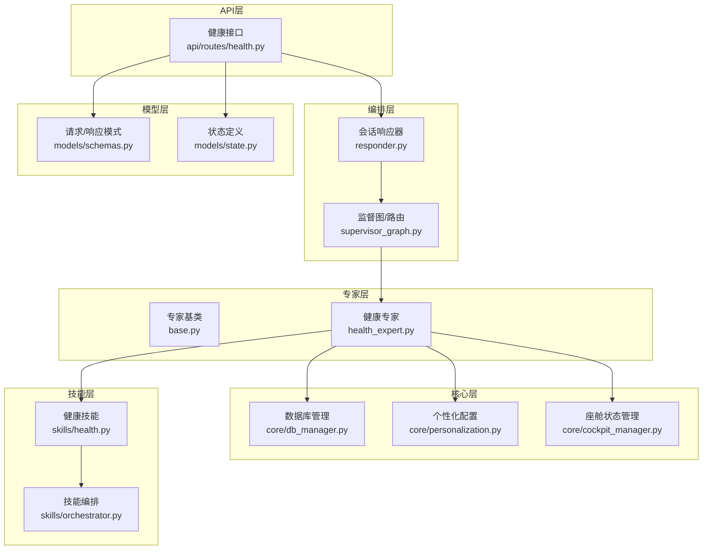
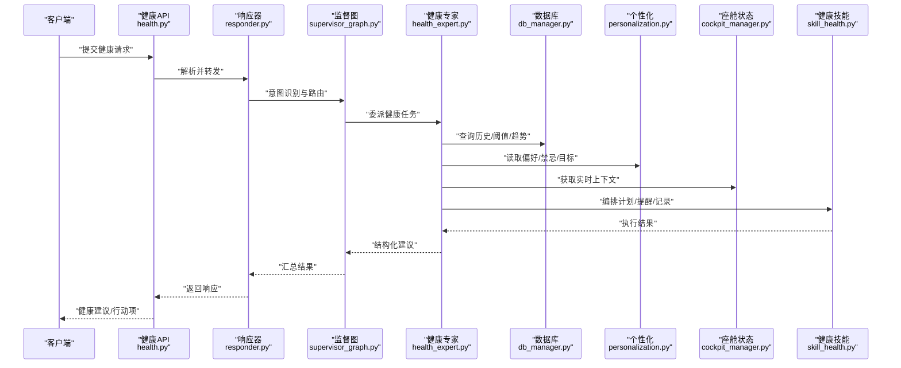
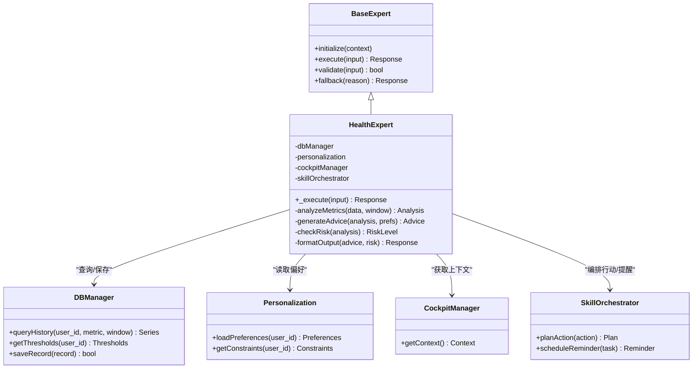
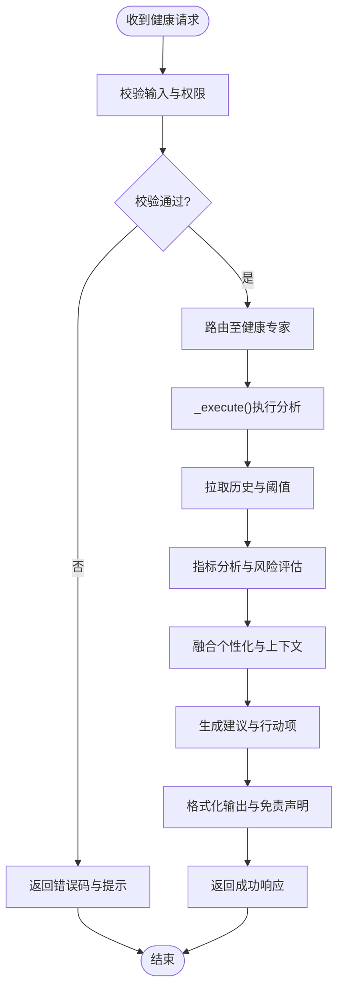
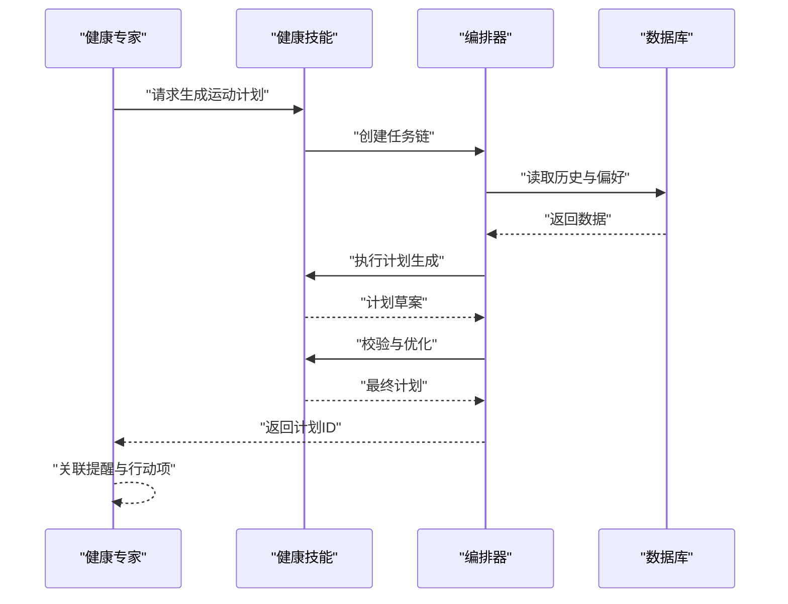
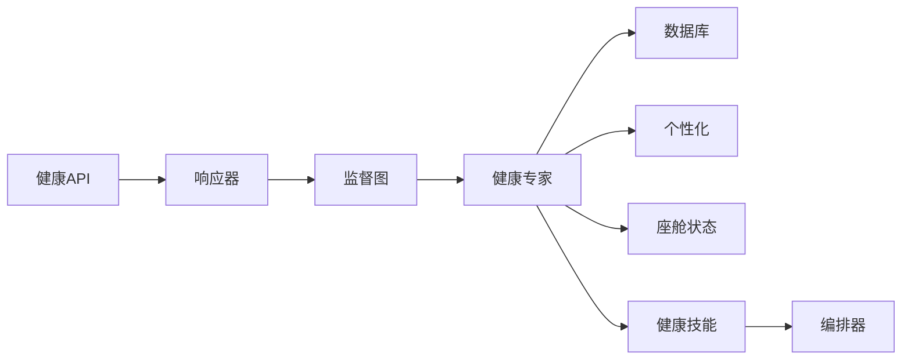

# 健康咨询专家

<cite>
**本文引用的文件**   
- [health_expert.py](file://backend_design/nexus/agent/experts/health_expert.py)
- [base.py](file://backend_design/nexus/agent/experts/base.py)
- [responder.py](file://backend_design/nexus/agent/responder.py)
- [supervisor_graph.py](file://backend_design/nexus/agent/supervisor_graph.py)
- [health.py](file://backend_design/nexus/api/routes/health.py)
- [db_manager.py](file://backend_design/nexus/core/db_manager.py)
- [personalization.py](file://backend_design/nexus/core/personalization.py)
- [cockpit_manager.py](file://backend_design/nexus/core/cockpit_manager.py)
- [schemas.py](file://backend_design/nexus/models/schemas.py)
- [state.py](file://backend_design/nexus/models/state.py)
- [orchestrator.py](file://backend_design/nexus/skills/orchestrator.py)
- [skill_health.py](file://backend_design/nexus/skills/health.py)
</cite>

## 目录
1. [简介](#简介)
2. [项目结构](#项目结构)
3. [核心组件](#核心组件)
4. [架构总览](#架构总览)
5. [详细组件分析](#详细组件分析)
6. [依赖关系分析](#依赖关系分析)
7. [性能考量](#性能考量)
8. [故障排查指南](#故障排查指南)
9. [结论](#结论)
10. [附录](#附录)

## 简介
本文件面向“健康咨询专家(HealthExpert)”的技术实现与使用，覆盖职责范围、核心流程、数据集成、专业性与合规保障、异常与紧急处理、以及典型场景示例。目标读者包括后端工程师、产品与运营人员，以及对健康管理智能体感兴趣的用户。

## 项目结构
与健康咨询专家相关的代码主要分布在以下模块：
- 专家层：健康专家实现与专家基类
- 编排层：会话响应器与监督图（路由到具体专家）
- API层：健康相关接口
- 核心层：数据库管理、个性化配置、座舱状态管理
- 模型层：请求/响应模式与状态定义
- 技能层：健康领域技能编排与具体能力

图示来源
- [health_expert.py:1-200](file://backend_design/nexus/agent/experts/health_expert.py#L1-L200)
- [base.py:1-200](file://backend_design/nexus/agent/experts/base.py#L1-L200)
- [responder.py:1-200](file://backend_design/nexus/agent/responder.py#L1-L200)
- [supervisor_graph.py:1-200](file://backend_design/nexus/agent/supervisor_graph.py#L1-L200)
- [health.py:1-200](file://backend_design/nexus/api/routes/health.py#L1-L200)
- [db_manager.py:1-200](file://backend_design/nexus/core/db_manager.py#L1-L200)
- [personalization.py:1-200](file://backend_design/nexus/core/personalization.py#L1-L200)
- [cockpit_manager.py:1-200](file://backend_design/nexus/core/cockpit_manager.py#L1-L200)
- [schemas.py:1-200](file://backend_design/nexus/models/schemas.py#L1-L200)
- [state.py:1-200](file://backend_design/nexus/models/state.py#L1-L200)
- [orchestrator.py:1-200](file://backend_design/nexus/skills/orchestrator.py#L1-L200)
- [skill_health.py:1-200](file://backend_design/nexus/skills/health.py#L1-L200)

章节来源
- [health_expert.py:1-200](file://backend_design/nexus/agent/experts/health_expert.py#L1-L200)
- [base.py:1-200](file://backend_design/nexus/agent/experts/base.py#L1-L200)
- [responder.py:1-200](file://backend_design/nexus/agent/responder.py#L1-L200)
- [supervisor_graph.py:1-200](file://backend_design/nexus/agent/supervisor_graph.py#L1-L200)
- [health.py:1-200](file://backend_design/nexus/api/routes/health.py#L1-L200)
- [db_manager.py:1-200](file://backend_design/nexus/core/db_manager.py#L1-L200)
- [personalization.py:1-200](file://backend_design/nexus/core/personalization.py#L1-L200)
- [cockpit_manager.py:1-200](file://backend_design/nexus/core/cockpit_manager.py#L1-L200)
- [schemas.py:1-200](file://backend_design/nexus/models/schemas.py#L1-L200)
- [state.py:1-200](file://backend_design/nexus/models/state.py#L1-L200)
- [orchestrator.py:1-200](file://backend_design/nexus/skills/orchestrator.py#L1-L200)
- [skill_health.py:1-200](file://backend_design/nexus/skills/health.py#L1-L200)

## 核心组件
- 健康专家(HealthExpert)
  - 职责：健康指标解读、运动建议、饮食指导、睡眠分析、风险预警与建议转介、个性化方案生成。
  - 关键方法：_execute()负责解析输入、拉取历史数据、执行分析与规则判断、结合个性化偏好生成建议、输出结构化结果。
- 专家基类(Base Expert)
  - 职责：统一专家生命周期、上下文注入、日志与错误封装、返回格式标准化。
- 会话响应器与监督图
  - 职责：接收用户意图，路由至健康专家；协调多专家协作与降级策略。
- 健康API
  - 职责：暴露健康查询、记录写入、提醒订阅等HTTP接口；校验请求并调用专家或技能。
- 数据库管理
  - 职责：健康数据持久化、历史查询、趋势聚合、异常阈值存储。
- 个性化配置
  - 职责：读取用户偏好、禁忌、目标、设备能力等，影响建议生成。
- 座舱状态管理
  - 职责：获取实时车辆/环境上下文（如位置、时间、活动），辅助健康建议落地。
- 健康技能与编排
  - 职责：将复杂任务拆解为可执行步骤（如计划生成、提醒创建、数据同步）。

章节来源
- [health_expert.py:1-200](file://backend_design/nexus/agent/experts/health_expert.py#L1-L200)
- [base.py:1-200](file://backend_design/nexus/agent/experts/base.py#L1-L200)
- [responder.py:1-200](file://backend_design/nexus/agent/responder.py#L1-L200)
- [supervisor_graph.py:1-200](file://backend_design/nexus/agent/supervisor_graph.py#L1-L200)
- [health.py:1-200](file://backend_design/nexus/api/routes/health.py#L1-L200)
- [db_manager.py:1-200](file://backend_design/nexus/core/db_manager.py#L1-L200)
- [personalization.py:1-200](file://backend_design/nexus/core/personalization.py#L1-L200)
- [cockpit_manager.py:1-200](file://backend_design/nexus/core/cockpit_manager.py#L1-L200)
- [orchestrator.py:1-200](file://backend_design/nexus/skills/orchestrator.py#L1-L200)
- [skill_health.py:1-200](file://backend_design/nexus/skills/health.py#L1-L200)

## 架构总览
健康咨询专家在整体系统中的交互如下：

图示来源
- [health.py:1-200](file://backend_design/nexus/api/routes/health.py#L1-L200)
- [responder.py:1-200](file://backend_design/nexus/agent/responder.py#L1-L200)
- [supervisor_graph.py:1-200](file://backend_design/nexus/agent/supervisor_graph.py#L1-L200)
- [health_expert.py:1-200](file://backend_design/nexus/agent/experts/health_expert.py#L1-L200)
- [db_manager.py:1-200](file://backend_design/nexus/core/db_manager.py#L1-L200)
- [personalization.py:1-200](file://backend_design/nexus/core/personalization.py#L1-L200)
- [cockpit_manager.py:1-200](file://backend_design/nexus/core/cockpit_manager.py#L1-L200)
- [skill_health.py:1-200](file://backend_design/nexus/skills/health.py#L1-L200)

## 详细组件分析

### 健康专家(HealthExpert)
- 职责边界
  - 健康指标解读：体重、BMI、心率、血压、血氧、步数、睡眠时长与质量等。
  - 运动建议：基于目标与当前状态给出强度、频率、类型与注意事项。
  - 饮食指导：热量与宏量营养素建议、过敏与禁忌适配、餐次安排。
  - 睡眠分析：入睡/醒来时间、深睡比例、打鼾/呼吸事件提示、作息优化。
  - 风险预警与转介：对异常指标进行分级提示，必要时建议就医。
  - 个性化方案：结合用户偏好、设备能力、日程与环境上下文生成可执行计划。
- _execute()方法要点
  - 输入解析：校验字段、提取指标、时间窗口、目标与约束。
  - 数据拉取：从数据库获取历史序列、阈值、趋势统计与异常标记。
  - 规则与模型：应用医学常识规则与统计方法，必要时结合外部模型（若存在）。
  - 个性化融合：读取个人偏好、禁忌、目标与座舱上下文。
  - 建议生成：输出结构化建议、行动项、风险提示与免责声明。
  - 异常处理：对缺失数据、越界值、服务不可用进行降级与回退。
- 数据结构与复杂度
  - 输入/输出遵循统一模式，便于序列化与前端渲染。
  - 历史查询通常按时间窗口聚合，复杂度受数据规模与索引影响。
- 错误与降级
  - 数据缺失时采用保守建议与澄清问题。
  - 外部依赖失败时启用本地规则与缓存结果。
- 专业性与合规
  - 内置免责声明，明确非医疗诊断性质。
  - 高风险场景触发转介与紧急指引。

图示来源
- [base.py:1-200](file://backend_design/nexus/agent/experts/base.py#L1-L200)
- [health_expert.py:1-200](file://backend_design/nexus/agent/experts/health_expert.py#L1-L200)
- [db_manager.py:1-200](file://backend_design/nexus/core/db_manager.py#L1-L200)
- [personalization.py:1-200](file://backend_design/nexus/core/personalization.py#L1-L200)
- [cockpit_manager.py:1-200](file://backend_design/nexus/core/cockpit_manager.py#L1-L200)
- [orchestrator.py:1-200](file://backend_design/nexus/skills/orchestrator.py#L1-L200)

章节来源
- [health_expert.py:1-200](file://backend_design/nexus/agent/experts/health_expert.py#L1-L200)
- [base.py:1-200](file://backend_design/nexus/agent/experts/base.py#L1-L200)
- [db_manager.py:1-200](file://backend_design/nexus/core/db_manager.py#L1-L200)
- [personalization.py:1-200](file://backend_design/nexus/core/personalization.py#L1-L200)
- [cockpit_manager.py:1-200](file://backend_design/nexus/core/cockpit_manager.py#L1-L200)
- [orchestrator.py:1-200](file://backend_design/nexus/skills/orchestrator.py#L1-L200)

### 健康API与请求/响应模式
- 健康API
  - 提供健康数据查询、记录写入、提醒订阅、建议获取等端点。
  - 负责鉴权、参数校验、限流与审计日志。
- 请求/响应模式
  - 输入包含用户标识、指标集合、时间窗口、目标与约束。
  - 输出包含建议、风险提示、行动项、免责声明与下一步操作。

图示来源
- [health.py:1-200](file://backend_design/nexus/api/routes/health.py#L1-L200)
- [health_expert.py:1-200](file://backend_design/nexus/agent/experts/health_expert.py#L1-L200)
- [schemas.py:1-200](file://backend_design/nexus/models/schemas.py#L1-L200)
- [state.py:1-200](file://backend_design/nexus/models/state.py#L1-L200)

章节来源
- [health.py:1-200](file://backend_design/nexus/api/routes/health.py#L1-L200)
- [schemas.py:1-200](file://backend_design/nexus/models/schemas.py#L1-L200)
- [state.py:1-200](file://backend_design/nexus/models/state.py#L1-L200)

### 健康技能与编排
- 健康技能
  - 将复杂任务分解为子任务：计划生成、提醒创建、数据同步、报告导出。
- 编排器
  - 管理任务依赖、重试、超时与回滚；保证原子性与一致性。

图示来源
- [skill_health.py:1-200](file://backend_design/nexus/skills/health.py#L1-L200)
- [orchestrator.py:1-200](file://backend_design/nexus/skills/orchestrator.py#L1-L200)
- [db_manager.py:1-200](file://backend_design/nexus/core/db_manager.py#L1-L200)

章节来源
- [skill_health.py:1-200](file://backend_design/nexus/skills/health.py#L1-L200)
- [orchestrator.py:1-200](file://backend_design/nexus/skills/orchestrator.py#L1-L200)

## 依赖关系分析
- 直接依赖
  - 健康专家依赖数据库管理、个性化配置、座舱状态管理与健康技能编排。
- 间接依赖
  - 通过API与响应器/监督图接入系统；通过模型模式确保前后端一致。
- 耦合与内聚
  - 专家层高内聚，对外以统一接口暴露；核心层解耦，便于替换与扩展。
- 外部集成点
  - 数据库、个性化配置源、座舱上下文源、可能的第三方健康服务。

图示来源
- [health.py:1-200](file://backend_design/nexus/api/routes/health.py#L1-L200)
- [responder.py:1-200](file://backend_design/nexus/agent/responder.py#L1-L200)
- [supervisor_graph.py:1-200](file://backend_design/nexus/agent/supervisor_graph.py#L1-L200)
- [health_expert.py:1-200](file://backend_design/nexus/agent/experts/health_expert.py#L1-L200)
- [db_manager.py:1-200](file://backend_design/nexus/core/db_manager.py#L1-L200)
- [personalization.py:1-200](file://backend_design/nexus/core/personalization.py#L1-L200)
- [cockpit_manager.py:1-200](file://backend_design/nexus/core/cockpit_manager.py#L1-L200)
- [skill_health.py:1-200](file://backend_design/nexus/skills/health.py#L1-L200)
- [orchestrator.py:1-200](file://backend_design/nexus/skills/orchestrator.py#L1-L200)

章节来源
- [health.py:1-200](file://backend_design/nexus/api/routes/health.py#L1-L200)
- [responder.py:1-200](file://backend_design/nexus/agent/responder.py#L1-L200)
- [supervisor_graph.py:1-200](file://backend_design/nexus/agent/supervisor_graph.py#L1-L200)
- [health_expert.py:1-200](file://backend_design/nexus/agent/experts/health_expert.py#L1-L200)
- [db_manager.py:1-200](file://backend_design/nexus/core/db_manager.py#L1-L200)
- [personalization.py:1-200](file://backend_design/nexus/core/personalization.py#L1-L200)
- [cockpit_manager.py:1-200](file://backend_design/nexus/core/cockpit_manager.py#L1-L200)
- [skill_health.py:1-200](file://backend_design/nexus/skills/health.py#L1-L200)
- [orchestrator.py:1-200](file://backend_design/nexus/skills/orchestrator.py#L1-L200)

## 性能考量
- 数据查询优化
  - 合理设置时间窗口与聚合粒度，避免全表扫描。
  - 利用索引与缓存提升热点指标查询速度。
- 异步与批处理
  - 计划生成与提醒创建采用异步队列，降低主链路延迟。
- 降级与容错
  - 外部依赖失败时回退到本地规则与缓存结果。
- 资源控制
  - 限制并发与内存占用，防止OOM与雪崩。

[本节为通用性能建议，不直接分析具体文件]

## 故障排查指南
- 常见问题
  - 数据缺失：检查历史数据写入与时间窗口参数。
  - 阈值异常：核对阈值配置与用户个性化约束。
  - 服务不可用：查看依赖服务健康状态与重试策略。
- 日志与追踪
  - 关注专家执行链路的关键节点日志与错误码。
- 恢复策略
  - 启用降级模式与默认建议；必要时引导用户补充信息。

章节来源
- [health_expert.py:1-200](file://backend_design/nexus/agent/experts/health_expert.py#L1-L200)
- [db_manager.py:1-200](file://backend_design/nexus/core/db_manager.py#L1-L200)
- [personalization.py:1-200](file://backend_design/nexus/core/personalization.py#L1-L200)

## 结论
健康咨询专家通过统一的专家框架、清晰的数据集成路径与专业的规则体系，为用户提供可信赖的健康建议与行动方案。其设计兼顾可扩展性、可维护性与合规性，适合在车载与移动端场景中落地。

[本节为总结性内容，不直接分析具体文件]

## 附录

### 使用示例
- 体重管理
  - 输入：近30天体重、身高、目标体重、饮食偏好。
  - 过程：计算BMI趋势、能量缺口估算、运动与饮食建议。
  - 输出：周计划、提醒与风险提示。
- 运动计划
  - 输入：可用时间、场地、设备、既往运动记录。
  - 过程：匹配强度与类型，生成渐进式训练计划。
  - 输出：每日动作清单、强度区间与恢复建议。
- 健康提醒
  - 输入：用药/饮水/久坐提醒偏好。
  - 过程：根据日程与上下文生成定时任务。
  - 输出：提醒列表与取消/调整方式。

[本节为概念性示例，不直接分析具体文件]

### 数据隐私保护与医疗合规
- 隐私保护
  - 最小化采集、加密传输与存储、访问控制与审计。
- 医疗合规
  - 明确免责声明，避免诊断与处方行为；高风险情况转介专业机构。
- 风险评估
  - 建立风险等级与处置流程，支持人工复核与升级。

[本节为通用合规建议，不直接分析具体文件]