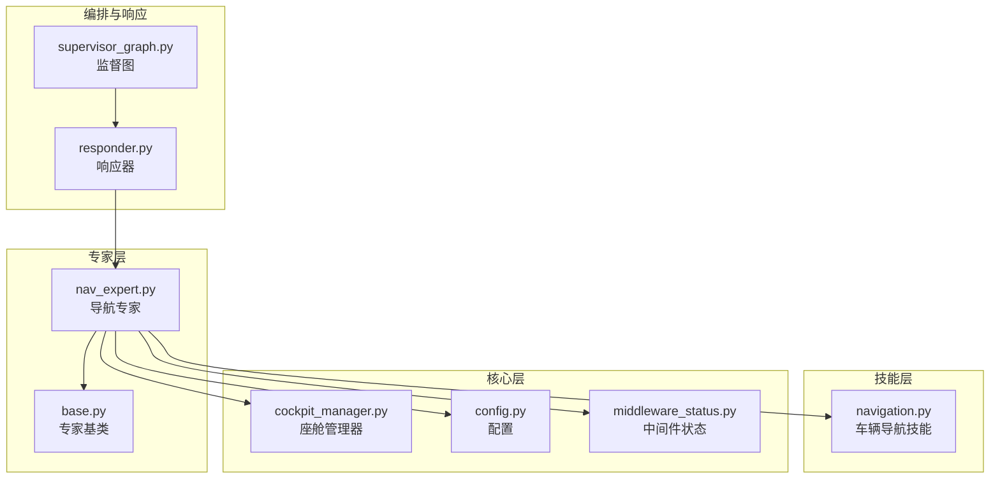
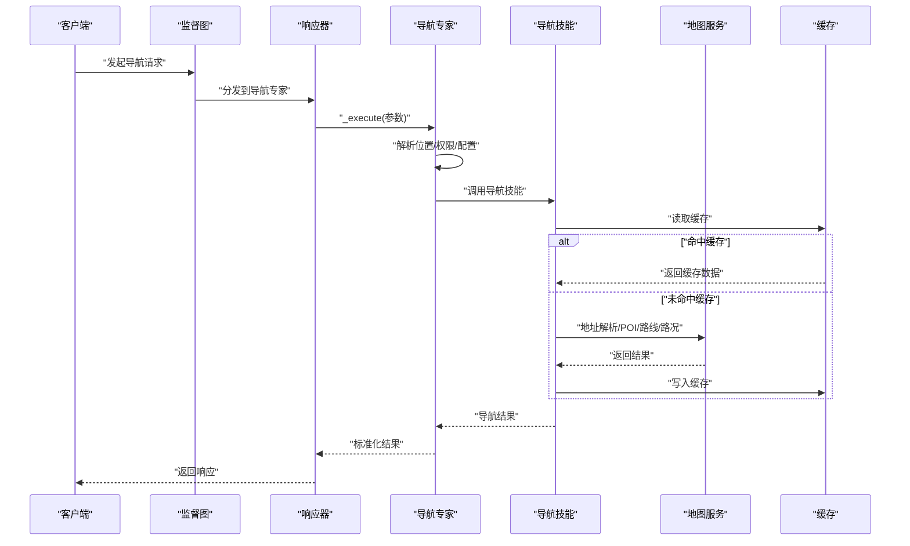
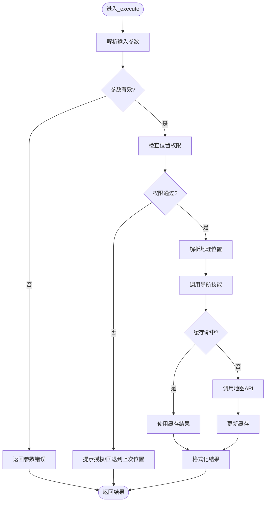
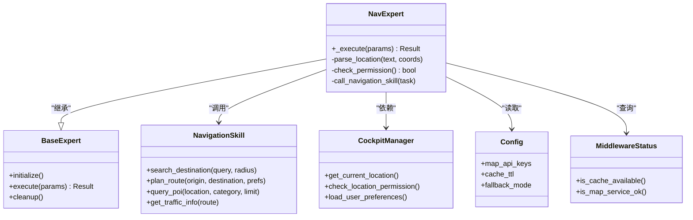

# 导航服务专家

<cite>
**本文引用的文件**   
- [nav_expert.py](file://backend_design/nexus/agent/experts/nav_expert.py)
- [base.py](file://backend_design/nexus/agent/experts/base.py)
- [responder.py](file://backend_design/nexus/agent/responder.py)
- [supervisor_graph.py](file://backend_design/nexus/agent/supervisor_graph.py)
- [navigation.py](file://backend_design/nexus/skills/vehicle/navigation.py)
- [cockpit_manager.py](file://backend_design/nexus/core/cockpit_manager.py)
- [config.py](file://backend_design/nexus/config.py)
- [middleware_status.py](file://backend_design/nexus/api/routes/middleware_status.py)
</cite>

## 目录
1. [简介](#简介)
2. [项目结构](#项目结构)
3. [核心组件](#核心组件)
4. [架构总览](#架构总览)
5. [详细组件分析](#详细组件分析)
6. [依赖关系分析](#依赖关系分析)
7. [性能考虑](#性能考虑)
8. [故障排查指南](#故障排查指南)
9. [结论](#结论)
10. [附录](#附录)

## 简介
本文件面向“导航服务专家（NavExpert）”的技术实现与使用，聚焦以下目标：
- 职责范围：目的地搜索、路线规划、实时导航、POI查询等。
- 关键方法：_execute() 的输入解析、地图API调用、路线计算流程。
- 外部集成：地址解析、距离计算、交通状况获取。
- 数据策略：缓存、实时更新、离线支持方案。
- 使用示例：设置目的地、查询附近设施、获取路线信息。
- 安全与隐私：位置权限、数据安全与合规。

## 项目结构
导航相关代码主要分布在 agent 专家层与 vehicle 技能层，并通过 API 路由暴露能力。整体组织方式如下：
- 专家层：定义导航专家及其执行流程。
- 技能层：封装车辆导航相关的业务逻辑。
- 核心层：提供上下文管理、配置、中间件状态等支撑。
- API 层：对外暴露导航能力接口。

图表来源
- [nav_expert.py](file://backend_design/nexus/agent/experts/nav_expert.py)
- [base.py](file://backend_design/nexus/agent/experts/base.py)
- [navigation.py](file://backend_design/nexus/skills/vehicle/navigation.py)
- [cockpit_manager.py](file://backend_design/nexus/core/cockpit_manager.py)
- [config.py](file://backend_design/nexus/config.py)
- [middleware_status.py](file://backend_design/nexus/api/routes/middleware_status.py)
- [responder.py](file://backend_design/nexus/agent/responder.py)
- [supervisor_graph.py](file://backend_design/nexus/agent/supervisor_graph.py)

章节来源
- [nav_expert.py](file://backend_design/nexus/agent/experts/nav_expert.py)
- [base.py](file://backend_design/nexus/agent/experts/base.py)
- [navigation.py](file://backend_design/nexus/skills/vehicle/navigation.py)
- [cockpit_manager.py](file://backend_design/nexus/core/cockpit_manager.py)
- [config.py](file://backend_design/nexus/config.py)
- [middleware_status.py](file://backend_design/nexus/api/routes/middleware_status.py)
- [responder.py](file://backend_design/nexus/agent/responder.py)
- [supervisor_graph.py](file://backend_design/nexus/agent/supervisor_graph.py)

## 核心组件
- 导航专家（NavExpert）
  - 职责：接收用户意图，解析地理位置与导航参数，协调地图服务完成搜索、路径规划与导航引导。
  - 入口：_execute() 负责主流程控制。
- 专家基类（Base Expert）
  - 职责：统一专家生命周期、错误处理、日志与结果封装。
- 车辆导航技能（Navigation Skill）
  - 职责：封装具体导航业务逻辑，如目的地检索、路线计算、POI查询、导航状态更新。
- 座舱管理器（Cockpit Manager）
  - 职责：维护会话上下文、设备状态、权限与位置源。
- 配置（Config）
  - 职责：加载地图服务密钥、超时、重试、缓存策略等。
- 中间件状态（Middleware Status）
  - 职责：暴露中间件健康与可用性，辅助降级与熔断决策。
- 响应器（Responder）与监督图（Supervisor Graph）
  - 职责：编排专家调用、聚合结果、返回结构化响应。

章节来源
- [nav_expert.py](file://backend_design/nexus/agent/experts/nav_expert.py)
- [base.py](file://backend_design/nexus/agent/experts/base.py)
- [navigation.py](file://backend_design/nexus/skills/vehicle/navigation.py)
- [cockpit_manager.py](file://backend_design/nexus/core/cockpit_manager.py)
- [config.py](file://backend_design/nexus/config.py)
- [middleware_status.py](file://backend_design/nexus/api/routes/middleware_status.py)
- [responder.py](file://backend_design/nexus/agent/responder.py)
- [supervisor_graph.py](file://backend_design/nexus/agent/supervisor_graph.py)

## 架构总览
导航请求从上层编排进入导航专家，经参数校验与权限检查后，调用导航技能完成地图API交互，最终由响应器组装并返回。

图表来源
- [supervisor_graph.py](file://backend_design/nexus/agent/supervisor_graph.py)
- [responder.py](file://backend_design/nexus/agent/responder.py)
- [nav_expert.py](file://backend_design/nexus/agent/experts/nav_expert.py)
- [navigation.py](file://backend_design/nexus/skills/vehicle/navigation.py)

## 详细组件分析

### 导航专家（NavExpert）
- 职责边界
  - 输入解析：将自然语言或结构化参数转换为导航所需的坐标、目的地、偏好（时间/费用/拥堵）。
  - 权限与上下文：校验位置权限、获取当前定位、合并历史偏好。
  - 流程编排：调用导航技能完成搜索、规划、导航；处理异常与降级。
  - 结果输出：标准化为前端可渲染的路线、POI列表与导航指令。
- _execute() 方法要点
  - 参数校验与默认值填充。
  - 位置解析：支持地址文本、坐标、最近目的地、常用地点。
  - 地图API调用：通过导航技能封装，避免直接耦合第三方SDK。
  - 路线计算：多策略选择（最快/最短/避开拥堵），支持多途经点与偏好权重。
  - 错误处理：网络异常、配额限制、无结果时的回退策略（如推荐热门POI）。
  - 缓存与更新：读前查缓存，写后更新；对热点路线进行预取。
  - 日志与指标：记录关键步骤耗时与失败率，便于观测与优化。

图表来源
- [nav_expert.py](file://backend_design/nexus/agent/experts/nav_expert.py)
- [navigation.py](file://backend_design/nexus/skills/vehicle/navigation.py)

章节来源
- [nav_expert.py](file://backend_design/nexus/agent/experts/nav_expert.py)

### 专家基类（Base Expert）
- 统一生命周期：初始化、执行、清理。
- 错误与日志：捕获异常、记录上下文、上报指标。
- 结果封装：标准化返回结构，便于上层聚合。

章节来源
- [base.py](file://backend_design/nexus/agent/experts/base.py)

### 车辆导航技能（Navigation Skill）
- 功能模块
  - 目的地搜索：关键词、分类、半径、排序。
  - 路线规划：起点/终点/途经点/偏好/车型。
  - POI查询：周边设施、兴趣点详情。
  - 导航状态：开始/继续/结束、ETA更新。
- 外部集成
  - 地址解析：文本转坐标。
  - 距离矩阵：多点间距离与时间。
  - 交通状况：实时拥堵、事件影响。
- 缓存策略
  - 键设计：按查询特征哈希（地点、半径、偏好）。
  - 失效策略：TTL+变更触发（如道路施工）。
  - 预取策略：高频路线在空闲时预热。
- 降级与容错
  - 限流与重试：指数退避、熔断阈值。
  - 离线模式：本地路网片段与静态POI兜底。

章节来源
- [navigation.py](file://backend_design/nexus/skills/vehicle/navigation.py)

### 座舱管理器（Cockpit Manager）
- 作用
  - 维护会话上下文：用户偏好、历史目的地、设备状态。
  - 权限与位置源：GPS/网络定位融合，权限状态同步。
- 与导航专家协作
  - 提供当前位置与权限状态。
  - 持久化导航偏好与快捷目的地。

章节来源
- [cockpit_manager.py](file://backend_design/nexus/core/cockpit_manager.py)

### 配置（Config）
- 关键项
  - 地图服务密钥、端点、超时、重试次数。
  - 缓存TTL、最大条目数、内存/磁盘开关。
  - 降级开关：离线模式、仅POI、仅路线。
- 动态更新
  - 热重载配置，无需重启服务。

章节来源
- [config.py](file://backend_design/nexus/config.py)

### 中间件状态（Middleware Status）
- 作用
  - 暴露中间件健康度与可用性，辅助导航专家做降级决策。
- 典型场景
  - 当缓存不可用时切换至直连地图服务。
  - 当日志/指标通道不可用时降级为本地记录。

章节来源
- [middleware_status.py](file://backend_design/nexus/api/routes/middleware_status.py)

### 响应器（Responder）与监督图（Supervisor Graph）
- 响应器
  - 聚合多个专家结果，统一格式返回。
- 监督图
  - 编排专家调用顺序与条件分支，处理并发与超时。

章节来源
- [responder.py](file://backend_design/nexus/agent/responder.py)
- [supervisor_graph.py](file://backend_design/nexus/agent/supervisor_graph.py)

## 依赖关系分析
导航专家依赖导航技能完成具体地图交互，同时依赖座舱管理器获取上下文与权限，依赖配置与中间件状态进行运行期决策。

图表来源
- [nav_expert.py](file://backend_design/nexus/agent/experts/nav_expert.py)
- [base.py](file://backend_design/nexus/agent/experts/base.py)
- [navigation.py](file://backend_design/nexus/skills/vehicle/navigation.py)
- [cockpit_manager.py](file://backend_design/nexus/core/cockpit_manager.py)
- [config.py](file://backend_design/nexus/config.py)
- [middleware_status.py](file://backend_design/nexus/api/routes/middleware_status.py)

章节来源
- [nav_expert.py](file://backend_design/nexus/agent/experts/nav_expert.py)
- [base.py](file://backend_design/nexus/agent/experts/base.py)
- [navigation.py](file://backend_design/nexus/skills/vehicle/navigation.py)
- [cockpit_manager.py](file://backend_design/nexus/core/cockpit_manager.py)
- [config.py](file://backend_design/nexus/config.py)
- [middleware_status.py](file://backend_design/nexus/api/routes/middleware_status.py)

## 性能考虑
- 缓存优先：热点POI与常用路线优先命中缓存，降低延迟。
- 批量与并行：多途经点与多候选路线并行计算，减少端到端耗时。
- 增量更新：仅刷新受影响路段的交通信息，避免全量重算。
- 资源控制：限制单次请求的最大返回条目与分页拉取。
- 监控与告警：记录P95/P99延迟、失败率、缓存命中率，及时扩容或降级。

## 故障排查指南
- 常见问题
  - 位置权限被拒：检查权限状态与用户授权流程，必要时回退到上次已知位置。
  - 地图服务不可用：查看中间件状态与健康检查，启用降级策略。
  - 缓存异常：确认缓存可用性与TTL配置，必要时清空脏数据。
  - 路线无结果：放宽搜索半径或调整偏好，返回备选POI。
- 诊断步骤
  - 查看专家日志与指标，定位失败阶段。
  - 验证配置项（密钥、端点、超时）。
  - 复现最小用例，逐步缩小问题范围。
  - 启用调试模式，输出关键中间态。

章节来源
- [middleware_status.py](file://backend_design/nexus/api/routes/middleware_status.py)
- [config.py](file://backend_design/nexus/config.py)
- [nav_expert.py](file://backend_design/nexus/agent/experts/nav_expert.py)

## 结论
导航服务专家以清晰的职责边界与分层架构，将用户意图转化为可靠的导航结果。通过缓存、降级与监控机制，保障在高负载与不稳定网络下的稳定性与用户体验。建议在生产环境完善权限与隐私保护策略，并对关键路径进行压测与容量规划。

## 附录

### 使用示例（概念性说明）
- 设置目的地
  - 输入：地址文本或坐标。
  - 流程：权限检查→位置解析→目的地搜索→路线规划→返回导航指令。
- 查询附近设施
  - 输入：当前位置、类别、半径。
  - 流程：权限检查→POI查询→排序与过滤→返回结果列表。
- 获取路线信息
  - 输入：起点、终点、偏好（最快/最短/避开拥堵）。
  - 流程：权限检查→路线计算→交通信息叠加→返回ETA与分段指引。

[本节为概念性说明，不直接分析具体文件]

### 位置权限处理、隐私保护与安全考虑
- 位置权限
  - 启动时检测权限，未授权则提示并回退。
  - 仅在需要时访问高精度定位，使用后释放资源。
- 隐私保护
  - 最小化采集：仅收集必要的位置与偏好。
  - 本地化处理：尽可能在本地完成敏感数据处理。
  - 数据脱敏：日志中去除个人标识信息。
- 安全
  - 密钥管理：使用环境变量或密钥管理服务。
  - 传输加密：HTTPS/TLS强制开启。
  - 访问控制：基于角色的API鉴权与速率限制。

[本节为通用指导，不直接分析具体文件]