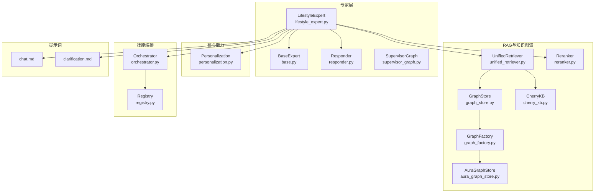
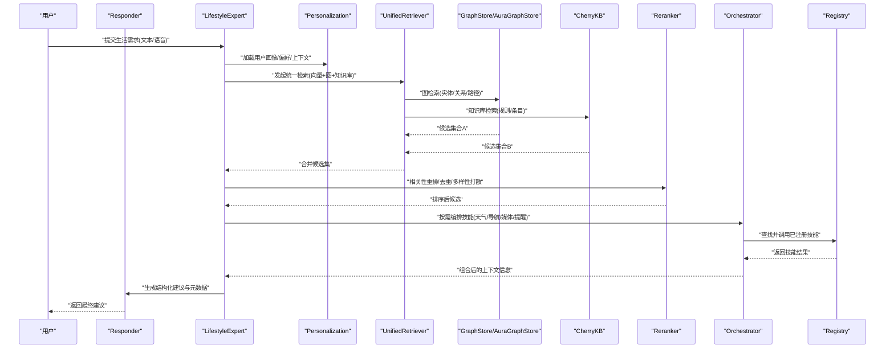
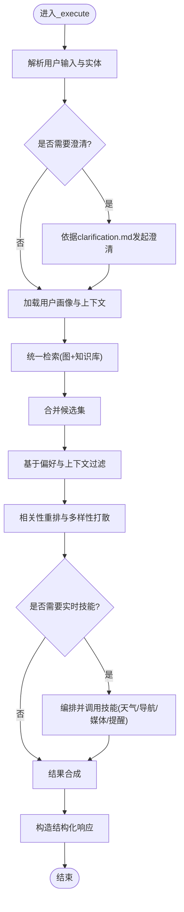
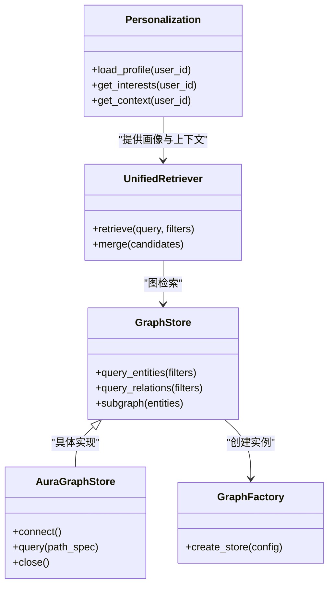
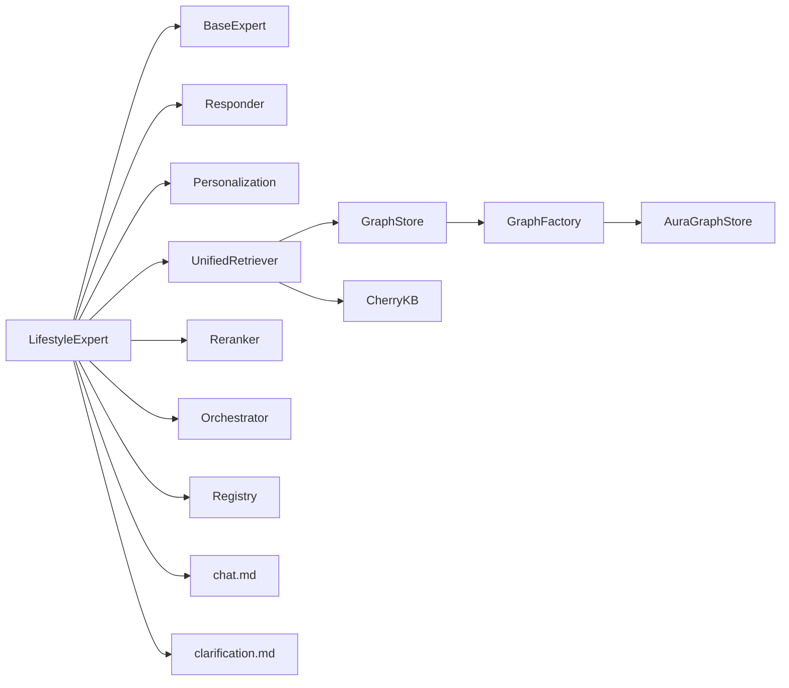

# 生活推荐专家

<cite>
**本文引用的文件**   
- [lifestyle_expert.py](file://backend_design/nexus/agent/experts/lifestyle_expert.py)
- [base.py](file://backend_design/nexus/agent/experts/base.py)
- [responder.py](file://backend_design/nexus/agent/responder.py)
- [supervisor_graph.py](file://backend_design/nexus/agent/supervisor_graph.py)
- [personalization.py](file://backend_design/nexus/core/personalization.py)
- [graph_store.py](file://backend_design/nexus/rag/graph_store.py)
- [graph_factory.py](file://backend_design/nexus/rag/graph_factory.py)
- [aura_graph_store.py](file://backend_design/nexus/rag/aura_graph_store.py)
- [cherry_kb.py](file://backend_design/nexus/rag/cherry_kb.py)
- [unified_retriever.py](file://backend_design/nexus/rag/unified_retriever.py)
- [reranker.py](file://backend_design/nexus/rag/reranker.py)
- [orchestrator.py](file://backend_design/nexus/skills/orchestrator.py)
- [registry.py](file://backend_design/nexus/skills/registry.py)
- [chat.md](file://backend_design/nexus/prompts/chat.md)
- [clarification.md](file://backend_design/nexus/prompts/clarification.md)
</cite>

## 目录
1. [简介](#简介)
2. [项目结构](#项目结构)
3. [核心组件](#核心组件)
4. [架构总览](#架构总览)
5. [详细组件分析](#详细组件分析)
6. [依赖关系分析](#依赖关系分析)
7. [性能考量](#性能考量)
8. [故障排查指南](#故障排查指南)
9. [结论](#结论)
10. [附录](#附录)

## 简介
本文件面向“生活推荐专家”（LifestyleExpert）的技术实现与使用，覆盖其职责范围、核心流程、知识图谱集成、内容来源管理、质量评估与多样性保证、反馈收集与模型优化机制，并提供多场景示例。该专家聚焦于生活服务类任务，如餐厅推荐、天气查询、新闻资讯、娱乐建议等，通过用户画像、兴趣标签与上下文感知，结合检索增强生成（RAG）与技能编排，输出个性化、可解释且高质量的生活建议。

## 项目结构
围绕“生活推荐专家”的相关代码主要分布在以下模块：
- 专家层：负责意图识别后的具体执行与结果组装
- 核心能力：个性化、会话上下文、记忆压缩等
- RAG与知识图谱：图存储、统一检索、重排器
- 技能编排：将外部工具/服务以“技能”形式接入并调度
- 提示词：用于引导大模型进行澄清、对话与结构化输出

图表来源
- [lifestyle_expert.py](file://backend_design/nexus/agent/experts/lifestyle_expert.py)
- [base.py](file://backend_design/nexus/agent/experts/base.py)
- [responder.py](file://backend_design/nexus/agent/responder.py)
- [supervisor_graph.py](file://backend_design/nexus/agent/supervisor_graph.py)
- [personalization.py](file://backend_design/nexus/core/personalization.py)
- [graph_store.py](file://backend_design/nexus/rag/graph_store.py)
- [graph_factory.py](file://backend_design/nexus/rag/graph_factory.py)
- [aura_graph_store.py](file://backend_design/nexus/rag/aura_graph_store.py)
- [cherry_kb.py](file://backend_design/nexus/rag/cherry_kb.py)
- [unified_retriever.py](file://backend_design/nexus/rag/unified_retriever.py)
- [reranker.py](file://backend_design/nexus/rag/reranker.py)
- [orchestrator.py](file://backend_design/nexus/skills/orchestrator.py)
- [registry.py](file://backend_design/nexus/skills/registry.py)
- [chat.md](file://backend_design/nexus/prompts/chat.md)
- [clarification.md](file://backend_design/nexus/prompts/clarification.md)

章节来源
- [lifestyle_expert.py](file://backend_design/nexus/agent/experts/lifestyle_expert.py)
- [base.py](file://backend_design/nexus/agent/experts/base.py)
- [responder.py](file://backend_design/nexus/agent/responder.py)
- [supervisor_graph.py](file://backend_design/nexus/agent/supervisor_graph.py)
- [personalization.py](file://backend_design/nexus/core/personalization.py)
- [graph_store.py](file://backend_design/nexus/rag/graph_store.py)
- [graph_factory.py](file://backend_design/nexus/rag/graph_factory.py)
- [aura_graph_store.py](file://backend_design/nexus/rag/aura_graph_store.py)
- [cherry_kb.py](file://backend_design/nexus/rag/cherry_kb.py)
- [unified_retriever.py](file://backend_design/nexus/rag/unified_retriever.py)
- [reranker.py](file://backend_design/nexus/rag/reranker.py)
- [orchestrator.py](file://backend_design/nexus/skills/orchestrator.py)
- [registry.py](file://backend_design/nexus/skills/registry.py)
- [chat.md](file://backend_design/nexus/prompts/chat.md)
- [clarification.md](file://backend_design/nexus/prompts/clarification.md)

## 核心组件
- LifestyleExpert：生活服务领域专家，负责解析用户意图、调用个性化与检索能力、编排技能、生成最终建议。
- BaseExpert：专家基类，提供统一的输入校验、上下文注入、错误处理与响应封装。
- Responder：统一响应构建器，负责格式化输出、结构化字段与元数据。
- Personalization：用户画像与偏好管理，提供兴趣标签、历史行为与上下文特征。
- UnifiedRetriever：统一检索入口，聚合向量、图与知识库检索结果。
- GraphStore/GraphFactory/AuraGraphStore：知识图谱抽象与具体实现，支持实体/关系查询与路径推理。
- CherryKB：领域知识库适配器，承载静态或半结构化知识条目。
- Reranker：对候选结果进行相关性重排与去重。
- Orchestrator/Registry：技能编排与注册中心，按策略调度外部工具与服务。
- 提示词：chat.md与clarification.md用于引导模型进行澄清与对话式交互。

章节来源
- [lifestyle_expert.py](file://backend_design/nexus/agent/experts/lifestyle_expert.py)
- [base.py](file://backend_design/nexus/agent/experts/base.py)
- [responder.py](file://backend_design/nexus/agent/responder.py)
- [personalization.py](file://backend_design/nexus/core/personalization.py)
- [unified_retriever.py](file://backend_design/nexus/rag/unified_retriever.py)
- [graph_store.py](file://backend_design/nexus/rag/graph_store.py)
- [graph_factory.py](file://backend_design/nexus/rag/graph_factory.py)
- [aura_graph_store.py](file://backend_design/nexus/rag/aura_graph_store.py)
- [cherry_kb.py](file://backend_design/nexus/rag/cherry_kb.py)
- [reranker.py](file://backend_design/nexus/rag/reranker.py)
- [orchestrator.py](file://backend_design/nexus/skills/orchestrator.py)
- [registry.py](file://backend_design/nexus/skills/registry.py)
- [chat.md](file://backend_design/nexus/prompts/chat.md)
- [clarification.md](file://backend_design/nexus/prompts/clarification.md)

## 架构总览
下图展示了从用户请求到最终建议的端到端流程，包括意图路由、个性化注入、检索与重排、技能编排与结果合成。

图表来源
- [lifestyle_expert.py](file://backend_design/nexus/agent/experts/lifestyle_expert.py)
- [responder.py](file://backend_design/nexus/agent/responder.py)
- [personalization.py](file://backend_design/nexus/core/personalization.py)
- [unified_retriever.py](file://backend_design/nexus/rag/unified_retriever.py)
- [graph_store.py](file://backend_design/nexus/rag/graph_store.py)
- [aura_graph_store.py](file://backend_design/nexus/rag/aura_graph_store.py)
- [cherry_kb.py](file://backend_design/nexus/rag/cherry_kb.py)
- [reranker.py](file://backend_design/nexus/rag/reranker.py)
- [orchestrator.py](file://backend_design/nexus/skills/orchestrator.py)
- [registry.py](file://backend_design/nexus/skills/registry.py)

## 详细组件分析

### LifestyleExpert 职责与边界
- 职责范围
  - 生活服务类意图识别后的执行：餐厅推荐、天气查询、新闻资讯、娱乐建议、出行建议、活动安排等。
  - 个性化建议生成：融合用户画像、历史行为、当前上下文（时间、位置、设备状态）。
  - 多源内容整合：RAG检索、知识图谱、知识库、技能工具。
  - 结果质量控制：相关性重排、去重、多样性打散、可解释性标注。
- 边界与协作
  - 与Responser协作完成结构化输出。
  - 与SupervisorGraph协作参与整体Agent工作流。
  - 与Personalization协作获取用户画像与偏好。
  - 与Orchestrator/Registry协作调用外部技能。

章节来源
- [lifestyle_expert.py](file://backend_design/nexus/agent/experts/lifestyle_expert.py)
- [responder.py](file://backend_design/nexus/agent/responder.py)
- [supervisor_graph.py](file://backend_design/nexus/agent/supervisor_graph.py)
- [personalization.py](file://backend_design/nexus/core/personalization.py)
- [orchestrator.py](file://backend_design/nexus/skills/orchestrator.py)
- [registry.py](file://backend_design/nexus/skills/registry.py)

### _execute() 方法实现要点
- 输入理解
  - 解析用户自然语言，提取关键实体（地点、品类、预算、时间、人数等）。
  - 基于clarification.md进行必要澄清，确保意图明确。
- 个性化注入
  - 从Personalization加载用户画像、兴趣标签、历史偏好与上下文特征。
  - 将画像与上下文作为检索与生成的约束条件。
- 检索与召回
  - 通过UnifiedRetriever并行触发图检索与知识库检索，得到候选集合。
  - 根据用户偏好与上下文对候选进行初步过滤。
- 重排与多样性
  - 使用Reranker进行相关性打分、去重与多样性打散，避免同质化推荐。
- 技能编排
  - 对于需要实时数据的场景（天气、交通、票务），通过Orchestrator调用已注册技能。
- 结果合成
  - 将候选与建议说明、来源、置信度等信息组织为结构化响应。
  - 通过Responder输出，附带元数据便于追踪与评估。

图表来源
- [lifestyle_expert.py](file://backend_design/nexus/agent/experts/lifestyle_expert.py)
- [clarification.md](file://backend_design/nexus/prompts/clarification.md)
- [personalization.py](file://backend_design/nexus/core/personalization.py)
- [unified_retriever.py](file://backend_design/nexus/rag/unified_retriever.py)
- [reranker.py](file://backend_design/nexus/rag/reranker.py)
- [orchestrator.py](file://backend_design/nexus/skills/orchestrator.py)
- [registry.py](file://backend_design/nexus/skills/registry.py)

章节来源
- [lifestyle_expert.py](file://backend_design/nexus/agent/experts/lifestyle_expert.py)
- [clarification.md](file://backend_design/nexus/prompts/clarification.md)
- [personalization.py](file://backend_design/nexus/core/personalization.py)
- [unified_retriever.py](file://backend_design/nexus/rag/unified_retriever.py)
- [reranker.py](file://backend_design/nexus/rag/reranker.py)
- [orchestrator.py](file://backend_design/nexus/skills/orchestrator.py)
- [registry.py](file://backend_design/nexus/skills/registry.py)

### 与知识图谱的集成方式
- 用户画像分析
  - 从Personalization读取用户兴趣标签、历史行为、偏好权重。
  - 将画像映射为图谱查询条件（实体类型、关系约束、时间/空间窗口）。
- 兴趣标签匹配
  - 在图谱中检索与兴趣标签相关的实体与关系，形成初始候选。
- 上下文感知推荐
  - 结合当前时间、位置、设备状态等上下文，对候选进行二次筛选与排序。
- 图存储与工厂
  - 通过GraphStore抽象接口与GraphFactory选择具体实现（如AuraGraphStore）。
  - 支持实体/关系查询、路径推理与子图抽取。

图表来源
- [personalization.py](file://backend_design/nexus/core/personalization.py)
- [graph_store.py](file://backend_design/nexus/rag/graph_store.py)
- [graph_factory.py](file://backend_design/nexus/rag/graph_factory.py)
- [aura_graph_store.py](file://backend_design/nexus/rag/aura_graph_store.py)
- [unified_retriever.py](file://backend_design/nexus/rag/unified_retriever.py)

章节来源
- [personalization.py](file://backend_design/nexus/core/personalization.py)
- [graph_store.py](file://backend_design/nexus/rag/graph_store.py)
- [graph_factory.py](file://backend_design/nexus/rag/graph_factory.py)
- [aura_graph_store.py](file://backend_design/nexus/rag/aura_graph_store.py)
- [unified_retriever.py](file://backend_design/nexus/rag/unified_retriever.py)

### 推荐内容的来源管理与质量评估
- 来源管理
  - 统一由UnifiedRetriever聚合多源候选（图、知识库、向量检索）。
  - 每个候选附带来源标识、更新时间、可信度评分。
- 质量评估
  - 相关性重排：基于语义相似度与业务规则打分。
  - 去重与多样性：避免重复与过度集中，提升覆盖面。
  - 时效性与新鲜度：优先近期更新的内容。
- 可解释性
  - 输出中包含推荐理由、来源链接、置信度与不确定性提示。

章节来源
- [unified_retriever.py](file://backend_design/nexus/rag/unified_retriever.py)
- [reranker.py](file://backend_design/nexus/rag/reranker.py)
- [cherry_kb.py](file://backend_design/nexus/rag/cherry_kb.py)

### 多样性保证与去重策略
- 类别打散：限制同一类别的候选数量上限。
- 语义去重：基于嵌入相似度阈值去除近似项。
- 随机扰动：在相近分数区间引入轻微随机性，提升探索性。

章节来源
- [reranker.py](file://backend_design/nexus/rag/reranker.py)

### 使用示例与场景
- 美食推荐
  - 输入：“附近适合带孩子的餐厅，预算中等，有儿童餐。”
  - 流程：解析实体（地点、预算、人群）→ 加载画像 → 图检索（餐饮实体/评价）→ 知识库（菜单/政策）→ 重排与多样性 → 输出建议与来源。
- 出行建议
  - 输入：“周末去郊区徒步，天气如何？需要带什么？”
  - 流程：解析意图 → 调用天气技能 → 结合历史偏好与兴趣标签 → 生成清单与路线建议。
- 活动安排
  - 输入：“今晚想看电影，有什么新片？票价多少？”
  - 流程：调用媒体/票务技能 → 结合用户观影偏好 → 输出选项与购票链接。

章节来源
- [lifestyle_expert.py](file://backend_design/nexus/agent/experts/lifestyle_expert.py)
- [orchestrator.py](file://backend_design/nexus/skills/orchestrator.py)
- [registry.py](file://backend_design/nexus/skills/registry.py)
- [personalization.py](file://backend_design/nexus/core/personalization.py)

### 反馈收集与模型优化机制
- 反馈采集
  - 用户对建议的点赞/点踩、停留时长、点击率、复购/回访等行为指标。
  - 显式反馈：满意度评分、改进建议。
- 数据沉淀
  - 将反馈与原始输入、中间候选、最终输出关联，形成训练样本。
- 模型优化
  - 定期重训或微调检索与重排模型，提升相关性与多样性。
  - 动态调整个性化权重，适应用户偏好漂移。
- A/B测试
  - 对比不同重排策略与多样性参数，持续优化效果。

章节来源
- [lifestyle_expert.py](file://backend_design/nexus/agent/experts/lifestyle_expert.py)
- [reranker.py](file://backend_design/nexus/rag/reranker.py)
- [personalization.py](file://backend_design/nexus/core/personalization.py)

## 依赖关系分析
- 直接依赖
  - LifestyleExpert依赖BaseExpert、Responder、Personalization、UnifiedRetriever、Reranker、Orchestrator、Registry。
  - UnifiedRetriever依赖GraphStore与CherryKB。
  - GraphStore由GraphFactory创建，具体实现为AuraGraphStore。
- 间接依赖
  - 提示词chat.md与clarification.md影响对话与澄清策略。
  - SupervisorGraph协调专家间协作，可能触发LifestyleExpert的执行。

图表来源
- [lifestyle_expert.py](file://backend_design/nexus/agent/experts/lifestyle_expert.py)
- [base.py](file://backend_design/nexus/agent/experts/base.py)
- [responder.py](file://backend_design/nexus/agent/responder.py)
- [personalization.py](file://backend_design/nexus/core/personalization.py)
- [unified_retriever.py](file://backend_design/nexus/rag/unified_retriever.py)
- [graph_store.py](file://backend_design/nexus/rag/graph_store.py)
- [graph_factory.py](file://backend_design/nexus/rag/graph_factory.py)
- [aura_graph_store.py](file://backend_design/nexus/rag/aura_graph_store.py)
- [cherry_kb.py](file://backend_design/nexus/rag/cherry_kb.py)
- [reranker.py](file://backend_design/nexus/rag/reranker.py)
- [orchestrator.py](file://backend_design/nexus/skills/orchestrator.py)
- [registry.py](file://backend_design/nexus/skills/registry.py)
- [chat.md](file://backend_design/nexus/prompts/chat.md)
- [clarification.md](file://backend_design/nexus/prompts/clarification.md)

章节来源
- [lifestyle_expert.py](file://backend_design/nexus/agent/experts/lifestyle_expert.py)
- [base.py](file://backend_design/nexus/agent/experts/base.py)
- [responder.py](file://backend_design/nexus/agent/responder.py)
- [personalization.py](file://backend_design/nexus/core/personalization.py)
- [unified_retriever.py](file://backend_design/nexus/rag/unified_retriever.py)
- [graph_store.py](file://backend_design/nexus/rag/graph_store.py)
- [graph_factory.py](file://backend_design/nexus/rag/graph_factory.py)
- [aura_graph_store.py](file://backend_design/nexus/rag/aura_graph_store.py)
- [cherry_kb.py](file://backend_design/nexus/rag/cherry_kb.py)
- [reranker.py](file://backend_design/nexus/rag/reranker.py)
- [orchestrator.py](file://backend_design/nexus/skills/orchestrator.py)
- [registry.py](file://backend_design/nexus/skills/registry.py)
- [chat.md](file://backend_design/nexus/prompts/chat.md)
- [clarification.md](file://backend_design/nexus/prompts/clarification.md)

## 性能考量
- 并发检索：图检索与知识库检索并行执行，缩短首字节时间。
- 缓存策略：对高频查询与稳定知识进行缓存，降低重复计算。
- 增量更新：知识图谱与知识库采用增量更新，减少全量重建开销。
- 重排优化：控制候选规模与相似度阈值，平衡准确性与延迟。
- 资源隔离：技能调用限流与熔断，防止雪崩效应。

[本节为通用指导，不直接分析具体文件]

## 故障排查指南
- 常见问题
  - 意图不明确：检查clarification.md是否触发澄清流程。
  - 检索为空：确认GraphStore连接与索引状态；验证CherryKB条目是否存在。
  - 结果同质化：调整Reranker多样性参数与去重阈值。
  - 技能调用失败：查看Registry注册状态与Orchestrator调度日志。
- 定位步骤
  - 启用详细日志，记录输入、中间候选、重排得分与最终输出。
  - 核对Personalization画像是否正确加载。
  - 检查SupervisorGraph路由是否正确指向LifestyleExpert。

章节来源
- [lifestyle_expert.py](file://backend_design/nexus/agent/experts/lifestyle_expert.py)
- [clarification.md](file://backend_design/nexus/prompts/clarification.md)
- [graph_store.py](file://backend_design/nexus/rag/graph_store.py)
- [cherry_kb.py](file://backend_design/nexus/rag/cherry_kb.py)
- [reranker.py](file://backend_design/nexus/rag/reranker.py)
- [orchestrator.py](file://backend_design/nexus/skills/orchestrator.py)
- [registry.py](file://backend_design/nexus/skills/registry.py)
- [supervisor_graph.py](file://backend_design/nexus/agent/supervisor_graph.py)

## 结论
LifestyleExpert通过个性化注入、统一检索、重排与技能编排，实现了高质量、多样化、可解释的生活服务推荐。其与知识图谱的深度集成提升了推荐的精准度与可追溯性。配合反馈收集与模型优化机制，系统能够持续演进，满足用户不断变化的需求。

[本节为总结，不直接分析具体文件]

## 附录
- 术语表
  - 用户画像：用户的兴趣、偏好、历史行为与上下文特征的集合。
  - 统一检索：聚合多种检索后端（图、知识库、向量）的入口。
  - 重排：对候选结果进行相关性打分与多样性优化的过程。
  - 技能编排：按策略调度外部工具与服务的能力。
- 参考文件
  - 提示词：chat.md、clarification.md
  - 核心实现：lifestyle_expert.py、base.py、responder.py、personalization.py
  - RAG与知识图谱：graph_store.py、graph_factory.py、aura_graph_store.py、cherry_kb.py、unified_retriever.py、reranker.py
  - 技能编排：orchestrator.py、registry.py

[本节为补充信息，不直接分析具体文件]