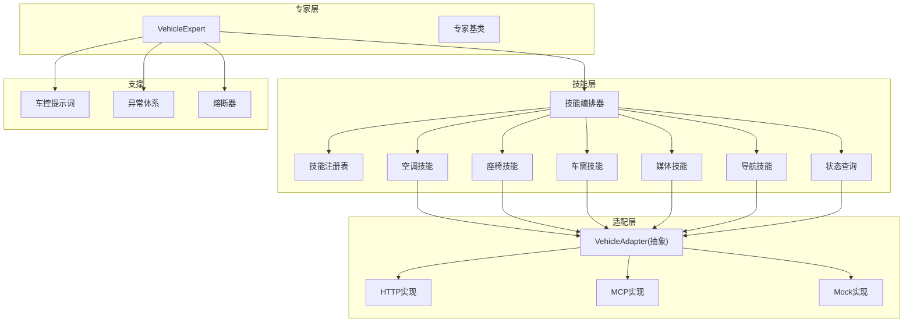
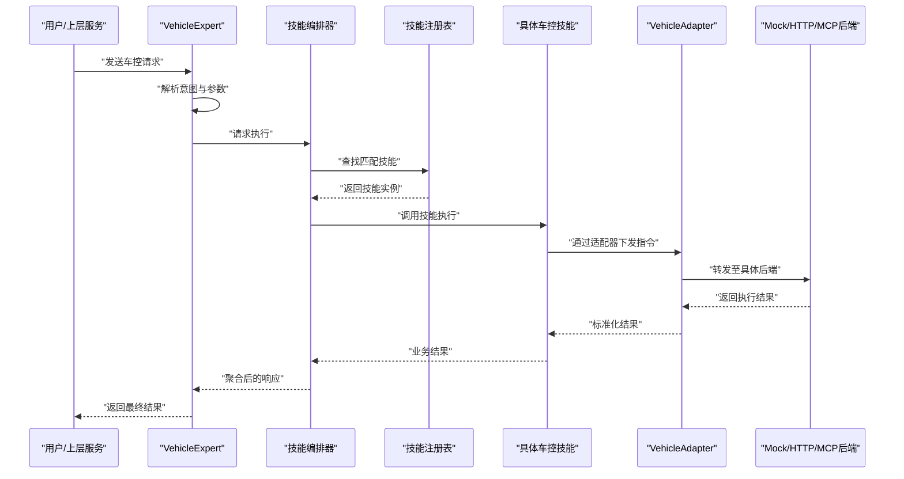
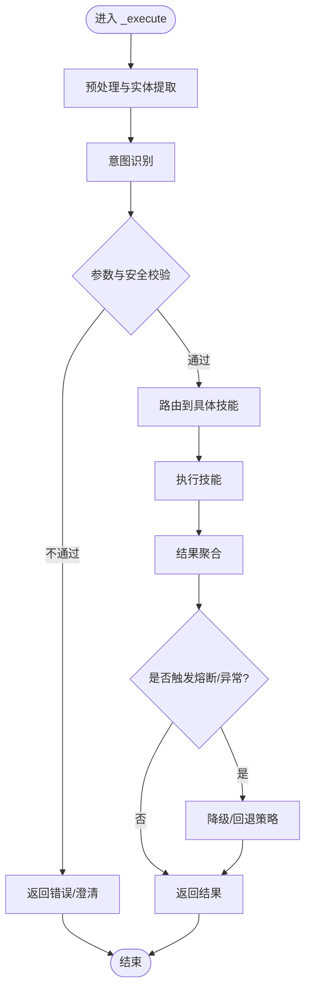
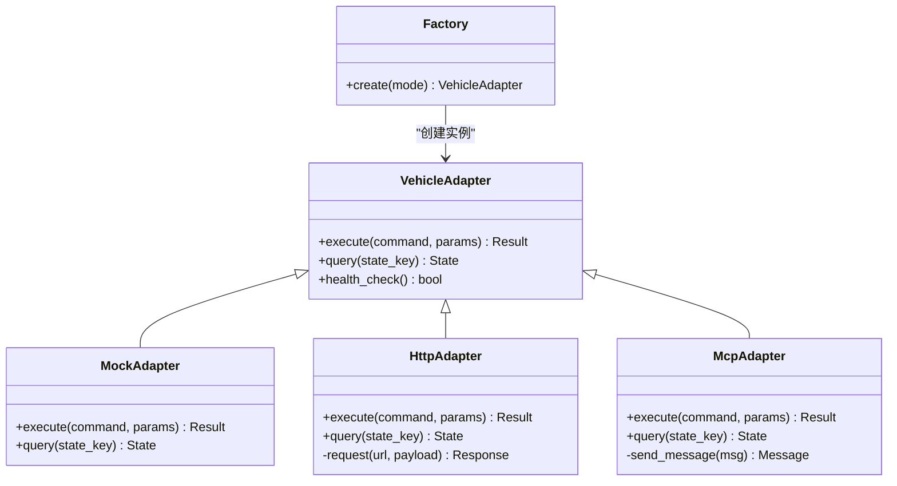
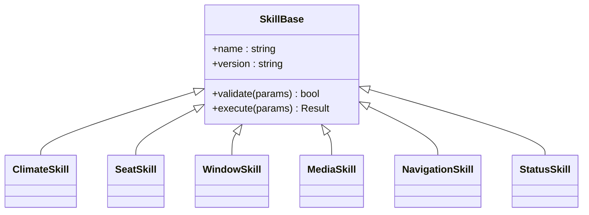
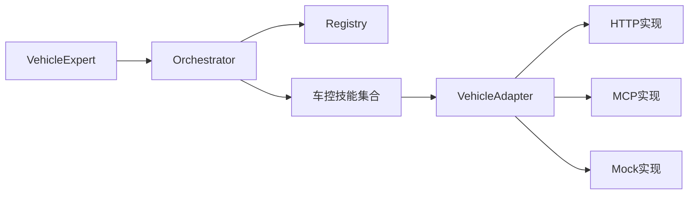

# 车辆控制专家

<cite>
**本文引用的文件**   
- [vehicle_expert.py](file://backend_design/nexus/agent/experts/vehicle_expert.py)
- [base.py](file://backend_design/nexus/agent/experts/base.py)
- [orchestrator.py](file://backend_design/nexus/skills/orchestrator.py)
- [registry.py](file://backend_design/nexus/skills/registry.py)
- [climate.py](file://backend_design/nexus/skills/vehicle/climate.py)
- [seat.py](file://backend_design/nexus/skills/vehicle/seat.py)
- [window.py](file://backend_design/nexus/skills/vehicle/window.py)
- [media.py](file://backend_design/nexus/skills/vehicle/media.py)
- [navigation.py](file://backend_design/nexus/skills/vehicle/navigation.py)
- [status.py](file://backend_design/nexus/skills/vehicle/status.py)
- [base.py](file://backend_design/nexus/skills/base.py)
- [factory.py](file://backend_design/nexus/vehicle/factory.py)
- [http.py](file://backend_design/nexus/vehicle/http.py)
- [mcp.py](file://backend_design/nexus/vehicle/mcp.py)
- [mock.py](file://backend_design/nexus/vehicle/mock.py)
- [vehicle.md](file://backend_design/nexus/prompts/vehicle.md)
- [exceptions.py](file://backend_design/nexus/core/exceptions.py)
- [circuit_breaker.py](file://backend_design/nexus/core/circuit_breaker.py)
</cite>

## 目录
1. [简介](#简介)
2. [项目结构](#项目结构)
3. [核心组件](#核心组件)
4. [架构总览](#架构总览)
5. [详细组件分析](#详细组件分析)
6. [依赖关系分析](#依赖关系分析)
7. [性能考量](#性能考量)
8. [故障排查指南](#故障排查指南)
9. [结论](#结论)
10. [附录](#附录)

## 简介
本文件面向“车辆控制专家（VehicleExpert）”的技术实现与使用，聚焦以下目标：
- 职责范围：空调、座椅、车窗、媒体播放、导航、车辆状态等车控能力的统一入口。
- 执行流程：_execute() 如何解析用户意图、路由到具体技能、调用 VehicleAdapter 并返回结果。
- 适配器模式：Mock、HTTP、MCP 三种模式的差异与切换方式。
- 安全与权限：指令校验、安全限制、权限控制策略。
- 使用示例：温度调节、座椅记忆、导航设置等常见场景的调用路径说明。
- 错误处理与恢复：异常分类、熔断降级、重试与回退策略。

## 项目结构
围绕 VehicleExpert 的关键代码分布在 agent 专家层、skills 技能层、vehicle 适配层以及配置与提示词中：
- 专家层：定义 VehicleExpert 及其基类能力。
- 技能层：按功能域组织（空调、座椅、车窗、媒体、导航、状态）。
- 适配层：抽象 VehicleAdapter，提供 Mock/HTTP/MCP 三种后端实现。
- 编排与注册：Orchestrator 负责技能调度，Registry 负责技能发现与注册。
- 提示词：用于意图识别与参数抽取的模板。
- 核心支撑：异常体系、熔断器、日志等。

图表来源
- [vehicle_expert.py:1-200](file://backend_design/nexus/agent/experts/vehicle_expert.py#L1-L200)
- [orchestrator.py:1-200](file://backend_design/nexus/skills/orchestrator.py#L1-L200)
- [registry.py:1-200](file://backend_design/nexus/skills/registry.py#L1-L200)
- [climate.py:1-200](file://backend_design/nexus/skills/vehicle/climate.py#L1-L200)
- [seat.py:1-200](file://backend_design/nexus/skills/vehicle/seat.py#L1-L200)
- [window.py:1-200](file://backend_design/nexus/skills/vehicle/window.py#L1-L200)
- [media.py:1-200](file://backend_design/nexus/skills/vehicle/media.py#L1-L200)
- [navigation.py:1-200](file://backend_design/nexus/skills/vehicle/navigation.py#L1-L200)
- [status.py:1-200](file://backend_design/nexus/skills/vehicle/status.py#L1-L200)
- [factory.py:1-200](file://backend_design/nexus/vehicle/factory.py#L1-L200)
- [http.py:1-200](file://backend_design/nexus/vehicle/http.py#L1-L200)
- [mcp.py:1-200](file://backend_design/nexus/vehicle/mcp.py#L1-L200)
- [mock.py:1-200](file://backend_design/nexus/vehicle/mock.py#L1-L200)
- [vehicle.md:1-200](file://backend_design/nexus/prompts/vehicle.md#L1-L200)
- [exceptions.py:1-200](file://backend_design/nexus/core/exceptions.py#L1-L200)
- [circuit_breaker.py:1-200](file://backend_design/nexus/core/circuit_breaker.py#L1-L200)

章节来源
- [vehicle_expert.py:1-200](file://backend_design/nexus/agent/experts/vehicle_expert.py#L1-L200)
- [orchestrator.py:1-200](file://backend_design/nexus/skills/orchestrator.py#L1-L200)
- [registry.py:1-200](file://backend_design/nexus/skills/registry.py#L1-L200)
- [factory.py:1-200](file://backend_design/nexus/vehicle/factory.py#L1-L200)
- [http.py:1-200](file://backend_design/nexus/vehicle/http.py#L1-L200)
- [mcp.py:1-200](file://backend_design/nexus/vehicle/mcp.py#L1-L200)
- [mock.py:1-200](file://backend_design/nexus/vehicle/mock.py#L1-L200)
- [vehicle.md:1-200](file://backend_design/nexus/prompts/vehicle.md#L1-L200)
- [exceptions.py:1-200](file://backend_design/nexus/core/exceptions.py#L1-L200)
- [circuit_breaker.py:1-200](file://backend_design/nexus/core/circuit_breaker.py#L1-L200)

## 核心组件
- VehicleExpert：车控领域专家，负责接收上层请求、解析意图、选择并执行对应技能，最终聚合结果返回。
- 技能编排器（Orchestrator）：根据意图类型分发到具体技能；维护技能生命周期与上下文。
- 技能注册表（Registry）：集中管理可用技能，支持动态发现与加载。
- 车控技能族：空调、座椅、车窗、媒体、导航、状态查询等，各自封装业务逻辑与参数校验。
- VehicleAdapter：对底层车控接口的抽象，屏蔽不同后端（Mock/HTTP/MCP）的差异。
- 工厂（Factory）：根据配置创建合适的 VehicleAdapter 实例。
- 提示词（Prompt）：用于意图识别、槽位抽取与参数规范化。
- 异常与熔断：统一的异常类型与熔断器，保障系统稳定性与可恢复性。

章节来源
- [vehicle_expert.py:1-200](file://backend_design/nexus/agent/experts/vehicle_expert.py#L1-L200)
- [orchestrator.py:1-200](file://backend_design/nexus/skills/orchestrator.py#L1-L200)
- [registry.py:1-200](file://backend_design/nexus/skills/registry.py#L1-L200)
- [base.py:1-200](file://backend_design/nexus/skills/base.py#L1-L200)
- [factory.py:1-200](file://backend_design/nexus/vehicle/factory.py#L1-L200)
- [vehicle.md:1-200](file://backend_design/nexus/prompts/vehicle.md#L1-L200)
- [exceptions.py:1-200](file://backend_design/nexus/core/exceptions.py#L1-L200)
- [circuit_breaker.py:1-200](file://backend_design/nexus/core/circuit_breaker.py#L1-L200)

## 架构总览
下图展示了从用户输入到车控执行的端到端流程，包括意图解析、技能路由、适配器调用与结果聚合。

图表来源
- [vehicle_expert.py:1-200](file://backend_design/nexus/agent/experts/vehicle_expert.py#L1-L200)
- [orchestrator.py:1-200](file://backend_design/nexus/skills/orchestrator.py#L1-L200)
- [registry.py:1-200](file://backend_design/nexus/skills/registry.py#L1-L200)
- [factory.py:1-200](file://backend_design/nexus/vehicle/factory.py#L1-L200)
- [http.py:1-200](file://backend_design/nexus/vehicle/http.py#L1-L200)
- [mcp.py:1-200](file://backend_design/nexus/vehicle/mcp.py#L1-L200)
- [mock.py:1-200](file://backend_design/nexus/vehicle/mock.py#L1-L200)

## 详细组件分析

### VehicleExpert 执行流程（_execute）
_execute() 是车控专家的核心入口，典型流程如下：
- 输入预处理：清洗文本、提取关键实体（如温度值、座位号、目的地等）。
- 意图识别：结合提示词与规则/模型进行意图分类（空调/座椅/车窗/媒体/导航/状态）。
- 参数校验：依据各技能的约束条件进行合法性检查（范围、互斥、安全限制）。
- 权限与安全：基于角色/会话上下文判断是否允许执行敏感操作（如解锁、远程启动）。
- 技能路由：通过编排器与注册表定位具体技能。
- 执行与聚合：调用技能，必要时并行执行多个子任务，汇总结果。
- 异常与降级：捕获异常，应用熔断与回退策略，返回友好响应。

图表来源
- [vehicle_expert.py:1-200](file://backend_design/nexus/agent/experts/vehicle_expert.py#L1-L200)
- [vehicle.md:1-200](file://backend_design/nexus/prompts/vehicle.md#L1-L200)
- [circuit_breaker.py:1-200](file://backend_design/nexus/core/circuit_breaker.py#L1-L200)
- [exceptions.py:1-200](file://backend_design/nexus/core/exceptions.py#L1-L200)

章节来源
- [vehicle_expert.py:1-200](file://backend_design/nexus/agent/experts/vehicle_expert.py#L1-L200)
- [vehicle.md:1-200](file://backend_design/nexus/prompts/vehicle.md#L1-L200)
- [circuit_breaker.py:1-200](file://backend_design/nexus/core/circuit_breaker.py#L1-L200)
- [exceptions.py:1-200](file://backend_design/nexus/core/exceptions.py#L1-L200)

### 与 VehicleAdapter 的交互（Mock/HTTP/MCP）
VehicleAdapter 作为统一抽象，屏蔽后端差异。工厂根据配置创建具体实现：
- Mock：本地模拟数据，便于开发与测试。
- HTTP：通过 REST/gRPC 调用远端车控服务。
- MCP：通过消息通信协议对接车载中间件或网关。

图表来源
- [factory.py:1-200](file://backend_design/nexus/vehicle/factory.py#L1-L200)
- [mock.py:1-200](file://backend_design/nexus/vehicle/mock.py#L1-L200)
- [http.py:1-200](file://backend_design/nexus/vehicle/http.py#L1-L200)
- [mcp.py:1-200](file://backend_design/nexus/vehicle/mcp.py#L1-L200)

章节来源
- [factory.py:1-200](file://backend_design/nexus/vehicle/factory.py#L1-L200)
- [mock.py:1-200](file://backend_design/nexus/vehicle/mock.py#L1-L200)
- [http.py:1-200](file://backend_design/nexus/vehicle/http.py#L1-L200)
- [mcp.py:1-200](file://backend_design/nexus/vehicle/mcp.py#L1-L200)

### 车控技能族
每个技能封装特定领域的业务逻辑与参数约束，并通过适配器与后端交互。

- 空调（Climate）
  - 能力：设定温度、风量、风向、自动模式、除雾等。
  - 校验：温度范围、风速档位、互斥模式（如制冷/制热）。
  - 安全：行驶中禁止某些高风险操作。
  
- 座椅（Seat）
  - 能力：位置调节、加热/通风、按摩、记忆保存/调用。
  - 校验：位置坐标范围、设备状态（如安全带未系时限制）。
  - 安全：驾驶座在行驶中限制大幅移动。

- 车窗（Window）
  - 能力：开合度、一键升降、防夹保护。
  - 校验：开合度百分比、儿童锁状态。
  - 安全：行驶中限制全开。

- 媒体（Media）
  - 能力：播放/暂停、切歌、音量、电台切换、蓝牙连接。
  - 校验：音量范围、源有效性。
  - 安全：驾驶模式下限制复杂操作。

- 导航（Navigation）
  - 能力：设置目的地、路线偏好、取消导航。
  - 校验：地址格式、POI 有效性。
  - 安全：行驶中仅允许语音确认的关键操作。

- 状态（Status）
  - 能力：读取车辆状态（电量、胎压、门窗状态、空调状态等）。
  - 校验：权限与只读访问。
  - 安全：敏感信息需鉴权。

图表来源
- [base.py:1-200](file://backend_design/nexus/skills/base.py#L1-L200)
- [climate.py:1-200](file://backend_design/nexus/skills/vehicle/climate.py#L1-L200)
- [seat.py:1-200](file://backend_design/nexus/skills/vehicle/seat.py#L1-L200)
- [window.py:1-200](file://backend_design/nexus/skills/vehicle/window.py#L1-L200)
- [media.py:1-200](file://backend_design/nexus/skills/vehicle/media.py#L1-L200)
- [navigation.py:1-200](file://backend_design/nexus/skills/vehicle/navigation.py#L1-L200)
- [status.py:1-200](file://backend_design/nexus/skills/vehicle/status.py#L1-L200)

章节来源
- [base.py:1-200](file://backend_design/nexus/skills/base.py#L1-L200)
- [climate.py:1-200](file://backend_design/nexus/skills/vehicle/climate.py#L1-L200)
- [seat.py:1-200](file://backend_design/nexus/skills/vehicle/seat.py#L1-L200)
- [window.py:1-200](file://backend_design/nexus/skills/vehicle/window.py#L1-L200)
- [media.py:1-200](file://backend_design/nexus/skills/vehicle/media.py#L1-L200)
- [navigation.py:1-200](file://backend_design/nexus/skills/vehicle/navigation.py#L1-L200)
- [status.py:1-200](file://backend_design/nexus/skills/vehicle/status.py#L1-L200)

### 指令验证机制、安全限制与权限控制
- 指令验证：
  - 参数范围校验（如温度区间、音量上限）。
  - 语义一致性校验（如“打开车窗”与“关闭车窗”互斥）。
  - 上下文相关校验（车速、车门状态、儿童锁、安全带）。
- 安全限制：
  - 行驶中限制高风险操作（大幅座椅移动、车窗全开）。
  - 敏感操作二次确认（远程启动、解锁）。
- 权限控制：
  - 基于用户角色（驾驶员/乘客/管理员）与设备绑定。
  - 基于会话上下文（是否已认证、是否处于受控模式）。
  - 白名单/黑名单策略（特定区域或时间段禁用）。

章节来源
- [vehicle_expert.py:1-200](file://backend_design/nexus/agent/experts/vehicle_expert.py#L1-L200)
- [climate.py:1-200](file://backend_design/nexus/skills/vehicle/climate.py#L1-L200)
- [seat.py:1-200](file://backend_design/nexus/skills/vehicle/seat.py#L1-L200)
- [window.py:1-200](file://backend_design/nexus/skills/vehicle/window.py#L1-L200)
- [media.py:1-200](file://backend_design/nexus/skills/vehicle/media.py#L1-L200)
- [navigation.py:1-200](file://backend_design/nexus/skills/vehicle/navigation.py#L1-L200)
- [status.py:1-200](file://backend_design/nexus/skills/vehicle/status.py#L1-L200)

### 使用示例（常见场景）
以下为典型场景的调用路径说明（以步骤代替代码片段）：
- 温度调节
  - 输入：“把温度调到24度”。
  - 流程：意图识别为“空调”，参数校验温度范围，调用空调技能，经适配器下发，返回成功。
  - 参考路径：[vehicle_expert.py:1-200](file://backend_design/nexus/agent/experts/vehicle_expert.py#L1-L200)、[climate.py:1-200](file://backend_design/nexus/skills/vehicle/climate.py#L1-L200)

- 座椅记忆
  - 输入：“保存当前座椅位置为记忆1”。
  - 流程：意图识别为“座椅”，参数校验座位号与记忆槽，调用座椅技能，经适配器下发，返回成功。
  - 参考路径：[vehicle_expert.py:1-200](file://backend_design/nexus/agent/experts/vehicle_expert.py#L1-L200)、[seat.py:1-200](file://backend_design/nexus/skills/vehicle/seat.py#L1-L200)

- 导航设置
  - 输入：“导航到最近的加油站”。
  - 流程：意图识别为“导航”，地址解析与POI校验，调用导航技能，经适配器下发，返回路线摘要。
  - 参考路径：[vehicle_expert.py:1-200](file://backend_design/nexus/agent/experts/vehicle_expert.py#L1-L200)、[navigation.py:1-200](file://backend_design/nexus/skills/vehicle/navigation.py#L1-L200)

- 媒体播放
  - 输入：“播放周杰伦的歌”。
  - 流程：意图识别为“媒体”，源与曲目校验，调用媒体技能，经适配器下发，返回播放状态。
  - 参考路径：[vehicle_expert.py:1-200](file://backend_design/nexus/agent/experts/vehicle_expert.py#L1-L200)、[media.py:1-200](file://backend_design/nexus/skills/vehicle/media.py#L1-L200)

- 车窗操作
  - 输入：“打开主驾车窗一半”。
  - 流程：意图识别为“车窗”，开合度与儿童锁校验，调用车窗技能，经适配器下发，返回执行结果。
  - 参考路径：[vehicle_expert.py:1-200](file://backend_design/nexus/agent/experts/vehicle_expert.py#L1-L200)、[window.py:1-200](file://backend_design/nexus/skills/vehicle/window.py#L1-L200)

- 车辆状态查询
  - 输入：“当前胎压是多少？”
  - 流程：意图识别为“状态”，权限校验，调用状态技能，经适配器读取，返回状态摘要。
  - 参考路径：[vehicle_expert.py:1-200](file://backend_design/nexus/agent/experts/vehicle_expert.py#L1-L200)、[status.py:1-200](file://backend_design/nexus/skills/vehicle/status.py#L1-L200)

章节来源
- [vehicle_expert.py:1-200](file://backend_design/nexus/agent/experts/vehicle_expert.py#L1-L200)
- [climate.py:1-200](file://backend_design/nexus/skills/vehicle/climate.py#L1-L200)
- [seat.py:1-200](file://backend_design/nexus/skills/vehicle/seat.py#L1-L200)
- [window.py:1-200](file://backend_design/nexus/skills/vehicle/window.py#L1-L200)
- [media.py:1-200](file://backend_design/nexus/skills/vehicle/media.py#L1-L200)
- [navigation.py:1-200](file://backend_design/nexus/skills/vehicle/navigation.py#L1-L200)
- [status.py:1-200](file://backend_design/nexus/skills/vehicle/status.py#L1-L200)

## 依赖关系分析
- 内部依赖：
  - VehicleExpert 依赖编排器与注册表进行技能发现与调度。
  - 各车控技能依赖 VehicleAdapter 抽象，避免直接耦合后端。
  - 工厂负责根据配置创建具体适配器实例。
- 外部依赖：
  - HTTP 模式依赖网络库与远端车控服务。
  - MCP 模式依赖消息总线或车载中间件。
  - Mock 模式无外部依赖，适合单元测试。

图表来源
- [vehicle_expert.py:1-200](file://backend_design/nexus/agent/experts/vehicle_expert.py#L1-L200)
- [orchestrator.py:1-200](file://backend_design/nexus/skills/orchestrator.py#L1-L200)
- [registry.py:1-200](file://backend_design/nexus/skills/registry.py#L1-L200)
- [factory.py:1-200](file://backend_design/nexus/vehicle/factory.py#L1-L200)
- [http.py:1-200](file://backend_design/nexus/vehicle/http.py#L1-L200)
- [mcp.py:1-200](file://backend_design/nexus/vehicle/mcp.py#L1-L200)
- [mock.py:1-200](file://backend_design/nexus/vehicle/mock.py#L1-L200)

章节来源
- [vehicle_expert.py:1-200](file://backend_design/nexus/agent/experts/vehicle_expert.py#L1-L200)
- [orchestrator.py:1-200](file://backend_design/nexus/skills/orchestrator.py#L1-L200)
- [registry.py:1-200](file://backend_design/nexus/skills/registry.py#L1-L200)
- [factory.py:1-200](file://backend_design/nexus/vehicle/factory.py#L1-L200)

## 性能考量
- 并发与并行：
  - 多技能并行执行（如同时调节空调与媒体），减少端到端延迟。
  - 适配器层采用连接池与超时控制，避免阻塞。
- 缓存与去重：
  - 状态查询结果短期缓存，降低重复请求压力。
  - 幂等指令去重，防止重复下发。
- 资源限流：
  - 针对高频接口（如媒体切歌）实施速率限制。
- 降级与回退：
  - 远端不可用时切换到 Mock 或只读模式，保证基本可用性。

[本节为通用指导，无需源码引用]

## 故障排查指南
- 常见问题定位：
  - 意图识别失败：检查提示词与参数抽取逻辑。
  - 参数校验失败：核对各技能的约束条件与边界值。
  - 适配器调用失败：查看 HTTP/MCP 连通性与认证配置。
  - 熔断触发：观察熔断器阈值与回退策略。
- 诊断手段：
  - 启用详细日志与链路追踪。
  - 使用 Mock 模式隔离问题。
  - 逐步缩小范围（先状态查询，再写操作）。
- 恢复策略：
  - 自动重试与指数退避。
  - 降级到只读或基础功能。
  - 人工介入与告警通知。

章节来源
- [exceptions.py:1-200](file://backend_design/nexus/core/exceptions.py#L1-L200)
- [circuit_breaker.py:1-200](file://backend_design/nexus/core/circuit_breaker.py#L1-L200)
- [http.py:1-200](file://backend_design/nexus/vehicle/http.py#L1-L200)
- [mcp.py:1-200](file://backend_design/nexus/vehicle/mcp.py#L1-L200)
- [mock.py:1-200](file://backend_design/nexus/vehicle/mock.py#L1-L200)

## 结论
VehicleExpert 通过清晰的职责分层与适配器模式，将复杂的车控能力解耦为可插拔的技能模块，并以统一的执行流程与健壮的错误处理保障系统稳定。配合 Mock/HTTP/MCP 多种后端实现，既满足开发测试需求，又具备生产环境的可扩展性与高可用能力。

[本节为总结，无需源码引用]

## 附录
- 术语表：
  - 意图识别：从自然语言中提取用户意图与关键参数的过程。
  - 适配器模式：在不修改客户端代码的前提下，替换不同后端实现的编程模式。
  - 熔断器：当下游服务不稳定时快速失败并回退的保护机制。
- 扩展建议：
  - 增加更细粒度的权限模型（如按功能域授权）。
  - 引入A/B测试与灰度发布，优化意图识别准确率。
  - 完善监控指标（成功率、延迟、熔断次数）。

[本节为补充信息，无需源码引用]