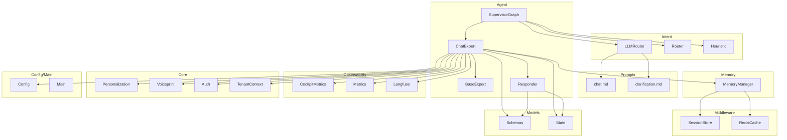
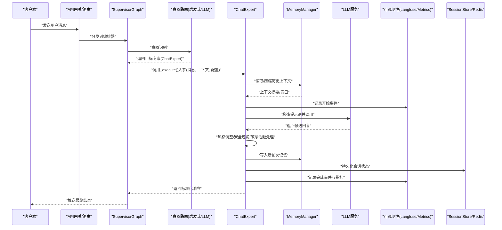
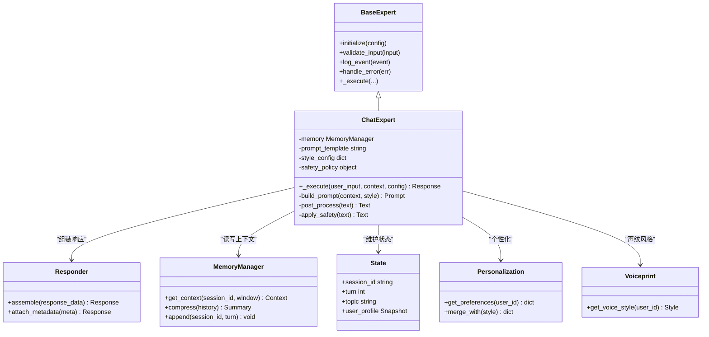
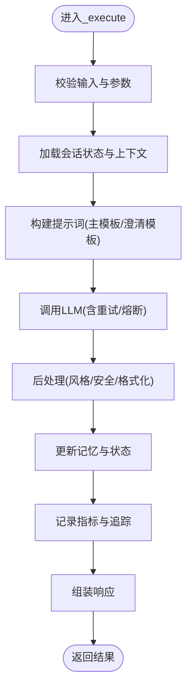
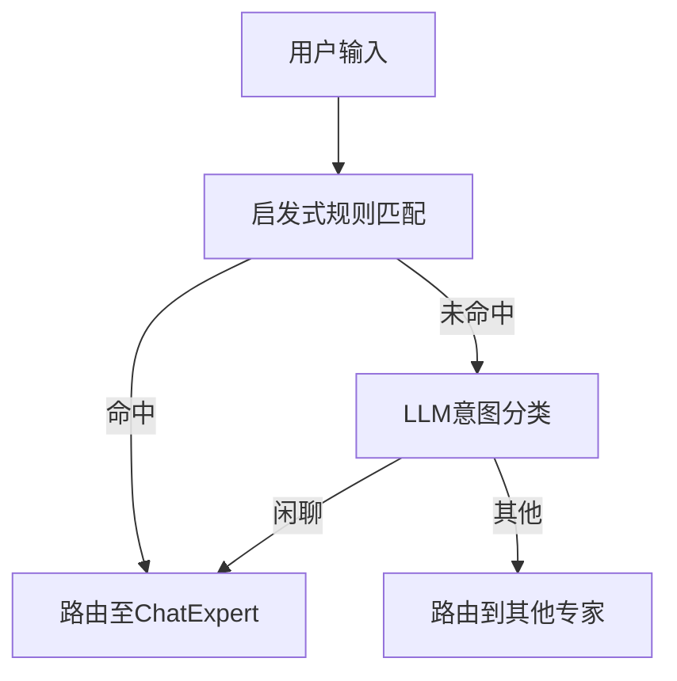
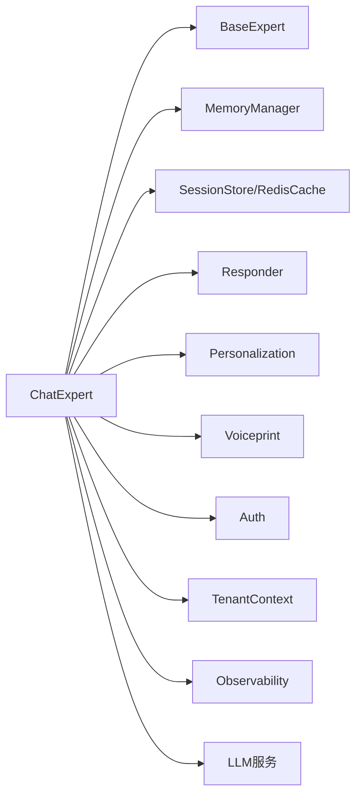

# 闲聊对话专家

<cite>
**本文引用的文件**   
- [chat_expert.py](file://backend_design/nexus/agent/experts/chat_expert.py)
- [base.py](file://backend_design/nexus/agent/experts/base.py)
- [responder.py](file://backend_design/nexus/agent/responder.py)
- [supervisor_graph.py](file://backend_design/nexus/agent/supervisor_graph.py)
- [llm_router.py](file://backend_design/nexus/intent/llm_router.py)
- [router.py](file://backend_design/nexus/intent/router.py)
- [heuristic.py](file://backend_design/nexus/intent/heuristic.py)
- [chat.md](file://backend_design/nexus/prompts/chat.md)
- [clarification.md](file://backend_design/nexus/prompts/clarification.md)
- [memory_manager.py](file://backend_design/nexus/memory/manager.py)
- [session_store.py](file://backend_design/nexus/middleware/session_store.py)
- [redis_cache.py](file://backend_design/nexus/middleware/redis_cache.py)
- [schemas.py](file://backend_design/nexus/models/schemas.py)
- [state.py](file://backend_design/nexus/models/state.py)
- [cockpit_metrics.py](file://backend_design/nexus/observability/cockpit_metrics.py)
- [metrics.py](file://backend_design/nexus/observability/metrics.py)
- [langfuse.py](file://backend_design/nexus/observability/langfuse.py)
- [personalization.py](file://backend_design/nexus/core/personalization.py)
- [voiceprint.py](file://backend_design/nexus/core/voiceprint.py)
- [auth.py](file://backend_design/nexus/core/auth.py)
- [tenant_context.py](file://backend_design/nexus/core/tenant_context.py)
- [config.py](file://backend_design/nexus/config.py)
- [main.py](file://backend_design/nexus/main.py)
</cite>

## 目录
1. [简介](#简介)
2. [项目结构](#项目结构)
3. [核心组件](#核心组件)
4. [架构总览](#架构总览)
5. [详细组件分析](#详细组件分析)
6. [依赖分析](#依赖分析)
7. [性能考虑](#性能考虑)
8. [故障排查指南](#故障排查指南)
9. [结论](#结论)
10. [附录](#附录)

## 简介
本文件面向“闲聊对话专家（ChatExpert）”的技术实现与使用，覆盖其职责范围、核心流程、与LLM的集成方式、上下文与多轮状态管理、风格控制机制、典型使用示例以及质量评估与持续优化策略。目标是帮助开发者快速理解并高效扩展该模块，同时为产品与运营提供可落地的质量保障方案。

## 项目结构
围绕闲聊对话能力的相关代码主要分布在以下子系统中：
- Agent层：专家路由与编排，包含ChatExpert及其基类、Supervisor编排图
- Intent层：意图识别与路由（启发式与LLM路由）
- Prompts层：提示词模板（闲聊、澄清等）
- Memory层：记忆压缩与管理
- Middleware层：会话存储、缓存
- Models层：数据模型与状态定义
- Observability层：指标、追踪与可观测性
- Core层：个性化、声纹、鉴权、租户上下文等通用能力
- Config/Main：配置与入口

图表来源
- [chat_expert.py:1-200](file://backend_design/nexus/agent/experts/chat_expert.py#L1-L200)
- [base.py:1-120](file://backend_design/nexus/agent/experts/base.py#L1-L120)
- [responder.py:1-150](file://backend_design/nexus/agent/responder.py#L1-L150)
- [supervisor_graph.py:1-200](file://backend_design/nexus/agent/supervisor_graph.py#L1-L200)
- [llm_router.py:1-200](file://backend_design/nexus/intent/llm_router.py#L1-L200)
- [router.py:1-120](file://backend_design/nexus/intent/router.py#L1-L120)
- [heuristic.py:1-120](file://backend_design/nexus/intent/heuristic.py#L1-L120)
- [chat.md:1-200](file://backend_design/nexus/prompts/chat.md#L1-L200)
- [clarification.md:1-200](file://backend_design/nexus/prompts/clarification.md#L1-L200)
- [manager.py:1-200](file://backend_design/nexus/memory/manager.py#L1-L200)
- [session_store.py:1-150](file://backend_design/nexus/middleware/session_store.py#L1-L150)
- [redis_cache.py:1-150](file://backend_design/nexus/middleware/redis_cache.py#L1-L150)
- [schemas.py:1-200](file://backend_design/nexus/models/schemas.py#L1-L200)
- [state.py:1-150](file://backend_design/nexus/models/state.py#L1-L150)
- [cockpit_metrics.py:1-150](file://backend_design/nexus/observability/cockpit_metrics.py#L1-L150)
- [metrics.py:1-150](file://backend_design/nexus/observability/metrics.py#L1-L150)
- [langfuse.py:1-150](file://backend_design/nexus/observability/langfuse.py#L1-L150)
- [personalization.py:1-150](file://backend_design/nexus/core/personalization.py#L1-L150)
- [voiceprint.py:1-150](file://backend_design/nexus/core/voiceprint.py#L1-L150)
- [auth.py:1-150](file://backend_design/nexus/core/auth.py#L1-L150)
- [tenant_context.py:1-150](file://backend_design/nexus/core/tenant_context.py#L1-L150)
- [config.py:1-200](file://backend_design/nexus/config.py#L1-L200)
- [main.py:1-200](file://backend_design/nexus/main.py#L1-L200)

章节来源
- [chat_expert.py:1-200](file://backend_design/nexus/agent/experts/chat_expert.py#L1-L200)
- [base.py:1-120](file://backend_design/nexus/agent/experts/base.py#L1-L120)
- [responder.py:1-150](file://backend_design/nexus/agent/responder.py#L1-L150)
- [supervisor_graph.py:1-200](file://backend_design/nexus/agent/supervisor_graph.py#L1-L200)
- [llm_router.py:1-200](file://backend_design/nexus/intent/llm_router.py#L1-L200)
- [router.py:1-120](file://backend_design/nexus/intent/router.py#L1-L120)
- [heuristic.py:1-120](file://backend_design/nexus/intent/heuristic.py#L1-L120)
- [chat.md:1-200](file://backend_design/nexus/prompts/chat.md#L1-L200)
- [clarification.md:1-200](file://backend_design/nexus/prompts/clarification.md#L1-L200)
- [manager.py:1-200](file://backend_design/nexus/memory/manager.py#L1-L200)
- [session_store.py:1-150](file://backend_design/nexus/middleware/session_store.py#L1-L150)
- [redis_cache.py:1-150](file://backend_design/nexus/middleware/redis_cache.py#L1-L150)
- [schemas.py:1-200](file://backend_design/nexus/models/schemas.py#L1-L200)
- [state.py:1-150](file://backend_design/nexus/models/state.py#L1-L150)
- [cockpit_metrics.py:1-150](file://backend_design/nexus/observability/cockpit_metrics.py#L1-L150)
- [metrics.py:1-150](file://backend_design/nexus/observability/metrics.py#L1-L150)
- [langfuse.py:1-150](file://backend_design/nexus/observability/langfuse.py#L1-L150)
- [personalization.py:1-150](file://backend_design/nexus/core/personalization.py#L1-L150)
- [voiceprint.py:1-150](file://backend_design/nexus/core/voiceprint.py#L1-L150)
- [auth.py:1-150](file://backend_design/nexus/core/auth.py#L1-L150)
- [tenant_context.py:1-150](file://backend_design/nexus/core/tenant_context.py#L1-L150)
- [config.py:1-200](file://backend_design/nexus/config.py#L1-L200)
- [main.py:1-200](file://backend_design/nexus/main.py#L1-L200)

## 核心组件
- ChatExpert：闲聊领域专家，负责日常对话、情感交流、知识问答、娱乐互动等通用聊天能力；维护对话上下文、调用LLM生成回复、执行风格与安全策略。
- BaseExpert：专家抽象基类，统一生命周期、参数校验、日志埋点、错误处理与可扩展钩子。
- Responder：响应组装器，将LLM输出与结构化元数据组合成标准响应对象。
- SupervisorGraph：编排器，根据意图或规则选择专家（包括ChatExpert），协调多步流程。
- Intent路由：启发式与LLM路由共同决定进入ChatExpert或其他专家分支。
- Prompts：闲聊与澄清提示词模板，驱动LLM行为与风格。
- MemoryManager：对话记忆管理与压缩，支撑长上下文与跨轮次连贯性。
- SessionStore/RedisCache：会话持久化与热点缓存，提升吞吐与稳定性。
- Models/Schemas/State：输入输出契约、消息结构与对话状态模型。
- Observability：指标采集、分布式追踪与可视化面板。
- Core：个性化、声纹、鉴权、租户上下文等横切能力。

章节来源
- [chat_expert.py:1-200](file://backend_design/nexus/agent/experts/chat_expert.py#L1-L200)
- [base.py:1-120](file://backend_design/nexus/agent/experts/base.py#L1-L120)
- [responder.py:1-150](file://backend_design/nexus/agent/responder.py#L1-L150)
- [supervisor_graph.py:1-200](file://backend_design/nexus/agent/supervisor_graph.py#L1-L200)
- [llm_router.py:1-200](file://backend_design/nexus/intent/llm_router.py#L1-L200)
- [router.py:1-120](file://backend_design/nexus/intent/router.py#L1-L120)
- [heuristic.py:1-120](file://backend_design/nexus/intent/heuristic.py#L1-L120)
- [chat.md:1-200](file://backend_design/nexus/prompts/chat.md#L1-L200)
- [clarification.md:1-200](file://backend_design/nexus/prompts/clarification.md#L1-L200)
- [manager.py:1-200](file://backend_design/nexus/memory/manager.py#L1-L200)
- [session_store.py:1-150](file://backend_design/nexus/middleware/session_store.py#L1-L150)
- [redis_cache.py:1-150](file://backend_design/nexus/middleware/redis_cache.py#L1-L150)
- [schemas.py:1-200](file://backend_design/nexus/models/schemas.py#L1-L200)
- [state.py:1-150](file://backend_design/nexus/models/state.py#L1-L150)
- [cockpit_metrics.py:1-150](file://backend_design/nexus/observability/cockpit_metrics.py#L1-L150)
- [metrics.py:1-150](file://backend_design/nexus/observability/metrics.py#L1-L150)
- [langfuse.py:1-150](file://backend_design/nexus/observability/langfuse.py#L1-L150)
- [personalization.py:1-150](file://backend_design/nexus/core/personalization.py#L1-L150)
- [voiceprint.py:1-150](file://backend_design/nexus/core/voiceprint.py#L1-L150)
- [auth.py:1-150](file://backend_design/nexus/core/auth.py#L1-L150)
- [tenant_context.py:1-150](file://backend_design/nexus/core/tenant_context.py#L1-L150)

## 架构总览
下图展示从请求进入到ChatExpert生成回复的关键路径，包括意图路由、上下文构建、LLM调用、风格与安全控制、记忆更新与响应组装。

图表来源
- [supervisor_graph.py:1-200](file://backend_design/nexus/agent/supervisor_graph.py#L1-L200)
- [llm_router.py:1-200](file://backend_design/nexus/intent/llm_router.py#L1-L200)
- [heuristic.py:1-120](file://backend_design/nexus/intent/heuristic.py#L1-L120)
- [chat_expert.py:1-200](file://backend_design/nexus/agent/experts/chat_expert.py#L1-L200)
- [manager.py:1-200](file://backend_design/nexus/memory/manager.py#L1-L200)
- [session_store.py:1-150](file://backend_design/nexus/middleware/session_store.py#L1-L150)
- [redis_cache.py:1-150](file://backend_design/nexus/middleware/redis_cache.py#L1-L150)
- [langfuse.py:1-150](file://backend_design/nexus/observability/langfuse.py#L1-L150)
- [metrics.py:1-150](file://backend_design/nexus/observability/metrics.py#L1-L150)

## 详细组件分析

### ChatExpert 类与方法 _execute()
- 职责范围
  - 日常对话：问候、寒暄、闲聊推进
  - 情感交流：共情表达、情绪安抚、正向反馈
  - 知识问答：基于通用知识的自然语言回答
  - 娱乐互动：讲故事、讲笑话、趣味问答
- 关键方法
  - _execute(user_input, context, config): 核心推理入口，负责解析上下文、构建提示词、调用LLM、后处理与返回
- 上下文理解与连贯性
  - 通过MemoryManager获取最近N轮或摘要上下文，结合个人偏好与声纹特征进行个性化增强
  - 在提示词中注入主题、语气、长度约束与上一轮要点，确保连贯
- 与LLM集成
  - 提示词工程：以chat.md为主模板，必要时插入clarification.md用于澄清
  - 上下文管理：滑动窗口+摘要压缩，避免超长上下文导致退化
  - 多轮状态：由State与SessionStore维护会话ID、轮次、主题、用户画像快照
- 风格控制与安全
  - 语气调整：依据personalization与voiceprint动态设置正式/轻松/幽默等风格
  - 内容过滤：对敏感话题进行降级或拒绝策略，保证合规
  - 安全兜底：异常时回退到默认友好话术

图表来源
- [base.py:1-120](file://backend_design/nexus/agent/experts/base.py#L1-L120)
- [chat_expert.py:1-200](file://backend_design/nexus/agent/experts/chat_expert.py#L1-L200)
- [responder.py:1-150](file://backend_design/nexus/agent/responder.py#L1-L150)
- [manager.py:1-200](file://backend_design/nexus/memory/manager.py#L1-L200)
- [state.py:1-150](file://backend_design/nexus/models/state.py#L1-L150)
- [personalization.py:1-150](file://backend_design/nexus/core/personalization.py#L1-L150)
- [voiceprint.py:1-150](file://backend_design/nexus/core/voiceprint.py#L1-L150)

#### _execute() 流程详解
- 输入校验与上下文加载
  - 校验用户输入格式与长度
  - 从SessionStore/Redis恢复会话状态，从MemoryManager拉取上下文窗口或摘要
- 提示词构建
  - 加载chat.md主模板，注入当前主题、风格、长度限制、上一轮要点
  - 若信息不足，插入clarification.md引导用户补充
- LLM调用
  - 调用LLM服务，带超时与重试策略
- 后处理
  - 风格调整：根据个性化与声纹设定语气
  - 安全过滤：敏感话题检测与降级/拒绝
  - 格式化：去除多余标记、规范化标点
- 记忆与状态更新
  - 追加本轮对话到记忆，必要时触发压缩
  - 更新State中的轮次、主题与用户画像快照
- 可观测性与响应组装
  - 记录耗时、Token用量、错误码等指标
  - 通过Responder组装标准响应返回

图表来源
- [chat_expert.py:1-200](file://backend_design/nexus/agent/experts/chat_expert.py#L1-L200)
- [chat.md:1-200](file://backend_design/nexus/prompts/chat.md#L1-L200)
- [clarification.md:1-200](file://backend_design/nexus/prompts/clarification.md#L1-L200)
- [manager.py:1-200](file://backend_design/nexus/memory/manager.py#L1-L200)
- [session_store.py:1-150](file://backend_design/nexus/middleware/session_store.py#L1-L150)
- [redis_cache.py:1-150](file://backend_design/nexus/middleware/redis_cache.py#L1-L150)
- [metrics.py:1-150](file://backend_design/nexus/observability/metrics.py#L1-L150)
- [langfuse.py:1-150](file://backend_design/nexus/observability/langfuse.py#L1-L150)

章节来源
- [chat_expert.py:1-200](file://backend_design/nexus/agent/experts/chat_expert.py#L1-L200)
- [base.py:1-120](file://backend_design/nexus/agent/experts/base.py#L1-L120)
- [responder.py:1-150](file://backend_design/nexus/agent/responder.py#L1-L150)
- [manager.py:1-200](file://backend_design/nexus/memory/manager.py#L1-L200)
- [session_store.py:1-150](file://backend_design/nexus/middleware/session_store.py#L1-L150)
- [redis_cache.py:1-150](file://backend_design/nexus/middleware/redis_cache.py#L1-L150)
- [chat.md:1-200](file://backend_design/nexus/prompts/chat.md#L1-L200)
- [clarification.md:1-200](file://backend_design/nexus/prompts/clarification.md#L1-L200)
- [state.py:1-150](file://backend_design/nexus/models/state.py#L1-L150)
- [personalization.py:1-150](file://backend_design/nexus/core/personalization.py#L1-L150)
- [voiceprint.py:1-150](file://backend_design/nexus/core/voiceprint.py#L1-L150)
- [metrics.py:1-150](file://backend_design/nexus/observability/metrics.py#L1-L150)
- [langfuse.py:1-150](file://backend_design/nexus/observability/langfuse.py#L1-L150)

### 意图路由与专家选择
- 启发式路由：基于关键词、正则与规则快速分流
- LLM路由：当规则无法确定时，交由轻量LLM判断是否进入闲聊专家
- SupervisorGraph：统一编排，支持并行/串行、降级与回退

图表来源
- [heuristic.py:1-120](file://backend_design/nexus/intent/heuristic.py#L1-L120)
- [llm_router.py:1-200](file://backend_design/nexus/intent/llm_router.py#L1-L200)
- [supervisor_graph.py:1-200](file://backend_design/nexus/agent/supervisor_graph.py#L1-L200)

章节来源
- [heuristic.py:1-120](file://backend_design/nexus/intent/heuristic.py#L1-L120)
- [llm_router.py:1-200](file://backend_design/nexus/intent/llm_router.py#L1-L200)
- [supervisor_graph.py:1-200](file://backend_design/nexus/agent/supervisor_graph.py#L1-L200)

### 提示词工程与上下文管理
- 主模板chat.md：定义闲聊角色、语气、长度、话题边界与输出格式
- 澄清模板clarification.md：在信息不足时主动提问，提高后续回复质量
- 上下文窗口：优先保留近N轮，辅以摘要压缩，平衡连贯性与成本
- 个性化注入：结合personalization与voiceprint，动态调整风格与称呼

章节来源
- [chat.md:1-200](file://backend_design/nexus/prompts/chat.md#L1-L200)
- [clarification.md:1-200](file://backend_design/nexus/prompts/clarification.md#L1-L200)
- [manager.py:1-200](file://backend_design/nexus/memory/manager.py#L1-L200)
- [personalization.py:1-150](file://backend_design/nexus/core/personalization.py#L1-L150)
- [voiceprint.py:1-150](file://backend_design/nexus/core/voiceprint.py#L1-L150)

### 对话风格控制与安全
- 风格控制：正式/轻松/幽默/鼓励等风格开关，按用户画像与声纹自动适配
- 内容过滤：敏感话题识别、风险降级、拒绝策略与替代话术
- 安全兜底：异常时返回友好且安全的默认回复，避免崩溃

章节来源
- [chat_expert.py:1-200](file://backend_design/nexus/agent/experts/chat_expert.py#L1-L200)
- [personalization.py:1-150](file://backend_design/nexus/core/personalization.py#L1-L150)
- [voiceprint.py:1-150](file://backend_design/nexus/core/voiceprint.py#L1-L150)

### 使用示例（场景化说明）
- 问候对话
  - 输入：“早上好！”
  - 期望：友好问候，询问是否需要安排日程或播放音乐
  - 关键点：短上下文、轻松语气、个性化称呼
- 故事讲述
  - 输入：“给我讲个睡前小故事吧。”
  - 期望：简短温馨故事，结尾温和收束
  - 关键点：长度控制、积极主题、避免恐怖元素
- 笑话互动
  - 输入：“讲个冷笑话。”
  - 期望：轻松幽默，不冒犯，适合车载环境
  - 关键点：幽默阈值、安全过滤、避免争议话题

[本节为概念性示例说明，不直接分析具体文件]

## 依赖分析
- 内部依赖
  - BaseExpert：统一生命周期与错误处理
  - MemoryManager：上下文与记忆
  - SessionStore/RedisCache：会话持久化与缓存
  - Responder：响应组装
  - Personalization/Voiceprint/Auth/TenantContext：横切能力
  - Observability：指标与追踪
- 外部依赖
  - LLM服务：文本生成接口
  - 中间件：Redis、数据库等

图表来源
- [chat_expert.py:1-200](file://backend_design/nexus/agent/experts/chat_expert.py#L1-L200)
- [base.py:1-120](file://backend_design/nexus/agent/experts/base.py#L1-L120)
- [manager.py:1-200](file://backend_design/nexus/memory/manager.py#L1-L200)
- [session_store.py:1-150](file://backend_design/nexus/middleware/session_store.py#L1-L150)
- [redis_cache.py:1-150](file://backend_design/nexus/middleware/redis_cache.py#L1-L150)
- [responder.py:1-150](file://backend_design/nexus/agent/responder.py#L1-L150)
- [personalization.py:1-150](file://backend_design/nexus/core/personalization.py#L1-L150)
- [voiceprint.py:1-150](file://backend_design/nexus/core/voiceprint.py#L1-L150)
- [auth.py:1-150](file://backend_design/nexus/core/auth.py#L1-L150)
- [tenant_context.py:1-150](file://backend_design/nexus/core/tenant_context.py#L1-L150)
- [metrics.py:1-150](file://backend_design/nexus/observability/metrics.py#L1-L150)
- [langfuse.py:1-150](file://backend_design/nexus/observability/langfuse.py#L1-L150)

章节来源
- [chat_expert.py:1-200](file://backend_design/nexus/agent/experts/chat_expert.py#L1-L200)
- [base.py:1-120](file://backend_design/nexus/agent/experts/base.py#L1-L120)
- [manager.py:1-200](file://backend_design/nexus/memory/manager.py#L1-L200)
- [session_store.py:1-150](file://backend_design/nexus/middleware/session_store.py#L1-L150)
- [redis_cache.py:1-150](file://backend_design/nexus/middleware/redis_cache.py#L1-L150)
- [responder.py:1-150](file://backend_design/nexus/agent/responder.py#L1-L150)
- [personalization.py:1-150](file://backend_design/nexus/core/personalization.py#L1-L150)
- [voiceprint.py:1-150](file://backend_design/nexus/core/voiceprint.py#L1-L150)
- [auth.py:1-150](file://backend_design/nexus/core/auth.py#L1-L150)
- [tenant_context.py:1-150](file://backend_design/nexus/core/tenant_context.py#L1-L150)
- [metrics.py:1-150](file://backend_design/nexus/observability/metrics.py#L1-L150)
- [langfuse.py:1-150](file://backend_design/nexus/observability/langfuse.py#L1-L150)

## 性能考虑
- 上下文压缩：采用摘要压缩减少Token消耗与延迟
- 缓存策略：热点会话与常用回复片段缓存于Redis
- 并发与限流：通过中间件限流与队列削峰
- 降级与熔断：LLM不可用时回退到规则或默认话术
- 指标监控：P95/P99延迟、错误率、Token用量、重试次数

[本节提供一般性指导，不直接分析具体文件]

## 故障排查指南
- 常见问题
  - LLM超时或失败：检查熔断与重试配置，查看可观测性面板
  - 上下文丢失：确认SessionStore与Redis连通性，核对会话ID
  - 风格异常：检查personalization与voiceprint配置
  - 安全拦截：查看敏感话题策略与降级话术
- 定位手段
  - 使用Langfuse追踪链路，定位慢节点
  - 查看CockpitMetrics与Prometheus面板
  - 开启调试日志，关注错误堆栈与告警

章节来源
- [cockpit_metrics.py:1-150](file://backend_design/nexus/observability/cockpit_metrics.py#L1-L150)
- [metrics.py:1-150](file://backend_design/nexus/observability/metrics.py#L1-L150)
- [langfuse.py:1-150](file://backend_design/nexus/observability/langfuse.py#L1-L150)
- [session_store.py:1-150](file://backend_design/nexus/middleware/session_store.py#L1-L150)
- [redis_cache.py:1-150](file://backend_design/nexus/middleware/redis_cache.py#L1-L150)
- [personalization.py:1-150](file://backend_design/nexus/core/personalization.py#L1-L150)
- [voiceprint.py:1-150](file://backend_design/nexus/core/voiceprint.py#L1-L150)

## 结论
ChatExpert作为通用闲聊能力的核心，具备完善的上下文管理、提示词工程、风格控制与安全策略，并通过可观测性与中间件保障高可用与高性能。建议在生产环境中持续优化提示词与记忆策略，完善用户满意度评估闭环，形成数据驱动的迭代机制。

[本节为总结性内容，不直接分析具体文件]

## 附录
- 配置项参考
  - LLM端点、超时、重试次数
  - 上下文窗口大小与压缩阈值
  - 风格开关与安全策略等级
  - 缓存TTL与会话过期时间
- 数据模型参考
  - 输入输出Schema、对话状态字段
- 部署与验证
  - 本地联调步骤、压测脚本与验收清单

章节来源
- [config.py:1-200](file://backend_design/nexus/config.py#L1-L200)
- [main.py:1-200](file://backend_design/nexus/main.py#L1-L200)
- [schemas.py:1-200](file://backend_design/nexus/models/schemas.py#L1-L200)
- [state.py:1-150](file://backend_design/nexus/models/state.py#L1-L150)