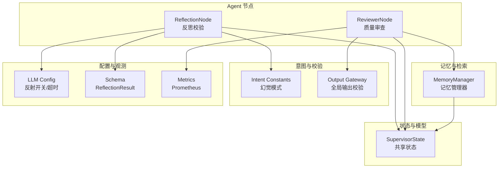
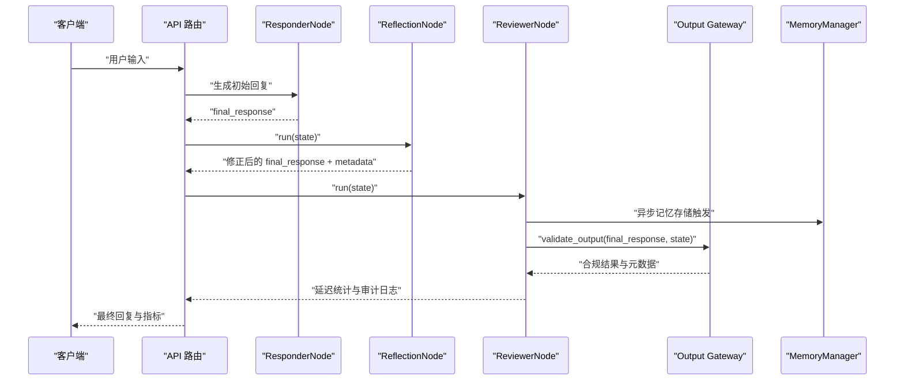
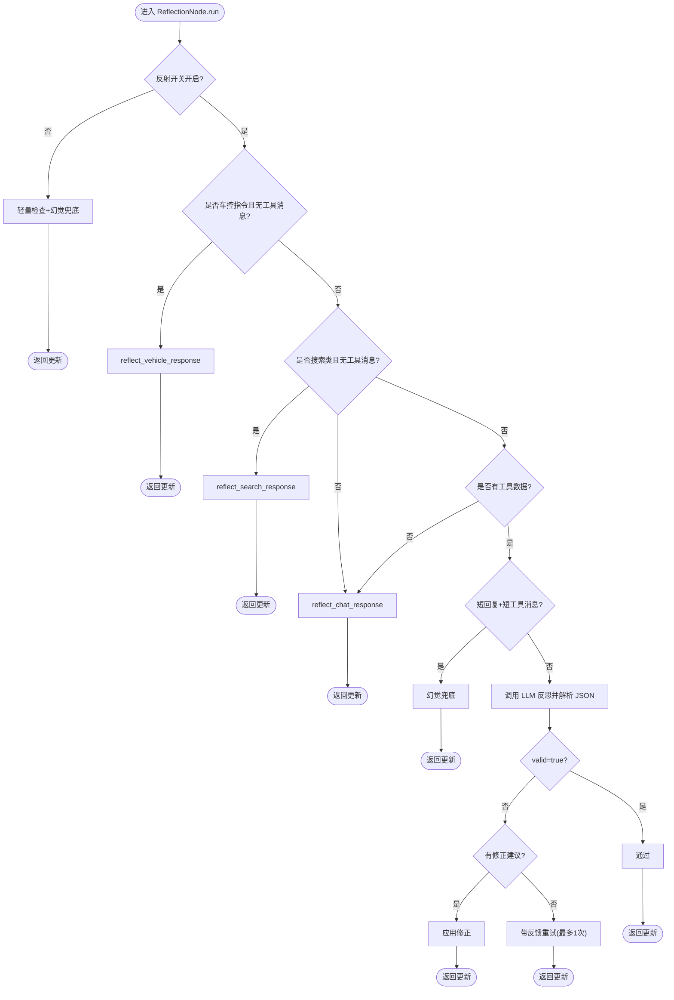
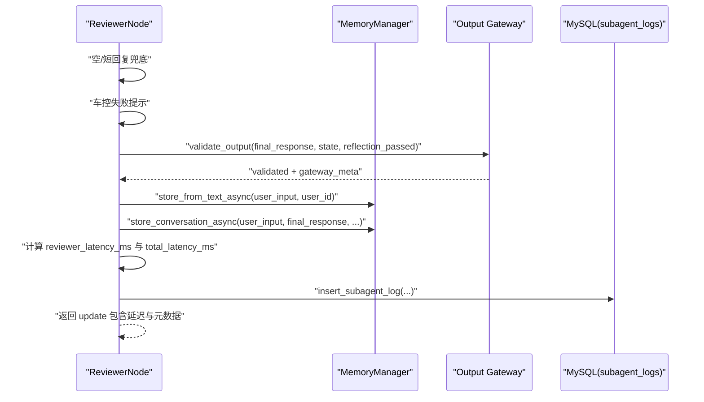
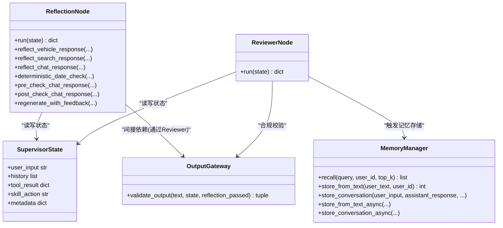

# 反思与审查系统

<cite>
**本文引用的文件**   
- [reflection_node.py](file://backend_design/nexus/agent/nodes/reflection_node.py)
- [reviewer_node.py](file://backend_design/nexus/agent/nodes/reviewer_node.py)
- [reviewer.py](file://backend_design/nexus/agent/reviewer.py)
- [state.py](file://backend_design/nexus/models/state.py)
- [manager.py](file://backend_design/nexus/memory/manager.py)
- [constants.py](file://backend_design/nexus/intent/constants.py)
- [output_gateway.py](file://backend_design/nexus/agent/output_gateway.py)
- [llm.py](file://backend_design/nexus/config/llm.py)
- [schema.py](file://backend_design/nexus/intent/schema.py)
- [metrics.py](file://backend_design/nexus/observability/metrics.py)
</cite>

## 目录
1. [引言](#引言)
2. [项目结构](#项目结构)
3. [核心组件](#核心组件)
4. [架构总览](#架构总览)
5. [详细组件分析](#详细组件分析)
6. [依赖关系分析](#依赖关系分析)
7. [性能考量](#性能考量)
8. [故障排查指南](#故障排查指南)
9. [结论](#结论)
10. [附录](#附录)

## 引言
本技术文档聚焦 NexusCockpit 的“反思与审查”子系统，系统性阐述 ReflectionNode 的三种反思分支机制（预检查聊天响应、后检查聊天响应、确定性日期校验），以及幻觉检测、事实性验证与一致性检查算法；同时说明 ReviewerNode 的质量审查流程、记忆存储机制、延迟统计与元数据收集、性能分析方法。文档还给出反思规则配置、审查阈值调整与自定义检查逻辑的实现指南，覆盖质量保证策略、错误修复机制与调试工具使用。

## 项目结构
反思与审查相关代码主要位于 agent/nodes 与 memory、intent、config、models、observability 等模块中：
- 反思节点：ReflectionNode（多分支反思）
- 审查节点：ReviewerNode（终审、记忆触发、延迟统计、活动日志）
- 状态模型：SupervisorState（共享状态与 reducer）
- 记忆管理：MemoryManager（三元组提取、冲突检测、对话向量化、异步任务）
- 意图常量：HALLUCINATED_HISTORY_PATTERNS（幻觉模式）
- 输出网关：Output Gateway（全局合规校验）
- LLM 配置：反射开关、超时、并发限制等
- Schema 验证：ReflectionResult（Pydantic 结构化解析）
- 指标采集：Prometheus 指标定义

图表来源
- [reflection_node.py:1-789](file://backend_design/nexus/agent/nodes/reflection_node.py#L1-L789)
- [reviewer_node.py:1-184](file://backend_design/nexus/agent/nodes/reviewer_node.py#L1-L184)
- [state.py:1-165](file://backend_design/nexus/models/state.py#L1-L165)
- [manager.py:1-583](file://backend_design/nexus/memory/manager.py#L1-L583)
- [constants.py:1-53](file://backend_design/nexus/intent/constants.py#L1-L53)
- [output_gateway.py:1-195](file://backend_design/nexus/agent/output_gateway.py#L1-L195)
- [llm.py:1-72](file://backend_design/nexus/config/llm.py#L1-L72)
- [schema.py:1-160](file://backend_design/nexus/intent/schema.py#L1-L160)
- [metrics.py:1-108](file://backend_design/nexus/observability/metrics.py#L1-L108)

章节来源
- [reflection_node.py:1-789](file://backend_design/nexus/agent/nodes/reflection_node.py#L1-L789)
- [reviewer_node.py:1-184](file://backend_design/nexus/agent/nodes/reviewer_node.py#L1-L184)
- [state.py:1-165](file://backend_design/nexus/models/state.py#L1-L165)
- [manager.py:1-583](file://backend_design/nexus/memory/manager.py#L1-L583)
- [constants.py:1-53](file://backend_design/nexus/intent/constants.py#L1-L53)
- [output_gateway.py:1-195](file://backend_design/nexus/agent/output_gateway.py#L1-L195)
- [llm.py:1-72](file://backend_design/nexus/config/llm.py#L1-L72)
- [schema.py:1-160](file://backend_design/nexus/intent/schema.py#L1-L160)
- [metrics.py:1-108](file://backend_design/nexus/observability/metrics.py#L1-L108)

## 核心组件
- ReflectionNode：对 Responder 生成的回复进行事实性、一致性、无幻觉与车载场景合规性检查，支持车控轻量校验、搜索类反思、闲聊渐进式 retry，并内置确定性日期校验与快速跳过策略。
- ReviewerNode：五层链路终审关卡，执行空内容兜底、车控失败提示、Output Gateway 合规校验、记忆存储触发、延迟统计与 Agent 活动日志记录。
- MemoryManager：统一记忆管理器，负责从文本提取三元组、冲突检测、双向写入（Milvus + Neo4j）、对话向量化、会话级清理与异步任务回调。
- SupervisorState：TypedDict 共享状态，通过 reducer 自动合并列表与字典字段，贯穿各节点的数据总线。
- Output Gateway：全局输出校验，拦截敏感内容、幻觉模式、长度异常，并对车控失败进行告警标记。
- Intent Constants：集中定义幻觉历史模式，供 ReflectionNode 与 Output Gateway 统一引用。
- LLM Config：反射开关、超时、并发限制、本地/云端切换等关键参数。
- Schema：ReflectionResult Pydantic 模型，用于安全解析 LLM 结构化输出。
- Metrics：Prometheus 指标定义，便于延迟与调用量观测。

章节来源
- [reflection_node.py:1-789](file://backend_design/nexus/agent/nodes/reflection_node.py#L1-L789)
- [reviewer_node.py:1-184](file://backend_design/nexus/agent/nodes/reviewer_node.py#L1-L184)
- [manager.py:1-583](file://backend_design/nexus/memory/manager.py#L1-L583)
- [state.py:1-165](file://backend_design/nexus/models/state.py#L1-L165)
- [output_gateway.py:1-195](file://backend_design/nexus/agent/output_gateway.py#L1-L195)
- [constants.py:1-53](file://backend_design/nexus/intent/constants.py#L1-L53)
- [llm.py:1-72](file://backend_design/nexus/config/llm.py#L1-L72)
- [schema.py:1-160](file://backend_design/nexus/intent/schema.py#L1-L160)
- [metrics.py:1-108](file://backend_design/nexus/observability/metrics.py#L1-L108)

## 架构总览
反思与审查在整体 Agent 流水线中的位置如下：Responder 生成初始回复 → ReflectionNode 多分支反思 → ReviewerNode 终审与记忆存储 → Output Gateway 最终合规校验 → 返回前端。

图表来源
- [reflection_node.py:82-248](file://backend_design/nexus/agent/nodes/reflection_node.py#L82-L248)
- [reviewer_node.py:39-183](file://backend_design/nexus/agent/nodes/reviewer_node.py#L39-L183)
- [output_gateway.py:64-194](file://backend_design/nexus/agent/output_gateway.py#L64-L194)
- [manager.py:336-387](file://backend_design/nexus/memory/manager.py#L336-L387)

## 详细组件分析

### ReflectionNode 反思分支机制
- 主入口 run(state)：根据 skill_action、tool_result、search_context 选择分支；若反射关闭则仅做轻量检查与幻觉兜底；短回复+短工具消息快速跳过；否则调用 LLM 反思并解析 JSON。
- 车控轻量分支 reflect_vehicle_response：确定性校验（非空、失败提及、幻觉兜底），无 LLM 调用。
- 搜索类分支 reflect_search_response：先做确定性日期校验，再注入当前时间与日期对照，调用 LLM 校验基于搜索结果的事实性与时效性。
- 通用闲聊分支 reflect_chat_response：注入时间、对话历史，渐进式校验；短回复含失败关键词快速跳过；不通过且无建议时触发带反馈重试 regenerate_with_feedback。
- 预检查与后检查：pre_check_chat_response 拦截新对话首轮的历史询问；post_check_chat_response 检测无历史时的编造历史模式。
- 确定性日期校验 deterministic_date_check：正则匹配“明天/后天”后的日期，自动修正为正确日期。

图表来源
- [reflection_node.py:82-248](file://backend_design/nexus/agent/nodes/reflection_node.py#L82-L248)
- [reflection_node.py:254-308](file://backend_design/nexus/agent/nodes/reflection_node.py#L254-L308)
- [reflection_node.py:382-485](file://backend_design/nexus/agent/nodes/reflection_node.py#L382-L485)
- [reflection_node.py:512-656](file://backend_design/nexus/agent/nodes/reflection_node.py#L512-L656)
- [reflection_node.py:314-376](file://backend_design/nexus/agent/nodes/reflection_node.py#L314-L376)
- [reflection_node.py:753-788](file://backend_design/nexus/agent/nodes/reflection_node.py#L753-L788)

章节来源
- [reflection_node.py:82-248](file://backend_design/nexus/agent/nodes/reflection_node.py#L82-L248)
- [reflection_node.py:254-308](file://backend_design/nexus/agent/nodes/reflection_node.py#L254-L308)
- [reflection_node.py:382-485](file://backend_design/nexus/agent/nodes/reflection_node.py#L382-L485)
- [reflection_node.py:512-656](file://backend_design/nexus/agent/nodes/reflection_node.py#L512-L656)
- [reflection_node.py:314-376](file://backend_design/nexus/agent/nodes/reflection_node.py#L314-L376)
- [reflection_node.py:753-788](file://backend_design/nexus/agent/nodes/reflection_node.py#L753-L788)

### 幻觉检测、事实性验证与一致性检查算法
- 幻觉检测：
  - 预检查：当用户询问对话历史但无历史记录时，直接返回安全话术。
  - 后检查：无历史状态下，若回复包含“您最初是问/你之前问的是”等模式，判定为幻觉并替换为安全话术。
  - 输出网关：在无历史时扫描 HALLUCINATED_HISTORY_PATTERNS，命中即拦截。
- 事实性验证：
  - 工具反思：将 tool_name、tool_message、tool_data 与 final_response 对比，要求一致且不歪曲数据。
  - 搜索反思：将搜索结果作为真实数据源，校验温度、时间、风速等具体数据是否在搜索结果中出现。
- 一致性检查：
  - 闲聊反思：检查自相矛盾、前后不一致、答非所问、完整性不足等问题。
  - 车控反思：若 expert_results 存在 error，但回复未提及失败，则追加警告信息。

章节来源
- [reflection_node.py:753-788](file://backend_design/nexus/agent/nodes/reflection_node.py#L753-L788)
- [reflection_node.py:82-248](file://backend_design/nexus/agent/nodes/reflection_node.py#L82-L248)
- [reflection_node.py:382-485](file://backend_design/nexus/agent/nodes/reflection_node.py#L382-L485)
- [reflection_node.py:512-656](file://backend_design/nexus/agent/nodes/reflection_node.py#L512-L656)
- [constants.py:46-53](file://backend_design/nexus/intent/constants.py#L46-L53)
- [output_gateway.py:124-140](file://backend_design/nexus/agent/output_gateway.py#L124-L140)

### ReviewerNode 质量审查流程与记忆存储
- 质量检查：空或极短回复填充兜底话术。
- 业务准确性：车控失败但未提及失败时，追加警告信息。
- 合规性校验：调用 Output Gateway 进行全局校验，并根据 reflection_passed 标记结果。
- 记忆存储：触发 MemoryManager 的异步存储（三元组提取与对话向量化）。
- 延迟统计：汇总 supervisor/responder/reviewer 及各子阶段 latency_ms，计算 total_latency_ms。
- 活动日志：记录 intent、experts、skill_action、reflection 结果、延迟与异常标记到 MySQL subagent_logs。

图表来源
- [reviewer_node.py:39-183](file://backend_design/nexus/agent/nodes/reviewer_node.py#L39-L183)
- [manager.py:336-387](file://backend_design/nexus/memory/manager.py#L336-L387)
- [output_gateway.py:64-194](file://backend_design/nexus/agent/output_gateway.py#L64-L194)

章节来源
- [reviewer_node.py:39-183](file://backend_design/nexus/agent/nodes/reviewer_node.py#L39-L183)
- [manager.py:336-387](file://backend_design/nexus/memory/manager.py#L336-L387)
- [output_gateway.py:64-194](file://backend_design/nexus/agent/output_gateway.py#L64-L194)

### 延迟统计、元数据收集与性能分析
- 延迟统计：
  - ReflectionNode：在每个分支结束时记录 reflection_latency_ms。
  - ReviewerNode：汇总 supervisor/responder/reviewer 与各子阶段延迟，计算 total_latency_ms。
- 元数据收集：
  - ReflectionNode：reflection_result、reflection_reason、original_response、reflection_error 等。
  - ReviewerNode：gateway_result、gateway_reason、memory_storage_triggered、conversation_vectorized、is_anomaly 等。
- 性能分析：
  - Prometheus 指标：请求数、延迟直方图、Agent 调用次数与延迟、RAG 召回与延迟、LLM 调用与延迟、活跃连接数等。
  - 快速跳过策略：短回复+短工具消息、失败关键词快速跳过，减少不必要的 LLM 调用。

章节来源
- [reflection_node.py:82-248](file://backend_design/nexus/agent/nodes/reflection_node.py#L82-L248)
- [reviewer_node.py:124-183](file://backend_design/nexus/agent/nodes/reviewer_node.py#L124-L183)
- [metrics.py:1-108](file://backend_design/nexus/observability/metrics.py#L1-L108)

### 反思规则配置、审查阈值与自定义检查逻辑
- 反思开关：REFLECTION_ENABLED（默认开启），关闭时仅做轻量检查与幻觉兜底。
- 超时与并发：LLM timeout、LLM_CONCURRENCY_LIMIT 控制反思调用行为。
- 记忆提取开关：MEMORY_EXTRACTION_ENABLED 控制三元组提取与冲突检测。
- 审查阈值：
  - 短回复快速跳过阈值：_FAST_SKIP_MAX_LEN=100。
  - 失败关键词集合：不可用/无法/失败/错误/不支持/异常/暂时/稍后/繁忙/未连接/离线。
  - 输出长度限制：最大 2000 字符，最小 2 字符。
- 自定义检查逻辑：
  - 扩展 HALLUCINATED_HISTORY_PATTERNS 以增强幻觉检测。
  - 在 ReflectionNode 中添加新的分支或快速跳过条件。
  - 在 Output Gateway 增加敏感词/有害内容模式。

章节来源
- [llm.py:34-36](file://backend_design/nexus/config/llm.py#L34-L36)
- [reflection_node.py:492-510](file://backend_design/nexus/agent/nodes/reflection_node.py#L492-L510)
- [output_gateway.py:58-61](file://backend_design/nexus/agent/output_gateway.py#L58-L61)
- [constants.py:46-53](file://backend_design/nexus/intent/constants.py#L46-L53)

### 质量保证策略、错误修复机制与调试工具
- 质量保证策略：
  - 五层链路闭环校验：确保所有输出经过完整 pipeline。
  - 渐进式披露：根据查询复杂度动态调整召回数量。
  - 三路融合检索：向量+图谱+BM25 + Rerank。
- 错误修复机制：
  - 反思不通过且有建议：直接应用修正回复。
  - 反思不通过且无建议：带反馈重试一次。
  - 车控失败未提及：追加警告信息。
  - 输出过长：按句截断。
- 调试工具：
  - 日志：ReflectionNode 与 ReviewerNode 的详细日志记录。
  - 指标：Prometheus 暴露 /metrics 端点，观察延迟与调用量。
  - 数据库：subagent_logs 记录 Agent 活动与异常标记。

章节来源
- [reflection_node.py:662-727](file://backend_design/nexus/agent/nodes/reflection_node.py#L662-L727)
- [reviewer_node.py:145-183](file://backend_design/nexus/agent/nodes/reviewer_node.py#L145-L183)
- [output_gateway.py:142-163](file://backend_design/nexus/agent/output_gateway.py#L142-L163)
- [metrics.py:1-108](file://backend_design/nexus/observability/metrics.py#L1-L108)

## 依赖关系分析
- ReflectionNode 依赖：
  - NodeContext（chat_model、responder.compressor）
  - SupervisorState（user_input、history、tool_result、skill_action）
  - Intent Constants（HALLUCINATED_HISTORY_PATTERNS）
  - LLM Config（reflection_enabled、timeout、max_tokens）
  - Schema（ReflectionResult）
- ReviewerNode 依赖：
  - NodeContext（memory_manager）
  - Output Gateway（validate_output）
  - SupervisorState（metadata、skill_action、expert_results）
  - Database Manager（subagent_logs）
- MemoryManager 依赖：
  - MilvusVectorStore、Neo4jGraphStore、Reranker、LLM Client
  - ConflictDetector、MemoryExtractor

图表来源
- [reflection_node.py:1-789](file://backend_design/nexus/agent/nodes/reflection_node.py#L1-L789)
- [reviewer_node.py:1-184](file://backend_design/nexus/agent/nodes/reviewer_node.py#L1-L184)
- [manager.py:1-583](file://backend_design/nexus/memory/manager.py#L1-L583)
- [state.py:1-165](file://backend_design/nexus/models/state.py#L1-L165)
- [output_gateway.py:1-195](file://backend_design/nexus/agent/output_gateway.py#L1-L195)

章节来源
- [reflection_node.py:1-789](file://backend_design/nexus/agent/nodes/reflection_node.py#L1-L789)
- [reviewer_node.py:1-184](file://backend_design/nexus/agent/nodes/reviewer_node.py#L1-L184)
- [manager.py:1-583](file://backend_design/nexus/memory/manager.py#L1-L583)
- [state.py:1-165](file://backend_design/nexus/models/state.py#L1-L165)
- [output_gateway.py:1-195](file://backend_design/nexus/agent/output_gateway.py#L1-L195)

## 性能考量
- 快速跳过策略：短回复+短工具消息、失败关键词快速跳过，显著降低 LLM 调用开销。
- 渐进式披露：简单指令减少召回数量，复杂查询深度召回，平衡精度与延迟。
- 异步记忆存储：fire-and-forget 任务避免阻塞主流程，带重试与回调保障可靠性。
- 指标观测：Prometheus 指标提供延迟分布、调用量与资源使用情况，便于容量规划与瓶颈定位。

[本节为通用指导，无需特定文件来源]

## 故障排查指南
- 反射超时：检查 LLM 超时配置与网络状况，关注 reflection_timeout 元数据。
- 解析失败：确认 LLM 输出符合 ReflectionResult schema，检查 parse_reflection_result 返回值。
- 幻觉拦截：查看 blocked_hallucination 元数据，核对 HALLUCINATED_HISTORY_PATTERNS 与历史状态。
- 车控失败未提示：检查 expert_results 与 failure_indicators，确认 ReviewerNode 与 Output Gateway 逻辑。
- 记忆存储失败：查看 store_from_text_async/store_conversation_async 的异常日志与重试情况。

章节来源
- [reflection_node.py:235-242](file://backend_design/nexus/agent/nodes/reflection_node.py#L235-L242)
- [reflection_node.py:472-479](file://backend_design/nexus/agent/nodes/reflection_node.py#L472-L479)
- [reflection_node.py:643-650](file://backend_design/nexus/agent/nodes/reflection_node.py#L643-L650)
- [reviewer_node.py:145-183](file://backend_design/nexus/agent/nodes/reviewer_node.py#L145-L183)
- [manager.py:389-418](file://backend_design/nexus/memory/manager.py#L389-L418)

## 结论
NexusCockpit 的反思与审查系统通过多分支反思、确定性日期校验、幻觉检测与事实性验证，构建了高质量的车载语音助手输出保障体系。ReviewerNode 作为终审关卡，结合 Output Gateway 与记忆存储，形成闭环质量控制。配合完善的延迟统计、元数据收集与指标观测，系统具备良好的可观测性与可扩展性。通过灵活的配置与自定义检查逻辑，可适应不同场景的质量需求。

[本节为总结，无需特定文件来源]

## 附录
- 配置项速查：
  - REFLECTION_ENABLED：反射开关
  - MEMORY_EXTRACTION_ENABLED：记忆提取开关
  - LLM_TIMEOUT：反思调用超时
  - LLM_CONCURRENCY_LIMIT：并发限制
- 元数据键值参考：
  - reflection_result：反思结果（passed/corrected/chat_retried/date_corrected_deterministic 等）
  - gateway_result：网关结果（passed/blocked_sensitive/truncated 等）
  - total_latency_ms：总延迟
- 调试命令：
  - 查看 Prometheus 指标：GET /metrics
  - 查看 subagent_logs：查询 MySQL 表记录

[本节为补充信息，无需特定文件来源]