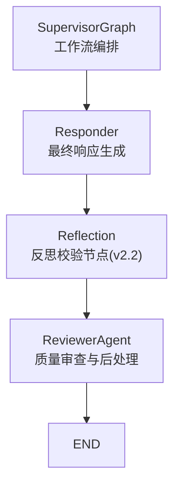
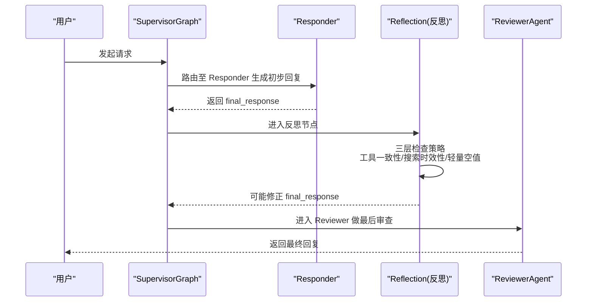
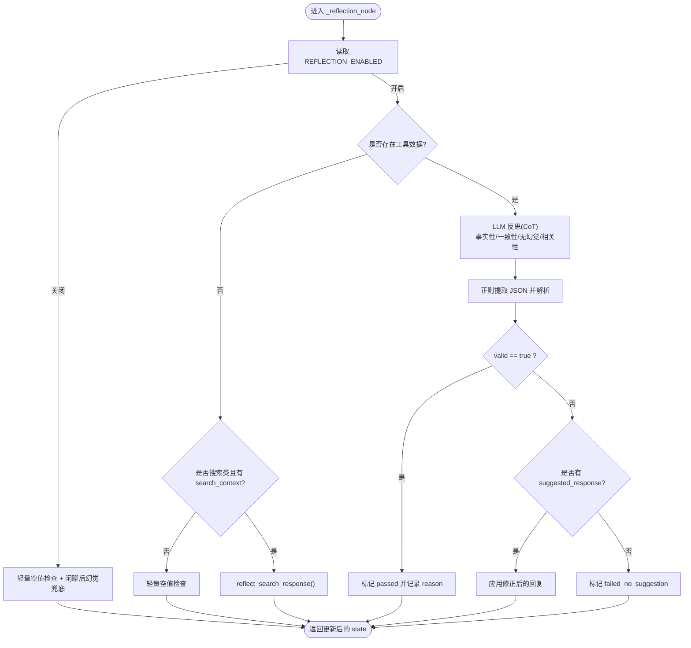
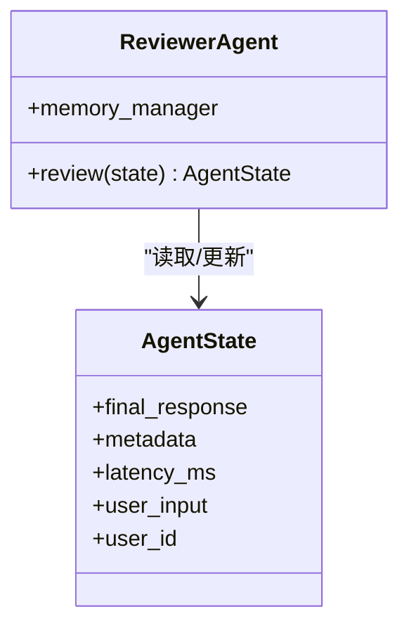
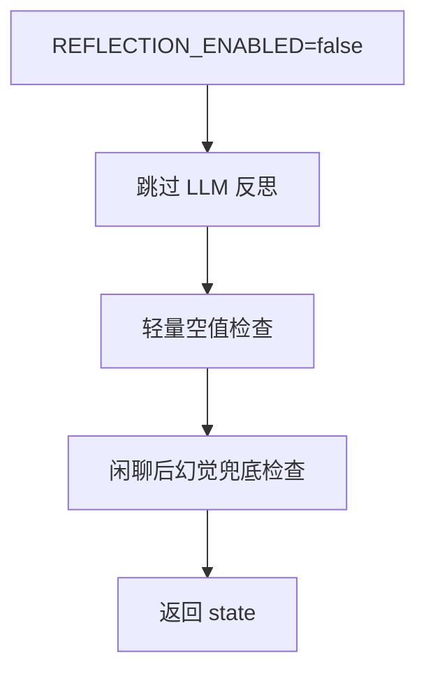
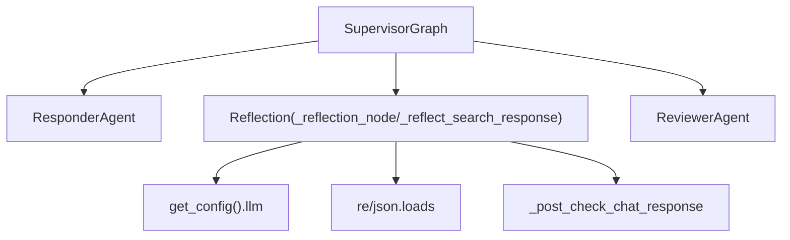

# 反思校验系统

<cite>
**本文引用的文件**
- [supervisor_graph.py](file://backend_design/nexus/agent/supervisor_graph.py)
- [reviewer.py](file://backend_design/nexus/agent/reviewer.py)
- [responder.py](file://backend_design/nexus/agent/responder.py)
- [config.py](file://backend_design/nexus/config.py)
- [circuit_breaker.py](file://backend_design/nexus/core/circuit_breaker.py)
- [degradation-strategy.md](file://docs/architecture/degradation-strategy.md)
</cite>

## 目录
1. [引言](#引言)
2. [项目结构](#项目结构)
3. [核心组件](#核心组件)
4. [架构总览](#架构总览)
5. [详细组件分析](#详细组件分析)
6. [依赖关系分析](#依赖关系分析)
7. [性能与延迟特性](#性能与延迟特性)
8. [故障排查指南](#故障排查指南)
9. [结论](#结论)
10. [附录：扩展新检查规则与修正逻辑](#附录扩展新检查规则与修正逻辑)

## 引言
本技术文档聚焦于“反思校验系统”，系统性阐述 ReviewerAgent 的质量审查机制，以及 v2.2 新增的 Reflection 节点的自我批评能力。重点包括：
- 事实性检查、一致性验证、幻觉检测的实现原理
- CoT 模式的反思流程、JSON 格式结果解析、自动修正机制
- _reflection_node() 方法的三层检查策略（工具数据一致性、搜索结果时效性、轻量空值检查）
- _reflect_search_response() 搜索类专用反思逻辑（数据来源验证、时间相关性检查、编造信息过滤）
- REFLECTION_ENABLED 开关的作用机制与降级策略
- 如何扩展新的检查规则与修正逻辑（以代码片段路径指引）

## 项目结构
反思校验系统位于多智能体工作流编排器中，处于 Responder 之后、Reviewer 之前，形成“生成→反思→审查”的闭环质量保障链路。



图表来源
- [supervisor_graph.py:127-173](file://backend_design/nexus/agent/supervisor_graph.py#L127-L173)
- [reviewer.py:26-79](file://backend_design/nexus/agent/reviewer.py#L26-L79)

章节来源
- [supervisor_graph.py:127-173](file://backend_design/nexus/agent/supervisor_graph.py#L127-L173)
- [reviewer.py:26-79](file://backend_design/nexus/agent/reviewer.py#L26-L79)

## 核心组件
- SupervisorGraph：负责构建 LangGraph 有向图工作流，注册 reflection 节点并串联 responder → reflection → reviewer。
- Reflection 节点（_reflection_node/_reflect_search_response）：对 LLM 输出进行事实性、一致性、无幻觉检查；支持搜索类回复的时效性与数据来源校验；具备 JSON 解析与自动修正能力。
- ReviewerAgent：最后一道质量关卡，执行轻量空值检查、记忆存储触发与延迟统计。

章节来源
- [supervisor_graph.py:127-173](file://backend_design/nexus/agent/supervisor_graph.py#L127-L173)
- [supervisor_graph.py:534-752](file://backend_design/nexus/agent/supervisor_graph.py#L534-L752)
- [reviewer.py:26-79](file://backend_design/nexus/agent/reviewer.py#L26-L79)

## 架构总览
下图展示了从用户输入到最终输出的完整流程，突出反思校验在其中的位置与作用。



图表来源
- [supervisor_graph.py:127-173](file://backend_design/nexus/agent/supervisor_graph.py#L127-L173)
- [supervisor_graph.py:534-752](file://backend_design/nexus/agent/supervisor_graph.py#L534-L752)
- [reviewer.py:26-79](file://backend_design/nexus/agent/reviewer.py#L26-L79)

## 详细组件分析

### 组件一：_reflection_node() 三层检查策略
该方法是反思校验的核心入口，按以下顺序执行：
- 第一层：配置开关与轻量空值检查
  - 若 REFLECTION_ENABLED=false，则跳过所有 LLM 反思，仅做非空与长度阈值检查；同时仍执行“闲聊后校验”的幻觉兜底检查，防止编造对话历史。
- 第二层：搜索类专用反思
  - 若无工具数据但存在搜索结果且技能类型为 web_search，则调用 _reflect_search_response() 进行数据来源与时效性校验。
- 第三层：工具数据一致性反思（CoT 自我批评）
  - 当存在工具返回的真实数据时，构造包含用户问题、工具摘要与结构化数据的提示词，要求模型以 CoT 方式逐条分析事实性、完整性、无幻觉、相关性，并以 JSON 形式返回 valid、reason、suggested_response。
  - 通过正则提取 JSON 块并解析，若 valid=true 则记录通过原因；否则根据 suggested_response 自动修正 final_response，并在 metadata 中标记 reflection_result 为 corrected 或 failed_no_suggestion。



图表来源
- [supervisor_graph.py:534-752](file://backend_design/nexus/agent/supervisor_graph.py#L534-L752)

章节来源
- [supervisor_graph.py:534-752](file://backend_design/nexus/agent/supervisor_graph.py#L534-L752)

### 组件二：_reflect_search_response() 搜索类专用反思逻辑
针对 web_search 场景，该方法确保：
- 数据来源验证：回复中的具体数据（温度、时间、风速等）必须在搜索结果中有对应依据。
- 时效性检查：搜索结果开头标注当前时间，若数据距当前超过一定阈值（如 3 小时），需提示“信息可能不够及时”。
- 编造信息过滤：禁止添加搜索结果中没有的具体信息（如来源网站名、额外建议等）。
- 相关性：直接回答用户问题。

其实现同样采用 CoT 提示词 + JSON 输出规范，并通过正则与 json.loads 解析结果，自动修正不合格回复。

```mermaid
sequenceDiagram
participant X as "Reflection"
participant L as "LLM 客户端"
X->>X : 构造搜索类反思提示词
X->>L : 发送消息(temperature=0.0, max_tokens=500)
L-->>X : 返回文本内容
X->>X : 清理
```json 包裹并正则提取 {}
    X->>X: json.loads 解析为 {valid, reason, suggested_response}
    alt valid == true
        X->>X: 标记 search_passed 并记录 reason
    else valid == false
        alt suggested_response 非空
            X->>X: 应用修正后的回复
        else
            X->>X: 标记 search_failed_no_suggestion
        end
    end
```

图表来源
- [supervisor_graph.py:677-752](file://backend_design/nexus/agent/supervisor_graph.py#L677-L752)

章节来源
- [supervisor_graph.py:677-752](file://backend_design/nexus/agent/supervisor_graph.py#L677-L752)

### 组件三：ReviewerAgent 质量审查与后处理
ReviewerAgent 作为工作流的最后一站，承担：
- 响应质量检查：若 final_response 为空或过短，填充备选回复并标记 reviewer_fallback。
- 记忆存储触发：异步将用户输入与用户 ID 传入 MemoryManager 进行后台存储（v2.2 简化为进程内异步）。
- 延迟统计：汇总 supervisor、responder、reflection、reviewer 各阶段耗时，计算 total_latency_ms。



图表来源
- [reviewer.py:26-79](file://backend_design/nexus/agent/reviewer.py#L26-L79)

章节来源
- [reviewer.py:26-79](file://backend_design/nexus/agent/reviewer.py#L26-L79)

### 组件四：反射开关 REFLECTION_ENABLED 与降级策略
- 作用机制：
  - 当 REFLECTION_ENABLED=false 时，_reflection_node() 跳过所有 LLM 反思，仅执行轻量空值检查与闲聊后幻觉兜底检查，显著减少一次 LLM 调用。
  - 前端管理界面提供 reflection_enabled 热加载开关，便于运行时调整。
- 降级策略：
  - 云端 LLM 不可用时，Responder 可降级到本地 Qwen3.5-4B（llama.cpp OpenAI 兼容接口）。
  - 熔断器 CircuitBreaker 用于保护外部服务调用，避免级联故障扩散。
  - 全局降级策略文档对各模块的降级层级进行了说明。



图表来源
- [supervisor_graph.py:564-582](file://backend_design/nexus/agent/supervisor_graph.py#L564-L582)
- [config.py:124-127](file://backend_design/nexus/config.py#L124-L127)
- [responder.py:189-202](file://backend_design/nexus/agent/responder.py#L189-L202)
- [circuit_breaker.py:47-175](file://backend_design/nexus/core/circuit_breaker.py#L47-L175)
- [degradation-strategy.md:1-88](file://docs/architecture/degradation-strategy.md#L1-L88)

章节来源
- [supervisor_graph.py:564-582](file://backend_design/nexus/agent/supervisor_graph.py#L564-L582)
- [config.py:124-127](file://backend_design/nexus/config.py#L124-L127)
- [responder.py:189-202](file://backend_design/nexus/agent/responder.py#L189-L202)
- [circuit_breaker.py:47-175](file://backend_design/nexus/core/circuit_breaker.py#L47-L175)
- [degradation-strategy.md:1-88](file://docs/architecture/degradation-strategy.md#L1-L88)

## 依赖关系分析
- SupervisorGraph 依赖：
  - ResponderAgent：生成最终回复
  - ReviewerAgent：最终质量审查
  - LLM 客户端：OpenAI 兼容接口，用于反思与合成
  - PromptManager：模板渲染
  - IntentRouterService / MemoryManager / SkillRegistry：意图路由、记忆召回、技能注册
- Reflection 节点内部依赖：
  - 正则表达式与 JSON 解析：用于稳定提取与解析 LLM 输出
  - get_config().llm.reflection_enabled：控制反思开关
  - _post_check_chat_response：闲聊后幻觉兜底检查



图表来源
- [supervisor_graph.py:127-173](file://backend_design/nexus/agent/supervisor_graph.py#L127-L173)
- [supervisor_graph.py:534-752](file://backend_design/nexus/agent/supervisor_graph.py#L534-L752)
- [config.py:124-127](file://backend_design/nexus/config.py#L124-L127)

章节来源
- [supervisor_graph.py:127-173](file://backend_design/nexus/agent/supervisor_graph.py#L127-L173)
- [supervisor_graph.py:534-752](file://backend_design/nexus/agent/supervisor_graph.py#L534-L752)
- [config.py:124-127](file://backend_design/nexus/config.py#L124-L127)

## 性能与延迟特性
- 反思节点会引入额外的 LLM 调用与 JSON 解析开销，可通过 REFLECTION_ENABLED 关闭以减少延迟。
- 搜索类反思与工具数据反思均使用 temperature=0.0 以确保稳定性，max_tokens 限制在合理范围。
- ReviewerAgent 汇总各阶段延迟，便于监控与优化。

[本节为通用性能讨论，不直接分析具体文件]

## 故障排查指南
- 反思失败但无修正建议：
  - 现象：reflection_result 为 failed_no_suggestion 或 search_failed_no_suggestion。
  - 排查：检查 LLM 输出是否包含有效 JSON；确认提示词是否过于严格导致无法给出修正建议。
  - 参考路径：
    - [supervisor_graph.py:656-665](file://backend_design/nexus/agent/supervisor_graph.py#L656-L665)
    - [supervisor_graph.py:736-741](file://backend_design/nexus/agent/supervisor_graph.py#L736-L741)
- 反思被配置禁用：
  - 现象：reflection_result 为 disabled_by_config。
  - 排查：确认 REFLECTION_ENABLED 环境变量设置；必要时在前端管理界面调整。
  - 参考路径：
    - [supervisor_graph.py:564-582](file://backend_design/nexus/agent/supervisor_graph.py#L564-L582)
    - [config.py:124-127](file://backend_design/nexus/config.py#L124-L127)
- 闲聊后幻觉兜底拦截：
  - 现象：reflection_result 为 hallucination_guard。
  - 排查：检查 _post_check_chat_response 的逻辑，确认是否检测到编造历史模式。
  - 参考路径：
    - [supervisor_graph.py:923-944](file://backend_design/nexus/agent/supervisor_graph.py#L923-L944)
- 云端 LLM 不可用时的降级：
  - 现象：Responder 降级到本地模型或返回错误消息。
  - 排查：确认 fallback 配置与熔断器状态。
  - 参考路径：
    - [responder.py:189-202](file://backend_design/nexus/agent/responder.py#L189-L202)
    - [circuit_breaker.py:47-175](file://backend_design/nexus/core/circuit_breaker.py#L47-L175)
    - [degradation-strategy.md:1-88](file://docs/architecture/degradation-strategy.md#L1-L88)

章节来源
- [supervisor_graph.py:564-582](file://backend_design/nexus/agent/supervisor_graph.py#L564-L582)
- [supervisor_graph.py:656-665](file://backend_design/nexus/agent/supervisor_graph.py#L656-L665)
- [supervisor_graph.py:736-741](file://backend_design/nexus/agent/supervisor_graph.py#L736-L741)
- [supervisor_graph.py:923-944](file://backend_design/nexus/agent/supervisor_graph.py#L923-L944)
- [responder.py:189-202](file://backend_design/nexus/agent/responder.py#L189-L202)
- [circuit_breaker.py:47-175](file://backend_design/nexus/core/circuit_breaker.py#L47-L175)
- [degradation-strategy.md:1-88](file://docs/architecture/degradation-strategy.md#L1-L88)

## 结论
反思校验系统在 v2.2 引入了强大的自我批评与自动修正能力，结合三层检查策略与搜索类专用反思逻辑，显著提升了车载语音助手回复的事实性与一致性。配合 REFLECTION_ENABLED 开关与多级降级策略，系统在保证质量的同时兼顾了可用性与性能。

[本节为总结性内容，不直接分析具体文件]

## 附录：扩展新检查规则与修正逻辑
如需扩展新的检查规则与修正逻辑，建议遵循以下步骤：
- 在 _reflection_node() 中添加新的分支判断条件（例如基于特定 skill_action 或元数据标志位）。
- 构造新的反思提示词，明确检查标准与 JSON 输出字段（保持 valid、reason、suggested_response 的一致性）。
- 复用现有的正则提取与 JSON 解析逻辑，确保鲁棒性。
- 在 metadata 中记录新的 reflection_result 状态码，便于观测与排障。
- 若涉及搜索类场景，可在 _reflect_search_response() 中追加相应检查项。

示例路径（不包含具体代码内容）：
- 新增分支与提示词构造：
  - [supervisor_graph.py:534-625](file://backend_design/nexus/agent/supervisor_graph.py#L534-L625)
- JSON 解析与自动修正：
  - [supervisor_graph.py:627-675](file://backend_design/nexus/agent/supervisor_graph.py#L627-L675)
- 搜索类反思扩展点：
  - [supervisor_graph.py:677-752](file://backend_design/nexus/agent/supervisor_graph.py#L677-L752)
- 轻量空值与闲聊后幻觉兜底：
  - [supervisor_graph.py:564-582](file://backend_design/nexus/agent/supervisor_graph.py#L564-582)
  - [supervisor_graph.py:923-944](file://backend_design/nexus/agent/supervisor_graph.py#L923-L944)

章节来源
- [supervisor_graph.py:534-675](file://backend_design/nexus/agent/supervisor_graph.py#L534-L675)
- [supervisor_graph.py:677-752](file://backend_design/nexus/agent/supervisor_graph.py#L677-L752)
- [supervisor_graph.py:564-582](file://backend_design/nexus/agent/supervisor_graph.py#L564-582)
- [supervisor_graph.py:923-944](file://backend_design/nexus/agent/supervisor_graph.py#L923-L944)