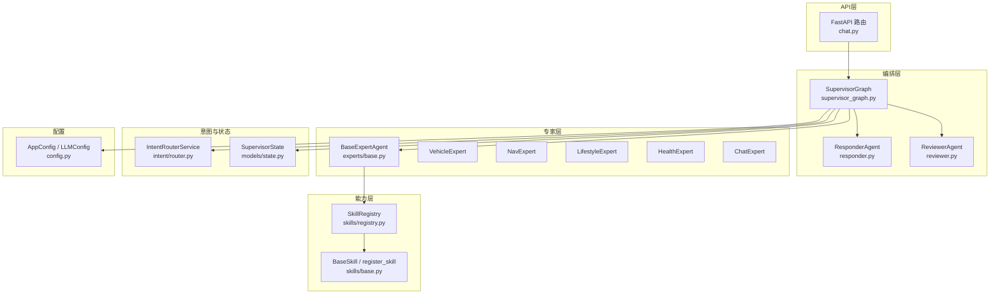
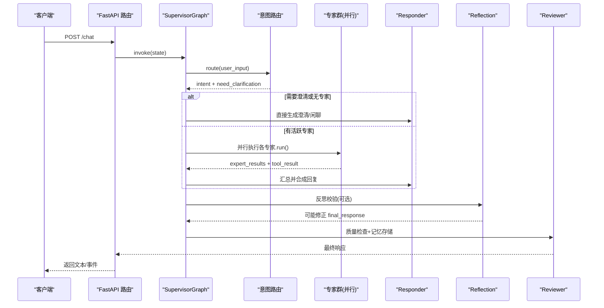
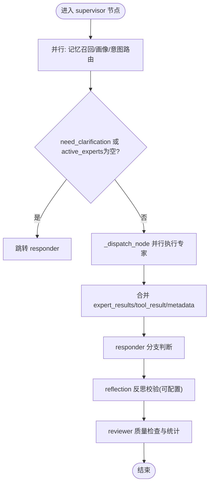
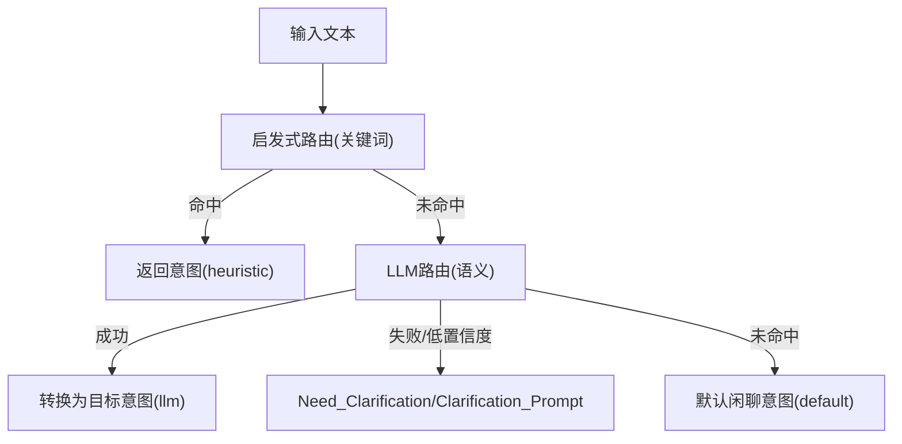
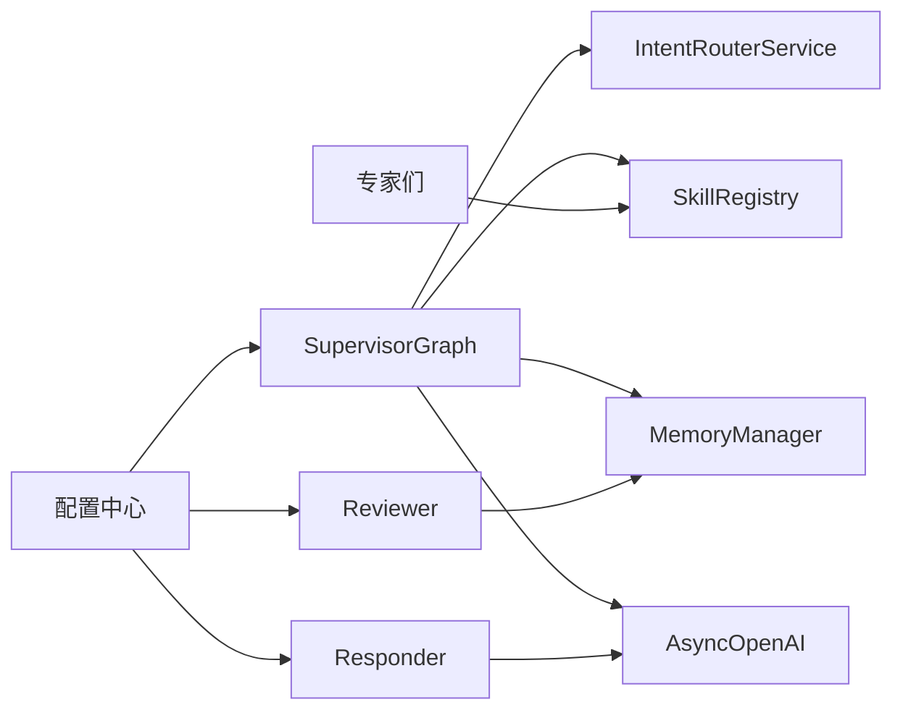

# 多智能体系统

<cite>
**本文引用的文件**   
- [supervisor_graph.py](file://backend_design/nexus/agent/supervisor_graph.py)
- [responder.py](file://backend_design/nexus/agent/responder.py)
- [reviewer.py](file://backend_design/nexus/agent/reviewer.py)
- [base.py](file://backend_design/nexus/agent/experts/base.py)
- [vehicle_expert.py](file://backend_design/nexus/agent/experts/vehicle_expert.py)
- [nav_expert.py](file://backend_design/nexus/agent/experts/nav_expert.py)
- [lifestyle_expert.py](file://backend_design/nexus/agent/experts/lifestyle_expert.py)
- [health_expert.py](file://backend_design/nexus/agent/experts/health_expert.py)
- [chat_expert.py](file://backend_design/nexus/agent/experts/chat_expert.py)
- [router.py](file://backend_design/nexus/intent/router.py)
- [state.py](file://backend_design/nexus/models/state.py)
- [registry.py](file://backend_design/nexus/skills/registry.py)
- [base.py](file://backend_design/nexus/skills/base.py)
- [config.py](file://backend_design/nexus/config.py)
- [chat.py](file://backend_design/nexus/api/routes/chat.py)
</cite>

## 目录
1. [引言](#引言)
2. [项目结构](#项目结构)
3. [核心组件](#核心组件)
4. [架构总览](#架构总览)
5. [详细组件分析](#详细组件分析)
6. [依赖关系分析](#依赖关系分析)
7. [性能与可靠性](#性能与可靠性)
8. [故障排查指南](#故障排查指南)
9. [结论](#结论)
10. [附录：自定义专家开发指南](#附录自定义专家开发指南)

## 引言
本技术文档面向 NexusCockpit 的多智能体系统，聚焦 Supervisor-Expert 架构模式在 v2.0 工作流编排中的实现。内容涵盖意图识别、专家分派、并行执行、结果汇总、反思校验与质量审查的完整流程；详解五大专家（Vehicle、Nav、Lifestyle、Health、Chat）的职责与机制；说明 LangGraph v2.0 的状态管理、条件路由与节点编排；并给出 Responser 聚合器与 Reviewer 质量检查器的作用机制。最后提供自定义专家 Agent 的开发规范、装饰器注册机制、错误处理与重试策略建议，以及最佳实践与示例路径。

## 项目结构
NexusCockpit 后端采用分层与模块化组织方式，多智能体相关代码集中在 backend_design/nexus 下：
- agent：Supervisor 编排、Responder 聚合、Reviewer 质检、专家基类与各专家实现
- intent：意图路由服务（启发式 + LLM）
- models：状态定义（SupervisorState）
- skills：技能基类、注册中心与具体技能
- api：REST/SSE 接口，调用 SupervisorGraph 编排
- config：全局配置（LLM、车控、缓存等）

图表来源
- [chat.py:146-293](file://backend_design/nexus/api/routes/chat.py#L146-L293)
- [supervisor_graph.py:127-173](file://backend_design/nexus/agent/supervisor_graph.py#L127-L173)
- [responder.py:35-109](file://backend_design/nexus/agent/responder.py#L35-L109)
- [reviewer.py:26-78](file://backend_design/nexus/agent/reviewer.py#L26-L78)
- [base.py:26-87](file://backend_design/nexus/agent/experts/base.py#L26-L87)
- [registry.py:35-196](file://backend_design/nexus/skills/registry.py#L35-L196)
- [base.py:28-82](file://backend_design/nexus/skills/base.py#L28-L82)
- [router.py:32-115](file://backend_design/nexus/intent/router.py#L32-L115)
- [state.py:38-101](file://backend_design/nexus/models/state.py#L38-L101)
- [config.py:97-158](file://backend_design/nexus/config.py#L97-L158)

章节来源
- [chat.py:146-293](file://backend_design/nexus/api/routes/chat.py#L146-L293)
- [supervisor_graph.py:127-173](file://backend_design/nexus/agent/supervisor_graph.py#L127-L173)
- [state.py:38-101](file://backend_design/nexus/models/state.py#L38-L101)

## 核心组件
- SupervisorGraph：基于 LangGraph StateGraph 构建的 v2.0 编排器，负责记忆召回、用户画像加载、意图路由、专家分派、条件路由、并行执行、结果汇聚、反思校验与最终输出。
- IntentRouterService：三级路由（启发式 → LLM → 默认闲聊），将自然语言转换为标准意图字典，供 Supervisor 决策。
- BaseExpertAgent + 五大专家：统一专家接口与并行执行封装，按 SkillGroup 划分职责。
- ResponderAgent：聚合专家结果，支持 Tool→LLM 合成、搜索类回复组织、澄清分支与闲聊兜底。
- ReviewerAgent：质量检查、异步记忆存储、延迟统计。
- SkillRegistry + BaseSkill：技能自动发现与执行，提供 Tool Schema 与副作用控制。
- SupervisorState：LangGraph 共享状态，使用 Annotated reducer 合并列表与字典。

章节来源
- [supervisor_graph.py:69-173](file://backend_design/nexus/agent/supervisor_graph.py#L69-L173)
- [router.py:32-115](file://backend_design/nexus/intent/router.py#L32-L115)
- [base.py:26-87](file://backend_design/nexus/agent/experts/base.py#L26-L87)
- [responder.py:35-109](file://backend_design/nexus/agent/responder.py#L35-L109)
- [reviewer.py:26-78](file://backend_design/nexus/agent/reviewer.py#L26-L78)
- [registry.py:35-196](file://backend_design/nexus/skills/registry.py#L35-L196)
- [base.py:28-82](file://backend_design/nexus/skills/base.py#L28-L82)
- [state.py:38-101](file://backend_design/nexus/models/state.py#L38-L101)

## 架构总览
Supervisor-Expert 工作流关键阶段：
- 入口：API 接收请求，构造初始 SupervisorState，进入 SupervisorGraph。
- 意图识别：Supervisor 并行执行记忆召回、用户画像加载、意图路由，得到 active_experts 与澄清标记。
- 条件路由：需要澄清或无活跃专家时直连 Responder；否则进入 dispatch 节点触发并行专家。
- 并行执行：所有活跃专家通过 asyncio.gather 同时运行，返回 partial updates，expert_results 通过 reducer 累加。
- 结果汇总：Responder 根据 skill_handled、tool_result、search_context 选择分支生成最终回复。
- 反思校验：v2.2 新增 reflection 节点，对工具数据与搜索结果进行事实性/一致性/无幻觉检查，必要时修正。
- 质量审查：Reviewer 做空响应兜底、异步记忆存储与总延迟统计。

图表来源
- [chat.py:146-293](file://backend_design/nexus/api/routes/chat.py#L146-L293)
- [supervisor_graph.py:127-173](file://backend_design/nexus/agent/supervisor_graph.py#L127-L173)
- [router.py:78-115](file://backend_design/nexus/intent/router.py#L78-L115)
- [responder.py:66-109](file://backend_design/nexus/agent/responder.py#L66-L109)
- [reviewer.py:36-78](file://backend_design/nexus/agent/reviewer.py#L36-L78)

## 详细组件分析

### SupervisorGraph 编排器
- 图构建：注册 supervisor、5个专家、dispatch、responder、reflection、reviewer 节点，设置入口与边。
- 条件路由：_route_from_supervisor 根据 need_clarification 与 active_experts 决定走 responder 还是 dispatch。
- 并行分派：_dispatch_node 使用 asyncio.gather 并行执行活跃专家，合并 partial updates，维护 expert_results 列表与 metadata。
- 反思校验：_reflection_node 支持关闭开关、搜索类反思、工具数据反思与自动修正。
- 工具→LLM 合成：_synthesize_tool_response 将结构化工具结果回传 LLM 生成自然语言回复，失败降级为原始消息。

图表来源
- [supervisor_graph.py:127-173](file://backend_design/nexus/agent/supervisor_graph.py#L127-L173)
- [supervisor_graph.py:175-182](file://backend_design/nexus/agent/supervisor_graph.py#L175-L182)
- [supervisor_graph.py:326-399](file://backend_design/nexus/agent/supervisor_graph.py#L326-L399)
- [supervisor_graph.py:401-450](file://backend_design/nexus/agent/supervisor_graph.py#L401-L450)
- [supervisor_graph.py:452-532](file://backend_design/nexus/agent/supervisor_graph.py#L452-L532)
- [supervisor_graph.py:534-675](file://backend_design/nexus/agent/supervisor_graph.py#L534-L675)

章节来源
- [supervisor_graph.py:69-173](file://backend_design/nexus/agent/supervisor_graph.py#L69-L173)
- [supervisor_graph.py:175-182](file://backend_design/nexus/agent/supervisor_graph.py#L175-L182)
- [supervisor_graph.py:326-399](file://backend_design/nexus/agent/supervisor_graph.py#L326-L399)
- [supervisor_graph.py:401-450](file://backend_design/nexus/agent/supervisor_graph.py#L401-L450)
- [supervisor_graph.py:452-532](file://backend_design/nexus/agent/supervisor_graph.py#L452-L532)
- [supervisor_graph.py:534-675](file://backend_design/nexus/agent/supervisor_graph.py#L534-L675)

### 意图识别与路由（IntentRouterService）
- 三级策略：启发式规则快速命中常见车控指令；未命中则调用 LLM 语义理解；仍无匹配则默认闲聊。
- 决策转换：将 LLM 的 selected_tool 与 arguments 映射为标准意图字段（如 Climate_Action、Navigation_Action 等）。
- 澄清处理：当 need_clarification 为真或置信度低于阈值时，返回澄清提示。

图表来源
- [router.py:78-115](file://backend_design/nexus/intent/router.py#L78-L115)
- [router.py:136-166](file://backend_design/nexus/intent/router.py#L136-L166)
- [router.py:168-291](file://backend_design/nexus/intent/router.py#L168-L291)

章节来源
- [router.py:32-115](file://backend_design/nexus/intent/router.py#L32-L115)
- [router.py:136-166](file://backend_design/nexus/intent/router.py#L136-L166)
- [router.py:168-291](file://backend_design/nexus/intent/router.py#L168-L291)

### 状态管理（SupervisorState）
- TypedDict 定义，兼容 LangGraph 原生状态模型。
- 使用 Annotated[list, add] 与 Annotated[dict, merge_dict] 实现列表拼接与字典合并，避免并行写入覆盖。
- 关键字段：user_input、intent、active_experts、expert_results、skill_action、skill_handled、search_context、tool_result、history、final_response、metadata、latency_ms。

章节来源
- [state.py:38-101](file://backend_design/nexus/models/state.py#L38-L101)
- [state.py:110-161](file://backend_design/nexus/models/state.py#L110-L161)

### Responder 聚合器
- 分支逻辑：
  - 分支A：需要澄清，直接返回澄清提示。
  - 分支B：技能已处理，优先使用工具返回的自然语言消息；若为 web_search 且存在 search_context，则调用 LLM 组织回答；若存在 tool_result.data，则走 Tool→LLM 合成。
  - 分支C：LLM 闲聊兜底。
- 上下文压缩：ContextCompressor 构建历史摘要，控制长度。
- 降级策略：云端 LLM 失败时降级到本地 LLM（若启用）。

章节来源
- [responder.py:35-109](file://backend_design/nexus/agent/responder.py#L35-L109)
- [responder.py:151-202](file://backend_design/nexus/agent/responder.py#L151-L202)
- [responder.py:204-264](file://backend_design/nexus/agent/responder.py#L204-L264)

### Reviewer 质量检查器
- 质量检查：空响应或过短响应替换为兜底话术。
- 记忆存储：异步触发后台存储对话记忆（进程内异步）。
- 延迟统计：累计各阶段延迟，记录 total_latency_ms。

章节来源
- [reviewer.py:26-78](file://backend_design/nexus/agent/reviewer.py#L26-L78)

### 五大专家 Agent

#### Vehicle 专家（车控）
- 职责：处理空调、车窗、座椅、媒体、车况查询等动作。
- 机制：从 intent 中匹配车控动作键，调用对应 vehicle_* 技能，返回 _build_expert_result。

章节来源
- [vehicle_expert.py:33-63](file://backend_design/nexus/agent/experts/vehicle_expert.py#L33-L63)

#### Nav 专家（导航）
- 职责：目的地设置、路线规划、当前位置查询。
- 机制：过滤 None 值；位置查询时尝试注入缓存 GPS 坐标，提升定位成功率；调用 vehicle_navigation 技能。

章节来源
- [nav_expert.py:27-74](file://backend_design/nexus/agent/experts/nav_expert.py#L27-L74)

#### Lifestyle 专家（生活推荐）
- 职责：联网搜索、外卖点餐、本地生活推荐。
- 机制：优先级顺序：高德 POI 周边搜索 → 联网搜索 → 点餐；分别调用 amap_poi_search、web_search、order_food 技能。

章节来源
- [lifestyle_expert.py:23-78](file://backend_design/nexus/agent/experts/lifestyle_expert.py#L23-L78)

#### Health 专家（车辆健康）
- 职责：故障诊断、故障码翻译、保养建议（Phase 3 知识库接入后生效）。
- 机制：当前骨架实现，检测 diagnose_vehicle 技能是否存在，存在则执行，否则返回未处理。

章节来源
- [health_expert.py:24-53](file://backend_design/nexus/agent/experts/health_expert.py#L24-L53)

#### Chat 专家（闲聊）
- 职责：纯 LLM 闲聊与声纹注册。
- 机制：若 Register_Action 非空，调用 register_voice 技能；否则不标记 handled，交由 Responder 走 LLM 分支。

章节来源
- [chat_expert.py:24-56](file://backend_design/nexus/agent/experts/chat_expert.py#L24-L56)

### 技能注册中心与装饰器
- 装饰器 @register_skill：标记技能类名、分组、副作用与缓存 TTL，写入全局注册表。
- 自动发现：SkillRegistry 初始化扫描 _SKILL_REGISTRY，实例化并注册；兼容旧版手动注册。
- 执行接口：execute(tool_name, arguments) 返回 SkillResult，包含 status、message、data、handled 等。

章节来源
- [base.py:28-82](file://backend_design/nexus/skills/base.py#L28-L82)
- [registry.py:35-196](file://backend_design/nexus/skills/registry.py#L35-L196)

## 依赖关系分析
- 组件耦合：
  - SupervisorGraph 强依赖 IntentRouterService、MemoryManager、SkillRegistry、LLM 客户端。
  - 专家通过 SkillRegistry 间接依赖具体技能实现。
  - Responder 与 Reviewer 复用 v1.0 实现，降低重构成本。
- 外部依赖：
  - OpenAI 兼容 LLM 客户端（云端/本地降级）。
  - 向量库/图谱/缓存（Milvus/Neo4j/Redis）由配置驱动。
  - 车控适配器（HTTP/MCP/Mock）通过 VehicleConfig 切换。

图表来源
- [supervisor_graph.py:83-126](file://backend_design/nexus/agent/supervisor_graph.py#L83-L126)
- [responder.py:43-65](file://backend_design/nexus/agent/responder.py#L43-L65)
- [reviewer.py:33-35](file://backend_design/nexus/agent/reviewer.py#L33-L35)
- [config.py:601-631](file://backend_design/nexus/config.py#L601-L631)

章节来源
- [supervisor_graph.py:83-126](file://backend_design/nexus/agent/supervisor_graph.py#L83-L126)
- [responder.py:43-65](file://backend_design/nexus/agent/responder.py#L43-L65)
- [reviewer.py:33-35](file://backend_design/nexus/agent/reviewer.py#L33-L35)
- [config.py:601-631](file://backend_design/nexus/config.py#L601-L631)

## 性能与可靠性
- 并行优化：Supervisor 内部记忆召回、画像加载、意图路由三任务并行；专家并行执行减少端到端延迟。
- 反射开关：REFLECTION_ENABLED 可关闭以减少一次 LLM 调用，适合限流场景。
- 降级策略：云端 LLM 失败自动降级到本地 LLM；Tool→LLM 合成失败回退原始消息。
- 会话并发锁：同一 session 的请求串行化，防止历史交叉污染。
- 副作用安全：车控等副作用操作禁止语义缓存，避免“命中缓存导致不执行”的安全问题。

章节来源
- [supervisor_graph.py:211-244](file://backend_design/nexus/agent/supervisor_graph.py#L211-L244)
- [supervisor_graph.py:534-582](file://backend_design/nexus/agent/supervisor_graph.py#L534-L582)
- [responder.py:189-202](file://backend_design/nexus/agent/responder.py#L189-L202)
- [chat.py:54-74](file://backend_design/nexus/api/routes/chat.py#L54-L74)
- [chat.py:254-264](file://backend_design/nexus/api/routes/chat.py#L254-L264)

## 故障排查指南
- 意图路由失败：检查启发式规则与 LLM 路由日志，确认 Route_Source 与 Need_Clarification 字段。
- 专家执行异常：查看 expert_results 中的 error 字段与 metadata 中的 *_error 键，定位具体专家。
- 反思校验异常：关注 reflection_result 与 reflection_error，必要时关闭反思开关。
- 工具合成失败：Tool→LLM 合成失败会回退原始消息，检查 tool_message 是否包含失败指示词。
- 会话历史污染：确认 session_id 唯一性与并发锁是否生效，避免 user_id 作为回退键。

章节来源
- [router.py:104-115](file://backend_design/nexus/intent/router.py#L104-L115)
- [supervisor_graph.py:355-365](file://backend_design/nexus/agent/supervisor_graph.py#L355-L365)
- [supervisor_graph.py:666-675](file://backend_design/nexus/agent/supervisor_graph.py#L666-L675)
- [supervisor_graph.py:478-486](file://backend_design/nexus/agent/supervisor_graph.py#L478-L486)
- [chat.py:203-209](file://backend_design/nexus/api/routes/chat.py#L203-L209)

## 结论
NexusCockpit 的多智能体系统以 Supervisor-Expert 为核心，结合 LangGraph v2.0 的状态管理与条件路由，实现了高扩展、高并发的意图识别与任务执行链路。五大专家清晰分工，配合 Responder 聚合与 Reviewer 质检，形成稳定可靠的闭环。反思校验与 Tool→LLM 合成为输出质量提供了额外保障。通过装饰器与注册中心，系统具备良好的可扩展性，便于新增专家与技能。

## 附录：自定义专家开发指南

### 专家基类与接口规范
- 继承 BaseExpertAgent，实现 _execute(state) 方法，返回 partial update 字典。
- 使用 _build_expert_result(action, reply, handled, search_context, skill_data=...) 标准化输出。
- 若需 Tool→LLM 合成，确保 handled=True 并提供 skill_data 或 reply。

章节来源
- [base.py:26-87](file://backend_design/nexus/agent/experts/base.py#L26-L87)
- [base.py:89-133](file://backend_design/nexus/agent/experts/base.py#L89-L133)

### 装饰器注册机制（技能侧）
- 使用 @register_skill(name, group, has_side_effect, cache_ttl) 装饰技能类，自动注册到全局表。
- 在 SkillRegistry 初始化时自动发现并实例化，无需硬编码。

章节来源
- [base.py:43-82](file://backend_design/nexus/skills/base.py#L43-L82)
- [registry.py:63-76](file://backend_design/nexus/skills/registry.py#L63-L76)

### 错误处理与重试策略建议
- 专家层：捕获异常并记录 metadata 中的错误信息，保证主流程不被中断。
- 工具调用：SkillRegistry.execute 统一捕获异常并返回错误结果，上层可根据 handled 与 status 判断。
- 重试策略：建议在调用外部服务（地图/搜索/车控）时增加指数退避与熔断保护，参考 circuit_breaker 模块。

章节来源
- [base.py:76-83](file://backend_design/nexus/agent/experts/base.py#L76-L83)
- [registry.py:171-196](file://backend_design/nexus/skills/registry.py#L171-L196)

### 实际代码示例路径
- 车控专家示例：[vehicle_expert.py:33-63](file://backend_design/nexus/agent/experts/vehicle_expert.py#L33-L63)
- 导航专家示例：[nav_expert.py:27-74](file://backend_design/nexus/agent/experts/nav_expert.py#L27-L74)
- 生活专家示例：[lifestyle_expert.py:23-78](file://backend_design/nexus/agent/experts/lifestyle_expert.py#L23-L78)
- 健康专家骨架：[health_expert.py:24-53](file://backend_design/nexus/agent/experts/health_expert.py#L24-L53)
- 闲聊专家示例：[chat_expert.py:24-56](file://backend_design/nexus/agent/experts/chat_expert.py#L24-L56)
- 技能装饰器用法：[base.py:43-82](file://backend_design/nexus/skills/base.py#L43-L82)

### 最佳实践
- 明确专家边界：每个专家只处理一类意图，避免职责重叠。
- 谨慎使用副作用：车控等操作标记 has_side_effect=True，禁止缓存。
- 合理设置温度与最大 token：合成与反思时使用较低温度确保事实准确性。
- 监控与可观测：利用 metadata 记录各阶段耗时与错误，结合 Langfuse 追踪链路。