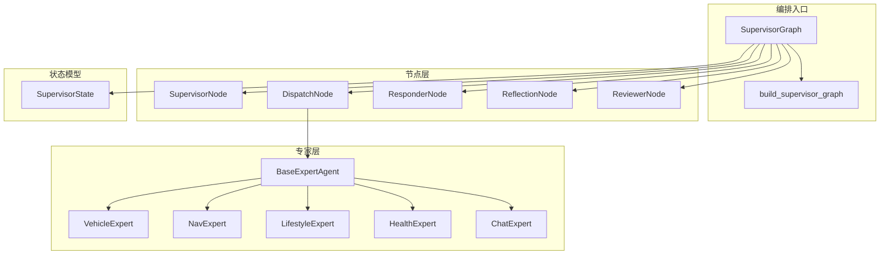
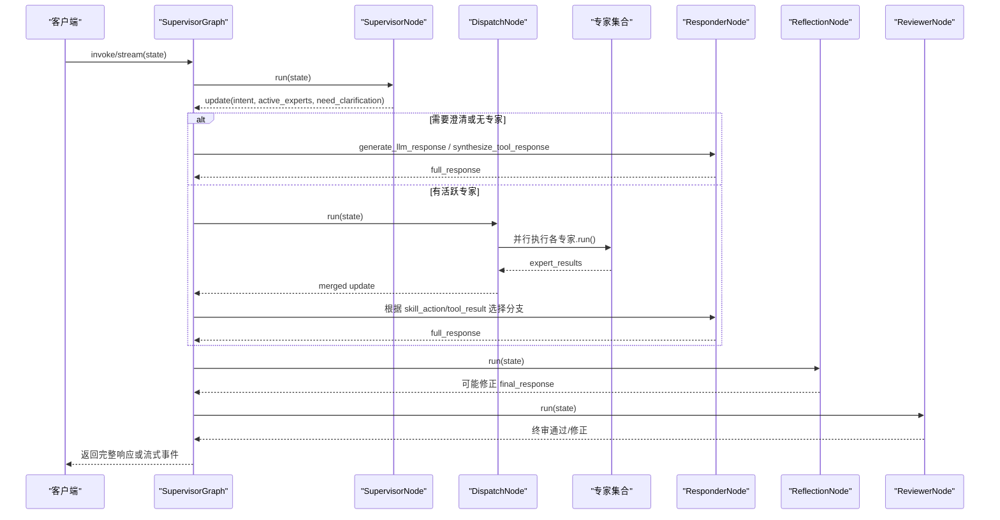
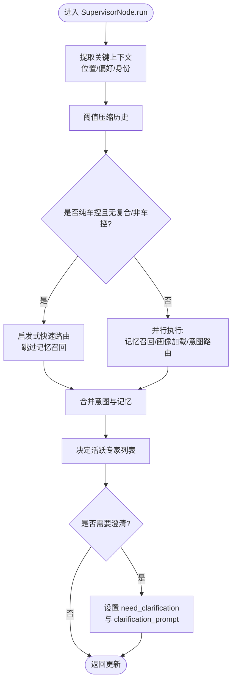
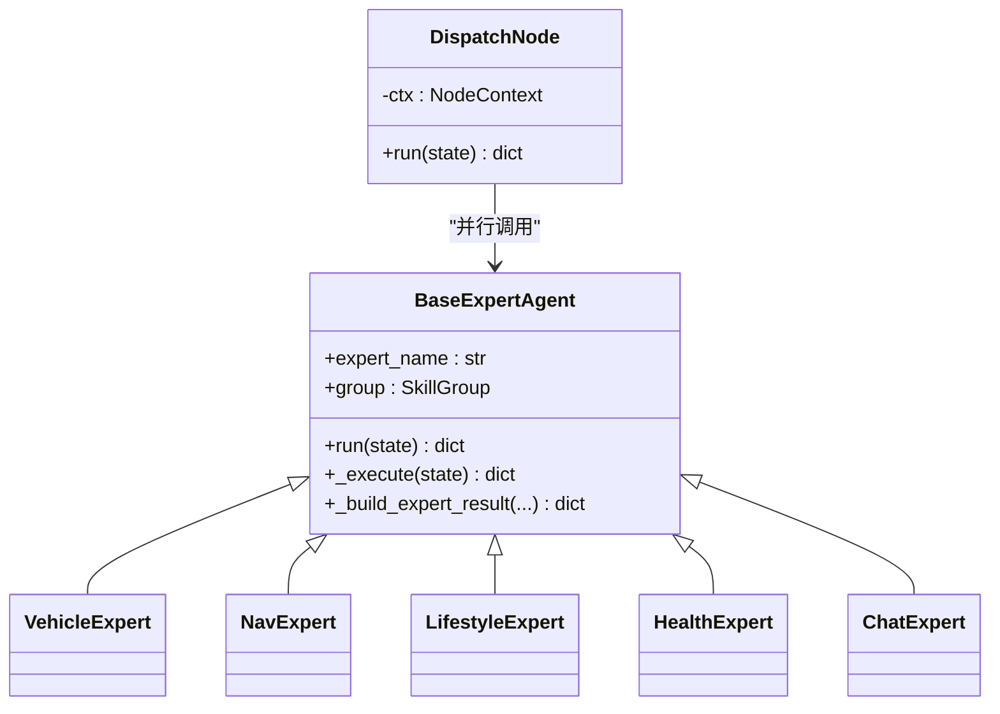
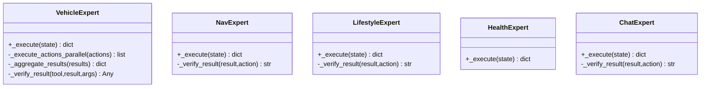
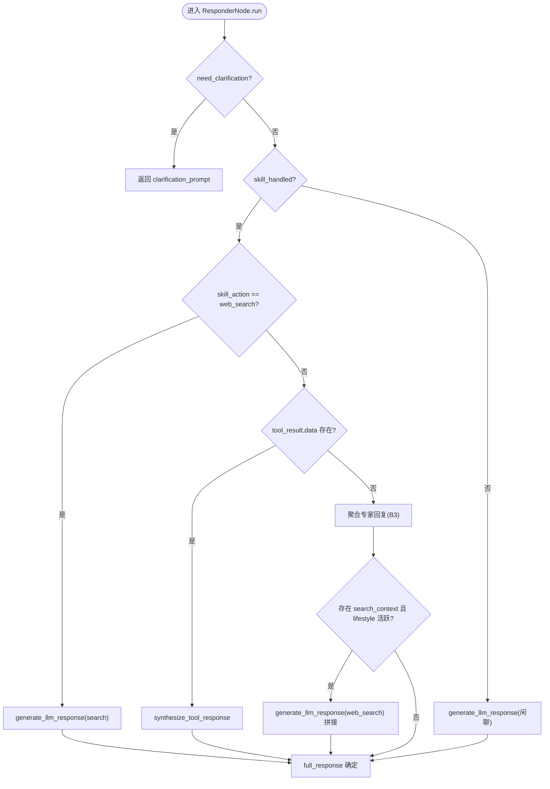
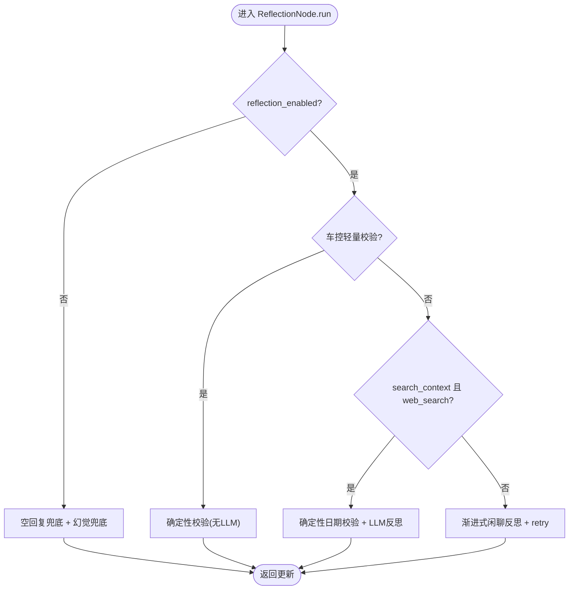
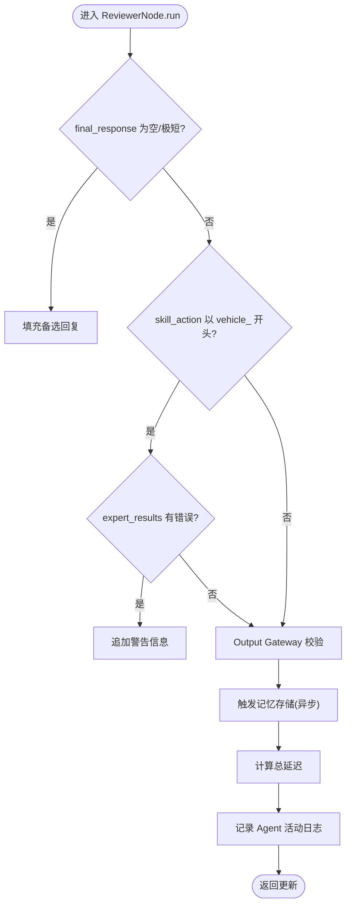
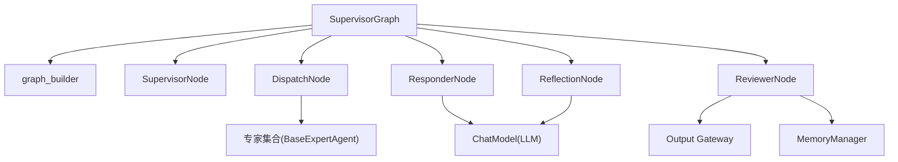

# 多智能体系统

<cite>
**本文引用的文件**   
- [graph_builder.py](file://backend_design/nexus/agent/graph_builder.py)
- [supervisor_graph.py](file://backend_design/nexus/agent/supervisor_graph.py)
- [base.py](file://backend_design/nexus/agent/experts/base.py)
- [vehicle_expert.py](file://backend_design/nexus/agent/experts/vehicle_expert.py)
- [nav_expert.py](file://backend_design/nexus/agent/experts/nav_expert.py)
- [lifestyle_expert.py](file://backend_design/nexus/agent/experts/lifestyle_expert.py)
- [health_expert.py](file://backend_design/nexus/agent/experts/health_expert.py)
- [chat_expert.py](file://backend_design/nexus/agent/experts/chat_expert.py)
- [dispatch_node.py](file://backend_design/nexus/agent/nodes/dispatch_node.py)
- [responder_node.py](file://backend_design/nexus/agent/nodes/responder_node.py)
- [reflection_node.py](file://backend_design/nexus/agent/nodes/reflection_node.py)
- [reviewer_node.py](file://backend_design/nexus/agent/nodes/reviewer_node.py)
- [state.py](file://backend_design/nexus/models/state.py)
</cite>

## 目录
1. [引言](#引言)
2. [项目结构](#项目结构)
3. [核心组件](#核心组件)
4. [架构总览](#架构总览)
5. [详细组件分析](#详细组件分析)
6. [依赖关系分析](#依赖关系分析)
7. [性能考量](#性能考量)
8. [故障排查指南](#故障排查指南)
9. [结论](#结论)
10. [附录](#附录)

## 引言
本技术文档面向 NexusCockpit Multi-Agent 系统，围绕 LangGraph 编排框架与有状态图工作流设计展开，深入解析 Supervisor 调度器的意图识别与任务分派机制、五大专家 Agent（车辆、导航、生活、健康、聊天）的职责分工与并行策略、Responder 响应器的结果汇总与流式输出、Reflection 反思器与 Reviewer 审查器的质量保证流程。同时涵盖 Agent 状态管理、上下文传递、错误恢复机制，并提供扩展新专家与工作流的实践指引、Agent 间通信协议、性能调优与调试技巧。

## 项目结构
NexusCockpit 的多智能体子系统位于 backend_design/nexus/agent 目录，采用“节点+专家”的解耦设计：
- 编排入口：SupervisorGraph 负责构建并运行 LangGraph StateGraph，暴露同步 invoke 与流式 stream/stream_with_events 接口。
- 图构建：graph_builder 负责注册节点、边连接与编译。
- 节点层：SupervisorNode、DispatchNode、ResponderNode、ReflectionNode、ReviewerNode 分别承担记忆路由、并行分派、回复生成、质量反思与终审校验。
- 专家层：BaseExpertAgent 抽象基类 + 五个具体专家实现，通过 SkillRegistry 调用技能。
- 状态模型：SupervisorState 定义共享状态与 reducer 合并策略。

```mermaid
graph TB
subgraph "编排入口"
SG["SupervisorGraph"]
GB["build_supervisor_graph"]
end
subgraph "节点层"
SN["SupervisorNode"]
DN["DispatchNode"]
RN["ResponderNode"]
RF["ReflectionNode"]
RV["ReviewerNode"]
end
subgraph "专家层"
BE["BaseExpertAgent"]
VE["VehicleExpert"]
NE["NavExpert"]
LE["LifestyleExpert"]
HE["HealthExpert"]
CE["ChatExpert"]
end
subgraph "状态模型"
SS["SupervisorState"]
end
SG --> GB
SG --> SN
SG --> DN
SG --> RN
SG --> RF
SG --> RV
DN --> BE
BE --> VE
BE --> NE
BE --> LE
BE --> HE
BE --> CE
SG --> SS
```

**图表来源** 
- [supervisor_graph.py:93-179](file://backend_design/nexus/agent/supervisor_graph.py#L93-L179)
- [graph_builder.py:40-119](file://backend_design/nexus/agent/graph_builder.py#L40-L119)
- [state.py:38-165](file://backend_design/nexus/models/state.py#L38-L165)

**章节来源**
- [supervisor_graph.py:93-179](file://backend_design/nexus/agent/supervisor_graph.py#L93-L179)
- [graph_builder.py:40-119](file://backend_design/nexus/agent/graph_builder.py#L40-L119)
- [state.py:38-165](file://backend_design/nexus/models/state.py#L38-L165)

## 核心组件
- SupervisorGraph：编排入口，初始化 NodeContext 共享依赖容器，构建 LangGraph 图，提供 invoke、stream、stream_with_events 三种调用模式。
- graph_builder：集中注册节点与边，设置入口点，支持 checkpoint 持久化。
- SupervisorNode：记忆召回、用户画像加载、意图路由、快速路径优化、专家分派决策与澄清判断。
- DispatchNode：基于 asyncio.gather 并行执行活跃专家，聚合 partial updates。
- ResponderNode：按分支选择回复策略（澄清/工具合成/LLM闲聊），构建 System Prompt，注入位置/画像/习惯/关键上下文，支持流式与非流式 LLM 调用。
- ReflectionNode：对 LLM 输出进行事实性/一致性/无幻觉/车载合规检查，含确定性日期校验与渐进式 retry。
- ReviewerNode：终审强校验、记忆存储触发、延迟统计、Agent 活动日志记录。
- BaseExpertAgent：专家抽象，统一 run/_execute 接口与 _build_expert_result 输出格式。
- 五大专家：Vehicle、Navigation、Lifestyle、Health、Chat，各自封装领域技能与验证逻辑。
- SupervisorState：TypedDict 状态模型，使用 Annotated 与 reducer 自动合并列表与字典字段。

**章节来源**
- [supervisor_graph.py:93-179](file://backend_design/nexus/agent/supervisor_graph.py#L93-L179)
- [graph_builder.py:40-119](file://backend_design/nexus/agent/graph_builder.py#L40-L119)
- [supervisor_node.py:40-331](file://backend_design/nexus/agent/nodes/supervisor_node.py#L40-L331)
- [dispatch_node.py:25-140](file://backend_design/nexus/agent/nodes/dispatch_node.py#L25-L140)
- [responder_node.py:34-174](file://backend_design/nexus/agent/nodes/responder_node.py#L34-L174)
- [reflection_node.py:46-248](file://backend_design/nexus/agent/nodes/reflection_node.py#L46-L248)
- [reviewer_node.py:26-184](file://backend_design/nexus/agent/nodes/reviewer_node.py#L26-L184)
- [base.py:26-140](file://backend_design/nexus/agent/experts/base.py#L26-L140)
- [state.py:38-165](file://backend_design/nexus/models/state.py#L38-L165)

## 架构总览
LangGraph 有状态图工作流由 SupervisorGraph 构建，节点顺序为 supervisor → dispatch → responder → reflection → reviewer → END。专家节点虽注册到图中，但实际并行调用由 DispatchNode 内部 asyncio.gather 完成，不通过图边触发。

```mermaid
sequenceDiagram
participant Client as "客户端"
participant SG as "SupervisorGraph"
participant SN as "SupervisorNode"
participant DN as "DispatchNode"
participant EXP as "专家集合"
participant RN as "ResponderNode"
participant RF as "ReflectionNode"
participant RV as "ReviewerNode"
Client->>SG : invoke/stream(state)
SG->>SN : run(state)
SN-->>SG : update(intent, active_experts, need_clarification)
alt 需要澄清或无专家
SG->>RN : generate_llm_response / synthesize_tool_response
RN-->>SG : full_response
else 有活跃专家
SG->>DN : run(state)
DN->>EXP : 并行执行各专家.run()
EXP-->>DN : expert_results
DN-->>SG : merged update
SG->>RN : 根据 skill_action/tool_result 选择分支
RN-->>SG : full_response
end
SG->>RF : run(state)
RF-->>SG : 可能修正 final_response
SG->>RV : run(state)
RV-->>SG : 终审通过/修正
SG-->>Client : 返回完整响应或流式事件
```

**图表来源** 
- [supervisor_graph.py:183-617](file://backend_design/nexus/agent/supervisor_graph.py#L183-L617)
- [graph_builder.py:40-119](file://backend_design/nexus/agent/graph_builder.py#L40-L119)

**章节来源**
- [supervisor_graph.py:183-617](file://backend_design/nexus/agent/supervisor_graph.py#L183-L617)
- [graph_builder.py:40-119](file://backend_design/nexus/agent/graph_builder.py#L40-L119)

## 详细组件分析

### Supervisor 调度器（意图识别与任务分派）
- 记忆召回与用户画像加载：通过 MemoryManager 与 Neo4j/MySQL 获取长期记忆与用户画像；支持查询增强（结合 key_context）。
- 快速路径优化：纯车控指令跳过记忆召回与 RAG，显著降低延迟。
- 混合意图检测：当车控与非车控意图同时出现时，不走快速路径，确保非车控部分可回答。
- 专家分派决策：根据意图键映射到 vehicle/navigation/lifestyle/health/chat，包含防漂移与二次重路由。
- 澄清判断：Need_Clarification 为真时直连 Responder。

```mermaid
flowchart TD
Start(["进入 SupervisorNode.run"]) --> ExtractKeyCtx["提取关键上下文<br/>位置/偏好/身份"]
ExtractKeyCtx --> ThresholdCompress["阈值压缩历史"]
ThresholdCompress --> QuickPath{"是否纯车控且无复合/非车控?"}
QuickPath --> |是| FastRoute["启发式快速路由<br/>跳过记忆召回"]
QuickPath --> |否| ParallelTasks["并行执行:<br/>记忆召回/画像加载/意图路由"]
FastRoute --> MergeIntent["合并意图与记忆"]
ParallelTasks --> MergeIntent
MergeIntent --> DecideExperts["决定活跃专家列表"]
DecideExperts --> ClarifyCheck{"是否需要澄清?"}
ClarifyCheck --> |是| SetClarify["设置 need_clarification<br/>与 clarification_prompt"]
ClarifyCheck --> |否| Done(["返回更新"])
SetClarify --> Done
```

**图表来源** 
- [supervisor_node.py:64-331](file://backend_design/nexus/agent/nodes/supervisor_node.py#L64-L331)

**章节来源**
- [supervisor_node.py:64-331](file://backend_design/nexus/agent/nodes/supervisor_node.py#L64-L331)

### 专家并行分派（DispatchNode）
- 使用 asyncio.gather 并行执行所有活跃专家的 run() 方法。
- 合并 partial updates：expert_results 累加，skill_action/skill_handled/search_context 合并，tool_result 列表收集避免覆盖。
- 异常处理：捕获专家异常并记录 error 信息。

```mermaid
classDiagram
class DispatchNode {
-ctx : NodeContext
+run(state) dict
}
class BaseExpertAgent {
+expert_name : str
+group : SkillGroup
+run(state) dict
+_execute(state) dict
+_build_expert_result(...) dict
}
class VehicleExpert
class NavExpert
class LifestyleExpert
class HealthExpert
class ChatExpert
DispatchNode --> BaseExpertAgent : "并行调用"
BaseExpertAgent <|-- VehicleExpert
BaseExpertAgent <|-- NavExpert
BaseExpertAgent <|-- LifestyleExpert
BaseExpertAgent <|-- HealthExpert
BaseExpertAgent <|-- ChatExpert
```

**图表来源** 
- [dispatch_node.py:25-140](file://backend_design/nexus/agent/nodes/dispatch_node.py#L25-L140)
- [base.py:26-140](file://backend_design/nexus/agent/experts/base.py#L26-L140)

**章节来源**
- [dispatch_node.py:25-140](file://backend_design/nexus/agent/nodes/dispatch_node.py#L25-L140)
- [base.py:26-140](file://backend_design/nexus/agent/experts/base.py#L26-L140)

### 五大专家职责与并行策略
- VehicleExpert：车控动作（空调/车窗/座椅/媒体/状态）多动作并行执行，互斥组内串行避免冲突；沙箱安全审查与结果验证。
- NavExpert：导航目的地设置、路线规划、当前位置查询；缓存 GPS 坐标避免 IP 定位超时。
- LifestyleExpert：联网搜索、外卖点餐、本地推荐；天气与搜索互斥，原子任务并行执行。
- HealthExpert：故障诊断、故障码翻译、保养建议；按 skill 路由到对应技能。
- ChatExpert：声纹注册与纯 LLM 闲聊；闲聊不标记 handled，交由 Responder 走 LLM 分支。

```mermaid
classDiagram
class VehicleExpert {
+_execute(state) dict
-_execute_actions_parallel(actions) list
-_aggregate_results(results) dict
-_verify_result(tool,result,args) Any
}
class NavExpert {
+_execute(state) dict
-_verify_result(result,action) str
}
class LifestyleExpert {
+_execute(state) dict
-_verify_result(result,action) str
}
class HealthExpert {
+_execute(state) dict
}
class ChatExpert {
+_execute(state) dict
-_verify_result(result,action) str
}
```

**图表来源** 
- [vehicle_expert.py:43-428](file://backend_design/nexus/agent/experts/vehicle_expert.py#L43-L428)
- [nav_expert.py:26-98](file://backend_design/nexus/agent/experts/nav_expert.py#L26-L98)
- [lifestyle_expert.py:24-256](file://backend_design/nexus/agent/experts/lifestyle_expert.py#L24-L256)
- [health_expert.py:24-74](file://backend_design/nexus/agent/experts/health_expert.py#L24-L74)
- [chat_expert.py:24-71](file://backend_design/nexus/agent/experts/chat_expert.py#L24-L71)

**章节来源**
- [vehicle_expert.py:43-428](file://backend_design/nexus/agent/experts/vehicle_expert.py#L43-L428)
- [nav_expert.py:26-98](file://backend_design/nexus/agent/experts/nav_expert.py#L26-L98)
- [lifestyle_expert.py:24-256](file://backend_design/nexus/agent/experts/lifestyle_expert.py#L24-L256)
- [health_expert.py:24-74](file://backend_design/nexus/agent/experts/health_expert.py#L24-L74)
- [chat_expert.py:24-71](file://backend_design/nexus/agent/experts/chat_expert.py#L24-L71)

### Responder 响应器（结果汇总与流式输出）
- 分支策略：
  - A：澄清直接返回 clarification_prompt。
  - B1：搜索类技能用专用 search 提示词生成。
  - B2：工具结构化数据 → Tool→LLM 合成。
  - B3：简单车控指令 → 聚合所有专家回复。
  - B5：复合查询混合 → 车控回复 + LLM 合成搜索结果拼接。
  - C：LLM 闲聊兜底。
- System Prompt 构建：注入用户画像、记忆、习惯、位置状态、关键上下文；搜索类提示词注入时间约束防止日期混淆。
- 流式与非流式 LLM 调用：支持 ainvoke 与 astream，失败时降级返回原始工具消息或搜索结果。

```mermaid
flowchart TD
Start(["进入 ResponderNode.run"]) --> BranchA{"need_clarification?"}
BranchA --> |是| ReturnClarify["返回 clarification_prompt"]
BranchA --> |否| BranchB{"skill_handled?"}
BranchB --> |是| CheckAction{"skill_action == web_search?"}
CheckAction --> |是| GenSearch["generate_llm_response(search)"]
CheckAction --> |否| CheckTool{"tool_result.data 存在?"}
CheckTool --> |是| Synthesize["synthesize_tool_response"]
CheckTool --> |否| Aggregate["聚合专家回复(B3)"]
Aggregate --> MixedCheck{"存在 search_context 且 lifestyle 活跃?"}
MixedCheck --> |是| GenSearch2["generate_llm_response(web_search) 拼接"]
MixedCheck --> |否| DoneResp["full_response 确定"]
BranchB --> |否| GenChat["generate_llm_response(闲聊)"]
GenSearch --> DoneResp
Synthesize --> DoneResp
GenSearch2 --> DoneResp
GenChat --> DoneResp
```

**图表来源** 
- [responder_node.py:57-174](file://backend_design/nexus/agent/nodes/responder_node.py#L57-L174)

**章节来源**
- [responder_node.py:57-174](file://backend_design/nexus/agent/nodes/responder_node.py#L57-L174)

### Reflection 反思器（质量保证流程）
- 车控轻量校验：确定性检查无 LLM 调用，混合场景例外走完整 LLM 反思。
- 搜索类反思：确定性日期校验 + LLM 校验基于搜索结果无幻觉、时效性正确。
- 通用闲聊反思：渐进式校验（首次反思 → 采纳修正建议 → 带反馈 retry），检查相关性/准确性/一致性/完整性/无幻觉。
- 预校验与后校验：拦截无历史+无摘要时用户询问对话历史的场景；检测编造对话历史模式并覆盖安全回复。

```mermaid
flowchart TD
Start(["进入 ReflectionNode.run"]) --> ConfigCheck{"reflection_enabled?"}
ConfigCheck --> |否| FallbackGuard["空回复兜底 + 幻觉兜底"]
ConfigCheck --> |是| VehicleFast{"车控轻量校验?"}
VehicleFast --> |是| VehicleReflect["确定性校验(无LLM)"]
VehicleFast --> |否| SearchCheck{"search_context 且 web_search?"}
SearchCheck --> |是| SearchReflect["确定性日期校验 + LLM反思"]
SearchCheck --> |否| ChatReflect["渐进式闲聊反思 + retry"]
FallbackGuard --> End(["返回更新"])
VehicleReflect --> End
SearchReflect --> End
ChatReflect --> End
```

**图表来源** 
- [reflection_node.py:81-248](file://backend_design/nexus/agent/nodes/reflection_node.py#L81-L248)

**章节来源**
- [reflection_node.py:81-248](file://backend_design/nexus/agent/nodes/reflection_node.py#L81-L248)

### Reviewer 审查器（终审强校验）
- 响应质量检查：空内容/极短内容填充备选回复。
- 业务准确性校验：车控指令回复必须包含执行状态。
- 合规性校验：通过 Output Gateway 做最终全局校验。
- 记忆存储触发：后台异步存储三元组与对话向量化。
- 延迟统计与活动日志：计算总耗时，记录 MySQL subagent_logs。

```mermaid
flowchart TD
Start(["进入 ReviewerNode.run"]) --> QualityCheck{"final_response 为空/极短?"}
QualityCheck --> |是| Fallback["填充备选回复"]
QualityCheck --> |否| VehicleCheck{"skill_action 以 vehicle_ 开头?"}
VehicleCheck --> |是| ErrorGuard{"expert_results 有错误?"}
ErrorGuard --> |是| AppendWarn["追加警告信息"]
ErrorGuard --> |否| Gateway["Output Gateway 校验"]
VehicleCheck --> |否| Gateway
Gateway --> MemoryStore["触发记忆存储(异步)"]
MemoryStore --> LatencyCalc["计算总延迟"]
LatencyCalc --> LogActivity["记录 Agent 活动日志"]
LogActivity --> End(["返回更新"])
```

**图表来源** 
- [reviewer_node.py:38-184](file://backend_design/nexus/agent/nodes/reviewer_node.py#L38-L184)

**章节来源**
- [reviewer_node.py:38-184](file://backend_design/nexus/agent/nodes/reviewer_node.py#L38-L184)

### 状态管理与上下文传递
- SupervisorState：TypedDict 定义共享状态，使用 Annotated[list, add] 与 Annotated[dict, merge_dict] 实现自动合并。
- 关键上下文：key_context 从短期对话历史提取位置/偏好/身份，注入提示词防止幻觉。
- 滚动摘要：running_summary 跨轮次持久化，阈值压缩后替换 history 供 SessionStore 保存。
- 副作用标记：has_side_effect 禁止语义缓存，避免车控指令被缓存命中导致的安全问题。

**章节来源**
- [state.py:38-165](file://backend_design/nexus/models/state.py#L38-L165)

## 依赖关系分析
- SupervisorGraph 依赖 graph_builder 构建图，依赖各节点实例与 NodeContext 共享服务。
- 节点之间通过 NodeContext 注入依赖，避免循环引用（如 ResponderNode 与 ReflectionNode 互相引用在初始化后设置）。
- 专家通过 SkillRegistry 调用底层技能，SkillResult 标准化输出。
- ReviewerNode 依赖 Output Gateway 做最终校验，MemoryManager 异步存储。

```mermaid
graph TB
SG["SupervisorGraph"] --> GB["graph_builder"]
SG --> SN["SupervisorNode"]
SG --> DN["DispatchNode"]
SG --> RN["ResponderNode"]
SG --> RF["ReflectionNode"]
SG --> RV["ReviewerNode"]
DN --> EXP["专家集合(BaseExpertAgent)"]
RN --> CM["ChatModel(LLM)"]
RF --> CM
RV --> OG["Output Gateway"]
RV --> MM["MemoryManager"]
```

**图表来源** 
- [supervisor_graph.py:93-179](file://backend_design/nexus/agent/supervisor_graph.py#L93-L179)
- [graph_builder.py:40-119](file://backend_design/nexus/agent/graph_builder.py#L40-L119)

**章节来源**
- [supervisor_graph.py:93-179](file://backend_design/nexus/agent/supervisor_graph.py#L93-L179)
- [graph_builder.py:40-119](file://backend_design/nexus/agent/graph_builder.py#L40-L119)

## 性能考量
- 快速路径优化：纯车控指令跳过记忆召回与 RAG，显著降低 Supervisor 延迟。
- 并行执行：DispatchNode 使用 asyncio.gather 并行执行专家；LifestyleExpert 原子任务并行。
- 阈值压缩：对话历史超阈值自动压缩为滚动摘要，减少 LLM 上下文长度。
- 快速跳过策略：短回复+短工具消息跳过 LLM 反思；失败关键词快速兜底。
- 流式输出：stream 与 stream_with_events 提升首字延迟体验。

**章节来源**
- [supervisor_node.py:183-259](file://backend_design/nexus/agent/nodes/supervisor_node.py#L183-L259)
- [dispatch_node.py:50-140](file://backend_design/nexus/agent/nodes/dispatch_node.py#L50-L140)
- [lifestyle_expert.py:174-256](file://backend_design/nexus/agent/experts/lifestyle_expert.py#L174-L256)
- [reflection_node.py:491-547](file://backend_design/nexus/agent/nodes/reflection_node.py#L491-L547)
- [supervisor_graph.py:209-384](file://backend_design/nexus/agent/supervisor_graph.py#L209-L384)

## 故障排查指南
- LLM 不可用：429 错误短路消除，仍走完整 Reviewer + Output Gateway，返回兜底消息。
- 专家执行异常：DispatchNode 捕获异常并记录 error 信息；VehicleExpert 超时与异常统一返回标准化提示。
- 反思失败：ReflectionNode 记录 reflection_result 与 reason，支持重试与修正。
- 记忆存储失败：ReviewerNode 异步触发存储，失败记录日志但不阻塞主流程。
- 调试技巧：启用 Langfuse 观测，查看 span 元数据（模型名、温度、Token 用量、延迟）；检查 metadata 中的 latency_ms 与 reflection_result。

**章节来源**
- [supervisor_graph.py:231-244](file://backend_design/nexus/agent/supervisor_graph.py#L231-L244)
- [vehicle_expert.py:187-232](file://backend_design/nexus/agent/experts/vehicle_expert.py#L187-L232)
- [reflection_node.py:235-248](file://backend_design/nexus/agent/nodes/reflection_node.py#L235-L248)
- [reviewer_node.py:103-123](file://backend_design/nexus/agent/nodes/reviewer_node.py#L103-L123)

## 结论
NexusCockpit Multi-Agent 系统通过 LangGraph 有状态图实现了可扩展、高性能、高质量的车载语音助手工作流。Supervisor 调度器精准识别意图并分派专家，五大专家并行处理复杂指令，Responder 汇总生成自然回复，Reflection 与 Reviewer 保障输出质量。状态管理与上下文传递机制确保一致性与安全性，快速路径与并行策略显著提升性能。未来可通过扩展新专家与自定义工作流进一步丰富能力。

## 附录

### 创建新的专家 Agent 与实践示例
- 步骤：
  1. 继承 BaseExpertAgent，实现 _execute(state) 返回 partial update。
  2. 使用 _build_expert_result 构造标准输出，必要时自定义聚合逻辑。
  3. 在 SupervisorGraph.__init__ 中注册新专家到 experts 字典。
  4. 如需图节点注册，可在 build_supervisor_graph 中添加节点映射。
- 参考实现：
  - [base.py:26-140](file://backend_design/nexus/agent/experts/base.py#L26-L140)
  - [vehicle_expert.py:43-428](file://backend_design/nexus/agent/experts/vehicle_expert.py#L43-L428)
  - [supervisor_graph.py:121-128](file://backend_design/nexus/agent/supervisor_graph.py#L121-L128)
  - [graph_builder.py:80-92](file://backend_design/nexus/agent/graph_builder.py#L80-L92)

### Agent 间通信协议
- 状态共享：SupervisorState 作为唯一共享状态，通过 reducer 自动合并。
- 节点交互：通过 NodeContext 注入依赖，避免循环引用。
- 专家输出：统一使用 _build_expert_result 或自定义聚合，确保 expert_results 列表与 tool_result 顶层字段。

**章节来源**
- [state.py:38-165](file://backend_design/nexus/models/state.py#L38-L165)
- [base.py:89-140](file://backend_design/nexus/agent/experts/base.py#L89-L140)

### 性能调优与调试技巧
- 启用快速路径：纯车控指令跳过记忆召回。
- 并行优化：DispatchNode 与 LifestyleExpert 原子任务并行。
- 阈值压缩：控制历史长度，减少 LLM 上下文。
- 观测指标：Langfuse 记录模型调用与延迟；Prometheus 指标（AGENT_LATENCY、RAG_LATENCY）。
- 日志调试：检查 metadata 中的 latency_ms 与 reflection_result，定位瓶颈与问题。

**章节来源**
- [supervisor_node.py:183-259](file://backend_design/nexus/agent/nodes/supervisor_node.py#L183-L259)
- [dispatch_node.py:50-140](file://backend_design/nexus/agent/nodes/dispatch_node.py#L50-L140)
- [lifestyle_expert.py:174-256](file://backend_design/nexus/agent/experts/lifestyle_expert.py#L174-L256)
- [reflection_node.py:491-547](file://backend_design/nexus/agent/nodes/reflection_node.py#L491-L547)