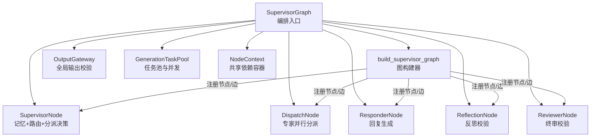
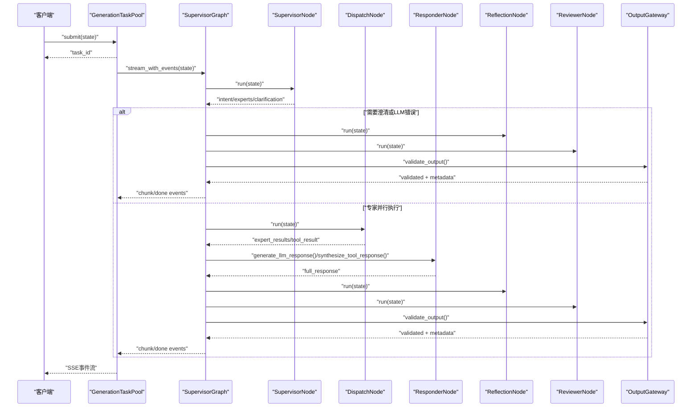
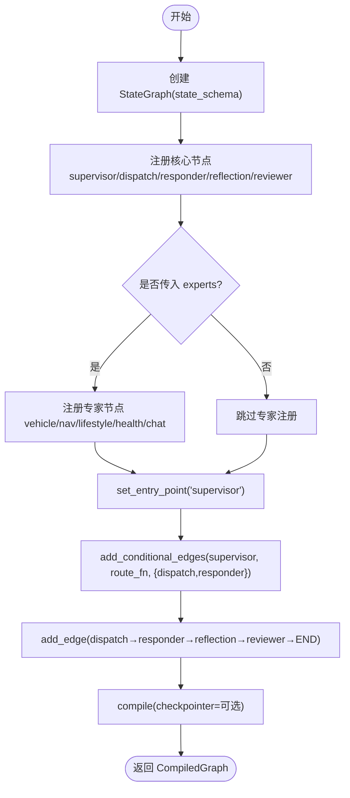
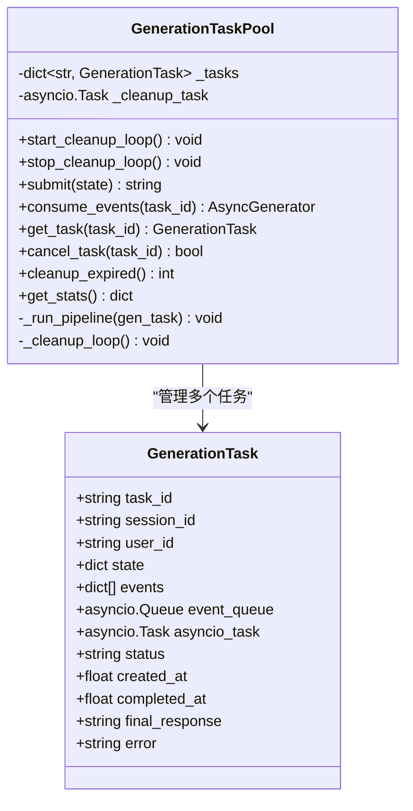
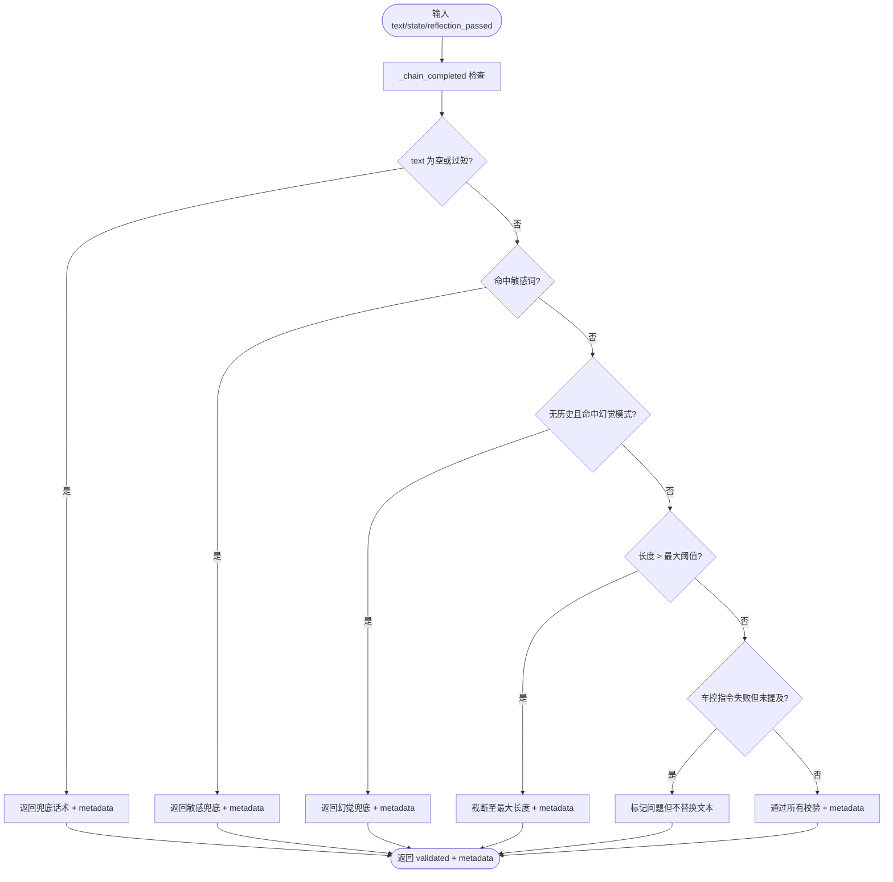
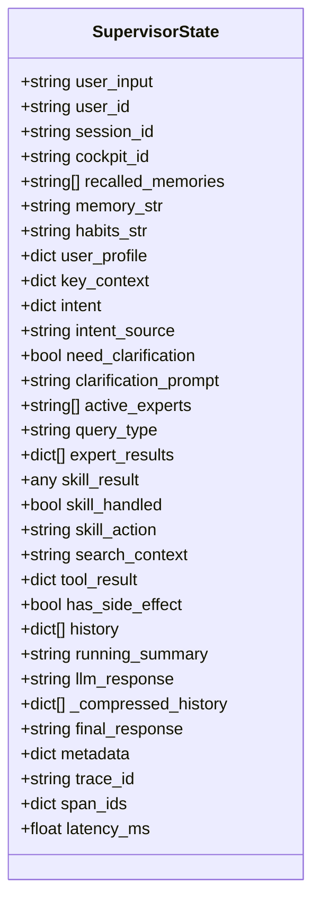
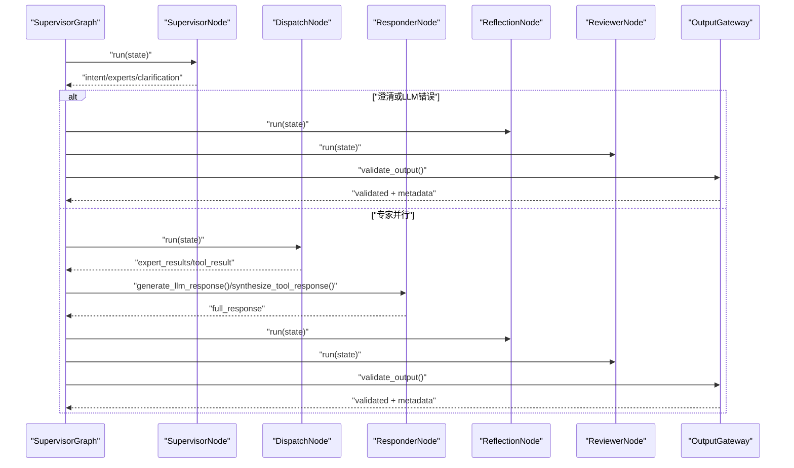
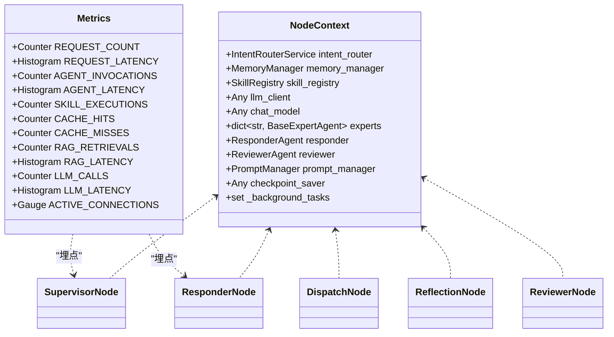

# 工作流编排

<cite>
**本文引用的文件**   
- [graph_builder.py](file://backend_design/nexus/agent/graph_builder.py)
- [supervisor_graph.py](file://backend_design/nexus/agent/supervisor_graph.py)
- [generation_task_pool.py](file://backend_design/nexus/agent/generation_task_pool.py)
- [output_gateway.py](file://backend_design/nexus/agent/output_gateway.py)
- [state.py](file://backend_design/nexus/models/state.py)
- [supervisor_node.py](file://backend_design/nexus/agent/nodes/supervisor_node.py)
- [dispatch_node.py](file://backend_design/nexus/agent/nodes/dispatch_node.py)
- [responder_node.py](file://backend_design/nexus/agent/nodes/responder_node.py)
- [reflection_node.py](file://backend_design/nexus/agent/nodes/reflection_node.py)
- [reviewer_node.py](file://backend_design/nexus/agent/nodes/reviewer_node.py)
- [context.py](file://backend_design/nexus/agent/nodes/context.py)
- [metrics.py](file://backend_design/nexus/observability/metrics.py)
- [_common.py](file://backend_design/nexus/config/_common.py)
</cite>

## 目录
1. [简介](#简介)
2. [项目结构](#项目结构)
3. [核心组件](#核心组件)
4. [架构总览](#架构总览)
5. [详细组件分析](#详细组件分析)
6. [依赖关系分析](#依赖关系分析)
7. [性能考量](#性能考量)
8. [故障排查指南](#故障排查指南)
9. [结论](#结论)
10. [附录：自定义工作流开发指南](#附录自定义工作流开发指南)

## 简介
本技术文档面向 NexusCockpit 工作流编排系统，围绕 LangGraph 图构建器、任务池与并发控制、全局输出网关与安全校验、SupervisorState 状态模型与跨节点数据传递机制进行系统化说明。同时提供自定义工作流开发指南（新节点添加、路由规则配置、异常处理策略），并覆盖性能优化、监控指标与故障排查方法，帮助读者快速理解与扩展系统。

## 项目结构
NexusCockpit 的编排核心位于 backend_design/nexus/agent 目录，采用“编排入口 + 节点拆分”的设计：
- 编排入口：SupervisorGraph 负责初始化、依赖注入、图构建与调用接口（同步/流式）
- 图构建器：build_supervisor_graph 负责注册节点、连接边、设置入口与编译
- 节点实现：SupervisorNode、DispatchNode、ResponderNode、ReflectionNode、ReviewerNode 各司其职
- 状态模型：SupervisorState 定义共享状态字段与 reducer 行为
- 任务池：GenerationTaskPool 管理后台生成任务、事件缓冲与生命周期
- 输出网关：OutputGateway 统一安全校验与兜底策略
- 上下文容器：NodeContext 集中注入共享服务，消除循环依赖

图表来源
- [supervisor_graph.py:169-179](file://backend_design/nexus/agent/supervisor_graph.py#L169-L179)
- [graph_builder.py:70-119](file://backend_design/nexus/agent/graph_builder.py#L70-L119)

章节来源
- [supervisor_graph.py:93-179](file://backend_design/nexus/agent/supervisor_graph.py#L93-L179)
- [graph_builder.py:40-119](file://backend_design/nexus/agent/graph_builder.py#L40-L119)

## 核心组件
- LangGraph 图构建器：集中注册节点、条件边与入口，支持 checkpoint 持久化
- GenerationTaskPool：后台 asyncio.Task 托管 pipeline，SSE 解耦，任务限流与过期清理
- OutputGateway：非空/敏感/幻觉/长度/车控完整性等校验，返回元数据供 Reviewer 记录
- SupervisorState：TypedDict + Annotated reducer，list 累加、dict 合并，避免并行覆盖
- 五层节点链路：Supervisor → Dispatch → Responder → Reflection → Reviewer → END

章节来源
- [graph_builder.py:40-119](file://backend_design/nexus/agent/graph_builder.py#L40-L119)
- [generation_task_pool.py:68-144](file://backend_design/nexus/agent/generation_task_pool.py#L68-L144)
- [output_gateway.py:64-194](file://backend_design/nexus/agent/output_gateway.py#L64-L194)
- [state.py:38-164](file://backend_design/nexus/models/state.py#L38-L164)

## 架构总览
下图展示从请求进入 SupervisorGraph 到最终输出的完整流程，包括流式事件与任务池解耦、全链路校验闭环。

图表来源
- [supervisor_graph.py:386-617](file://backend_design/nexus/agent/supervisor_graph.py#L386-L617)
- [generation_task_pool.py:146-232](file://backend_design/nexus/agent/generation_task_pool.py#L146-L232)
- [output_gateway.py:64-194](file://backend_design/nexus/agent/output_gateway.py#L64-L194)

## 详细组件分析

### LangGraph 图构建器设计原理与节点注册机制
- 职责：注册核心节点与专家节点、设置入口、条件边连接、编译为 CompiledGraph
- 节点注册：add_node 将各节点 run 方法注册为图节点；专家节点虽注册但不通过边触发，由 DispatchNode 内部 asyncio.gather 并行调用
- 条件路由：supervisor → dispatch 或 responder，基于 route_fn 决定分支
- 编译：可选 checkpointer 持久化，便于断点恢复与可观测性

图表来源
- [graph_builder.py:70-119](file://backend_design/nexus/agent/graph_builder.py#L70-L119)

章节来源
- [graph_builder.py:40-119](file://backend_design/nexus/agent/graph_builder.py#L40-L119)

### GenerationTaskPool 任务池管理与并发控制策略
- 设计要点：pipeline 独立于 SSE 连接运行，事件写入 asyncio.Queue 缓冲队列，SSE 端消费；客户端断连不终止 pipeline，重连可查询任务状态与已生成内容
- 并发限制：_MAX_CONCURRENT=20，submit 时检查 running 数量，超限抛出异常
- 生命周期：submit 创建 asyncio.Task 执行 _run_pipeline；consume_events 阻塞读取事件；cancel_task 用户主动取消；cleanup_expired 定期清理已完成超过 _EXPIRE_SECONDS 的任务
- 统计：get_stats 返回 total/running/completed/failed/max_concurrent

图表来源
- [generation_task_pool.py:36-144](file://backend_design/nexus/agent/generation_task_pool.py#L36-L144)
- [generation_task_pool.py:146-304](file://backend_design/nexus/agent/generation_task_pool.py#L146-L304)

章节来源
- [generation_task_pool.py:68-144](file://backend_design/nexus/agent/generation_task_pool.py#L68-L144)
- [generation_task_pool.py:146-232](file://backend_design/nexus/agent/generation_task_pool.py#L146-L232)
- [generation_task_pool.py:259-304](file://backend_design/nexus/agent/generation_task_pool.py#L259-L304)

### OutputGateway 全局输出网关与安全校验流程
- 校验项顺序：链完成标识 → 非空校验 → 敏感内容 → 幻觉模式检测 → 长度合理性 → 车控完整性
- 兜底话术：空/过短使用默认话术；敏感内容拦截；过长截断；车控失败未提及则标记问题
- 元数据：gateway_result/gateway_reason/gateway_reflection_passed 等供 Reviewer 记录与分析

图表来源
- [output_gateway.py:64-194](file://backend_design/nexus/agent/output_gateway.py#L64-L194)

章节来源
- [output_gateway.py:64-194](file://backend_design/nexus/agent/output_gateway.py#L64-L194)

### SupervisorState 状态模型设计与跨节点数据传递机制
- TypedDict + Annotated reducer：list 用 add 累加（如 history、expert_results），dict 用 merge_dict 合并（如 metadata、span_ids）
- 关键字段分组：输入、记忆召回、意图路由、专家输出、技能字段、LLM 对话、最终输出、可观测性
- create_initial_state：确保带 reducer 的字段有正确初始值，支持 running_summary 从 SessionStore 加载

图表来源
- [state.py:38-164](file://backend_design/nexus/models/state.py#L38-L164)

章节来源
- [state.py:38-164](file://backend_design/nexus/models/state.py#L38-L164)

### 五层节点链路详解
- SupervisorNode：记忆召回（GraphRAG 三路融合 + Rerank）、用户画像加载、意图路由（启发式快速路径 + LLM 多意图路由）、专家分派决策、阈值压缩
- DispatchNode：使用 asyncio.gather 并行调用活跃专家，合并 partial updates，处理 tool_result 列表收集与 has_side_effect 标记
- ResponderNode：按分支选择回复策略（澄清/搜索/工具合成/车控聚合/闲聊），构建 System Prompt 注入画像/记忆/习惯/位置/关键上下文，预校验/后校验防幻觉
- ReflectionNode：三类反思（工具/搜索/闲聊），确定性日期校验，渐进式 retry，幻觉兜底检查
- ReviewerNode：终审强校验（质量/业务准确性/合规性），触发记忆存储（三元组提取 + 对话向量化），延迟统计，Agent 活动日志

图表来源
- [supervisor_graph.py:209-384](file://backend_design/nexus/agent/supervisor_graph.py#L209-L384)
- [supervisor_node.py:64-331](file://backend_design/nexus/agent/nodes/supervisor_node.py#L64-L331)
- [dispatch_node.py:38-139](file://backend_design/nexus/agent/nodes/dispatch_node.py#L38-L139)
- [responder_node.py:57-174](file://backend_design/nexus/agent/nodes/responder_node.py#L57-L174)
- [reflection_node.py:82-248](file://backend_design/nexus/agent/nodes/reflection_node.py#L82-L248)
- [reviewer_node.py:39-183](file://backend_design/nexus/agent/nodes/reviewer_node.py#L39-L183)

章节来源
- [supervisor_node.py:64-331](file://backend_design/nexus/agent/nodes/supervisor_node.py#L64-L331)
- [dispatch_node.py:38-139](file://backend_design/nexus/agent/nodes/dispatch_node.py#L38-L139)
- [responder_node.py:57-174](file://backend_design/nexus/agent/nodes/responder_node.py#L57-L174)
- [reflection_node.py:82-248](file://backend_design/nexus/agent/nodes/reflection_node.py#L82-L248)
- [reviewer_node.py:39-183](file://backend_design/nexus/agent/nodes/reviewer_node.py#L39-L183)

## 依赖关系分析
- NodeContext 作为共享依赖容器，集中注入 IntentRouterService、MemoryManager、SkillRegistry、ChatModel、Experts、Responder、Reviewer、PromptManager、CheckpointSaver
- 节点间通过 NodeContext 传递依赖，无直接引用，消除循环依赖
- 指标采集：Prometheus 指标暴露 /metrics 端点，包含请求、Agent、技能、缓存、RAG、LLM、系统指标

图表来源
- [context.py:31-64](file://backend_design/nexus/agent/nodes/context.py#L31-L64)
- [metrics.py:14-108](file://backend_design/nexus/observability/metrics.py#L14-L108)

章节来源
- [context.py:31-64](file://backend_design/nexus/agent/nodes/context.py#L31-L64)
- [metrics.py:14-108](file://backend_design/nexus/observability/metrics.py#L14-L108)

## 性能考量
- 快速路径：SupervisorNode 对纯车控指令走启发式路由，跳过记忆召回与 RAG，延迟从 ~7.5s 降至 <100ms
- 并行执行：DispatchNode 使用 asyncio.gather 并行调用专家；SupervisorNode 中记忆召回、用户画像加载、意图路由三任务并行
- 阈值压缩：对话超阈值自动压缩旧对话为滚动摘要，减少 LLM 上下文长度
- 任务池并发：_MAX_CONCURRENT=20，防止过载；cleanup_expired 定期清理过期任务，防止内存泄漏
- LLM 调用优化：低温度保证事实准确性；Tool→LLM 合成快速路径（短消息直接返回）；反射快速跳过（短回复+失败关键词）

章节来源
- [supervisor_node.py:170-259](file://backend_design/nexus/agent/nodes/supervisor_node.py#L170-L259)
- [dispatch_node.py:50-62](file://backend_design/nexus/agent/nodes/dispatch_node.py#L50-L62)
- [responder_node.py:218-227](file://backend_design/nexus/agent/nodes/responder_node.py#L218-L227)
- [reflection_node.py:499-510](file://backend_design/nexus/agent/nodes/reflection_node.py#L499-L510)
- [generation_task_pool.py:86-88](file://backend_design/nexus/agent/generation_task_pool.py#L86-L88)

## 故障排查指南
- LLM 不可用：SupervisorGraph.stream 与 stream_with_events 均走完整 Reviewer + Output Gateway 兜底，返回“AI 服务暂时繁忙”
- 澄清分支：need_clarification=True 时直连 responder，经 Reflection + Reviewer + Gateway 校验后输出
- 任务取消：GenerationTaskPool.cancel_task 仅用户主动调用才终止 pipeline，页面切换不中断
- 输出被拦截：OutputGateway 返回 gateway_result/gateway_reason，ReviewNode 记录元数据，可通过日志定位原因
- 指标排查：Prometheus /metrics 端点查看 AGENT_LATENCY、LLM_LATENCY、RAG_LATENCY 等指标，定位瓶颈

章节来源
- [supervisor_graph.py:231-244](file://backend_design/nexus/agent/supervisor_graph.py#L231-L244)
- [supervisor_graph.py:416-439](file://backend_design/nexus/agent/supervisor_graph.py#L416-L439)
- [generation_task_pool.py:240-257](file://backend_design/nexus/agent/generation_task_pool.py#L240-L257)
- [output_gateway.py:105-107](file://backend_design/nexus/agent/output_gateway.py#L105-L107)
- [metrics.py:35-90](file://backend_design/nexus/observability/metrics.py#L35-L90)

## 结论
NexusCockpit 工作流编排系统通过 LangGraph 图构建器、任务池解耦、全局输出网关与严格的状态模型，实现了高可靠、高性能、可扩展的多智能体协作框架。五层节点链路确保输出安全与质量，配合完善的监控与故障排查机制，适合车载语音助手等复杂场景。

## 附录：自定义工作流开发指南
- 新增节点
  - 在 nodes/ 目录下创建新节点类，实现 run(state) -> dict[str, Any]
  - 通过 NodeContext 获取共享服务，避免直接引用 SupervisorGraph
  - 在 graph_builder.py 中 add_node 注册节点，并在 supervisor_graph.py 中注入依赖
- 路由规则配置
  - 在 SupervisorNode._determine_experts 中扩展专家分派逻辑，支持新意图键
  - 在 graph_builder.py 的 add_conditional_edges 中调整条件边映射
- 异常处理策略
  - 节点内捕获异常并记录日志，返回 partial update 包含 error 信息
  - 使用 OutputGateway 兜底话术，确保对外输出安全
  - 利用 ReviewerNode 记录 Agent 活动日志，便于追踪
- 性能优化建议
  - 优先使用快速路径（启发式路由、短消息快速返回）
  - 合理设置 _MAX_CONCURRENT 与 _EXPIRE_SECONDS
  - 使用阈值压缩与滚动摘要减少 LLM 上下文长度
- 监控指标
  - 在节点中使用 @observe 装饰器埋点，记录延迟与状态
  - 通过 Prometheus /metrics 端点查看指标，结合 Grafana 仪表盘分析

章节来源
- [graph_builder.py:70-119](file://backend_design/nexus/agent/graph_builder.py#L70-L119)
- [supervisor_node.py:333-421](file://backend_design/nexus/agent/nodes/supervisor_node.py#L333-L421)
- [reviewer_node.py:145-176](file://backend_design/nexus/agent/nodes/reviewer_node.py#L145-L176)
- [generation_task_pool.py:86-88](file://backend_design/nexus/agent/generation_task_pool.py#L86-L88)
- [metrics.py:14-108](file://backend_design/nexus/observability/metrics.py#L14-L108)