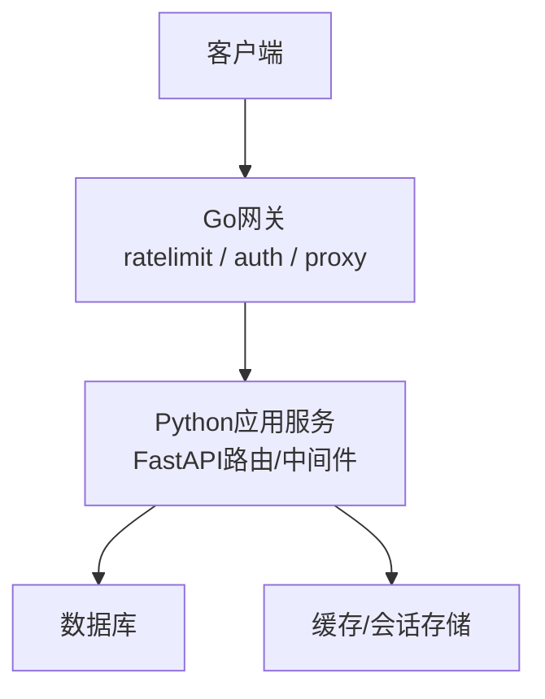
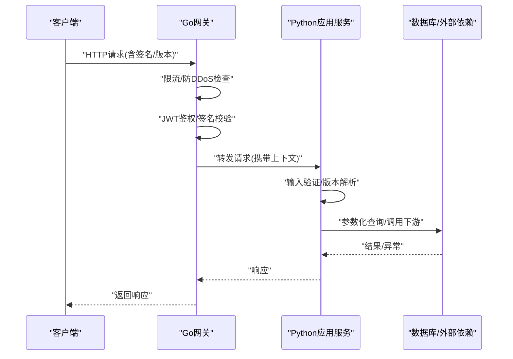
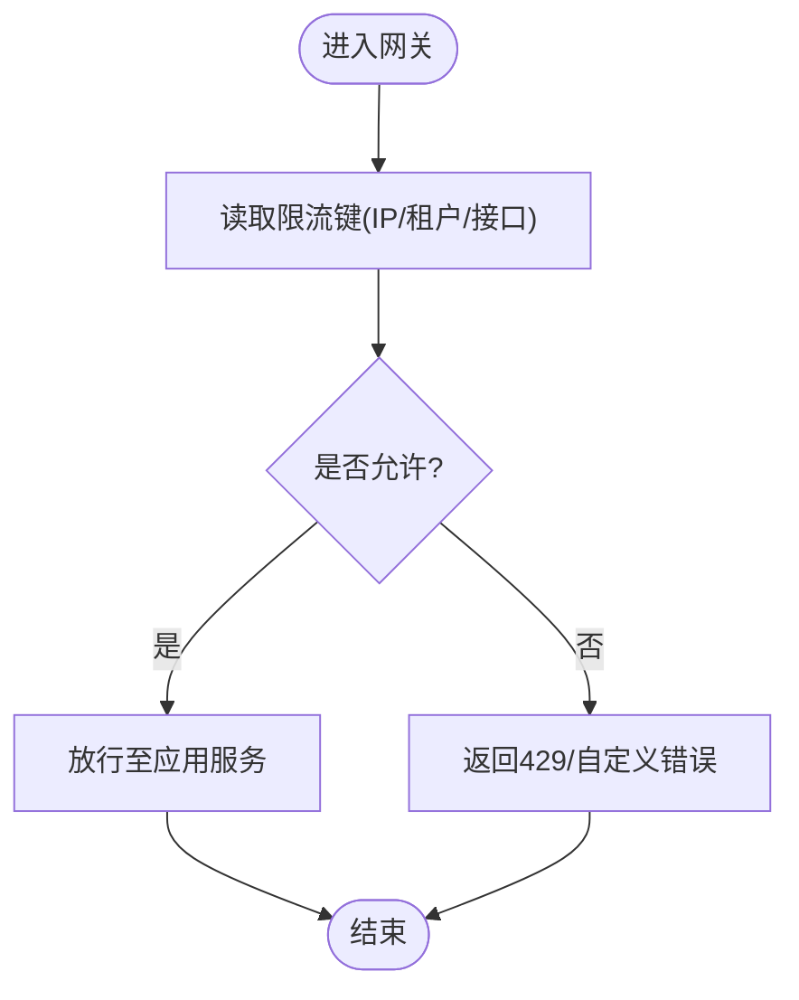
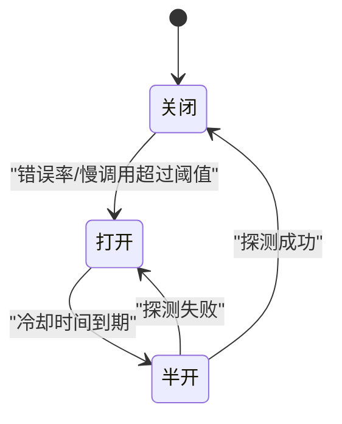
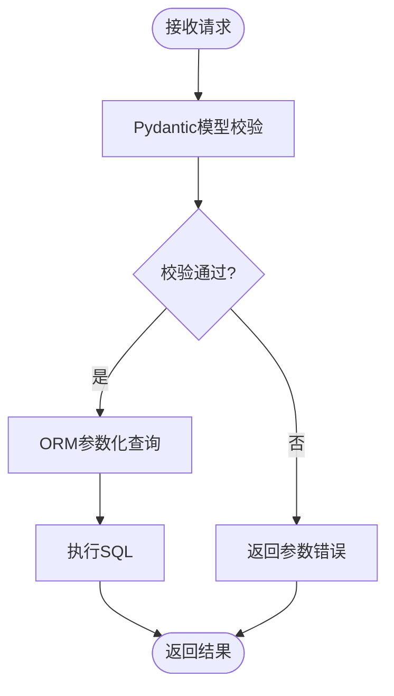
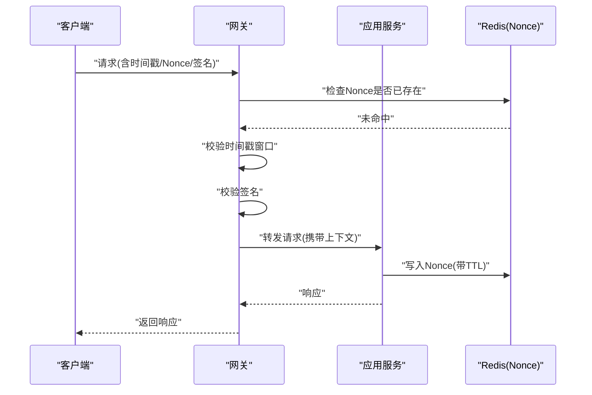
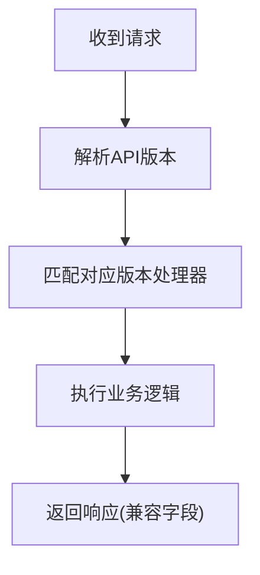
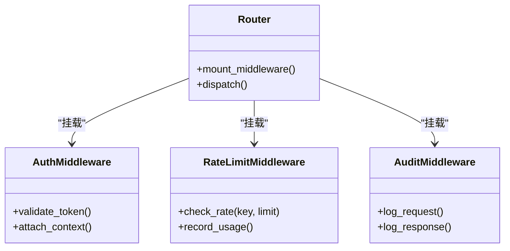
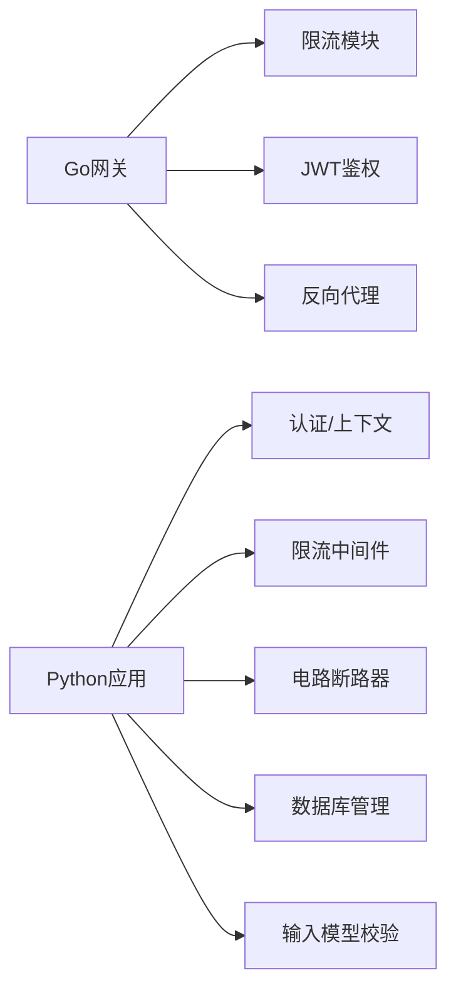

# API安全防护

<cite>
**本文引用的文件**   
- [backend_design/nexus/middleware/rate_limiter.py](file://backend_design/nexus/middleware/rate_limiter.py)
- [backend_design/nexus/core/circuit_breaker.py](file://backend_design/nexus/core/circuit_breaker.py)
- [backend_design/nexus/api/routes/auth.py](file://backend_design/nexus/api/routes/auth.py)
- [backend_design/nexus/core/auth.py](file://backend_design/nexus/core/auth.py)
- [backend_design/nexus/models/schemas.py](file://backend_design/nexus/models/schemas.py)
- [backend_design/nexus/core/db_manager.py](file://backend_design/nexus/core/db_manager.py)
- [backend_design/nexus_gate/internal/ratelimit/ratelimit.go](file://backend_design/nexus_gate/internal/ratelimit/ratelimit.go)
- [backend_design/nexus_gate/internal/auth/jwt.go](file://backend_design/nexus_gate/internal/auth/jwt.go)
- [backend_design/nexus_gate/internal/proxy/proxy.go](file://backend_design/nexus_gate/internal/proxy/proxy.go)
- [backend_design/nexus/config.py](file://backend_design/nexus/config.py)
</cite>

## 目录
1. [简介](#简介)
2. [项目结构](#项目结构)
3. [核心组件](#核心组件)
4. [架构总览](#架构总览)
5. [详细组件分析](#详细组件分析)
6. [依赖分析](#依赖分析)
7. [性能考虑](#性能考虑)
8. [故障排查指南](#故障排查指南)
9. [结论](#结论)
10. [附录](#附录)

## 简介
本技术文档聚焦于API安全防护，覆盖限流与防DDoS、电路断路器高可用与故障隔离、输入验证与SQL注入防护、请求签名与重放攻击防护、API版本控制与向后兼容保障，以及安全中间件的配置与使用。内容基于后端Python服务与Go网关的现有实现进行梳理与说明，帮助读者快速理解并落地相关安全能力。

## 项目结构
本项目采用“网关+应用服务”的分层架构：
- Go网关负责入口流量治理（限流、鉴权、转发等）
- Python应用服务承载业务逻辑与安全策略（认证、数据库访问、熔断器、中间件等）

[本节为概念性结构说明，不直接分析具体文件，故无“章节来源”]

## 核心组件
- 限流与防DDoS：Go网关侧令牌桶/滑动窗口限流；Python侧按租户/用户维度的速率限制中间件
- 电路断路器：对下游依赖（如外部服务、数据库）进行熔断与降级，避免雪崩
- 输入验证与SQL注入防护：Pydantic模型校验、参数白名单、ORM参数化查询
- 请求签名与重放防护：时间戳+随机数+签名校验，拒绝过期或重复请求
- API版本控制与兼容性：URL路径前缀或Header版本标识，兼容旧版字段
- 安全中间件：统一鉴权、限流、审计、错误处理

**章节来源**
- [backend_design/nexus/middleware/rate_limiter.py](file://backend_design/nexus/middleware/rate_limiter.py)
- [backend_design/nexus/core/circuit_breaker.py](file://backend_design/nexus/core/circuit_breaker.py)
- [backend_design/nexus/models/schemas.py](file://backend_design/nexus/models/schemas.py)
- [backend_design/nexus/core/db_manager.py](file://backend_design/nexus/core/db_manager.py)
- [backend_design/nexus_gate/internal/ratelimit/ratelimit.go](file://backend_design/nexus_gate/internal/ratelimit/ratelimit.go)
- [backend_design/nexus_gate/internal/auth/jwt.go](file://backend_design/nexus_gate/internal/auth/jwt.go)
- [backend_design/nexus_gate/internal/proxy/proxy.go](file://backend_design/nexus_gate/internal/proxy/proxy.go)

## 架构总览
下图展示从客户端到应用服务的请求链路及安全控制点：

**图表来源**
- [backend_design/nexus_gate/internal/ratelimit/ratelimit.go](file://backend_design/nexus_gate/internal/ratelimit/ratelimit.go)
- [backend_design/nexus_gate/internal/auth/jwt.go](file://backend_design/nexus_gate/internal/auth/jwt.go)
- [backend_design/nexus_gate/internal/proxy/proxy.go](file://backend_design/nexus_gate/internal/proxy/proxy.go)
- [backend_design/nexus/middleware/rate_limiter.py](file://backend_design/nexus/middleware/rate_limiter.py)
- [backend_design/nexus/core/circuit_breaker.py](file://backend_design/nexus/core/circuit_breaker.py)
- [backend_design/nexus/models/schemas.py](file://backend_design/nexus/models/schemas.py)
- [backend_design/nexus/core/db_manager.py](file://backend_design/nexus/core/db_manager.py)

## 详细组件分析

### 限流算法与防DDoS策略
- 网关层（Go）
  - 基于IP/租户/接口的限流策略，结合令牌桶或滑动窗口计数，防止突发流量与CC/DDoS攻击
  - 在请求进入网关时即进行配额判定，超限直接拒绝，降低后端压力
- 应用层（Python）
  - 提供按用户/租户维度的速率限制中间件，用于细粒度保护敏感接口
  - 支持动态阈值与告警，便于运营调整

**图表来源**
- [backend_design/nexus_gate/internal/ratelimit/ratelimit.go](file://backend_design/nexus_gate/internal/ratelimit/ratelimit.go)
- [backend_design/nexus/middleware/rate_limiter.py](file://backend_design/nexus/middleware/rate_limiter.py)

**章节来源**
- [backend_design/nexus_gate/internal/ratelimit/ratelimit.go](file://backend_design/nexus_gate/internal/ratelimit/ratelimit.go)
- [backend_design/nexus/middleware/rate_limiter.py](file://backend_design/nexus/middleware/rate_limiter.py)

### 电路断路器的高可用与故障隔离
- 目标：当依赖服务不稳定或超时比例升高时，快速失败并回退，避免级联故障
- 关键机制
  - 状态机：关闭→打开→半开，依据错误率/延迟阈值切换
  - 熔断阈值：错误率、慢调用比例、最小请求数
  - 恢复策略：半开探测少量请求，成功则恢复关闭，失败则继续打开
  - 隔离：不同依赖独立熔断，避免相互影响

**图表来源**
- [backend_design/nexus/core/circuit_breaker.py](file://backend_design/nexus/core/circuit_breaker.py)

**章节来源**
- [backend_design/nexus/core/circuit_breaker.py](file://backend_design/nexus/core/circuit_breaker.py)

### 输入验证与SQL注入防护
- 输入验证
  - 使用Pydantic模型对请求体/查询参数进行强类型校验与约束（长度、格式、枚举等）
  - 对可选字段设置默认值与空值处理，减少非法输入导致的异常
- SQL注入防护
  - 通过ORM参数化查询，禁止拼接字符串构造SQL
  - 对关键字段进行白名单过滤与范围校验
  - 数据库连接与事务由统一管理器封装，集中处理异常与日志

**图表来源**
- [backend_design/nexus/models/schemas.py](file://backend_design/nexus/models/schemas.py)
- [backend_design/nexus/core/db_manager.py](file://backend_design/nexus/core/db_manager.py)

**章节来源**
- [backend_design/nexus/models/schemas.py](file://backend_design/nexus/models/schemas.py)
- [backend_design/nexus/core/db_manager.py](file://backend_design/nexus/core/db_manager.py)

### 请求签名验证与重放攻击防护
- 签名方案
  - 客户端使用约定密钥对请求体/时间戳/随机数进行签名
  - 服务端校验签名一致性，确保请求未被篡改
- 重放防护
  - 引入时间戳窗口（如±5分钟），拒绝过期请求
  - 使用Nonce去重（Redis/Set记录最近N次请求指纹），同一窗口内拒绝重复
- 网关与应用协同
  - 网关可前置校验签名与时间戳，应用层再做二次校验与业务上下文绑定

**图表来源**
- [backend_design/nexus_gate/internal/auth/jwt.go](file://backend_design/nexus_gate/internal/auth/jwt.go)
- [backend_design/nexus/api/routes/auth.py](file://backend_design/nexus/api/routes/auth.py)
- [backend_design/nexus/core/auth.py](file://backend_design/nexus/core/auth.py)

**章节来源**
- [backend_design/nexus_gate/internal/auth/jwt.go](file://backend_design/nexus_gate/internal/auth/jwt.go)
- [backend_design/nexus/api/routes/auth.py](file://backend_design/nexus/api/routes/auth.py)
- [backend_design/nexus/core/auth.py](file://backend_design/nexus/core/auth.py)

### API版本控制与向后兼容保障
- 版本标识
  - URL路径前缀（如/v1、/v2）或请求头（X-API-Version）
- 兼容性策略
  - 新增字段默认可选，旧字段保留至少一个主版本周期
  - 废弃字段标记弃用日志，逐步下线
  - 路由层根据版本选择处理器，避免破坏旧客户端

**图表来源**
- [backend_design/nexus/api/routes/auth.py](file://backend_design/nexus/api/routes/auth.py)
- [backend_design/nexus/config.py](file://backend_design/nexus/config.py)

**章节来源**
- [backend_design/nexus/api/routes/auth.py](file://backend_design/nexus/api/routes/auth.py)
- [backend_design/nexus/config.py](file://backend_design/nexus/config.py)

### 安全中间件配置与使用指南
- 鉴权中间件
  - 校验JWT令牌有效性、权限范围与租户上下文
  - 将用户信息注入请求上下文供后续处理使用
- 限流中间件
  - 针对敏感接口启用更严格的限流策略
  - 支持按用户/租户维度统计与告警
- 审计与错误处理
  - 统一记录请求ID、耗时、状态码与关键上下文
  - 对外隐藏内部堆栈，仅返回必要错误信息

**图表来源**
- [backend_design/nexus/api/routes/auth.py](file://backend_design/nexus/api/routes/auth.py)
- [backend_design/nexus/middleware/rate_limiter.py](file://backend_design/nexus/middleware/rate_limiter.py)
- [backend_design/nexus/core/auth.py](file://backend_design/nexus/core/auth.py)

**章节来源**
- [backend_design/nexus/api/routes/auth.py](file://backend_design/nexus/api/routes/auth.py)
- [backend_design/nexus/middleware/rate_limiter.py](file://backend_design/nexus/middleware/rate_limiter.py)
- [backend_design/nexus/core/auth.py](file://backend_design/nexus/core/auth.py)

## 依赖分析
- 网关与应用解耦：网关专注流量治理与基础鉴权，应用专注业务逻辑与高级安全策略
- 外部依赖隔离：通过电路断路器隔离数据库与第三方服务的不稳定
- 中间件组合：鉴权、限流、审计以插件方式挂载，易于扩展与维护

**图表来源**
- [backend_design/nexus_gate/internal/ratelimit/ratelimit.go](file://backend_design/nexus_gate/internal/ratelimit/ratelimit.go)
- [backend_design/nexus_gate/internal/auth/jwt.go](file://backend_design/nexus_gate/internal/auth/jwt.go)
- [backend_design/nexus_gate/internal/proxy/proxy.go](file://backend_design/nexus_gate/internal/proxy/proxy.go)
- [backend_design/nexus/middleware/rate_limiter.py](file://backend_design/nexus/middleware/rate_limiter.py)
- [backend_design/nexus/core/circuit_breaker.py](file://backend_design/nexus/core/circuit_breaker.py)
- [backend_design/nexus/core/db_manager.py](file://backend_design/nexus/core/db_manager.py)
- [backend_design/nexus/models/schemas.py](file://backend_design/nexus/models/schemas.py)

**章节来源**
- [backend_design/nexus_gate/internal/ratelimit/ratelimit.go](file://backend_design/nexus_gate/internal/ratelimit/ratelimit.go)
- [backend_design/nexus_gate/internal/auth/jwt.go](file://backend_design/nexus_gate/internal/auth/jwt.go)
- [backend_design/nexus_gate/internal/proxy/proxy.go](file://backend_design/nexus_gate/internal/proxy/proxy.go)
- [backend_design/nexus/middleware/rate_limiter.py](file://backend_design/nexus/middleware/rate_limiter.py)
- [backend_design/nexus/core/circuit_breaker.py](file://backend_design/nexus/core/circuit_breaker.py)
- [backend_design/nexus/core/db_manager.py](file://backend_design/nexus/core/db_manager.py)
- [backend_design/nexus/models/schemas.py](file://backend_design/nexus/models/schemas.py)

## 性能考虑
- 限流键设计：尽量使用低基数键（如租户ID）聚合统计，减少内存占用
- 非阻塞校验：签名与时间戳校验优先在网关完成，缩短应用路径
- 熔断阈值调优：结合P95/P99延迟与错误率曲线动态调整，避免误判
- 缓存与去重：Nonce与限流计数使用高效数据结构（如Redis Set/Hash），合理设置TTL
- 资源隔离：不同租户/接口使用独立限流桶与熔断器实例，避免热点干扰

[本节为通用指导，不直接分析具体文件，故无“章节来源”]

## 故障排查指南
- 限流问题
  - 检查网关与应用层的限流键是否正确（IP/租户/接口）
  - 观察429响应频率与阈值配置，必要时放宽或分桶细化
- 熔断触发
  - 查看错误率与慢调用指标，确认下游健康状态
  - 半开探测失败时，检查重试与回退逻辑
- 签名/重放
  - 核对时间戳窗口与系统时钟同步
  - 检查Nonce去重集合大小与TTL，避免误杀正常请求
- 输入验证
  - 定位Pydantic校验失败的具体字段与规则
  - 确认ORM参数化查询是否被绕过
- 鉴权
  - 校验JWT签发方、有效期与权限范围
  - 检查租户上下文是否正确传递

**章节来源**
- [backend_design/nexus/middleware/rate_limiter.py](file://backend_design/nexus/middleware/rate_limiter.py)
- [backend_design/nexus/core/circuit_breaker.py](file://backend_design/nexus/core/circuit_breaker.py)
- [backend_design/nexus/models/schemas.py](file://backend_design/nexus/models/schemas.py)
- [backend_design/nexus/core/db_manager.py](file://backend_design/nexus/core/db_manager.py)
- [backend_design/nexus_gate/internal/auth/jwt.go](file://backend_design/nexus_gate/internal/auth/jwt.go)

## 结论
通过网关与应用双层的限流与鉴权、电路断路器的故障隔离、严格的输入验证与参数化查询、签名与Nonce的重放防护，以及清晰的API版本与兼容策略，本项目构建了较为完善的API安全防护体系。建议在生产环境持续监控关键指标，结合业务特征动态调优阈值与策略，确保安全与体验的平衡。

[本节为总结性内容，不直接分析具体文件，故无“章节来源”]

## 附录
- 配置项参考
  - 限流阈值、时间窗口、键空间划分
  - 熔断错误率/慢调用阈值、冷却时间、半开探测次数
  - 签名算法、时间戳窗口、Nonce TTL
  - API版本策略与弃用字段生命周期
- 最佳实践
  - 最小权限原则与租户隔离
  - 全链路追踪与审计日志
  - 灰度发布与回滚预案

[本节为通用指导，不直接分析具体文件，故无“章节来源”]