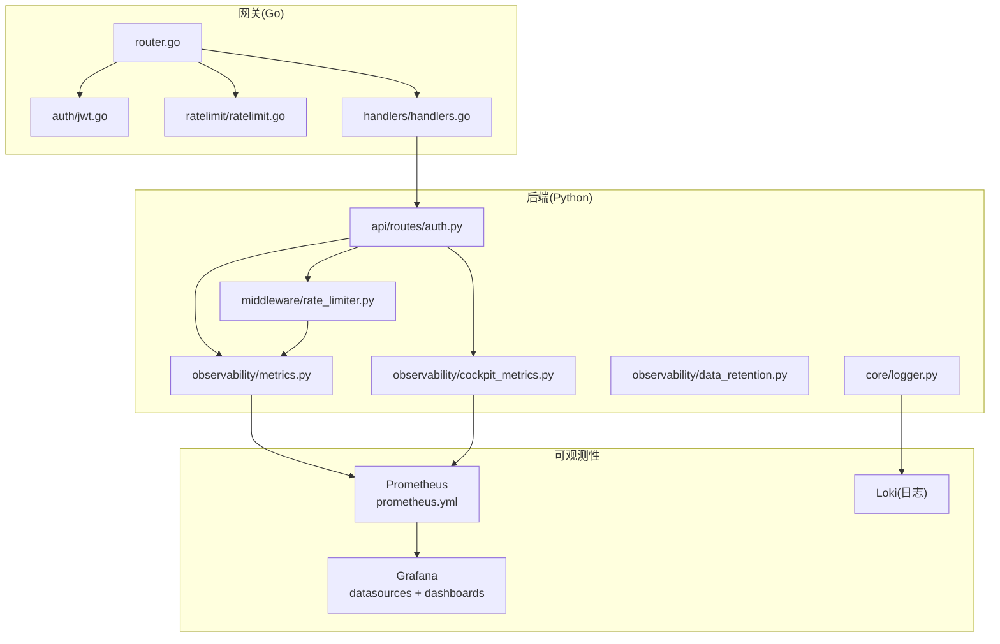
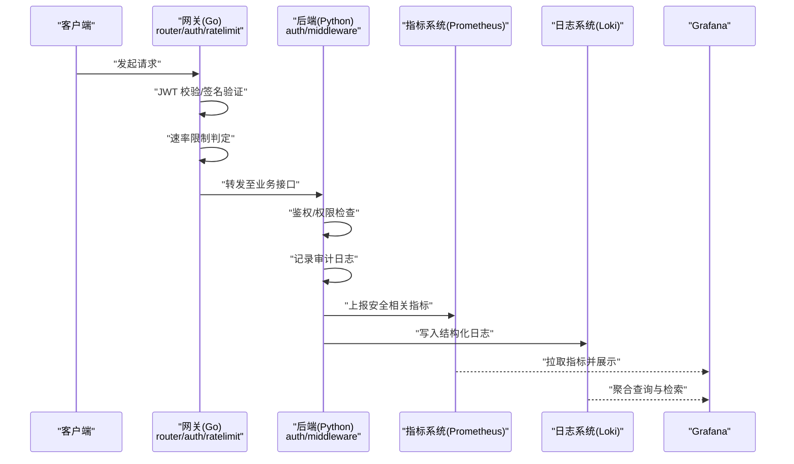
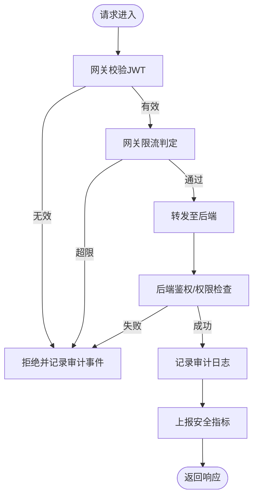
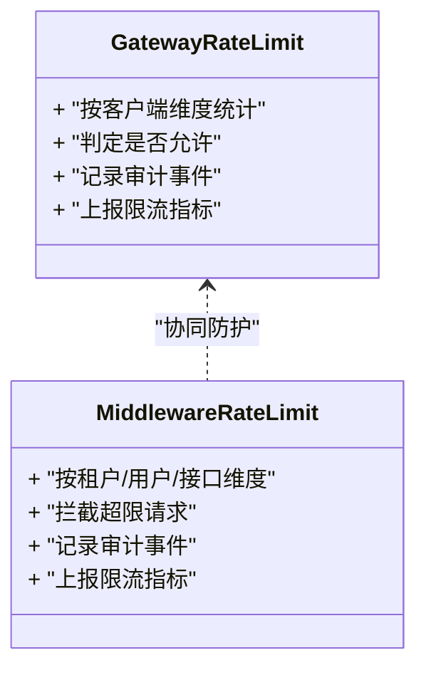
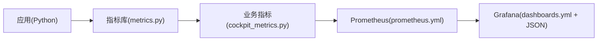
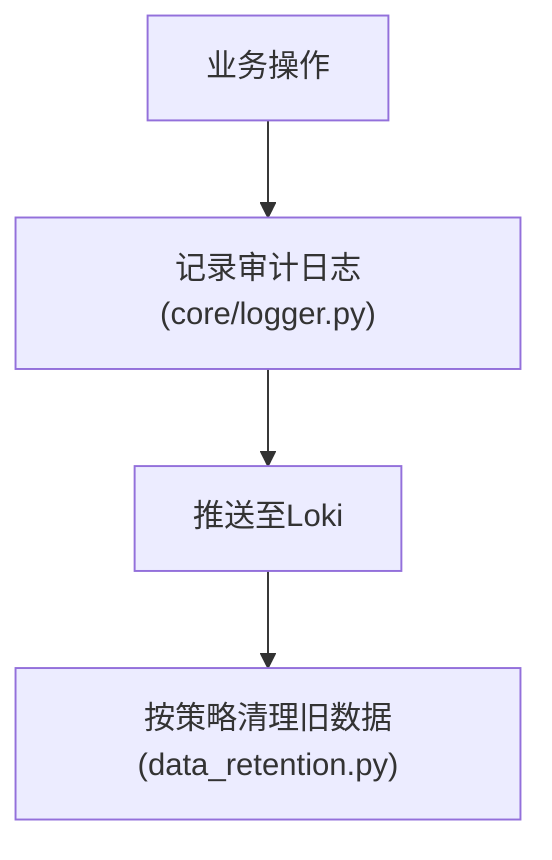
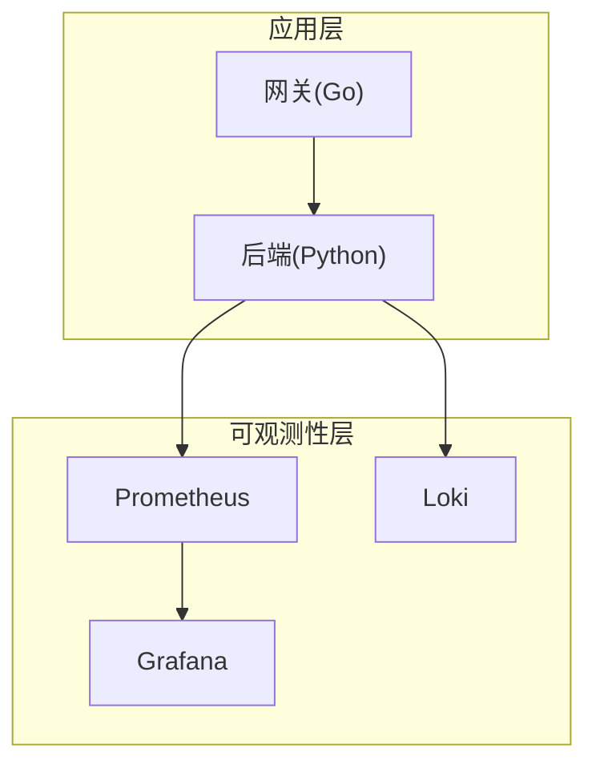

# 安全审计与监控

<cite>
**本文引用的文件**   
- [backend_design/nexus/core/logger.py](file://backend_design/nexus/core/logger.py)
- [backend_design/nexus/api/routes/auth.py](file://backend_design/nexus/api/routes/auth.py)
- [backend_design/nexus/middleware/rate_limiter.py](file://backend_design/nexus/middleware/rate_limiter.py)
- [backend_design/nexus/observability/metrics.py](file://backend_design/nexus/observability/metrics.py)
- [backend_design/nexus/observability/cockpit_metrics.py](file://backend_design/nexus/observability/cockpit_metrics.py)
- [backend_design/nexus/observability/data_retention.py](file://backend_design/nexus/observability/data_retention.py)
- [config/prometheus/prometheus.yml](file://config/prometheus/prometheus.yml)
- [config/grafana/provisioning/dashboards/dashboards.yml](file://config/grafana/provisioning/dashboards/dashboards.yml)
- [config/grafana/provisioning/dashboards/nexuscockpit-overview.json](file://config/grafana/provisioning/dashboards/nexuscockpit-overview.json)
- [config/grafana/provisioning/datasources/prometheus.yml](file://config/grafana/provisioning/datasources/prometheus.yml)
- [backend_design/nexus_gate/internal/auth/jwt.go](file://backend_design/nexus_gate/internal/auth/jwt.go)
- [backend_design/nexus_gate/internal/ratelimit/ratelimit.go](file://backend_design/nexus_gate/internal/ratelimit/ratelimit.go)
- [backend_design/nexus_gate/internal/handlers/handlers.go](file://backend_design/nexus_gate/internal/handlers/handlers.go)
- [backend_design/nexus_gate/internal/router/router.go](file://backend_design/nexus_gate/internal/router/router.go)
- [docker-compose.yml](file://docker-compose.yml)
</cite>

## 目录
1. [简介](#简介)
2. [项目结构](#项目结构)
3. [核心组件](#核心组件)
4. [架构总览](#架构总览)
5. [详细组件分析](#详细组件分析)
6. [依赖关系分析](#依赖关系分析)
7. [性能考虑](#性能考虑)
8. [故障排查指南](#故障排查指南)
9. [结论](#结论)
10. [附录](#附录)

## 简介
本文件面向安全审计与监控，围绕以下目标展开：
- 安全事件的日志记录与审计追踪机制
- 关键操作的访问日志与安全指标收集
- 安全告警规则配置与通知策略
- 安全漏洞扫描与渗透测试实施流程
- 安全合规检查与审计报告生成
- 安全事件响应与取证分析最佳实践

本项目在后端（Python）与网关（Go）中分别实现了认证、限流、可观测性（指标/日志/数据保留）等能力，并通过 Prometheus/Grafana/Loki 进行采集、可视化与检索。

## 项目结构
与“安全审计与监控”直接相关的目录与文件包括：
- 后端 Python 服务
  - 日志与可观测性：core/logger.py、observability/*
  - 鉴权与中间件：api/routes/auth.py、middleware/rate_limiter.py
- 网关 Go 服务
  - 鉴权与限流：internal/auth/jwt.go、internal/ratelimit/ratelimit.go
  - 路由与处理器：internal/router/router.go、internal/handlers/handlers.go
- 可观测性配置
  - Prometheus 抓取配置：config/prometheus/prometheus.yml
  - Grafana 数据源与仪表盘：config/grafana/provisioning/datasources/prometheus.yml、dashboards/*.json
- 编排与部署
  - docker-compose.yml

图表来源
- [backend_design/nexus_gate/internal/router/router.go](file://backend_design/nexus_gate/internal/router/router.go)
- [backend_design/nexus_gate/internal/auth/jwt.go](file://backend_design/nexus_gate/internal/auth/jwt.go)
- [backend_design/nexus_gate/internal/ratelimit/ratelimit.go](file://backend_design/nexus_gate/internal/ratelimit/ratelimit.go)
- [backend_design/nexus_gate/internal/handlers/handlers.go](file://backend_design/nexus_gate/internal/handlers/handlers.go)
- [backend_design/nexus/api/routes/auth.py](file://backend_design/nexus/api/routes/auth.py)
- [backend_design/nexus/middleware/rate_limiter.py](file://backend_design/nexus/middleware/rate_limiter.py)
- [backend_design/nexus/observability/metrics.py](file://backend_design/nexus/observability/metrics.py)
- [backend_design/nexus/observability/cockpit_metrics.py](file://backend_design/nexus/observability/cockpit_metrics.py)
- [backend_design/nexus/observability/data_retention.py](file://backend_design/nexus/observability/data_retention.py)
- [backend_design/nexus/core/logger.py](file://backend_design/nexus/core/logger.py)
- [config/prometheus/prometheus.yml](file://config/prometheus/prometheus.yml)
- [config/grafana/provisioning/datasources/prometheus.yml](file://config/grafana/provisioning/datasources/prometheus.yml)
- [config/grafana/provisioning/dashboards/dashboards.yml](file://config/grafana/provisioning/dashboards/dashboards.yml)

章节来源
- [docker-compose.yml](file://docker-compose.yml)
- [config/prometheus/prometheus.yml](file://config/prometheus/prometheus.yml)
- [config/grafana/provisioning/datasources/prometheus.yml](file://config/grafana/provisioning/datasources/prometheus.yml)
- [config/grafana/provisioning/dashboards/dashboards.yml](file://config/grafana/provisioning/dashboards/dashboards.yml)

## 核心组件
- 认证与授权
  - 网关侧 JWT 校验与鉴权逻辑
  - 后端 API 的认证路由与权限控制
- 速率限制与防滥用
  - 网关层令牌桶/滑动窗口限流
  - 后端中间件级限流
- 可观测性与审计
  - 结构化日志输出（接入 Loki）
  - 指标暴露（接入 Prometheus）
  - 仪表盘与数据源配置（Grafana）
  - 数据保留策略（审计日志/指标生命周期）

章节来源
- [backend_design/nexus_gate/internal/auth/jwt.go](file://backend_design/nexus_gate/internal/auth/jwt.go)
- [backend_design/nexus/api/routes/auth.py](file://backend_design/nexus/api/routes/auth.py)
- [backend_design/nexus_gate/internal/ratelimit/ratelimit.go](file://backend_design/nexus_gate/internal/ratelimit/ratelimit.go)
- [backend_design/nexus/middleware/rate_limiter.py](file://backend_design/nexus/middleware/rate_limiter.py)
- [backend_design/nexus/observability/metrics.py](file://backend_design/nexus/observability/metrics.py)
- [backend_design/nexus/observability/cockpit_metrics.py](file://backend_design/nexus/observability/cockpit_metrics.py)
- [backend_design/nexus/observability/data_retention.py](file://backend_design/nexus/observability/data_retention.py)
- [backend_design/nexus/core/logger.py](file://backend_design/nexus/core/logger.py)

## 架构总览
下图展示了从请求进入网关到后端处理、再到指标与日志落盘的全链路审计与监控路径。

图表来源
- [backend_design/nexus_gate/internal/router/router.go](file://backend_design/nexus_gate/internal/router/router.go)
- [backend_design/nexus_gate/internal/auth/jwt.go](file://backend_design/nexus_gate/internal/auth/jwt.go)
- [backend_design/nexus_gate/internal/ratelimit/ratelimit.go](file://backend_design/nexus_gate/internal/ratelimit/ratelimit.go)
- [backend_design/nexus/api/routes/auth.py](file://backend_design/nexus/api/routes/auth.py)
- [backend_design/nexus/middleware/rate_limiter.py](file://backend_design/nexus/middleware/rate_limiter.py)
- [backend_design/nexus/observability/metrics.py](file://backend_design/nexus/observability/metrics.py)
- [backend_design/nexus/core/logger.py](file://backend_design/nexus/core/logger.py)
- [config/prometheus/prometheus.yml](file://config/prometheus/prometheus.yml)
- [config/grafana/provisioning/datasources/prometheus.yml](file://config/grafana/provisioning/datasources/prometheus.yml)

## 详细组件分析

### 认证与访问审计（网关与后端）
- 网关侧
  - JWT 签发/校验：负责身份凭证的合法性、有效期与签名校验，失败则拒绝访问并记录审计事件。
  - 路由与处理器：统一入口，将鉴权结果与上下文透传到后端。
- 后端侧
  - 认证路由：对敏感接口进行二次校验，记录登录成功/失败、越权尝试等审计事件。
  - 中间件：在请求处理前后注入审计字段（如用户标识、来源 IP、操作类型、结果码）。

图表来源
- [backend_design/nexus_gate/internal/auth/jwt.go](file://backend_design/nexus_gate/internal/auth/jwt.go)
- [backend_design/nexus_gate/internal/handlers/handlers.go](file://backend_design/nexus_gate/internal/handlers/handlers.go)
- [backend_design/nexus/api/routes/auth.py](file://backend_design/nexus/api/routes/auth.py)
- [backend_design/nexus/middleware/rate_limiter.py](file://backend_design/nexus/middleware/rate_limiter.py)
- [backend_design/nexus/observability/metrics.py](file://backend_design/nexus/observability/metrics.py)
- [backend_design/nexus/core/logger.py](file://backend_design/nexus/core/logger.py)

章节来源
- [backend_design/nexus_gate/internal/auth/jwt.go](file://backend_design/nexus_gate/internal/auth/jwt.go)
- [backend_design/nexus_gate/internal/handlers/handlers.go](file://backend_design/nexus_gate/internal/handlers/handlers.go)
- [backend_design/nexus/api/routes/auth.py](file://backend_design/nexus/api/routes/auth.py)
- [backend_design/nexus/middleware/rate_limiter.py](file://backend_design/nexus/middleware/rate_limiter.py)

### 速率限制与防滥用
- 网关层限流：基于令牌桶或滑动窗口算法，按客户端标识（IP/Token）进行配额控制，防止暴力破解与资源耗尽。
- 后端中间件限流：作为兜底保护，结合业务维度（租户/用户/接口）进行细粒度控制。
- 审计与指标：对触发限流的请求进行审计记录，并上报限流计数、拒绝率等指标。

图表来源
- [backend_design/nexus_gate/internal/ratelimit/ratelimit.go](file://backend_design/nexus_gate/internal/ratelimit/ratelimit.go)
- [backend_design/nexus/middleware/rate_limiter.py](file://backend_design/nexus/middleware/rate_limiter.py)
- [backend_design/nexus/observability/metrics.py](file://backend_design/nexus/observability/metrics.py)

章节来源
- [backend_design/nexus_gate/internal/ratelimit/ratelimit.go](file://backend_design/nexus_gate/internal/ratelimit/ratelimit.go)
- [backend_design/nexus/middleware/rate_limiter.py](file://backend_design/nexus/middleware/rate_limiter.py)

### 指标采集与仪表盘
- 指标定义与上报
  - 通用指标模块：提供计数器、直方图、计时器等基础能力，用于记录认证失败次数、限流拒绝数、接口耗时等。
  - 业务指标模块：针对座舱场景的安全指标（如异常会话、越权尝试、敏感操作频率）。
- 采集与可视化
  - Prometheus 抓取后端指标端点
  - Grafana 数据源与仪表盘配置，提供统一视图

图表来源
- [backend_design/nexus/observability/metrics.py](file://backend_design/nexus/observability/metrics.py)
- [backend_design/nexus/observability/cockpit_metrics.py](file://backend_design/nexus/observability/cockpit_metrics.py)
- [config/prometheus/prometheus.yml](file://config/prometheus/prometheus.yml)
- [config/grafana/provisioning/dashboards/dashboards.yml](file://config/grafana/provisioning/dashboards/dashboards.yml)
- [config/grafana/provisioning/dashboards/nexuscockpit-overview.json](file://config/grafana/provisioning/dashboards/nexuscockpit-overview.json)

章节来源
- [backend_design/nexus/observability/metrics.py](file://backend_design/nexus/observability/metrics.py)
- [backend_design/nexus/observability/cockpit_metrics.py](file://backend_design/nexus/observability/cockpit_metrics.py)
- [config/prometheus/prometheus.yml](file://config/prometheus/prometheus.yml)
- [config/grafana/provisioning/dashboards/dashboards.yml](file://config/grafana/provisioning/dashboards/dashboards.yml)
- [config/grafana/provisioning/dashboards/nexuscockpit-overview.json](file://config/grafana/provisioning/dashboards/nexuscockpit-overview.json)

### 日志与审计追踪
- 结构化日志
  - 使用统一日志器输出包含审计关键字段的结构化日志，便于后续检索与关联分析。
- 日志持久化与检索
  - 通过 Loki 进行存储与索引，支持按时间、用户、操作类型、结果码等维度检索。
- 数据保留策略
  - 根据合规要求设置日志与指标的保留周期，避免无限增长。

图表来源
- [backend_design/nexus/core/logger.py](file://backend_design/nexus/core/logger.py)
- [backend_design/nexus/observability/data_retention.py](file://backend_design/nexus/observability/data_retention.py)

章节来源
- [backend_design/nexus/core/logger.py](file://backend_design/nexus/core/logger.py)
- [backend_design/nexus/observability/data_retention.py](file://backend_design/nexus/observability/data_retention.py)

### 告警规则与通知策略
- 告警规则建议（概念性说明）
  - 认证失败率突增：短时间内同一用户或同一来源 IP 的失败次数超过阈值
  - 限流拒绝率升高：网关或后端限流触发比例异常
  - 敏感接口调用异常：非工作时间或非常用终端的敏感操作
  - 指标异常：P99 延迟飙升、错误率上升、内存/CPU 异常
- 通知渠道
  - 邮件/企业 IM/短信等多通道冗余通知
  - 告警分级与升级策略（P1/P2/P3），确保关键事件及时触达

[本节为概念性内容，不直接分析具体文件]

### 漏洞扫描与渗透测试流程（概念性）
- 自动化扫描
  - 代码静态扫描（SAST）、依赖漏洞扫描（SCA）、容器镜像扫描
  - 定期执行并纳入 CI/CD 门禁
- 渗透测试
  - 黑盒/灰盒测试覆盖认证、鉴权、限流、输入校验等关键面
  - 复测与回归验证
- 修复与闭环
  - 缺陷跟踪、优先级评估、修复验证与发布管控

[本节为概念性内容，不直接分析具体文件]

### 合规检查与审计报告（概念性）
- 合规基线
  - 最小权限原则、密钥管理、日志脱敏、数据保留策略
- 审计报表
  - 周期性输出访问审计、认证失败、限流拒绝、敏感操作汇总
  - 支持导出与归档，满足内外部审计需求

[本节为概念性内容，不直接分析具体文件]

### 安全事件响应与取证分析（概念性）
- 事件分级与处置流程
  - 发现→研判→遏制→根因分析→恢复→复盘
- 取证要点
  - 关联网关与后端日志、指标时序、会话上下文
  - 固定证据链，保证可追溯与不可篡改
- 演练与改进
  - 定期红蓝对抗与桌面推演，完善预案与工具链

[本节为概念性内容，不直接分析具体文件]

## 依赖关系分析
- 组件耦合
  - 网关与后端通过 HTTP/gRPC 交互，鉴权与限流在两层共同生效
  - 指标与日志由后端主动上报，Prometheus/Grafana/Loki 作为独立采集与展示层
- 外部依赖
  - Prometheus 抓取后端指标端点
  - Grafana 读取 Prometheus 数据源并加载仪表盘
  - Loki 接收结构化日志并提供检索能力

图表来源
- [backend_design/nexus_gate/internal/router/router.go](file://backend_design/nexus_gate/internal/router/router.go)
- [backend_design/nexus/api/routes/auth.py](file://backend_design/nexus/api/routes/auth.py)
- [config/prometheus/prometheus.yml](file://config/prometheus/prometheus.yml)
- [config/grafana/provisioning/datasources/prometheus.yml](file://config/grafana/provisioning/datasources/prometheus.yml)

章节来源
- [backend_design/nexus_gate/internal/router/router.go](file://backend_design/nexus_gate/internal/router/router.go)
- [backend_design/nexus/api/routes/auth.py](file://backend_design/nexus/api/routes/auth.py)
- [config/prometheus/prometheus.yml](file://config/prometheus/prometheus.yml)
- [config/grafana/provisioning/datasources/prometheus.yml](file://config/grafana/provisioning/datasources/prometheus.yml)

## 性能考虑
- 指标上报
  - 批量上报与采样降低开销；避免在热路径上频繁 I/O
- 日志写入
  - 异步落盘与缓冲队列；合理设置日志级别，减少高并发下的写放大
- 限流算法
  - 选择低开销的数据结构与算法（令牌桶/滑动窗口），避免锁竞争
- 存储与保留
  - 依据数据价值与合规要求设定保留周期，定期归档与清理

[本节为一般性指导，不直接分析具体文件]

## 故障排查指南
- 常见问题定位
  - 认证失败：检查 JWT 校验逻辑、时钟同步、密钥轮换
  - 限流误伤：核对限流维度与阈值，确认是否存在共享密钥冲突
  - 指标缺失：确认 Prometheus 抓取配置与端口可达性
  - 日志丢失：检查 Loki 连接、磁盘空间与保留策略
- 快速验证步骤
  - 查看 Grafana 仪表盘中的错误率与限流拒绝率趋势
  - 在 Loki 中按用户/操作类型/结果码检索最近审计日志
  - 对比网关与后端的时间戳，定位跨层延迟与丢包

章节来源
- [backend_design/nexus_gate/internal/auth/jwt.go](file://backend_design/nexus_gate/internal/auth/jwt.go)
- [backend_design/nexus_gate/internal/ratelimit/ratelimit.go](file://backend_design/nexus_gate/internal/ratelimit/ratelimit.go)
- [backend_design/nexus/api/routes/auth.py](file://backend_design/nexus/api/routes/auth.py)
- [backend_design/nexus/middleware/rate_limiter.py](file://backend_design/nexus/middleware/rate_limiter.py)
- [backend_design/nexus/observability/metrics.py](file://backend_design/nexus/observability/metrics.py)
- [backend_design/nexus/core/logger.py](file://backend_design/nexus/core/logger.py)
- [config/prometheus/prometheus.yml](file://config/prometheus/prometheus.yml)
- [config/grafana/provisioning/datasources/prometheus.yml](file://config/grafana/provisioning/datasources/prometheus.yml)

## 结论
本项目在网关与后端双层面构建了较为完整的安全审计与监控体系：以认证与限流为核心抓手，配合结构化日志与指标上报，形成端到端的可观测能力。通过 Prometheus/Grafana/Loki 的集成，可实现统一的可视化与检索。建议在现有基础上进一步完善告警规则与通知策略，并引入常态化的漏洞扫描与渗透测试流程，以满足更高的安全与合规要求。

## 附录
- 关键配置文件清单
  - Prometheus 抓取配置：[config/prometheus/prometheus.yml](file://config/prometheus/prometheus.yml)
  - Grafana 数据源与仪表盘：[config/grafana/provisioning/datasources/prometheus.yml](file://config/grafana/provisioning/datasources/prometheus.yml)、[config/grafana/provisioning/dashboards/dashboards.yml](file://config/grafana/provisioning/dashboards/dashboards.yml)、[config/grafana/provisioning/dashboards/nexuscockpit-overview.json](file://config/grafana/provisioning/dashboards/nexuscockpit-overview.json)
- 核心实现文件清单
  - 网关鉴权与限流：[backend_design/nexus_gate/internal/auth/jwt.go](file://backend_design/nexus_gate/internal/auth/jwt.go)、[backend_design/nexus_gate/internal/ratelimit/ratelimit.go](file://backend_design/nexus_gate/internal/ratelimit/ratelimit.go)
  - 后端认证与限流：[backend_design/nexus/api/routes/auth.py](file://backend_design/nexus/api/routes/auth.py)、[backend_design/nexus/middleware/rate_limiter.py](file://backend_design/nexus/middleware/rate_limiter.py)
  - 指标与日志：[backend_design/nexus/observability/metrics.py](file://backend_design/nexus/observability/metrics.py)、[backend_design/nexus/observability/cockpit_metrics.py](file://backend_design/nexus/observability/cockpit_metrics.py)、[backend_design/nexus/core/logger.py](file://backend_design/nexus/core/logger.py)
  - 数据保留：[backend_design/nexus/observability/data_retention.py](file://backend_design/nexus/observability/data_retention.py)