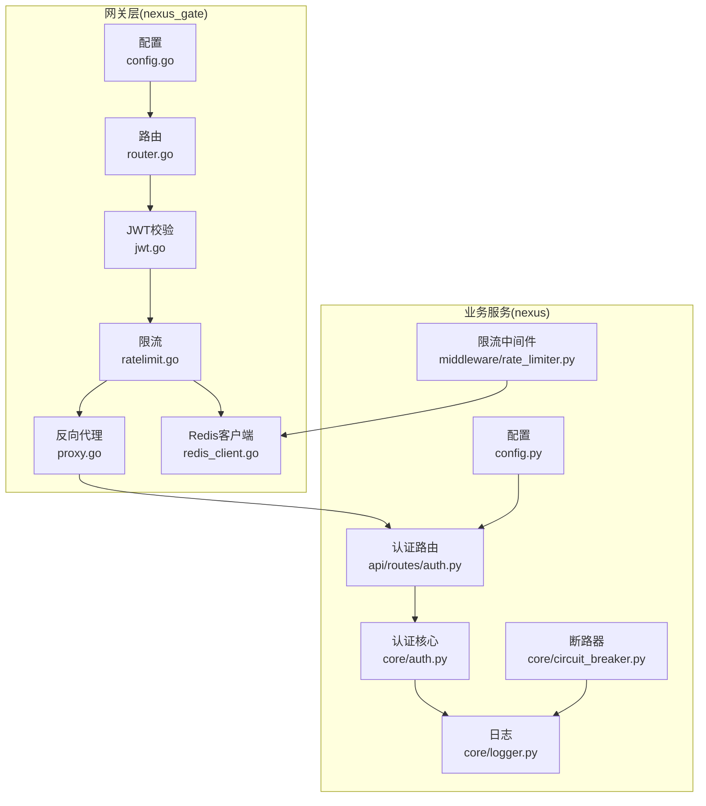
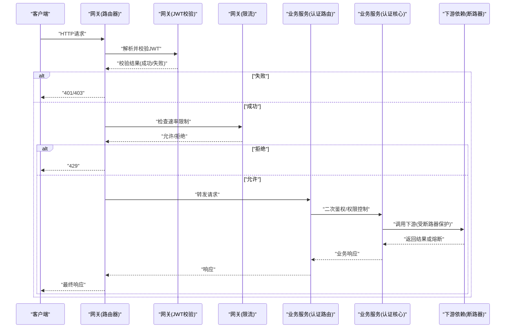
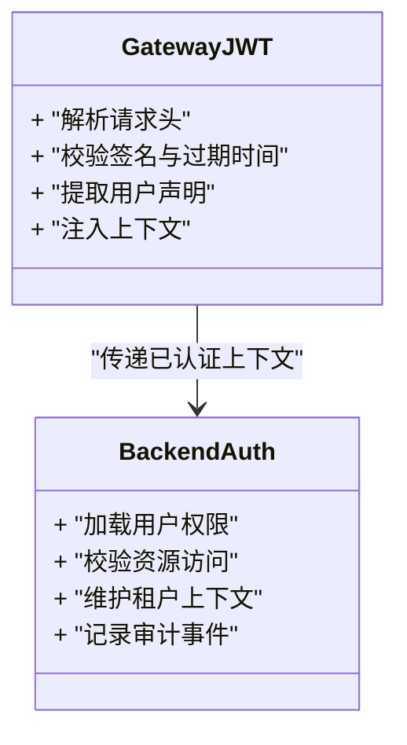
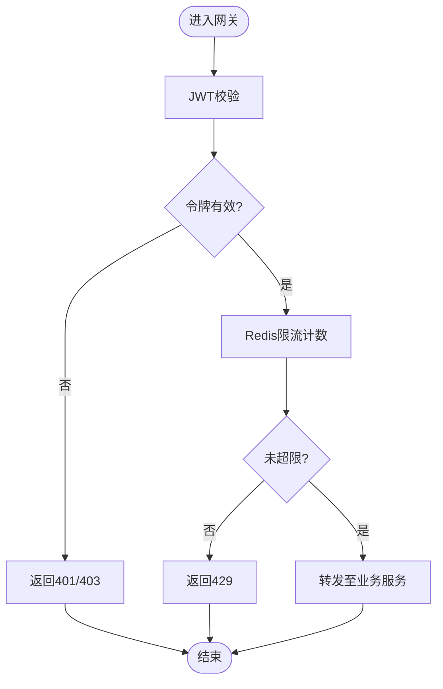
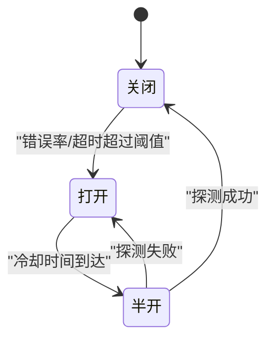
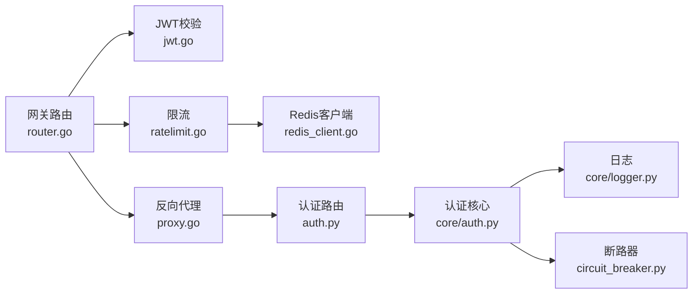

# 安全设计

<cite>
**本文引用的文件**   
- [backend_design/nexus/core/auth.py](file://backend_design/nexus/core/auth.py)
- [backend_design/nexus/api/routes/auth.py](file://backend_design/nexus/api/routes/auth.py)
- [backend_design/nexus/middleware/rate_limiter.py](file://backend_design/nexus/middleware/rate_limiter.py)
- [backend_design/nexus/core/circuit_breaker.py](file://backend_design/nexus/core/circuit_breaker.py)
- [backend_design/nexus/config.py](file://backend_design/nexus/config.py)
- [backend_design/nexus/core/logger.py](file://backend_design/nexus/core/logger.py)
- [backend_design/nexus_gate/internal/auth/jwt.go](file://backend_design/nexus_gate/internal/auth/jwt.go)
- [backend_design/nexus_gate/internal/ratelimit/ratelimit.go](file://backend_design/nexus_gate/internal/ratelimit/ratelimit.go)
- [backend_design/nexus_gate/internal/handlers/redis_client.go](file://backend_design/nexus_gate/internal/handlers/redis_client.go)
- [backend_design/nexus_gate/internal/proxy/proxy.go](file://backend_design/nexus_gate/internal/proxy/proxy.go)
- [backend_design/nexus_gate/internal/router/router.go](file://backend_design/nexus_gate/internal/router/router.go)
- [backend_design/nexus_gate/internal/config/config.go](file://backend_design/nexus_gate/internal/config/config.go)
- [config/nginx/.gitkeep](file://config/nginx/.gitkeep)
</cite>

## 目录
1. [引言](#引言)
2. [项目结构](#项目结构)
3. [核心组件](#核心组件)
4. [架构总览](#架构总览)
5. [详细组件分析](#详细组件分析)
6. [依赖分析](#依赖分析)
7. [性能考虑](#性能考虑)
8. [故障排查指南](#故障排查指南)
9. [结论](#结论)
10. [附录](#附录)

## 引言
本文件聚焦于NexusCockpit的安全设计，覆盖以下关键主题：
- JWT令牌认证与权限控制机制（网关层与后端服务）
- API限流防护与防攻击策略（网关与后端双端）
- 电路断路器的高可用保障机制
- 敏感数据的加密存储与传输安全
- 输入验证与SQL注入防护
- 安全审计与访问日志记录策略
- 安全漏洞扫描与渗透测试实施指南

## 项目结构
本项目采用“网关 + 业务服务”的分层架构。网关（Go）负责鉴权、限流、转发；业务服务（Python）提供API、中间件、核心能力（如断路器、日志等）。

**图表来源**
- [backend_design/nexus_gate/internal/router/router.go:1-200](file://backend_design/nexus_gate/internal/router/router.go#L1-L200)
- [backend_design/nexus_gate/internal/auth/jwt.go:1-200](file://backend_design/nexus_gate/internal/auth/jwt.go#L1-L200)
- [backend_design/nexus_gate/internal/ratelimit/ratelimit.go:1-200](file://backend_design/nexus_gate/internal/ratelimit/ratelimit.go#L1-L200)
- [backend_design/nexus_gate/internal/proxy/proxy.go:1-200](file://backend_design/nexus_gate/internal/proxy/proxy.go#L1-L200)
- [backend_design/nexus_gate/internal/handlers/redis_client.go:1-200](file://backend_design/nexus_gate/internal/handlers/redis_client.go#L1-L200)
- [backend_design/nexus_gate/internal/config/config.go:1-200](file://backend_design/nexus_gate/internal/config/config.go#L1-L200)
- [backend_design/nexus/api/routes/auth.py:1-200](file://backend_design/nexus/api/routes/auth.py#L1-L200)
- [backend_design/nexus/core/auth.py:1-200](file://backend_design/nexus/core/auth.py#L1-L200)
- [backend_design/nexus/middleware/rate_limiter.py:1-200](file://backend_design/nexus/middleware/rate_limiter.py#L1-L200)
- [backend_design/nexus/core/circuit_breaker.py:1-200](file://backend_design/nexus/core/circuit_breaker.py#L1-L200)
- [backend_design/nexus/config.py:1-200](file://backend_design/nexus/config.py#L1-L200)
- [backend_design/nexus/core/logger.py:1-200](file://backend_design/nexus/core/logger.py#L1-L200)

**章节来源**
- [backend_design/nexus_gate/internal/router/router.go:1-200](file://backend_design/nexus_gate/internal/router/router.go#L1-L200)
- [backend_design/nexus_gate/internal/auth/jwt.go:1-200](file://backend_design/nexus_gate/internal/auth/jwt.go#L1-L200)
- [backend_design/nexus_gate/internal/ratelimit/ratelimit.go:1-200](file://backend_design/nexus_gate/internal/ratelimit/ratelimit.go#L1-L200)
- [backend_design/nexus_gate/internal/proxy/proxy.go:1-200](file://backend_design/nexus_gate/internal/proxy/proxy.go#L1-L200)
- [backend_design/nexus_gate/internal/handlers/redis_client.go:1-200](file://backend_design/nexus_gate/internal/handlers/redis_client.go#L1-L200)
- [backend_design/nexus_gate/internal/config/config.go:1-200](file://backend_design/nexus_gate/internal/config/config.go#L1-L200)
- [backend_design/nexus/api/routes/auth.py:1-200](file://backend_design/nexus/api/routes/auth.py#L1-L200)
- [backend_design/nexus/core/auth.py:1-200](file://backend_design/nexus/core/auth.py#L1-L200)
- [backend_design/nexus/middleware/rate_limiter.py:1-200](file://backend_design/nexus/middleware/rate_limiter.py#L1-L200)
- [backend_design/nexus/core/circuit_breaker.py:1-200](file://backend_design/nexus/core/circuit_breaker.py#L1-L200)
- [backend_design/nexus/config.py:1-200](file://backend_design/nexus/config.py#L1-L200)
- [backend_design/nexus/core/logger.py:1-200](file://backend_design/nexus/core/logger.py#L1-L200)

## 核心组件
- 网关鉴权与限流：在请求进入业务前完成JWT校验与速率限制，失败直接拒绝。
- 业务鉴权与上下文：在后端进一步校验用户身份与权限，并维护租户上下文。
- 断路器：对下游依赖进行熔断保护，避免雪崩。
- 限流中间件：基于Redis的分布式限流，支持按IP/用户维度控制。
- 日志与可观测性：统一结构化日志，便于审计与排障。

**章节来源**
- [backend_design/nexus_gate/internal/auth/jwt.go:1-200](file://backend_design/nexus_gate/internal/auth/jwt.go#L1-L200)
- [backend_design/nexus_gate/internal/ratelimit/ratelimit.go:1-200](file://backend_design/nexus_gate/internal/ratelimit/ratelimit.go#L1-L200)
- [backend_design/nexus/api/routes/auth.py:1-200](file://backend_design/nexus/api/routes/auth.py#L1-L200)
- [backend_design/nexus/core/auth.py:1-200](file://backend_design/nexus/core/auth.py#L1-L200)
- [backend_design/nexus/middleware/rate_limiter.py:1-200](file://backend_design/nexus/middleware/rate_limiter.py#L1-L200)
- [backend_design/nexus/core/circuit_breaker.py:1-200](file://backend_design/nexus/core/circuit_breaker.py#L1-L200)
- [backend_design/nexus/core/logger.py:1-200](file://backend_design/nexus/core/logger.py#L1-L200)

## 架构总览
下图展示了从客户端到网关再到业务服务的完整安全链路：网关侧完成JWT校验与限流，业务侧再次校验并执行权限控制，同时通过断路器保护下游依赖。

**图表来源**
- [backend_design/nexus_gate/internal/router/router.go:1-200](file://backend_design/nexus_gate/internal/router/router.go#L1-L200)
- [backend_design/nexus_gate/internal/auth/jwt.go:1-200](file://backend_design/nexus_gate/internal/auth/jwt.go#L1-L200)
- [backend_design/nexus_gate/internal/ratelimit/ratelimit.go:1-200](file://backend_design/nexus_gate/internal/ratelimit/ratelimit.go#L1-L200)
- [backend_design/nexus/api/routes/auth.py:1-200](file://backend_design/nexus/api/routes/auth.py#L1-L200)
- [backend_design/nexus/core/auth.py:1-200](file://backend_design/nexus/core/auth.py#L1-L200)
- [backend_design/nexus/core/circuit_breaker.py:1-200](file://backend_design/nexus/core/circuit_breaker.py#L1-L200)

## 详细组件分析

### JWT令牌认证与权限控制
- 网关侧JWT校验：解析请求头中的令牌，验证签名、有效期与必要声明，将用户标识注入后续处理链。
- 业务侧二次鉴权：根据资源与角色/权限模型进行细粒度授权，结合租户上下文实现多租户隔离。
- 会话与刷新：建议配合短期访问令牌与长期刷新令牌策略，减少重放风险。

**图表来源**
- [backend_design/nexus_gate/internal/auth/jwt.go:1-200](file://backend_design/nexus_gate/internal/auth/jwt.go#L1-L200)
- [backend_design/nexus/api/routes/auth.py:1-200](file://backend_design/nexus/api/routes/auth.py#L1-L200)
- [backend_design/nexus/core/auth.py:1-200](file://backend_design/nexus/core/auth.py#L1-L200)

**章节来源**
- [backend_design/nexus_gate/internal/auth/jwt.go:1-200](file://backend_design/nexus_gate/internal/auth/jwt.go#L1-L200)
- [backend_design/nexus/api/routes/auth.py:1-200](file://backend_design/nexus/api/routes/auth.py#L1-L200)
- [backend_design/nexus/core/auth.py:1-200](file://backend_design/nexus/core/auth.py#L1-L200)

### API限流防护与防攻击策略
- 网关限流：基于Redis的滑动窗口或固定窗口算法，支持按IP、用户ID、路径等维度限流。
- 后端限流：作为兜底，防止单实例绕过网关的情况。
- 防攻击策略：对异常高频请求、异常UA、超大负载等进行识别与拦截，结合黑名单与告警。

**图表来源**
- [backend_design/nexus_gate/internal/ratelimit/ratelimit.go:1-200](file://backend_design/nexus_gate/internal/ratelimit/ratelimit.go#L1-L200)
- [backend_design/nexus_gate/internal/handlers/redis_client.go:1-200](file://backend_design/nexus_gate/internal/handlers/redis_client.go#L1-L200)
- [backend_design/nexus/middleware/rate_limiter.py:1-200](file://backend_design/nexus/middleware/rate_limiter.py#L1-L200)

**章节来源**
- [backend_design/nexus_gate/internal/ratelimit/ratelimit.go:1-200](file://backend_design/nexus_gate/internal/ratelimit/ratelimit.go#L1-L200)
- [backend_design/nexus_gate/internal/handlers/redis_client.go:1-200](file://backend_design/nexus_gate/internal/handlers/redis_client.go#L1-L200)
- [backend_design/nexus/middleware/rate_limiter.py:1-200](file://backend_design/nexus/middleware/rate_limiter.py#L1-L200)

### 电路断路器的高可用保障
- 状态机：关闭→打开→半开，依据错误率/超时阈值切换。
- 降级与快速失败：在打开状态下直接返回降级响应，避免级联故障。
- 监控与恢复：持续探测健康度，达到阈值后自动恢复。

**图表来源**
- [backend_design/nexus/core/circuit_breaker.py:1-200](file://backend_design/nexus/core/circuit_breaker.py#L1-L200)

**章节来源**
- [backend_design/nexus/core/circuit_breaker.py:1-200](file://backend_design/nexus/core/circuit_breaker.py#L1-L200)

### 敏感数据的加密存储与传输安全
- 传输安全：强制HTTPS，启用TLS 1.2+，禁用弱密码套件；网关与上游服务间使用mTLS可选。
- 存储安全：口令使用强哈希加盐（如bcrypt/argon2），密钥与证书集中管理，避免硬编码。
- 配置安全：敏感配置通过环境变量或密钥管理服务注入，不在代码仓库中明文存放。

**章节来源**
- [backend_design/nexus/config.py:1-200](file://backend_design/nexus/config.py#L1-L200)
- [backend_design/nexus_gate/internal/config/config.go:1-200](file://backend_design/nexus_gate/internal/config/config.go#L1-L200)

### 输入验证与SQL注入防护
- 输入验证：对所有外部输入进行白名单校验、类型与长度约束、格式校验。
- SQL注入防护：使用参数化查询与ORM，禁止拼接SQL字符串；对动态字段名进行严格映射。
- 输出编码：对渲染内容做适当编码，防范XSS。

[本节为通用安全实践说明，不直接分析具体文件]

### 安全审计与访问日志记录策略
- 统一日志：结构化JSON格式，包含时间戳、请求ID、客户端IP、用户标识、操作对象、结果码、耗时等。
- 敏感信息脱敏：日志中避免记录口令、令牌、卡号等敏感数据。
- 留存与检索：集中收集至日志系统，设置保留策略与索引优化，便于审计与取证。

**章节来源**
- [backend_design/nexus/core/logger.py:1-200](file://backend_design/nexus/core/logger.py#L1-L200)

### 安全漏洞扫描与渗透测试实施指南
- 静态扫描：集成SCA/SAST工具，CI流水线阻断高危漏洞。
- 动态扫描：对预发环境进行DAST扫描，关注鉴权、限流、注入等关键点。
- 渗透测试：定期开展红蓝对抗，覆盖JWT伪造、越权、限流绕过、缓存投毒等场景。
- 修复闭环：建立漏洞分级与SLA，跟踪修复与回归验证。

[本节为通用流程说明，不直接分析具体文件]

## 依赖分析
网关与业务服务的关键依赖关系如下：

**图表来源**
- [backend_design/nexus_gate/internal/router/router.go:1-200](file://backend_design/nexus_gate/internal/router/router.go#L1-L200)
- [backend_design/nexus_gate/internal/auth/jwt.go:1-200](file://backend_design/nexus_gate/internal/auth/jwt.go#L1-L200)
- [backend_design/nexus_gate/internal/ratelimit/ratelimit.go:1-200](file://backend_design/nexus_gate/internal/ratelimit/ratelimit.go#L1-L200)
- [backend_design/nexus_gate/internal/handlers/redis_client.go:1-200](file://backend_design/nexus_gate/internal/handlers/redis_client.go#L1-L200)
- [backend_design/nexus_gate/internal/proxy/proxy.go:1-200](file://backend_design/nexus_gate/internal/proxy/proxy.go#L1-L200)
- [backend_design/nexus/api/routes/auth.py:1-200](file://backend_design/nexus/api/routes/auth.py#L1-L200)
- [backend_design/nexus/core/auth.py:1-200](file://backend_design/nexus/core/auth.py#L1-L200)
- [backend_design/nexus/core/circuit_breaker.py:1-200](file://backend_design/nexus/core/circuit_breaker.py#L1-L200)
- [backend_design/nexus/core/logger.py:1-200](file://backend_design/nexus/core/logger.py#L1-L200)

**章节来源**
- [backend_design/nexus_gate/internal/router/router.go:1-200](file://backend_design/nexus_gate/internal/router/router.go#L1-L200)
- [backend_design/nexus_gate/internal/auth/jwt.go:1-200](file://backend_design/nexus_gate/internal/auth/jwt.go#L1-L200)
- [backend_design/nexus_gate/internal/ratelimit/ratelimit.go:1-200](file://backend_design/nexus_gate/internal/ratelimit/ratelimit.go#L1-L200)
- [backend_design/nexus_gate/internal/handlers/redis_client.go:1-200](file://backend_design/nexus_gate/internal/handlers/redis_client.go#L1-L200)
- [backend_design/nexus_gate/internal/proxy/proxy.go:1-200](file://backend_design/nexus_gate/internal/proxy/proxy.go#L1-L200)
- [backend_design/nexus/api/routes/auth.py:1-200](file://backend_design/nexus/api/routes/auth.py#L1-L200)
- [backend_design/nexus/core/auth.py:1-200](file://backend_design/nexus/core/auth.py#L1-L200)
- [backend_design/nexus/core/circuit_breaker.py:1-200](file://backend_design/nexus/core/circuit_breaker.py#L1-L200)
- [backend_design/nexus/core/logger.py:1-200](file://backend_design/nexus/core/logger.py#L1-L200)

## 性能考虑
- 限流计算尽量在网关侧完成，降低后端压力；Redis键空间设计需考虑热点与分片。
- 断路器阈值与冷却时间应结合业务指标调优，避免误判导致频繁抖动。
- 日志写入异步化，避免阻塞主流程；大体积日志采样与轮转。

[本节为通用性能指导，不直接分析具体文件]

## 故障排查指南
- 鉴权失败：检查JWT签名、过期时间、密钥一致性；核对网关与业务侧配置。
- 限流触发：查看Redis计数键与限流规则；确认是否因同一IP/用户突发流量。
- 断路器打开：观察错误率与超时分布；定位下游依赖异常并进行隔离。
- 日志缺失：确认日志采集链路、磁盘空间与权限；核对脱敏规则是否过滤了关键字段。

**章节来源**
- [backend_design/nexus_gate/internal/auth/jwt.go:1-200](file://backend_design/nexus_gate/internal/auth/jwt.go#L1-L200)
- [backend_design/nexus_gate/internal/ratelimit/ratelimit.go:1-200](file://backend_design/nexus_gate/internal/ratelimit/ratelimit.go#L1-L200)
- [backend_design/nexus_gate/internal/handlers/redis_client.go:1-200](file://backend_design/nexus_gate/internal/handlers/redis_client.go#L1-L200)
- [backend_design/nexus/core/circuit_breaker.py:1-200](file://backend_design/nexus/core/circuit_breaker.py#L1-L200)
- [backend_design/nexus/core/logger.py:1-200](file://backend_design/nexus/core/logger.py#L1-L200)

## 结论
通过网关与业务服务的双层鉴权、分布式限流、断路器保护、统一日志与配置安全管理，系统在可用性、可控性与可观测性方面形成闭环。建议持续完善输入校验、SQL注入防护与自动化安全扫描，以应对不断演进的威胁面。

## 附录
- Nginx配置目录用于部署反向代理与TLS终止，可按需启用HSTS、安全头与访问日志。

**章节来源**
- [config/nginx/.gitkeep](file://config/nginx/.gitkeep)