# 数据安全保护

<cite>
**本文引用的文件**   
- [backend_design/nexus/core/auth.py](file://backend_design/nexus/core/auth.py)
- [backend_design/nexus/api/routes/auth.py](file://backend_design/nexus/api/routes/auth.py)
- [backend_design/nexus/core/db_manager.py](file://backend_design/nexus/core/db_manager.py)
- [backend_design/nexus/middleware/session_store.py](file://backend_design/nexus/middleware/session_store.py)
- [backend_design/nexus/observability/data_retention.py](file://backend_design/nexus/observability/data_retention.py)
- [backend_design/nexus_gate/internal/auth/jwt.go](file://backend_design/nexus_gate/internal/auth/jwt.go)
- [backend_design/nexus_gate/internal/config/config.go](file://backend_design/nexus_gate/internal/config/config.go)
- [backend_design/nexus_gate/internal/proxy/proxy.go](file://backend_design/nexus_gate/internal/proxy/proxy.go)
- [backend_design/nexus/core/logger.py](file://backend_design/nexus/core/logger.py)
- [backend_design/nexus/core/circuit_breaker.py](file://backend_design/nexus/core/circuit熔断器.py)
- [backend_design/nexus/models/schemas.py](file://backend_design/nexus/models/schemas.py)
- [config/prometheus/prometheus.yml](file://config/prometheus/prometheus.yml)
- [docker-compose.yml](file://docker-compose.yml)
</cite>

## 目录
1. [引言](#引言)
2. [项目结构](#项目结构)
3. [核心组件](#核心组件)
4. [架构总览](#架构总览)
5. [详细组件分析](#详细组件分析)
6. [依赖关系分析](#依赖关系分析)
7. [性能考虑](#性能考虑)
8. [故障排查指南](#故障排查指南)
9. [结论](#结论)
10. [附录](#附录)

## 引言
本技术文档聚焦于系统的数据安全保护，覆盖以下关键主题：
- 敏感数据的加密存储与传输加密协议
- 数据库访问控制与字段级权限管理
- 用户隐私数据的匿名化与脱敏处理
- 数据备份恢复的安全策略与数据生命周期管理
- 内存数据清理与安全销毁机制
- 数据泄露检测与响应预案

文档基于仓库中后端服务、网关、中间件与可观测性模块的实现进行梳理，并结合配置项给出落地建议。

## 项目结构
从安全视角看，本项目在以下位置涉及数据安全相关能力：
- 认证与鉴权：后端认证逻辑、API 路由鉴权、网关 JWT 校验
- 会话与缓存：会话存储、速率限制、缓存中间件
- 数据持久化：数据库连接管理与模型定义
- 可观测性与生命周期：日志、指标、数据保留策略
- 网关层：TLS 终止、请求代理、鉴权转发
- 基础设施配置：Prometheus 监控、容器编排

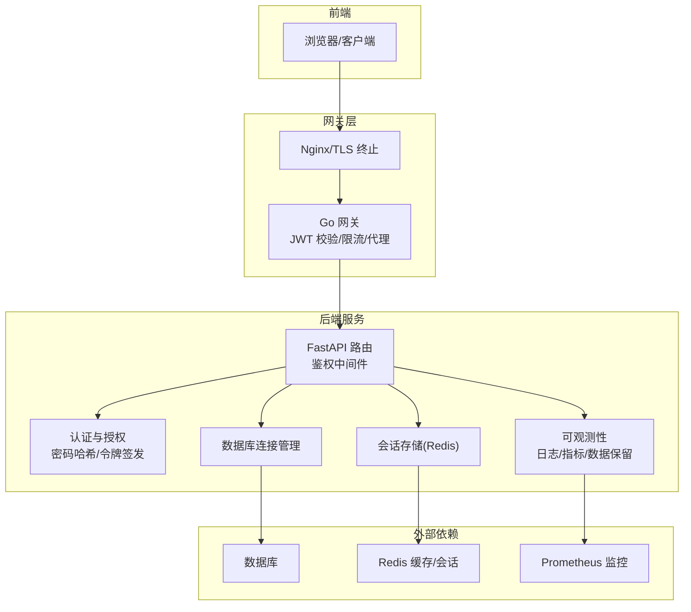

图表来源
- [backend_design/nexus_gate/internal/proxy/proxy.go](file://backend_design/nexus_gate/internal/proxy/proxy.go)
- [backend_design/nexus_gate/internal/auth/jwt.go](file://backend_design/nexus_gate/internal/auth/jwt.go)
- [backend_design/nexus/api/routes/auth.py](file://backend_design/nexus/api/routes/auth.py)
- [backend_design/nexus/core/auth.py](file://backend_design/nexus/core/auth.py)
- [backend_design/nexus/core/db_manager.py](file://backend_design/nexus/core/db_manager.py)
- [backend_design/nexus/middleware/session_store.py](file://backend_design/nexus/middleware/session_store.py)
- [backend_design/nexus/observability/data_retention.py](file://backend_design/nexus/observability/data_retention.py)
- [config/prometheus/prometheus.yml](file://config/prometheus/prometheus.yml)

章节来源
- [backend_design/nexus/core/auth.py](file://backend_design/nexus/core/auth.py)
- [backend_design/nexus/api/routes/auth.py](file://backend_design/nexus/api/routes/auth.py)
- [backend_design/nexus/core/db_manager.py](file://backend_design/nexus/core/db_manager.py)
- [backend_design/nexus/middleware/session_store.py](file://backend_design/nexus/middleware/session_store.py)
- [backend_design/nexus/observability/data_retention.py](file://backend_design/nexus/observability/data_retention.py)
- [backend_design/nexus_gate/internal/auth/jwt.go](file://backend_design/nexus_gate/internal/auth/jwt.go)
- [backend_design/nexus_gate/internal/proxy/proxy.go](file://backend_design/nexus_gate/internal/proxy/proxy.go)
- [config/prometheus/prometheus.yml](file://config/prometheus/prometheus.yml)

## 核心组件
- 认证与授权
  - 后端认证：负责用户身份验证、密码校验、令牌签发与校验、权限上下文注入。
  - 网关鉴权：统一入口的 JWT 校验、签名验证、过期检查与错误返回。
- 会话与缓存
  - 会话存储：将会话信息持久化到 Redis，支持过期时间、隔离与清理。
- 数据持久化
  - 数据库连接管理：连接池、事务、SQL 执行封装；建议结合参数化查询与最小权限原则。
- 可观测性与生命周期
  - 日志与指标：记录安全事件（登录失败、鉴权拒绝等），暴露 Prometheus 指标。
  - 数据保留策略：按策略清理历史数据，降低长期留存风险。
- 网关层
  - TLS 终止与代理：对外提供 HTTPS，内部走明文或内网加密；统一鉴权与限流。

章节来源
- [backend_design/nexus/core/auth.py](file://backend_design/nexus/core/auth.py)
- [backend_design/nexus/api/routes/auth.py](file://backend_design/nexus/api/routes/auth.py)
- [backend_design/nexus_gate/internal/auth/jwt.go](file://backend_design/nexus_gate/internal/auth/jwt.go)
- [backend_design/nexus/middleware/session_store.py](file://backend_design/nexus/middleware/session_store.py)
- [backend_design/nexus/core/db_manager.py](file://backend_design/nexus/core/db_manager.py)
- [backend_design/nexus/observability/data_retention.py](file://backend_design/nexus/observability/data_retention.py)

## 架构总览
下图展示端到端的数据安全关键路径：客户端通过 HTTPS 访问网关，网关完成 JWT 校验后转发至后端；后端对敏感数据进行鉴权、脱敏与持久化，并通过会话与缓存提升安全性与可用性。

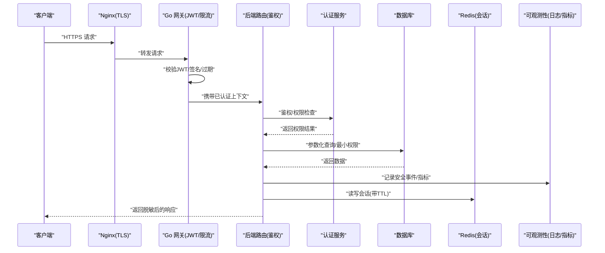

图表来源
- [backend_design/nexus_gate/internal/proxy/proxy.go](file://backend_design/nexus_gate/internal/proxy/proxy.go)
- [backend_design/nexus_gate/internal/auth/jwt.go](file://backend_design/nexus_gate/internal/auth/jwt.go)
- [backend_design/nexus/api/routes/auth.py](file://backend_design/nexus/api/routes/auth.py)
- [backend_design/nexus/core/auth.py](file://backend_design/nexus/core/auth.py)
- [backend_design/nexus/core/db_manager.py](file://backend_design/nexus/core/db_manager.py)
- [backend_design/nexus/middleware/session_store.py](file://backend_design/nexus/middleware/session_store.py)
- [backend_design/nexus/observability/data_retention.py](file://backend_design/nexus/observability/data_retention.py)

## 详细组件分析

### 认证与授权（后端）
- 功能要点
  - 用户登录与密码校验：使用安全的哈希算法与盐值，避免明文存储。
  - 令牌签发与校验：生成短期有效的访问令牌，包含必要声明；服务端校验签名与过期。
  - 权限上下文：将用户角色、租户等信息注入请求上下文，供后续鉴权使用。
- 安全建议
  - 强制使用强密码策略与多因素认证（可扩展）。
  - 令牌采用最小声明原则，避免在令牌中存放敏感信息。
  - 对鉴权失败与异常进行审计日志记录。

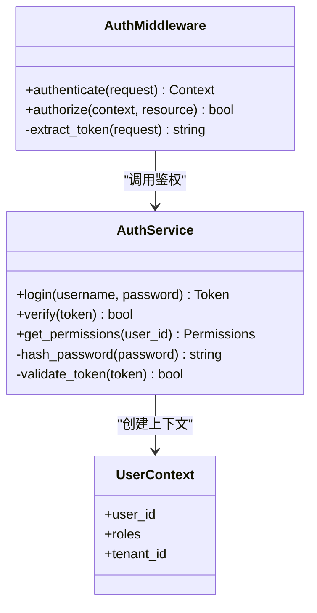

图表来源
- [backend_design/nexus/core/auth.py](file://backend_design/nexus/core/auth.py)
- [backend_design/nexus/api/routes/auth.py](file://backend_design/nexus/api/routes/auth.py)

章节来源
- [backend_design/nexus/core/auth.py](file://backend_design/nexus/core/auth.py)
- [backend_design/nexus/api/routes/auth.py](file://backend_design/nexus/api/routes/auth.py)

### 网关鉴权（JWT）
- 功能要点
  - 统一入口校验 JWT 签名、有效期与必要声明。
  - 将认证结果注入下游请求头或上下文，减少重复校验。
  - 限流与异常返回，防止暴力破解与滥用。
- 安全建议
  - 密钥轮换与版本兼容策略。
  - 严格白名单域名与 CORS 策略。
  - 对异常与失败进行集中告警。

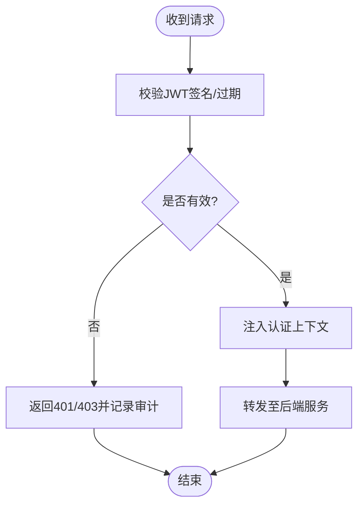

图表来源
- [backend_design/nexus_gate/internal/auth/jwt.go](file://backend_design/nexus_gate/internal/auth/jwt.go)
- [backend_design/nexus_gate/internal/proxy/proxy.go](file://backend_design/nexus_gate/internal/proxy/proxy.go)

章节来源
- [backend_design/nexus_gate/internal/auth/jwt.go](file://backend_design/nexus_gate/internal/auth/jwt.go)
- [backend_design/nexus_gate/internal/proxy/proxy.go](file://backend_design/nexus_gate/internal/proxy/proxy.go)

### 会话存储（Redis）
- 功能要点
  - 会话键命名规范与隔离（如按租户/用户）。
  - TTL 设置与会话刷新策略。
  - 会话删除与清理任务，避免残留。
- 安全建议
  - 启用 Redis 认证与网络隔离。
  - 禁止在会话中存放敏感明文。
  - 定期审计会话大小与异常增长。

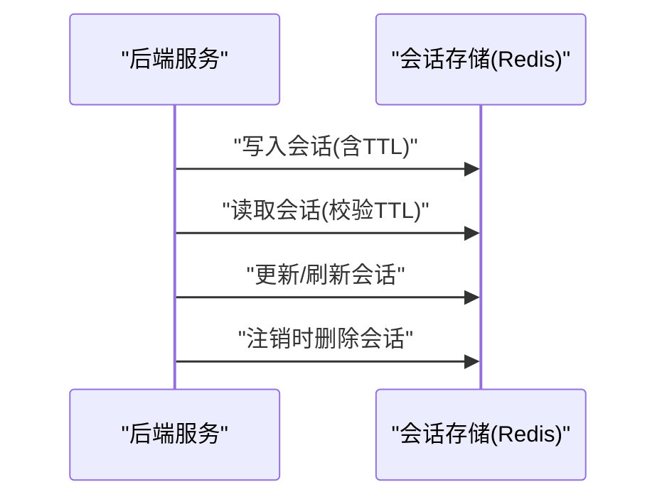

图表来源
- [backend_design/nexus/middleware/session_store.py](file://backend_design/nexus/middleware/session_store.py)

章节来源
- [backend_design/nexus/middleware/session_store.py](file://backend_design/nexus/middleware/session_store.py)

### 数据库访问控制与字段级权限
- 功能要点
  - 连接管理：连接池、事务、错误重试与熔断。
  - 参数化查询：防止 SQL 注入。
  - 最小权限：为应用账户授予最小必要权限。
- 字段级权限
  - 在模型层或序列化层对敏感字段进行过滤与脱敏。
  - 根据角色动态选择可见字段集合。
- 安全建议
  - 使用只读副本用于报表与分析。
  - 对高敏感字段进行加密存储（见“加密存储”小节）。

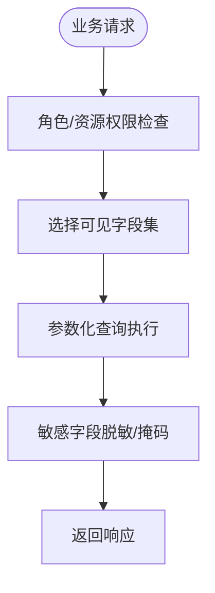

图表来源
- [backend_design/nexus/core/db_manager.py](file://backend_design/nexus/core/db_manager.py)
- [backend_design/nexus/models/schemas.py](file://backend_design/nexus/models/schemas.py)

章节来源
- [backend_design/nexus/core/db_manager.py](file://backend_design/nexus/core/db_manager.py)
- [backend_design/nexus/models/schemas.py](file://backend_design/nexus/models/schemas.py)

### 数据加密存储与传输
- 传输加密
  - 网关层终止 TLS，确保客户端到网关的链路加密。
  - 内网服务间通信建议使用 mTLS 或受控明文通道（需网络隔离与审计）。
- 存储加密
  - 对高敏感字段（如个人身份信息、凭证）进行应用层加密或使用 KMS 托管密钥。
  - 密钥轮换与版本管理，避免单点失效。
- 安全建议
  - 禁用弱加密套件与过时协议版本。
  - 证书与密钥纳入配置中心与机密管理。

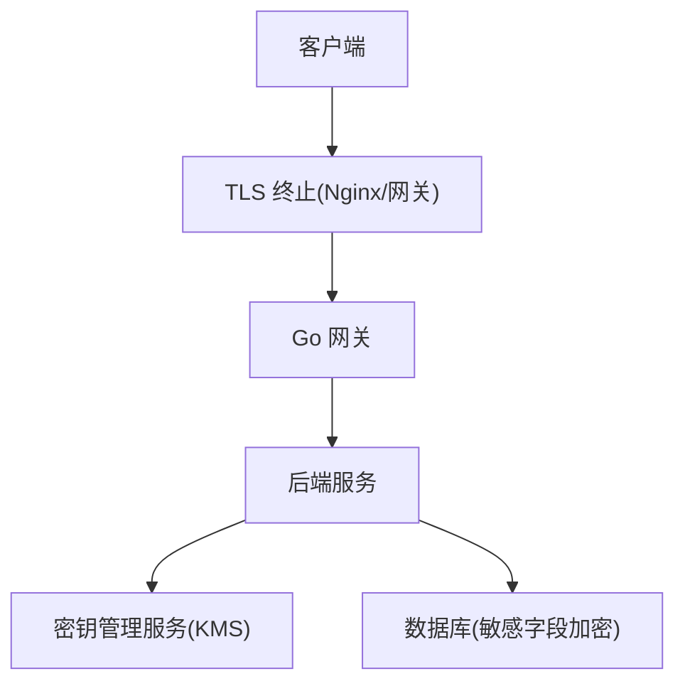

图表来源
- [backend_design/nexus_gate/internal/proxy/proxy.go](file://backend_design/nexus_gate/internal/proxy/proxy.go)
- [backend_design/nexus/core/db_manager.py](file://backend_design/nexus/core/db_manager.py)

章节来源
- [backend_design/nexus_gate/internal/proxy/proxy.go](file://backend_design/nexus_gate/internal/proxy/proxy.go)
- [backend_design/nexus/core/db_manager.py](file://backend_design/nexus/core/db_manager.py)

### 用户隐私数据的匿名化与脱敏
- 匿名化
  - 在分析、测试与日志中使用不可逆的标识替换真实身份。
- 脱敏
  - 输出前对敏感字段进行掩码或部分隐藏。
  - 根据角色与场景决定脱敏级别。
- 安全建议
  - 建立统一的脱敏规则库与开关。
  - 对导出与共享流程增加审批与审计。

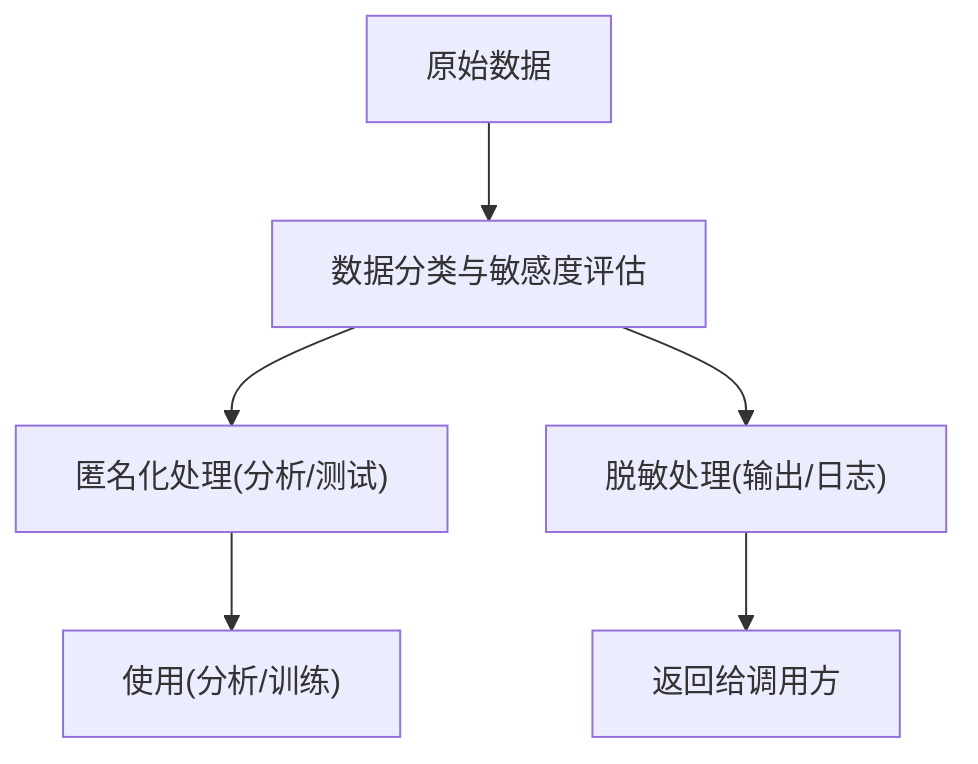

[此图为概念流程图，不直接映射具体源码文件]

### 数据备份恢复的安全策略与生命周期管理
- 备份安全
  - 备份数据加密存储与传输，限制访问权限。
  - 异地容灾与版本化，定期演练恢复。
- 生命周期
  - 数据保留策略：按合规要求设定保留期与自动清理。
  - 归档与冷存储：对历史数据迁移到低成本介质。
- 可观测性
  - 指标与日志记录备份与清理执行情况。

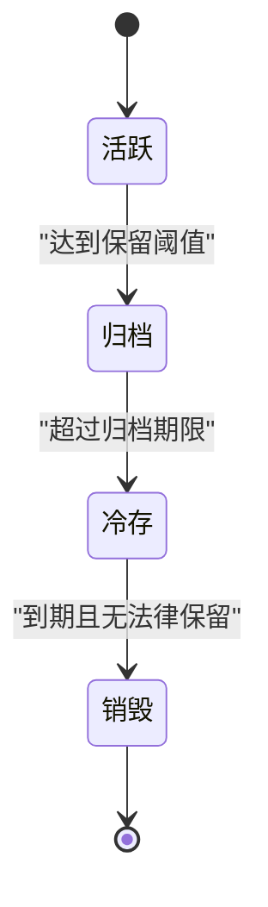

图表来源
- [backend_design/nexus/observability/data_retention.py](file://backend_design/nexus/observability/data_retention.py)

章节来源
- [backend_design/nexus/observability/data_retention.py](file://backend_design/nexus/observability/data_retention.py)

### 内存数据清理与安全销毁
- 清理策略
  - 请求结束后立即释放临时对象引用。
  - 对敏感缓冲区进行覆写清零。
- 安全销毁
  - 退出时清理会话、令牌与缓存中的敏感数据。
  - 进程回收前触发安全销毁钩子。
- 安全建议
  - 避免在日志与堆栈中打印敏感信息。
  - 使用安全内存分配库（如适用）。

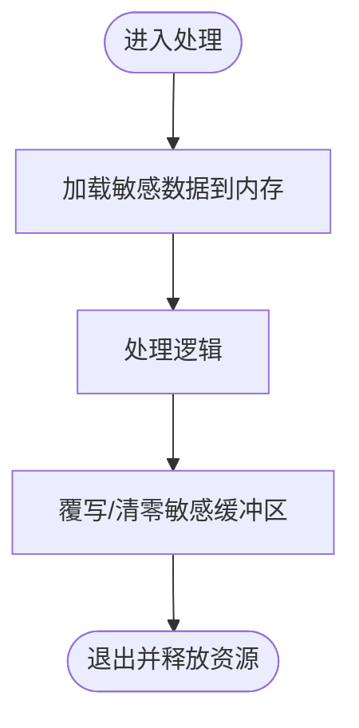

[此图为概念流程图，不直接映射具体源码文件]

### 数据泄露检测与响应预案
- 检测
  - 集中采集安全事件（登录失败、鉴权拒绝、异常访问）。
  - 指标与日志聚合，设置阈值与告警。
- 响应
  - 自动封禁可疑 IP/账号。
  - 触发工单与通知，启动调查与取证。
- 持续改进
  - 复盘与加固策略，更新规则与阈值。

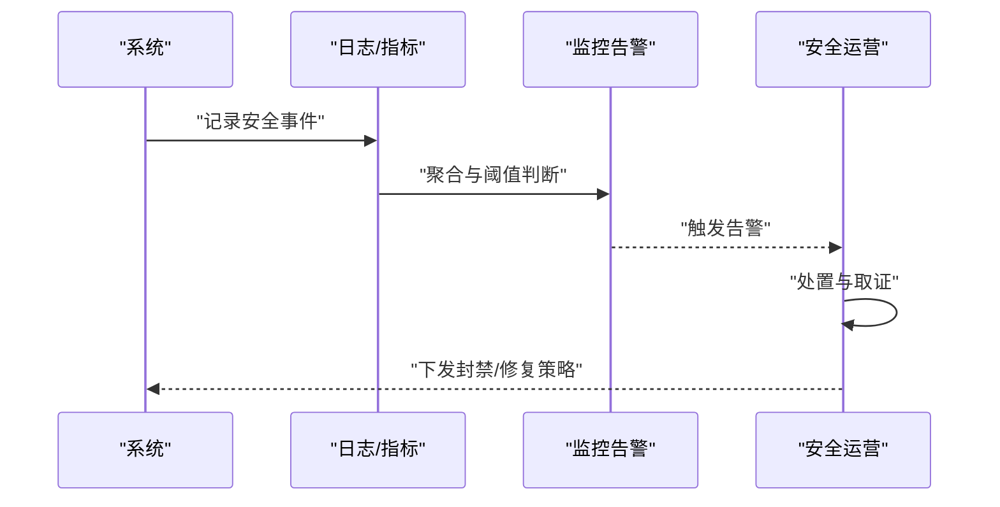

图表来源
- [backend_design/nexus/core/logger.py](file://backend_design/nexus/core/logger.py)
- [config/prometheus/prometheus.yml](file://config/prometheus/prometheus.yml)

章节来源
- [backend_design/nexus/core/logger.py](file://backend_design/nexus/core/logger.py)
- [config/prometheus/prometheus.yml](file://config/prometheus/prometheus.yml)

## 依赖关系分析
- 组件耦合
  - 网关与后端通过 HTTP/gRPC 交互，鉴权由网关前置校验，后端二次校验。
  - 后端依赖数据库与 Redis，分别承担持久化与会话存储。
  - 可观测性模块贯穿各层，提供审计与指标。
- 外部依赖
  - Prometheus 用于指标采集与可视化。
  - 容器编排（Docker Compose）用于环境部署与服务发现。

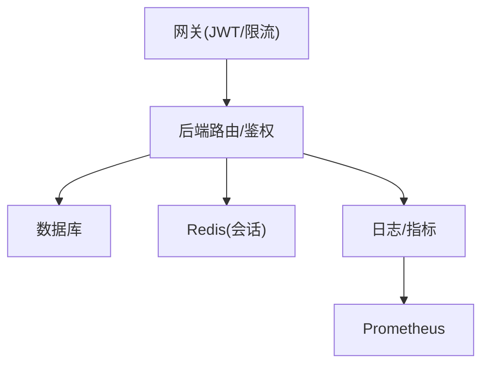

图表来源
- [backend_design/nexus_gate/internal/auth/jwt.go](file://backend_design/nexus_gate/internal/auth/jwt.go)
- [backend_design/nexus/api/routes/auth.py](file://backend_design/nexus/api/routes/auth.py)
- [backend_design/nexus/core/db_manager.py](file://backend_design/nexus/core/db_manager.py)
- [backend_design/nexus/middleware/session_store.py](file://backend_design/nexus/middleware/session_store.py)
- [backend_design/nexus/observability/data_retention.py](file://backend_design/nexus/observability/data_retention.py)
- [config/prometheus/prometheus.yml](file://config/prometheus/prometheus.yml)

章节来源
- [backend_design/nexus_gate/internal/auth/jwt.go](file://backend_design/nexus_gate/internal/auth/jwt.go)
- [backend_design/nexus/api/routes/auth.py](file://backend_design/nexus/api/routes/auth.py)
- [backend_design/nexus/core/db_manager.py](file://backend_design/nexus/core/db_manager.py)
- [backend_design/nexus/middleware/session_store.py](file://backend_design/nexus/middleware/session_store.py)
- [backend_design/nexus/observability/data_retention.py](file://backend_design/nexus/observability/data_retention.py)
- [config/prometheus/prometheus.yml](file://config/prometheus/prometheus.yml)

## 性能考虑
- 鉴权开销
  - 网关层缓存公钥与令牌黑名单，减少重复计算。
  - 后端侧使用本地缓存与短 TTL 提升鉴权效率。
- 数据库与缓存
  - 合理设置连接池大小与超时，避免锁竞争。
  - 会话与热点数据缓存，降低数据库压力。
- 可观测性
  - 采样与异步上报，避免影响主链路性能。

[本节为通用指导，不直接分析具体文件]

## 故障排查指南
- 常见问题
  - 登录失败与鉴权拒绝：检查 JWT 签名、过期时间与权限配置。
  - 会话丢失：确认 Redis 连通性与 TTL 设置。
  - 数据库连接异常：查看连接池状态与错误日志。
- 定位方法
  - 查看安全事件日志与指标，定位异常时间点。
  - 复现路径与最小用例，逐步缩小范围。
- 恢复措施
  - 重启受影响服务，清理异常会话。
  - 回滚最近变更，必要时启用降级策略。

章节来源
- [backend_design/nexus/core/logger.py](file://backend_design/nexus/core/logger.py)
- [backend_design/nexus/core/circuit_breaker.py](file://backend_design/nexus/core/circuit熔断器.py)

## 结论
通过在网关与后端分层实施鉴权、在传输与存储层面落实加密、在数据生命周期中贯彻脱敏与保留策略，并在可观测性体系下实现泄露检测与快速响应，本项目构建了较为完整的数据安全保护闭环。建议持续完善密钥管理、字段级权限与自动化响应能力，以应对不断变化的安全威胁。

## 附录
- 参考配置
  - Prometheus 抓取配置示例：[config/prometheus/prometheus.yml](file://config/prometheus/prometheus.yml)
  - 容器编排与环境变量：[docker-compose.yml](file://docker-compose.yml)

章节来源
- [config/prometheus/prometheus.yml](file://config/prometheus/prometheus.yml)
- [docker-compose.yml](file://docker-compose.yml)