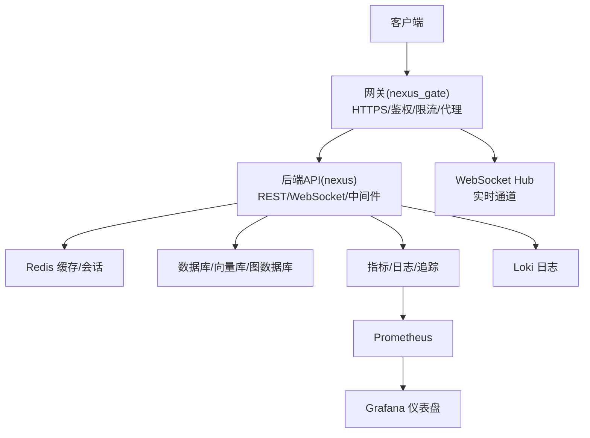
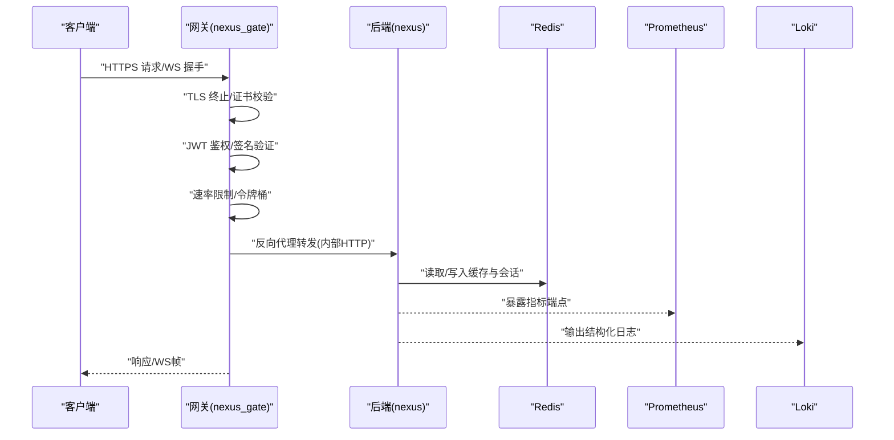
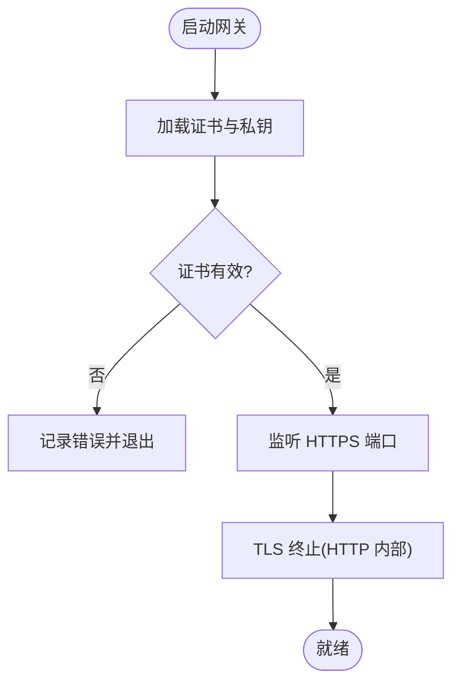
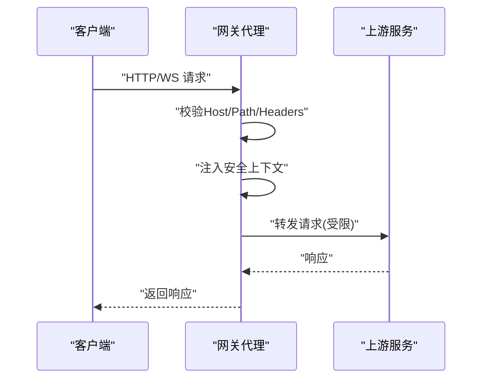
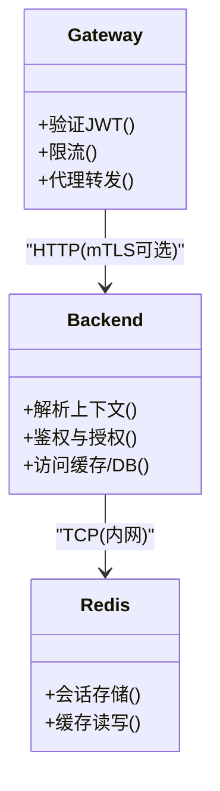
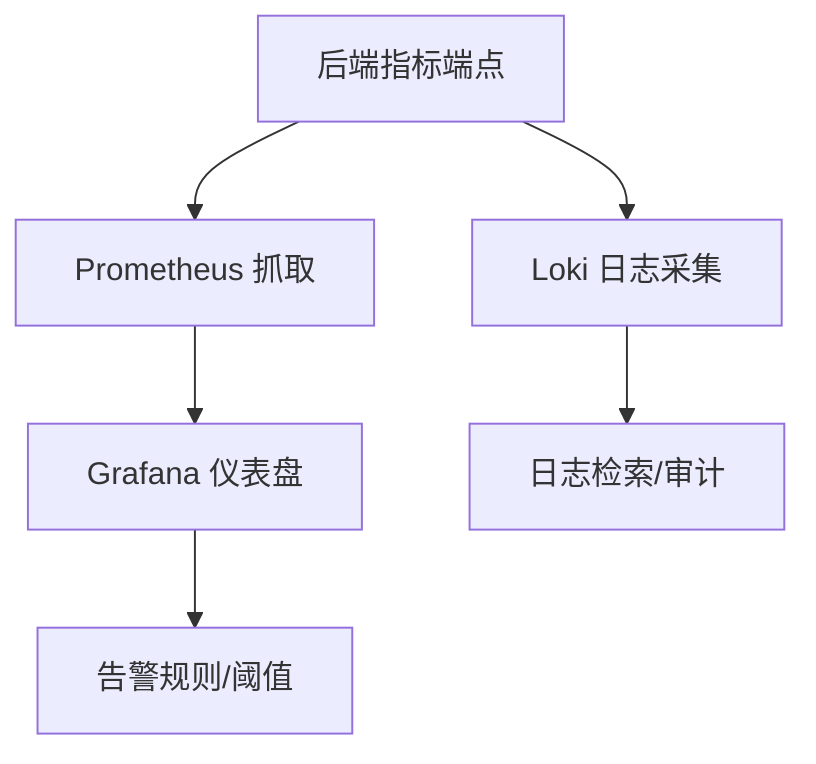
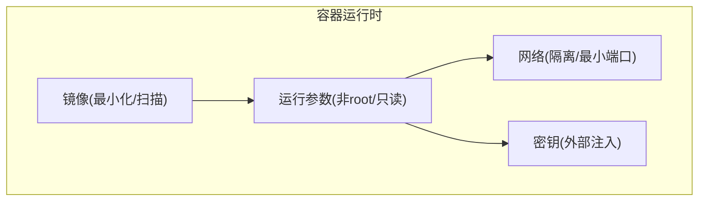
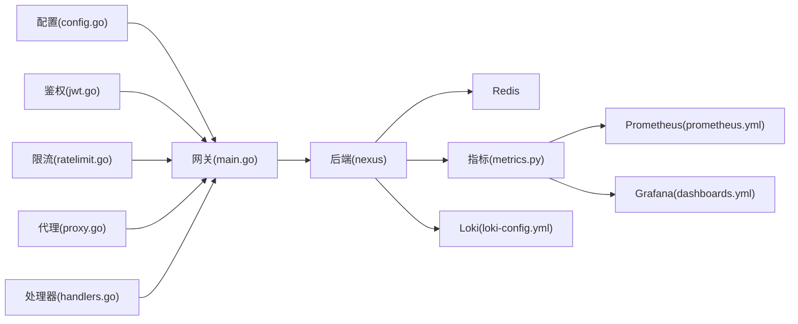

# 网络安全防护

<cite>
**本文引用的文件**   
- [docker-compose.yml](file://docker-compose.yml)
- [Dockerfile (backend)](file://backend_design/Dockerfile)
- [Dockerfile (frontend)](file://frontend_design/Dockerfile)
- [Dockerfile (gateway)](file://backend_design/nexus_gate/Dockerfile)
- [config.go (gateway)](file://backend_design/nexus_gate/internal/config/config.go)
- [proxy.go (gateway)](file://backend_design/nexus_gate/internal/proxy/proxy.go)
- [handlers.go (gateway)](file://backend_design/nexus_gate/internal/handlers/handlers.go)
- [jwt.go (gateway)](file://backend_design/nexus_gate/internal/auth/jwt.go)
- [ratelimit.go (gateway)](file://backend_design/nexus_gate/internal/ratelimit/ratelimit.go)
- [router.go (gateway)](file://backend_design/nexus_gate/internal/router/router.go)
- [main.go (gateway)](file://backend_design/nexus_gate/cmd/main.go)
- [ssl_fix.py](file://backend_design/nexus/core/ssl_fix.py)
- [auth.py (backend core)](file://backend_design/nexus/core/auth.py)
- [rate_limiter.py](file://backend_design/nexus/middleware/rate_limiter.py)
- [redis_cache.py](file://backend_design/nexus/middleware/redis_cache.py)
- [cockpit_metrics.py](file://backend_design/nexus/observability/cockpit_metrics.py)
- [metrics.py](file://backend_design/nexus/observability/metrics.py)
- [prometheus.yml](file://config/prometheus/prometheus.yml)
- [dashboards.yml](file://config/grafana/provisioning/dashboards/dashboards.yml)
- [nexuscockpit-overview.json](file://config/grafana/provisioning/dashboards/nexuscockpit-overview.json)
- [loki-config.yml](file://config/loki/loki-config.yml)
</cite>

## 目录
1. [简介](#简介)
2. [项目结构](#项目结构)
3. [核心组件](#核心组件)
4. [架构总览](#架构总览)
5. [详细组件分析](#详细组件分析)
6. [依赖分析](#依赖分析)
7. [性能考虑](#性能考虑)
8. [故障排查指南](#故障排查指南)
9. [结论](#结论)
10. [附录](#附录)

## 简介
本技术文档聚焦于项目的网络安全防护，覆盖以下关键主题：
- HTTPS/TLS 配置与证书管理策略
- 反向代理的安全配置与请求转发防护
- 微服务间通信的安全认证与加密传输
- 防火墙规则与端口安全配置
- 网络监控与异常流量检测机制
- 容器网络安全最佳实践与 Docker 安全配置

文档基于仓库中网关（Go）、后端（Python）、前端（Next.js）以及可观测性组件（Prometheus/Grafana/Loki）的实际实现进行梳理，并提供架构图、序列图与流程图以辅助理解。

## 项目结构
本项目采用多语言微服务架构：
- 网关层（Go）：负责外部入口、鉴权、限流、反向代理与 WebSocket 转发
- 业务后端（Python）：提供 REST/WebSocket API、中间件（限流、缓存、会话）、可观测性指标
- 前端（Next.js）：通过网关访问后端
- 可观测性：Prometheus 抓取指标，Grafana 展示仪表盘，Loki 收集日志
- 编排与容器化：docker-compose 编排服务，各服务独立 Dockerfile

[本节为概念性概述，不直接分析具体文件，故无“章节来源”]

## 核心组件
- 网关（nexus_gate）
  - 启动与配置加载
  - JWT 鉴权与速率限制
  - 反向代理与 WebSocket 转发
- 后端（nexus）
  - 应用入口与路由
  - 中间件：限流、缓存、会话
  - SSL 修复与可观测性指标
- 可观测性
  - Prometheus 抓取配置
  - Grafana 仪表盘与数据源
  - Loki 日志采集

**章节来源**
- [main.go (gateway)](file://backend_design/nexus_gate/cmd/main.go)
- [config.go (gateway)](file://backend_design/nexus_gate/internal/config/config.go)
- [jwt.go (gateway)](file://backend_design/nexus_gate/internal/auth/jwt.go)
- [ratelimit.go (gateway)](file://backend_design/nexus_gate/internal/ratelimit/ratelimit.go)
- [proxy.go (gateway)](file://backend_design/nexus_gate/internal/proxy/proxy.go)
- [handlers.go (gateway)](file://backend_design/nexus_gate/internal/handlers/handlers.go)
- [rate_limiter.py](file://backend_design/nexus/middleware/rate_limiter.py)
- [redis_cache.py](file://backend_design/nexus/middleware/redis_cache.py)
- [ssl_fix.py](file://backend_design/nexus/core/ssl_fix.py)
- [cockpit_metrics.py](file://backend_design/nexus/observability/cockpit_metrics.py)
- [metrics.py](file://backend_design/nexus/observability/metrics.py)
- [prometheus.yml](file://config/prometheus/prometheus.yml)
- [dashboards.yml](file://config/grafana/provisioning/dashboards/dashboards.yml)
- [nexuscockpit-overview.json](file://config/grafana/provisioning/dashboards/nexuscockpit-overview.json)
- [loki-config.yml](file://config/loki/loki-config.yml)

## 架构总览
下图展示了从客户端到网关、后端、缓存与可观测性组件的交互关系，并标注了安全控制点（TLS、鉴权、限流、代理）。

**图表来源**
- [main.go (gateway)](file://backend_design/nexus_gate/cmd/main.go)
- [config.go (gateway)](file://backend_design/nexus_gate/internal/config/config.go)
- [jwt.go (gateway)](file://backend_design/nexus_gate/internal/auth/jwt.go)
- [ratelimit.go (gateway)](file://backend_design/nexus_gate/internal/ratelimit/ratelimit.go)
- [proxy.go (gateway)](file://backend_design/nexus_gate/internal/proxy/proxy.go)
- [handlers.go (gateway)](file://backend_design/nexus_gate/internal/handlers/handlers.go)
- [redis_cache.py](file://backend_design/nexus/middleware/redis_cache.py)
- [cockpit_metrics.py](file://backend_design/nexus/observability/cockpit_metrics.py)
- [metrics.py](file://backend_design/nexus/observability/metrics.py)
- [prometheus.yml](file://config/prometheus/prometheus.yml)
- [loki-config.yml](file://config/loki/loki-config.yml)

## 详细组件分析

### HTTPS/TLS 配置与证书管理
- 网关侧 TLS 终止
  - 在网关启动流程中加载证书与私钥，对外暴露 HTTPS 端口，对内使用 HTTP 与后端通信，减少后端加解密开销。
  - 建议启用强密码套件与协议版本限制，避免弱算法与旧版 TLS。
- 证书生命周期管理
  - 建议使用自动化签发与续期（如 ACME），将证书挂载至容器卷或密钥管理服务，避免硬编码。
  - 证书轮换时采用热重载或滚动更新，确保零停机。
- 证书校验与信任链
  - 若网关需调用上游受保护服务，应配置 CA 根证书与中间证书，禁用不安全选项。
- 前端与网关
  - 前端通过网关域名访问，浏览器仅与网关建立 TLS；后端无需对外暴露 HTTPS。

**图表来源**
- [main.go (gateway)](file://backend_design/nexus_gate/cmd/main.go)
- [config.go (gateway)](file://backend_design/nexus_gate/internal/config/config.go)

**章节来源**
- [main.go (gateway)](file://backend_design/nexus_gate/cmd/main.go)
- [config.go (gateway)](file://backend_design/nexus_gate/internal/config/config.go)

### 反向代理的安全配置与请求转发防护
- 请求头清洗与注入
  - 在代理层移除敏感或不必要的头部，注入必要上下文（如用户标识、租户信息），防止头部注入攻击。
- 路径与主机白名单
  - 对上游目标进行白名单校验，禁止任意重定向与 SSRF。
- 大小与超时控制
  - 设置最大请求体大小、连接与读写超时，抵御慢速攻击与资源耗尽。
- WebSocket 安全
  - 对 WS 升级请求进行鉴权与速率限制，限制并发连接数与消息大小。

**图表来源**
- [proxy.go (gateway)](file://backend_design/nexus_gate/internal/proxy/proxy.go)
- [handlers.go (gateway)](file://backend_design/nexus_gate/internal/handlers/handlers.go)

**章节来源**
- [proxy.go (gateway)](file://backend_design/nexus_gate/internal/proxy/proxy.go)
- [handlers.go (gateway)](file://backend_design/nexus_gate/internal/handlers/handlers.go)

### 微服务间通信的安全认证与加密传输
- 网关到后端
  - 内网通信默认使用 HTTP，但可通过 mTLS 或双向认证增强安全性；或在网关与后端之间引入服务网格（如 Istio）统一治理。
- 鉴权传递
  - 网关完成 JWT 验签后，将用户身份与权限上下文透传到后端，后端据此做细粒度授权。
- 会话与缓存
  - 使用 Redis 存储会话与缓存，限制访问来源与网络隔离，启用持久化与访问控制。

**图表来源**
- [jwt.go (gateway)](file://backend_design/nexus_gate/internal/auth/jwt.go)
- [auth.py (backend core)](file://backend_design/nexus/core/auth.py)
- [redis_cache.py](file://backend_design/nexus/middleware/redis_cache.py)

**章节来源**
- [jwt.go (gateway)](file://backend_design/nexus_gate/internal/auth/jwt.go)
- [auth.py (backend core)](file://backend_design/nexus/core/auth.py)
- [redis_cache.py](file://backend_design/nexus/middleware/redis_cache.py)

### 防火墙规则与端口安全配置
- 最小开放端口
  - 仅暴露网关对外端口（如 443/8443），后端与中间件仅在内网暴露。
- 入站/出站策略
  - 入站：仅允许来自负载均衡器或可信网络的流量
  - 出站：仅允许访问必要的上游服务与外部依赖（如对象存储、第三方 API）
- 网络隔离
  - 使用子网/命名空间隔离不同环境（开发/测试/生产）
  - 容器网络使用桥接或 overlay，限制跨节点不必要的通信

[本节为通用安全实践，不直接分析具体文件，故无“章节来源”]

### 网络监控与异常流量检测机制
- 指标采集
  - 后端暴露指标端点，Prometheus 定期抓取，Grafana 可视化
- 日志采集
  - 后端输出结构化日志，Loki 聚合检索
- 告警与阈值
  - 针对错误率、延迟、QPS、连接数等设定阈值，触发告警
- 异常检测
  - 结合速率限制与行为基线，识别突发流量与潜在攻击

**图表来源**
- [cockpit_metrics.py](file://backend_design/nexus/observability/cockpit_metrics.py)
- [metrics.py](file://backend_design/nexus/observability/metrics.py)
- [prometheus.yml](file://config/prometheus/prometheus.yml)
- [dashboards.yml](file://config/grafana/provisioning/dashboards/dashboards.yml)
- [nexuscockpit-overview.json](file://config/grafana/provisioning/dashboards/nexuscockpit-overview.json)
- [loki-config.yml](file://config/loki/loki-config.yml)

**章节来源**
- [cockpit_metrics.py](file://backend_design/nexus/observability/cockpit_metrics.py)
- [metrics.py](file://backend_design/nexus/observability/metrics.py)
- [prometheus.yml](file://config/prometheus/prometheus.yml)
- [dashboards.yml](file://config/grafana/provisioning/dashboards/dashboards.yml)
- [nexuscockpit-overview.json](file://config/grafana/provisioning/dashboards/nexuscockpit-overview.json)
- [loki-config.yml](file://config/loki/loki-config.yml)

### 容器网络安全最佳实践与 Docker 安全配置
- 镜像安全
  - 使用精简基础镜像，定期扫描漏洞，签名与校验镜像
- 运行安全
  - 非 root 运行容器，只读文件系统，最小权限原则
- 网络与安全组
  - 容器网络隔离，仅暴露必要端口，使用服务发现与内部 DNS
- 密钥与配置
  - 使用环境变量或密钥管理服务注入敏感配置，避免写入镜像
- 编排安全
  - docker-compose 中定义网络与卷，限制资源上限，健康检查与重启策略

**图表来源**
- [Dockerfile (backend)](file://backend_design/Dockerfile)
- [Dockerfile (frontend)](file://frontend_design/Dockerfile)
- [Dockerfile (gateway)](file://backend_design/nexus_gate/Dockerfile)
- [docker-compose.yml](file://docker-compose.yml)

**章节来源**
- [Dockerfile (backend)](file://backend_design/Dockerfile)
- [Dockerfile (frontend)](file://frontend_design/Dockerfile)
- [Dockerfile (gateway)](file://backend_design/nexus_gate/Dockerfile)
- [docker-compose.yml](file://docker-compose.yml)

## 依赖分析
- 网关依赖
  - 配置模块：加载证书、端口、上游地址、鉴权与限流参数
  - 鉴权模块：JWT 验签与令牌处理
  - 限流模块：令牌桶/滑动窗口
  - 代理模块：请求转发、WebSocket 升级
- 后端依赖
  - 中间件：限流、Redis 缓存、会话存储
  - 可观测性：指标与日志输出
- 可观测性依赖
  - Prometheus 抓取后端指标
  - Grafana 读取 Prometheus 与 Loki
  - Loki 接收后端日志

**图表来源**
- [config.go (gateway)](file://backend_design/nexus_gate/internal/config/config.go)
- [main.go (gateway)](file://backend_design/nexus_gate/cmd/main.go)
- [jwt.go (gateway)](file://backend_design/nexus_gate/internal/auth/jwt.go)
- [ratelimit.go (gateway)](file://backend_design/nexus_gate/internal/ratelimit/ratelimit.go)
- [proxy.go (gateway)](file://backend_design/nexus_gate/internal/proxy/proxy.go)
- [handlers.go (gateway)](file://backend_design/nexus_gate/internal/handlers/handlers.go)
- [redis_cache.py](file://backend_design/nexus/middleware/redis_cache.py)
- [metrics.py](file://backend_design/nexus/observability/metrics.py)
- [prometheus.yml](file://config/prometheus/prometheus.yml)
- [dashboards.yml](file://config/grafana/provisioning/dashboards/dashboards.yml)
- [loki-config.yml](file://config/loki/loki-config.yml)

**章节来源**
- [config.go (gateway)](file://backend_design/nexus_gate/internal/config/config.go)
- [main.go (gateway)](file://backend_design/nexus_gate/cmd/main.go)
- [jwt.go (gateway)](file://backend_design/nexus_gate/internal/auth/jwt.go)
- [ratelimit.go (gateway)](file://backend_design/nexus_gate/internal/ratelimit/ratelimit.go)
- [proxy.go (gateway)](file://backend_design/nexus_gate/internal/proxy/proxy.go)
- [handlers.go (gateway)](file://backend_design/nexus_gate/internal/handlers/handlers.go)
- [redis_cache.py](file://backend_design/nexus/middleware/redis_cache.py)
- [metrics.py](file://backend_design/nexus/observability/metrics.py)
- [prometheus.yml](file://config/prometheus/prometheus.yml)
- [dashboards.yml](file://config/grafana/provisioning/dashboards/dashboards.yml)
- [loki-config.yml](file://config/loki/loki-config.yml)

## 性能考虑
- TLS 终止放在网关，降低后端 CPU 压力
- 合理设置代理超时与连接池，避免雪崩
- 限流与熔断配合，保护后端与上游
- 指标采样与日志级别调优，平衡可观测性与开销

[本节为通用性能建议，不直接分析具体文件，故无“章节来源”]

## 故障排查指南
- 证书问题
  - 检查证书有效期、私钥匹配与信任链完整性
  - 查看网关启动日志中的证书加载错误
- 鉴权失败
  - 核对 JWT 公钥/密钥配置、时钟同步与令牌格式
- 代理异常
  - 检查上游可达性、Host/Path 白名单与请求头注入逻辑
- 限流误伤
  - 调整限流阈值与窗口大小，观察 QPS 与错误率变化
- 指标与日志
  - 确认 Prometheus 抓取成功、Grafana 数据源连通、Loki 索引正常

**章节来源**
- [main.go (gateway)](file://backend_design/nexus_gate/cmd/main.go)
- [config.go (gateway)](file://backend_design/nexus_gate/internal/config/config.go)
- [jwt.go (gateway)](file://backend_design/nexus_gate/internal/auth/jwt.go)
- [proxy.go (gateway)](file://backend_design/nexus_gate/internal/proxy/proxy.go)
- [ratelimit.go (gateway)](file://backend_design/nexus_gate/internal/ratelimit/ratelimit.go)
- [prometheus.yml](file://config/prometheus/prometheus.yml)
- [dashboards.yml](file://config/grafana/provisioning/dashboards/dashboards.yml)
- [loki-config.yml](file://config/loki/loki-config.yml)

## 结论
通过将 TLS 终止置于网关、实施严格的鉴权与限流、规范代理转发策略、完善可观测性体系，并结合容器与编排层面的安全加固，可有效提升整体网络安全水位。建议在持续集成中引入安全扫描与合规检查，形成闭环的安全运营能力。

[本节为总结性内容，不直接分析具体文件，故无“章节来源”]

## 附录
- 术语
  - TLS：传输层安全协议
  - JWT：JSON Web Token
  - SSRF：服务器端请求伪造
  - mTLS：双向 TLS
- 参考
  - 各组件源码与配置文件路径见“本文引用的文件”列表

[本节为补充说明，不直接分析具体文件，故无“章节来源”]