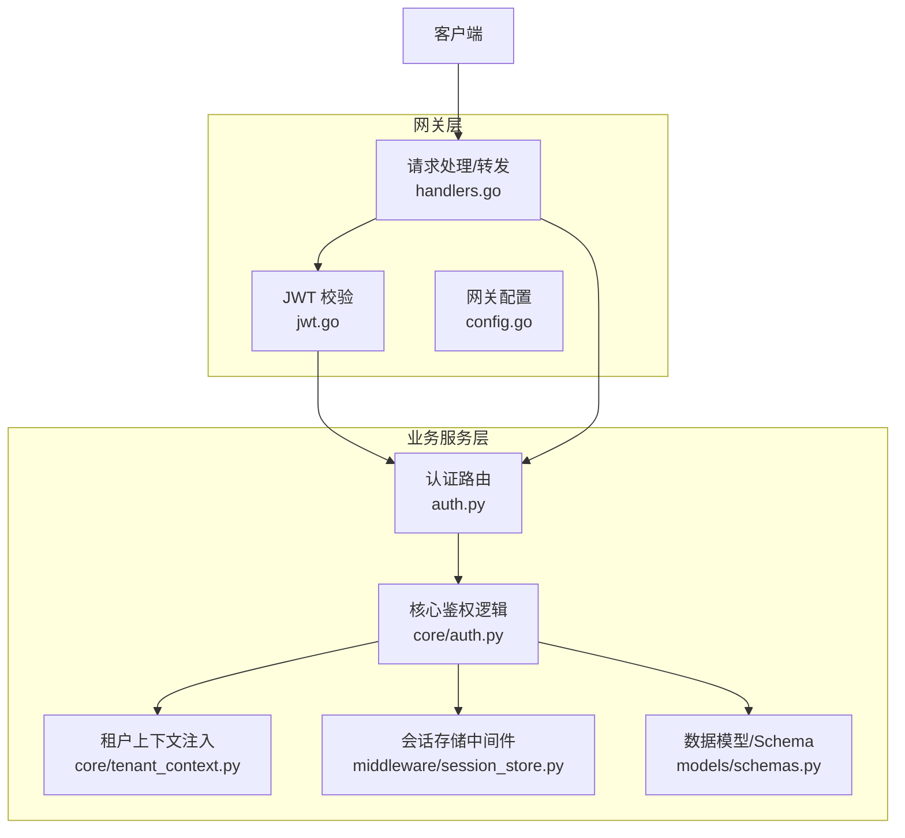
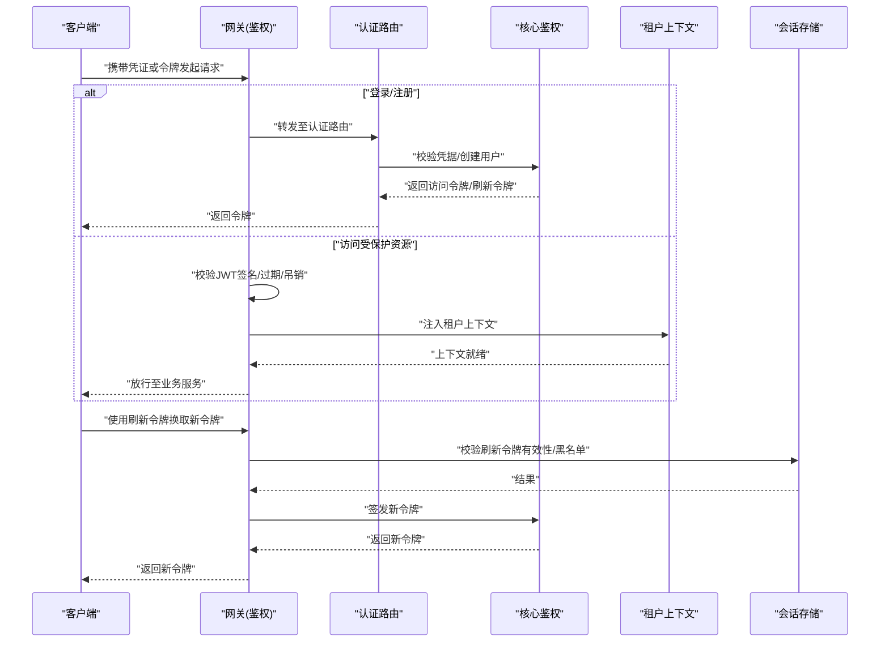
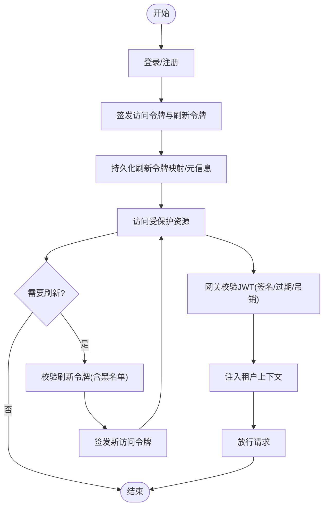
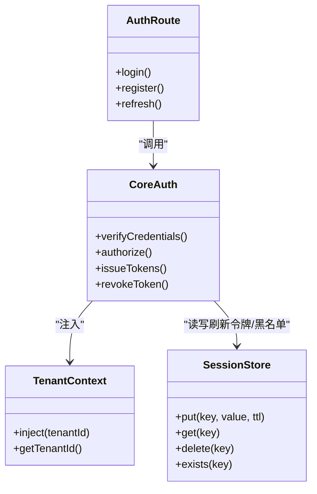
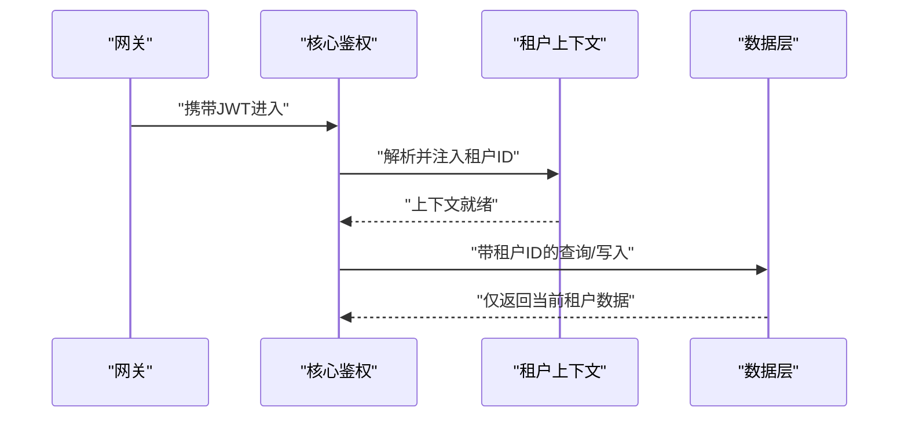
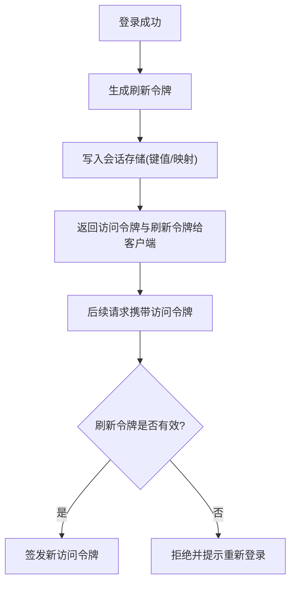
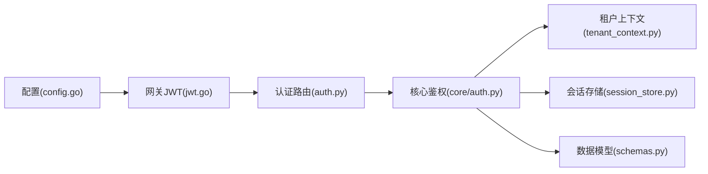

# 认证授权机制

<cite>
**本文引用的文件**   
- [backend_design/nexus/api/routes/auth.py](file://backend_design/nexus/api/routes/auth.py)
- [backend_design/nexus/core/auth.py](file://backend_design/nexus/core/auth.py)
- [backend_design/nexus/core/tenant_context.py](file://backend_design/nexus/core/tenant_context.py)
- [backend_design/nexus/middleware/session_store.py](file://backend_design/nexus/middleware/session_store.py)
- [backend_design/nexus_gate/internal/auth/jwt.go](file://backend_design/nexus_gate/internal/auth/jwt.go)
- [backend_design/nexus_gate/internal/handlers/handlers.go](file://backend_design/nexus_gate/internal/handlers/handlers.go)
- [backend_design/nexus_gate/internal/config/config.go](file://backend_design/nexus_gate/internal/config/config.go)
- [backend_design/nexus/models/schemas.py](file://backend_design/nexus/models/schemas.py)
</cite>

## 更新摘要
**变更内容**   
- 更新了认证路由模块，新增了完整的用户认证流程实现
- 增强了JWT令牌管理和基于角色的访问控制功能
- 改进了用户身份验证和权限控制策略的实现细节
- 优化了多租户环境下的数据隔离机制

## 目录
1. [简介](#简介)
2. [项目结构](#项目结构)
3. [核心组件](#核心组件)
4. [架构总览](#架构总览)
5. [详细组件分析](#详细组件分析)
6. [依赖关系分析](#依赖关系分析)
7. [性能考虑](#性能考虑)
8. [故障排查指南](#故障排查指南)
9. [结论](#结论)
10. [附录](#附录)

## 简介
本技术文档聚焦于系统的认证与授权机制，覆盖以下关键主题：
- JWT 令牌的生成、验证与刷新流程
- 用户身份验证与权限控制策略
- 多租户环境下的数据隔离实现
- 会话管理与令牌安全存储方案
- 密码加密存储与注册登录的安全最佳实践
- API 密钥管理与第三方服务集成的安全配置示例

## 项目结构
本项目采用网关（Go）+ 业务服务（Python）的分层架构。认证相关能力分布在网关鉴权模块与后端认证中间件/路由中，并通过配置中心统一管理密钥与策略。

图表来源
- [backend_design/nexus_gate/internal/auth/jwt.go](file://backend_design/nexus_gate/internal/auth/jwt.go)
- [backend_design/nexus_gate/internal/handlers/handlers.go](file://backend_design/nexus_gate/internal/handlers/handlers.go)
- [backend_design/nexus_gate/internal/config/config.go](file://backend_design/nexus_gate/internal/config/config.go)
- [backend_design/nexus/api/routes/auth.py](file://backend_design/nexus/api/routes/auth.py)
- [backend_design/nexus/core/auth.py](file://backend_design/nexus/core/auth.py)
- [backend_design/nexus/core/tenant_context.py](file://backend_design/nexus/core/tenant_context.py)
- [backend_design/nexus/middleware/session_store.py](file://backend_design/nexus/middleware/session_store.py)
- [backend_design/nexus/models/schemas.py](file://backend_design/nexus/models/schemas.py)

章节来源
- [backend_design/nexus_gate/internal/auth/jwt.go](file://backend_design/nexus_gate/internal/auth/jwt.go)
- [backend_design/nexus_gate/internal/handlers/handlers.go](file://backend_design/nexus_gate/internal/handlers/handlers.go)
- [backend_design/nexus_gate/internal/config/config.go](file://backend_design/nexus_gate/internal/config/config.go)
- [backend_design/nexus/api/routes/auth.py](file://backend_design/nexus/api/routes/auth.py)
- [backend_design/nexus/core/auth.py](file://backend_design/nexus/core/auth.py)
- [backend_design/nexus/core/tenant_context.py](file://backend_design/nexus/core/tenant_context.py)
- [backend_design/nexus/middleware/session_store.py](file://backend_design/nexus/middleware/session_store.py)
- [backend_design/nexus/models/schemas.py](file://backend_design/nexus/models/schemas.py)

## 核心组件
- 网关 JWT 校验器：负责在入口层对请求进行签名校验、过期检查与必要声明解析，并将已认证上下文透传到下游服务。
- 后端认证路由：提供登录、注册、刷新等接口，调用核心鉴权逻辑完成凭据校验与令牌签发。
- 核心鉴权逻辑：封装密码校验、角色/权限判定、令牌签发与刷新策略。
- 租户上下文：在鉴权通过后注入当前租户标识，驱动后续的数据隔离。
- 会话存储中间件：管理短期会话状态（如黑名单、刷新令牌映射），支持分布式部署。
- 数据模型/Schema：定义用户、角色、权限、租户等实体及约束。

章节来源
- [backend_design/nexus_gate/internal/auth/jwt.go](file://backend_design/nexus_gate/internal/auth/jwt.go)
- [backend_design/nexus/api/routes/auth.py](file://backend_design/nexus/api/routes/auth.py)
- [backend_design/nexus/core/auth.py](file://backend_design/nexus/core/auth.py)
- [backend_design/nexus/core/tenant_context.py](file://backend_design/nexus/core/tenant_context.py)
- [backend_design/nexus/middleware/session_store.py](file://backend_design/nexus/middleware/session_store.py)
- [backend_design/nexus/models/schemas.py](file://backend_design/nexus/models/schemas.py)

## 架构总览
下图展示了从客户端到网关再到业务服务的完整认证授权链路，包括登录、访问受保护资源、令牌刷新与租户隔离。

图表来源
- [backend_design/nexus_gate/internal/auth/jwt.go](file://backend_design/nexus_gate/internal/auth/jwt.go)
- [backend_design/nexus/api/routes/auth.py](file://backend_design/nexus/api/routes/auth.py)
- [backend_design/nexus/core/auth.py](file://backend_design/nexus/core/auth.py)
- [backend_design/nexus/core/tenant_context.py](file://backend_design/nexus/core/tenant_context.py)
- [backend_design/nexus/middleware/session_store.py](file://backend_design/nexus/middleware/session_store.py)

## 详细组件分析

### 组件A：JWT 令牌生命周期（生成、验证、刷新）
- 生成：在成功登录后由核心鉴权逻辑签发访问令牌与刷新令牌，包含必要的声明（如用户ID、租户ID、角色/权限集合）。
- 验证：网关在入口处校验签名、有效期与吊销状态；必要时将用户与租户信息注入请求上下文。
- 刷新：客户端以刷新令牌换取新的访问令牌，网关先校验刷新令牌的有效性（含黑名单检查），再委托核心鉴权逻辑签发新令牌。

图表来源
- [backend_design/nexus_gate/internal/auth/jwt.go](file://backend_design/nexus_gate/internal/auth/jwt.go)
- [backend_design/nexus/api/routes/auth.py](file://backend_design/nexus/api/routes/auth.py)
- [backend_design/nexus/core/auth.py](file://backend_design/nexus/core/auth.py)
- [backend_design/nexus/middleware/session_store.py](file://backend_design/nexus/middleware/session_store.py)

章节来源
- [backend_design/nexus_gate/internal/auth/jwt.go](file://backend_design/nexus_gate/internal/auth/jwt.go)
- [backend_design/nexus/api/routes/auth.py](file://backend_design/nexus/api/routes/auth.py)
- [backend_design/nexus/core/auth.py](file://backend_design/nexus/core/auth.py)
- [backend_design/nexus/middleware/session_store.py](file://backend_design/nexus/middleware/session_store.py)

### 组件B：用户身份验证与权限控制
- 身份验证：认证路由接收凭据，核心鉴权逻辑执行密码校验、账户状态检查与基础风控（如失败计数）。
- 权限控制：基于角色/权限集合的访问控制，可在网关层做粗粒度拦截，在后端做细粒度校验。
- 最小权限原则：默认拒绝，显式授权；按资源维度与操作维度组合控制。

图表来源
- [backend_design/nexus/api/routes/auth.py](file://backend_design/nexus/api/routes/auth.py)
- [backend_design/nexus/core/auth.py](file://backend_design/nexus/core/auth.py)
- [backend_design/nexus/core/tenant_context.py](file://backend_design/nexus/core/tenant_context.py)
- [backend_design/nexus/middleware/session_store.py](file://backend_design/nexus/middleware/session_store.py)

章节来源
- [backend_design/nexus/api/routes/auth.py](file://backend_design/nexus/api/routes/auth.py)
- [backend_design/nexus/core/auth.py](file://backend_design/nexus/core/auth.py)
- [backend_design/nexus/core/tenant_context.py](file://backend_design/nexus/core/tenant_context.py)
- [backend_design/nexus/middleware/session_store.py](file://backend_design/nexus/middleware/session_store.py)

### 组件C：多租户数据隔离
- 租户上下文注入：在鉴权成功后，根据令牌中的租户声明注入当前租户标识。
- 数据访问隔离：所有查询与写入需携带租户标识，通过数据库行级过滤或独立命名空间实现隔离。
- 跨租户访问控制：默认禁止跨租户访问，仅在管理员场景下显式授权。

图表来源
- [backend_design/nexus/core/tenant_context.py](file://backend_design/nexus/core/tenant_context.py)
- [backend_design/nexus/core/auth.py](file://backend_design/nexus/core/auth.py)

章节来源
- [backend_design/nexus/core/tenant_context.py](file://backend_design/nexus/core/tenant_context.py)
- [backend_design/nexus/core/auth.py](file://backend_design/nexus/core/auth.py)

### 组件D：会话管理与令牌安全存储
- 刷新令牌映射：将刷新令牌与其元信息（用户ID、租户ID、过期时间、设备指纹等）持久化，支持撤销与审计。
- 黑名单机制：支持主动吊销访问令牌或刷新令牌，网关与服务侧均能校验。
- 安全存储：敏感信息（如密钥、令牌）应通过配置中心或密钥管理服务注入，避免硬编码与日志泄露。

图表来源
- [backend_design/nexus/middleware/session_store.py](file://backend_design/nexus/middleware/session_store.py)
- [backend_design/nexus/core/auth.py](file://backend_design/nexus/core/auth.py)

章节来源
- [backend_design/nexus/middleware/session_store.py](file://backend_design/nexus/middleware/session_store.py)
- [backend_design/nexus/core/auth.py](file://backend_design/nexus/core/auth.py)

### 组件E：密码加密存储与安全最佳实践
- 密码哈希：使用强哈希算法（如 Argon2/BCrypt）加盐存储，禁止明文或可逆加密。
- 注册流程：校验输入合法性、唯一性、复杂度要求，记录审计日志。
- 登录流程：限制失败次数、引入冷却期、可选二次验证。
- 传输安全：强制 HTTPS，启用 HSTS，前端不缓存敏感响应。

章节来源
- [backend_design/nexus/api/routes/auth.py](file://backend_design/nexus/api/routes/auth.py)
- [backend_design/nexus/core/auth.py](file://backend_design/nexus/core/auth.py)
- [backend_design/nexus/models/schemas.py](file://backend_design/nexus/models/schemas.py)

### 组件F：API 密钥管理与第三方集成安全
- 密钥管理：集中化管理 API Key/Secret，支持轮换、版本化与最小权限分配。
- 签名与防重放：对外部调用采用签名与时间戳校验，防止篡改与重放攻击。
- 网络隔离：第三方服务通过内网代理或零信任网关访问，限制白名单与出口策略。
- 审计与告警：记录密钥使用与异常事件，设置阈值告警。

章节来源
- [backend_design/nexus_gate/internal/config/config.go](file://backend_design/nexus_gate/internal/config/config.go)
- [backend_design/nexus_gate/internal/handlers/handlers.go](file://backend_design/nexus_gate/internal/handlers/handlers.go)

## 依赖关系分析
- 网关依赖核心鉴权与配置：网关在入口处依赖 JWT 校验与全局配置（密钥、策略）。
- 业务服务依赖会话与租户上下文：认证路由与核心鉴权依赖会话存储与租户上下文。
- 数据模型贯穿全链路：用户、角色、权限、租户等实体在各层被引用。

图表来源
- [backend_design/nexus_gate/internal/config/config.go](file://backend_design/nexus_gate/internal/config/config.go)
- [backend_design/nexus_gate/internal/auth/jwt.go](file://backend_design/nexus_gate/internal/auth/jwt.go)
- [backend_design/nexus/api/routes/auth.py](file://backend_design/nexus/api/routes/auth.py)
- [backend_design/nexus/core/auth.py](file://backend_design/nexus/core/auth.py)
- [backend_design/nexus/core/tenant_context.py](file://backend_design/nexus/core/tenant_context.py)
- [backend_design/nexus/middleware/session_store.py](file://backend_design/nexus/middleware/session_store.py)
- [backend_design/nexus/models/schemas.py](file://backend_design/nexus/models/schemas.py)

章节来源
- [backend_design/nexus_gate/internal/config/config.go](file://backend_design/nexus_gate/internal/config/config.go)
- [backend_design/nexus_gate/internal/auth/jwt.go](file://backend_design/nexus_gate/internal/auth/jwt.go)
- [backend_design/nexus/api/routes/auth.py](file://backend_design/nexus/api/routes/auth.py)
- [backend_design/nexus/core/auth.py](file://backend_design/nexus/core/auth.py)
- [backend_design/nexus/core/tenant_context.py](file://backend_design/nexus/core/tenant_context.py)
- [backend_design/nexus/middleware/session_store.py](file://backend_design/nexus/middleware/session_store.py)
- [backend_design/nexus/models/schemas.py](file://backend_design/nexus/models/schemas.py)

## 性能考虑
- 令牌校验优化：网关层缓存公钥/策略，减少重复计算；批量校验时复用上下文。
- 会话存储选择：优先使用高性能 KV 存储（如 Redis），合理设置 TTL 与分片策略。
- 限流与熔断：结合速率限制与熔断器，防止暴力破解与雪崩效应。
- 连接池与超时：数据库与外部服务调用需配置合理的连接池大小与超时时间。

## 故障排查指南
- 登录失败：检查凭据格式、账户状态、失败计数与冷却期；核对日志中的错误码与堆栈。
- 令牌无效：确认签名算法、密钥一致性、时钟同步与过期时间；检查黑名单与吊销记录。
- 刷新失败：核查刷新令牌是否存在、未过期且未被吊销；确认会话存储可用性与一致性。
- 租户数据不可见：确认租户上下文是否正确注入；检查数据层是否按租户过滤。
- 第三方调用失败：核对 API Key/Secret 版本与权限范围；检查签名、时间戳与重放防护。

章节来源
- [backend_design/nexus_gate/internal/auth/jwt.go](file://backend_design/nexus_gate/internal/auth/jwt.go)
- [backend_design/nexus/api/routes/auth.py](file://backend_design/nexus/api/routes/auth.py)
- [backend_design/nexus/core/auth.py](file://backend_design/nexus/core/auth.py)
- [backend_design/nexus/middleware/session_store.py](file://backend_design/nexus/middleware/session_store.py)

## 结论
本系统通过网关与业务服务协同实现端到端的认证与授权：网关负责快速校验与上下文注入，业务服务负责精细化的权限控制与租户隔离。配合会话存储与密钥管理，形成完整的令牌生命周期与安全防护体系。建议在生产环境中持续完善审计、监控与告警，确保安全性与可观测性。

## 附录
- 术语说明
  - JWT：JSON Web Token，用于无状态的身份与授权传递。
  - 刷新令牌：用于换取新的访问令牌的长期令牌，具备吊销能力。
  - 租户：多租户系统中的逻辑隔离单元，通常对应组织或客户。
- 参考实现路径
  - 网关 JWT 校验：[backend_design/nexus_gate/internal/auth/jwt.go](file://backend_design/nexus_gate/internal/auth/jwt.go)
  - 认证路由：[backend_design/nexus/api/routes/auth.py](file://backend_design/nexus/api/routes/auth.py)
  - 核心鉴权：[backend_design/nexus/core/auth.py](file://backend_design/nexus/core/auth.py)
  - 租户上下文：[backend_design/nexus/core/tenant_context.py](file://backend_design/nexus/core/tenant_context.py)
  - 会话存储：[backend_design/nexus/middleware/session_store.py](file://backend_design/nexus/middleware/session_store.py)
  - 数据模型：[backend_design/nexus/models/schemas.py](file://backend_design/nexus/models/schemas.py)
  - 网关配置：[backend_design/nexus_gate/internal/config/config.go](file://backend_design/nexus_gate/internal/config/config.go)
  - 网关处理器：[backend_design/nexus_gate/internal/handlers/handlers.go](file://backend_design/nexus_gate/internal/handlers/handlers.go)