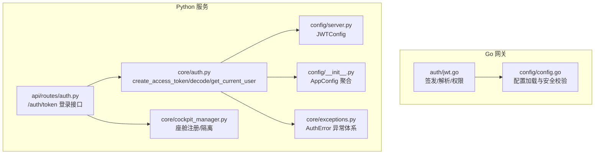
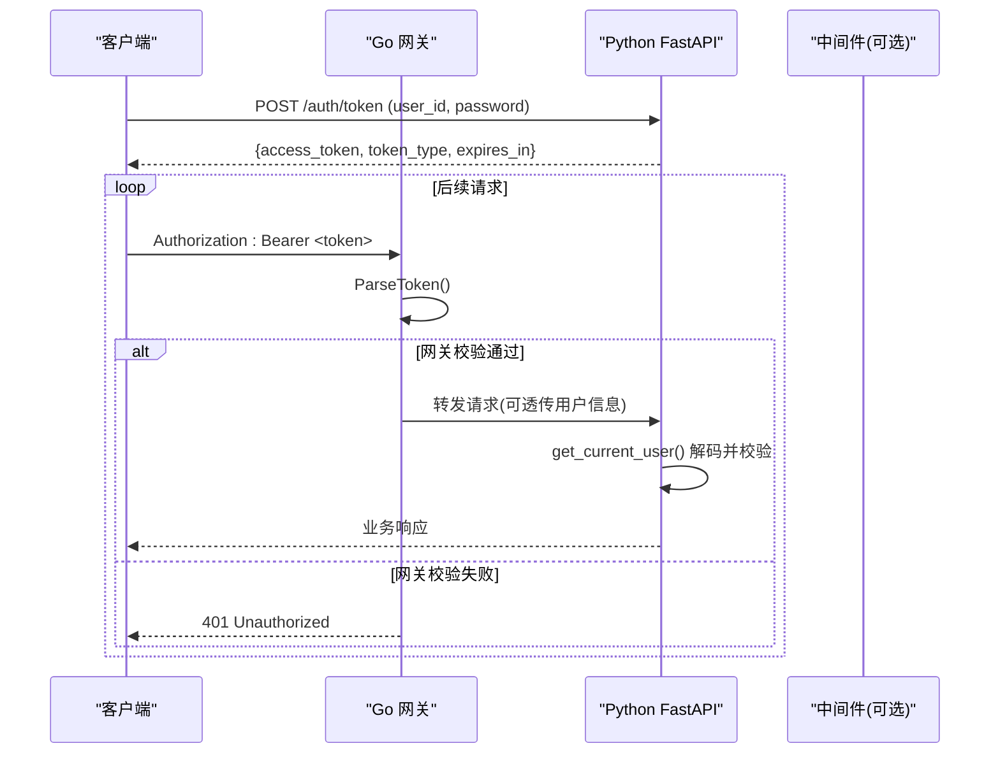
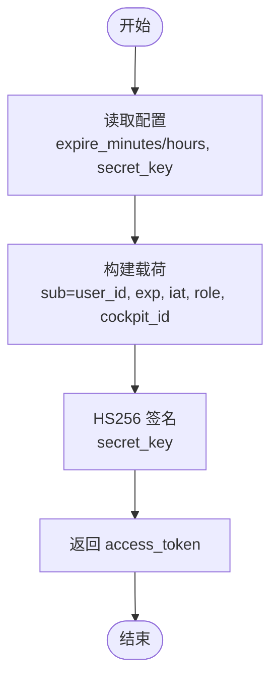
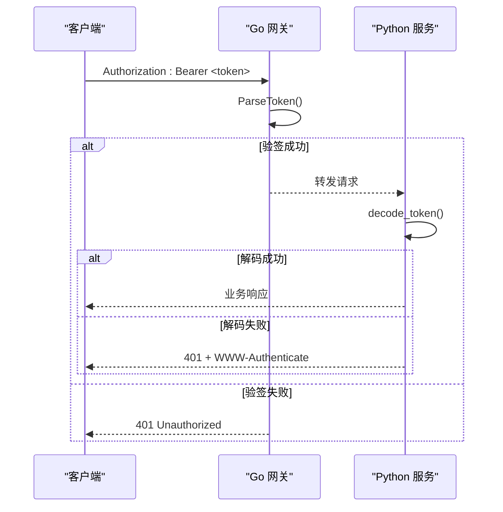
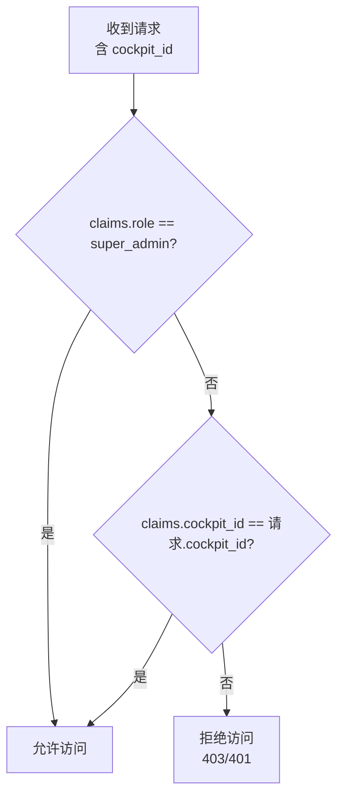
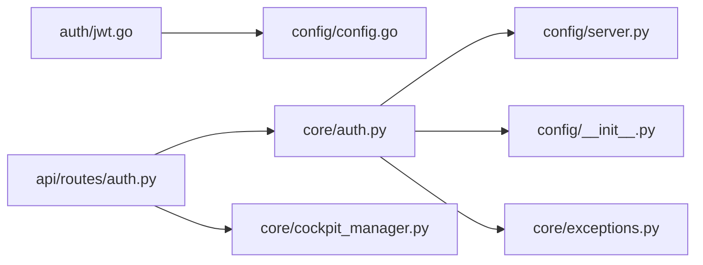

# JWT 鉴权机制

<cite>
**本文引用的文件**   
- [jwt.go](file://backend_design/nexus_gate/internal/auth/jwt.go)
- [config.go](file://backend_design/nexus_gate/internal/config/config.go)
- [auth.py](file://backend_design/nexus/core/auth.py)
- [auth_routes.py](file://backend_design/nexus/api/routes/auth.py)
- [server_config.py](file://backend_design/nexus/config/server.py)
- [app_config.py](file://backend_design/nexus/config/__init__.py)
- [exceptions.py](file://backend_design/nexus/core/exceptions.py)
- [cockpit_manager.py](file://backend_design/nexus/core/cockpit_manager.py)
</cite>

## 目录
1. [简介](#简介)
2. [项目结构](#项目结构)
3. [核心组件](#核心组件)
4. [架构总览](#架构总览)
5. [详细组件分析](#详细组件分析)
6. [依赖关系分析](#依赖关系分析)
7. [性能考虑](#性能考虑)
8. [故障排查指南](#故障排查指南)
9. [结论](#结论)
10. [附录：客户端集成示例与最佳实践](#附录客户端集成示例与最佳实践)

## 简介
本技术文档围绕 NexusCockpit 的 JWT 鉴权机制，系统性阐述令牌结构设计、签名算法选择与安全策略；详述令牌的生成、验证、刷新与撤销流程；解释 cockpit_id 校验如何实现座舱级权限控制；说明过期处理、错误响应格式与重试策略；并提供完整的客户端集成指南与安全最佳实践（密钥管理、防重放、跨域安全）。

## 项目结构
NexusCockpit 采用“Go 网关 + Python 服务”的双端协作模式：
- Go 网关负责签发/解析 JWT、RBAC 权限检查、跨域与限流等通用能力。
- Python FastAPI 服务提供认证接口、JWT 签发与解码、以及业务路由保护。

图表来源
- [jwt.go:1-128](file://backend_design/nexus_gate/internal/auth/jwt.go#L1-L128)
- [config.go:1-218](file://backend_design/nexus_gate/internal/config/config.go#L1-L218)
- [auth.py:1-140](file://backend_design/nexus/core/auth.py#L1-L140)
- [auth_routes.py:1-194](file://backend_design/nexus/api/routes/auth.py#L1-L194)
- [server_config.py:1-61](file://backend_design/nexus/config/server.py#L1-L61)
- [app_config.py:1-167](file://backend_design/nexus/config/__init__.py#L1-L167)
- [exceptions.py:1-128](file://backend_design/nexus/core/exceptions.py#L1-L128)
- [cockpit_manager.py:1-397](file://backend_design/nexus/core/cockpit_manager.py#L1-L397)

章节来源
- [jwt.go:1-128](file://backend_design/nexus_gate/internal/auth/jwt.go#L1-L128)
- [config.go:1-218](file://backend_design/nexus_gate/internal/config/config.go#L1-L218)
- [auth.py:1-140](file://backend_design/nexus/core/auth.py#L1-L140)
- [auth_routes.py:1-194](file://backend_design/nexus/api/routes/auth.py#L1-L194)
- [server_config.py:1-61](file://backend_design/nexus/config/server.py#L1-L61)
- [app_config.py:1-167](file://backend_design/nexus/config/__init__.py#L1-L167)
- [exceptions.py:1-128](file://backend_design/nexus/core/exceptions.py#L1-L128)
- [cockpit_manager.py:1-397](file://backend_design/nexus/core/cockpit_manager.py#L1-L397)

## 核心组件
- Go 网关 JWT 模块
  - Claims 载荷：包含 user_id、cockpit_id、role、username 及标准 RegisteredClaims。
  - GenerateToken：使用 HS256 签名，设置 Issuer、Subject、Exp、Iat。
  - ParseToken：去除 Bearer 前缀，强制 HMAC 算法校验，返回 Claims。
  - ValidateCockpitAccess：基于 role 和 cockpit_id 实现座舱级访问控制。
  - CheckPermission：基于角色的细粒度权限判定。
- Python 认证模块
  - create_access_token：按配置签发 Access Token，支持 extra_claims（如 role、cockpit_id）。
  - decode_token：解码并校验 Token，抛出 AuthError。
  - get_current_user / get_optional_user：FastAPI 依赖注入，统一 401 响应与 WWW-Authenticate 头。
- 配置中心
  - Go 侧：从环境变量加载 JWTSecret、JWTExpireHours 等，并在生产环境进行强安全检查。
  - Python 侧：JWTConfig 定义 secret_key、algorithm、expire_minutes/hours 及 RBAC 默认值。
- 座舱管理器
  - CockpitManager：维护多座舱注册、隔离（Redis DB/Milvus 前缀）与统计。

章节来源
- [jwt.go:19-128](file://backend_design/nexus_gate/internal/auth/jwt.go#L19-L128)
- [auth.py:35-140](file://backend_design/nexus/core/auth.py#L35-L140)
- [config.go:19-142](file://backend_design/nexus_gate/internal/config/config.go#L19-L142)
- [server_config.py:44-61](file://backend_design/nexus/config/server.py#L44-L61)
- [cockpit_manager.py:75-397](file://backend_design/nexus/core/cockpit_manager.py#L75-L397)

## 架构总览
下图展示“登录获取 Token → 携带 Token 访问受保护接口 → 网关/后端双重校验”的整体流程。

图表来源
- [auth_routes.py:48-77](file://backend_design/nexus/api/routes/auth.py#L48-L77)
- [auth.py:85-122](file://backend_design/nexus/core/auth.py#L85-L122)
- [jwt.go:52-76](file://backend_design/nexus_gate/internal/auth/jwt.go#L52-L76)

## 详细组件分析

### JWT 令牌结构与签名算法
- 载荷字段
  - user_id：用户唯一标识（同时作为 Subject）。
  - cockpit_id：座舱标识，用于座舱级权限隔离。
  - role：角色（super_admin、cockpit_admin、cockpit_user、cockpit_viewer）。
  - username：用户名（可读性用途）。
  - 标准字段：exp、iat、iss、sub。
- 签名算法
  - HS256（HMAC-SHA256），对称签名，适合内部网关与服务间互信场景。
  - 密钥来源：Go 侧优先 JWT_SECRET，回退到 JWT_SECRET_KEY；Python 侧由 JWTConfig.secret_key 提供。双端共享同一密钥以互通校验。

章节来源
- [jwt.go:19-50](file://backend_design/nexus_gate/internal/auth/jwt.go#L19-L50)
- [auth.py:35-61](file://backend_design/nexus/core/auth.py#L35-L61)
- [config.go:88-93](file://backend_design/nexus_gate/internal/config/config.go#L88-L93)
- [server_config.py:44-52](file://backend_design/nexus/config/server.py#L44-L52)

### 令牌生成流程
- Python 侧
  - POST /auth/token：接收 user_id/password，开发环境直接签发 Token，附带 role 与 cockpit_id。
  - create_access_token：根据配置计算 exp，构造 payload，编码为 JWT。
- Go 侧
  - GenerateToken：组装 Claims，设置 Issuer/Subject/Exp/Iat，HS256 签名。

图表来源
- [auth_routes.py:48-77](file://backend_design/nexus/api/routes/auth.py#L48-L77)
- [auth.py:35-61](file://backend_design/nexus/core/auth.py#L35-L61)
- [jwt.go:28-50](file://backend_design/nexus_gate/internal/auth/jwt.go#L28-L50)

章节来源
- [auth_routes.py:48-77](file://backend_design/nexus/api/routes/auth.py#L48-L77)
- [auth.py:35-61](file://backend_design/nexus/core/auth.py#L35-L61)
- [jwt.go:28-50](file://backend_design/nexus_gate/internal/auth/jwt.go#L28-L50)

### 令牌验证流程
- Go 网关
  - ParseToken：去除 Bearer 前缀，强制 alg=HS256，使用配置的 JWTSecret 验签，返回 Claims。
- Python 服务
  - decode_token：按算法与密钥解码，捕获过期与无效异常，抛出 AuthError。
  - get_current_user：从 Authorization 头提取凭据，解码后取 sub 作为 user_id，缺失或失败返回 401。

图表来源
- [jwt.go:52-76](file://backend_design/nexus_gate/internal/auth/jwt.go#L52-L76)
- [auth.py:64-122](file://backend_design/nexus/core/auth.py#L64-L122)

章节来源
- [jwt.go:52-76](file://backend_design/nexus_gate/internal/auth/jwt.go#L52-L76)
- [auth.py:64-122](file://backend_design/nexus/core/auth.py#L64-L122)

### 座舱级权限控制（cockpit_id 校验）
- 规则
  - super_admin：可访问任意座舱。
  - 其他角色：仅能访问 claims.cockpit_id 指定的座舱。
- 实现
  - ValidateCockpitAccess：比较 claims.cockpit_id 与请求目标 cockpit_id。
- 数据支撑
  - CockpitManager：维护 cockpit_id 与 user_id、Redis DB、Milvus 前缀等隔离信息。

图表来源
- [jwt.go:78-88](file://backend_design/nexus_gate/internal/auth/jwt.go#L78-L88)
- [cockpit_manager.py:75-110](file://backend_design/nexus/core/cockpit_manager.py#L75-L110)

章节来源
- [jwt.go:78-88](file://backend_design/nexus_gate/internal/auth/jwt.go#L78-L88)
- [cockpit_manager.py:75-110](file://backend_design/nexus/core/cockpit_manager.py#L75-L110)

### 角色与权限（RBAC）
- 角色
  - super_admin：全量权限（座舱管理、车控、数据平台、设置、用户管理等）。
  - cockpit_admin：部分管理权限（更新座舱、车控、数据平台查看、用户管理）。
  - cockpit_user：基础操作（聊天、车控）。
  - cockpit_viewer：只读查看。
- 实现
  - rolePermissions：映射角色到权限列表。
  - CheckPermission：判断是否拥有指定权限。

章节来源
- [jwt.go:90-127](file://backend_design/nexus_gate/internal/auth/jwt.go#L90-L127)

### 令牌过期处理与错误响应
- 过期处理
  - Python decode_token：ExpiredSignatureError → AuthError("Token 已过期，请重新登录")。
  - Python get_current_user：未提供凭据或解码失败 → HTTP 401，带 WWW-Authenticate: Bearer。
- 错误响应格式
  - FastAPI 默认返回 JSON，包含 detail 字段；自定义异常体系提供 code/message/details 三元组。
- 建议
  - 客户端检测到 401 时，应触发刷新或重新登录流程。

章节来源
- [auth.py:64-122](file://backend_design/nexus/core/auth.py#L64-L122)
- [exceptions.py:105-110](file://backend_design/nexus/core/exceptions.py#L105-L110)

### 令牌刷新与撤销
- 刷新
  - 当前实现未提供 Refresh Token；建议在客户端缓存 expires_in，在过期前主动调用 /auth/token 重新获取。
- 撤销
  - 当前实现无黑名单/撤销机制；如需支持，可在 Redis 中维护 token_jti 黑名单，或在短生命周期策略下结合服务端会话状态。

[本节为概念性说明，不直接分析具体文件]

## 依赖关系分析
- Go 网关
  - auth/jwt.go 依赖 config/config.go 获取 JWTSecret、JWTExpireHours。
- Python 服务
  - core/auth.py 依赖 config/server.py 的 JWTConfig（secret_key、algorithm、expire_minutes）。
  - api/routes/auth.py 依赖 core/auth.py 的 create_access_token 与 get_current_user。
  - core/exceptions.py 提供 AuthError 统一异常类型。
  - core/cockpit_manager.py 提供座舱元数据与隔离信息。

图表来源
- [jwt.go:1-128](file://backend_design/nexus_gate/internal/auth/jwt.go#L1-L128)
- [config.go:1-218](file://backend_design/nexus_gate/internal/config/config.go#L1-L218)
- [auth.py:1-140](file://backend_design/nexus/core/auth.py#L1-L140)
- [auth_routes.py:1-194](file://backend_design/nexus/api/routes/auth.py#L1-L194)
- [server_config.py:1-61](file://backend_design/nexus/config/server.py#L1-L61)
- [app_config.py:1-167](file://backend_design/nexus/config/__init__.py#L1-L167)
- [exceptions.py:1-128](file://backend_design/nexus/core/exceptions.py#L1-L128)
- [cockpit_manager.py:1-397](file://backend_design/nexus/core/cockpit_manager.py#L1-L397)

章节来源
- [jwt.go:1-128](file://backend_design/nexus_gate/internal/auth/jwt.go#L1-L128)
- [config.go:1-218](file://backend_design/nexus_gate/internal/config/config.go#L1-L218)
- [auth.py:1-140](file://backend_design/nexus/core/auth.py#L1-L140)
- [auth_routes.py:1-194](file://backend_design/nexus/api/routes/auth.py#L1-L194)
- [server_config.py:1-61](file://backend_design/nexus/config/server.py#L1-L61)
- [app_config.py:1-167](file://backend_design/nexus/config/__init__.py#L1-L167)
- [exceptions.py:1-128](file://backend_design/nexus/core/exceptions.py#L1-L128)
- [cockpit_manager.py:1-397](file://backend_design/nexus/core/cockpit_manager.py#L1-L397)

## 性能考虑
- 签名与验签
  - HS256 为对称算法，CPU 开销低，适合高并发网关层快速校验。
- 配置读取
  - Go/Python 均使用内存配置单例，避免重复 I/O。
- 中间件隔离
  - 座舱级 Redis DB/Milvus 前缀隔离减少锁竞争与查询干扰。
- 建议
  - 合理设置 expire_minutes/hours，缩短攻击窗口。
  - 网关层启用速率限制与熔断，降低恶意请求影响。

[本节为通用指导，不直接分析具体文件]

## 故障排查指南
- 常见问题
  - 401 未提供凭据：检查 Authorization 头是否携带 "Bearer <token>"。
  - 401 Token 无效：确认双端 JWTSecret 一致，alg 必须为 HS256。
  - 401 Token 已过期：expires_in 到期，需重新登录或刷新。
  - 403 座舱无权访问：claims.cockpit_id 与请求不一致且非 super_admin。
- 定位步骤
  - 检查 Python 日志中的 AuthError 与 HTTP 401 响应体。
  - 核对 Go 网关配置 JWTSecret/JWTExpireHours。
  - 验证前端是否正确缓存与传递 Token。
- 恢复措施
  - 修正 .env 中的 JWT_SECRET_KEY/JWT_SECRET。
  - 调整 CORS_ORIGINS 确保跨域正确。
  - 必要时重置用户密码或重新签发 Token。

章节来源
- [auth.py:85-122](file://backend_design/nexus/core/auth.py#L85-L122)
- [exceptions.py:105-110](file://backend_design/nexus/core/exceptions.py#L105-L110)
- [config.go:120-142](file://backend_design/nexus_gate/internal/config/config.go#L120-L142)

## 结论
NexusCockpit 的 JWT 鉴权机制通过 Go 网关与 Python 服务协同，实现了统一的令牌签发、校验与座舱级权限控制。HS256 对称签名满足高性能需求，配合严格的配置校验与清晰的错误响应，便于开发与运维。建议在生产环境强化密钥管理、引入短期令牌与刷新机制，并结合 Redis 黑名单实现令牌撤销。

[本节为总结，不直接分析具体文件]

## 附录：客户端集成示例与最佳实践

### 客户端集成步骤
- 获取 Token
  - 调用 POST /auth/token，提交 user_id 与 password（开发环境可直接签发）。
  - 保存 access_token、token_type、expires_in。
- 发起受保护请求
  - 在 Authorization 头添加 "Bearer <access_token>"。
  - 若返回 401，触发刷新或重新登录。
- 座舱访问
  - 确保 claims.cockpit_id 与请求目标一致，或具备 super_admin 角色。

章节来源
- [auth_routes.py:48-77](file://backend_design/nexus/api/routes/auth.py#L48-L77)
- [auth.py:85-122](file://backend_design/nexus/core/auth.py#L85-L122)

### 安全最佳实践
- 密钥管理
  - 生产环境必须设置强随机 JWT_SECRET/JWT_SECRET_KEY，禁止默认弱密钥。
  - 定期轮换密钥，并确保网关与后端同步更新。
- 防重放攻击
  - 对敏感操作增加 nonce/jti 与时间戳校验，服务端记录最近使用过的 jti。
  - 限制请求频率，启用速率限制。
- 跨域安全
  - CORS_ORIGINS 明确指定可信域名，禁止通配符 "*"。
- 令牌生命周期
  - 设置较短的 expires_in，结合前端定时刷新逻辑。
  - 退出登录时清除本地存储的 Token。

章节来源
- [config.go:120-142](file://backend_design/nexus_gate/internal/config/config.go#L120-L142)
- [server_config.py:26-31](file://backend_design/nexus/config/server.py#L26-L31)