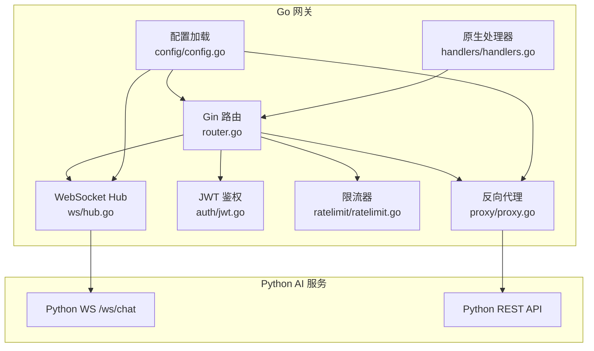
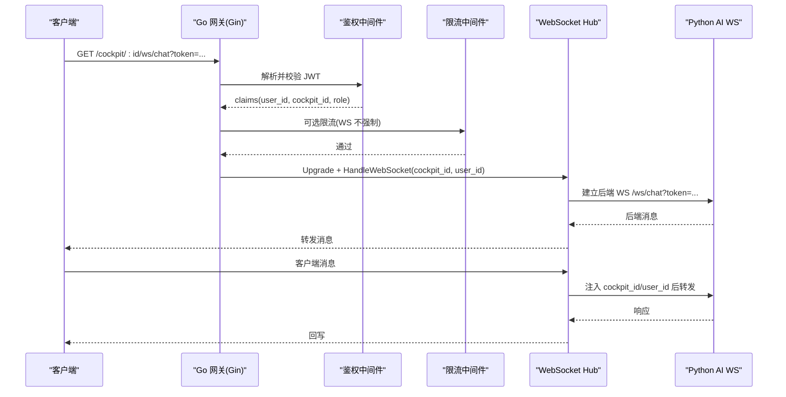
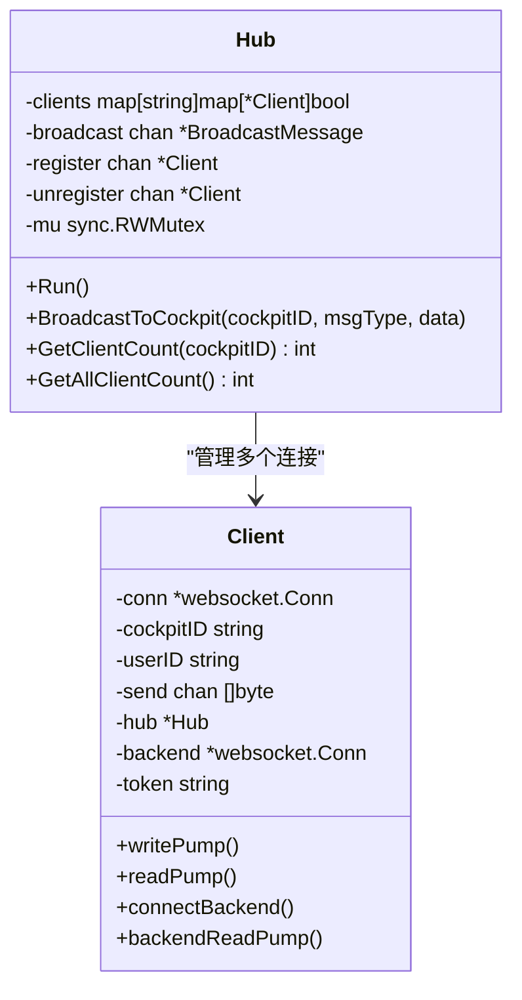
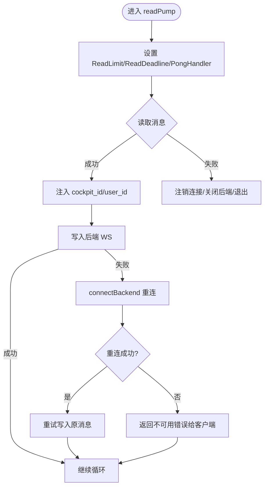
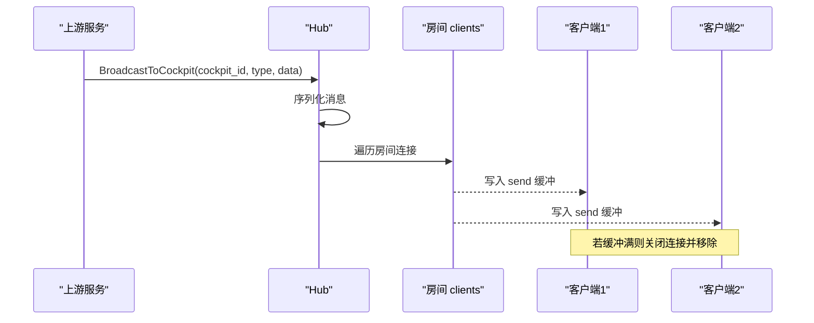
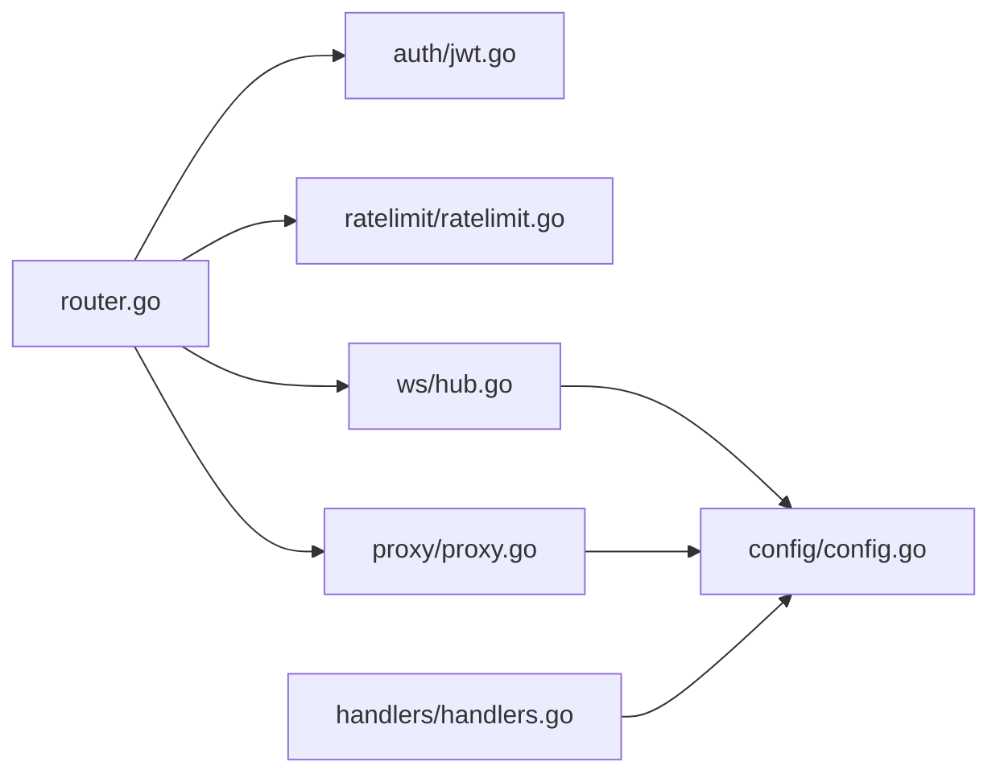

# WebSocket Hub 通信

<cite>
**本文引用的文件**   
- [hub.go](file://backend_design/nexus_gate/internal/ws/hub.go)
- [router.go](file://backend_design/nexus_gate/internal/router/router.go)
- [config.go](file://backend_design/nexus_gate/internal/config/config.go)
- [handlers.go](file://backend_design/nexus_gate/internal/handlers/handlers.go)
- [proxy.go](file://backend_design/nexus_gate/internal/proxy/proxy.go)
- [jwt.go](file://backend_design/nexus_gate/internal/auth/jwt.go)
- [main.go](file://backend_design/nexus_gate/cmd/main.go)
- [ratelimit.go](file://backend_design/nexus_gate/internal/ratelimit/ratelimit.go)
</cite>

## 目录
1. [简介](#简介)
2. [项目结构](#项目结构)
3. [核心组件](#核心组件)
4. [架构总览](#架构总览)
5. [详细组件分析](#详细组件分析)
6. [依赖关系分析](#依赖关系分析)
7. [性能与并发优化](#性能与并发优化)
8. [故障排查指南](#故障排查指南)
9. [结论](#结论)
10. [附录：自定义消息类型与处理示例](#附录自定义消息类型与处理示例)

## 简介
本技术文档围绕 NexusCockpit Go 网关中的 WebSocket Hub 通信系统，系统性阐述连接管理、广播与房间机制、心跳与断线重连、消息路由/过滤/优先级、可靠性保障（确认、重试、状态同步）、以及千级连接的并发策略与内存优化。同时给出基于现有代码的扩展建议与实践要点，帮助读者在保持高吞吐与低延迟的前提下，构建稳定可靠的实时通信能力。

## 项目结构
NexusGate 作为 Go 网关，承担以下职责：
- JWT 鉴权与座舱隔离
- 非 AI 请求原生处理（健康检查、数据中台统计等）
- AI 请求反向代理到 Python FastAPI
- WebSocket Hub 管理多座舱连接、消息转发与广播
- Prometheus 指标采集与限流

图表来源
- [router.go:59-251](file://backend_design/nexus_gate/internal/router/router.go#L59-L251)
- [hub.go:68-121](file://backend_design/nexus_gate/internal/ws/hub.go#L68-L121)
- [proxy.go:27-90](file://backend_design/nexus_gate/internal/proxy/proxy.go#L27-L90)
- [config.go:80-118](file://backend_design/nexus_gate/internal/config/config.go#L80-L118)
- [handlers.go:101-146](file://backend_design/nexus_gate/internal/handlers/handlers.go#L101-L146)

章节来源
- [main.go:126-134](file://backend_design/nexus_gate/cmd/main.go#L126-L134)
- [router.go:59-251](file://backend_design/nexus_gate/internal/router/router.go#L59-L251)

## 核心组件
- Hub：维护按 cockpit_id 分组的客户端集合，提供注册/注销、广播、计数等能力
- Client：封装单个 WebSocket 连接的生命周期、读写泵、后端连接与消息注入
- Router：统一路由分发，鉴权、限流、CORS、Prometheus 指标、WebSocket 端点挂载
- Proxy：反向代理到 Python AI 服务，注入租户上下文头并处理错误
- Config：集中式环境变量配置，含 CORS、限流、中间件地址、主题与名称等
- Auth：JWT 签发与校验、座舱访问权限控制
- RateLimiter：令牌桶限流，支持座舱级与优先级

章节来源
- [hub.go:40-148](file://backend_design/nexus_gate/internal/ws/hub.go#L40-L148)
- [router.go:59-251](file://backend_design/nexus_gate/internal/router/router.go#L59-L251)
- [proxy.go:27-90](file://backend_design/nexus_gate/internal/proxy/proxy.go#L27-L90)
- [config.go:19-118](file://backend_design/nexus_gate/internal/config/config.go#L19-L118)
- [jwt.go:28-88](file://backend_design/nexus_gate/internal/auth/jwt.go#L28-L88)
- [ratelimit.go:120-178](file://backend_design/nexus_gate/internal/ratelimit/ratelimit.go#L120-L178)

## 架构总览
下图展示从浏览器到 Python AI 的完整调用链，包括鉴权、限流、Hub 广播与后端转发的关键路径。

图表来源
- [router.go:225-242](file://backend_design/nexus_gate/internal/router/router.go#L225-L242)
- [hub.go:151-190](file://backend_design/nexus_gate/internal/ws/hub.go#L151-L190)
- [hub.go:221-248](file://backend_design/nexus_gate/internal/ws/hub.go#L221-L248)
- [hub.go:276-326](file://backend_design/nexus_gate/internal/ws/hub.go#L276-L326)

## 详细组件分析

### Hub 与连接池设计
- 连接池模型：以 cockpit_id 为键的二级映射 map[string]map[*Client]bool，天然实现“房间”隔离
- 注册/注销：register/unregister 通道驱动 Hub.Run 主循环，保证并发安全
- 广播：broadcast 通道接收 BroadcastMessage，按 cockpit_id 批量写入各客户端 send 缓冲
- 健壮性：当某个客户端发送缓冲满时，主动删除并关闭连接，避免阻塞广播

图表来源
- [hub.go:51-75](file://backend_design/nexus_gate/internal/ws/hub.go#L51-L75)
- [hub.go:78-121](file://backend_design/nexus_gate/internal/ws/hub.go#L78-L121)
- [hub.go:123-148](file://backend_design/nexus_gate/internal/ws/hub.go#L123-L148)

章节来源
- [hub.go:51-148](file://backend_design/nexus_gate/internal/ws/hub.go#L51-L148)

### 心跳检测与断线重连
- 心跳：writePump 每 30 秒发送 Ping；readPump 设置 PongHandler，收到 Pong 则刷新 ReadDeadline，形成双向保活
- 超时：WriteDeadline 10s，ReadDeadline 初始 60s，配合 PongHandler 动态重置
- 重连：readPump 在向后端写入失败时尝试 connectBackend 并重试当前消息；后端断开时自动 Close 并清理引用

图表来源
- [hub.go:192-219](file://backend_design/nexus_gate/internal/ws/hub.go#L192-L219)
- [hub.go:276-326](file://backend_design/nexus_gate/internal/ws/hub.go#L276-L326)
- [hub.go:221-248](file://backend_design/nexus_gate/internal/ws/hub.go#L221-L248)

章节来源
- [hub.go:192-219](file://backend_design/nexus_gate/internal/ws/hub.go#L192-L219)
- [hub.go:276-326](file://backend_design/nexus_gate/internal/ws/hub.go#L276-L326)

### 消息广播算法与房间管理
- 房间：cockpit_id 即房间标识，Hub.clients[cockpit_id] 为该房间所有连接集合
- 广播：BroadcastToCockpit 将消息推入 broadcast 通道，Hub.Run 读取后序列化并逐个写入 client.send
- 背压保护：若 client.send 阻塞（默认容量 256），直接关闭该连接并从房间移除，防止广播风暴

图表来源
- [hub.go:123-130](file://backend_design/nexus_gate/internal/ws/hub.go#L123-L130)
- [hub.go:101-121](file://backend_design/nexus_gate/internal/ws/hub.go#L101-L121)

章节来源
- [hub.go:101-130](file://backend_design/nexus_gate/internal/ws/hub.go#L101-L130)

### 消息路由、过滤与优先级
- 路由：/cockpit/:cockpit_id/ws/chat 由鉴权中间件校验后交由 Hub.HandleWebSocket
- 过滤：injectCockpitInfo 确保消息携带 cockpit_id 与 user_id，便于后端按租户隔离
- 优先级：HTTP 层通过 RateLimitMiddleware 对 REST 接口进行优先级限流；WS 层未做显式优先级，但可通过 CockpitID 维度区分流量

章节来源
- [router.go:225-242](file://backend_design/nexus_gate/internal/router/router.go#L225-L242)
- [hub.go:328-352](file://backend_design/nexus_gate/internal/ws/hub.go#L328-L352)
- [ratelimit.go:464-495](file://backend_design/nexus_gate/internal/ratelimit/ratelimit.go#L464-L495)

### 可靠性保障：确认、重试与状态同步
- 确认：当前实现未包含应用层 ACK；可在消息体中增加 id 字段，前端回传 ack_id 实现可靠投递
- 重试：后端不可用时返回错误提示；readPump 具备后端断线重连逻辑
- 状态同步：可结合 Redis 或内存表记录最后一条消息序列号，重连后增量同步

章节来源
- [hub.go:312-326](file://backend_design/nexus_gate/internal/ws/hub.go#L312-L326)
- [hub.go:276-326](file://backend_design/nexus_gate/internal/ws/hub.go#L276-L326)

### 并发处理策略与 goroutine 管理
- 每个连接两个 goroutine：writePump、readPump；Hub 一个主循环 goroutine；后端读转发一个 goroutine
- 资源释放：defer 统一关闭连接与后端连接，确保无泄漏
- 背压与限流：client.send 缓冲满即关闭连接，避免堆积；REST 层使用令牌桶限流

章节来源
- [hub.go:151-190](file://backend_design/nexus_gate/internal/ws/hub.go#L151-L190)
- [ratelimit.go:120-178](file://backend_design/nexus_gate/internal/ratelimit/ratelimit.go#L120-L178)

## 依赖关系分析
- Router 依赖 Auth、RateLimiter、Proxy、WS Hub
- Hub 依赖 Config（获取 AI 后端地址）、gorilla/websocket
- Proxy 依赖 Config（AI BaseURL）
- Handlers 依赖 Config、Redis/Prometheus（用于原生统计）
- Auth 依赖 Config（JWT 密钥与过期时间）

图表来源
- [router.go:59-251](file://backend_design/nexus_gate/internal/router/router.go#L59-L251)
- [hub.go:17-20](file://backend_design/nexus_gate/internal/ws/hub.go#L17-L20)
- [proxy.go:27-90](file://backend_design/nexus_gate/internal/proxy/proxy.go#L27-L90)
- [handlers.go:101-146](file://backend_design/nexus_gate/internal/handlers/handlers.go#L101-L146)

章节来源
- [router.go:59-251](file://backend_design/nexus_gate/internal/router/router.go#L59-L251)
- [config.go:80-118](file://backend_design/nexus_gate/internal/config/config.go#L80-L118)

## 性能与并发优化
- 连接缓冲：client.send 容量 256，适合短时突发；对于持续高吞吐场景可考虑增大或引入队列
- 广播扇出：按房间遍历写缓冲，存在 O(N) 复杂度；可引入分片广播或异步批写降低锁竞争
- 心跳间隔：30s 较合理；可根据网络质量调整
- 读限制：SetReadLimit 64KB，满足语音数据；超大消息需评估内存占用
- 指标监控：Prometheus 暴露活跃连接数、QPS、耗时分布，便于容量规划
- 限流策略：REST 层优先级令牌桶，WS 层可按 cockpit_id 维度扩展限流

章节来源
- [hub.go:192-219](file://backend_design/nexus_gate/internal/ws/hub.go#L192-L219)
- [hub.go:276-287](file://backend_design/nexus_gate/internal/ws/hub.go#L276-L287)
- [router.go:33-56](file://backend_design/nexus_gate/internal/router/router.go#L33-L56)
- [ratelimit.go:120-178](file://backend_design/nexus_gate/internal/ratelimit/ratelimit.go#L120-L178)

## 故障排查指南
- 连接频繁断开：检查 writePump 的 WriteDeadline 与 readPump 的 ReadDeadline；观察是否出现缓冲满导致的关闭
- 后端不可用：查看日志中“backend connect failed/read error”，确认 Python WS 地址与 Token 传递
- CORS 问题：CheckOrigin 白名单与 Gin CORS 中间件需一致；生产环境禁止通配符
- 鉴权失败：确认 Authorization 头格式与 JWT 密钥一致性；检查 cockpit_id 权限校验
- 指标异常：通过 /metrics 与 Prometheus 查询 nexus_gate_ws_active_connections、nexus_gate_http_request_duration_seconds

章节来源
- [hub.go:151-190](file://backend_design/nexus_gate/internal/ws/hub.go#L151-L190)
- [hub.go:221-248](file://backend_design/nexus_gate/internal/ws/hub.go#L221-L248)
- [router.go:93-120](file://backend_design/nexus_gate/internal/router/router.go#L93-L120)
- [handlers.go:378-414](file://backend_design/nexus_gate/internal/handlers/handlers.go#L378-L414)

## 结论
NexusGate 的 WebSocket Hub 采用简洁高效的 Hub-Client 模式，结合房间隔离、心跳保活与后端重连，实现了高并发下的稳定通信。通过鉴权、限流、指标与日志，构建了完整的可观测性与治理能力。针对千级连接场景，建议在广播扇出、缓冲扩容与优先级限流方面进一步优化，以满足更高吞吐与更低延迟的需求。

## 附录：自定义消息类型与处理示例
- 自定义消息类型：在 hub.go 的 BroadcastMessage 基础上扩展 Type/Data 字段，或在 injectCockpitInfo 中保留原始 JSON 结构
- 处理逻辑：在 readPump 中根据 Type 分支处理不同业务逻辑；在 backendReadPump 中按需要转换或透传
- 确认与重试：在消息体中加入 id 与 seq，客户端回传 ack；服务端维护未确认队列，超时重试
- 优先级：可在消息体中携带 priority 字段，Hub 层按优先级调度写缓冲

章节来源
- [hub.go:60-66](file://backend_design/nexus_gate/internal/ws/hub.go#L60-L66)
- [hub.go:328-352](file://backend_design/nexus_gate/internal/ws/hub.go#L328-L352)